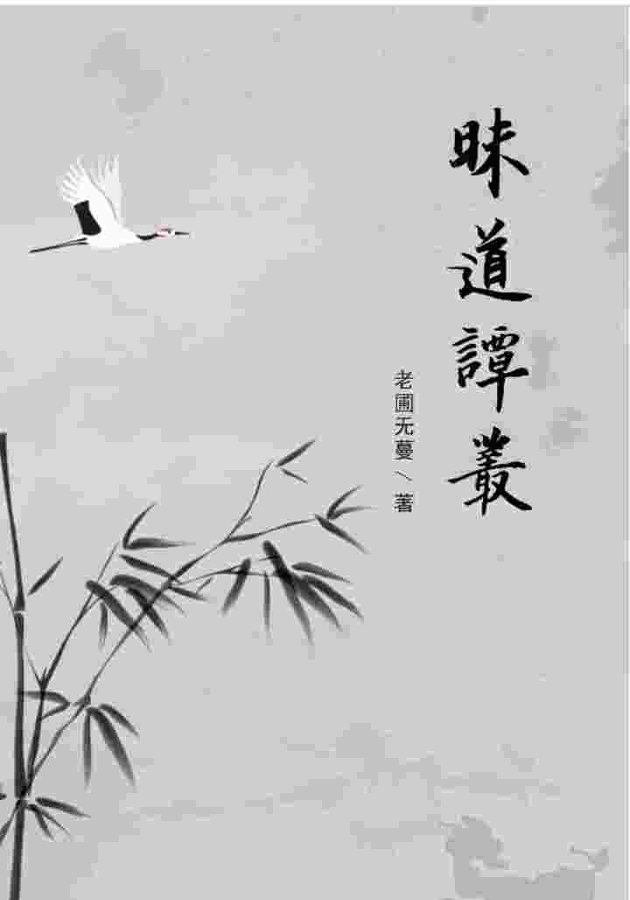

  

[toc]

# **昧道谭丛**

## 1.  前引
### 1.1  有言无言
​       刚工作时，受惠于一长辈，转眼多年未见面，日前相聚，长辈问：在做什么“名山事业”呀？我闻言，一面反省长辈此问是否暗中含有训诫之意，一面老实回答，确实写了些乱七八糟的东西。长辈说，好事呀，可惜我眼睛不行了，否则一定看看。我一时语塞未敢接话。静下来想想，自己几年中写了不少传统文化方面的东西，但要加个限定语，是“自以为是”的传统文化。所写的内容不外三类：知识、能力与内德。但这三类，如果真站在传统文化的角度来看，要么属于“不必说”，要么就属于“不可说”。

​       传统讲“行有余则学文”。“学文”是指学各种知识。行有余则学文，是将德行放在知识之前。有德，并且能力行，还要“有余”了，才谈得上学知识。我们看传统教育，首先重视的是陶铸人的性情，培养人的德行，调整人的心性。等性情、德行与心性都达到了一定的程度，不仅能实行并且还要精力有余了，才开始学习具体的知识或者技能。反观我们现代的教育，从小学到大学，所学的重点全是知识与技能。虽然也开有思想品德课，但思品课的重点并不立足于人的心性与德行。现代教育在一个人心性、德行与人格形成的关键时期，也就是十六七岁至二十来岁的时期，其教育的重中之重是知识、是应试，在知识与应试压倒一切的情况之下，人格与德行的陶铸，被简省到了非常边缘化的状态。大学里面学习的重点是各种专业性质的知识，对德行与品行的教育也不太重视。显见，传统教育与现代教育的根本区别就在于，传统教育以德为核心，德是主干，知与智是枝叶，现代教育是以知与智为核心，德变得可有可无。忽视了德，所以现在的大学生或者毕业进入社会的青年，在人格、心性、德行诸多方面都存在问题。刻薄、自私、狭隘、迷惑、忧郁等等，在很多年轻人身上是非常明显的。这些年轻人在社会上生活三五年，焦虑、抑郁、偏激、逃避以及自闭等等心理上的问题，基本难以避免。我们在“现代教育”中，很容易看到知识越多越傲慢、学历越高越傲慢的现象。傲慢，不仅是在伤害他人，也是在伤害自己，会给自己施加无形的压力。在傲慢的驱使之下，我们害怕自己的所知，少于人或者落后于人，免不了就会去学习。这种无形的压力下，心性修养稍有欠缺，我们很容易变得焦虑甚至抑郁。一旦内在变得焦虑，其人纵然想在知与智上面更上层楼，也不再可能。反之，按照传统文化的教育路子，一个人首先有了容人之量，能有真正意义上的谦德，有老实、质朴、朴素、专注的心性，然后再学习专门的知识或技能，虽然他学习知与智之时，起步较现代教育晚，但后发先至，后来居上或说大器晚成，基本是必然。德与知两相比较，显然应该以德为重。能聊德的时候就不必聊知，知，就后退一位，变为“不必说”。当然，不必说不等于不必学。每个人心性不同，感兴趣的点也不同，在心性到位的前提之下，按自己的兴趣学任何知识，都是既应该，也必须。

​       知识，属于不必说的范畴；能力，也属于不必说的范畴。首先，能力与知识一样，会在德行不到位之时，导致一个人随着能力的提升而同时增长傲慢；其次，观察能力、思维能力、表达能力、学习能力、组织能力乃至领导能力与适应能力等等，这些能力都需要在具体的实践中去煅练，需要在实践中去自己领悟并不断练习，才能有所提高。比如观察能力，能观察到多深？能观察到多广？能否从观察到的内容中迅速提取出要点？能否迅速将要点进行整合处理？这些能力，不经过有意识地训练，是不可能形成相应素质的。所以，对于能力的提升，训练与实践是关键。如果不是有意识自我训练而是拿出来挂在嘴上说，那就会变成毫无实践的“口头禅”。因此，能力，也就属于可以做、可以练而不必多说的范围。

​       最后一类，是内德。知识与能力属于不必说，而内德属于不可说。内德不可说，是因为内德有私人性质。比如有人喜欢臭豆腐，有人讨厌臭豆腐，喜与厌是两种完全不同的内在感受。这两种感受都只对个人起作用，所以是私人性质的。这种私人性质的感受如果拿出来交流，会有两种后果：一是容易产生对立意见与反面意见；二是难免自以为是与自欺欺人。手握话语权的某人觉得豆腐香，就强迫所有人都必须相信臭豆腐香，这就是自欺之后的欺人。
​    
​       内德不可说，包含了三个方面的意思。其一，是没法说，或者说了别人也不明白。拼命对觉得臭豆腐臭的人强调这臭豆腐如何如何香，这觉得臭的人纵然从理论上或许也能理解，但落实到他本身，恐怕他仍然会闻臭豆腐而干呕，没办法实践。“如人饮水冷暖自知”，“自知”二字，就是在描述内德的这种私人性质，这种私人性质，决定了它纵然说出来，旁人也未必真能理解。其二，是不能说。有格言道“一个人的甘露，可能是另一个人的剧毒”。比如养狗的人就知道，巧克力，人吃了觉得是美味，狗吃了会要它的命。适合自己本人的未必适合他人。个人的内德只对个人起作用，不能说，就是为了避免对他人产生不利的影响。其三，内德具有绝对意义上的“不可说”特性。例如，内德在自感、自悟过程中产生的某些内容，很可能是“离语言文字相”的，没有办法用语言文字来表达。虽然有说法是“只可意会，不可言传”，但很多时候我们连“意会”也没办法做到。类似像这样自悟出的内容，就是绝对意义上的“不可说”，用禅宗的套话讲就是“只许佳人独自知”。佛家对内德不可说的理解是最为深刻的。例如，佛法的最高法门被称为“不二法门”，这不二法门在《维摩诘经》中被定义为“于一切法，无言无说，无示无识，离诸问答，是为入不二法门。”所以，绝对意义上的内德，确实是离言说，不可说的。
​    
​       知识、能力与内德，要么不必说要么不可说，那现在我写这文档，又能聊些什么呢？如上所述，是真没东西可聊。但现实是，我们不但要聊，而且还将聊很多内容，这完全是自相矛盾。这种矛盾需要事先说清楚，如下。
​    
​       传统文化中，不管儒家道家还是佛家，都讲求这“道”字。儒家讲道统，佛家讲悟道，道家谋求得道。道佛儒三家，都离不开这个“道”。“道”字的内涵如果展开，那是真正的其大无外、其小无内。如果将道视为无边无际的宇宙的话，我们这些人连宇宙里的一粒灰尘都算不上。一粒灰尘想弄清宇宙的真面貌，这根本就是妄想。明知不可能全面了知，却仍然走在学修传统文化的这条路上，仍然在不断地“求知”，这种行为就好比是我们身处海中，并且自不量力地试图算清海里砂粒儿的个数。这种行为不但痴，而且傻。显然，我们这儿的闲聊，无论聊得多么天花乱坠，也与那个真正的“道”八竿子打不着，至多，是聊了几颗海里的砂粒儿而已，甚至更大的可能，是我们所聊的内容连海里的砂粒儿都算不上。从另一个角度讲，我们无论聊得多么天花乱坠，唯一的作用，就是在向大家展示自己的痴，与傻。
​    
​       那么，能否不犯这痴，也不犯这傻呢？能不能远离文化乃至于传统文化呢？从结果论，这根本是不可能的。因为，人生在世要吃喝拉撒，只要在吃喝拉撒，就决不可能脱离这世间的生活。问题是，世间生活的任何一个方面，其背后都暗藏有“文化”。例如，简单到拿筷子还是拿刀叉这么件事儿，要说没有文化或者传统文化为其背景，那当然不可能。所以，试图不犯痴傻远离文化或传统文化，如同鱼儿想离开水而独自存活，这根本就不可能。如果把传统文化中的“道”视为无边无际的“瀚海”的话，虽然不甘心，但不得不承认，我们确实不可能窥得瀚海的全貌；虽然不甘心，但不得不承认，我们也确实不得不生活在这瀚海之水中。两难之下，无论愿不愿意，我们只得选择继续数砂粒儿，当然，最好也安心于数砂粒儿。既然人人都免不了要数数砂粒儿，那么我们交流一下自己数的砂粒儿，应该是完全可以的。所以，客观上是真没东西可聊，但现实中，我们也不妨花点功夫，聊聊这道海中的一两粒砂。
​    
​       以上讨论了四重意思。其一是，面对传统文化，我们“无话可说”；其二是，虽没东西可说，但不妨就自己所见，稍做交流；其三是，纵有交流，所交流的内容也是微不足道的。说好听点是交流了道海中的一粒砂，说难听点是很可能连一粒砂都算不上，说得再难听点是搞不好还恰恰与道相悖；其四是，要请大家多多包涵。因为所聊内容不但微不足道，而且具有私人性质，未必适合每位朋友，有相反的意见与看法，那是非常正常的事情，没有对立意见，反而不正常。总之，写下这些文字，就是将自己的痴与傻毫无保留地展现在大家面前，不仅眼界局限难免，而且自认为自己所聊是“道海边的砂粒”，貌似自谦，实则仍然是狂妄。所以，首先请大家多多包涵，再敬请大家，多多指正。

### 1.2  立场

​       “年年岁岁花相似，岁岁年年人不同”。有史以来，按每二十年一代人为标准进行计算，这世间已经不知道有多少代人来了又去了。用文学手法来表达，对每一代人恐怕都可以说：来过、活过；笑过、哭过；思考过，实践过……如果说，现在我们眼前的文化中融汇了每一代人留下的痕迹，想来没人会反对。那么，我们如何来看待这些流传下来的文化？又如何来学习这些文化？这需要事先确定我们的立场与态度。
​    
​       某天，我闲极无聊，坐在院子里的树荫下一面乘凉，一面胡思乱想。想来想去也没有想出啥名堂。无意间我盯上了十多米远处的一堆垃圾，于是看到这么一幕：一只小狗、一只小花猫和几只小鸟，都在那堆垃圾上面翻啊翻。它们翻得很认真。不一会儿，小狗乐颠颠地叼着一小块骨头跑开了；小花猫也突然衔了什么东西跑掉了；听那几只小鸟吱吱喳喳的高兴劲儿，估计它们的收获也不小……
​    
​       于是我瞎捉摸：这哲学，果然是“很有用”啊！你看，对于已经被淘汰了的事物，居然不同的角色都还能从中间找到自己所需要的东西！这就是所谓的“取其精华，去其糟粕”吗？问题是，对小鸟儿来说，骨头绝对不会是精华吧？而鸟儿喜欢的几粒剩米或小虫子，对于小猫小狗来说，恐怕也不是精华。可见，不同角色，它们的视角、认识不同，从垃圾中能找到的精华也就不一样。如果角色再多一些，推而广之，甚至可能找出完全相反的东西来。而找出东西来的每个角色，都认为自己找的才是真正的精华。那么，当这些角色聚在一起之时，对精华的认识不同，要相互争论，要打一打口水仗，那基本是不可避免的。奇妙的是，我作为旁观者，反而对他们每个角色的行为都能够理解。
​    
​       显然，这哲学在谈到对待各种老、旧事物的态度之时所提出的一系列思维方法，如“在批判中继承”“批判地继承”“取其精华，弃其糟粕”等言论，完全就是“正确的废话”。以现在人们对待传统文化的态度为例，你觉得是精华的，他可能就觉得是糟粕。在面对类似情况之时，每个人都会有自己的判断与选择，而且每个人都很容易无意识地就进入“自以为是”的状态，认为只有自己知道的，才是精华。所以，“取其精华，弃其糟粕”之类的大道理，一旦落实到实际操作之中就会变得毫无意义。
​    
​       至少在理论层面上，类似上述这样的空话还有很多。再如“具体问题，具体分析”。好吧，如果那只狗走到垃圾堆旁边后，先来“具体问题，具体分析”，把各种东西分门别类，搞清每类东西的形、色、质地、化学成份等属性是什么、作用是什么、内涵是什么、外延又是什么，然后再演绎、再归纳、再推理……我想，如果它真这么搞的话，恐怕最后它会把石头给吞掉而且还觉得理所当然！可能大家会笑，而现实中这样的实例可举出很多！随便举两个：古代“三皇五帝”之一的大禹，被顾颉刚先生从考据的角度证明为是条“虫子”。我不知道顾先生是真相信自己的证明，还是故意用这样的证明来讽刺当年学术界那种刻板的考据之风。不管怎么说，这个事例确实就表明了一点，那就是“具体问题，具体分析”用于实践依然是句空话。辜鸿铭先生钻研学问，“具体问题，具体分析”之后性情古怪到匪夷所思，他那个“人不下跪，长膝盖干嘛”的高论，就实在让人瞠目结舌。类似这样的事例，当然也就是“吞掉石头而觉得理所当然”。
​    
​       其实，不仅仅是对待老旧事物，对待新生事物，人们往往也是各有立场，也就各有结论。比如对待网络与现代信息技术，我曾看到有研究人员的一篇报告，用极为翔实的数据进行对比，证明现代信息技术进入课堂，在教室里使用投影仪、电子白板，让学生使用平板电脑上课等等，是当前学生近视率猛增的罪魁祸首；滑稽的是，事隔不到两天，我又看到另一篇研究报告，用极为翔实的数据进行对比，证明现代信息技术进入课堂，学生吸收新知识的时间缩短，用眼时间缩短，能有效降低学生的近视率，而造成学生近视率升高的罪魁祸首，在这份报告中变成了是人们饮食习惯、营养结构与睡眠习惯的改变。在这个所谓“大数据”、“数据为王”的时代，两种完全不同的基于数据而来的结论，只能让人感到，这些什么数据哟、统计哟、图表哟，也是会骗人的。我们经常说“没有调查就没有发言权”，以上两结论，都有调查，但为啥结论完全不一样？“没有调查就没有发言权”这句话或许不是空话，但在上述两个例子中，不是等同于空话了吗？
​    
​       事实上，来源于我们生活中的种种论调、种种观念、种种理论、种种经验……早已把我们的两眼给糊弄得严严实实。如果大家拿各自不同的看法与观念等相互攻讦，那也就等同是小狗与小鸟在争论什么是精华。如同臭豆腐，有人感觉其香得令人流口水；有人感觉其臭得令人想呕吐。流口水或想呕吐的感觉，用在每个人自己身上，说是事实也行，说是自欺恐怕也不错。可怕的是，硬要说自己的感觉才是“真理”，不但自己“确信”，还强迫其他人必须像自己一样“确信”，那么，旷达点评价，这种行为只是有些固执与滑稽；严厉点评价，这种行为就不仅仅是自欺，而且是在欺人了。显然，现在我写下这些文字，是不敢也不能，拿自己自以为是的对传统文化的认识与理解，来欺人——我希望能在立场上、态度上，首先立定自己的脚跟。我选择的立场与态度，如下。

>​        1、旁观。因为旁观者往往最清醒，更能看清事物发展变化的真相。“不识庐山真面目，只缘身在此山中”，作为局内人的小狗小猫小鸟，确实可能会为什么是精华而产生分歧，但作为旁观者，自然能明白他们每个角色的选择。当然，我们这里说的旁观，不是“袖手旁观”，而先通过旁观弄清来龙、弄清去脉，然后再“择其善者而从之”地运用于实践。换言之，旁观，是为了最终的“致用”。
>
>​        2、去掉“先见”。人上一百形形色色，有人喜欢儒学，也有人喜欢佛学、道学或者科学等等。所学不同所见当然有异，如果不预先去除自己“先入为主”的一些观念，那阅读本文，难免会有无形的障碍。

​       旁观与去掉先见，其实是相辅相成的。只有去掉我们自己的先见，才可能做到真正意义上的“旁观”。一个人是否能彻底地做到“旁观”，其实只问一个问题就可判断出来，这个问题就是：你觉得你自己是在旁观，是个旁观者，那么，你有没有潜在之中正在评价`（例如正在评价当前这文本）`，这种评价是否是潜在的傲慢？这种潜在的傲慢背后有没有一丝狡猾？有，就不是真正彻底的旁观；没有，那就是真正的旁观。如果一个旁观者背后已经没有那一丝隐藏的狡猾了，我们就要向这个人道喜了——用传统的话来说，这起码是“见道”了。

### 1.3  形式

​       当前我们能看到的对传统文化进行研习的形式，主要有两种。以下先聊这两种形式，然后再聊我觉得更合适一些的形式。
​    
​       对传统文化进行探讨，常见的方式有两种。第一种，是基于传统文化已有的典籍，对其内涵与外延进行阐发。这种方式有一定的自由度供主讲者发挥，但大的基调与方向，几乎是必须按照前人的轨迹亦步亦趋。传统私塾先生走的就是这条路子。这种形式的优点，是句句有来历，句句有出处，言论不会越雷池。但这种讲法有两个弊病，其一是老生常谈、难有新意，四、五十岁的人可能听得进，二、三十岁的人恐怕就很难听进去。第二方面的弊病，是传统文化毕竟已有好几千年的历史，各家各派的核心典籍，任何一句话甚至任何一个字，都早有无数前人做出了无数解读、阐示与发挥。我们逐字逐句去解读经典，就算彻底弄清了经典的字面意思，彻底搞清了经典文本上的意义，那也是“只知其然，而不知其所以然”。经典能站得住脚，能经得住历史的考验，是因为经典背后有着对社会、对时代、对人群思想等等的深度理解与准确把握。这种理解与把握，是经典能站得住脚的真正根源。如果只了解经典的文本意义，不了解其背后的“所以然”，不了解经典的“根”，那么一旦把经典中的教训用到现实中，生搬硬套与食古不化将很难避免。
​    
​       研讨传统文化的第二种方式，是基于传统文化的基本思想，结合现代社会以及人群的时代特征，以“古为今用”为指导方针，力争从传统文化中找到能救治现代社会病、文明病或者人类病的“药”。这类讲法多少有些“崇古心理”，内在中有先见，认为传统文化能包打天下，包治百病。很多确信“老方子能治新病”的人就是这样搞的。但不是“平常心”的“崇古之心”，会为自己的眼睛戴上有色眼镜。在这种有色眼镜的影响之下，看古的东西认为好得不得了，看今的东西，就觉得越看问题越多。当然，也有很多人觉得“外国的月亮比中国的圆”，戴的是完全相反的有色眼镜。总之，有色眼镜让人无法看清事物的真相，真相看不清，无论是崇古还是贬古，言论就多半会成为不切实际的纸上谈兵。其实，这种方式真正的危害还不是“纸上谈兵”，而是崇与贬的精神状态，很容易被别有用心的人利用，这是非常危险的。
​    
​       上面聊到的两种形式各有利弊，下面说说我想在本文中采用的形式。
​    
​       打个比方，我们教小孩子折纸飞机，把过程步骤讲得再多、再细，小孩子也未必会折。最简单的做法，是让孩子亲自动手折一次，他就啥都会了，甚至他还可能在“会”的基础之上，万变不离其宗地去“创造”纸飞机的其他折法，当然，只要能飞起来就算成功。如果我们自己本身都不会折纸飞机，而是拿一本折纸飞机的说明书，逐字逐句去挖掘内涵、分析外延，恐怕孩子听得一头雾水很不耐烦不说，我们自己也会被搞得昏头昏脑。所以，我在撰写本文时，尽量不拘泥于固定的经典，以预防“先见”与“拘泥”，我们先把经典中的教训全都放下，把自己身上已有的武功都先废掉，把自己一肚皮的学问与知识都先倒掉，我们把自己当成刚开始观察世界、刚开始认识世界的小孩子，然后大家像小孩子一样来尝试着思考：什么是天？什么是人？什么是人群？什么是社会？在人群、在社会中的相处之道如何？我们一边思考一边总结，很可能总结出一些具有规律性与原则性的东西出来。如此，我们在实际践行传统文化的时候，不管形式上再怎么变，我们也不会是“纸上谈兵”，这纸飞机肯定能飞起来。说穿了，我试图使用“归纳法”来撰写本文。前述私塾先生式的讲授，或者“古为今用”式的阐示，那是“演绎法”。归纳法显然费力不讨好，容易陷入琐碎，但若真得出了结论的话，其说服力应该更强。演绎法更倚重个人的学识、才华、修养，但一不小心就会陷入“自以为是”，我不想拿本经典来照着讲，就是担心自己的“自以为是”会对大家产生误导。

### 1.4  宗旨

​       “花有重开日，人无再少年”。纵然人寿百岁，说来仍是白驹过隙，弹指间，也就过去了。糊里糊涂来到这世间，又糊里糊涂离开。这来之与去，究竟有何意义呢？若说没有意义，则何必到这世间来走一回？若说有意义，则上穷碧落下黄泉，实难追寻出意义何在。放下“人为何而生”这样大到无法回答的问题不谈，无论主观上愿不愿意，我们只能做出一个无可奈何的选择——“既来之则安之”。既然已经生而为人，也就只能安于这既定的事实。但是，要做到这个“安”字，却未必是件容易的事。
​    
​       禅宗第二代祖师慧可向第一代祖师达摩求安心法门，达摩让他“将心来，为汝安”，慧可“觅心了不可得”，达摩说“为汝安心竟”。这几句对答看起来很简单，似乎不费吹灰之力就能安心。但事实却是，慧可年老之后，游走于酒肆屠门，旁人诃责他，他却回答“我自调心，与汝何干？”前面觅心了不可得，后面突然又有心需要调；前面“为汝安心竟”，已经安心完毕，为何后来还需要调心？可见之前这心，未必如达摩口中所说的那样“安心竟”。慧可这种知与行的前后矛盾，说明那两个最根本的问题，并没有真正被解决：心，到底有没有？心，到底如何安？
​    
​       上例，只想证明要做到安心二字，并不容易。至于到底有没有心，这个问题基本等价于“人为何而生”，也是个大到难以回答的问题。有理论说“有”也有理论说“无”。若有雅兴去仔细推敲，会发觉说有说无双方，都拿不出具有决定性的实据。对此，我们只能不求甚解，再次以无可奈何的态度，选择安于常理与常情，即，还是认为人，是“有心”的。毕竟，说“觅心了不可得”的慧可，到老来还在“调心”嘛。很多道理都与慧可说的“觅心了不可得”一样，真的是说说容易，一旦需要落实到实际操作之时，就会立马变成另外一回事。不过，这里需要特别申明：我们在这里拣择了“有心”，舍弃了“无心”，并不表明选择无心就是错的。我们这里拣择“有心”，仅是从常情出发所做的选择，并非否认“无心”。
​    
​       语云“一波才动万波随”，或曰“牵一丝而万缕俱随”。承认人有心，这就等同于是承认了人有命运、有善恶、有寿夭、有智与愚、有着从这个“心”字所生出的种种……套用佛家的术语来说，是等同于承认了“有人、有我、有众生、有寿者”，与“无人、无我、无众生、无寿者”相比，在某些人眼中就似乎要显得“低端”一些。还是刚才那句话，有些道理是说说容易，或人人都会说，但要落实到“做”或者“行”，则终归得脚跟点地。所以，承认低端，是“做”或者“行”的起点。承认有心，则修心、正心等概念乃至行为才能成立。刚才说到，承认“有心”等同于是承认了人相、我相、众生相、寿者相，那显然，扫除人相、我相、众生相、寿者相，就等同于是在否认“有心”。所以，立足于“有心”，则“善用”或说“用好”人相我相众生相寿者相，就是修心或者正心。之所以要强调这点，是因为很多人认为修行是“大扫除”，走的是“时时勤拂拭”扫除“一切相”的路子。这条路子虽然也不失为一种修为自身的方法，但未必最善。善用种种相，或将种种相用到最善，应该更接近我们这里所说的修心、正心的本质。
​    
​       修心、正心这样的概念能成立，再扩大一步，则我们修为自身的思维、思想、念头、情绪，调整我们的脏腑、骨骼、筋腱、经脉，修正或者训练我们的饮食、起居、言语、逻辑乃至改变我们的外貌、神态等等，这才师出有名、顺理成章。若一来就唱高调“无相、无我”，则上述这些调整、训练、改变，岂不都成了无事生非？
​    
​       那么，本文的宗旨已然建立，那就是两个字：有心。或者可以扩大了说，是：有人、有我、有寿者、有众生，乃至有寿夭智愚等等。而宗旨所指向的目的，是一个字：安。也就是说，我们后面讨论的一切话题，都将围绕安心二字展开，最终的目的，是为了心安。

## 2.  求道

​       有云，年过四十人会变得唠叨。似乎确实如此，自感近年来说话，经常不能把语言集中于所想表达的内容上。老，当然谈不上，但人生百年已过小半，一想到逝者如斯，就还是有些感叹。感叹，往浅里说，是心有所动，有细微的情绪在流动；往深里说，是沉甸甸的两个字压在心底，不感叹都不行。这两个字，当然是“人生”。
​    
​       生而为人就各有禀赋。据说，老天也是势利眼，在赋予人这禀赋的时候有厚薄之分。得天独厚的人，是“不知不识，顺帝之则”，乐乐呵呵就过了一辈子。乐乐呵呵的人，当然无忧无虑，他们不会去考虑什么“人生”之类的问题；天赋薄的人，如我，无事，就必定会生非。记得是十四五岁时某天，百无聊赖而胡思乱想，突然就觉得这“人生”二字是个非常严重的问题，想知道答案，于是不得不思；思而不可解，就不得不学；一学，就如同片叶飘入大海，没过多久就让我感到，追问这人生之道，实在是既漫无边际又漫无方向。因为，这人生或者人生之道，从古、今、中、外四个方向去探寻，完全是“公说公有理，婆说婆有理”。假定只有唯一的一条道路才是“真实”的，那么如此之多的说法，让人根本搞不清到底谁的说法更接近于真实。总之，为解决内心的疑问而向外求学，其实让我更为迷失。
​    
​       这种迷失状态一直持续。直到又是某一天，突然反省，我的毛病，是想找到那条“唯一真实的”人生之道。人类历史已经几千年，千千万万的人早已提出过千千万万条道。道有千千万万条，不是恰恰证明没有“唯一”吗？道有千千万万条，要真实只能都真实，要虚妄那就全都是虚妄。如此一想，突然就觉得心里轻松了许多。不过，轻松之余，迷惑仍在。因为回到自身，我依然不知道自己这辈子应该选择怎样的一条道。每一种选择的背后，都有欲望，有得失、有观念等等在暗中起作用。欲望越多，观念越多，就越容易患得患失，选择就越加困难。这种“选择困难”的症状又持续了好几年。等我意识到，要作出选择必须尽量减少欲望，要做出选择必须尽量避免“观念”暗中捣鬼，要作出选择必须尽量去除得失之心时，原本千千万万条道，突然就减少到只剩几条。因为，千千万万条道中，一大半，都是在增加人的贪欲、增长人的观念，但有为数不多的几条道，本身就是要人减少欲望、淡化观念的。例如，减少欲望的，有“为道日损”的道家之道；淡化观念的，有“应无所住而生其心”的佛家之道。
​    
​       反思那些增长人的欲望、增加人的观念的道路，我就觉得那些道路是在自掘坟墓。因为，人的欲望与观念越是增长，患得患失的心态就会越严重；患得患失的心态越严重，人就越会陷入“选择障碍”，越是无法做出自己的选择。那么，那些增长人的欲望与观念的道路本身，迟早也会被这样的人抛弃。如此想来，我当年追求“唯一真实的道”，虽然真实二字未必算得上，但确实有了“唯一”：尽量减少欲望，尽量去除观念、认识、得失等等。这样的道，不会自掘坟墓，能够稳固，能够自圆其说——虽然这种“自圆其说”多少有些自欺的嫌疑。不过，这样的道，最好也不要冠以道家或者佛家这样的名号。因为，名号背后往往尾随着如山的观念与理论。不求其名，离观念与理论远一点，或许这样反而是得其“实”吧？
​    
​       终归还是天赋薄，绕了一个大圈子，还是不能像“不知不识，顺帝之则”的人那样乐乐呵呵地过一辈子。不管对老天的这种安排是服气还是不服气，现在，我只能知位守位，安于自己为自己选择的“尽量减少欲望，尽量远离观念与理论”这条道。这条道实在不光鲜，既无诱人的前境如逍遥、解脱、极乐、天堂等；也无华丽的装饰如慈悲、平等、大爱、狂喜等；更无炫世、惊世甚至欺世的什么。总之，这道很土气。想一想，自己打出娘胎，其实身上一直有这种土里吧叽的笨拙气味。最终走上这土气的道路，莫非是从娘胎里带出来的必然结果？自我麻醉也罢，自我陶醉也罢，每每这样想来，心里莫名其妙就有些飘飘然，居然也能乐乐呵呵地、积极地“做一天和尚撞一天钟”了。

### 2.1  所守

​       写下本小节的标题，是“守拙”，但稍一想就推翻了这个题目，改成了“所守”。原因，是想到拙与巧同根，说守拙就等同于说弄巧。巧与拙是形容词，往往用于评价。对事物进行评价，要客观，就应该由旁观者来做。自己对自己进行评价是为了有自知之明，但将自我评价向外公开，浅言之是显摆，深言之是傲慢。所以，将守拙改为了所守。至于所守是巧是拙，就不想再追究。
​    
​       上节，聊了我自己为自己确定的道，末尾用了自我评价，是“土气”。这其实是想弄拙成巧。如上论，自我评价为土气，暗中有显摆意，而真正表现出的心理状态，是傲慢，是自嘲，当然，还有几分苦涩，苦涩源于对天命的无可奈何。但不管怎么说，写下“土气”二字时，是有小巧心思，说明自己内心还是不老实，所以，还需要自我反省。
​    
​       如果用钻牛角尖的方式思考，会觉得任何一个人的任何所行，其实都是无所谓智愚巧拙的。如同一棵草，其实我们无法去评价它长得巧或拙。评价，是人意识中根子很深的习气或说惯性。如果深挖，那么评价的背后，跟随有选择；选择的背后，跟随有欲望；欲望的背后，跟随有观念或者认识。前面说过，欲望与观念是让人迷失的源头，那显然，评价，就是这种迷惑与迷失的外在表现。概括说就是：越喜欢评价越擅长评价，恐怕也越容易陷入“选择困难”；越喜欢评价越擅长评价，恐怕越加证明，这个人实质上处于迷失之中。
​    
​       我不愿陷入选择困难，对于自己的“所守”是否应该说出来？我不经大脑就选择了说。但如果深究，就会觉得这行为实在有些荒唐。因为，金玉珍宝未必家家都有，但拖把抹布肯定是户户皆备。若人，家有奇珍，本着奇物共赏之心拿出来供人品玩，观者开眼长见识，主人家也高兴，这当然是两全齐美之佳事；若有人拿些锅碗瓢盆出来，也当成奇珍一样非让人欣赏不可，这恐怕就是傻气。反观我的行为，其实就是如此：我天赋薄，不是不想而是无力与人争上游，自甘下流不说，还为自己找理论根据曰这是我的“道”！这不仅是傻，而且是妄。现在再将这近于妄的“道”拿出来张扬，非让别人欣赏不可，那就罪加一等，从妄，进步到了狂。显然，无奇珍可耀，不狂，不妄，那就应该收拾好自己的锅碗瓢盆为是。理虽如此，但总是忍不住，想拿出一把扫帚或者两块抹布给人看看，想听人赞一句“这是真奇珍”，这显然还是心中有狂妄。言行不一，只能说明自己修养差得很远。总之，说到底是守不住，实在愧对这小节的名称。

### 2.2  弯路

​       一位二十来岁的朋友聊《易经》测算，我不吭声。他唱了会儿独角戏后问我，易经测算，你怎么看？我说，我不信。他有些吃惊，说，没想到你会不相信。我说，你信，这很好，你活得有乐趣嘛。
​    
​       常情，人都希望自己人生一辈子平平顺顺，不喜欢有曲折。但登山游玩的游客就不同，曲折越多、风景的变化就会越多，心情从疑无路到又一村，可品味之处就更丰富，也更有乐趣。歌曲里唱“这里的山路十八弯”，面对十八弯的山路居然有一种兴奋、有一种自豪在里面，这种心态很有意思。人生之路如果也十八弯，我想，对绝大多数人来说，那真的会苦不堪言。学易经，如同登山观风景，确实三步一变，七步一景，一旦钻进去就乐趣无穷。不仅学易经如此，恐怕学任何东西都如此。总之，能在学习中找到乐趣，未尝不是人生的一件快事。回想自己三十岁之前，也是勇于相信，不仅信，而且学；不仅学，而且钻。说乐趣，当时还不太感觉得到，但至少自己过得很充实，因为有目标，有一个笼统的计划，每年每月有要看的书，有要考虑的问题，心无空闲，也就充实。等我决意要“减少欲望、淡化观念”之后，表面看，是自己立定了自己的“道”，但从另一个角度看，至少是失去了“学习”的目标与动力，生活逐渐就变得枯淡起来。这个时候，才意识到当年勇于相信，喜欢钻牛角尖，其实是很有乐趣的。夜阑静思，就觉得这如同悖论：如果为乐趣而学，那就没有追究极致、追究真相的必要，满足于学习过程中的乐趣即可，但未臻极致，总是遗憾；如果为追究极致，追究真相而学，则学习的过程很可能不再有乐趣，会变得枯燥甚至寂寥。这学，多少就成了件苦差事。要命的是，还有很大可能，是追究到极致，突然发觉这门学问也不过如此，甚至可能这门学问根本就不成立！失望大于希望，没有了乐趣不说，还可能让人的内心产生挫败感。这很奇怪，按常理，达到极致应该有成功的满足，但在追究人生道路的问题上，与极致相伴的往往不是满足，而经常是寂寥、挫败，与无奈。
​    
​       上面这几句，貌似稀松平常，其实中间有很大问题。不追求究竟，仅为乐趣而学，最终很容易陷入某学术，变得拘泥、狂妄、混乱。不仅仅是学易经、学佛、学道会如此，就连学世俗技术也会如此。以学编程为例，一旦陷进去，很容易固执地认为某编程语言甚至某编程工具天下无敌，这状态，很滑稽；追求极致，非弄清某学问的根柢不可，则很可能最终感觉“不过如此”。失望大于希望，衡量自己在学习过程中的投入，就会觉得不值。求，而所得不值，甚至可能无所得，这多少就有些可悲。某种意义上讲，我们在动心“求道”的剎间，就意味着自己在为自己的人生道路增加曲折，走弯路，基本是必然。弯路必然、上述的“滑稽”与“可悲”也是必然，两害相权取其轻，我们还是让自己多一点登山观景的心态算了。

### 2.3  绕圈

​       我们这代人是接受现代教育成长起来的，年轻时勇于相信，在追究人生的真相之时，一开始是相信科学。等花时间大体上了解了诸如量子论、混沌论、相对论、超弦理论等等现代顶尖学说之后，感到这些东西依然无法解释“人为何而生”与“人生为何”的疑问。于是，掉转方向开始追究哲学与宗教。年轻气盛加上不知天高地厚，想，一切哲学与一切宗教，背后肯定有一个共通的东西，或者说，背后肯定有同一个根源，如果找到这个根源，就能解决一切疑问。在这种自以为是的潜在观念驱动下，东方的儒释道加上婆罗门与印度教，西方的天主教、耶教与回教，只要是能找到的资料，都感兴趣，也都看。光看不练不是好汉。由于儒释道耶回中，都有针对人的精神与心理进行调整与训练的技术，要知道其底里，就必须实践。于是乎，诸如数息、观想、丹道……甚至还拐弯抹脚找到伊斯兰的什么苏菲圣光派训练哈里发的一套方法，总而言之，是只要见到的，就都尝试一番。
​    
​       深挖这种尝试行为背后的根源，可聊的有两个方面。其一，是信与疑并存。说“信”，是对所有方法都有信任，觉得确实可以通过这些方法，达到某种常人所不能达到的状态，比如解脱或者逍遥。说“疑”，是具体在实践时，像猴子掰苞谷，五心不定，今天这方法、明天那方法，每种方法似乎都有独特的诱人之处，所以总在各种方法中取舍难定。取舍难定，当然就是内心有疑。信也好，疑也好，说来都源于一个东西，就是贪。其二，这种尝试行为背后潜藏有极深的傲慢与我执。因为，自己之所以会去追求种种方法，目的就是为了达到别人所不能达到的境界或者状态，这种追求，本身就是欲望、傲慢与好胜的表现。自身无论是心态还是行为，其实不知不觉中已经背离了自己想明白“人为何而生”的初衷。当对各家各派种种理论与方法略有所知之后，所知的这些东西，已变质成了自傲、自大、夸耀的本钱。由于存在这两方面的问题，所以，走上弯路，已经是必然。
​    
​       说到底，上述的胡乱尝试，是瞎子摸象加囫囵吞枣式的，显然不可能有成果。但不知不觉中，自己的心里面已经被埋下了毒刺。这根毒刺就是，莫名其妙地觉得，透过种种乱七八糟的修为理论与方法，背后似乎真能看到一个若有若无的什么奥妙或者终极意义。在这根毒刺的驱使之下，有那么两三年，我胡乱折腾地特别来劲儿，但始终钻不透中间的奥妙。折腾了两年，不得不认输，感觉凭自己的力量是不可能搞清楚这些东西的，于是，就有了要寻访“高人”的念头。念头变为行动，约十七八岁至二十二三岁，五六年间与朋友一起如无头苍蝇般乱拱乱蹿，四处寻访。
​    
​       乱蹿之初无经验，所遇，一多半是看相算命之人，其中个别人利用外在形式骗人的水平极高，另有个别人驾驭语言的能力超强，利用语言骗人的功夫极深。术业有专攻，这些人察言观色的本领确实高过于常人，哪怕是瞎子，他只要听你说几句话，就能把你的状态猜得八九不离十。但整体上看，这些人大多都粗鄙僻陋。很值得人警惕的一个现象是，看相算命的人中有相当大一部份，其贪吝阴毒远超常人。以至于我后来胡思乱想，觉得这些人是先就心思阴毒贪吝，才会遇到瞎眼跛脚之事，也才会在瞎眼跛脚之后，走上看相算命的路子。不客气地说，但凡搞看相算命的人，心性或德行，或多或少都存在问题，至少我个人，还没有看见例外。总之，用易经进行占卜，以我的经验看，是根本就没那回事。所谓“信则灵”，如果要自欺，认为有这回事，那么对这个自欺的人本人而言，还就真的有这回事！不过要特别指出的是，认为有这回事，于己、于人，都不会有丝毫益处。知白守黑，还是守住“不信”为好。可能这段话会让人感到费解，但要知道，信或不信，都取决于人的心，在这类问题上人的选择，会反映出的是这个人内在真实的见地。
​    
​       这里想特别插句话：搞算命占卜之术并以此为生的人，多半文化程度不高，甚至很多人，如算命的瞎子之类，根本就不识字。但有些文化程度非常高的人，将其奉为神明，这实在让人觉得既荒唐又感叹。结论就是，人内心的贪欲、思想的偏狭以及思维中的自以为是，与一个人文化程度的高低确实无关。这些东西有市场、能一直存在于世间，就是因为人的我执、我见，难以根除。这也从另一个侧面说明，文化程度再高，心性修养不够，我执过于深重，这人迟早会出问题。
​    
​       如苍蝇般胡拱乱蹿所遇的少半，是一些神神叨叨的人。这些人所操之术，说骗术的话，可以说是百分之百。不过，这里说的百分之百，并不表示他们故意在骗人，恰恰相反，这伙人中很大一部分人，其实是非常真诚地相信自己那套“术”的，甚至有人将自己所操之术，看得比自己的命还重要。他们使用这些术，除了挣钱吃饭的目的，多多少少，也有济世活人的心思。所以，这类人中有个别，还真不好就定性他是骗子。这样的人活在一种虚幻的精神状态中，觉得自己是有“真本事”的。换言之至少其本人，确实不认为自己是在骗人，而是真以为自己是在凭自己的能力帮别人。处在这种状态中的人，既有值得人同情、可怜的一面，更有可怕与危险的一面。与这样的人打交道，心性与见地上稍有欠缺，就很可能被他的思维方式传染，这将极其危险。这类“神人”中，也有两三人知道一些道家或民间修炼之法。一位，是自己也没实践过，但讲原理讲方法，却讲得头头是道；另一位，开始是死活也不说半个字，后来虽然说，但经常改口，一天跟一天说的不一样，几乎每天都在否认掉自己前几天所说的，让人感觉他其实是在玩智力游戏，我们实在无法建立起坚定的信心。年轻，无耐性且有脾气，时间一长，我与朋友也就不再登门。
​    
​       前后那几年，对我与朋友来说其实非常危险，稍有不慎，不仅是上当受骗的问题，甚至可能会有更严重的后果。现在想来真是万幸，因为，看相算命与占卜那套，朋友没啥兴趣，我有兴趣，所以经常是我听进去了，朋友不以为然，他从旁敲打，结果我也就没有深陷；而神神鬼鬼那套，朋友又很有兴趣，不仅有兴趣，而且还时有灵验，但我偏偏又经常看出其中有问题，结果好几次也是把朋友从悬崖边上拉了回来。总而言之，向外乱寻乱问，依然没有结果不说，乱七八糟的东西倒知道了不少，随着知道的乱七八糟的东西越来越多，心里面反而是更加迷闷。再后来，由于连续出现严重问题，我们胡访乱问终于告一段落——
​    
​       最开始，是一位朋友平时说话做事就有些离谱，后来突然显示出一些所谓的“神通”，并号称自己是外星人转世到地球，知根知底的朋友，觉得他已走火入魔；不知根底的人，看到他显示有神通，就视其为“高人”，将其捧得很高，他与这伙人纠集在一起弄出了一大堆无法解决的问题。几年之后，他爸、他哥，才下决心将其送入华西医大心理卫生科，结果心理精神科也拿他没招，他只要一出院，就还是继续在外面胡说乱搞。万般无奈之下，他哥强行将他送去了地偏人稀的乡下。另一位，是自认达到了飞升的程度，在从自家房顶飞向隔壁之时，失足摔死。由于我平时经常与这二位聊天，周边朋友就将这二位出的问题归罪于我，认为我在他们面前胡说了什么东西。我根本没法辩解，这在很长时间内对我的心理有严重负面影响。其实，飞升的那位，恰恰在之前一个月还托人带话问过我，我当时就对所托的那位说：你务必要转告他，他已经走上了邪路！叫他过来跟我面谈！结果我当时有傲慢心态作祟，潜在中有标榜自己是“正道”的夸饰之心，所以说话语气过于刻薄，带话人觉得我原话“太伤人”，就没将我原话转告其人……而“外星人”就更不用说，我几乎是每次见面都在责备他，让他少出去惹是生非，但外界那伙人捧他，他很享受那种感觉，结果是每次见面我指责他，他都满口称是，一转头就照旧我行我素。现在想来，他本来就有几分自卑心理，如果我当初不是经常指责他而是适当鼓励或者称赞一下他，可能他就不会需要再跑到外人面前去获取自信，如此，或许他也不会落到那糟糕的圈子中去……但不管怎么说，这两位是活生生的反面教材，对我、对朋友，是敲响了警钟。
​    
​       飞升事件发生的当年暑假，我与朋友外出登山。傍晚，坐悬崖边聊天。平时本来一直很忌讳聊的，但那天不知从何说起，就聊到了所谓“神通”力量的来源。我听他一说就如被雷击，双腿控制不住地乱抖，差点一屁股就栽地上。我俩的外在表现，状态一模一样，但他说出来他的“心法”，与我的状况，完全是驴唇不对马嘴、没有半点关系的两回事。我把我的情况说给他听，两相印证，他也彻底懵了——完全不同的两种形式生出了完全相同的效果，那么，这两种东西肯定不是根本！也就是说，我们俩内心深处各自倚仗的东西，都是虚妄的，都是假的。
​    
​       登山回来的半个多月间，我处于半崩溃状态，朋友也一样。原因很简单，就是自己所“信”的东西，自认为是“根本”的东西，突然倒塌掉，某种意义上讲，是自己的心死掉了。虽然在此之前，自己内心深处若有若无还是有一丝怀疑，但等到真正证实这一切皆是虚妄之时，这种打击还是难以承受。自此之后，我与他不约而同，心性发生了巨变。这段经历我一直深藏心底，连在家人面前也从未提起。家人，除了知道我打读高中时起，七八年间，家里几乎天天人来人往高朋满座，然后突然之间就不再有人登门之外，并不知道我身与心发生了什么样的变化……其后的一两年，我处于极度逆反的状态，任何人提任何与传统文化有关的东西，我都破口大骂。等到冷静下来，将问题归结到自己身上，认识到是自己的贪欲、好奇心与好胜心害了自己之时，已是二十四五岁左右。
​    
​       又隔了两年，由于心性有变，所结交与认识的人也就不同于已往，没想到居然在此时有了机缘，我登门求教于一位先生。这位先生是后来结交的一位朋友的父亲。由于先就从朋友处知道先生有传承，真人面前不说假话，我把自己的情况都作了坦白。先生听完，就开始讲一个相当长的故事。虽没明说，但也能猜出他讲的其实就是他自己年轻时的经历。先生的故事，时代不同，人不同，事不同，理论体系不同（`甚至可以说，理论体系恰是相反的`），人出现的状态也不完全相同，但实质的原理、背后的原理，仍然跟我与朋友当年出现的状况相同。这等于是再次从另一个完全不同甚至相反的理论角度，“证明”了我与朋友当时的状态确实有问题，但这状态背后的道理、原理，却是一致的。这个证明，让我内心坚固起来，有了从另一个视角去审视一切宗教、一切哲学、一切思维运动的把握。最后，先生说：你们的言语行为包括思想，其实是中了“书毒”，多操心一下柴米油盐可解书毒。我与朋友听从先生的建议，开始远离哲学，远离宗教，远离神秘，先将精力转向到自然科学方向上来，然后再慢慢落地，转向到日常生活中去。
​    
​       以上内容写得较简略，也较抽象，简省掉了一些本该说清楚的内容。因为有些东西知道了对人没有丝毫好处，所以不得已做了简省。能读明白的人自然能读明白，读不明白的朋友也请不要在意。
​    
​       将自己的精神转向，注意力回到了日常生活，不得不承认，从自己动心“求道”开始，其实是绕了个圈儿，又回到了原点。或者换种说法，是本来自己想超越或跳出所谓的俗世，结果绕了一圈，反而回到了世俗。然而，当时毕竟年龄不大，生活中的种种惯性依然强烈，说是将注意力转向回到日常，但多少还是在勉强自己，惯性还是时不时会跳出来，要将自己拉往“非常”。有格言说“勉强成习惯，习惯成自然”，等到习惯成自然，真正对“真俗不二”产生感觉，已是十年之后。某天，在家煮面条，调味，想着种种味道与调料如何配搭，突然之间脑袋里冒出天台宗的一句偈语“从来真是妄，今日妄皆真”，不觉一笑。

​       上述诗偈的全文是“从来真是妄，今日妄皆真；但复本时性，更无一法新”。说实话，想起这首诗偈的刹间，我心底是五味杂陈。这种感觉，好比是梦里吃了一顿妙不可言的美味大餐，正在品味那美味之时，却突然醒来……

### 2.4  高人

​       如果要对自己胡访乱问的经历打个总结的话，我会说，轻信、好胜与贪欲，是一切的根源。
​    
​       说轻信，是因为受种种乱七八糟的书籍、文章以及传说的蒙骗，以为这世间真有隐世的“高人”，真有与常人不一样的、能通达于一切“真相”的人，或者是什么有着“绝世本领”的人。等到自己乱跑乱问一通之后，别人口中、眼中的高人，见了也不算少，但终究没见过某些文章或者小说中的所谓“高人”。把这点感受跟某些人聊起，有人说：是你们自身修养不到位，福份与德行不到位，所以没资格见到真正意义上的“高人”。这种说法，仍然是相信这世间有高人，并认为高人选择是否与人“相见”，是有某些条件的，例如德行如何。但是，实情真是这样吗？
​    
​       人们眼中心中口中的高人，是有某种特别本领的，或换种说法，是有某些特殊的知识与技能。这分两种情况，一种，是此人确实有独特的知识与技能；另一种，是此人根本没什么特殊本领，而是善于欺骗他人。骗人的不用说，只说真有特殊本领的人。
​    
​       真有特殊本领的人，可以分为三种情况。
​       第一种人数最多，是此人确有独特的本领，并倚仗这本领生存于世。例如某些经验丰富的老中医、武者等，可归为此列。
​    
​       这类人中又可细分为两小类，一类，是乐于将自己所知教给别人，借以聚集人气或者人脉，所教的内容，往往真假皆有或者因人设教。当然，也有人是真心实意要将自己的本事往下传，但这类人往往会感到，很难有各个方面都合于自己心意的传人；另一类，他根本就不打算把自己的本事交出去，你去向他学，近似于抢他饭碗，如果没有特殊的因缘或者理由，向这类人请教基本没有结果。这类人往往以自己独到的本领为傲，性格或者脾气多多少少会有些让人难以接受之处。向这类人学习，就算真能学到他的本事，往往在学到他的本事的同时，不知不觉中就会把他的脾气性格也学到手。至少我觉得，这未必是好事；总而言之，这第一种“高人”，其“高”在知与技的层面上，向其学习，必须以师事之。这种人的外在特点，是多半“露相”，别人一看，就会知道他是个医者或者武者之类。
​    
​       第二种人少见，是有真本事，但他本人根本不靠这本事生存。甚至，他内心深处不但不以这本事为傲，反而可能把这本事当成是种“障碍”。你去向他学，如果申明是想学他这本事的话，那挨骂基本是必然。他很可能出于“己所不欲，勿施于人”的原则，自己都不想拿这本事出来用，也就不会拿出来让别人去搞，换言之，是不会教你。这类人往往见地极精深，所以才能看出自己所会的独特技能有潜在的问题。跟这种人打交道，不能以师事之，以友事之，往往会真有收获，当然，所收获的，未必是他的那套独门绝技。你若不懂事，不是以友道而是以师道去面对他，他会认为你别有用心，不怀好意。总之，这第二种人，他在知与技的层面上固然高，但至少他自己，是不认为这知与技有多么了不起。他真正高的，其实是在“德”的层面上，或者说，他真正的高，其实是高在自我修心的层面上。这第二种人，某种意义上已不太能算是“高人”，因为其人不炫技也不炫艺，旁人就未必知道他的“高”。旁人不知道他的“高”，就会产生一种现象，那就是生活中这类人，似乎，很少见（`其实未必少见，真正的问题，是我们自身没能力看出来，原因后述`）。这种人与下面要聊的第三种人，差别只有一点，那就是他还“记得”自己的本事。如果这类人因为某种极为特殊的原因，非使用自己的技术不可，那他一展示出来，将会极其惊人。与上面第一种人不同，“真人不露相”与“偶尔露峥嵘”指的就是这种人。
​    
​       第三种人，不是少见，根本就是绝无仅有：他确有独特本事，但他很可能用十年甚至几十年的时间，将其忘掉！彻底地变成“不会、不懂、不明白”！可能有人会觉得我这近乎于玄说！但还真有这样的人。我十来岁有段时间跟某人一起学中医（`他爷爷是名医`），辨症用药与处方，听他讲了不少。我三十六七岁时再遇此人，聊天之际，他提到他经常性肚子痛，一痛就忍不住非上厕所不可。我顺口说，你体形消瘦，显然胃寒，阳气也不太足，弄点“理中丸”效果应该不错。哪知道我话音刚落，他跑开去找纸笔，让我把刚说的药名再说一遍，他好记下来去药店买！如果换个人的话，我会觉得这简直是超级恶作剧，是在开大玩笑！但他拿笔，拿纸，是真的记下来！可能没人能理解我当时复杂、纠结以至于想要抓狂的心情。总之，我内心的震惊是无以复加！半年之后再次见面，他跟我道谢，说他买了理中丸，每天早上吃一次，吃了两三周后效果确实很明显……面对这样的人，我只能说两个字：无语。他这状态，谁会相信他家是名医而他是继承人之一？换言之，谁会觉得这样的人，会是一个“高人”？总之，当你面前坐的就是这样一个人的时候，你没法向这样的人请教，因为他自己都不会，他能教给你什么？与这样的人打交道，同样不能以师道事之，只能是友道。甚至就算你想以师道事之，但不知不觉中，你们俩相互间的关系就变成了友道。这类人与上一类人相比，在“德”的层面上显然更精深。这类人比第二类更进一步，是根本就不再是通常意义中所谓的“高人”。至于为什么要将自己的功夫或者本事废掉？这绝非常人可以理解。我也识趣，从来不问他忘掉这些东西的原因是什么。仅就这个事例本身而言，表面看是我“医”了他，其实是他用这件事，“医”了我！至于究竟我有什么病，他又医了我的什么？则一言难尽。他是真医，我是妄医。像他这种人，已经谈不上是不是“真人”的问题，所以也就无所谓露不露相。
​    
​       假定上述三类人就是人们眼中口中心中的“高人”的话，第一类高人的东西，是没必要学，或者换个角度说，他的本事不过就是知或者技，只要有心，任何智力正常的人，都学得会；第二类不太像“高人”的人，其本事是没法学也学不了。如果机缘极为特别，向这类人学，或许可以学到一些很可能惊世骇俗的东西，但这种特殊机缘，基本不可能存在！何况屠龙之技，纵然学会了也无龙可屠；第三类根本就不是高人的人，是没东西可学。所以，小说中或者那些什么乱七八糟的书籍中所描写的“高人”，是真没有。有的，至多是第一类，甚至更大可能，是骗子。
​    
​       说到底，相信这世间有“高人”，是人们一种善良的心愿罢了。或者换个角度说，是有盗心、有贪心的人，会相信这世间真有高人。没有高人，但有多“知”的人，有多“智”的人，有“技”高与“术”绝的人，当然，也有“有德”甚至“有道”的人。多知、多智、技高、术绝的人，可能也算是一种高人，但我不觉得这有多高；有德甚至有道的人，大多未必有多少知，也未必有多少智，其技与术要么是不用、要么是忘掉，所以至少是在表现出来的状态上看，算不得常人心目中的高人。
​    
​       归根揭柢，五六年间发疯似地胡跑乱问，可总结的经验只有两条。第一条，我没见过任何小说或者书籍中所描写的“高人”。至于有人认为是我德行不够，所以没资格见到高人，我是不相信的。最简单的证明是：按佛教的说法，一个人修到菩萨境界，他眼中就众生平等。既然对任何人都一视同仁，怎么可能德行的高与低在他眼中会是两样？德行高低是两样，他要区别对待，那这个人本人的修养水平就只能存疑。第二条，到处乱跑乱问，这种行为本身就是潜在的贪欲。本着立足于自身的原则，自己去除妄念、自我减淡贪欲，那么，就算这世间真有什么绝顶的高人，我也不再有兴趣。
​    
​       二十七八岁左右，一位平时就生活在自己身边的人，突然跟我讲了一番话，内容就两个字，第一个字，是吃；第二个字，是睡。这两个字，当然与“高明”二字挨不拢半点边。我听了他所说之后，决意向猪学习，所有功夫就只放在这两个字上。当然，跟我讲这番话的人，没有惊世骇俗的什么本事，绝不是什么高人。

### 2.5  妄皆真

​           
​       “从来真是妄，今日妄皆真”。其实，我们的心，说真说妄都是空话。真也好妄也好，都是从我们心里生出来的。如果有哲思癖或者喜欢玩儿逻辑，我们也不妨可以说：真就是妄，妄就是真，真妄不二。抛开这些真哟妄哟之类的废话，归根到底，我们是不得不将自己的注意力，放到常态的生活中来。那么，吃与睡这两个字，就真的是值得下功夫去好好对待的事情。跟朋友们聊天之时我曾说过，如果你跟随一位传统的师父学习，两年三年之后，这位老师没对你讲过“好好睡觉”或者“把觉睡好”之类的话，那么，我们最好是反省一下自己的内德，因为我们在德行上肯定有某些问题，让这位老师看不起，所以他不会对你说那些真正根本的东西。当然，另一个角度讲，这位老师没对你说过这些话，则这位老师是否真正明白修心的路径，也很值得怀疑。
​    
​       “妄皆真”，这个词汇里的真与妄两字，其实根本没有意义。永嘉玄觉说的“不除妄想不求真”，这话真的是苦口婆心。不去考虑是否妄，也不去考虑是否真，就是好好地把自己眼面前生活中、工作中、学习中要应对的事情应对完，就完了。我们生而为人，食不过一瓢睡不过三尺，能将食与睡调整好，并不是一件简单的事情。某种意义上讲，一个人是否“有道”，只需要看他在这两个方面的表现，就可以清楚明白地知道。有能力、有把握并真的能在现实中调整好自己的食与睡这两件事，这个人就绝对有能力处理好自己生活、工作与学习中的一切问题。废寝、忘食地工作、学习或者研究，纵然搞出了成绩，也肯定是有后患的。法华经中讲，“一切资生产业皆与实相不相违背”。这句话中的“资生产业”四个字，就是我们的日常生活。如果玩儿逻辑，我们甚至可以说“一切资生产业，本身就是实相，除此之外别无实相”。
​    
​       老实反省就会发现，我们起心求道，很可能并不是真正在求道，而是在求一个“非常”的东西。之所以会去求这个非常的东西，是心底暗藏的傲慢与好胜在不知不觉地驱使自己。等到回归于常态生活，真正将心力完全用在衣食住行、柴米油盐上之后，或两年或三年，我们搞不好反而从这种“常”中，可以品味出真正的“非常”。这真的有些反讽。前文讨论“高人”这个话题的时候曾说过，我们欠缺识别“高人”的眼力，真正的高人站我们面前我们也看不出来。等到从常中重新品味出非常之后，那些貌似庸碌的人中，那些毫无本事被我们熟视无睹的人中，那些貌不惊人语不压众的人中，我们恰恰能看出其中有些人，是“非常”的。再次反讽，是等我们真能看出来的时候，我们往往已没有了要向其学习或者请教的动机。因为此时，我们很可能已与他们一样。
​    
​       物以类聚，人以群分。我们日常与人打交道之时，往往有自身潜在的好恶在其中起作用，或者说，是有自身性格、习气的倾向性在其中起作用，再或者说，是有我们潜在的傲慢在其中起作用。在这些潜在的作用力之下，有意无意，我们周边形成的朋友圈子，会与我们在某一方面是“同类”的。人可能会有不止一个圈子，不同的圈子，往往会体现出我们内在倾向性的不同层面，或者是体现出了我们内在好恶的不同部份。如果真正对“妄皆真”有了感觉，我们的好恶会变得淡薄，我们很可能会与任何一种人，都能打得了交道。如此，我们就真正的如同是一滴水回到了海洋中，我们就真正地消失在了人海之中，会在人海之中，不再起眼。谈不上是否“真人不露相”，因为是不是真人，对我们来说已没有了意义。
​    
​       有一句看了之后不知该笑还是该哭的流行语，出自金庸先生的小说《笑傲江湖》，这话就是“欲练神功，挥刀自宫”。我们打从小学识字开始，就在接受种种文化与知识方面的教育。无论是否承认，我们多多少少，都会对自己所学的，特别是业余、课外所学的东西，有自傲。只要这种自傲还存在，我们就一定会坚持学习，会坚守某种东西。挥刀自宫，在我看来，就是要将这一点点可怜巴巴的自傲，给割掉。舍不得割掉，我们处在人群之中，这点东西就会时不时冒出来硌人，甚至可能会扎眼，那我们就谈不上“如一滴水回到大海”。某种意义上说，要学会“无能之能”，要成就真正的神功，就真的要有挥刀自宫的精神力量才行。老话讲“有人漏夜赴科场，有人解甲归故乡”，身边很多朋友在学中医，但我那名医后人的朋友，却舍弃了自己的“所学”。未曾见识过“无能之能”其威力的人，是割舍不掉自身所傲的。
​    
​       有朋友曾对我说，要改变某个人，最好的方式是与这个人成为朋友，而不是去当他的老师甚至家长；要改变一件事，最好的方式是自己参与到这件事中，而不是在旁边指手画脚。显然，没有自宫的本事，是不可能与人人都能成为朋友的，没有割舍自傲的本事，则任何事自己都不可能真正参与其中，或纵然形式上自己已经参与其中，但心态上，肯定还是游离于事情之外的。
​    
​       所以，妄皆真，根本不是“果地”；妄皆真，才刚刚是一个人，真正“起行”的起点。
​    
​       当然，本小节的内容，其实是有毛病的。真正的明眼人看来，只怕会笑掉大牙。因为，上述内容，暗中默认了“我们与众不同”，所以需要重新调整自己为“与众相同”。暗中默认的这个立场，显然是荒唐的。毕竟，任何一个人，原本就是平常人，没有谁与众不同。所以，上述内容，严格意义上讲根本就是无事生非。不过，真的荒唐、真的无事生非吗？我们还是自行反省，自己扪心问问自己为好。

## 3. 智识

### 3.1  不可知

​       战国时期楚国的大文学家屈原写了一篇名为《天问》的辞。这篇《天问》，被唐代大诗人李贺评为楚辞中“第一”。全文围绕天、地、人、神共提了170多个问题，写得有情有趣，酣畅淋漓。屈原所发的问，既是疑问（天问）也是质问（问天），确实很能打动人。所写内容，当然代表了人类对这些问题的探索与思考。这些问题，古人在问，现代人也在问，外国有人问，中国也有人问。这些问题超越时间、空间与地域的限制。随手在网上查了一下，就看到各民族都曾有类似的“天问”，如冰岛的《埃达》、希伯来人的《约伯记》、印度人的《梨俱吠陀》、希腊人的《神谱》等等。
​    
​       《天问》的核心，就是对“不可知”的事物有疑问。对“不可知”进行思考与探索，我有一点点感受。十七八岁左右，有段时间我非常混乱，完全控制不住自己，不断在内心追问种种事物的根源，心里面疑问太多，想了解这世界或这世间的真相。那段时间，不管任何书，我是逮到就看，越看越混乱。有那么几天心里面非常难受，觉得再毫无章法地乱看下去不行。于是我呆气发作，拿出纸笔，把自己想知道又还不知道的事情全部列在纸上。一个上午的时间，在笔记本上列了整整四页。列完，我再在每个问题的后面，备注上该问题可能的解决思路，比如需要看哪些类别的书等等。如此，就理出了自己必读的书、必做的事。其后两年左右的时间，我基本上就在读各种各样的书的过程中渡过。
​    
​       在读书的那段时间中，每隔一段时间，我就把这个问题列表拿出来翻一翻。列表中的问题，有增，也有减，总趋势是在减少。减少的原因有两类，一类，算是知道答案了，所以就删掉。比如宇宙中星球的演变，红巨星因为质量的不同，质量小的可衰变为白矮星，质量大的可能爆炸为新星甚至超新星，超新星如果质量还太大，就可能不再爆炸而是向内坍塌成为黑洞等等……这些问题通过看书，自以为明白了，就删掉。另一类，是渐渐感到有些问题自己知道也好，不知道也好，这辈子总得过，知不知道，与自己过这辈子完全没关系。例如外星人是否存在、飞碟是怎么回事、地球人是否是外星人搬家搬过来的等等。这类问题，之前是觉得有意思，所以就列在了表中，后来觉得知不知道其实意义并不大，就删掉了。在这删与增的过程中，还有些问题变得越来越严重、越来越突出，典型的问题有好几个，比如：人，从何而来？为何而生？生命的本质是什么？佛教讲的“大悟”到底是怎么回事？这些问题基本就是一级问题。由这些一级问题，衍生有二级问题，比如：禅定究竟是什么状态？修禅修定的方法到底有哪些？二级问题又会衍生出三级问题，比如：神通到底是咋回事？命运是怎么回事？命运到底是不是“注定”的？说到底，其实真正的问题就是那几个一级问题。而一级问题貌似三四个，其实是一个，因为那三四个问题中只要任何一个得到解决，另几个应该也就能同时被解决。
​    
​       除了三级问题，还有一些四级问题，比如，古代流传下来的诸如算命看相占卜之类，到底是怎么回事？当时也是不明白，所以很想知道。后来因为机缘，三级问题与四级问题，有些知道答案了，有些还是不知道。如占卜术中有一种叫“铁板神数”，不知道的时候看别人用这方式“算命”，真是吓了一大跳！因为居然可以准确算出一个完全陌生的人的父母姓名等。后来知道了原因，才明白其实是非常巧妙地利用了人们思维过程中的一个误区，等同于是前来算命的人，自己告诉占卜者的。当然，这中间也有技术，有技巧，但总之一句话，所有的什么看相算命占卜之类，现在我是完全反对的。不过从另一个角度来说，这种占卜方式的“发明者”能够发现常人在思维过程中的误区，这个人的内心应该是非常安静、非常警觉的，对自己每个念头的观察应该非常清楚，对念头的生与灭，起与落，有非常细致的观察与觉照，才可能发现人在思维上有这样的误区。从这个意义上讲，传统文化说“定能生慧”，也确实有道理。
​    
​       三级问题与四级问题或可解决，而一级问题完全不可解。一级问题说到底，其实就是哲学上无法解决的那三个根本问题：我是谁？从哪儿来？到哪儿去？某种意义上讲，这几个问题其实问得很小器，因为有个局限为“我”。问得大器点，完全可以问“这个世界从哪儿来？”或者再问更大器一点“存在，是怎么回事？”“存在的意义是什么？”“为什么一切存在，都还必须有时间与空间作为限制？”“时与空的本质又是什么？”……
​    
​       客观上说，正因为有所不知，为了变不知为已知，人们就会不断地去探寻。这探寻，不管是往精神意识方面去探寻还是往物质物理方面去探寻，这种探寻行为就是整个世界、整个人类进步的原动力。
​    
​       例如宇宙的成因，古人有讲为“地水火风空”构成的，也有讲为“金木水火土”构成的，还有认为是元气形成的，或者认为是原子构成的；此外的说法，有说是“盘古开天辟地”而成，或者是“上帝创造”的等等。如果说这些答案都是在猜谜，大家应该不会反对。那么现代呢？现代关于宇宙成因的说法主要有两种。一种，说宇宙成于一个奇点的大爆炸，奇点本身是怎么回事？奇点为什么非爆炸不可？可不可以不爆炸？或者可不可能根本就没爆炸，我们所谓的爆炸只是种错觉？这些问题依然不可知；宇宙成因的第二种说法，说宇宙在量子级别，是所谓的“宇宙弦”处于不同震动频率时显现出来的。“宇宙弦”本身就已经不可知，它从哪儿来的就更不可知。对比古人的答案与现代的答案，恐怕没有本质区别，都是在猜谜。再过几千年，后代人类看我们现在的大爆炸论或弦论，搞不好跟我们现在看“盘古开天地”一样，会觉得很傻很天真。
​    
​       仔细品味一下古人这些乱猜的答案，其实也很有意思——相信元气说或者原子说，以及五行说、地水火风说，多少有一种“唯物”的无情味儿，有点儿机械气味儿；相信上帝创世说、盘古开天辟地说，则多少显得有一种“唯心”的人情味儿，有些浪漫气息。这两种区别，应该体现出了人在心性上，有着潜在的不同倾向。
​    
​       “不可知”的问题，是人类社会往前发展的背后驱动力。人类无论是个人、群体还是社会，最终的发展目标也就是为了解决这些的问题。这动力本身并无错误，但被号称“已知”的人利用，那就会出麻烦——上面所列问题，属于“完全不可知”。在这些问题上我们很容易犯傻。最容易犯的傻，有两种。一种，是自认为自己对这些问题“已知”，那么我们不是狂人就是疯子。当然，还有些别有用心的人会号称自己已知；另一种，是认为这世间确实是有人能解决这些问题的，去追寻那些号称解决了这些问题的人，同样是犯傻，会导致社会与人群出毛病。例如，基督教耶稣说：“我为自己作见证，我的见证还是真的。因我知道我从哪里来，往哪里去。你们却不知道我从哪里来，往哪里去。”耶稣所谓的“知”，不外乎就两种情况，一，是错觉，本来不知，但自以为知，那就是自欺；二，是欺人，是自己也知道自己不知，但撒个谎，用来达到某种目的。当然，这目的，在某种时空条件下，也未必绝对就是恶。但不管怎样，号称自己“已知”，对外这样宣称，确实会在人群、在社会中搞出问题。国外如此，国内也如此。比如，古代有人宣称自己是“盘古大帝”转世，信众也不少。如果这些信众不相信“盘古开天辟地”的说法，显然也不会相信这个人。归根结底，说自己“已知”是犯傻，认为别人“能知”也是犯傻。比如有些人像苍蝇追臭鸡蛋一样喜欢追一些所谓的“禅师”，因为禅师们号称“大悟”了，就能悟得世间一切的根源。似乎这“悟”就是终极的“变不知为已知”的手段与方法。很多人就是被这样的“悟”给骗了。如果真有机缘，拿这些问题去问问那些真有传承与认证的、老实的禅者，他们同样只能说“我不知”！多问他们几句，他们恐怕会教训你“少打妄想！”
​    
​       说到底，宇宙形成不可知，就是“天不可知”；人从哪儿来不可知，就是“天心不可知”——老天生出“人”这么个东西来干什么？关于“天”还有一个不可知的问题，那就是“天道不可知”——大到星球与宇宙，小到原子与电子，整个物质世界的演变与运化，目的何在？当然是不可知。《易经》明确写着“阴阳不测之谓神”，就是说天道不可测。换言之，《易经》自身都说不可测，但偏偏有人拿易经搞预测，实在可笑。总之，对不可知的事物，我们就老老实实承认其不可知。打总结的话，面对“不可知”我们应有的态度，就可归纳为——

> “知之为知之，不知为不知，是知也”；
> “强不知以为知，是谓大病”;
> “天道远，人道迩，非所及也”；
> “不知不识，顺帝之则”；
> “生也有涯，而知也无涯，以有涯随无涯，殆已！已而为知者，殆而已矣”;
> “六合之外，存而不论”;
> “知之一字，众妙之门”;
> “不求甚解”；
>
> ……

​       传统文化中，面对“不可知”的教训语句，或许我们还可以列出很多，不过上面这几条，应该已经比较典型。
​    
​       以上，头三句算是比较典型的儒家对“不可知”的看法。第一句“知之为知之，不知为不知”是孔老夫子原话，我们可以看出孔子确实是个老实人，是个不自欺的人，对比上述耶稣先生，确实有相当大的区别；中间三句，算是道家对“不可知”的看法，原则很明显，就是根本不去过问“不可知”的事物；“知之一字，众妙之门”，是佛家圭峰宗密禅师所说，用意当然包含“能知”与“所知”、“可知”与“不可知”，这几者之间的辩证；最后“不求甚解”，是陶渊明先生的名句，此句意，应该说近似于道家。
​    
​       上列这些教训，应该看成是我们面对“不可知”的事物之时，应有的“心法”。背离这些心法去乱搞，那么搞出问题只是迟早。我从十七八岁开始，试图通过某些方式（例如通过参禅而谋求“大悟”），想来个一了百了式的、彻底的“知”，搞到二十四五岁，无论情感上是否愿意，不得不承认，有些东西确实是不能、也无法，去知道的。至此，才将那列出来的“学习表”，彻底放下。

### 3.2  不对抗

​       以上内容，我曾将其发到网上，有朋友看到后大发感叹，留言说：就是因为儒家与道家这种不关心未知世界的心性，导致我国数千年来在思想上的懒惰，这种懒惰表现为对科学与科技缺乏好奇心，这就是近百年来我国在科技上落后于西方国家的重要原因，近百年来的被动挨打，罪魁祸首就是儒家与道家导致的这种国人探究精神的缺失。这位朋友的说法有没有道理呢？我回复了一句“你说得对，你有理。”就没再多说。这个问题究竟应该怎样来看待？此处先暂放一下，稍后再来回答这个问题。总之，传统文化也是臭豆腐，有人说香有人说臭，别人怎么评价有别人的理由，我们能包容，没必要从理论上去跟别人敌对。
​    
​       我们这代人从小受的就是现代教育，小时候也是觉得传统文化是迷信，完全没有信心。我自己是因为在几件具体事件中，实实在在见识了传统文化的深度与厚度，才对传统文化建立起了真正的信心，也才真正开始下功夫去了解到底这传统文化有些什么名堂。
​    
​       有一次，几个关系非常好的朋友要去做件在我看来很荒谬的事情。我的意见是少数派，他们人多，我无论怎么劝他们都不听，越说火气越大，最后搞得大家都很不愉快。隔天我同学来玩儿，我们在路上边散步边聊天，聊到这件事情，他看我垂头丧气的，突然说你会不会摔跤？我莫名其妙，问他啥意思？他说，表面看摔跤是力量的对抗，力量大的胜，其实真正摔的是思想。这话一下子把我逗笑了，我说，你使劲吹嘛！你摔思想，我还摔灵魂呢！他说，难怪你不懂，对抗是最笨的，如果把自己跟对方绑在一起，他就是你，你就是他，你跟他之间本来就没有对抗，他就没法打败你。这句话我听了，心里一动。他接着说，你要想改变那几个朋友要做的事，你与他们对抗，那就是在比力量，如果你本来就跟他们同时做这事，与他们没分别，与他们是一体，那么你才有可能改变这件事情。
​    
​       上面这个道理，说到底就是三个字“不对抗”。道理看起来很浅显，我当时也自以为自己明白了，结果后来就在这三个字上，我又栽了大跟头，才知道自己的程度还差得很远。
​    
​       我从读书开始起就喜欢下围棋，某次暑假一堆朋友聚在我家玩儿，我因为经常在下棋，相对要熟练一些。结果那天对好几个人，下了N盘我居然全胜。全胜之余，难免就有些得意忘形，在讨论棋局时就有些猖狂。我同学坐过来，说，我们俩下一盘，不过我几年都没下了，规则都不太记得清了，一边下你一边给我讲解一下哈！我当时正得意中，当然满口答应，然后开下。走了几步，他的棋吃亏了，他抬起头问我，哦，这样走肯定有问题，问题出在哪儿呢？我当然是洋洋得意给他解释，哪步有问题，问题是什么，正确的应该如何走，等等。他说，原来如此，我明白了。然后把棋回退几步，从正确的应对又继续走。再走两步，他觉得下一手棋不好走，于是又抬头问我：你这招棋，我看不懂啥意思？应该如何应对呢？我当然免不了又把自己的算路告诉他，并分析应该如何走。那么，棋就继续……总之，后面是走几步，他就问，或者他发觉棋有问题了，就停下来问我问题出在哪儿，如何才是正确应对？
​    
​       不知道大家反应过来没有？此前我下的棋是全胜，但正在下的这盘棋，我还赢得了不呢？或者换句话说，这盘棋，到底是谁跟谁在下？棋已下过中盘，我才反应过来，我今天不认栽不行。旁边早就有人看出了奥窍，一直憋着笑在旁观，我是身在此山中，不知不觉就已经自投罗网。趁着他再一次抬头问我之时，我一把把棋盘上的子全抹掉，然后打个哈哈干笑两声，说，你今天是专门要出我的丑，故意教育我哈！
​    
​       刚才说，不对抗的道理看起来简单，但能用得恰到好处却并不简单。就像下这盘棋，朋友根本就没有与我对抗，其实是我自己在与自己对抗。虽然从棋力上讲当时所有人中我最强，但从这盘棋开始下的时候，我就已经注定是输家。我也再次重新认识了那句话：比拼的是“思想”，不是力量。
​    
​       总之，正因为我被传统文化收拾过，所以我就有了学习传统文化的兴趣。当然，上面两个事例比较偏重于智术，仅是“黄老之术”中的一种技巧。实际上，还有教训远比这两个例子严重、远比这两个事例更深层，可以说对我无论是精神上、心理上还是思想上，都产生过严重负面影响的事例。不过事情过于偏狭，这里就不再举证。总之，自我反省之余，只能让我对传统文化的深度与广度，有更为切骨的体会，事实上从反面，反而更增强了我个人对传统文化的信心。
​    
​       此刻，让我们回到之前的问题：传统文化，有人觉得是近百年我们在世界上被动挨打的原因，有这样的认识我不反对。但我有我自己的感觉，我的感觉就是上面说的，胜负或输赢，并非绝对取决于力量。换言之，我不觉得百年来的被动挨打，是因为科技或者科学不发达——科学与科技，仅仅只是力量中的一种。何况，还有更致命的论据——以清末的中日黄海大战为例，大家可以去查资料，当时的海军，从硬件上讲，舰船数量与质量等等，大清是远胜于日本的！换句话说，是中国的力量强过日本！我们输了，显然不是输在硬件或者技术力量上！所以，说“罪魁祸首就是儒家与道家”，至少我个人觉得，这是欲加之罪甚至别有用心，才会说出如此断语。

### 3.3  有所信

​       前文讨论了对不可知的事物，应该用什么样的态度来面对。我们用传统文化中的一些语句做了总结。其中孔子的原话“知之为知之，不知为不知，是知也”代表了儒家对这些问题的看法。这句话当然表现出了孔子本人，是个老实人。关于孔子是个老实人的论据其实还可举出很多，例如他说的“未知生，焉知死”以及“不语怪力乱神”等。孔子不谈宇宙或者世界的成因，也不谈生命生从何来，死往何去，他的眼光始终就落在“可知”的范围之内。对比宋儒，宋儒要谈世界的成因（`元气说`），至少是心性上，就已经不如孔子老实。实际上，孔子的眼光就算是在可知的范围内，也不是任何东西都要去知道的，比如他说的“吾不如老农，吾不如老圃”等，就表明可知范围内的事，他也未必愿意去知道。如此看来，孔子自身的眼界，其实是收得非常小的，但奇妙的是，从来没谁说过孔子是个眼界很窄的人。为什么呢？道理何在呢？
​    
​       说到孔子的眼光及其眼界大小，还有个很出名的典故，就是《列子》中的那个寓言《两小儿辩日》——太阳究竟是早晨看起来大的时候离我们近，还是中午感觉热的时候离我们近？孔子答不出，于是列子得出结论“孰为汝多知乎?”。我想，把故事中的孔子换作其他人，搞不好就会给出一个答案。例如在网上经常看到的那些参禅的人，明明屁也不知道一个，但每句话说出来，都是在证明自己“知道”——不老实，不但害己，还要害人。《两小儿辩日》，当然说明了从不同角度看待事物会有不同的结果。孔子面对两小儿的争辩而不妄加决断，不妄给答案，恰恰体现了他实事求是的态度，恰恰证明了他是个老实人，恰恰说明了他的谦虚与谨慎。当然，故事也从另一个侧面告诉了我们，学，无止境。关于孔子的好学，我想没人会有异议。如他自己说的“吾十有五而志于学”，以及“学而时习之”、“敏而好学，不耻下问”、“发愤忘食，乐以忘忧，不知老之将至”等等，都是证据。
​    
​       关于孔子是老实人的话题，我们还可以多聊几句：我们学习传统文化，我们向传统中的圣贤学习，很多时候我们都是在看圣贤们的言教。圣贤的言教，就是他们精神旨趣的外化。我们看他们讲如何为政、如何治世，看多了，众说纷纭，把自己看得昏头昏脑。有时候我想，我们不如直接品味他们的精神旨趣，就把我们当成他们身边的一个后辈学生，观察老师自身精神的运行，从他的立场来推想他可能的言教，我想，我们说不定反而能准确地把握住这些圣贤的心性。比如孔子是个老实人，那我们就也必须是老实人，才可能理解孔子言教真正的来龙去脉，而不会被表现在外的语言所迷惑。大家不妨试一试，如果我们把《论语》中的每一句话，都当成是孔子面对面，就是对我自己、对我本人说的，我们再来感觉一下孔子本人的性格脾气与精神旨趣，真的会发觉，他其实是个质朴、老实、实事求是的人。听他讲话，会觉得很“实在”，不花绍。如果把孔子换成老子，把《道德经》中每句话看成是老子面对面对我自己说的，我们会感觉到老子有诗人气质，或者换个词说，是有仙气。听老子对我们讲话，会有种荡气回肠、壮怀辽阔的愉快感。再把对我们讲话的人换成庄子，奇怪，会有一种思索过度的痛苦感……就是说，读庄子，虽然处处在讲逍遥，在讲齐物，但总感觉背后有一种潜在的苦味——未必“真”逍遥。
​    
​       话扯远了，下面说正题。前文聊了“不可知”，回到我们自身，我们当然是最好、或者说是只能，考虑“可知”。很奇怪的是，似乎很少有人考虑过，我们为什么“非得知道点什么”不可？“求知”的目的究竟是什么？对这个问题，我们还是使用归纳法，先说现象，再逐步总结。
​    
​       无论是整个人类还是单个的某人，当他在面对“不可知”的事物之时，其心理状态，其实就如同一个黑暗中的盲人。盲人突然置身于完全陌生的环境之中，他唯一能做的事，是不断抚摸、感觉周围的事物，并将事物摆放的位置牢牢地记在脑子里。也就是说，盲人在陌生的黑暗之中，首先要做的事，是为周边的事物“定位”。而这种“定位”真正的目的，其实是想弄清“自己的位”——如果盲人摸清了他周边事物“所处的位置”，那么，他就知道自己“相对于这些事物”所处的位置。于是乎，他就“心安”了。事实上，变不可知为可知，就是一种“定位”游戏。不仅仅只是单个的人在玩这种“定位”游戏，整个人类乃至整个人类社会所进行的种种科学研究与探索，说到底，也仍然就是“摸索”与“定位”。这种“定位”的终极意义，就是为了“心安”。
​    
​       心能安，并不是件简单的事情，因为其背后还有个东西，这个东西就是“相信”。假定盲人对自己已经摸索出的结果没有信心，担心自身周围还有自己不知的东西，那他就无法心安，他必然会继续摸索下去。如果盲人始终都在摸索，始终想着“我要尽量广泛地感知周边”，那么，周边之外还有周边，恐怕终其一生他也“定”不下来。心，也始终不会“安”。盲人只要知道“摸索”是件永远没有尽头的事，那他就应该能安住于当下，就能安住于自己当下的所知。所以，过度的摸索与寻求，不但失去了意义，而且还恰是自己“不安”的根源。
​    
​       显然，盲人要安心，就必须要有“信”。他清楚地知道，这“信”的建立，来源于他对周边的定位。而周边，事实上是不可穷尽的，也就是说，这“信”所能建立的基础，是未必可靠的。虽然有些无可奈何，但是，越早“确信”，自己就能越早的“心安”，既然“心安”具有“终极意义”的特性，那么就干脆不再寻求，不再追逐与攀缘，干脆当下就放下，当下就“确信”了事——这段话很有些阿Q精神，但我们区区只有百年光阴的生命，怎么可能穷尽所有的“不可知”？所以，无奈也罢，不甘心也罢，我们确实只能像那位不再攀缘与追逐的盲人那样，当下确信了事——纵然明知这“信”的基础未必可靠，但确实能够让自己“心安”。
​    
​       归纳一下上述这段话的内在逻辑：无论是个人还是人类，其最大的问题，是恐惧，这种恐惧如同盲人突然置身于完全陌生的环境中的恐惧一样；恐惧，造成我们内心的不安；解除恐惧的方法是知道自己的定位，而对自己进行定位是用外界事物做参照的，所以无论是人还是人类，都在不断地向外“探索”。也就是说，探索的内在动力是恐惧，而探索的目的是定位，定位的目的是为了知道自己的“位”，只有知道并相信自己的“位”，才可能心安，也才可能去除恐惧。心已安并已没有了恐惧，人或者人类，才可能停止探索，或者说不再进行过度地探索。不探求，不妨可以看成是“定”。也就是说，安与定，有连带的逻辑关系。
​    
​       这一长串话语中包含的关键点有：恐惧、不安、探索、定位、知位、相信、心安、安定。显然，无论是人也好，人类也好，其终极的问题，是恐惧；终极的解决之道，是心安；终极的状态，是安定。
​    
​       其实，我们日常生活中的很多事例就包含有信与安之间的辩证。例如：某人生了病，他觉得中医比西医好，于是选择了中医来治这病。或者反之，因为相信西医，于是选择了用西医来治病。一个人的某种选择，肯定是因为这种选择能让他“心安”。选择中医者，是觉得中医令他心安；选择西医者，是觉得西医令他心安。如果他相信中医，但用西医去治，或者他相信西医但用中医去治，恐怕这个人仍然不能心安，纵然已经治好了，说不定他还会怀疑没有根治。显然，中医或西医，并不是心是否“能安”的关键，心是否“能安”的关键，取决于这个人的“信”。
​    
​       佛学在关于“信”这个方面，思考得特别深。佛法三藏十二部，纵然是“信解行证”到了“证”的地步，这“证”，也不过就是有了“确信”。某种意义上说，整个的佛法说到底，就是在解决“信”的问题。这既包含了“为什么信”，也包含了“信什么”，更包含了“怎么信”这三个问题。这三个问题一旦解决，我们就势必会有所“定”，这既有思想观念与思维方式上的“定”，也有生活习惯与言行举止方面的“定”，更有心境心态以及心情心绪上的“定”。
​    
​       如果一个人没有确定的信，没有确信，那势必迟早会出问题。还是以生病的病人为例，如果这病人相信中医，但没有达到确信的地步，那么很可能在一段时间之后，他会转而相信西医。反之亦然，对西医没有确信，可能在一段时间后转而相信中医。当然，还有疑心病更重的，干脆中西医都不信，变成相信菩萨能治病。或者再次反过来，一个相信菩萨能治病的人，转而开始相信中医或者西医能治病。一个人没有确信，就会像这个病人一样变来变去。变来变去，就是折腾，或者用佛学的话来说，就是颠倒。这种折腾，不仅是折腾自己，也是在折腾自己身边的人，造成自己身边的亲人，也跟着不能“安”。
​    
​       如果我们生活当中，身边有老人需要照顾，老年人身体弱，容易出问题，那么我们很容易就会看到这样的情况：如果这位老人有信心，不论信中医也好，信西医也罢，只要他有确信，那么不管他病得如何，医生的话基本就是圣旨，这位老人也就容易“定”；如果这位老人对中医西医都不太确信，那麻烦就大了，他很可能不是怀疑医生，就是怀疑药物，再不就怀疑自己的病情不简单……作为照顾老人的年青人，就会被折腾得够呛。往深了说，并不是老人折腾人，而是老人信心不足，才会既折腾自己也折腾旁人。这段话，我并不是要指责有这种状态的老人，而是说，我们自己现在还年轻力壮，最好趁自己年轻，赶快建立起自己的“确定信”，这样到了自己年长之后，才不会自我折腾。郑板桥先生的那句话大家耳熟能详——“难得糊涂”。既然要有确定信，那我自己到底是确信中医，还是确信西医？我想，未免只能糊涂一下，乱选一个，相信就好。其实，单个的人这样折腾还是小事，如果一个社会或者整个人类都因为没有确信而乱折腾，那就会出大麻烦。
​    
​       没有确信，无论是年轻人还是老年人，其实都是非常麻烦的。例如年轻的夫妇，老婆对老公没有确信，于是乎成天各种试探，要老公做各种保证，长此下去，这两人恐怕真的长远不了。有确信，哪怕是根基不稳的确信，偏偏就能得定，就能稳固。这里，又会引出传统文化中另一个大家经常挂在嘴边的词语——“信，则灵”。信则灵这三个字的内涵，超过了我们理性能够理解的范畴，这里就不再展开说。
​    
​       儒家在这个问题上使用的逻辑顺序是“止静定安虑得”，这六个字其实互为因果，形成一个闭合的圆环。从最末的“得”字开始，一个人真正有了心得，才可能停得下来、止得下来；如同浊水澄清，能止，才可能有静；能静，才可能定；定能产生安；安定之余，思虑才可能真正有深度与广度，思虑有了深广程度，才谈得上有更深密的“得”。这个逻辑的线路，不说是闭合的圆环，那也至少是螺旋上升的。
​    
​       有一个常见的成语叫“信以为真”，这个成语跟“难得糊涂”有异曲同工之妙——不管一个事物究竟是“真”的还是“假”的，我就当成“它”是“真”的吧，于是，我就“信”——这样的态度看起来有点“傻”，甚至有点迷“信”。但还有一个成语曰：“无信不立”。我想，如果不能“信以为真”，我们无论是在哪方面，都无法“立”起来。更何况还有一句话:“信，为道元功德母”，也只有先“信”了，才谈得上建立功德。就像前面举的那个相信西医还是相信中医的例子——如果这个病人没有“确信”，他就势必不会有“定”，那他这病到底怎么来治？而他有所“确信”之时，不管是信西医还是信中医，这种“信”，说到底，并不是西医或中医“值得”信，而事实上他就是“信，以为真”——以为他自己所信的那个西医或中医，是“真”！古语云“相信者，是有福的”。什么是福？不外乎就是“心安”。
​    
​       因为信，才可能有定；因为定，才可能有安。如果不能终止攀缘，不能舍去自己的“已知”，就会继续流转于颠倒之中——这就好比是盲人始终都在“摸索”，没有停息，于是其认知的范围会越来越大，很可能过去“信”的，会变成“不信”；过去有“定”的，也就相应变成“不定”；本来“心安”的，跟着会变成“不安”。比如，一个病人，从相信医院、相信医药，变成相信救苦救难的观音菩萨；或者反过来，从相信菩萨，变成相信医生。这些心态与心性的变化，就是颠倒。而这种颠倒，对于这个当事人来说，他还是会觉得，自己选择的（`不管是医院还是菩萨`）就是能让他“心安”的事物或者形式。
​    
​       上面一直在聊这个“信”字。儒家的“仁义礼智信”五德中，我们只聊了这一个。某种意义上讲，这一个已经足够。“信为道元功德母”，由这个信字，能生出来的东西实在太多。我们打出娘胎，眼耳鼻舌身所感触到的一切信息，我们识别它们，辨别它们，运用它们，都是建立在“信”的基础之上的——我们首先得相信这些信息。例如，我们第一次感受到了火焰，我们知道了这种事物它的特征是明亮的、是有温度而且很烫的，今后我们再接触到这种事物，我们确信它依然会有这种特征。如果火焰的特征是在不断变化的，或者说它根本就是没有固定特征的，那我们就无法认识它，也无法把握它——换言之，我们也无法“信任”它，更谈不上运用它。因为，它变成了“不可知”。我们与人打交道，与人共同做事，也是这样的。我们自己做事要有定规，定法，别人与我们打交道或共事，也会很方便，因为他们知道（`相信`）我们会怎么做。如果我们平时做事没有定规定法，别人与我们打交道也就会有麻烦，因为别人无法预知我们会如何应对，换言之，别人无法相信我们，是因为我们对别人来说有些“不可知”。我们经常讲“信用”二字，这两个字不仅仅只是通俗所说的诚信，还包含了上面这重意思，即，我们做事要有定规定法，这也是一种信，要具有这种信，我们才谈得上有“用”：信用。
​    
​       总之一句话，信，是建立在可知的基础之上的。但仍然不要忘了，当下的“可知”，时空条件发生变化之后，极可能是靠不住的。甚至未发生变化时，也未必是靠得住的。牢记这点，可以在一定程度上，减轻我们的自以为是与傲慢。

### 3.4  无所信

​       上文说到，越早建立起我们的信，我们就越早能够安心。我们每一个人都能安心，则每个家庭乃至整个社会就都能安定。所以，这个信字，无论是对个人还是对整个社会，应该说都有价值。不过，严格说来以上我们仅仅只讨论了“为什么信”，还没有讨论信什么与怎样信。那么以下，我们就聊聊信什么与怎样信的问题。
​    
​       讨论“信什么”这个问题，其实是有些敏感的，稍不注意就可能出问题。所以在讨论之前需要先打预防针，还是那句老话：有人觉得臭豆腐香，有人觉得臭豆腐臭。臭豆腐本身谈不上香或者臭，觉得香或者觉得臭，那是我们每个人自己心里面有潜在的种子，臭豆腐作为一个外在的助缘，把我们内在的这个种子给引发出来了。觉得香与觉得臭的人，如果都自以为是，认为自己的感觉才是真的、是对的，别人的感觉是假的、是错的，于是乎要么强迫别人与自己一样相信，要么就相互攻击。这两种做法都是莫名其妙，因为都是自欺之余，又在欺人。
​    
​       我们不妨想想，佛教佛学是不是臭豆腐？道教道家是不是臭豆腐？耶教回教天主教等，是不是臭豆腐？这样主义，那样主义，是不是臭豆腐？科学，是不是臭豆腐？在这些臭豆腐中，我们信这个不信那个，我们觉得这个好那个不好，这其实仅仅只是我们自己心里面的种子，恰好与这块臭豆腐相应了而已，真正的根源，依然在我们自己身上，在我们自己心里面，与外界这些臭豆腐无关。
​    
​       现在我们要讨论的是“信什么”，老实说，我是既不能，也无法，给大家一个答案的。说不能，是因为纵然我有什么相信的，我拿出来宣扬，那就是自欺之余又欺人，我不愿意做这样的事情；说无法，是因为我不是任何教徒，对任何哲学、任何主义、任何理论、任何思想，只要能接触到我都看，但仅止于看。扪心自问，自己既不是任何一种学说的专家，更不是这些学说的行者，作为一个门外汉去聊别人门内的东西，并且要让另外的门外汉相信，这简直就是笑话。
​    
​       上面虽然这样说，但我们这个讨论毕竟还要继续下去，所以我还是要聊聊我自己对“信什么”这个问题的答案。再次先请大家谅解，因为可能会说出一些听起来很不顺耳的话。
​    
​       佛学认为，要入佛学的门，至少会经历三个阶段:“闻思修”，或者是四个阶段:“信解行证”。两种说法结合在一起，思与解这两个字，应该说就非常重要。不思，显然不能解；有所不解，就不得不思。我大约二十岁左右开始接触佛学，忘了是受哪本书的蛊惑，总之一开始是信心百倍，觉得学佛学一定能得窥宇宙之堂奥、天地之玄机，甚至能明白人的三世因果。在如此之大的诱惑之下，引发了我个性中的偏执倾向，前后集中精力用了两三年，将自己能接触到的与佛学有关的书籍与资料全部看了一遍。也就是说，在那个年龄段，我眼中的佛学这块臭豆腐，是香的，而且还香得不得了。不过，我毕竟是纯自学，所以其中过了很多难关，例如一开始就被各种稀奇古怪的名词术语给打蒙了头，于是不得不先花了半年左右的时间，没事就翻《佛学大辞典》，把名词术语搞清。其后又过理论关，因为佛学理论体系中自相矛盾的地方实在太多，比如这本经书在讲“苦集灭道”，理论与实践像是无懈可击，但转眼就可看到另一本经书在大讲特讲“无苦集灭道”，理论与实践也像是无懈可击。刚开始学佛学的时候，完全被这些自相矛盾的理论给搞得晕头转向。这种矛盾基本上充斥于佛学整个的理论体系中。总体上给我的感觉是——经常这本经书讲左边对，那本经书讲右边对，再换本经书又讲左右都对，可能还有经书讲左右都不对，更过份的是有时候在同一本经书中，就有各种自相矛盾的说法同时存在。老实说，佛学理论体系中这种公然的自相矛盾，如果较真去深究的话，完全可以让人发疯；理论体系中除了让人发疯的，还有让人抓狂的，那就是有些佛学语汇让人完全摸不着头脑，例如“不生不灭”、“不空不有”等等，到底是生还是灭？到底是空还是有？完全莫名其妙。这些摸不着头脑的语汇，如果要较真去追究它的内涵，真的会让人抓狂。类似不生不灭、不空不有之类的语汇，聪明人听来会觉得很妙，既巧妙，又玄妙。如果把聪明扔一边去，拿出老实人与笨人笨办法的钻牛角精神，非弄明白这些语汇的内涵不可，那么立马会感觉自己撞在了墙上——此路不通。佛学理论体系中这种公然的自相矛盾，带来一个很大的问题，就是纵然我愿意去相信，也不知道究竟该信什么：信左边？信右边？信中间？左中右都信？左中右都不信？除了不知道究竟该信什么之外，还有一个是没办法信，因为“不生不灭”究竟是怎么回事？不知道它究竟是怎么回事的情况之下去信它，那显然是迷信，结局就只能是没办法去相信。
​    
​       如果说，佛学的理论体系虽然有上述诸多的不可解，但使用囫囵吞枣与不求甚解的方式，大体总还是能够了解与把握住其思想线索的话，那么还有更厉害的东西在等着，这东西就是“禅”。据说，不通禅，就没资格谈佛学，甚至没资格谈中国的传统文化！禅在传统文化中的地位，就可见一斑。三年时间可以大体弄清佛学基本的理论体系，但禅，我是打二十岁起到现在，仍然不知道它到底是怎么回事。当然，在此期间也有过那么几次，是觉得自己已经完全洞悉了禅的玄奥，但幸好“自以为是”这四个字随时会给自己敲警钟，所以我就没有狂妄到敢以禅者自居的地步。以不自欺为原则扪心自问，这禅，我确实不知道它是个什么东西。连知道都谈不上，就更不能宣称它是自己相信的对象。由于有这样的经历，所以对那些号称已经悟透禅机的人，我不是敬而远之，而是立马就远之。因为我疑心病重，我怀疑这样的人，不是自欺，就必定是想欺人。所以“敬”字我是没有的，连“敬”都没有，当然就更不可能去“信”。
​    
​       我天生就疑心病重，欠少信根，二十多岁时开始意识到自己其实是“嗜欲深者天机浅”那一伙的。想得窥宇宙之堂奥、天地之玄机，想明白人的三世因果，想悟透所谓的“禅”等等，完全就是妄念与欲望的外延扩大。某天，反过来对佛学进行反思，就觉得佛学几乎等于是在跟所有人玩游戏：对聪明、机灵的人，佛学提供有“不生不灭”、“不空不有”之类“有妙味儿”的词语给这类人当玩具；对天性中逻辑较强，较为理性的人，佛学提供有体系貌似严密、论证超级繁琐、名相超级绕人的“唯识学”给这类人当玩具；对好奇心重、贪欲重的人，佛学专门有一宗，名曰“密宗”，供这类人玩儿；对权威欲、权利欲与好胜心重的人，佛学提供了“禅”这么个古怪东西供这类人玩儿……正因为做如是观，佛学在我眼里突然就失去了颜色，变得不再那么香，也不再那么诱人。但要说佛祖释伽牟尼完全是个骗子，无论是于情还是于理，我自己心里面都感觉难以接受。所以，我不得不反省佛学真正的核心到底是什么？很不幸，我认为佛祖不是骗子，佛学还真有个核心，这核心就是戒律。再看戒律，发觉如果是用在自己身上，有一大半我都做不到。既然做不到，我就不敢号称自己是佛教徒，更不能宣称自己信佛。
​    
​       有些朋友认为佛学中的禅定是值得相信的。四禅八定或者九次第定，无论是理论还是实践，似乎都能得到证实。但一个人相信四禅八定或者相信九次第定，并不能表明这个人是信“佛”，因为佛教也讲过，八定九定，外道也有，外道也会，甚至说只有外道才在八定九定上去追究极致。换言之，佛学自身都认为八定九定是末不是本，信禅定等同于信外道而不是信佛，那么，我对禅定，也就很难建立起信心。当然，拿禅定当玩具我也试过。总的感受就两个，一个是觉得纯属自我折磨与自我折腾，是自己在与自己做斗争，或者说是自己在与自己的影子做斗争；另一个是觉得无论什么定，其实就是一个自我对话、自己说服自己的过程，或者干脆说，就是一个自己用语言进行自我催眠的过程。总之，对禅定的看法，我还真与佛学（`楞严经`）的看法达成了一致，那就是，禅定非究竟，也不可能究竟。对禅定来说，它是否究竟反而不是重要的事情，重要的事情是，修习禅定潜在的弊病实在多如牛毛，一旦搞出问题，就可以彻底毁掉一个人的身与心。从身边修禅定的朋友身上以及我自己的感受来看，禅定实在危险，习禅定而又能保证不出问题的人，一千个人里也很难找出一个来，万里挑一或者可能挑得出一个来，但不具有普遍性的东西就没有意义。少数有好胜心、有好奇心的人，可能去追究禅定，追究到了某种定，别人不会，可以证明自己比别人强嘛。但对于更为广泛的大众来说，就没有追究的必要与意义。
​    
​       总之一句话，禅定，确实有一定的价值，用得恰当对身心有益，用得不当对身心有害。对普通大众来说，要能用得恰当，基本是没有这个可能。何况，纵然用得恰当，也并非究竟。所以，是没有信禅定的必要。
​    
​       上面说这么多，归纳起来就是，佛学中一多半东西我都信不过。唯一我信得过的是戒律，但偏偏我又做不到。既然自己做不到，我也就没有脸皮说自己“信佛”。仅就戒律而言，那些信佛而又做得到的人，我当然是高山仰止，尊而敬之的。那些真正能信又能行的人，真的非常让人羡慕。比如乡村里那些字都不识的老太太、老大娘，信念佛就能往生西方，不仅信，而且行。如果往民风淳朴一点的地方走走，确实能看到一些因为信而心安的老太太。她心安，所以无形中身上就有一种让人敬服，让人舒服的风范。每当看到这样的老太太，我就会感叹她们福报深，当然更感叹自己天机浅，更要反省自己嗜欲深。如果实在要我选择一个“信”的话，我宁愿选择像她们这样单纯的信，但终归自己福报薄，想信，愿意信，可惜信不及……
​    
​       当我发觉佛学不可信的时候，其实其他任何的信仰，我都不可能再建立得起来。例如道或者“大道”，在我看来，去追寻这道，本身就是一种贪欲。所以我也不能说我信道。更何况有人假道之名，暗暗夹带自己的私货，让人防不胜防，所以干脆不信了事。西方极乐，我没法信；信上帝，在我看来那是有浪漫气质或者对现实生活有着深深无力感的人，才会去信，跟信佛信菩萨是一回事，总之，我也是没法信。前文聊过，只有信，才能安，我不是不愿意信，我也很想去相信一个什么，但实在是没有找到这个可信的对象。觅可信而了不可得。那么无所信是否就不安了呢？反省自心，确实谈不上安，但似乎也谈不上不安。
​    
​       “觅可信而了不可得”这点感受，曾与一位朋友交流过。朋友说，既然啥都不可信，那是不是干脆相信这个“能够信也能够疑”的东西呢？确实，“信心”，是一种选择，佛学中也有《信心铭》《心王铭》之类的说法。朋友选择信心，与老太太选择信念佛一样，是天机深，是得天独厚，我嗜欲深天机浅，加之疑心病过于深重，结论是对心，我也信不过。原因如下。
​    
​       我们的心，本来就是个“怪物”，根本就没法相信。举个例子，啪，旁人扇了自己一耳光，我们挨这一巴掌很可能火冒三丈，或者至少是莫名其妙。但扇我们一耳光的人如果是什么活佛，什么法师，有些人挨了这一耳光会觉得欢喜得不得了。活佛打我啦，给我消业障啦，这一巴掌把我所有的恶业都消掉啦！我们看看我们自己的心，同样是挨一耳光，我们的心可能愤怒甚至冒火，也可能会欢喜！活佛给自己一耳光，自己为什么不冒火？旁人给自己一耳光为什么自己不能欢喜？所以说我们的心本身就是个怪物。这样的怪物，如何让人相信？这个例子，是从具体事例上证明心不可信。还有理论上的，比如佛学本身就说过“心如工伎儿，意如和伎者”，工伎儿变化无端，当然不可信；佛学还说“降服其心”，心明明是被降服的对象，怎么变成了被信任的对象？禅宗二祖说“觅心了不可得”，那又如何来信这个心？总之，无论是理论上还是具体事例上，我觉得心依然不可信。
​    
​       上面说这么多，总归一句话，我没有能力给大家提供一个绝对“可信”的东西。所谓“无信则不立”，大家千万不要像我一样，变成个无法“立”得起来的人。内心无信，有时就确实自感是“如丧家之犬”，虽然不会“惶惶然”，但总觉得这终归会是我这辈子的缺憾，当然，缺憾并不遗憾。因为想想，会觉得幸好自己没有什么特别坚固的“信”，也就不异于人，与大家没什么两样，既不会觉得自己高高在上，也不会觉得自己矮人一等。虽然在一些小小的细微之处不妨自欺一下，比如我也觉得臭豆腐很香，但至少不乱去欺人，不会强迫觉得臭豆腐难闻的人必须像我一样。自己的眼光更多是看见常态，非常态的不是视而不见，而是没兴趣去见。
​    
​       上面聊了一些个人感受。很可能这些感受会让某些朋友不舒服。那么，我还是借花献佛送大家一句话。说“借花献佛”是因为这句话不是我说的，只是觉得这句话用来总结我们上面所聊的东西，我觉得恰到好处。希望大家也好好地品味品味这句话，说不定，我们还真可能在品味这句话的过程中，树立起一个真正可信的东西。这句话就是——

>​       应无所住而生其心。

​       应无所住而生其心——大家打算“信”个什么东西？

### 3.5  信可知

​       人上一百，形形色色。这个世界亿亿万万人，每个人的心性都不同，所以每个人所信的，也会有不同。在这些所信的对象中，比较大宗的是，信佛、信道、信儒、信上帝，当然还有信科学的等等。有些人抬杠说，我什么也不信。那么，不吃东西会饿死你信不信？你总有一天会死你信不信？你信了个“什么也不可信”是不是？说到底，只要是个能正常思考的人，他就必然有信。
​    
​       我也有所信，我信的，就是眼面前常态中的，可知的，可把握的东西。类似于“不吃东西就会饿死”这样的道理也罢、实践也罢，我是不得不信。
​    
​       前面聊过，不管人类的历史到现在为止，到底是有几万年还是只有几千年，总而言之对于现代的人来说，我们“不可知”的事物实在太多。我们没有必要将自己的眼光放在不可知的事物上去，而最好是收缩眼光，只看可知的事物。有一只奇丑无比的小鸭子，它该吃的时候吃，该睡的时候睡，该运动的时候就运动。结果某一天它长大了，发现原来自己是只白天鹅。这丑小鸭的故事大家都知道。其实我们也是丑小鸭，我们最终会不会变成白天鹅，我们并不知道，那么我们最好将自己的精力放在眼面前，好好吃，好好睡，好好运动，将来的事将来再说。如果我们提早知道自己总有一天会变成白天鹅，于是乎不好好吃，不好好睡，不好好运动，现在该做的事不做到位，那纵然长成白天鹅了，也只能是只有病的白天鹅。不管人或者人类社会千万年后会发展变化成什么样，我们现在该做的，就是把我们眼前可知的、可把握的事情做实、做好。所以，对不可知的未来，我们大可不去管它，只管做好眼面前的事——再次强调，我们已经聊过，孔老夫子本人就是这么个心态，他的目光是只看可知，只考虑可知范围内的事。“敬鬼神而远之”，要让孔老夫子相信鬼神甚至依据鬼神的教训来做事，那根本就不可能。仔细品读《论语》我们明显感到，孔子的心思，确实是全部用在“可知”上的。我个人，非常赞同并非常佩服孔子这种“收缩眼光，只看可知”的态度。有时候我想，我们连可知都没彻底弄清楚，就去妄谈不可知的诸如禅哟、道哟、上帝哟之类，这是摆明的自我折腾。我们的内心如果已经被什么佛哟道哟禅哟上帝哟之类的东西污染了，不仅是折腾自己，同时也会折腾自己身旁的人。
​    
​       “收缩眼光，只看可知”，把眼光收回到自身，把我们的心看清楚，把我们自己心思心念的运作方式、运行规律看清楚，先做到“自知”，对于我们这些凡胎肉体来说，这已经非常了不起了。禅哟道哟之类，基本属于不可知，我们不说反对这些东西，但至少可以存而不论。孔子的“吾不如老农，吾不如老圃”，我们很多人都觉得他把自己“所知”的范围限得很小。其实孔子的范围已经比我们大得多。我们是连自己的心都还不知，就颠颠倒倒地去知老农老圃乃至于更远的天文地理、或禅或道之类。如果我们明心而自知，在确保彻底自知之余，再放开眼光看其他，我们会发现我们的眼光还真就宽不起来，真不会比孔子的眼光看得更宽、更远。
​    
​       前文我们讨论过有信就能安，但由于不可知始终存在，所以任何一种信的根基其实都是不稳的。宏观的角度我们只能“无所信”，微观的角度我们只能“信常态，信可知”。对宏观上的“无所信”，很多人不太能接受，这也没办法，毕竟人的心性是千差万别的。我们不妨再举一位古人的说法为论据，供大家品评。禅宗一代祖师的青原行思，年轻时去参拜六祖慧能，记载是：师往参六祖，问曰：“当何所务，即不落阶级？”祖曰：“汝曾作什么来？”师曰：“圣谛亦不为。”祖曰：“落何阶级？”师曰：“圣谛亦不为，何阶级之有？”请注意“圣谛亦不为”这几个字。我们上文立“无所信”为标靶，举了“应无所住而生其心”为理论依据，那么这里再添一条论据，就是这个“圣谛亦不为”。对无所信三个字，心里觉得不能接受的朋友，能坚持自己的想法，有确信，固然好，但至少也请品味一下这两条理论依据。
​    
​       事实上，如果真正要举证的话，类似的依据还可以举出很多，比如“一切法空”，再比如“一切有为法，如梦幻泡影”，再比如“不与万法为侣”，再比如道家的“弃圣绝知”等等。这些论据说到底，就是告诉我们，没有一个法是真正可依的，也没有一个法是真正可信的。一切法，都可以表现为语言文字，《金刚经》也说“不以语言文字见如来”，一切可以表现为语言文字的法，确实都是梦幻泡影，追逐这些梦幻泡影，也确实是虚妄的。
​    
​       一切法不可依，一切法不可信，所以，当下我正在写的这些文字，我也不能自以为是。我们这里所聊的，同样不可依。觉悟到自己所写的这些东西也是不可依、不可信，至少对我自己而言，就可以少一些固执，少一些顽固，也就免得自己舞起理论的大棒乱敲别人，从而也可以减轻一点自己的“我慢”。此外，每个人建立起自己的信，这个建立起自己“确信”的整个过程，本身就是修道，是在修自己的道。佛教讲的“自修自证自成佛道”，这个能自成的，是“不共”的，不会与任何一个人相同，也没有任何一个人会与自己一样。不但魔不知道自己的立处，连佛也不知道自己的立处，这个就是“不共”的法。这个不共的法，必须自修自证自信，不能依他而信，不能依外界的什么什么高论而信。所以，依他的、依外界种种高论的，都应该在自己内心深处将其破掉。大破之后的大立，这个立起来的，才是自己“不共”于他人的、自己的确信。
​    
​       刚才说到了“圣谛亦不为”这几个字。我们眼中看到的，道佛儒三家，乃至种种先贤哲人的教诲，可以说都是“圣谛”，都是先贤自身体念与感悟的总结。小学里面有篇课文叫《小马过河》，河水到底是深还是浅呢？松鼠说深，并举例说自己的朋友被淹死了；老牛说浅，并举例说自己走过去，河水只刚淹过小腿。小马最后自己走过去，发现水淹到了自己的肚皮，结论是这河水既不像松鼠说的那么深，也没老牛说的那么浅。每个人的自身条件是不一样的，圣谛只是先贤自身的感悟与总结，说到底，我们终归还是得像小马一样，必须自己实践过，得出自己的结论，才是最适合自己的。
​    
​       绝对意义上的安，是无条件的，有条件才能得到的安，是靠不住的。盲人能安，与他探索的范围的大小没有关系；探索范围更大的，反而说明他内心更不安。如果一个盲人因为所知范围更大一些，就去帮助在他看来所知范围小一些的人，这其实是非常荒唐的。只能证明一点，那就是他内心的恐惧感，其实比所知范围小而能安的人，更严重。换言之，他乱折腾的可能性，也更大。两者相互影响，真正的结果，显然是谁更安，谁更定，谁更能在相互影响的过程中占据主动。盲人与盲人之间如此，常人与常人之间也是如此，国与国之间更是如此。当人与人相互影响之时，我们如果守得住自己无条件的安，我们的妄念与妄行自然就会减少很多。
​    
​       总之，我们自己的信，应该自己建立。虽然我们前文聊了信可知，信常态，但也仅仅只是提供个思路，至于每个人究竟会选择信什么，确实得靠每个人自己抉择。以上，我们讨论了一些原则性的内容。比较重要的，如信、定、安，以及恐惧、探索、定位、收缩眼光，等等。不管最终大家如何抉择，都离不了三个字，这三个字就是“不自欺”，推而广之，当然还有“不欺人”。《大学》作为儒学的基础，其起点就是“所谓诚其意者，毋自欺也”。也就是说，“诚”这个字我们虽然没有展开进行讨论，但实际上我们一直都在运用中。归纳而言，信可知，其实也是不得已而为之，甚至可以说是非常可悲的一种选择。但是没有办法，对比相信可知与相信不可知各自可能的得失之后，恐怕纵然可悲，也只得选择相信可知，为是。

### 3.6  知智德道

​       前文，我们首先是立了一个核心目标，就是“安”，为了能安，我们又立了一条路径，是“信”。不过，我们所实际运用的，却是这条路径的反面——“无所信”。当然，无所信本身也是一种信，信了个无所信嘛。所立的安与信这两个要点，都是比量性质的，不是现量性质的。我也自知所立这两条仅仅只是我个人的思考，如同《小马过河》中所讲的一样，这些内容很可能是只适合我自己，未必适合其他人。由于不一定适合其他人，那么按照传统的教训，我其实是应该知愚藏拙，谨守“自守自用”的原则，各人自扫门前雪的。现在不但没能自守自用，还公然拿出来展示在大家面前，这多少就是一种谵妄。所以，我必须清醒地为自己所说的这些东西定好位，那就是，我所聊的这一切，是纯正的“胡扯”。这胡扯二字，是实情，是实相，不是我谦虚。如果觉得我上面这番话是一种谦虚的话，那这个人必定潜在之中有严重的我慢；如果觉得我上面这番话是一种语言技巧、是一种文字游戏的话，那就不是我慢的问题了，而是必定有潜在的妄心，而且潜在的盗心与偷心会非常严重。总之，我说这些，都是胡扯，“都是胡扯”这四个字，是绝对的实相！真实不虚。
​    
​       我们聊过可知与不可知。别人知道的，我未必知道，比如我就不会炒股；对别人而言是不可知的，对我而言肯定也是不可知，比如大道是什么、禅是什么，别人不知道，我也同样不知道。所以，无论从哪个方面看，我都不可能比别人知道得更多。既然所知不可能多于别人，那么我写些文字就只能是胡扯。如果有朋友能踏着我这些“胡扯”的尸体，发现，或者建立起真正经得住考验而又具有普遍意义的东西出来，那么我这些胡扯也就没有白扯。
​    
​       作为人来说，我们经常都在讲要明心见性。明心见性做不到，那就至少要做到有自知之明。自知之明的这个“明”，有程度深浅之分，具体我们能达到多深不敢保证，那就不管是否能“明”，只管尽量“自知”。从“自知”的角度讲：一个人的生命状态如何，一个人的人生会如何发展，肯定与这个人所处的文化环境、社会的文明程度有关系，那么，文化或者文明的本质到底是什么呢？
​    
​       人，只要一出娘胎，我们就具有了可见与不可见的两项资本。可见的，是我们的肉体；不可见的，是我们的本能与资质。这两项资本不妨可以看成是我们的原始资本。既然有了生命，为了能活并且活得好，我们不得不向自然、向社会索取。有索取就必定会有得失，得失的具体状况又与人的能力以及环境相关，而能力的大小，多多少少就取决于上述两项资本。但是，纯粹的索取，人就跟禽兽没什么区别了，这种索取不妨可称之为“野”。人是生活在社会状态中的，纯粹的野显然会导致社会秩序的混乱，所以需要一些方式来约束每个人。不管使用的是什么方式，其目的只有一个，那就是为了让人能够变野为文。这变，主要依靠的就是教化。而围绕这“变”所产生的一切之一切，例如为什么变，如何变，变后的状态与目的是什么等等，形成了体系，这体系，就是所谓的“文明”。显然，在历史的长河中，一代一代的人出生，一代一代的人死亡，文明要传承，就离不开两个字：育人。
​    
​       育人的目的是变野为文。所以，育人的实质，其实就是在与人与生俱来的索取思想与索取行为作斗争，使其能尽量地少一些、合理一些。显而易见的是，欲望越小的人，索取思想与索取行为就会少一些，相应的，这样的人也更容易满足，或者说，在同等的物质条件之下，欲望小一些的人，幸福感会相对强一些，其内心也更容易安定。
​    
​       变野为文，是为了减少人与人之间的争斗，是为了让尽量广泛的人能够安、能够定，是为了整个社会系统的正常运行。让整个社会中尽量多的人能够离“文”更近一些，这文，就是公德，是公众所应该具备的德。公众都具有了这样的公德，则整个社会系统就运行在了正向的方向上，如此，于人于己就不仅仅是有好处，而且这样的好处会很长远。上面所聊这些，其实我们已经暗中为几件事物进行了定义，即，什么是文明、什么是教育、什么是公德。
​    
​       有一些人，专门用语言文字制造人与人之间的落差，让人产生心理上的不平衡。人心的不平，就会导致攀比、攀缘甚至争斗，也就会影响到整个社会系统的正常运行。所以，凡是让人产生心理落差的语言文字，是不能称为文明或者文化的，这类东西恰恰是反文明、反文化、反公德的。这类让人产生心理落差的文字，网上遍地都是，这里就不再举证。
​    
​       整个人类历史据说已好几千年，到现在为止，整个世界为争夺资源而进行的战争与掠夺，依然是层出不穷，几乎是每时每刻都在发生。也就是说，几千年已来，文，依然没有胜过人性中的野。无论是从自然性的角度讲，还是从社会性的角度讲，整个人类，也就永无宁日。这确实很让人感叹。
​    
​       以上讨论的是教育的意义。教育还有层次之分，传统中的教育分为四个层次，分别是知与智、德与道。
​    
​       知的层次：就是知识的层次，或者也可以称为技术的层次。具体来说，就是学习知识或者技术。比如学木匠铁匠，医师药师等，需要花时间掌握一定的知识与技术。这类知识与技术，就是知。以现代教育为例，可以说现代教育从小学起到大学毕业，所学的东西，绝大多数都是属于知这个层面的。在古代，所谓子承父业，生活的技能与本事就是知，这多半都是父子相传的。以是否能让人心安定或者是否能让社会的安定这两条，来作为评价标准的话，那么，知在很大程度上，其实是双刃剑，对社会人心的安定未必是只有好处没有坏处。老话说“记问之学，不足以为人师”。知，可以说全部都属于记问之学。所知多，确实未必有资格为人师表。我们很容易看到，所知多的人，我慢往往也很严重，遇到所知少的，会一副高高在上的样子。这确实是大问题。我们为了求知而与这样的人打交道过多，搞不好我们自己也受影响，会随着自己所知的增长，同时增长我们的傲慢。现代教育中，学校里的老师，说起来也就是比娃娃知得更多一点。娃娃做不了作业，作业的题做不起，就将这个娃娃骂得狗血淋头，这显然就是因为多知而产生的傲慢在背后起作用。如果真正从育德、从育人的角度去看，搞不好娃娃的品性德行，比这个老师还好。做不出题的娃娃，未必就没有德！现代教育，从小学到初中，再到高中、到大学，娃娃的德未必得到了培养，增长的无非就只是知，光增长了知而没增长德，这其实是非常让人忧虑的一件事情，但无论是家长还是教育系统内，能看清这点的人并不多。有句被人经常挂在嘴边上的话“流氓不可怕，就怕流氓有文化”，这里的文化，显然指的就是“知”，这句话本身也证明，知确实是双刃剑。我们从小学到大学，好不容易培养出来一个娃娃，如果这个娃娃只有知，没有德，真的很可能变成一个“有文化的流氓”。
​    
​       智的层次：就是智术的层次，或者也可称为思维的层次。具体来说，是知权达变，属于思维方式的范畴，与具体的知识或者技术无关。一个真正通达权变与机变的人，无论是木匠铁匠还是医师药师，甚至琴师棋士乃至于兵法纵横术等，在他眼中看来都是一样的，不外乎都是思维的延长而已。智的最大作用，就是能够控制与运用知。现代教育中所谓的对学生进行思维能力的培养，培养学生的思维品质与思维素质，其实就是对学生“智”这个层面在进行培养。但是，现代教育虽然有这种说法，至少我觉得，没看出现代教育在这方面上有什么真正行之有效或者成体系的培养方式。所谓“创新思维、创新能力”，其实就是智的体现与运用。我自己虽然没有呆在教学第一线，但每周至少要听两三节一线教师上的课。我经常对这些老师说，你们不要在教学设计或者教案上写什么“培养学生的创新能力”，创新思维与创新能力的内涵大家都没搞清楚，谈何培养？关于思维能力的训练，后文我们会有所涉及，此处暂放一放。不过，与知一样，智，也是双刃剑，甚至某种意义上说，智其实比知更容易坏事，所以传统文化中，有将智视如毒蛇的说法。如果仍然套用前面人们评价“知”的那句话，我们甚至可以说“流氓不可怕，就怕流氓识变化”。传统教育中，师父带徒弟，如果徒弟的德行没达到一定的程度，师父无论如何是不可能将“智”给他点穿的，可以教给你技，可以教给你术，也可以教给你法，但不会教你变。或纵然有特殊原因，教会了你变，但也决不会给你讲“机”，知变而不知机，仍然是没用的。
​    
​       德的层次：就是品行的层次，或者也可称为修养的层次。具体来说，就是诚意，正心，朴实，老实等心性上的修养。德这个层次，某种意义上就是慧的层次，与前者智的层次完全不是同一个重量级。一个人的德到位了，纵然没人为他点穿这个机，但他恰恰就暗合了最大的天机，所谓“吉人自有天相”，他必然是个“吉人”。德，没有奥妙，也没有玄妙，就是老实、平实、朴实，就是凡，就是庸，就是常！就是直，就是顺，就是涵容，就是阳刚。简而言之，德的程度，确实是无知的，是无智的，因为知与智都可能有毒，德的这种去圣绝知，其实就是大智，就是大知，就是至知（致知）。所谓“格物以致其知”，如果没有致其知，这个人绝对就诚不起来，就实不起来，也就与德相悖。德的体现，就是诚，就是实。
​    
​       有人认为一个人显示出来的品味、趣味、格调、风度之类，就是德。其实，这几者还处在审美的程度上，还没有脱离开知与智，与德的朴实朴素，完全是风马牛不相及。甚至我们可以说得更过分点，品味、格调、风格、风度之类，恰恰是偷心与盗心的产物，要育自己真正意义上的德，最好是远离所谓品味、格调、风度、气质之类的东西！现代教育，将德的层次简化为品德教育，而且不是从人自身出发，一来就是爱家乡、爱祖国，好是好，但总有些架空，不如还是像传统教育一样，从“己所不欲勿施于人”出发，慢慢推导出爱自己、爱亲人、爱家庭直至爱家乡与祖国。德的最大特征，是“质直无伪”，没有委曲（不“虚与委蛇”、也不“曲则全”）。但凡有一丝委曲，就已经落在智的层面上了，不是德的层次。有句骂人的话，说某些人是“有知识，没文化”，没文化显然就是指这人没德。农村里的老大娘，念佛、上香，她能诚，能信，她就有德，但她未必有“知识”。总而言之，知是末，德是本。知得再多，没有德，于己于人，都不是好事。这样的人放到世间上去，出问题，只是时间早迟而已。知与智，严格意义上讲都是背德的，知与智更多的时候是被人用在掠夺与战争上去了。大知与大智等同于德，但确实很少见。
​    
​       道的层次：这个是传统教育中的最终层次，达到这个程度，说是凡也罢，说是圣也罢，说神也罢，说不神也罢，名相上的意义就消失了。总之，达到这个程度，这样的人能化腐朽为神奇，能成人之所不能成，为人之所不能为，能化人于无形，能让人无知无觉中就受到潜移默化的影响。这样的人做起事来如有神助，他能成事，有时候他能做成的事，在旁人眼中看来简直是有些匪夷所思。这种程度，我们虽不能之，心向往之。按传统的说法，修德，到了一定的程度，量变发生质变，就可以进入道的层次。刚才我们也说了，德的层次，没有玄奥，一个人如果已经达到道的层次了，他所具有的德，就有玄奥了，这种德，就是“玄德”。玄德等同于道。通往道的大门是德，所以我们不必在道的层次上太过用心，还是在德的层次上多多用心的好。
​    
​       传统教育的四个层次就如上所述。不过，教，育，化，这三个字其实是各有所指。教，特指学习具体的技术与本事；育，特指陶铸人的心性与德行；化，特指使用某种方式或形式，达到安定民心，安定社会的效果。显而易见，教主要是针对知或者智而言的；育主要是针对德而言的；化主要是针对有道的人而言的。所谓“经师易得，人师难求”，人师，至少要是个真正有德的人，而有德的人师，未必是有多少知、多少智的。有德的人未必有多少知与智，是因为知与智确实存在问题。过度地求知或者求智，到了某个程度，这人必定会狂，会妄，如果这个人没有基本的德，这种狂与妄一发作，那他就废掉了。
​    
​       传统行业，铁匠木匠石匠、琴师武师厨师等，这些行业中有德的人是很多的。一个真正有德的师父带一拨弟子，他教你技，教你艺，徒弟们基本的技艺纯熟之后，有天赋的弟子就会开始在师父所教的基础之上去搞所谓的“创造”或者“创新”。这个时候，师父往往会分别对待，对某些人师父会放手让他去创新，甚至鼓励他去玩花样；对另一些人，师父会对其进行严厉打压，严禁其越雷池一步，跑去搞什么创新。等徒弟们到了四十岁左右，那些一直在创新的，恐怕是早已不把师父放在眼里，自认为超越师父，早就跑得无影无踪了。但跨行业的其他人，只要一见到这个人就会对他敬而远之。因为他不懂，他身上已经被师父留下了记号，这个记号是留给其他行业中的人看的，这个记号就一个字“狂”。师父往往是已经发现了这个徒弟在德行上有问题，才会鼓励他创新，让他狂，让他自以为自己了不起。他要创新，用智过早，心血消耗大，多半也就只能早死。某种意义上说，师父就是要让他早死，所以才会放手让他去创新，让他去胡乱折腾。当年那些被打压的，过了四十岁，气血已经安定，身心已经稳定，这个时候师父再放开手让他去创新，他无论怎么创，都不会有狂气，更不会轻易耗心血。往往这个人，才会是最终继承师父衣钵的人。所以传统行业中，才气重的，花样多的，技艺繁复的，在有德的人眼中看来，其实是非常幼稚的。木匠、铁匠行业虽然有别，但只要看到某人身上有狂气，就知道是他师父发觉这个人德行品行有问题，故意留这么个记号来供其他行业的人识别。那么别人再与这个人打交道，就会有所警惕。这个，就是传统行业暗中的“规矩”。“五四运动”之后，这些传统的规矩都被败坏完了。现代人，都崇尚创造力、崇尚创新力。二三十岁的年轻人，为了创新耗尽心血，实在是自寻死路而不自知。比如那位被称为史上最有创造力的，苹果公司的创办人乔布斯先生，四十五岁就得癌症，医了十年，五十六岁死掉。他之所以会早死，西方文化会怎么看我不知道，但至少东方文化、我们的传统文化，是早就把他这种人的命，给算死了的。狂，不是个好事；狂，就意味着无德与失德。我们自己还是多多警惕的好。特别是搞艺术的朋友，写诗的、画画的等等，才气等同于狂，几时消磨掉自己的才气，几时就可以消磨掉自己的狂气，狂气才气消磨尽，才谈得上进德与有德。你看历史上那些英年早逝的人，哪个不是才气很重？才气越重，死得越早，比如王勃、李贺，李商隐之类，就是典型例子。
​    
​       西式教育与现代教育，最大的问题就是一个孩子成长到二十来岁，所接受的教育，其内容绝大多数，都是知这个层面的。也就是说，西式教育与现代教育，更多的是在“教”，是在教给学生什么东西，而不太重视“育”。教是给予，育是养成，是培养，是养育，育是创造环境让孩子自己成长或者形成一些东西。例如品行，确实是不能用“教”的方式教给学生的，必须是用育的方式，等孩子自己形成的。教给学生，让学生摹仿，纵然摹仿得再像那么回事，也未必是出自于孩子的真心，伪与诈将难以避免；育，是孩子自己形成、自然形成一些他自己的规范。先不说形成的品行是否好，但至少首先保证了他形成的这些品行，是自发的，是真实的。长辈对孩子进行德育的培养，一定要立足于真实，绝不能掺杂智术，现代的德育教育，就是在试图用种种智术去培养孩子，结果，孩子真正学会的不是德，反而是长辈或者老师在使用的智。这是严重的本末倒置。德，必须是身教。“人皆生子望聪明，我被聪明误一生”，苏东坡先生这个感叹，针对的就是智术。孩子在成长的某个阶段，确实需要打击他的智术，让其心思转向到德的方向上，而不是智术的方向上。但我们很多家长都生怕自己的孩子智术不够，育智而不育德，目光短浅，终究会害了自己的孩子而不自知。对绝大多数人来说，智术的目的，说到底，是为了更高、更强、更狠、更多、更广、更快地索取，“智”成了“野”的帮凶，与育德的目的“文”，显然是背道而驰。
​    
​       有时候跟朋友聊天，有人问我，你教不教你儿学传统文化？我真不知道怎么回答。因为，他现在已经是中学生了，但我既不让他背《老子》，也不让他学四书五经以及心经等等。也不是不让，而是我从来不在他面前说这些事，如果他从其他地方听到了，愿意自己去看、愿意自己去学，那我也不反对。当然，我更不会在他面前去讲什么佛家道家种种修养与修练形式等等。他就是自自然然地成长就好。别人怎么想我不知道，反正我在教育我的儿子时，我是宁愿培养出一个老实的傻瓜，也不愿教出一个聪明的野人。所以，说我教了儿子传统文化，显然没这回事，说没教，恐怕也不是。我师兄儿子比我儿子大五个月，我当时都一度以为他会教他儿子，结果，他比我做得更绝，我至少家里面还留有道佛儒的一些书，他是家里面连这些书都没有，彻底地“去圣绝智”。但我看到我这个侄子，我就知道，他爸在他身上没少花心血，虽然都是十来岁的中学生娃娃，说老实与朴实，两个娃娃差不多，但器量、心胸的开阔程度、待人接物的能力等方面，我儿就要差一些。
​    
​       德的特征，就是老实、诚实、朴实、平实、质朴、朴素、简朴以及退步守己、夫唯不争、居下、守柔等等。通过修德，就可以让我们的心境、心态、心绪、心情，处于安，处于定的状态。一个人能安定，必然能让身边的人能安定，推而广之就是社会人群的安定。德的入门，是不自欺，是首先要对自己老实。入门的手段，是清洗自己的所知，或者说，是不要固守自己的所知。“难得之货令人行妨”，如果我们内心中有顽固的知见，我们的心境、心态、心绪、心情就必定会受影响，顽固的知见，是我慢与傲慢的根源。放下所知，弃圣绝智，就是德的入门。有所知而导致的潜在傲慢，就是自欺。这种自欺，会让我们不知不觉中就离德越来越远，离德越远当然就离道越远。一个人，越是自知，越是对自己老实，德与行就会越来越深；越是自欺，种种跟随而来的问题也会越来越多，最终于己于人都不是好事。
​    
​       上面这番话，逻辑是严密的，按这番话的顺序去修为，肯定会有进益。但是，这番话有个大前提，这个前提就是那个我们已经强调过很多次的“信”字。必须要相信这个道理，才可能真正按这个道理去践行。这个道理值不值得信呢？说值不值得，就会涉及价值的判断，一涉及价值判断，人的“所知”与贪欲就会暗暗潜入，所知与贪欲不同，那么有人觉得值得信，有人觉得不值得信，这样相反的结论就成为必然。我不愿意去找各种理由来证明这个顺序可信，毕竟前面我们就聊过以“无所信”为宗嘛。所以，大家愿意信也罢，不愿意信也罢，尽管按自己的天赋、禀性与天性去取舍。总之“命自我立”，自己的命运是掌握在自己手中的，一切因与一切果，只要自己敢承担，不怨天尤人，那随便大家如何选择，我觉得都无可非议。
​    
​       这里谈到了因果。佛家讲“无人相无我相”。没有人相与我相，当然也就无所谓因果的造作者与承受者。但“无人相无我相”这句话本身，也是对“人”说的嘛，大前提是因为“有人”，才会说出“无人相无我相”这样的话来。如果这世间从古到今就没有一个什么东西叫作“人”，那么“无人相无我相”这样的话也就不可能存在。这句话既然存在，显然是因为“有人”。佛教中类似这样的话还有很多。这些话最终的目的，都是用来教训人的，不是用来教训石头木头的嘛。大前提根本就“有人”却口口声声说“无人”，那么佛教说这样的话，到底是想起什么作用呢？一旦我们相信了“无人相无我相”，马上就可以推论出“无所谓因果的造作者与承受者”这样的结论，于是乎，大家的胆子就会变大，不敢为的也会变为敢为，不敢做的也会变为敢做。冷静点一想，就会发觉这些语句唯一的作用就是自欺，自欺的延长，当然就是欺人，甚至是玩弄人。
​    
​       有朋友可能会说，修佛家的禅定或者道家的心斋、坐忘等，确实可以达到“无我”！所以佛家说的“无我相、无人相”是可以证实的。如果一个人“相信”可以证实，那你尽管按你相信的去做。信则灵，信即安，有这样的信也很好。我个人是天机浅嗜欲深，我觉得心斋坐忘与禅定，无论有任何境界与状态，也都统统是自欺，不外乎就是自己的心，制造出来了某种状态（`例如无我的境界`），让自己相信而已。说到底，就是我们自己心要自欺，我们也没办法。其实不仅仅心斋坐忘与禅定，就连大家平常挂在嘴巴边的大悟、顿悟、明心见性等，也都是自欺。大悟顿悟明心见性的人我没见到过，见到过的全都是不老实的。不过，真正老实的人，真正不自欺的人，我反倒见过。这样的人，是真正的人，不是假人，所以这样的人就是道家所说的“真人”；这样的人，老实、质朴、朴素、平实，所以就是真正意义上的“平常人”，就是常人。我们身边都是真正的真人，这多好；我们身边假人多了，自欺与欺人的人多了，确实就很麻烦。
​    
​       上述内容可能有人不太能接受，还是举则论据供品评——《华严经第五十二卷》中所说“如人化心化作佛，化与不化等无异；一切诸佛成菩提，成与不成无差别”。请注意“成与不成无差别”这句，大悟、顿悟、明心见性乃至现证菩提之类，真的是有与没有无差别的。认为有差别，确实是源于人的妄心，因为妄心的作用，我们会认为有次第，有差别，有高下。一旦认为有差别，有高下，则种种自以为是、种种自欺欺人，也就难以避免。
​    
​       刚才也说过，德，就是老实、朴实与质朴。对于这点大家信也罢，不信也罢，各人按各人自己的天赋与天性去选择就行了。真正对佛学有信心的朋友，并不会因为我上面对佛学的胡说八道而改变自己的信，如果因为我这里胡说八道就改变了自己的信，那说明他本身就没有确信，说明他本身就还有怀疑。一个人要老实，要死心塌地，确实不是件容易的事情，一旦这个人真正老实了，真正死心塌地了，道也罢，佛也罢，儒也罢，名相上的意义就不大了，这个人就是个真正的人。真正老实的人，真正脚已经踏在实地上了的人，如果依然使用名相来评价的话，那这个人就是见性了。不见性，不可能真正老实，也不可能真正踏实，当然，见性二字，对这样的人来说，也是污蔑，只能是一种勉强的权且说法。
​    
​       质朴的人不多话，多话的人不质朴；质朴的人学道易，多话的人修道难。我在这儿胡说八道也是多话。总之，红尘滚滚，对我们这些生活在红尘中的人来说，道不是根本，德才是根本。德达到了一定的程度，老实与质朴达到了一定的程度，不自欺达到了一定的程度，纵然没人跟你提什么道不道的，自己也会对道有感觉。修德而渐进于道，弃圣绝知而渐进于道，绝学，而渐进于道，这些道理大家都懂，但依然难做到。做不到的原因多种多样，但基本上讲，就是因为我们有盗心，担心扔掉自己的所知，如果最后又没有“得”道的话，搞成竹篮打水一场空，划不着，不划算。这种潜在的“不划算”，就是盗心。不能弃圣绝知，不能绝学，不能走修德的路子，那么退而求其次，就只好学法；法门广大，理论体系过繁，没精力去学加上学也学不完，那就再退而求其次，只好去学术。法，等同于理；术，等同于技。法与术都是“知”的层面，越学就离道越远，这确实是没有办法的事。弃圣绝知，绝学无忧，对我们的内心而言是减法，是修德；学法也罢，学术也罢，对我们内心而言是加法，是积累，积累来的只是“知”，哪天我们得老年痴呆了，人虽然活着，记忆却全没有了，这些知也就灰飞烟灭了。如果这知，是我们耗尽心血得来的，我们会觉得可惜吗？
​    
​       一位朋友讲过这么一件事：他二十岁左右时，不但偏执、狂妄，而且轻信。搞不清是幸运还是不幸，当时得到个机缘，向一位前辈老先生请教流传于民间的一种修为法。结果老先生对他说，你运气好，像你这么偏执而且狂妄的人，少见。如果你是十五六岁时遇到我，我肯定会教你。你这种偏执的个性容易学会，学会后威力也会比别人强。但现在你年龄大了，学会了也没用。朋友当时也就刚刚二十岁，完全不觉得自己年龄大，对老先生的话也完全不能理解，他心里面很不服气又不敢表现出来，于是说，年龄大学不了，咋叫运气好呢？老先生一下子就笑了，说，学会的人运气才真的不好，一辈子基本就毁了。又隔了两三年，后来了解得深了，终于搞明白“一辈子基本就毁了”是怎么回事，朋友说，他内心的震惊前前后后至少持续了大半年。从此之后，不仅仅是对这位老先生的术，而是对一切术，他都有了戒心。总之，学术、学法，确实远离了德，能不学就最好不要学，这样的机缘与这样的人，离得越远越好！朋友的总结是：经历过这件事之后，他再看不管是密宗也罢，道家也罢，那些“术”上的东西，他是一点兴趣也没有了。朋友的这个结论我非常赞同，传统文化中确实有些东西还是太过分了，不过，任随吹得多么天花乱坠，我们只要认准老实、朴实、质朴、朴素就不会错。非份之学，非份之术，非份之法，统统少来。希望大家在这方面确实要有所警惕。
​    
​       说到底，一切道术、一切法术，花样再多，玩来玩去其实就那么一两招。甚至干脆说，只有一招。传统民间有人在玩，道家有人在玩，佛家同样有人在玩。儒家确实本份些、老实些，宋儒那一伙人，虽然我前文对其有所批评，但看他们所写的东西，他们对中间的窍门儿清楚得很，但他们不玩这套，他们的这份心性与心行，确实还是了不起。像前面朋友说起的那位老先生，其实我也认识。他走了，他那套东西也就带入坟墓去了。毕竟是绝技，是绝学，还是有几位朋友觉得可惜了。我觉得根本谈不上可不可惜，两个方面的原因，其一，这些绝技存在于世间，多少还是有挑动起人的欲望与好奇的作用，未必是好事，不管是因缘因素也罢，人为因素也罢，绝了就绝了，说可惜，没意义；其二，技术虽绝了，技巧虽绝了，但原理依然在，基于原理，要想把这套东西重新搞出来，未必是什么难事。
​    
​       我们求知，特别是求一些古怪与隐僻的知，本身就有潜在的我慢与好胜在背后起作用，所以求来的的知，肯定不会是什么吉利的东西。越古怪，越隐僻，肯定就越不吉利。所以，我们还是做减法，弃圣绝知，绝学无忧的好。
​    
​       本小节花了大量篇幅只着重讲了一个“德”字，讲得过于啰嗦。自我反省，通篇文章行文急迫，说明我自己内在还有需要调整之处。内容且不论，但言语的氛围，可能旁人未必能够接受，诸君多多包涵。

## 4.  概要
### 4.1  名相

​       本章开始，我们将逐步讨论传统心性修为理论的梗概。可能理论性会比较强，为了将一些细节问题说清楚，我也不得不在叙述之时稍微啰嗦一点。光有理论肯定不够，后面我们还会涉及到具体实践，为尽量保证实践不出毛病，理论部分，我们还将讨论一些思维方式方面的内容。所以，从本章开始，以下内容会显得较为“烧脑”，如果内心未安静到一定程度，不建议阅读本章内容。
​    
​       我们首先将确定五个关键的名相。要说清一个道理，不得不借助于名词或者术语。这里将对五个术语的基本概念进行界定，这五个术语分别是：心、意、思、想与念。使用这五个词，不采用佛家唯识系统中的定义，而以传统民间的说法为准。换言之我们将按“约定俗成”的意思来讨论。若严格按唯识的语言系统来聊，则解释这五个字的意思很易落入语言文字的辨析之中，反而无助于大家的实际理解与实际操作。之所以要申明这点，是因为对名词的理解会因为人的差异而产生歧义。仅以心、意二字为例来说，某次我与友人交流，就发现朋友们所学相同，但每个人对这两个字的理解却并不相同。比如我认为是意的，我师兄认为是心，我认为是心的，他认为是意。但认识不一致，并不影响我们之间的交流，因为真正重要的，是理解这二者的运作方式，没有必要在具体的词的定义上过于纠结。所以，以下我们聊这个话题，如果你理解的心、意这两个词与我相反，那也不会影响我们对这两个东西运作方式的剖析。　

#### 4.1.1  物我

​       以下，让我们从最“外围”的、“有我相”的立场出发，开始讨论。
​       首先要讨论的第一个问题是：什么是“我相”？
​       通常而言，当我们意识到有个“我”存在的时候，就意味着我与外界，是截然两分的状态。属于阳面的，算是外界；属于阴面的，算是自我。如果用图表示，那么不妨使用下图：

​       但是，上面图中将“我”与外界视为平等的两个部分，可能有朋友会觉得不符合实情，他们心目中的“外界”远大于“自我”。那么，是否下面这个图更合理呢？

​       上图中，“自我”只是“外界”包围之下的、很小的一个范围。不过仍然有朋友感觉这个图不合理，因为他们认为，外界应该是无边无际的。那么稍加修改，去掉上图中的边界，是否会更合理？如下图：

​       上面三个图，应该代表了绝大多数人对“我”与“外界”这二者之间关系的认识。然而，如果我们说，上面三个图其实都是错的，不知道大家会怎么想？既然上三个图都是错的，那正确的图应该是怎样的呢？我们不妨看下面的第四幅图：

​       这个图如何理解呢？很简单，即，根本没有“外界”可言，只有一个东西，这个东西就是“我”。所谓的“外界”，其实全部是我“认识中的”外界。比如，我看到五米远的地方有张桌子，这桌子就在“我”的认识之中；我看到五公里外的山脉，则山脉也在“我”的认识之中……某种意义上讲，一切在我意识之中“存在”的事物，都在我的认识之中；我意识之外的事物，不存在于我的认识范围内，则这事物对当下的我而言，基本就没有意义。所以，没有外界，有的，只是个人认识范围中的外界。或者简化点儿说：没有外界，有的，只是个人的认识范围。“个人的认识范围”，其实就是“我”字的扩大与放大。从另一个层面来讲，同一种“外界事物”在不同的人眼中，感受也未必是一样的。比如太平间、停尸房、火葬场之类，有人一走进去，不管主观上是否愿意，其人的心态都会发生变化，但也有人走进去，觉得跟在公园里散步没啥两样，甚至干脆就没什么感觉。同一个外界事物，因人的不同而有不同的感受，显然，这感受，就只是个人意识在外物上的一个投影。几年前我买房时，有人说开发商的那块地几十年前是个大坟场，结果很多人一听就退了票。我当时开玩笑，说：我觉得这个地球上任何位置分分秒秒都有生物在生生灭灭，说起来整个地球甚至整个宇宙，就是个大坟场，还有不是坟场的地方吗？相同的东西，人的感受不同，可见所谓的“外界事物”，其实只是“自我”意识的投影，都是“自我”某种形式的延长，对个人而言，也就没有“绝对意义”上的“外界事物”。那么，上面这幅图也就不难理解。
​    
​       上述四幅图中，第一幅使用的是阴阳二分法，我们最容易理解；第四幅图相对有点费解。阴阳二分法，是我们传统文化中的一种认识方法，其主要的作用，就是用于我们对事物的理解与分析。为了便于我们后面的讨论，所以，以下内容，还是让我们回到第一幅图，仍然使用阴阳二分法来继续我们的讨论。但要注意，希望我们能理解第四幅图的意义，因为我们后文会回到这幅图上来，再作更深入的讨论。
​    
​       有我，就意味着我与外界是截然两分的状态。把这种两分看成是一阴一阳的话，属于阳面的，就是外界的事与物。阳面的内容我们不聊，这里单单只讨论属于阴面的“我”这个字。
​    
​       “我”这个概念，也可以分为阴阳两面。物质的，肉体的我，是外在的概念，算是阳面；思维的、意识的、精神的我，是内在的概念，算是阴面。这就是通常我们所说的“灵”与“肉”之间的区分。用图表示的话，如下图：

​       普通人所重视的往往限于肉体自我，对生老病死之类的事，有诸多挂碍，对精神自我、意识自我却缺乏足够的观察与关注。我们应该怎样来找出自己的意识、思维，又应该怎样来对自己的思维、精神进行分析、研究以及修正呢？这是一个非常大的话题，也是我们将要着重讨论的问题。

#### 4.1.2  心意

​       意识自我，又可以分为阴阳两面。首先，我们的日常生活中，能自主的、能自控的、能主宰自己言行的、具有理性的这种思维，我们将其定义为“心”。其次，我们在做梦时，同样也具有一种思维。它能见（看见）、闻（听到）、知（感知）梦中的一切境界，但它不易自控，缺乏理性与逻辑。这种思维，我们称之为“意”。同样用图来表示的话，如下图：

​       心与意究竟如何区分？在日常生活中，我们对自己的一切行为，都要用情理、道义、理智、逻辑、价值等等来衡量，我们必须对自己的行为负责。这一切都由人的“心”在起着主宰的作用。而梦境中的“意”则不会考虑理性，它只凭自己的好恶来行动。所以，梦境更能体现人的个体贪欲。比如这样一个例子：现实当中我们明明对某人不满，但在与他交往时，我们仍然可能会笑脸相迎。请注意，这里在“不满”的是我们的“意”，它潜伏在我们的思维深处；让我们“笑脸相迎”的是我们的“心”，因为只有它才可以主宰我们的言行。如果我们在是梦境中，梦到了这个人，此时，我们心力较弱，我们对这个人的好恶，很可能就会无所掩饰地表现出来。据此，我们可以得出几点结论，其一、反省梦境，往往能够让我们对自己有更深刻的认识；其二，意的运作与心的运作相比，意隐藏得更深，人在很多时候其实是被意操纵着的，但人的心却会忽视意的作用；其三，能够心、行一致的人，那他的修为应该已经非常厉害！因为心与行一致，就意味着心与意已经是一体，没有了分歧。
​    
​       不要认为“意”只能在梦中出现。有这样的例子：人们常常拿着某样东西，却又到处在找它。说他不知道东西在手里吧，他没有松手；说他知道东西在手里吧，他又在找。这里，在找东西的是能做主的“心”，“心”不知道东西在手里，所以才会去找；没有松手，说明有个“东西”是知道东西在手里的，这知道东西在手里的，就是“意”。为什么心会不知道东西在手里呢？这种“骑驴找驴”的现象叫做“心意不合”，民间的说法就是“水火不济”，心与意之间缺少了一座沟通的桥梁。前面我们说到了有些人能心行一致，在这里这个例子中，没有松手是一个行为，但这个行为与“心”显然谈不上一致。前面还说到了心会忽视意的作用，常态中的人，很多时候都处在心意不合的这种忽视状态中，但往往自己不会有警觉。　　
​    
​       人们的日常生活中经常发生一些“鬼使神差”的事，真有“鬼、神”吗？其实，这类事正是“意”在起作用“心”不知道而已。心与意之间没有建立起准确的联系，就是心意不合。比如某天，我到一个政府职能部门去办事，恰好碰到一位老同学也在那儿。当时办事的人很多，我看他慌慌张张的就劝他“别这么急呀！”刚办完事，他突然叫了一声“哎呀！一定是我的自行车丢了！我有预感！”于是他赶忙跑向停车棚。结果，他的车子好好地停在那里，但他忘了给车子上锁。我笑他：“你不是说你有预感吗？怎么不灵验？”其实，这件事的真相应该是这样的：因为他到那个部门去办的事非常重要，所以他的心就非常专注，心与意之间的联络就完全被切断了。他到了停车棚还满脑子想着要办的事，并忙着赶紧去办，结果就忘了给自行车上锁。心虽然忘了，意却知道。于是，当他办完事“心力”松弛时，心意之间的桥梁恢复了，“心”就知道车子出了什么问题。只不过心把意提供的信息，错误的解释成了“车被盗”。为什么心不能正确解释意提供的信息？这也是一个很有意思、值得细细品味的问题。　　
​    
​       归纳一下上面的内容：我们日常“清醒”的时候，主宰我们言语行为的是心，此刻，意潜藏在背后，虽然同样在起作用，但作用不明显。我们在睡梦中时，心力淡薄，我们的思维基本上就是“意”在起作用，若此刻心还残存有观照力，我们就会意识到自己在“做梦”。反省或者观察自己的梦境，会让我们对自己的欲望以及心态、心念等等，有更为深刻的理解与认识。不要以为我们自己对自己非常了解，如果深入观察梦境，我们会发现，“意”是一个大杂烩，它既包含了我们潜在的一切正确的、正常的思想意识；又贮存着我们所有的“见不得人”的思想内容，说不定有很多内容连我们自己也不清楚。真正想彻底打破欲望陷阱、想彻底认识自身，我们就应该深入自己的意识深处，去体察、分析自己的“意”。这个分析、研究的过程，就是我们平常所说的“修行”。　　
​    
​       意是一个大杂烩，这说起来简单，但要真正明白为何它是个大杂烩，却未必容易。中学时代，我偏执，钻牛角尖去学一些乱七八糟的东西。某天晚上做梦，梦见我自己从悬崖上脑袋朝下直摔下去，摔下去之时，我的第一反应，是立马用手捂住我自己白衬衫左胸口的口袋！我中学时代在住校，每周有五块钱的零用钱，我一直是放在衬衫胸口口袋中的！我第一反应捂口袋，是想着怕钱从口袋中掉出去！梦醒之后跟朋友们聊起，他们哈哈大笑，说我是典型的要钱不要命。抛开玩笑话不看，冷静反省，我“主观意识”之中，从来都自认为自己算是个不在乎钱财的、大方的人，但这个梦，让我省悟到，自己根本就不是“自以为”的那个样子。所以，意，远比心更为“真实”。意，往往才是自己真实的模样。日常之时我们处于心的监控之下，言或者行，已经“走样”，表现出来的，未必是真正的自己。　　
​    
​       我们要了解这个世界，就必须先要了解构成这个世界的最重要的元素——人类社会；我们要了解人类社会，就必须先要了解人作为群体的共性；要了解人群的共性，就必须先要了解人个体的个性；古语说“要有知人之智，必先要有自知之明”。我们只有在了解自身之后，推己及人，才谈得上了解他人，进而也才谈得上了解人类、了解整个世界。了解自身最佳的方法，是用心去观察与分析自己潜在的“意”，这个观察与分析的过程，就是“修行”的整个过程。

​       《西游记》中，唐僧首先降服了“猴”，然后又借猴手降服了“马”，再“乘马用猴”一路降魔去也。知道“心猿意马”这个成语吗？真正懂得修行的人，他必定知道修行只能从“心”和“意”的方面下手。以“心猿”服“意马”，乃是修行之正途。因为“心”能自控、自主，而“意”不能。显然，我们这里所讨论的修行，是直接针对心、意而言的，与世上之武功、内功等等肉体修炼法，有着本质上的区别——这，就是所谓“修心”。全心全意、一心一意、心意相合、水火既济，就是“心猿”收服“意马”后的境界。这样的人，会对诸如“鬼使神差”之类的事，有着完全不同于旁人的感受。　　
​    
​       以上，我们区分了心与意这两个概念。老话说：达摩西来无一字，全凭心意用功夫。还有老话说：但尽凡心，别无圣解。还有老话说：很多人是大白天睁着眼睛在做梦，自己都不晓得（`极为危险`）！这些话，都是非常到位的总结。一个一心一意、全心全意、水火既济的人，是非常厉害的。他一眼就可以看出旁人精神或者心理、心境、心态处在什么状态之下。传统民间修为的入门之法，称为“握固”，很多人以为两手握成拳头，大指头放无名指根就叫握固，这完全是笑话。真正的握固，就是全心全意，就是一心一意，就是心意相合，就是水火既济，就是情投意合，就是聚、精、会、神，就是专（抟）、心、致、志。　　

#### 4.1.3  思想

​       如果对心与意这两个概念已经有了明确无误地认识，那么我们还得再增加一对概念，这对概念就是“思”与“想”。心的运作方式，是思；意的运作方式，是想。思，有方向性，有目的性，有结论性，相对而言其运作之时需要消耗一定的精神，人会疲倦；想，则是胡乱飘荡的，是漂浮的，方向性与目的性不强，偶尔也有结论性，但不如思的结论性强。与思相反，想，通常不太消耗精神，对常人而言，反而很多时候是精神放松的一种形式。简言之，思是线性的，是矢量的，如同箭头，是有方向、速度、目标的；想是发散式的，是迁移式的，是跳跃式的，谈不上方向、速度与目标。　　
​    
​       小孩子做几何证明题，做应用题，解数学的难题，他就处在“思”的状态中，起作用的是“心”，他的注意力很专注，有消耗，时间长了人就会疲倦。从结果来看，他用心的方向性、目的性与结论性，是非常具体的。我们闲而无事时，端杯茶，斜躺沙发上，闭目或者不闭目养神，思，就会迅速转变为想，我们的意识会浮想联翩、越跑越远，想了些什么东西自己也是稀里糊涂的，弄不好就会不知不觉地睡着（`不知不觉四个字，是谁不知不觉？`）。睡着，是心已完全放松，思不起作用；浮想联翩，是意很活跃，想在起作用。具体想了些什么东西自己并不清楚，所以想的方向性、目的性与结论性，都较弱。如果我们不是在“想”，而是躺在沙发上“思”，有思的目的与目标，则我们就不太可能会睡着。失眠的人，往往就是意识运行过程中目的性与目标性太强，处于思的状态而非想的状态，所以就会失眠。　　
​    
​       仅从概念而言，常态中我们多半是思，睡梦中我们多半是想。但训练有素的一些人，却可以在睡梦中进行深入的思考，往往还会在内容或者形式上，收到常态之中没有的奇效。换言之，这些人是将心力透入到了意力之中，在睡梦中用思代替了想。训练有素的人还可以反过来，将意力透出到心力中来，可以在常态清醒的状态中，避开心力目的性与目标性的干扰，用想，替代思。这段话可能有点费解，举个例子来解释一下。比如下棋，绝大多数的人下棋时，如同小孩子解数学难题，目的性与目标性会非常强，起作用的就是心力，就是思。但在思的状态之下，我们往往算不了几步棋就会昏头昏脑，注意我们这里使用了一个字“算”。如果一个能将意力透出到心力中来的人，用想代替思，他来下棋，那么他的状态就不是“算”，而是“想象”。在想象之下，对棋局步数的推演，就远非“算”所能及。同时，他的状态也要比使用“思”、使用“算”松弛得多，不容易疲倦。我们不能把“想”彻底地透出到常态中来，原因就是我们常态中心力的目的性与目标性，过强了。当然，百无聊赖时端杯茶坐那儿意识飘荡，也算是“想”透出到了常态中来，但要让想彻底透出来并达到“想像”的程度，确实需要一定的训练。　　
​    
​       一个真正能够水火既济、一心一意的人，他不仅仅是可以用心观察分析意，将心力透入到意之中；他也可以反过来将意力渗入到心中去，意也可以返观审视自己的心。这种心与意相互观照、相互监视的状态，如果用图来描述的话，你会想到哪个图？不错，就是那个大家司空见惯的——双螺旋阴阳鱼。如果大家有兴趣，可以去看看太极图各种不同的画法形象，从中就可品味出心与意的不同调整技巧。
​    
​       以上讨论了心与意、思与想的定义，还有个重要问题要暂时先放一放，这个问题就是：睡眠，到底是心需要睡眠还是意需要睡眠？这个问题先放着，我们先讨论最后一个关键字，“念”。

#### 4.1.4  念力

​       本小节的题目是“念力”，其实这个题目要分成两半来看，即，念与力。念，可以定义得很简单，就是语言，就是我们进行思维之时所使用的语言。小孩子做几何证明题或其他什么数学难题，他的整个思维过程，其实一直是自己在对自己说话，只不过解题过程中，他自己是意识不到自己在“说话”的。他的整个思维过程，全部是建立在“语言”上的，也就是建立在“念”上的。我们躺沙发上浮想联翩，头脑中的每个念，也是以“语言”为载体在进行的，如果此时我们有反观，就会意识到自己在“说话”——无声地自己对自己说话。不知道大家对自己的梦境有多深的观照？如果有过观照就会发现，最粗浅的梦境，其实就是自己在对自己“说话”。所说的“话”，所说的内容，就是粗重的“念”。　　
​    
​       思也好，想也好，其运作，都是以念（语言）为载体来进行的。将思与想的内容表达出来，无论是口头上表达还是使用文字进行书面表达，其实就是我们内在的“念”的外化、外显。念是一种语言，外化出来就成了言语。透过一个人外化出来的言语，我们很容易看出这个人的逻辑方式、思维习惯以及其人思与想到底在关注些什么东西。　　
​    
​       说起来，这世间一切人造的东西，皆是人的心念的外化与延长。我们看到的这世间一切，都是对人心的千变万化的记录或者描述。比如楼房，为何现代的楼房又高又险又尖又硬？古代的房屋不是这样呀？楼房的形状同样是人心的延长，现代人与古人比，心性冷、硬、险、峻多了，所以连房子的形状都变了。再比如书法，字乃心画，看古人写的字，再看现代人写的字，确实有非常明显的心性上的差异。如果极端一点看，其实整个人类社会的现状，就是这世间所有人的心念外化，所形成的集合。　　
​    
​       不知道大家有没有观察自己的“念”的习惯。如果有，不妨没事儿的时候自己淡淡地品味一下自己的头脑中滑过的每一个“念”的语法：自己与自己对话，自己对自己说话的时候，我们的念（`语言`），是否有定语或者状语？定语或者状语数量多吗？人世间最可怕的事，就是自己与自己说话的时候，居然还在使用定语和状语……大家不妨细细品味一下，这种状态意味着什么？有什么后果？
​    
​       数学学得好的孩子，能解出难题的孩子，其头脑中的语言能力，是非常强的。他们头脑中的语言，往往不太有定语或者状语，往往只有简单的主、谓、宾。相反的是，如果一个孩子显得“很有语言天赋”，我们觉得某个孩子语言表达能力强，这个孩子往往会比其他孩子更善于使用定语与状语。一个语言中定语与状语多的孩子，他肯定不善于解答数学难题，因为他头脑中的兴奋点，放在了语言的修饰上面，而不是语言自身的逻辑上。聊这个话题是想说，对“语言天赋”这四个字，我们还是要辨证地来看。所以有这么种现象：理科能力强的孩子，一旦“开窍”，则转文科并非难事，而文科能力强的孩子，要转向理科，却异常艰难——为什么会难？因为他们头脑中的语言，枝节的东西偏多、冗余的东西太多，干扰了逻辑。我们经常聊“命运”这个词，大家不妨注意观察我们周围，那些语言简单、干净、修饰少的人，人生也相对要单纯一些；语言修饰多的，定语状语多的人，人生往往会出莫名其妙的波折。为什么会有这样的现象？这也真的是件可资思考、值得反省的事情。归纳而言，状语多的人，生活波折多；定语多的人，倒霉事情多。比如李白的状语比杜甫多，而杜甫的定语比李白多。　　
​    
​       念，是有力量的。有个词语叫“念力”，但很多人都将这个词语的意思搞错了，很多人心目中“念力”二字，其实是“心力”，是心的力量。念力与心力，是有区别的。　　
​    
​       我们通过思考，得出了一个结论，这个结论以语言的形式存在，这个结论就是一个“念”。比如，有人得出了一个结论，是“上帝是存在的”。基于这个念（`结论`），他就会产生种种言行（`被念驱使`）。那么，让他产生种种言行的那个力量，就是他这个“念”的力量。再比如，有人生出了一个念，内容是“万法皆空”，于是基于这个念，他同样会有种种言行，显然，驱使他产生言行的，仍然是“万法皆空”这个念的力量（`这念都已经有力量显现了，还空不空？`）。有人认为某种政治体制好，有人认为某种政治体制不好，这是两个完全不同的念，但这两个念，最终都会外化为人的言行。仅从念的角度来看，这两个看似“矛盾”的念，不过都只是人脑中的一句“语言”而已，并没有本质上的区别。人被自己的“念”所驱使，这种驱使的力量，就是念力。小孩子聚精会神做数学题，注意力非常集中，此刻，他使用的是心力，他在自主、自控，所以会有精神上的消耗。这种聚精会神地思考，就是心力的作用。所以，心力与念力，是不同的。很多人都将念力与心力的概念混淆了。请注意本段讨论了非常致命的问题：心力并不可怕，可怕的是一个人的念力！我们最好多反省一下自己心底已经存在的“念”，看看这些念，驱使我们搞了些什么或者将会让我们搞出些什么？这念的力量，对我们的“命运”产生了些什么样的影响？
​    
​       上面提到古代的房屋与现代的房屋，形状上有明显的区别。说到底这种区别就是念的力所产生的作用。不仅仅是房屋，包括服饰乃至待人接物的习惯等等，古人今人相比已有很大变化，这些变化都是“念”的力量在起作用。
​    
​       某种意义上讲，我们每时每刻其实都活在自己各种各样的“念”中。我们每时每刻的念的流淌，就承载着我们生命的过程。如果有兴趣，我们不妨可以观察一下自己每个念产生的原因，或者观察一下自己每个念，究竟是从何而来的。通过观察，我们会发现，我们的很多念，实质上是非常莫名其妙的，或者换个流行的词语来说，我们的很多念，其实是极为无厘头的。还是举那个我举过多次的例子：一块臭豆腐，有人第一眼看到它，马上口水直流；也有人第一眼看到它，马上就心里发呕。同样的一块臭豆腐，为何让人产生的心念不一样呢？书籍也是一样，同一本书，因人不同对这书的看法也会不同。例如《易经》，有人觉得是照亮自己人生的明灯，是对终极智慧的高度总结；也有人觉得是迷信、是骗人害人的毒草！对某本书的好恶如此，对某个人、对某件事的好恶，同样如此。好恶就意味着取舍，我们随时随地都在取舍当中，如同对臭豆腐的不同感受一样，这种取舍多少显得莫名其妙（不要在这里去扯什么阿赖耶识中的种子）。不过，正是这莫名其妙的取舍(对物的取舍、对人的取舍、对事的取舍等等)，在无声无息地决定着我们的所谓“命运”。归纳起来说，就是“念的力量”在决定我们的命运。所以，我们修为自身、调整自己的所谓“命运”，就一定要“观”念，要对自己潜在的念，有极高的警觉性。
​    
​       以上，我们聊了五个关键词，分别是心、意；思、想与念。心的运作方式是思；意的运作方式是想；思也罢想也罢，都是以念（语言）的方式在运行的，其中特别需要谨慎的，是念有力量性！那么，心念与意念，这两个词，到底有什么区别？
​    
​       前辈们教导我们，经常使用“意念”这个词。很多人都将意念二字理解错了，他们通常说的“意念”，其实都是“心念”，都是自主的、能自控的、有明显力量性的、较为粗重的，所以是心念。正如小孩子做数学题一样，他们做题时注意力非常集中，此时起作用的是心力，使用的是心念，正因为此刻心力强大，所以意力恰恰就隐没了。真正意义上的意念，是不太自主的，是不太自控的，力量至少从表面来看是不明显的。那么，这两者到底是怎么区别的呢？举例言之，很多人都有过这样的经验：没事儿的时候，自己在哼某首歌，啍着哼着自己就忘了，就去做什么事儿去了。等到事儿做完，突然发现，自己居然一直都在哼着这首歌，当然，也可能已经在哼其他的歌了，但自己一直在哼歌这事儿，没有中断过。在这个例子中，心念与意念的区别就是：没事儿时自己动念，想要哼歌，于是就开始哼；有事儿时自己注意力转到事上去，就开始做事儿，这两者都是心念的作用，是“自主”的、自控的。自己在做事儿的过程中，其实也一直在哼着歌，但自己并没有意识到（心与意已经分离）。这个时候，控制着自己一直在哼的，就是意，哼而不断，就是意念的作用。希望好好从这个例子中品味心念与意念的区别。前辈教我们训练自己，说“意念”要怎么怎么样。我们不知道什么是意念，使用的是心念在操作，方式都错了，当然就不会有预期的结果！例如“意守丹田”这么个操作方法，有几个人能“意”守呢？师傅不点透，则必定都是心守，不可能是意守。正因为是心守，所以才会搞出毛病。　　
​    
​       再举个比较典型的例子，练拳的朋友肯定有过经验，别人一拳打来，有时候我们还“没反应过来”，就“自动”应对并化解了别人的招数。没反应过来的是什么东西？显然是那个能自主的、能自控的心，心念还未来得及作出反应。那么，自己有招式正确应对，作出了正确的反应，显然还有个东西在操纵自己，这个在操纵自己的，就是意念。不仅仅是练拳，包括练书法也存在类似的现象，心念操纵手的时候很生硬，意念操纵手的时候就会很“活”。下棋也是这样，如果过于看重棋的胜负，我们的心力就会无形中被强化，意力透不出来，纵然我们会比平时多算几步棋，但自身精力的消耗也会非常大。反之，不太看重胜负，心态放松，意力能透出来，则我们很可能并没有消耗多少精力，恰恰还会有些奇思妙想，走出妙味无穷的好棋，简言之就是意念远比心念更自由、更灵活。再次强调，如果我们修为自己之时，分不清心念与意念，对这二者还没找到感觉，那不仅仅是练拳或书法，无论你学任何技艺性质的东西，都不可能达到较高的程度。传统技艺的教育中，如果不是入门弟子，老师根本提都不会在你面前提这个心念与意念的区别问题，所以，纵然你与其他师兄弟同时听到师傅说意念要怎么怎么样操作，你用的，肯定是心念！
​    
​       刚才说到，心念有明显的力量性，意念的力量性不明显，这个说法只是为了便于表述的权且说法，并不准确。其实真正强而有力的，力量作用持续而又巨大的，是意念。从效果论，心念根本就远远不是意念的对手。明白这句话的人，自然明白，不明白这句话的人，看了这话也不明白。前面举了个练拳的例子，可能有人会自认为自己明白这话，我可以保证，其实你根本就不明白。若你真的已经明白了，你就不会练拳了，你将会只练一个字：意。
​    
​       常态中的人需要睡眠，需要睡觉。大家想一想，到底是心需要睡觉，还是意需要睡觉？心在思的过程中，处于消耗状态，时间一长就靠不住，就必须休息。我们睡着之后，不管能不能自觉到，我们的意其实是非常活跃的，所以，意其实是不需要睡眠的。注意，如果我们确实很懒，懒到连念头都懒得动；如果我们确实很疲倦，疲倦到睡着之后连念头也动不了，但这并不表明“意”也在睡眠。　　
​    
​       以上内容，可能大家已经觉得非常复杂。然而，能正确区分心与意、思与想，可以说仅仅才刚刚摸到传统修为方法的门坎，很多具体问题，我们是不方便展开说的。比如念力如何透过心力产生作用、意念如何外化运用等等，这些问题当然只能有兴趣的朋友自参自悟自证，我们就不再深说。

### 4.2  所用

​       上一节，我们明确了五个术语的定义，如果我们对这五个术语所指代的实际状况还不能正确区分的话，则后文恐怕会很难读懂。本节内容，我们将讨论心与意对外运用与向内应用两个方面的情况。当然，客观讲内与外本是一体，并无分别，但为便于讨论，我们暂且仍然使用阴阳二分法，将其分为外用与内用，两个方面。

#### 4.2.1  外用

​       思的运作方式是念，想的运作方式同样是念，而念的表现形式是语言。语言还存在于我们头脑中的时候，这语言就称为“念”。如果这语言已经通过我们的口，表达向外，这“念”就外化成了“言语”；如果我们头脑中的念外化成了具体的行为，则这行为，也是我们思或者想的一个具体表现。所以，心与意的最终外化，主要就是两个方面，一个是我们的言语，另一个是我们的行为。注意，言语与行为，本身其实是同一个东西。我们不妨可以将言语看成是一种特殊的行为；或者将行为，看成是无声的言语。
​    
​       我们修为自身，说到底就是要训练自己的心与意，显然，这种训练只能从两个方面入手进行，一是我们的语言，二是我们的行为。其内在的逻辑是：心与意的表现形式分别是思与想，思与想的运作方式是念，念的外化，只能是语言或行为；反过来，调整我们的语言或者行为，就是在调整我们的念，念发生了变化，则思与想同样会有变化，思与想的变化，就是从根本上在调整我们的心与意。所以，真正有效的内修路子，就是从调整我们自身语言与行为入手的。除此之外，没有第二条路子可走！
​    
​       一个人在说话之时，我们未必需要听他到底在说什么内容。我们可以听他语调的高低、语速的快慢、语汇的多少、语情的真假、语音的轻重、语锋的利钝、语气的刚柔、语法的变化、逻辑的形式、呼吸的方式……透过这些方面的表现，我们可以轻易看出一个人心与意、思与想的运作特点。语调低、语速慢的人，必定有某种绝对的底气，这种人最好跟他成朋友，尽量不要成敌人；语情真、语音轻、语气柔，逻辑以因果与层层递进的方式说话的人，是大贵之人，若加上呼吸绵长，则此人必定有极深的内观功夫在身；语法变化多、语句修辞多、逻辑多转折多假设的人，一生命运波折不止，其中只有极少数，可能是大富之人，但纵大富，也必不可能长久。我这里不是要教人“看相”，而是想说，观察别人言语的方式，其真正的目的，是取彼之长，补己之短，修为我们自身的语言方式。
​    
​       真正脚踏实地的、真实有效的修为，就是从训练我们自己的“口头语言”开始的。一个人的言语发生了变化，则这个人心与意的运作无论是形式上还是内容上，也一定发生了变化。换言之，内德有变，首先变化的就是这个人的语言。观其言，就能知其心，也能知其行。有人说，言不可信。诚然，确实有不可信之言，但自己在语言方面下过功夫，自己对自己的语言有过敲打锤炼、有过修正、有过观察，则他人那些貌似可信而实不可信的言，自己也能以心印心，看出个所以然来。
​    
​       很多人喜欢动不动就聊佛家或者道家种种“修心”方式，似乎这些方式都很高明。老实说，这些貌似高明的方式，全部可以用三个字概括，这三个字就是“逗你玩”。其实真正高明的，是儒家的方式！原因很简单，儒家有个貌似稀松平常的规矩，是要求学人必须记日记。不知大家想过没有？每天写日记，不断反省，这其实就是在修心，就是在锤练自己内在思与想中的“语言系统”！记日记这个方法，不会像打坐参禅或者炼丹那样，因为用心过“紧”而导致走火入魔，这种细水长流、水滴石穿的功夫，其实是最厉害的。但能意识到记日记其实是门大功夫的人，并不多见。我只能说，能够通过记日记的方式，锤炼自己思与想中语言系统的人，厉害。
​    
​       本节题目是“外用”，讨论的重心当然就是心与意如何向外用。心与意的直接外化是言语（`口头的或者文本的`）与行为。请大家回顾我们在上一节之初画的第四幅图，以“我”为核心，我往外扩展一层，就是我们的亲人，如父母以及妻子儿女、兄弟姐妹等等，我们如何通过语言行为让自己与他们之间有感通？能成为一个整体？再扩展一层，就是我们的朋友与同事等等，我们又如何通过自己的言语行为，能将大家铸为一体？再扩展一层，就是我们的熟人、工作上的联系人等等，我们是否能通过自己的言与行，同样将大家组织在一起？再往外扩展呢？……我们调整自己的心与意，最终要达到的效果，必须体现在这个一层一层往外扩展开的体系中来。如果我们调整之后，不能将我们的心与意透出到这个一层层扩展开的体系中来，则我们就谈不上在修为自己。某种意义上讲，学习本文，也就没有意义。毕竟，我们的一切社会关系，最终会成为什么样子，完全取决于我们自己心念与意念的外化。

​       两点闲话。其一：真正想要培养一个孩子，那从小，就得把语言训练放在重中之重来培养。诸如传统的绕口令、猜谜语、儿歌、颠倒歌、覆射……之类，透过这些语言训练，才可能训练到孩子心与意的思维速度（绕口令）、归纳、演绎与推理能力（猜谜）、逆向思维与批判思维（颠倒歌）等等素质。换言之，语言训练的本质，其实是在训练孩子的心智。其二，考虑到身与心的相互影响，我们还得训练孩子的双脚。“头痛医脚，脚痛医头”，看似莫名其妙，但分属于躯体两极的这两样东西，确实有着深刻的“相应”关系，双脚灵活的孩子，头脑也要灵活一些。那么，踢踢足球，踢踢毽子，或者玩儿点其他什么锻炼双脚的游戏，对孩子大脑的发育会有积极的影响。
​    
​       我们刚开始训练自己之时，可以有意识地自己与自己对话。要点，是自己必须“监视”自己整个的对话过程。对话的载体，是语言，也就是“念”，当我们对自己“监视”的力量有一定的把握之后（`监视的力量，是有意识的、是主动的，所以来源于心，属于心力`），我们可以尝试中止“说话”，中止说话其实根本就不可能（`对绝大多数人来说，做不到`）！虽然不可能，但我们可以试一试，慢慢品味这种“不可能”。品味出了感觉之后，再进一步，我们可以品味一下什么叫“无话可说”。这个过程，就是传统所说的“观念游戏”，也就是传统所说的“游戏三昧”——整个过程是一种观察自己念头(`内在语言`)的游戏。
​    
​       以佛家天台宗所谓的“止观”为例。当一个人在进行观想之时，其实就是在自言自语，就是在自己对自己“说话”。例如，有一种观法叫“明月观”，我们观想面前三尺远的地方有一轮明月，这明月的边缘如何清晰光滑、亮度如何明亮柔和……如果正在观想之时打个返观，我们就会发觉，我们整个观想过程，其实一直在喃喃地自说自话。也就是说，我们的“念”一直在运作。大家不要把佛家的“止观”看得很神秘，我们其实随时随地，都处在止观的状态之中。我们读一本书，无论是某本佛经如《法华经》，还是某本小说如《红楼梦》之类，我们从头读到尾，用“止观”的理论来看，我们其实就是跟着佛经或者小说的语言，脑子里像演电影一样进行了一次“观想”。大家往往将观想二字理解得过于狭隘，我们看一些理论性的东西，比如高等数学的“数论”或者爱因斯坦的“相对论”之类，我们在边看边理解的过程中，其实也是在观想。专门的说法，叫“随文入观”，这“文”，并不一定是指小说或者经典，也包含科技类的文本。我们日常生活中，待人接物或者处理事情，同样是在观想状态中。思也好想也好，止也好观也好，都离不开语言，都离不开念头。观察或者监视自己念头的运行，确实是件既有意思，又有趣味儿的事情。
​    
​       在修念的过程中，我们特别需要注意的是“失念”。什么叫失念？比如，我们将水壶放在火上烧开水，然后自己就去做其他事情去了。等自己想起来，水壶已经被烧坏了。这种情况就称之为失念——丢失了之前的某个念头。单纯从修行的角度而言，失念，既不是好事，也不是坏事。因为，有些特别的情况之下，我们要学会主动失念。比如，恶念升起之时，我们得学会失念，丢掉这个念头，或者我们做了某件所谓的“功德”之事，也要尽快将其忘掉，那也要学会“失念”。但大多数时候，我们得防止自己出现失念的状态，因为这是极为危险的事情。例如，我们驾车在马路上，如果出现了失念的状态，那会非常危险。一般来说，失念，多半源于心力分散，或者是心力投入不够。所谓的大白天睁着眼睛作梦，很多时候就是指的这种“失念”的状态。对大多数的人而言，心力薄弱最主要的原因就是睡眠不足，所以，要避免失念带来的危险，我们就得严肃认真地调整好自己的睡眠。
​    
​       达摩西来无一字，全凭心意用功夫。学会失念，制止失念，都是在心意上面下功夫。这说起来简单，但真正能自如地主动失念或制止失念，那念头功夫已经相当厉害！主动的、有意识的“失念”，有个专门的称呼，叫“舍念”。达到舍念的程度，这个人的心眼，会异常明亮，会觉察到很多旁人没有留心的东西。这种状态，不是好事也不是坏事，但要相当的警惕，毕竟，“察见渊鱼者不祥”。此处有一个暗藏的关键问题：能舍念的，是谁？心还是意？
​    
​       主动的、有意识地失念就是舍念，这不太容易做到，而常人在常态中的失念，其原因多半是心的“散乱”或者“掉举”造成的。散乱与掉举有个明显的外在表现，就是昏沉。所谓昏沉，就是心力过于微弱，整个人处于“浮想”的状态，没有警觉性。若一个人在日常生活之中经常显示为散乱甚至昏沉，那将非常危险。很多日常之时就爱平地摔跤子、走路撞上树、坐公交坐过站的人，就是处在散乱或掉举造成的昏沉之中。要解决散乱、掉举与昏沉，就必须要反省这种状态的原因。那么，原因大体有两种，其一，是睡眠不足，心没有得到足够的休息，所以在常态之中心力就“不够用”；其二，睡眠虽然够了，心也休息够了，但在常态之中，这个人同一时间之内升起的“想法”“念头”过多，也就是说，杂念过多，则这个人也很容易陷入散乱与昏沉——过多的杂念会让心力消耗加快，并很容易将人引入“散乱”中。为什么杂念、念头或者“想法”会比别人多？显然是欲望相对较重，自己日常之中精神关注的面过宽、过散。找到了昏沉散乱的原因，解决办法也就有了——首先是调整好自己的睡眠，要睡够；然后是收缩自己精神的关注面，淡化自己过多的欲望。
​    
​       有个成语叫“如梦方醒”，那些坐公交坐过站的人，在醒悟到坐过站了的时候，就是如梦方醒的状态。换言之，他们在没有醒悟之前，就是在“梦”里，就是大白天的在作梦——“白日梦”。那些喜欢戴着耳机听音乐的人要特别注意，因为音乐有移情的作用，很容易就会让人不知不觉地陷入白日梦中而不自觉。如果用道家的术语来讲，这种状态就是“走神”，反之，回过神来，就是“回神”；心力突然增强意力隐没，就是“回心转意”。
​    
​       按佛家的说法，日间清醒时都在做梦，这还只是细微的昏沉；晚上睡着了啥也不知道，这是更为严重的昏沉。有没有办法彻底解决散乱掉举与昏沉呢？既可以说有办法，也可以说没有办法。有办法，按佛家的说法，就是修为自己，达到“寤寐恒一”、“梦醒如一”的程度。简言之就是醒着与睡着是同一个状态。用禅宗的话来说就是“日间浩浩时能作得主”、“夜晚睡梦中也能作得主”。请注意“作得主”这三个字，是心在作主还是意在作主？不要随便回答这个问题，最好自行实证答案。以上是佛家的说法与禅宗的说法，道家的讲法则是“元神用事”，勉强解释这四个字的意思，就是尽量让心（识神）休息，日常清醒时，是意在运作，夜间睡着时，也是意在运作。由于心（识神）根本就不工作或工作量极少、消耗极少，所以就不存在散乱掉举与昏沉的问题，但要让“意”(元神)彻底取代“心”（识神）在日常之时的功能，这对修行来说绝非一件简单的事情。
​    
​       以上三种说法，是“有办法”，为什么我们又说“没有办法”呢？因为，要休息的不止是心，我们的肉体本身也需要休息，而睡眠是最佳的休息方式，所以，睡眠其实是不可避免。举个好玩的典故来说明这事儿：徐皓峰先生讲李仲轩老人与自己的父亲下棋，只要他下棋时肩窝一沉，那就是睡着了。问题在于，他睡着了居然还在跟徐爸爸下棋，而且还互有胜负。那么，操纵他在下棋的，与那个睡着了的，分别是什么？显然，那个不睡觉的、可以下棋的，是没有昏沉的，但那个睡着了的，还是免不了昏沉。其实，昏沉与否，并没有表面文字上看来这么复杂，稍有个一两周的训练，我们睡着了之后自己打鼾，我们自己也能知道。能知道自己在打鼾，那我们到底睡着没有？
​    
​       关于舍念、失念与散乱、掉举，还有一个很简单的方法，可以帮助我们品味这几者的区别与它们各自的特性。这个办法，就是慢跑。如果某天，我们感到自己散乱、掉举有些严重，那我们就慢慢地跑上一两公里。跑之前自己的念头，跑的过程中自己的念头，跑完之后自己的念头，淡淡的比较，慢慢就能品味出如何舍念、如何保持念头而不失念、如何轻轻地、稍稍地止住散乱与掉举。但这个办法是否有效，还得看实施者本人的状态。与上述这个办法类似的，是那些有定课，每日都要练拳、要站桩的朋友。这些朋友如果留心，也会在自己练拳与站桩之前、过程中与之后，品味出舍念、持念与制止散乱、掉举的“心法”。
​    
​       说起来，修行，也是件奇葩事。我们面对修行，通常会有三种完全不同的心态。其一，是将修行看成火烧眉毛的事，所谓“生死事大无常迅疾”，所以修行的心态会是一种不顾一切的急迫状态，会在进行“观”念游戏之时，非常用心，心力投入过强、过大；其二，是将修行看成是件与吃饭喝水一样的、常态的事。所谓“做一天和尚撞一天钟”就是这个意思。每日有定课，每日的定课也是以一种完成任务的心态来完成；其三，是抱游戏的态度，有兴趣了，兴趣来了，就玩一玩这个观念游戏，没兴趣了，就任由自己的心思天南海北另找事情玩。这三种心态，一是急迫，二是任务，三是游戏，这三种心态本身，也是“念”，也是看法，也是认识，也是观点。急迫的心态会不知不觉中增强人的心力，心力过强，意力就隐而不显，所以就不太容易找到感觉，久而久之容易让人失去信心。“做一天和尚撞一天钟”当成任务来完成，则心力投入就会有欠缺，也不太容易找到感觉。游戏心态，三天打渔两天晒网，当然也不会有好的结果。如果将这三种心态稍作揉合，整个修行过程抱着一点点兴趣与趣味性心态，并将这个游戏变成一个每日必有的“习惯”——不算是“定课”，因为定课二字有些严肃了，容易滋生无可奈何的情绪，那么，或许我们还能很快进入状态，找到感觉。
​    
​       严格意义上说，心与意或者思与想，也仅仅只是“假名”。对于一个心意合一或说水火既济的人来说，他谈不上是在思或者是在想的，也没有心或者意的区别。他动念就是动念，不动念就是不动念。当然，不动念，并不是“定”，更不是枯定或者死定，而是一种极细微、极轻微的灵敏觉照状态。如果使用佛家的语汇来表达，则一个人没有动念而处于觉照状态之时，稍粗重点就叫做“寻”，稍细微点就叫做“伺”。寻伺状态，就是严密监视自己，一但“寻（监控到）”到有动念或“伺（等候到）”有动念，就止住。但要注意，“抽刀断水水更流”，这种“止”住，其实基本上是止不住的，真要止住，得在这个念产生的源头上去下功夫，源头没有截断或源头本身的某些问题没有解决，则这念迟早会冒出来，永无止住的可能，也永远没有消除这念的可能。
​    
​       从修心或者正心的角度来说，消除一个念或者制止一个念冒出来，其实不是件聪明事儿。每出来一个念头我们就去抹杀一个念头、每出来一个念头我们就去抹杀一个念头……事实上我们就是“被念头所转”，是“念头在玩儿我们”，我们自以为自己是念头的主人，其实反而是成了念头的奴隶而不自知。但很多人都认为所谓修心，就是要消除杂念或者制止杂念，可以说，这种观念是经常能看到的、最为严重的对修行二字的误解。本文从最初就在强调，我们是立足在“有心”的角度来讨论的，制止念头的产生或者消除已产生的念头，某种意义上讲，其实是在“杀伐”我们自己的心。说到底，打算消灭自己的念头，完全是在与自己的影子作战，永无胜望。另一个侧面来讲，我们修为自己，是为了提高自己对自己的认识，是为了让自己对自己的认识更加深刻、更加彻底。如果我们没有念头冒出来，我们谈何去认识与了解自己？所以，有念头冒出来，完全是件再正常不过的事，我们需要的，是观照、观察这些冒出来的念头，从而真正达到“了解自己”的目的。如果使用“消灭念头”这种办法，且不说这根本就与“了解自己、认识自己”这个基本目标背道而驰，更要命的，其实是这种行为背后，多少是有些“不愿意、不敢于面对真实的自我”的心态。这种心态，将会是人的致命缺陷。
​    
​       所以，更为合理的作法，不是消除某个念或者制止某个念，而是寻或者伺到“动念”之时，立即进入“观察”、“旁观”的状态，以一种站在河岸边观看水流的态度，来观察、审视这个“念”的运动与变化。禅宗临济祖师说“沿流不止问如何，真照无边说似他”，我们真正在训练的，真正需要训练的东西，不是那些生生灭灭的念头，而是这个“能观”的东西，是这个“能照”的东西。这个东西有观与照两种状态，观，有消耗，会疲倦，照，相对就要细微、轻松一些。舍掉能观与所观，达到“照而不观”的程度，再读《楞严经》，就会有完全不一样的感受。简言之，处在观的程度，力量还太强，心力投入还太大，心与物就不易相应；处在照的程度，能与所的界限已非常淡薄、非常模糊，反而会有一些奇妙的“相应”，透过这些相应，品味相应与不相应之间的原理，对“生灭”二字的感受，我们会有更为微妙的体会。观世音菩萨“照见五蕴皆空”而不是“观见五蕴皆空”，一字之差，用心方法就天远地隔。可悲的是，我们看到这世间聊《心经》或“观音法门”的典籍，一多半在讲“照见五蕴皆空”，基本都讲的是“观”，并不是“照”。显然，作者本人，并没有真正用心实践过。但凡用心之时是“观”，则五蕴必定不会是空。
​    
​       以上内容，可能大家会觉得太深奥，太高难。N年之前，我个人在学习之时，也觉得这太难，根本就做不到！但心法难得，既然已知道了这个心法，所以我如临大敌，以一种极为严肃认真地态度在实践这心法，搞得旁人眼中我几乎有点神经兮兮的。滑稽的是，我成天如履薄冰似的在实践，我一朋友成天嘻嘻哈哈、散漫无常，但他却率先找到了感觉！虽然内心很不服气，但自己达不到他的程度，我就还是老老实实请教他，到底奥妙何在？然后，他给出他的答案：你打麻将吗？我说，打过，怎么了？他说，你可不可以一边抽烟，一边打麻将？我说，那当然，这有什么难的？他又说，你可不可以一边抽烟、一边打麻将、一边跟人聊天儿说事儿？我说，这也不难呀？！他说，好，那你不用再学也不用再练了，你已经会了！
​    
​       我不知道大家看了上面对话会有什么感觉？反正我听了几乎是要猛吐一口鲜血！道理其实也很简单：我们的心力，可以同时透过“眼耳鼻舌身”起作用，心力确实可以同时照顾到抽烟、打麻将以及跟人聊事儿。恰恰要在这种同时做几件事儿的时候，我们淡淡观照自己心力在几者之间是如何“切换”的，我们才是真正在训练自己寻与伺的警觉力。当警觉力达到了一定的程度，自己有了把握，则我们在打麻将的过程中，淡淡地观察自己的动念、起念，观察自己的念头在流动过程中因、缘、果，究竟是如何运作的，则我们会品味出细微、微妙的很多东西。题外话：大家不必把打麻将这么件事儿视如洪水猛兽，但要小心，因为在那些通宵打麻将的人中，确实有“老鬼”。你跟他打，他其实是在训练自己的心性。甚至他一边打，一边在睡觉，你也根本看不出来！第二天你脸色铁青、精神萎靡，他却精神抖擞、活蹦乱跳！换言之你在伤身害命他在养生修性！这种老鬼，我就见识过两位。
​    
​       不过，上述终究只是理论，真正实践过，才会知道上述这样训练来训练去，背后真正的目的到底是什么。再举一则禅家的说法供大家参详：

> 仰山问中邑禅师，如何是佛性义？邑云，我与尔说个譬喻：如室有六窗，内安一猕猴，外有人唤云“狌狌”，猕猴即应，如是六窗俱唤，六处俱应。仰云，只如猕猴睡时，又作么生？邑乃下禅床把住云：狌狌，我与尔相见了也。

​       典故如上。仰山此时是刚受戒，而中邑洪恩禅师是马祖的弟子，辈份上算是仰山的师叔祖。中邑以此比喻回答仰山，应该是已经看好仰山，所以慈悲垂手，而为援引。中邑讲的“六窗俱唤，六处俱应”，与我们上面说的“打麻将心法”，没有本质区别。
​    
​       我们头脑中无论是思也好想也好，其运行，都是以“念”的方式在进行的。我们观念也罢，照念也罢，都是在训练自己的觉照力。这里藏有一个严重或者古怪的问题：觉照力本身，是什么？或者问得松弛一点：觉照力，从哪儿来？前面已经提到了《楞严经》，楞严经中有个说法叫“反闻闻自性”。都知道楞严经的核心是“观音”二字，观什么音？一是外界事物的声音，如鸡鸣狗叫之音；二是内在的声音，如血脉流动、气血鼓荡或内脏运动之时的声音；第三种，就是我们的念！我们的念头流动虽然无声也无音，但观察这流动的念头，同样是“观”音。这种观音的方式，是“闻”，也就是听。我们“听”自己念头的流动，就是观音。但楞严经给我们提了一项更深层的操作要求，就是“反闻闻自性”。翻译成白话，就是我们在“听”自己的念头流动之时，然后再打一个返观，“听一听”自己这种“能听的功能本身”。能听的功能自身，就是所谓的“闻自性”，就是具有“能闻”这种功能的那个东西本身。“反闻”，是指反过来，去闻（听）“能闻”的这种功能本身。找到这功能本身，也就找到了上面说的“觉照力本身”。这如同蛇咬自己的尾巴想吃掉自己一样，大家不妨按楞严经所说，去试一试，看看到底是怎么回事。
​    
​       不管怎样，以上内容对很多人来说，终归是过于深奥了。我们修为自身，能追到如此之深固然好，追不到，也没啥大不了，还是多多实践简单的“打麻将心法”为是。

#### 4.2.2  内用

​       上一小节我们讨论了心与意的外化、外用。本节我们讨论“内用”。要注意，我们所聊的东西在内在逻辑上，是有递进关系的。
​    
​       本小节我们将讨论心与意向内，对我们物质躯体是如何产生影响的。从传统文化传承的规矩上讲，本小节要讨论的内容纵然是在师兄弟之间，也是禁止相互交流的，因为人有个体差异，交流这类内容，会有很大弊病。但我们现代人，与传统文化隔得实在太远，对很多基本的东西根本就没感觉。我权衡再三，决定违背禁戒，跟大家聊聊这个话题。破戒的目的，一方面是期望继续加强大家对传统文化的信心；另一方面，是期望大家透过我们讨论的内容，能够更为准确地找到传统文化修为我们自身之时的门径与关窍。但还是要强调上面的规矩，大家看了就看了，不要拿出去与人交流，因为交流这些东西会有弊病。
​    
​       通过前面章节对名词术语内涵与意义的不断强化，我们对心与意、思与想以及念，这五个关键词应该已经有了比较清晰的理解。我们在文初已聊过，“我”这个字，分为肉体自我（阳）与意识自我（阴）两大块。以上五个关键词，皆属于阴面，下面，我们将讨论这属于内的、阴面的东西，是如何影响我们外在的、阳面的物质肉体。
​    
​       其实传统修为的很多术语，就存在于我们日常的口头语之中，只不过随着时间的推移，这些术语已在我们日常的语言交流中失去了它的本意。举几个典型的例子，比如：无声无息，现在无声无息四个字的意思，已完全不是这个词的本意。无声无息其实是一种用心方法，只要我们耳朵里还有声音，不管这声音是外界的声音，还是内在血脉流动或者气血鼓荡的声音，再或者是我们无声地自己与自己说话的心念流动声音，只要任何的声音存在，我们的呼吸就必定存在；反之，如果我们耳朵里不仅外界的声音“不见”了，内在的声音乃至心念流淌的声音也没有了，则此刻，我们的呼吸也必定是停止的。这，就是传统的、真正意义上的“无声无息”，也就是说，无声是因，无息是果，二者不是并列关系。再比如“回心转意”，现代语言中这个词的意思，也已经与传统的意思完全不同。类似的还能举出一大堆，比如：痴心妄想，为什么不是痴心妄思呢？心想事成，为什么不是心思事成呢？不要以为我在钻字眼，如果你能明白为什么想才能成事，思是未必能成事的，那你对自己思与想的修炼与调整已经非比寻常！早就聊过，想的力量与思的力量根本不在同一个数量级。想的力量到底有多大，你可以发挥你的想像。再比如：粗心大意、心慌意乱、心满意足、心灰意冷等等。未经训练的人，绝大多数时候，思，是胡的；想，是乱的，所以叫“胡思、乱想”。不拘泥于心与意两个字，我们也可以举一些例子，比如：推心置腹，为啥不是推心置胸，把心往胸腔里推，岂不成了提心吊胆？恶向胆边生，为啥不是向肺边生或者其他什么边生？痛彻心腑，为啥不痛彻脾肾？胆战（颤）心惊，为啥不肝战肺惊？显而易见，前人口中的这些词汇，全部是有实际状态存在的，前人感觉细致，所以将自己的感受描述出来，就形成了这样的词。但随时间推移，这类词汇的意义已经发生了变异，前辈们在传授某些操作方法之时，有时就不得不弃书面语不用，而使用更为口语化的一些词语。比如上节我们聊到了观照自己的念头流动时，使用的是观与照字，而楞严经中使用的是闻字。观与照有程度上的差别，但照与闻字，虽然用字不同，实际意义却是一样的。闻字与听字也是一个意思，道家讲“收视反听”，我与人交流，发觉很多人的实际操作是收视反观！一字之差，用心的程度与形式，就差了不止一点点，换言之，收视反照或收视反闻，就与收视反听是一个意思……再比如，练武的人要“听劲”、“听桥”，那么闻劲闻桥或者照劲照桥，意义就变化不大，但观劲观桥肯定在程度上就要差一些。显然，听字，要比闻字与照字，口语化得多。
​    
​       不要小看文字上的差异。传统那些前辈讲，这事儿你得上心呀、或者你得用心呀。过几天可能另外一件事儿他又会说，这事儿你得在意呀、或者你得留意呀！这些话貌似稀松平常，仅仅只一两个字的差别，但入室弟子与非入室弟子，听了这话之后的实际操作，会一样吗？何况，就算是入室弟子，已得心法，知道心与意的区别，也还有门坎在等着你。比如，你以为你分得清“在”意与“留”意？水壶放在火上，有些人根本就不再管它，但当水烧开时，他马上就会知道，因为他留了意；在意的人，会时不时注意一下水壶在火上的情况，水开了，他一注意也能知道，没注意就不知道。留意与在意，区别是巨大的。
​    
​       某次聊天，来了位新朋友。这位朋友就是所谓的貌似谦虚、内怀“高见”的人。他来参与聊天，其实是来当“探子”，来试探在座者的深浅。所以整个聊天过程他基本上一言不发，临近聊天结束，他问了个问题，问题的大意是，如果做梦，梦到了种种情况，这些情况到底与现实生活或者现实中的这个人，有什么联系？我当时一听他这问，就明白他是想知道诸如“灵感梦”“预见梦”“预感梦”之类，到底是怎么回事。换言之，他潜在之中认为，能明白这类梦是怎么回事的人，才是有资格继续跟他聊天儿的人。于是我马上用话止住他，说，我对这些事情的看法，是很唯物的，没有唯心的东西存在。比如，做梦时梦到有人压在自己身上，或者梦到自己被人抱住连气都喘不过来，如果是我，我不会去想什么古灵精怪在害人之类的事，更不会去想这类梦“预示”着什么。我首先的想法，是睡前吃多了，肠胃胀满，或者虽然没有吃多，但肠胃有毛病，心太浮躁不知道，但意却知道，所以就投影到了自己的梦里。换言之，是身体生理上的问题，投影到了梦中。他听了，哦地浅笑了一下，就不再发言。这类被“灵修”理论污染了的人，肚里一大堆“高见”，遇到这类人，最好要止住他，不能让他那套害人害己的东西冒出头。
​    
​       物质肉体与我们的心意，是相互影响的。物质肉体出了毛病，一定会在我们的心或者意上产生投影；反之，心或者意出了问题，也一定会对我们的肉体产生影响。上面所举的梦魇压住的例子，就是肉体出了毛病在意上有投影，所以就体现在了我们的梦中。类似的例子还有，比如梦中遇到高兴的事儿，居然把自己笑醒，醒了还在笑，那就需要提防是否自己的心脏出了什么问题。如果经常性地在梦中笑醒，那就不仅要提防心脏问题，还得担心神经系统有问题。此外，如果我们经常性地梦里，突然心里一惊，然后就醒过来，偶尔一两次没什么问题，但若是经常性这样，那最好是赶快去做一个详细的肾脏检查，若无毛病的话，则需要再做一个详细的心脏检查。本段聊的核心，是肉体出现问题，会在心或意上有投影。
​    
​       反过来，心意影响肉体的典型例子，比如我们突遇惊吓，心或意在惊吓之时产生了过度的波动，那我们的心脏马上就会剧烈收缩，心动过速或者心动过烈，会让人非常不舒服。这个例子还只是短时间内心意的变化导致的肉体变化，那种长期的、不自觉的心意状态，对我们肉体的影响就更为严重。例如，林黛玉式的长年累月悲悲切切、忧心忡忡，我们的肺怎么可能健康？再如，有些人几十年如一日，这也烦，那也烦，做什么事儿都觉得烦，这种人的肝与胆，就绝对会出大问题。当然，也可能相反，是这个人的肝胆已经有问题了，所以这个人会显示出一种莫名其妙的“烦”。还有些人，不知为什么，年纪轻轻心就非常狠，很可能从十来岁到三四十岁，经常性地恨这恨那，恨人恨事恨社会，那么恭喜你，你在四十岁左右，你全身的骨头都已被你自己损坏完，保不定哪天就会生出莫名其妙的怪病。骨头无缘由疼痛还是小事，搞不好你身上的血液还会多出“与众不同”的什么功能，比如能像酸液一样侵蚀正常生理组织。不要以为“恨之入骨”、“恨入骨髓”这八个字是轻飘飘、随便说说的。再次强调，传统之中类似这样词汇，全部是有真实状态存在的！我们这些凡夫俗子感觉粗糙，根本就体会不到这些词汇所描述的状态，就自以为是地将这些词汇理解成了另外的样子。还是用刚才举的词“推心置腹”为例来说：如果一个人与另一个人交流的时候，真的是老老实实、诚诚恳恳、全心全意地为别人着想，那么当下这个人的心，就确实会比他在与人争吵或者欺骗他人的时候，位置要低得多！换言之，当下他的心脏，会是非常松驰的。如果一个人从小到大，说话从来没有过“推心置腹”，也就是说，他从小到大心脏都处于“提心吊胆”的紧张状态，那他的心脏不出毛病谁的心脏会出毛病？恨，如利箭，确实入骨，甚至确实能深入骨髓！这是典型的心意影响肉体的例证。这里说的这些词汇，大家都可以通过自己的内观，去证实。
​    
​       总而言之，精神与肉体，一内一外，一阴一阳，二者是相互影响的。所以，将我们的精神状态调整为“平常心”，真的非常重要。再举一个精神与肉体相互影响的例子：我们突然间出现厌食的现象，甚至一见到油腻的食物就内心发翻，想要呕吐，传统中医告诉我们，这种现象多半是胆出了问题。原理，是中医说的，胆主厌烦、主厌恶，厌烦厌恶一定是胆有了问题。中医这说法如果用西式的观念来看，简直牛头不对马嘴，会认为二者之间完全没有因果联系。但是，感觉细致的人，感觉细腻的人，会知道“恶从胆边生”，绝对不是空话！举个很不该举的例子，几十年前，某天傍晚我与某人一起在街上散步，正闲聊间，他骤然停脚！我说咋啦？他回头看了一个人一眼，说，刚才那个人从我们身边走过，我突然“恶从胆边生”！真的是从胆的“边”上生出来的！不是我讨厌他，是老天讨厌他啊！奇怪，真的是一种极度的厌恶！我们一边聊一边继续走。我们散步走的是圆圈，等转了一圈快回到学校大门之时，看到路口有一起车祸，死者，就是刚才那个人。
​    
​       意与心相比，意更为核心一些，因为它潜藏得更深，心最主要的作用是我们日常生活之时与外界交互；心与意最直接的外显，是念；念是我们内在的语言，它最直接的外延是我们日常口头上的言语。我们通过一个人言语了解这个人的状态，是最为直接的。但念的外延不仅仅只有言语，它还有其他的外化方式，比如一个人的相貌。某种意义上讲，相貌是相对“固定”的“言语”。憎恨心、杀伐心较重的人，目光锋利，这“锋利”二字就是一个相，体现出这个人内在精神的状态。如果一个人脸上已长出“横肉”，则这个人的憎恨心，或许并不强烈，但一定已经持续了非常之长的时间，应该已非常严重。所以，面相，不过就是外化、固化了的“念”。当外部面相都已有变之时，大家不妨想想，这个人的内在生理、五脏六腑，会不会有变化或者变化的程度如何？从中可以给我们什么样的教训？
​    
​       内在生理的变化，其实就是内化了的“相”，也就是内化、固化了的“念”。传统修为理论中，有一种不知道算不算是过于夸大的说法：我们整个的物质躯体，就是一坨“念”。这说法是否是夸大，确实不好说，但我个人，也曾经有过那么一两次近似的感受。例如某次暑假中午，大太阳下外出到公路上散步，公路上四无遮挡，曝在阳光下走了四五个小时，几乎虚脱，自我感觉，就是一大坨乱七八糟的杂念在阳光下蠕动……
​    
​       如同翘翘板，一端，是我们阴面的心与意；另一端，是我们表现在阳面的言语、相貌乃至身体生理，两端的交汇点与支撑点，就是念。修念，是贯穿于我们整个修为体系的中心。或者翘翘板也可以是这样的：一端，是我们向外的，用言语、行为，影响亲人、友人、同事、熟人等等；另一端，是向内的，用心与意的运作，影响我们的内脏、经脉、气血、骨骼等等。而念，同样是这两端的支点。观察一个人如何对待自己的亲人朋友，就能知道他是如何在对待自己的内脏经脉，二者本质是一回事——念，就是这个人的“命”。
​    
​       只要我们对念有观照，甚至不必去强行区分到底是心念还是意念，我们自然会对“念”如何作用于我们的生理，产生感觉。有次与朋友聊天，朋友说，驾车在路上有些人老是喜欢插队超车，这样的人心脏肯定会出问题。我一听马上说，讲这话的人修为非常不错。朋友说，这话是我师傅说的。大家不妨品味一下，为何喜欢超车的人，将损伤他的心脏？只是超车这一件事会损害他的心脏吗？
​    
​       仅就修行而言，某种意义上讲，七情六欲其实也是个宝库。例如，我们日常训练有效，对自己各个方面都有观照，并已达到了较为细致的程度，那么某天，我们动了某种情或者动了某种欲，我们马上就会感觉到自己在“相”上会有什么变化。例如，喜心一动，脸上就会有微弱的阳气；嗔心或杀心一动，脸上就会有微弱的寒气；傲慢发作，脸上就会有轻浮之气；思虑过度、注意力过于集中或者肠胃不适，我们的眉头会不自觉地微微皱起……长年累月有喜心、有嗔心、有骄慢、过思虑，就会由短暂的“相”，逐步形成相应的“貌”。显然，如果我们自己没有七情六欲，我们反而就学不会“看相”，更别说还要从外在的相，看出其内在的相——内在生理上可能出现的问题。
​    
​       我自己在实践之时，对这个问题有过教训。二十多岁时，虽然知道了心法，一度如临大敌很用功，但听了我朋友讲的“打麻将心法”之后，就有些过于放松了，基本属于三天打渔两天晒网的状态。直到三十六七岁，某天突然觉得肝区不舒服，万幸还有一点点基本功，内观之下，突然警觉到自己从二十岁到三十多岁，十余年的时间里，我在常态生活中一直有潜在的、非常微弱的“厌烦”二字在！厌烦二字作用于肝胆，日积月累，肝胆就变得僵硬，肝胆再作用于筋骨，浑身都有一种僵化感！虽然谈不上是否怕死的问题，但善待“人相、我相”本身就是心法，当然得善待自己这块肉团，所以赶紧调整自己的状态，变心性上对日常生活的那一丝丝“游离”态度为融合状态，前后差不多一年，才让身体状态稍有改观。正因有此感受，所以我不太喜欢听人讲什么世间污浊，要有“出离心”之类。“出离心”就是厌烦嘛，真有出离心且持续时间过长的人，这个人一定会有生理上的问题——说到底，是心理问题导致生理问题。而世间本来就谈不上污不污浊，世间就是我们修道的道场、世间就是我们的蒲团。离世修行，根本就是一个内有自欺的人，自己骗自己的儿戏而已。
​    
​       我接触到的人中，修行找到了一定感觉的，有不止一位，存在一种其他人不能理解的心态：忌医。一位四十来岁的朋友，二三十岁时工作与生活诸多不顺，他长年处于忧虑、忧思之中，近四十岁开始学佛，人单纯，心念专一，时间不长就有了些感觉。他一直以来有咳嗽的毛病，时不时还会咳出点血丝，在旁人眼中看来，觉得他这很可能会是个大毛病（`旁人怀疑他可能是肺癌又不好明说`），不断有人劝说他去医院看看，但他往往一口就拒绝掉。我跟他聊天，他说自己这毛病，是前几十年长年累月心理压抑、忧虑过度造成的，就算要调整，也只能从调整自己的心态入手。我说，到医院看看也好呀！至少通过药物治疗，可能会好得快一点！他回答我：如果我靠医院治疗治好了，那对我来说这教训就还不够深！很可能我今后就不会下功夫从根本上去调整自己的心态，我会想，反正出了毛病有医院嘛！我觉得自己的事情还是得自己做，“解铃还须系铃人”，我不会依靠任何外界的帮助。后来我又跟他聊过几次，终于了解他还有更深层的想法，他是觉得“医院”这么个机构，某种意义上讲是在助长人去放纵自己，不是个“好”东西——有了保肝解酒的药物，某些人就更加有恃无恐地喝酒，这解酒药算是“好东西”吗？医院，就是放大版的解酒药。当然，他这想法可能有些偏激。但我觉得，他有这样的想法，源于他潜在之中其实是个非常“自律”的人——这一点，恰恰也正是他能通过学佛，迅速在修为上找到感觉的原因。严格说来，他期望通过自我调整来改善自身肉体的状况，这确实是在“治本”，医院里无论任何方法，恐怕都只是“治标”。知道他深层次的想法之后，虽然并不赞同他，但我也不再劝他。
​    
​       聊这个话题，其实又会生出另一个话题。某天，某人对我说他在讲学，给别人讲《黄帝内经》。我一听就对他说，黄帝内经中所有的东西，除非你是自己有内证或者有感受，如果没有内证或者感受，全部是字面理解，我敢打包票，恐怕大半都会讲错！说这事儿，也是想提醒大家“自天子以至庶人，壹是皆以修身为本”，我们还是老老实实在心与意、在思与想、在念头上下功夫的好。类似《黄帝内经》这样的典籍，我们可以在自己有了感觉之后，拿来“印证”一下，如果不是向内，在自身修为上面用功，而是向外，把心用在古人的典籍上，那么连事倍功半都谈不上，我们基本就是在白费力。
​    
​       以上所聊，无论是观照相貌的看相也罢、观照内在生理的自我调整也罢，都只是我们观照自身心与意的副产品，都只是一些外围的东西。只要我们修为自己到了一定的程度，这些东西不需要人教，稍一用心，我们自己也能总结出来。但很多人就是喜欢学习这些外围的东西，不把精力用在更根本的地方，实在让人遗憾。这些外围的东西我们不再过多讨论，也奉劝那些在学易占、学相术、学医术的朋友，还是多将精神用在内修上为是。
​    
​       上述所有讨论，站在内观与内修的角度来看，终究只是很肤浅的表皮，更深层面上的东西，离了内证，都是空谈。本不应该再多说，但为说明什么是“更深层面”，还是稍举一例，不过这个例子可能过于复杂，实在看不明白的话，也没啥大不了：前面我们聊到，睡梦之中如果我们心底突然一惊并且惊醒过来，那么多半是我们的肾脏或者心脏出了问题。能在惊醒之时警觉到是肾或者心出了问题，这对于很多人来说，其心与意已经训练得非常细微。但如果问，肾或心为什么会有问题？并导致这“一惊”？则这样的人未必回答得出来，答不出来，也就没办法通过自己去解决这个问题。换言之，这背后就还有“更深层面”的东西需要通过我们的内修去见证。总之，这一惊，已经是“果”，这果表面上的“因”，是肾或心出了问题，但还有更深层的“因”，就是导致肾或心出问题的“因”是什么。当然，客观上导致肾或心出问题的因有多种，比如饮食、病毒、外伤、劳损等等，但其实还有一个更为常见的、却没有几个人能觉察得到的因，就是两个字：欺心。我们日常生活中明知道某些事情应该如何处理，但却因为“种种原因”并没有按该处理的方式进行处理，这就是欺心。比如“赖账”就是典型的欺心。欺心的人有个特征，就是“决不会只欺一次”。经常性的欺心，这个人就会在外显的言行中表现出一个特点，那就是“易惊”。“平生不作亏心事，半夜敲门心不惊”，身旁随便走过一个人都会吓一跳，动不动就会惊一下，那么最好要反省自己日常的行为，欺心到了何等地步！当然，也有些人未必是经常性欺心，但他有过两三次比较严重的欺心事件，则也会显示出“易惊”的特征。传统理论认为心与肾互为表里，欺心行为直接损害的就是肾，肾被损害到了一定的程度，反过来又会影响心，心也不会正常。心与肾皆不正常，则这个人睡梦中莫名其妙突然地“一惊”，就已经是“果”。当反省或者内修到了极细微、极细致之时，则这个人会意识到这一惊，真正的根源就来自于自己的欺心行为，如果他刹间立起正念，则这“惊”就会被照破，换言之，他是在这刹间，挽救了自己心或肾受到的损伤。“立起正念”这四个字不准确，但确实找不到更合适的词语来描述。
​    
​       以上所言，可能绝大多数的朋友都看不明白到底是怎么回事，毕竟其中的因果链条过于精细，对心与意的敏感程度要求太高。但真正内证到上述程度的人，他就可以给人治病。当然，源于病毒或者外伤的心肾毛病还是得找医生，但只要是源于欺心、亏心造成的心肾毛病，这样的人通过简单言语，就可以帮人做出调整。举这个例子，只是想再次说明，“壹是皆以修身为本”，内修内证真的是非常关键，一定要将精力放到这个方面上来，而尽量不要将精力花到诸如什么占卜、相术等等外围的东西上去。
​    
​       我们向外的一切施为，诸如与亲人、友人、同事乃至熟人之间进行交互，都离不开心，都是心在起主宰的作用；而向内的意，同样在起主导作用，意在主导的，是什么呢？举个例子来说明：我们有谁能凭自己主观的思想，来控制自己的心跳？显然不能。但是，我们通过调整自己的心与意，减淡自己的念头、放慢放缓自己的念头，我们就可以控制自己的呼吸，让呼吸越来越浅淡。前面聊过的“无声无息”就是这个意思。当我们对控制自己的呼吸有了把握，我们就会发现，我们在控制呼吸之时，不知不觉间就已经控制住了自己的心跳！不仅仅是心跳，连内脏的运行，也在不知不觉间，就已经能够被我们控制。这个时候，你会发觉，能控制心跳的，其实就是意，意在向内，控制一切我们日常之中认为“不可控制”的肉体运作——诸如肠胃蠕动、血脉运动之类。换言之，意在控制我们日常的新陈代谢。注意，心与意原本是一个整体，但由于这个整体一部分主要负责向外交互，我们就将其假名为“心”；另一部分主要负责向内运作，我们就将其假名为“意”。心与意分为两个部分，其实就是同一个东西要同时在向内与向外产生作用，所不得不进行的分离。某种意义上讲，这状况就好比是计算机中的“多线程”CPU一样，可以同时处理不同的几件事情或者几个任务，但有些任务只能在后台运行，不用显示出来，有些任务是必须显示出来，并与外界进行互动。
​    
​       对本小节作个简单总结：上一节我们聊了心与意的外化。最基本的外化是语言，然后是行为。透过语言与行为，我们就一层一层往外扩展，进而逐步影响我们的亲人、朋友、同事乃至于更为广泛的社会关系。也就是说，我们的一切社会关系，最终会成为什么样子，完全取决于我们自己心念与意念的外化。所以，修身、修养我们自己的内在，是根本。现在我们聊的这一节，主要是讨论心与意向内，对我们物质肉体是如何产生影响的。说到底，也就是念对我们肉体的影响。往外、往内两方面，都是我们的念在起作用，所以，我们的一切修为，都是从“念”这个字入手的。离了念，就什么也谈不上。所以，参禅时、禅定中那种纯粹的“舍念清静地”，未必就是好事情。

### 4.3  辨见
#### 4.3.1  破见

​       前面两个小节我们聊了几个关键词。这些关键词，属于流传在民间的、传统修身养性路径的理论基础。在前文中，我们已经稍稍涉及到了部份具体修为自身之时的手段、方法与形式。按全文整体的逻辑，从本小节起，我们本应该开始详细讨论具体的手段、方法与形式。老话讲“难得之货令人行妨”，虽然我不敢说我们要讨论的这些内容就真的是“难得之货”，但我们自身见地与认识没有达到一定程度之前，如果知道了这类内容，对我们真的没有丝毫好处。这还不仅仅只是简单的“没好处”的问题，弄不好反而会成为我们身上的致命缺陷。“小人无罪，怀璧其罪”，内德没有达到一定程度之前，却突然之间怀里揣着了宝贝，那这宝贝必将招致奇祸！这话绝非危言耸听，更不是我为了抬高本文的价值而故作高深或者故弄玄虚。我本人，以及我朋友，在这方面曾犯过很多错误，有些错误直到现在依然令人后悔、心痛。在这类事情上，既有我看到过的，更有我亲身经历过的“血的教训”。“前事不忘，后事之师”，所以，在聊这些东西之前，我不得不慎之又慎。为尽量保证不搞出问题，本小节往下，我们将聊聊见地方面的一些话题，而不会直接讨论具体的形式、方法等内容。以上这几句话的意思，可以用前面几小节中已经聊过的一句话来总结，那就是：越冷僻、越隐秘、越古怪的“知”，往往也越加不吉祥！所以真正的正道，还是做减法，弃圣绝知、绝学无忧的好！
​    
​       我们修为自身，是件得花大量时间与精力的事儿。但很多人在踏上修为自身的道路之初，就陷入了种种误区。比如，很多人以为修为自己，必须有专门的时间、地点或者必须要有专门的环境。于是乎，有人专门在家里设置一个环境与气氛都很舒适的“静室”；有人专门为自己准备某种服装（如练功服等）或者道具（如蒲团、香炉等）；还有人认为，不远离人世、不与世隔绝就没法静心修为自己，于是跑到深山老林中去……在我个人打交道的人中，我发现凡是对形相或者外在的这些形式很在意的人，基本没几个人真正肯下功夫去对自己的心或者意“动刀子”、下狠手。相反，真正在对自己的心或者意进行规范、进行整理的人，或者是对自己的念（言语）在进行锤练、敲打的人，不但不怎么讲究时间、地点与外在形式，甚至还专门寻找自己心底感觉最“不爽”的时间、地点或者外在形式，用于磨炼自己。过于在意外界形式，就是在被外界形式所转，一旦外界形式发生变化，或者没有自己“理想”中的外界形式，这些人就难以继续自己的修为。
​    
​       有一句被很多人误解、被种种“大师”乱说胡解的经文，是“凡所有相，皆是虚妄”。什么是虚妄？假的，不真实的，就是虚妄。什么是相？表现在外的东西就是相。有些人要戒赌、戒毒或者戒烟、戒酒之类，为表决心，在自己手臂或者其他什么地方，刺上一个大大的“戒”字。更有甚者，是见过一个人为了戒赌，将自己左手的小指头给切掉了。切指头也好，刺戒字也罢，都只是“相”！都只是一种外在的形式！只要有这个“相”在、有这个形式在，可以说，他就是在做给别人看！是自己在骗自己！他这个戒从根本上讲，就是虚妄的！只要机缘一到，破戒将是必然。相反，有些人是真正内心有了戒，比如“不生气”、“不诃责”之类，旁人根本就感觉不到他身上有这个戒，他这种戒，就是“无相”的。正因为是“无相”的，所以才是真实的，不是虚妄的。如果还要在自家堂屋正中挂个条幅，上书“不怒”二字，那这个人必定会发怒——有相，必假，必虚妄！有相与虚妄，说到底就是四个字“注重形式”，而形式，不外乎两个作用，一是做给别人看，简言之是欺人;二是自己骗自己，简言之是自欺。结论就是：有相必假。如果我们真对“无相”的“戒”有了感觉，我们就会具备眼力，能从那些貌似庸常的人中，看出此人的非常。“凡所有相，皆是虚妄”的本意，就是“有相，必妄”。所以，真正在修为自己的人，不会为自己设立静室，更不会在意是否有专门的练功服；真正内心有戒的人，恰恰外表看不出他在持戒。
​    
​       上面这段话可能有人会感觉说得太过份了，其实并不过份。无论哪家哪派的修为方法，到了较为精深之时，都会有需要“守秘”的东西。需要守秘的东西很可能非常简单，但那些对外界形式很在意的人，就守不了秘。守不了秘有两重意思，一重，是指将需要守秘的内容告诉他，他会觉得这根本没啥大不了，既不稀奇又不古怪，有轻视心态，他就会随意泄秘；“守不了秘”的第二重意思是，就算他心底也认可这是“秘”，但由于他心性上更在意形式，而“秘”的东西往往很简单，不会有过于明显的形式，他就难以真正去践行——因为没有明显的外在形式，不能向外显示出他是个“修道之人”嘛。总之，在意外界形式的人，不可能是承法之器。哪怕内心只有极细微的、一丝丝的对外界形式的讲究，这个人都完全不行。为什么不行？说到底还是心性太浮浅，没有真正意义上的内德。
​    
​       事实上，所谓守秘，也并非真有个什么秘密或者奥秘需要我们去守住，需要我们守住的，很可能是非常简单的技术或者形式，比如不生气、不动怒、不诃责之类。这些技术或者形式本身，其实根本就毫无秘密可言。若真要说有什么秘密，则秘密必然隐藏在我们“守”这个技术或者形式的那段“时间过程”中。换言之，真正的秘密，终究仍会体现在我们心性修为的层面上，而并不是那个需要我们“守”的技术或者形式。这段话，可能大家不一定明白。本不该举例，但为帮助大家理解，我还是举一个例子。当然，例子不得不“甄士隐”，我只能编造这么个例子。目的，只是期望大家能从例子中，明白我们这里到底在说啥。
​    
​       某前辈或者某长者，通过检验或者观察，看出某后辈有“真正的信心”，于是某天对他说“你若能守得住秘不外传，我就告诉你一个秘诀”。后辈承诺。长者说“每天只要有空的时候，你就微微地做提肛这个动作。不要真的用力去提，只要微微有个‘提’的意念就行。但有三条原则你得遵守，其一、每天只要‘有空’，就保持这个动作；其二，从今往后，你只知道提肛这件事，脑袋里将不准再有这个词，更不准再在任何人面前说这个词！其三，任何时候、任何地方，任何情况之下，直到你死掉为止，都不能让旁人看出来或者知道你在做这个动作！”后辈接受教谕之后，就暗中用功，遵照执行。或一年或两年，后辈发觉自身肉体在这个过程中渐渐发生了变化，所发生的变化，可能是经脉越来越通畅、气血越来越充盈，也可能是内脏越来越坚固、身体越来越轻松，等等。后辈感叹，这果然是个厉害的秘诀。于是继续用功。再一年或两年，后辈发觉自己经脉或者内脏，有过变化之后似乎就再无动静、再无长进，后辈可能就会觉得，这秘诀的目的就是强化自己的经脉或内脏，而自己的经脉或内脏已经通过训练，达到了所能达到的最佳程度，所以，秘诀对自己而言，应该是已经没用了。于是乎，可能他就会放弃继续练习。另一种情况，是该后辈经过了几年的练习之后，虽然发觉自身经脉或者内脏不再像头两年那样有任何变化，但仍然遵守长者说的“到死为止”四字教训，不管过程中有“得”还是“无得”（甚至“有失”），始终不渝地坚持训练，则十年八年，他会发现，自己的心与意、思与想，在不知不觉中，已有了质变！最后他会认识到，提肛这么个动作，根本不是技法，而是心法！此刻，他才会懂得，长者说的“秘”，究竟是什么。有云，上士闻道、中士闻道、下士闻道各有不同的表现，上述后辈，能勤而行，已算是上士，但仍然会因为信心的深浅程度以及心性的浮浅程度，有不同的造化。各位朋友看了这个例子之后，只怕多少还是将信将疑，这也没办法，毕竟这世间“中士”居多嘛。至于“提肛”就是秘诀，恐怕确实会有人听了之后，会大笑……老实说，我举提肛为例，已经考虑到了不要让旁人感觉如同是笑话，如果我们真的举一两个技巧，恐怕连“中士”都会觉得是笑话！
​    
​       提肛这么个动作实在算不上什么秘密，但十年二十年做下去，我们或可品味出真正的秘密——在自己坚持做这个动作的过程中，自己的心与意，思与想，其实已经暗暗地起了变化，这变化了的部分，才是真正的秘密。不过，绝大多数后辈，会将在这个过程中物质身体的变化，当成是“秘密”，那么可能只需要三四年，他就会觉得自己已经洞悉这“秘密”了……人的器量有多大、信心有多大，造化就有多大，不能走到最后，这也是没有办法的事，或者说，走不到最后，只能怪自己还太轻浮、只能怪自己信心还太浅。这个例子虽然是我编造的，但我相信，一定有人能从这个例子中品味出所谓“守秘”，究竟是怎么回事。我们也不妨想一想，上述那位能坚持提肛十年二十年的后辈，如果长辈告诉他说秘诀就是“念佛”，他会有什么样的成就？那位只能坚持两三年的呢？所以，一个人的信心能有多大，这个人的造化就有多大！
​    
​       在这里，我们又得提“傲慢”二字——我们修为自身的目的，到底是什么？如果答案是为了“得智慧”或者“长见识”，那么恭喜你，作这种回答的人，必定内藏傲慢。因为，“得”智慧与“长”见识，都是与其他什么东西相“比较”之后，才谈得上“得”与“长”，所以，这类回答的背后，必有傲慢或者必有好胜。只要内心这种傲慢或者好胜未曾清除，我们就必定会去寻求种种隐僻的知识或者方法(例如去学密宗)，那么我们迟早会自招祸殃。要知道，修为就是修为，诸如智慧或者见识之类，都是修为自己的过程中得出的“副产品”，我们怎么能让自己的眼睛被这些外围的、外在的东西给糊弄住了呢？自己与他人比较，觉得自己“更”有智慧或者“更”有见识，那么，自己比他人“多”出来的这些东西，你迟早会将其“表现出来”。所以，这样的人守不了秘。或者纵然能守秘，也会在中途半端就自以为足，例如上面例子中，认为肉体变化就是“秘”的人。去除傲慢、去除好胜，不再与别的什么东西进行“比较”，这说起来简单，但真正有这样的体会，才可能会对佛家讲的什么“平等性智”、“大圆镜智”之类，产生感觉。也才可能从真正意义上去明白，为什么禅家讲，最上乘的禅，是无次第、无阶梯、无路径的。路径、阶梯、次第之类，统统都是“形式”，都是“相”，也就都虚妄。
​    
​       以上所聊，归根到底就是一句话：过于在意外在形式，终究会在修为自身的过程中陷入误区。长者有个习惯，每晚的晚餐必定是萝卜稀饭。小时候跟他呆在一起，时间长了，有朋友就认为他这晚餐一定有什么奥妙之处。后来一位朋友就也养成了这个习惯，每晚必吃萝卜稀饭。与长者聊天说起这事，长者说，哪有什么奥妙！我是肠胃不好，不吃萝卜就会肠胃泛酸烧喉咙。带话给他，年轻人肠胃好，萝卜吃多了反而伤胃气。这虽然只是件小事，但让我有了些警觉：我们盲目学习一些前辈外在的表现，诸如穿着打扮走路姿势语言习惯之类，并不知道别人为什么会有这样的表现，那很可能走上了弯路自己也不知道。
​    
​       传统的那些老先生教训子弟，大前提往往是子弟要能自食其力，能在日常的生活中表现“正常”。“淳浓香甘非真味，真味只是淡；神奇卓异非至人，至人只是常”，我们要修为自己，最基础的基础，就是要有正常的日常生活。衣食住行、养家糊口、工作学习，都必须是个正常的状态。某种意义上讲，这才是真正的根本。修为自身，已经是在为这个根本，增添多余的事情！如果我们的精力有限，倾全力也才勉强解决衣食住行、养家糊口与工作学习，那么，守住这些，就已经是最佳的修为！不必再在这些事情之外去多添事情！如果在这些最根本的事情之余，自己还有余力，那再去谈诸如观心、观意之类，才“勉强”算是有点意义。所以，修行，其实是件有些奢侈的事，甚至可以说是多余的事，不是在时间与空间上特别有闲、特别有空，就最好老老实实把日常生活搞好，这才是正事。事实上，那些真正在观心、观念上已经找到了感觉的人，他们若有时间、空间与精力上的空闲，他们绝对会在日常生活中去“找事儿做”将这时与空的空闲填满，而不会去搞诸如打坐、静观、练气之类的事。总而言之，日常生活中做某件什么事儿，与打坐、静观、练气之类，都不过就是人的“念”外化出来的行为而已，真正对念有观照，有把握，就会意识到这些事儿根本就没有区别，认为打坐、练气、参禅、静修之类比做日常中的某事儿“更有意义”甚至“更高明”，那最好是自己老老实实地去反省一下自己的贪、嗔、痴、慢、疑。所以，那些试图脱离常态生活，去搞专业修行的人，可以说迈出的第一步就已经错了，很难有好结果。
​    
​       我们绝大多数的念，都会外化为某种行为。比如，今天我想去菜市场走一圈，买点什么东西。有了这个念，那么去菜市场，只是时间早迟的问题；或者今天我想去趟超市、去河边散散步、去见某个人等等……动了念，念多半会变成具体的行为。我们觉得“修为自己比衣食住行更重要”，有了这一念，就会在修为自己与衣食住行这两件事中做出抉择，这念迟早会变成我们具体的行为。还有人的“念”是“君子谋道不谋食”，似乎“道”比“食”要高那么一点点；但另有一种“念”，是“道就在衣食住行中”；甚至还有人的“念”，是“道在屎溺”……这样的念，从根本上讲，就是我们的心或者意中的“一句话”而已，但这句话会驱动我们产生行动，这句话就有力量。仅以上面举的几个“念”为例，仔细品味这样的念，虽然念的内容似乎不同甚至可能相反，但从根本上讲，它们都是我们心或意中的“一句话”，实质上是平等的，没有本质区别。
​    
​       佛家有种说法是“众生平等”，禅家则更进一步，说我们产生的每一个念，对我们而言也是“众生”，我们能否“平等”地看待这些念？若对这种念的“平等性”有了感觉，那么，谋道与谋食哪有什么区别？所以，将心用在打坐静观练气上，与用在柴米油盐上，没有区别。真正“得法”的人，打坐静观练气对他而言是炼心，柴米油盐对他而言也是炼心，二者没有高下之别甚至根本没区别；没有得法，或者见地有问题的人，且不说柴米油盐对他而言炼不了心，打坐静观练气之类，他也炼不了心——只能讲是摆摆样子，作给别人看，或者至多是自欺而不自觉。
​    
​       我们与一些学传统文化的朋友相处，真也罢，假也罢，往往能感觉到他们的“求道”之心，这种求道之心的背后，往往有高下、有轻重，有“舍什么什么而求道”的取舍。说实话，凡是还处在这种取舍状态的朋友，你跟他说打坐静观练气之类未必是正道，他恐怕是听不进去的；你跟他说柴米油盐也能炼心，他纵然能听进去，也没有做到的可能。一位同辈份、并非前辈的朋友，当年在众朋友中说过一句话：我若再看见傻痴痴坐那儿打坐练气之类的人，就不要怪我两棒子给你甩过来！我听了没吭声，另外几位朋友听了，一下就愣了，懵了。
​    
​       在传统的修为理论中，有两条理论是特别需要我们谨慎鉴别的。其中最常见的一条，是认为修行有次第，是一个逐步积累的过程。正因为有此看法，所以就有了功夫的深浅、大小与高低之别。稍一反省就会明白，这种看法（念）其实是“差别心”或者“分别心”的产物。由这种看法产生的修为方法，就难免有层次，有阶梯。自觉自己功夫高的、深的、大的，就难免有傲慢；自觉自己功夫低的、浅的、小的，就难免怯弱，并向往、期盼着“高”。严格说来，这种怯弱的本质，依然是傲慢。低者希望自己能“高”；高者希望自己能更高。于是乎，我们的心与意就必然处于奔走、趋向之中。对这样的人来说，“歇即菩提”四个字，是难以理解的。
​    
​       无所得，无次第，无路径，无方向，这就是“无路之路”，这就是“无门之门”！不可靠近、无所谓次第、更不可得，当下就截断我们趋向、奔走的心念；当下就斩断我们心与意中潜藏的贪嗔痴（攀缘）；我们当下就“无欲”、“无求”、“无妄”；我们当下就不再奔走、当下就松开自己的心与意、当下就解开心意中的种种缠缚。若信不过这条“无路之路”、“无门之门”，则没有办法，那就还得继续处于奔走与求索之中。用道家的话说就是“其出弥远，其知弥少”，奔走与求索得越远、越久、越深，则背离得越严重，个人的命运也将越加地被扭曲。
​    
​       上一节我批评了所谓的“出离心”，以上我又说“次第”、“趋向”及其衍生的一切概念，诸如“勇猛精进”乃至“果位”等等，其实是别有用心的人用来污染我们心与意的工具（`是“套路”，有一整套完整的实施污染的方法步骤，这里不详论`）。本文这样说，多少有些绝对，实质上我也是使用“差别心”与“分别心”在评价。评价得妥也罢，不妥也罢，先自我批评，自我反省——说到底，我两次批评的对象，就是“现在”市面上的密教、灵修之类的东西。我个人并非对密教有成见，只是觉得“现在”市面上的密教，不说老实话，不讲正路子，一大堆所谓的“仁波切”，根本就不是老实人，而是别有用心，以污染并扭曲别人的心智为乐事，实在让人寒心。我使用了“现在”二字，也是为了表明，我对传统密教中，那些不欺人、不自欺的，还是深为敬佩的。对不起大家，以上言论，我也是有意气，并没有做到我口中所说的“念念平等”，请大家多包涵。不过，这伙仁波切我真的很烦他们。比如说，西式思想体系中的三核心：博爱、平等、自由，这三者全部是“形式”，全部是有具体“行为”，也全部是“相”上的，是虚妄的！但我们的仁波切们说：佛家的慈悲就是博爱，平等性智就是平等，解脱就是自由！生拉活扯用西式体系来套东方思想！问题在于，慈悲平等与解脱，全部是心性上的，与西式相比，一内一外，根本是“相反”的，怎么可能同日而语？比如，解脱是内在的，核心是“去除我执、淡化自我执着”，只有自我执着减淡了，才谈得上“解脱”；而自由是行为上的，更多表现为“不受约束的行为”，其显然是暗中在“强化我执”！这两者，一个减淡我执另一个加强我执，根本是相反的，但我们的仁波切们愣是能把这二者说成一回事……
​    
​       念念平等，一个修念的人，若在念念平等上找到了感觉，则这个人很快就会从言到行产生变化。他会变得“没有风格”。我们日常相处会感到，有些人很豪迈，有些人很旷达，有些人很细腻，有些人很小气等等……这些，都是人的风格，会体现在这个人的言与行上。一个在念念平等上找到了感觉的人，会变得没有风格，变得“平”，或者至多说，是变得“平淡”，用儒家的话说，是变得“中”或者“中平”。言与行的风格，说到底与穿汉服、带手串之类一样，是做给别人看的，如果不是做给人看的，而是内在真的有某种风格，那这个人一定有严重的、坚固的什么念，这个念与其他念相比，对这个人而言一定是非常“重”要的。不过，平淡，也是可以“装”出来的，但我们与“显得平淡”的人相处久了，也能感觉出他的真假——真正内修达到“平淡”程度的人，相处久了，我们还能感到他的另一个特点：实在，无丝毫“虚”的东西，他们不做事则已，一旦做事，一般来说不会是什么高大上的事，但必定有成；装出来的平淡，有时候是稍一接触，就能感到他内在有“虚”的东西，这样的人做起事来，多半是畏首畏尾、首鼠两端，根本是靠不住的。换言之，这平淡，也有阳刚与阴刚的区别。
​    
​       与一个内在变得平淡的人相处，既是一件幸运的事，也是一件“恐怖”的事。“重为轻根，静为躁君”，与这样的朋友相处，时间稍长一点点，我们的轻或者躁，无论自己有意隐藏克制、或者无意隐藏克制，都会表现出来。某段时间我自认自己状态很好，大冬天冷嗖嗖的，与朋友坐公园露天坝聊天，其实根本没聊几句什么，大半时间就是相顾两无言地坐着，半小时不到，我就满头油汗！朋友瞄了我一眼说，少打妄想啊！问题是我觉得我跟他坐那儿，我根本就没动什么妄不妄想呀！其实，内外根本就是一体的，若我的内在没妄念，就不会有外在“出油汗”的现象，简言之就是，我当时明明有妄念，自己也还没能力觉察到！有时候，处理某件事儿，我是思前想后，又是发散又是迁移又是逆向又是跳出去旁观，各种花招用尽，终于得出了一个办法。结果与朋友一聊，他两三句话就说到了本质，或者与我想的办法一致，或者提出了我根本没想到的，更实际、更实用的办法。每次出现这样的情况我都很吃惊，但事后转念一想，意识到对他而言，他本来就没啥“虚”的东西，出一言发一语，都立足在“实”，立足在“本”，他出的主意或者办法，往往就是本、就是本来！我之所以东想西想，还是因为自己内在之中有“虚”的东西，不知不觉，就被虚的东西干扰了眼睛。前面也聊过，智慧其实是我们修为自身之后的一个副产品，我自认为自己智力不差，但与朋友的表现相比，就感到自己与他的差距，是智慧，是修为，是自己还未真正立足在“本”——修身。
​    
​       那么，如何修为自己到“念念平等”？套用易经的话说就是，狮子搏兔与搏象都是用的全力。我们淘米煮饭，是否是“全性施为”也就是心与意完全合一地在做这事儿？我们切土豆片，是否每一刀下去，都是全性而为的？甚至我们走路每踏出的一步，是否是全性施为的？若真能做到这样，那么你打坐静观练气之时，你的每一念也将是心意合一、全性施为的。如果衣食住行、柴米油盐的时候，毛毛躁躁，不能让心与意彻底透过这些事产生作用，这个人就没有将事情“做彻底”的“因”！心性上有不能将事情做彻底的因，纵然有极高明的打坐静观练气的方法，也绝不可能做彻底！因为这个人在“因”地上的功夫，没有到位。相反，一个人在衣食住行、柴米油盐之时，就是全性而为的、能做彻底的，他去搞打坐静观练气之类的事，哪怕方法未必高明，他也一定能彻底！是否能做彻底的原因，不在于具体是什么事，而要看这个人的心性。传统老师傅教训子弟，往往会花很长时间，拿一些会让人“烦心”的事情去让子弟做，这既有磨练心性的作用，也有鉴别子弟是否有资格“入门”的作用。当然，故意用不中听的言语刺激子弟，更是常事……小时候根本不懂这些，在与长者相处的时候经常“被收拾”，每次被收拾，我都找诸多理由自我辩解。某次，一朋友向我咨询一件涉及两人矛盾如何处理的事情，我不知道哪儿来的灵感，突然想到了一个不仅仅是双赢甚至是三赢的处理办法。我当时非常得意，几位知道的朋友也都很赞叹，结果被长者来了一顿毫无理由、辱及人格的臭骂！我勃然大怒，连解释都不想解释就转身以一种极度轻蔑的样子走掉……第二天，我忍了又忍、忍了又忍，现在我也想不通当时是因为什么原因（`可能是“福至心灵”或“鬼使神差”？`），某一刻突然没有了愤怒，回去给长者陪了个笑脸，结果发现长者对这事根本就没脾气，他一看到我就哈哈大笑！他这一笑，我立即就反应过来他是故意骂我、观察我反应的。后来再遇到类似事情，我心态上就完全不同……与此同时，我学到了一样本事，一个人能“忍辱”到什么程度，基本上一眼就可以看出来。
​    
​       其实，天底下哪有“忍辱”这回事呢？不仅没有忍辱，也没有值得人傲慢的事。辱也好，慢也好，都是人被某个念所驱动之后的反应。同样是挨一巴掌，如果是某大师、某活佛给我们一巴掌，有些人欢喜得不得了，觉得是给自己“消灾”、“消业”了！换成是路人甲给我们一巴掌，我们可能就火冒三百丈！同样是一巴掌，为何我们的表现会不同？原因就在于这一巴掌出现后，我们内在升起的“念”是不同的，不同的念，就驱动我们作出了不同的反应。相反，有人大大的夸奖了我们一番，不同的念的驱动之下，我们可能会因为这夸奖而得意，也可能会因为这夸奖而反感。说起来，傲慢与屈辱，根本就是一回事，有此，就一定有彼；彼在，此就一定在。说到底，忍辱也好傲慢也好，都不过是“念”在跟我们“玩魔术”，看透念的这种荒唐性，需要我们忍辱或导致我们傲慢的“原因”，也就烟消云散。
​    
​       但是，我们仍然需要特别谨慎。因为，活在这世间，可以说绝大多数的人，都活在某种“傲慢”的心态之下。若没有了傲慢，没有了一种精神上的支柱，人反而会显得不太正常。换言之，每个人都在潜在之中有自己引以为傲的什么东西，例如自己的财富、相貌、才华、能力、技艺、阅历、见识等等……看透这傲慢是世间相中不可避免的东西，或者说，傲慢本来就是世间相中最重要的成份，那么我们与人交流，还是尽量尊重别人引以为傲的那什么东西算了。有人打击我们的自信或者我们打击别人的自信、有人特意满足我们的自信或者我们特意满足别人的自信，大家都在玩这类游戏，我们也不必“异于人”而显得清高，就跟大家一起玩儿罢。
​    
​       万法归一，一归何处？万法唯心，心是何物？说是一也罢，是说心也罢，都只是名相。心与一究竟是什么，我们不清楚，但有一样是清楚的，那就是万法皆会以“念”的方式，呈现。换言之，万法皆会以语言的方式呈现。我们不看这表面上的语言而追究其背后的“法”，我们对真与幻的体会，就会有不同的感觉。举个简单的例子，单位上领导批评了我，或者表扬了我，批评与表扬都是通过语言来体现的，其本质，是领导的一个“念”的外化。我们被批评或表扬之后的“念”，将会体现出我们修为的水平。一个有“确信”与“绝对信”的人，念念清明，清醒地知道自己在干什么、干了什么，他对自己有高度的把控，他就能“八风不动”，只要自己内心还存有一丝疑惑，则这批评或表扬就会让我们升起种种虚妄的念，换言之就是被“八风”吹动了。禅家讲“大白天打着灯笼也找不到一个不被语言惑的人”，也就是指这种情况。
​    
​       归纳一下前面的内容，念念平等，穿衣吃饭与打坐练气，都基于人的某个“念”，没有高低。见地透彻的人，衣食住行就是修行，常态生活就是修行，恰恰打坐静观禅修练气之类，是在为常态生活多增枝节，见地不透彻的情况之下，反而是在走弯路。若常态生活之余，有余力，我们不妨可以奢侈一下，去搞点打坐静观禅修练气之类的事情。但一定要认识到，这种行为不过是自己的某个“念”的外化，并没有什么了不得或者不得了，更不要因为这些事而生起傲慢。
​    
​       我们经常都需要反省自己学修传统文化的真正原因、真正目的到底是什么。很多人觉得传统文化是圣贤之道，学传统文化就是走在自我提升的道路上，提升到什么地方去？当然是成圣成贤。很少有人想过，凡圣不二，甚至压根儿就没有“圣”这么回事！实在要说有，那也只有纯种的、纯粹的“凡”。为什么这样说呢？前人有云“所谓凡人，就是不知道自己是凡人的人，就是不知自己的本份，老想着要成圣成贤的人；所谓圣贤，就是自知自己是凡夫，承认自己是凡夫，并承担自己凡夫责任（本份）的人”。有时想来，觉得前人这话说得真是不错！一个连“自己是凡夫”这个事实都承担不起、不能承认的人，他却想着“荷担如来家业”、为往圣续绝学——这得有多么的虚妄，有多么的自欺，才可能毫不脸红地说出这样的话来？！凡夫都做不好，却想着做圣贤，真是让人绝倒。凡夫都做不好却想着做圣贤，等同于油盐柴米彻不了底，却自以为打坐修静自己能彻底一样，这不仅是见地上的问题，更是心性上的问题。
​    
​       圭峰宗密说“欣上厌下是凡夫禅”，想成圣成贤的人至少有两大毛病，其一，其人奔走在“成圣成贤”的路上，努力学习，努力进取，“生有涯，知无涯”，这种奔走根本就是永无止境的，累死自己还不知道是为什么。“歇即菩提”四个字，这样的人恐怕连想都没有想过；其二，其人奔走在“成圣成贤”的路上，驱使其不断奔走的，是“凡与圣的差别之心”，有此差别心，其人决难避免“傲慢”二字，遇到他们认为是“凡”的状态或者人的时候，他们的傲慢必定会表现出来——如果不表现出来，那学所谓的“圣”有什么用处？
​    
​       看透凡与圣的区别，不过是虚妄的文字游戏，不过是我们内心一个虚妄的念头，承认并承担自己所谓的“凡”，那么，就安心于日常的衣食住行、柴米油盐，当安心于日常生活并真正有心力上的余闲了，才谈得上自己给自己“找点事做”，玩玩观心游戏、玩玩观念游戏。若没有这样的心态，而是将观心、观念等，看成是成圣成贤或者成仙成佛的路径，那么，这样的人肯定会在观心观念的过程中搞出问题，走上歧路是指日可待。佛家讲“若起精进心，是妄非精进；若能心不妄，精进无有涯”。若凡圣之情未尽，则永在“是妄非精进”的状态之中。再次强调，若不能承认并承担起我们作为“凡夫”的一切，则不要谈修行或者修为，否则必定是处于“是妄非精进”的状态之中，承认并承担自己作为“凡夫”的一切，才是根本！一切修行或者修为方法，本无所谓凡或圣，更不是通向所谓“仙佛圣贤”的道路，仅仅只是我们承认并承担起自己“凡夫”的那一面之余，为了“更了解自己”所作的思维游戏（如观心）或者身体游戏（如习武）而已。
​    
​       本小节的主题是破见，这世间种种理论、观念、看法、见地、思想、哲学……多如牛毛，可以说是破不胜破。原则不妨可总结为：一切表现在外在“相”上，凡是前景诱人的，必定是扯淡；凡是“神圣”的，诸如为民如何、为众生如何、为大道如何之类，必定是扯淡；凡是出自于“比较”，有着诸如高下深浅凡圣之类的，必定是扯淡。本小节的内容，也就扯淡到这儿吧！

#### 4.3.2  立见

​       上一节，我们讨论了一些需要警觉的误区，换言之，是在破除一些有毛病的见地，我们在破除的同时，其实也在确立一些见地，例如清除凡圣差别之心、念念平等、承担自己作为一个常人的责任……等等。前文我们聊到过一个语汇，是“承法之器”。一个人是否是承法之器，当然要看这个人是否建立起了明确的、具有决定性的、绝对意义上的见地。在这里，我没有使用“正见”这个词，为什么不使用这个词？这确实不是几句话能说清的，以下我们稍绕个圈，试着聊一聊。
​    
​       孔老夫子说过一句话，有时候想到这句话，会莫名其妙地让人心情很好。这句话就是“予岂好辩哉？予不得已也。”这话之所以会让人心情好，是因为每次想到这句话，我都会心底暗笑，觉得孔老夫子也很调皮，像干了错事怕大人骂，而脸红筋胀为自己辨解的小朋友。
​    
​       老夫子好辨也罢，不好辨也罢，总之，事实是他经常在辨。辨，意味着争斗；争斗，意味着有胜负；有胜负，意味着有得失。有曰“真理越辨越明”，这话如果是真的，那当然再好不过——我们大可以组织一大群人，辨上个十年八年，看是否真有什么“理”会在这个过程中变得明起来。然而，实情却是打从有文字以来，几千年的文明过程中各种关于“理”的辨一直就没有停歇过，但时至今日，真有什么绝对“真”的“理”已经“明”了吗？信奉某种宗教的人或许会回答是，但冷静点看、客观点看，则让人很难有勇气回答出“是”这个字来。
​    
​       古人相信天圆地方，未验证之前，这观念就是绝对真理；后来人们知道这大地是个球体，但却相信天空或者宇宙中的一切，都是围着这个球体转的，这个球，就是宇宙的中心，未验证之前，这观念也几乎就是绝对真理；再后来，人们知道这个球并非宇宙中心，而是在围着太阳打转转，那时候人们的观念中，觉得所谓宇宙就是各大星球围着中间那个太阳在转；时间继续往后，人们知道了太阳系不过是银河系中的一粒砂，银河系在宇宙中，也只是一粒砂……如果时间再向后推，会不会我们现在所谓的宇宙，又是另一个什么更大的东西中间的一粒砂呢？这谁也不知道。那如果时间再往后推、再往后推呢？……总之，知无涯。要在这件事上追究到绝对正确的真理，估计是永不可能。至少在这件事情上，要想“求真”，那绝对是一件让人望洋兴叹的事情。
​    
​       与上述类似，医学也一样：古人用麻黄治感冒，效果确实好，咳嗽与清涕马上就止住了，至于病因，古人认为是“病气”。从效果上看，似乎这麻黄确实能清除这病气。现在人们知道，流行感冒往往是病毒引起的，麻黄根本不能杀灭病毒。由于麻黄能收缩人体的毛细血管，减轻粘膜的肿胀，所以有止咳、止清涕的效果。但病毒还是病毒，并没有被麻黄杀掉。所以这传统的治感冒的灵药，其实是什么作用也没有的。现代医学能指出麻黄并不能真正治感冒，但现代医学是否又真的就“完全合理”呢？事实上，现代医学在发展的过程中，蠢事也没少干。典型的例子，是现代医学曾一度认为“放血治百病”，结果美国开国总统华盛顿明明是气管感染，但硬是给活生生地放血而死。当然，他的死是自作孽——他自己相信这放血疗法！古人相信麻黄与华盛顿相信放血是一个道理，那就是因为当时、当世“通行”的理论相信，他们身处那个时空之中，要他们不相信那当然不可能。换言之，在他们当时当世，这些观念都是“真理”——真理，有时间与空间的限制。如果从无量的时间与空间的角度来看，我们根本不可能知道真正“终极”的真理到底是什么。
​    
​       既然终极的真理不可知，那么我们现在、当下所有的观念、认识、看法、理论、哲学等等，也显然是经不起时间考验的。要说其为真理，也只能在当下、现在这个时间段里，勉强算成是“相对的真理”。那么，为了这样的“真”理，去争个输赢或者去争个胜负，除了是在表现这个在争的人本人，有什么贪欲或者见不得人的目的之外，其实是什么也不能证明的。老夫子那句“予不得已也”就真的只能是一种托辞。
​    
​       那么，人有求真的心态好不好？如果说答案是既好，又不好，那这个答案就如同废话。但真实的情况却确实是这样的。求真的人有超乎常人的探究与探寻精神，这种精神往往又与好胜心有着千丝万缕的瓜葛。先不论是否求真，单看好胜。好胜之人往往在具体的事件或者知见上，有着追根究底的探寻精神。探寻过程中，难免会有所见——客观地讲，人类历史在各个方面的发展，都离不开这样钻牛角式的探究。而这种探究要推动发展，就必定会破旧立新。“破旧立新”四个字，就包含有胜负与得失。这种胜负与得失说到底，不过就是这人好胜或好胜心的最终体现。至于胜负分明之时，这件具体的事是否真的是在“求真”，往往会变得不再重要——重要的，不管承认与否，其实就是胜负。
​    
​       所以，但凡求真的人，必定好胜；好胜的人，必定会拿“求真”做门面。而如前所述，任凭人们如何折腾，这绝对意义上的“真”，离我们总是太远。无法、也不可能，在这个时空条件下得到绝对意义上的“真”。那么，种种求真的行为、言论与探究精神，都没有太大的意义。所以，种种自认为自己掌握了绝对真理的言论与行为，都难免让人失笑。
​    
​       这世间的种种道理已经太多，在面对这多如牛毛的种种理论之时，每个人有每个人的态度。如果把这世间上的人，区分为“知者”与“不知者”两类，那么绝大多数的人，会选择让自己成为种种道理的“知者”。但不能否认，确实有极少数的人会选择——不断妄想，安于当下所知，他们深知自己所知虽非“绝对真理”，而其他人所知也必定不可能是“绝对真理”，自己与他们最多不过就是一百步与五十步的差别，没有根本意义上的区别。正因为如此，所以这类人不探寻、不忮求，于种种色、声、香、味、触、法，不取不舍、不迎不拒、不是不非；在种种观念思潮中不闻不问、不知不觉，谨守淳淳的、朴朴的甚至呆呆的……这一类人，是真正的凤毛麟角！
​    
​       一则很有意思的典故，楞严经中有句经文是“知见立知，即无明本；知见无见，斯即涅槃”，原意是：从知见中再去生出知见，一有所见立即产生知，这就是无明的根本；一切知见瓦解冰销，这就是涅槃。但宋朝遇安禅师，读到这句经文的时候断句出现错误，他读成了“知见立，知即无明本；知见无，见斯即涅槃”，结果他这样一读却豁然大悟。按他这种断句，这句经文的意思就成了：只要有知见产生，这种“能知”的功能就是无明的根本；没有了知见，也没有了能知能见的功能，找到这个状态就是涅槃。前一种解释也罢，后一种解释也罢，说到底都是要销解一切知见，甚至要销解能知能见的功能。我们上段说的不取不舍、不迎不拒、不是不非、不闻不问、不知不觉，也是这个意思。
​    
​       现在让我们回到话题之初：什么样的人才是承法之器？这样的人，会形成怎样的“决定见”？有没有绝对意义上的“正”见或究竟什么是正见？如果这几个问题真的都想明白了，那么不难理解，为什么传统文化在精细之处，会有个悖论般的现象：那些拼命想求法的人，不可能是承法之器！他们真的求真也罢，假的求真也罢，背后都会有好胜或者傲慢，简言之就是凡圣之情未断；那些真正意义上是法器的人，恰恰是对法不闻不问的人！他们对任何的法都不取不舍、不迎不拒。两类人，想学的，没资格学；有资格学的，学不学他都无所谓！某种意义上讲，这种悖论式的状态，就是传统文化精深、精细、精微之处，不容易传承的原因。我们作为传统文化的爱好者，还有朋友希望自己能成为传统文化的继承者与传承者，我想，我们大家还是应该尽量将自己的状态，调整到“法器”的程度。
​    
​       本小节的主题是“立见”，那么，我们上述的讨论，到底立了什么见？
​    
​       上一小节我们讨论“破见”，其中聊到了傲慢二字，当时的原文是：……我们修为自身的目的，到底是什么？如果答案是为了“得智慧”或者“长见识”，那么恭喜你，作这种回答的人，必定内藏傲慢。请注意，人心如钟摆，不是往左就是往右，而左或右没有本质区别。有人说，既然“得”智慧与“长”见识的本质是傲慢，那么我们干脆杀掉智慧、抹去见识不就行了吗？这种言论，正是不往左就往右的典型。换言之，这种言论的本质，依然是那两个字：傲慢。所以，遇安禅师看到“知见无，见斯即涅槃”之后，即大悟，我们同样看到这句话，只怕我们不是大悟，而是大误！也就是说，遇安禅师对这句话的感受，与我们其实是不一样的。在这里，我们要引入一个新词汇：增上慢。
​    
​       什么是增上慢？简言之，只要自己有个东西在增长，在长进，则自己必定会有增上慢。比如，我们通过学习，无论学的是什么，物理也好，化学也好，数学也好，或者佛法也好、道法也好，种种哲学理论也好……只要我们通过学习，自己所学的东西在长进，则我们的傲慢也必定随之长进，这就是“增上慢”。再比如，打坐练气或者修静习禅的朋友，功夫每长进一分，这个人的傲慢必定也会长进一分，但这类人中的绝大多数，都只看得到自己功夫在长进，意识不到自己的傲慢其实也已同步增长；值得注意的是还有相反的一面，即，傲慢每长进一分，则这个人的功夫也必定会长进一分(这一点特别需要谨慎反省，为什么傲慢增长，功夫也会跟着增长？其中的奥妙到底是什么？)。甚至可以说得更绝对一点：功夫即傲慢、学问即傲慢、技艺即傲慢，种种法术、道术、巫术乃至医术，其背后全部是傲慢。道家或民间所谓的斗法，无外乎比拼的就是谁更傲慢，根本就不是在比拼谁的“功力”更高深。因为，真正意义上的功力，根本就无所谓大小深浅。
​    
​       上文使用了一个短语，是“值得注意的是还有相反的一面”，我不知道大家是否真正“注意”了。如果真正“注意”了，那么会发现还有一个反面，这个反面就更隐秘、更不容易反省出来：功夫每长进一分，这个人的傲慢必定也会长进一分，这句话大家应该已能理解。把这句话中的词稍改动一下：功夫每长进一分，这个人的自卑、怯懦必定也会加重一分！这句，能不能理解？这更隐秘，很不容易反省出来。如果理解不了这句，那就想想前面我们说过的“人心如钟摆”，往左往右，本质上是一回事。
​    
​       有功夫在身的朋友，看了我上面这段话，恐怕心里会很不舒服。但若真正用心反省，不自欺，你必将会认识到，功夫与傲慢真的成正比，功夫越高，傲慢必定也越狠。若功夫已到某种层次，已能将心或意直接透出到物质世界中来，则更要谨慎，因为你的傲慢已经登峰造极（`自卑，也已登峰造极`），已与癫狂只有一线之隔！或者干脆说，你早已癫狂，只是自己觉察不到或不愿承认。看得懂这段话的人，希望务必要真切反省；看不懂这段话的人，也没啥大不了，不必去深究。
​    
​       密教经常使用一个术语，叫“加行”。所谓加行，就是增上的意思，就是日积月累，逐渐增长的意思。如果通过加行，自己达到了某种境界，则这个境界，必定会导致傲慢。换言之，加行的实质，就是将我们增进到增上慢的程度。哪怕这个人通过加行或者其他的修行，最终神通具足，能移山倒海偷天换日，这至多只能证明，这个人的傲慢（`自卑`）已到了无以复加的地步，其他方面是什么也证明不了的！不仅仅是密教，学习任何知识或者技能类的东西，都会有这样的毛病。再以传统文化为例，这世间绝大多数的人，学习传统文化、学习国学等等，随着时间推移，自己的知见积淀并增进，自己的傲慢也在同步增进，这本身也是一种增上慢。但很难看到有学传统文化或者学习国学的人，跳出了这个怪圈。
​    
​       归纳上述内容，可以缩减为五个字：本事即傲慢，或者见地即傲慢、学问即傲慢。用南怀瑾先生的话来说，“一个人只要放下傲慢，这个人马上就到位了”。放下傲慢，就意味着放下本事，放下见地，放下学问。这，确实不是嘴上说说那么容易的一件事。“欲练神功，挥刀自宫”，我们割舍不掉自以为傲的那点东西，那点东西就是我们心性、思想乃至生命过程中真正的障碍。
​    
​       十来岁时不懂事，缠着长辈问什么东西是可以一辈子坚持、需要坚持一辈子的？长辈说“洗心”。当时听了，觉得长辈在说套话，内心深处根本就没有重视。内心没有重视，至多，只能算是“中士闻道”的状态；二十来岁时同样问题再问长辈，长辈仍然回答“洗心”，自己居然自做聪明地反问“能洗心的那个东西，岂不是比洗心更关键？”长辈当时蹲在地上抽烟，他啪地一下拿烟管敲在我脚背上，我“嗷”了一声鼠窜而逃，边逃边洋洋得意，觉得是自己这问题把长辈给问住了……现在想来，年龄增长人却更蠢，从中士闻道降级到了下士闻道，不仅不自知，反而还自以为自己比十多岁时“更高明”了。等自己真对“洗心”二字产生感觉，已接近四十岁。如果放不下自己的本事、见地、学问、小聪明等等，则洗心二字根本就无从谈起。
​    
​       前面聊到，人心如钟摆，不是往左就是往右，而往左往右没有本质区别。也举一例：十余年前有句很流行的话“别让孩子输在起跑线上”，在这话的驱动下，有些家长为孩子报了无数的课外学习班。家长潜在的焦虑显然就是动因。五年前，由于整个社会家长焦虑过份，国家出政策开始为学生“减负”，作业时间严格控制、考试成绩不准公布、严禁补课与课外辅导、升学择校不准再看奥数等竞赛成绩……刚开始，家长们还一片欢腾，结果没过多久家长们就发现，孩子在学校的成绩到底如何，自己根本不知道！与同学相比自己的孩子处于什么水平，也不知道！推而广之，今后自己孩子进入社会到底有没有竞争力，自己心里完全没底。于是乎，家长们就又开始焦虑……如果仔细观察就会发现，孩子负担重的时候是哪伙人在焦虑，孩子负担轻的时候还是同一伙人在焦虑。孩子负担的轻与重，只是他表现出焦虑的诱因，如果孩子的负担恰好不轻也不重，这位家长的焦虑，一定会另找出口去表现！说到底，人的心态，往左会跑多远，往右同样会跑多远。像这种本身就焦虑的人，你对他好他会起疑，觉得有问题；你对他不好他同样起疑，觉得有问题。这样的人，真的很难打交道。所以，“平常心是道”“道是心常平”，这个“平”字，确实不是口头说说那么容易做到。
​    
​       本小节的最后，再次提请大家思考，什么样的人才是真正意义上的承法之器？这样的人到底应该建立起什么样的见？期望大家能将自己的状态，调整到法器的程度。最后再啰嗦一句：我们的每一个念，都有力量，会驱使我们产生某种行为。现在，名为“立见”的本小节我们聊完了，我们不妨当下反省一下，这个小节的内容让我们产生了什么样的念？这念会驱使我们有什么样的行为？

### 4.4  行相

​       从本小节开始，我们将讨论一个人在实践传统修为之法的时候，会有的外在表现。所以将本节命名为“行相”，也就是践行之时会有的“相”。前文聊过“凡所有相，皆是虚妄”。换言之，讨论这外在的相，严格说来没什么意义。但是，“内德于心，外见于行”，我们可以透过他人外在的形与行，去品味他人的内德，进而可以有所效法。那么，这个主题就还是需要聊一聊。

#### 4.4.1  归诚

​       平时我们经常聊到这个“诚”字。这个诚，不必想得太复杂，乡村里那些老太太、老奶奶们跟菩萨上香、为故去的人烧纸之时的那一念之心，就是诚。与诚相表里的，是信（`相信`），是真（`真实不伪`）。有这样的诚、信、真，那就会生出另外一个字：至。至，是极点，是终点，是终极。至诚，就是至信、至真。
​    
​       《中庸》讲“自诚明”与“自明诚”。“自诚明”是说，只要这个人是诚的，他一定能够达到极点的“明”，明白一切；“自明诚”是说，只要这个人能达到极点的“明”，则这个人一定会归于真正的“至诚”。诚明也罢，明诚也罢，背后就是个“信”字。我们一定要相信、坚信并确信，如果我们能够有像乡村里的老太太、老奶奶上香时那样的一念之诚，并能将这种诚贯穿一日十二时甚至二十四小时，那么这个诚，一定会让我们“明”，有这样的诚与明，也就一定能“通”。这个通字，有三重含义，其一，是在知见、智识、智力、智能上通达一切，或就算不是通达一切也至少是能融会贯通；其二，是能让自己的身心、性命乃至命运“亨通”；其三，是在与外事、外物、他人的交流中，有“感通”。通字的这三重含义如果展开讲，恐怕我们讲几天都讲不完，所以我们不讲，只要大家真正能够实践这个诚字，自会对这三重含义有体会。自感自悟自己实践得出的体会，远胜于听来与学来的。不能相信、坚信与确信这个“诚”，就必定会走弯路。不仅仅是内心思想、知见上会走弯路，我们的命运也会有弯路——命运的弯路根源于思想与知见上的弯路嘛。
​    
​       上面这段话，我连续使用了“相信、坚信与确信”来强调要“信”这个“诚”。这多少有些流于语言文字，变得如同口头禅。在某些“多智”之人眼中看来，这里所讲的“信”就是“迷信”。说起来，我们这代人，也是接受现代教育成长起来的一代人，小时候不懂事，也经常将“不要迷信”这四个字挂在嘴边。某种意义上说，我们根本就没有“迷信”过，连迷信到底是什么味道都没尝过，就唱高调“不迷信”，这其实有些滑稽。我不否认，从现代科学的角度看，我们所聊的信确实可能陷于迷信。但从另一个角度来看，相信科学，应该也是迷信了科学。换言之，只要是个人，他潜在之中是必有迷信的。不同的人，所信的内容不同甚至可能相反。如果不看所信的内容，单看这“信”字，那么，信现代科学与信其他什么东西，其实是没有区别的。纵然是相信现代科学，反对某些传统文化的人，其人在面对现代科学之时，潜在之中也是“诚”的。如果相信现代科学而内心不“真”，没有“诚”，则他对现代科学的这种相信，也是靠不住的。
​    
​       信科学也罢，信菩萨也罢，背后的诚都相同。很多朋友信中医，对中医有信，也有诚。与那些反对中医相信西医的人相比，将心比心，他们对西医的信与诚，应该说与我们完全相同。中医西医或许是针尖对麦芒（`其实也未必`），但去掉所信的对象，只看两类人背后的信与诚，则大家是完全一样的。所以，我们强调去掉所信的外部对象，直接相信这个更为根本的“诚”。这个诚，多少可以超越科学或者不科学之类的形式。
​    
​       记得学术界某大师（`似乎是梁漱溟先生，撰写本文时专门又查了一下，但没查到原始出处`），一生相信有地狱。有人讽刺他，说往地下挖都挖到石油了，也没见有地狱，如此愚顽称什么大师？结果，这位大师只轻轻地说了一句：你有你信的，我有我信的；你们是聪明人，你们永不上当！当年我看到这个答话，真是非常惊讶也非常佩服。说惊讶可能大家能理解，说佩服可能会有些意外。我之所以佩服是因为，就算站在所信内容各不相同的角度来看，这种不同，也只是五十步与一百步的差别，五十步，没有取笑一百步的资格。前文已经举过美国开国总统华盛顿“放血而死”的例子。十八世纪已是“科学”的时代，当时的科学认为“放血治百病”，放血疗法被广泛应用于很多疾病。当时的人，决不会认为自己这个时代的“科学”不先进。华盛顿也相信科学，结果他明明是肺炎，却活生生被放血而死。以我们现代科学来看，会觉得华盛顿时代的所谓“科学”太可笑，但再过两百年，谁敢保证两百年之后的人，会不会觉得我们现在所谓的“科学”也是极为可笑的？再过几千年呢？所以，我刚才说相信科学与相信菩萨或者相信地狱，是五十步与一百步的差别，要说被后人取笑，恐怕都逃脱不了。站在时间线上看，但凡是“活着”的人，都会相信自己所生活的那个时代，是“史上最先进的时代”，例如华盛顿相信他那个时代的放血治百病。再如我国汉、唐、宋等任何一个时代，恐怕当时的人，都会对自己所生时代的“先进性”有信心。想来，这种信心完全是时间在给我们开玩笑——后人傲慢地嘲笑前人，几乎是必然。所以，我们所信的任何内容，长远看恐怕都是“上当”，信这信那，哪里有本质区别？只要自己所信还有对象、还有内容物，则“永不上当”是不可能的。去掉对象，去掉内容物，只看这个信与诚，则从古到今直至未来，一切人都是一样的。人人都一样，傲慢与嘲笑的根子显然就是虚妄的。对自己所生时代的“先进性”有信心，是在拿现在与过去做比较，这其实就是一种傲慢心态。某种意义上讲，人的傲慢是不可避免的，傲慢就根源于“有所信的对象”。如果真正所信已无对象，或者说，信的对象就是这个信本身、诚的对象就是这个诚本身，则或许真正可以无傲慢。
​    
​       上面的例子，证明了所信的内容或者所信的对象，放到时间线上去看，都未必经得起考验。但有一样东西是没有变的，那就是不管过去、现在、未来，任何时代的任何人，他都必定会有“信”。过去的人信过去的东西，现代的人信现代的东西，未来的人信未来的什么东西。去掉所信的东西，只看这个信字，则任何的信表现在精神状态上，都是诚。上面说的大师，他不可能不知道“往地下已挖到了石油”，但他仍然不改自己所信，这说明他已看透了这个“信”的本质，有真正意义上的诚——哪怕你认为他是迷信。而认为他是迷信的人本身，恐怕也逃脱不了迷信二字，不外乎是用自己所信，去印证或批评他人的所信而已。所以，所信的对象或者内容，其实并不重要，重要的是信的程度，是否有真诚。也正因此，所以我上面说了“佩服”二字。大师之所以为大师，确有其必然性，但换个角度，可能有人就会觉得这不是大师，而是个痴人。想来，大师若听有人评价他是痴人，他将“会心”一笑吧？
​    
​       我们都是凡夫，难免有些好大喜功。学传统文化的很多人在这个方面表现得特别严重。好大，喜欢“大”智慧，鄙弃“小”智慧，于是乎眼中只有“金刚”“般若”“华严”“法华”“老子”“庄子”“周易”“内经”等等。类似“弥陀”“地藏”“感应篇”“阴鸷文”“了凡四训”“西归直指”之类，就不太看得进去，因为潜在之中会觉得这类东西比上述东西“小”一些。禅宗的圭峰宗密说“欣上厌下是凡夫禅”，好大弃小恰恰就证明自己只能是凡夫。何况，大与小，真的需要打个颠倒。眼高于顶，只看到金刚、般若之类，往往难于脚跟点地。脚跟点地，能把感应篇、阴鸷文等对人心性的要求做到，纵无金刚般若之类所谓的“大”智慧，至少不失为一个真正的老实人。如果讲根性，讲器量，真正的老实人才是“大根性、大器量”，追金刚、般若者，多内有傲慢而不自知——难成大器。什么是“大”？旁人做不到而自己能做到，这就是大。以佛家的净土宗为例，众所周知，净土宗难信，难信而能信，这就是大。相较而言，禅宗就易于让人相信，特别是所谓“知识份子”，很易对禅宗感兴趣。老实说，从信心大小的角度来看，能信净土的人，信心肯定大于能信禅宗的人，若论人的根性（`慧根`），显然也是信净土的人为大。我佩服上面那位大师，就是因为他“难信而能信”，是真正意义上的“大根性”。我们打交道，希望自己尽量与有慧根的人相处，那么听一听这个人所信的是什么，看一看这个人所行的是什么，就不难知道一个人真正的智慧与根性。眼中只有金刚、华严、法华、老庄、孔孟、周易、内经……的人，老实说，其实这类人是很可怜的。这类人往往缺少自信，生怕别人眼中自己“不高明”，所以才会去追这些高大上的东西，遇到矮小拙的，这些人的傲慢马上就会表现出来。其实，傲慢，恰恰是自信不足的表现。缺少自信本身就是信心不足，信心不足就不可能有真正意义上的“诚”。这类人往往高得上去、低不下来。《老子》说“居众人之所恶，故几于道”，众人所恶的是什么？蠢笨痴呆傻就是众人所恶，一个安于蠢笨痴呆傻且不动摇的人，就是“几于道”的。往往越聪明的人，越容易被别人的言语所改变，越容易被别人的言语牵着鼻子跑。“唯上智与下愚不移”，有定了，当然不移；有确信了，当然不移。总之，我们就是痴人，我们就是呆子，我们就是笨拙，其他人喜欢当高人、喜欢当智者，想成圣成贤、想成佛成仙，那也由别人。物以类聚，如果我们能远离“高明”，与“既低又不明”但有确信的人打交道，这就是非同小可的福气。当然，这里这样说，是“欣下厌上”了，也是凡夫禅，甚至是蠢货禅。不过，此处这样讲，是表明了我们的一种选择。为什么要这样选择呢？可不可以有相反的选择甚至不选择呢？
​    
​       “至道无难，唯嫌拣择”，很多时候我们都把“唯嫌拣择”搞成了“唯不拣择”。“嫌”是指要拣择，不过拣择时对眼力的要求很高，“不拣择”就太绝对了。试举一例：

>    禅宗大师药山惟俨，某天指山上枯荣二树，问道吾曰：“枯者是，荣者是？”吾曰：“荣者是。”师曰：“灼然一切处，光明灿烂去。”又问云岩：“枯者是，荣者是？”岩曰：“枯者是。”师曰：“灼然一切处，放教枯淡去。”高沙弥忽至，师曰：“枯者是，荣者是？”弥曰：“枯者从它枯，荣者从它荣。”师顾道吾、云岩曰：“不是，不是。”

​       以上对答，道吾与云岩一者守荣，一者守枯，是已有拣择。高沙弥回答“枯者从它枯，荣者从它荣”，仅从表面看他这个回答似乎“很高明”，其实恰恰他这个回答“不是”！因为，我们生活于世间绝不可能永无选择。真正意义上的选择，是没有高下之分的，所以择枯择荣实无区别，高沙弥这个答话，暗藏“高明”，他的心中就必有高下之别，恰恰是他这种人，会犯“选择困难症”——真正意义上的愚痴。欣上厌下是凡夫禅，真正已经无欣上厌下了，什么选择不可以？如果用“老实”二字做为评价标准的话，云岩与道吾显然很实在，而高沙弥的心，其实还是“花”的。佛经也讲要“善能分别诸法相”，不是不分别。不分别，就啥也做不成，啥也做不了。所以前面讲的那位大师，选择相信有地狱，确实是值得佩服。云岩与道吾两兄弟对禅宗的影响是巨大的，云岩下出了曹洞宗的开山祖师洞山良介，云岩本人的《宝镜三昧》是曹洞宗的宗纲；道吾之下出了石霜庆诸，并且他还帮船子德诚找到了一个好徒弟：夹山善会，对禅宗的发展可以说非常重要。高沙弥与这二位相比，在禅宗的发展上没什么建树，恐怕很大的原因，就是因为他太聪明，怕输，不敢或者说不能做出拣择。我们经常讲人要有担当气，没有选择，就不可能有担当，怕错怕输，就不可能有担当。云岩与道吾能成事，就在于他们两兄弟有选择，所以也就有担当。像高沙弥“枯荣由它”这样，自己身在境外，置身事外，不能与境与事融为一体，打成一片，这就是客气，不是主人气。客气是成不了事的，或纵然成事，也会招来批评。比如《菜根谭》就说“客气未融者，虽泽利四海，终为剩技”，有客气，纵然有能利四海的功勋，也只是伎俩而已。
​    
​       前面聊过，我们更愿意与信净土的人打交道，不太愿意与信禅宗的人打交道，信净土的人信心更大，也更质朴，信禅宗的人，心往往是花的，很难落实。心是花的，根源就在于聪明二字，聪明过余，就会成事不足败事有余。这一点，就是我个人的拣择。换言之，我拣择老实、质朴、朴实、俭朴、简单与单纯的信。只有这种老实的信，才可能有真正的诚。心思过于聪明的人，念头变来变去，天天被自己的念头牵着跑，这样的人不太可能有真正的诚。读书也一样，我们读一些老实的书，读一些质朴的书，读一些朴素的书，等自己心性中老实、质朴真正生根了，再去读一些“聪明”的书，也就没什么问题了。但我们眼中看到的，往往是越聪明、越狡狯的书，读者越是趋之若鹜，真的是让人感叹。到新华书店里去走一遭，只需要瞄一眼书名，满眼看到的就是“聪明”二字，极难看到老实与质朴的，这也从一个侧面看出，这个时代与社会，确实让人不得不生出忧虑。
​    
​       儒家通常讲的“诚”，是指至诚，是完全纯粹、完全无染的、终极的诚。换言之，是目标。而我们这些学人，走在通往诚的道路上，不断反思，不断修正自己，以期达到至诚的状态，这个过程称为“思诚”。用《孟子》的原话说，就是“诚者天之道也，诚之者人之道也”。天道是“诚”，这个诚就是无染的终极的“至诚”，“至诚”的诚字，可看成是名词；“诚之”是人道，是指人不断努力让自己逐步接近天道的这个“诚”，那么这个“诚之”的诚就可以看成是动词，也就是“思诚”。思诚，是有程度，有深浅的，至诚是没有程度深浅之分的。所以，单独讲“诚”这个字的时候，它有时是名词，有时是动词，还有时是形容词或者副词。如果没分清词性，在阅读儒家原典之时，我们的理解有时就会出现混淆。
​    
​       《通书》一开篇就讲“诚者，圣人之本”，岂止是圣人之本？任何人甚至任何事与物的本，都是诚。但诚的内容不同，就有了差别。极少数的人，其所诚的对象就是“诚”本身；绝大多数的人，其所诚的对象是千差万别。每个人都有自己与自己对话，自己说服自己的时候。不管说服自己的这个内容本身是否荒谬（`例如，信科学还是信菩萨`），至少在进行说服的那个时刻，他对自己是诚的、是老实的。所以，并非圣人所独有，任何人起心动念的根本，都是诚。《通书》对诚还有个定义，是“纯粹至善”。这里的纯粹二字，是特指没有对象也没有内容物的、无污染的状态。所谓圣贤的诚，就是这个样子。反之，凡人也有诚的状态，但往往有内容物，或者有对象，就不能称为“纯粹”。《大学》说:“所谓诚其意者，毋自欺也”。“思诚”的起点，就是不自欺。为什么会自欺？有对象就会有自欺，有内容物就会有自欺，而且这种自欺还很可能“不知不觉”。请注意“不自欺”这三个字，一个人能诚到什么程度，能不自欺到什么程度，这个人的造化，就能达到什么程度。或者换个角度说，一个人能诚到什么程度，能不自欺到什么程度，这个人的“内德”就能厚到什么程度。如果自己对自己不老实，越不老实就越会陷入深渊而不自觉。
​    
​       智能多的人可能会提出疑问：既然越诚内德越厚、越诚造化越大，那前面讲的那些乡村里的老太太、老奶奶，她们比我们诚，她们的造化比我们“大”在哪儿？她们的内德又比我们厚在哪儿？大家如何来回答这个问题？这个问题可以说是“进德”的关口，能答出大在哪儿、厚在哪儿，这个人一定已经处于进德的状态；答不出，则这个人恐怕就还没有入“内德”的门，连德是什么可能也还没找到感觉。
​    
​       《中庸》里引用孔子的话“子曰：‘愚而好自用，贱而好自专。生乎今之世，反古之道。如此者灾及其身者也’”。我们想想，为什么会有“愚而好自用，贱而好自专”的状态？我们所信有对象、有内容物，就会自用，也会自专。信科学的，遇事就会按“科学思维”去展开自己的行为，信某种宗教的会按教义开展自己的行为，这都是自用与自专。如果所信就是诚本身，没有内容物也没有对象，则就会像《中庸》所说“诚者，不勉而中，不思而得，从容中道，圣人也”一样，不必勉强自己，为人处事就能合理；不必思索，言语行动就能得当；从容不迫，就处于中道之中。
​    
​       归纳起来说，以上内容聊的是“诚”这个字的内涵，换句话说，我们上面所聊的是诚的“体”。有体，就会有相；有相，就会有用。那么，诚的相与用又是什么呢？我们今后将要聊到的所有内容，可以说都是诚的相与用。概括讲，诚的相，是我们下一讲将讨论的“敬”字。诚的用，就是《中庸》所说的“至诚如神”。其实，说“至诚如神”是很谦虚、很柔和的说法，因为真正的诚，不是“如神”，而根本就是神！诚的用，就是神。我们学过“六爻金钱课”的朋友就知道，金钱课中有个术语就叫“用神”，为什么不叫“体神”呢？总之，能诚，就必定能神。相关的例子，我们身边的不方便举，举个别人说的例子——
​    
​       徐皓峰先生在《武林琴音》中讲了一个典故。尚云祥先生某次与一位老先生动手过招，两人一搭手就蹿出去二三十步远。徒弟们看得目瞪口呆。因为通常有人与尚云祥先生过招，基本是搭手即飞。徒弟们还从来没见过能与尚师打成平手的人。尚师马上让自己的大弟子郭伯言先生，将其他弟子赶走，然后与那位老先生进了内屋并关了房门。郭伯言先生在外面偷看，只见尚师进屋之后就开始为祖师牌位上香，三柱香一上完，再回过头来，郭伯言大吃一惊，用他的话说，是看见尚师脸都变形了，完全是另外一个人。再与先前打成平手的那位老先生过招，两人一搭手，老先生就被弹向对面的墙壁，人还未到墙，尚师又已在他背后，老先生再次被弹向反面的墙壁。老先生还未到墙，尚师又已经扶住了他的双肩，将他轻轻地扶到了椅子上……事后，尚师问郭伯言看到了什么？郭先生就问尚师上香是怎么回事？尚师表面看是没有正面回答，而是说“人嘛，老实点好。”其实这已经是正面得不能再正面的回答了，如果真正明白“至诚如神”，就会明白这里“老实点好”是什么意思。不明白为何“老实”会带来如此强大的力量，也决不会明白“至诚如神”这四个字真正的深度，不能明白这四个字真正的深度，就会将儒家、将《中庸》看成是纯理论或者纯哲理。老祖宗把真货留给我们，我们却用自己的“聪明”与智力去猜测揣度，那么，珍宝变鸡蛋，黄金成石头，怪不了老祖宗，只能怪我们自己“不老实”、“太聪明”。
​    
​       “精诚所至，金石为开”的典故大家都知道。汉代将军李广某天傍晚外出，看不清楚环境，误以为草丛中卧有一只猛虎而一箭射去。等天亮再去看，原来是射中了草丛中一块貌似老虎的石头。奇妙的是，所射出的箭，居然连箭尾的羽毛也被射进了石头中！李广再射，则箭无论如何也射不进石头了。有些“聪明人”注解说，第一箭可能恰好射中了石头上极小的缝隙所以才能射进。这样的聪明人显然不懂精诚与专注的力量，更别说自身还要有这样的体验。一个真正“真”诚过的人，肯定知道李广这件几乎可称之为奇迹的事例，究竟是如何发生的，也只有这样真正“真”诚的人，才会明白这种能让竹箭没入石头的力量，是从何而来往何而去的。宋儒理学将“诚”的地位拔高到无上，并不是某些人认为的那样，仅仅只是理论逻辑或者哲学思辨上的，而在其背后，是有着类似李广射虎以及尚云祥上香这样的实际事例为依据的。若仅是逻辑理论，则“诚”作为儒家乃至理学的基础，也未免太容易被驳倒。
​    
​       习武的人往往有几个层次。最基本的，是伤人的皮肉；进一步，是伤人的筋骨或内脏；再进一步，是伤人的经脉或者气血。伤皮肉等，在“力”的层次；伤筋骨，在“劲”的层次；伤经脉气血，在“气”或说“意”的层次；但真正厉害的，是伤人的神。前几者要动手，而伤人的神，不用动手，可能只是眨下眼睛，或者说一句话，对方的神就已经被伤了。能够伤人的神，这个人本身就已经在“神”或者说“至诚”的层次，这样的人其实也不会真的伤人了。不但不会伤人，旁人身体有问题，不管旁人自己知道或者不知道，但这样的人发现了，如果你德行具足，则他眨下眼或者说句什么话，至多是陪你聊聊天，可能不知不觉中你身体的毛病就消除了。“诚可格天”，不外乎就是“感、通、交、易”四个字的应用而已，天都可以格，格一下人、医治一下人，根本就不算什么。大家不要以为我在讲神话，觉得这样的事无法证实也无法证伪。这世间是确有这样的人，他说一句话，甚至只说一个字，就能将另一个人彻底“封死”。不过实例，确实不方便举证。
​    
​       上面的几个例子，按道理是不该讲的。因为，真正意义上的诚，是不能掺杂“利”字在其中的。上几例宣扬了诚的“利”——有超越言说的力量。盗心重、贪欲重的人，纵然行于诚，也必是贪其背后的这个“利”，暗藏“贪”字的诚，就不是真正意义上的“诚”。不是真正意义上的诚，就见不到这样的利，久之，就会觉得这利根本不可能，反过来，就会认为传统文化讲的这个诚，是“愚民之术”。现代搞学术研究的很多人，就是有此看法。这其实是两难，不讲诚的利，则无法说明这“诚”背后的深度与厚度；讲了诚的利，反而又可能引发人的贪念，导致上述弊病。此处单独用这段话将这种两难状态挑明，是希望不要被学术性质的理论所影响，进而影响到大家对这个诚字的信心。当然，我还需要挑明一点：对诚的这种不计利益的信，确实是所谓的“迷信”。这个“迷信”，各位读者朋友各有心性，能信者信，不能信者，也是你本人的根性与天性所在，你就只管按你自己能信的东西去信就行，因为那东西同样可以让你获得“力量”（`例如信科学，科学也能带来力量`）。能信的人，特别需要注意，既不要也不应该，有傲慢。能信的人，一旦有傲慢，我就会对你说四个字：哈哈哈哈。
​    
​       “诚”或者说“信”，不仅是儒家所独有，如果深追，则在道家与佛家中，这两个字是同样重要的。再举一例：

>   有甲乙丙丁四人向某先生学丹法。某甲平时就头脑简单，别人说什么就信什么，结果某甲最先见效。但那位先生所说的东西，在乙丙丁三人听来，总觉得有些云山雾罩、乱七八糟。他今天讲呼吸要如此如此，明天又会变成要如彼如彼；后天又讲呼吸没意义，有意义的是内脏要如何如何调理；再隔几天，他又大讲特讲炼呼吸炼内脏都不真，真的是经脉气血如何如何运行，这如何如何运行，也是一天跟一天讲的不一样；再过段时间，又说气脉也是蒙人的，丹就是心，心就是丹……心就是丹还没弄明白，就又变成了人就是丹，再一变，又成了整个天地人本身就是丹……他这么东讲西讲，在丙与丁两人听来，就觉得是在玩智力游戏。本来讲的内容东变西变就已经让人没抓拿，没法操作，最后讲到天地为丹、宇宙为丹，更是让人觉得是玄扯的哲理。但某乙在这个过程中，也似乎渐渐有了些感受，渐渐见效；某丙则觉得这变来变去的哲理很有意思，慢慢就钻到了哲思的方向上去了，各种乱七八糟的所谓“道书”，钻得津津有味；某丁则始终信心不足，觉得这位先生纯粹是在捉弄人。如同山林之中的树，最容易砍倒的，往往不可能是大树。某甲最先见效，结果很快就出了问题，本来很瘦的一个人，半年时间就变得白白胖胖，白白胖胖之余，还动不动就汗流浃背，精神状态也越来越萎顿，一检查，说是肾脏出了问题。他是家里的独子，他有这严重的盗汗症状，父母就严厉禁止他再继续练习。某丁一看这状态就更没了信心。但随着时间推移，某乙却越来越深入，习炼过程中什么换骨质啦、换血质啦、换内脏啦，不同层次所有的印证，他都陆续出现。其后有段时间几个人没有碰头，相互之间的情况也互不知道。等到再碰头，某丁发现某乙也是精神萎顿，像是变了一个人，问原因，他只说，我已没有功夫了。再聊到那位先生，某乙则避而不谈，神情愤然似有所隐。某丁本来就不太信得过那位先生，这下子就更进一步，不仅没了信心，连尊重也大打折扣。正在那段时间，某丙精神状态出现异常，日常所为造成了非常严重的后果，后果扩大，其人单位与家人追责他周边的朋友，甲乙丙丁四人相互就不便于再联系。又过了两三年，某丁偶然与先生聊天，聊到丹道，那位先生突然说：你们都缺少真正的信心，讲真东西给你们，你们也未必信得过！药物也是它、火候也是它、丹也是它，就是一个诚字，诚心嘛。话虽这样说，但某丁仍然觉得这位先生只是顺口敷衍，内心并未真正相信。某乙与某丁再联系上，已经是十多年之后。某丁问某乙：当年丹法你程度最深，没有继续下去到底是怎么回事？某乙这才解秘，说，那是他自认为自己状态最好的一段时间。恰好那段时间他自己周边很多人患了流行感冒。他当时想，修道首先要积德，于是乎某天，他就坐那儿将周边人身上的病气全都吸到自己身上来。隔天他去见那位先生。结果先生一见到他，就吼：你在干什么？你干了什么？他说，为了修德，所以将周边人身上的病气吸到自己身上来了。结果那位先生破口大骂：你以为你是谁？你跟别人有什么不同？你明明是在修自己的傲慢！还敢说自己是在修德！有这傲慢必成天魔！现在我就把你的功收了，不准再炼！说完就在某乙身上敲了一下。某乙瘫倒在地，虚弱得想提气也提不起来。他躺在地上嚎啕大哭，却喉咙发哽只是发出了些怪声。那位先生又说，有什么好哭的？这东西本来就不是你的！你好好磨磨自己心性，功我虽然给你收了，但你只要心性磨炼到位，真正进德了，则这些功夫就是破铜烂铁！到时白送给你你都不会稀罕！某乙当初一直不能接受这件事，但十年后的现在，他说他对这事的体会与认识，已完全不同……某丁听了这件事，内心震惊到无以复加。某乙决定帮人吸病气这事其实事前跟某丁提起过。某丁当时还很赞叹，自惭自己发心不如某乙大，没有某乙那样的功德心，谁知这行为竟然是魔道！毕竟当时见面已三十多岁，有了一些人生感受，这个时候开始反省，就渐觉那位先生最后说的这个“诚”字，是真金，是真话。直到这个时候，某丁才真正对先生所说的有了信心。

​       上面所讲的几个事例，用孔子的话来说是“素隐行怪”，已经违规了！不仅该挨骂，按禅宗的规矩甚至该挨几十大板再赶出堂去！举这几个事例，我的本意是想说明，这个诚字的内涵，远远不是人们以为的，仅是行为规范或者是哲理上的理论，其背后有着超越言说的深度。我希望大家都真的去好好地实践这个“诚”，而不是将其当成哲学或者理论来“学习”。我其实非常忧虑，现在市面上讲儒家的人，往往将诚、信、仁、义等，讲成社会规范或者人文哲理，但凡这样讲的人，几乎可以肯定他没有实践，若有实践，则必定不会将其讲为理论性质或者学术性质。正因如此，所以举了这些本不该举的、怪力乱神的事例。以下直接打总结——
​    
​       前文我们强调过：要坚信、相信与确信这个“诚”字，要坚信“自明诚”与“自诚明”的路子。如果真正能够一日十二时甚至二十四时，时时都在至诚之中，一年两年不会超过三年，我们就会“明”。这个明，是“大明”，套用佛教的话说，是能明白世间一切的“实相”。我们学传统文化的很多人，都喜欢了解诸如神通之类的事情，《中庸》讲“至诚之道，可以前知”，岂止是前知？一切大机、大用皆在其中。离了这个诚字，没有可能会真正明白这神通到底是怎么回事，只要在这一点上不明白，就绝对没可能明白世间一切的“实相”，换言之，就没有真正意义上的“大悟”，至多，只能是智识上的“解悟”，甚至可能是理路上的“狂悟”、“邪悟”。这段话讲起来轻飘飘的，但背后的厉害程度与深秘程度，可以说是远超一个人的知识、智力与智能的。甚至这可以这样说：如果大家真的相信这个“至诚”，真的让自己一日十二时甚至二十四时都处于至诚之中，或者至少处在“不自欺，不自谩”中，那么，所有终极的奥义与奥秘，我们就已经全部讲完了。离此之外无顿悟，离此之外无丹道，离此之外无奥义。一切秘密皆在其中，一切之一切，皆可经由这至诚，自行见到！并证得！多说，就确实都是废话了。
​    
​       大家不要在语言文字上打转转，也不要被我这些胡言乱语所扰乱，回到本心，不要欺骗自己，自问一下：我学这传统文化，到底是为了什么？我是否对传统文化有贪念？贪这传统文化的什么“利”？我是否因为学了传统文化，就对周边的人生起一种莫名其妙的“傲慢”？我是否对传统文化过于执着？放下执着，放下贪念，放下傲慢，那我真的有什么叫“内德”的东西在增长吗？换个角度，学习“现代科学”的人也不妨可做同样的反省，是否贪利、执着、傲慢？不自欺，不自谩，所谓“洗心，革面”，心洗干净了面自然就“革”，就会有变化。旁人一望，就会知道这个人是否是真正“进德”了。

#### 4.4.2  主敬

​       敬与诚互为表里，某种意义上讲，敬是诚的“相”。老太太、老奶奶们上香，她们有诚，但我们看她们，能看到的并不是诚，我们看到的其实是“敬”。敬是诚外显出来的“相”。真正有诚的人，他就会外显出“敬”的状态。按宋儒的说法，敬与静是同一个东西。按语义学，静字与净字又是互通的。所以，我们这里聊“敬”字，其实也是在聊静字与净字，三个字是一个意思。三个字为什么会是同一个意思呢？这里先暂时放一放，后面我们会聊到这个问题。不过，本小节理论性较强，稍有点烧脑，心不静的话，不建议阅读本节内容。
​    
​       我们先看一段《大学》中的原文：

>   大学之道，在明明德，在亲民，在止于至善。知止而后有定，定而后能静，静而后能安，安而后能虑，虑而后能得。物有本末，事有终始。知所先后，则近道矣。古之欲明明德于天下者，先治其国；欲治其国者，先齐其家；欲齐其家者，先修其身；欲修其身者，先正其心；欲正其心者，先诚其意；欲诚其意者，先致其知。致知在格物。物格而后知至，知至而后意诚，意诚而后心正，心正而后身修，身修而后家齐，家齐而后国治，国治而后天下平。

​       我们讨论的重点是诚与敬。按《大学》上述的逻辑，诚来源于致知，致知源于格物。格物有两种解释，一解是认为弄清“物有本末，事有终始”，也就是明白事物的本末与始终，就是格物；另一解是认为，摒除一切外界事物的干扰，就是格物。这种认识是将“格”字当作“摒除”解。两解都说得通，但我个人还是倾向解为弄清事物的本末终始。换言之，我倾向于理解为“自明诚”——下功夫研究事物之理，就是格物，明白事物之理就是致知，致知就是“自明诚”中的“明”。这种“明”或者说“致知”，就会生出“诚”。“知至而后意诚”，就是标准的“自明诚”。
​    
​       上节我们聊过，按《通书》的说法，诚是“纯粹至善”的，《大学》讲“止于至善”，通书与大学的说法一结合，显然就是止于这个“诚”。
​    
​       如果一个人没有真正“明”的话，他必是“止”不住的。比如道吾与云岩一个止（定）于枯一个止（定）于荣。换言之，能止，也来源于格物之后的“致知”。我们在这里将“止于至善”解为止于诚，可能未必能得大家的认可，因为，这个“善”字的语义有麻烦，有好几种解读。我个人，不倾向于将“善”解为诸如美好、纯美、善美之类，我倾向于将“善”字理解为“合适”或者“恰当”，止于至善就是止于最合适、最恰当、最合理。而诚，就是最合适、最恰当、最合理的。为什么这么说呢？上次我们已经讨论过，诚，是无对象也无内容物的，所以诚是无偏颇的。信科学或者信菩萨，有内容也就会有偏颇，去掉内容物，只看这个诚，只信这个无内容物的诚，显然诚是无偏颇的。这种无偏颇，就是“中”道。既然无偏颇，是中道，当然就是最合适、最恰当、最合理的。将“善”解为纯美、美好等，其实暗藏导向，会被别有用心的人导向往麻烦的状态之中去。例如某个宣扬真、善、忍的说教，看上去很美，其实包藏祸心。《老子》讲“善复为妖”，讲求纯美、美好，必会落入“妖”道。所以，善字，我认为应解为合适，而不是美好光明之类。《大学》讲“止于至善”，《通书》讲诚是“纯粹至善”的，两种说法相结合，我们就可以说是“止于诚”。换言之，止于至善就是我们上次说的“诚的对象就是这个诚本身”。诚，源于格物之后的“明”；止，也源于格物之后的“明”。知止之后的定，同样是这个“明”的产物。由于已经明白事物的本末与终始，所以就会有正确有选择，这正确的选择，就是定——做事有定准，有定法。
​    
​       自明诚或者自诚明，到底“明”了个什么？用《大学》的说法，就是明了个“物有本末，事有终始”，或者换个词语，就是明了“因果”二字。那么，在止、定、静、安、虑、得这六个字中，谁是因？谁是果？谁是本？谁是末？显然，止定静三者是因，安虑得三者是果，止定静三者是是本，安虑得三者是末，但得本，莫求末也莫愁末。所以，我们的功夫要下在前三者上面。后三者，有也好无也好，我觉得我们不必考虑。至多，我们能得一个安字，不管是自己还是他人，能得这个安字，就已经非常了不起，非常根本了。虑与得，有，则是锦上添花；没有，我们也不必挂虑。如果一开始目的就是想安虑得，则多少有些贪妄。相应的，后半句，格物、致知、诚意、正心是本，身修家齐国治天下平之类，也是末。我们的功夫，要用在本上，至多，到家齐就已经非常了不起了。换言之，自己能安、家人能安，这就已经非常了不得！总之，我们要知止，最终目标至多止在这个“安”字上，我觉得就足够了。禅宗二祖慧可问法于达摩，也就是求个“安”嘛，不是要求国治天下平嘛。当然，这里讲求安，也是我个人的“拣择”，恐怕也算是贪心，未必适合各位朋友。
​    
​       上面这样讲，多少是将儒家理想中的目标给降低了，可能会招致批评，觉得我这样讲，境界不高，心胸不阔，愿力不大。不过，卑之无甚高论，人的能力有限，自己能安，能让家人安，我觉得就几乎已是个人能力的极限，再扩大一点点，到邻里到朋友，就已经有些力不从心。总之，不自欺也不自谩，自己的能力只有这么大，那就不要唱高调说什么国治天下平之类。这其实也是一种“拣择”。总之，上一次我们聊大“智”与小“智”，我拣择了宁信净土的所谓“低”，不信禅宗的所谓“高”；这里我们聊儒家理想中的目标，我再次拣择为守住“身修”，期望“家齐”，而舍国治天下平之类。两次拣择都不高大上，如果真要说清楚这样拣择的理由，其实就是两个字，一，是真；二，是近。
​    
​       十六七岁读高中时，我住校。全年级男生住在一层楼，寝室按不同的班区分。每个班“多”出来的几位，就编入“混合寝室”，混合寝室中是几个班的人都有。也就是说，住混合寝室的人很容易知道各班每天的情况，混合寝室中大家所聊的话题，也会很快传播到各个班去。那会儿毕竟是高中生，兴趣爱好广泛，混合寝室中各种人都有，聊天的话题也是多种多样。但不知不觉中，喜欢“指点江山、激扬文字”对现实社会比较关注的几个人，慢慢变得“高大上”起来，成了全年级“风气”的主导者。这种风气一开，如果聊的话题不那么高大上，就会被人嘲笑。我当时就在混合寝室，没多久我发现，有位同学基本不参与这类话题，我好奇心重，有意与他结交，随着时间推移，交情渐深，终于有机会我们俩独处，我询问他为何不喜欢聊这类话题？他回答，大意是：人情重远轻近，重虚轻实。对父母好不好、如何才是对父母好，都还没搞清楚也没做到，就奢谈“担当人民疾苦”之类，这实在滑稽。更甚者，例如基本的饮食起居、洗衣做饭自己都还不能，都还在依靠父母，自己都还不能解决自己的问题，如何谈得上对父母好？在“对父母好”这件事上没有具体的“行”，必定也就没有真正的“情”，这样的人谈“担当他人的疾苦”，会是“真”情吗？谈这类话题的人，往往对周边其他同学非常傲慢，周边的同学难道不正是应该被担当的“他人”？所以，真情，一定是先有近，才可能有远。父母兄弟同学之间还没看到真正的情，这样的人会真正关心他人疾苦，那不是扯淡吗？虽然那会儿才十六七岁，但朋友这番话对我而言，是非常震撼的。也正因为有这次聊天，所以我后来用心，会更多地看到近、看到低，而不太去看远与高。也正因为这次聊天，后来我读书，看书，也更倾向于亲人之间劝祈“努力加餐饭”“天凉多加衣”之类用情近而真的东西，对站高处振臂呼喊“吾民同胞”之类的情，就敬而远之。
​    
​       本小节我们主要是讨论这个“敬”字，聊到这里，我们马上就要引出一个极为重要的概念，这个概念就是两个字“敬事”。
​    
​       接着上面“真”与“近”两个字说——我们把自己的落脚点放低再放低，不要谈帮他人担当什么。“为他人担当”的实质是傲慢，是更为深密、坚固的我执（`例如，帮他人吸病气，本质是在强化我执，是变形的傲慢`）。有这种我执，自己与他人就是泾渭分明的二分的状态，也就不可能有真正意义上的“为他人担当”——必有客气。首先把自己担当起来，那么，基本的饮食起居，洗衣做饭，养活自己，让父母不为自己担忧，这应该就是最基本的底线。刚才提到了一个“近”字，没有什么事会比让自己的心“安住”于柴米油盐更“近”。让自己的心“安住”于柴米油盐，就是“敬事”，有这个“敬事”的功夫为本钱，才谈得上对父母长辈的“孝”。如果饮食起居、洗衣做饭之类的事，无法安住，那么，就谈不上“敬”，也就谈不上“诚”。
​    
​       这“敬事”二字的名堂很深，以下我们由浅入深，慢慢讨论——所谓敬事，就是指让我们的心安住于油盐柴米之类的生活琐事。请注意“安住”二字，因为一不小心“敬事”二字就会生出邪见或情见。比较典型的邪见，例如某宗教说，我们在烹调食物之时，要对每一味食物、每一味佐料充满感恩，要用“爱心”来烹调，要在烹调过程中的时时处处都充满“爱”。如此，烹调而出的食物，才是真正能让人产生“正能量”的、“爱”的产物。假定，我们在柴米油盐等生活琐事时没有敬，而是懒散傲慢、漫不经心、马马虎虎的话，我们不妨将这种懒散傲慢与漫不经心称为“左”，那么，上述所谓的用“爱心”来烹调，就太过份了，不妨称之为“右”。而敬事的“敬”，只需要“安住”，不懒散，也不过份，不妨可以称之为“中”或者“平”——“平常心即是道”，某宗教讲的“爱心”，显然是“非常”了。如果一个人真的像这样充满“爱心”地面对柴米油盐等琐事，可以预见，这样的人两三年之内，必定会因过份燃烧自己而变得干瘦，精神也必定会变得越来越偏执。
​    
​       我们前面聊过，敬、净、静三个字，其实是同一个意思，是同一种状态。我们学传统文化的人，都知道习禅或者修静，目的，是为了得到禅定或者“入静”。如果对我们上述的“安住”以及“敬事”没有感觉，那么，无论怎么习禅与修静，都不可能有真正的禅定与“入静”，或纵然有禅定与入静的感受，也必是基于坚固执念与坚固妄念之下的静与定，这种静定，与源于安住敬事所得的静定相比，它实质上是紧张的，对我们的身与心，是非常有害的。而安住敬事所得的静与定，是不求而自得的，是放松的，两种静定可以说有本质的区别，不可同日而语。所以，宋儒讲这个“敬”字，实质上的作用与目的，并非表面上看到的那么简单。
​    
​       大家都知道因果律，佛家特别强调要深信因果。因与果有时候是非常简单的，但由于过于简单，反而大家就视而不见。宋儒成天讲“主敬”，要半日读书半日静坐以品味这个敬；佛家讲坐禅，期望能深入禅定；道家讲入静，也是希望自己的心能静下来。说到底，儒释道三家都对这静定二字有期望。但为什么我们很少见到真正对这静定二字有感觉的人呢？不能静定的原因当然是多种多样，但有一样，我觉得是非常根本的，那就是因为我们不能“敬事”。我们看一个人，如果他在日常衣食住行、油盐柴米、种种杂事之时，不能做到“无余烬”，不能做得干干净净彻彻底底，则这个人纵然有福分有时间专门去修定，也肯定是修不成的。因为他本身就有不能将事情做彻底的因，所以不可能得到能把事情做彻底的果。一个能深入甚深禅定的人，他在日常端茶送水、将迎送往之时，必定也是非常彻底的，能做得干干净净，不留余烬。他有能将事做彻底的因，所以他能得将事情做彻底的果。他能深入甚深禅定，也就是自然而然的。所以，“敬事”二字，非常能体现心性修为的程度。
​    
​       一位学佛的朋友，钻得非常深，见地精细，习禅也很有感觉，而且很有愿心，大家都很喜欢跟他交流。某天到他家去玩，看到他家里洗碗池里碗堆了一大堆，恐怕是近一周的碗都在池子里。他家小孩解释，说，他爸爸天天精力都在学佛上，看书、坐禅与人交流，已经忙不过来了，所以这些“小事”就只有等他（小孩）回来做。这个小孩是在外住校，每周回家一次，据他说，回家就得把家里一周的碗都洗了。我看到这个情况多少有点惊讶，上面已聊到，因果律是很简单的，所以，我就基于这简单的因果律，断定这位朋友习禅肯定落不了底。后来聊天，果然听到的，就是他如何如何在定中见光了、气脉动了、天音妙境来了……精力总是被这些杂七杂八的东西牵引，好不容易不再被这些东西牵引了，又总感到自己潜在之中有一丝细微的烦躁。他自己也知道有这些“现象”是不太对路的，但他不知道到底要如何搞，才能慢慢清除这一丝躁气。说到底，日常常规的“小事”没做或没做彻底，自己可以自欺欺人视而不见，但自己心识中“某事没做完”的种子，是始终存在的。当你静到一定程度，大的干扰没有了，心识中的这些“小杂碎”就要跳出来干扰你了，习禅，也就没可能深入。“神通不如智慧，大愿不如细行”，佛家的这些话，也不是纯理论，同样是出自于实际境界的断语。细行不到位，谈功夫谈功德，就是空事。
​    
​       其实上面这个例子是不妥当的，会让人产生误解，需要再深入解释一下。我们一直在强调一个原则，那就是道家所说的“居下”，当存在上与下的抉择时，要选择“下”这一面。所以上一次我们舍“大”智慧而抉择了“小”智慧，刚才聊“情”字也是，舍高大上的情而抉择浅近的情。某天我与我弟聊天，聊到到底这传统文化的根本是什么？我弟说，根本就是日常的生活。我听了非常赞同。日常生活就在眼皮子面前，所以大家视而不见。学传统文化的人聚在一起，动不动就种种道理高谈阔论，动不动就以功夫特别是禅定程度的深浅来评价别人，这其实是既滑稽又荒唐的。真正的功夫不是习禅习定得来的，恰恰日常的“细行”，才是衡定一个人修养水准的标尺。换言之，日常生活中的种种杂务与坐禅、修定相比，我们抉择日常的杂务而舍貌似高大上的所谓习禅。日常的细务能落实，则这个人的静定水平是不问即知的。眼睛看不到日常的细务，空口说白话地聊种种静定，那是极为荒唐的。如果连日常的细务与静定之间究竟谁是本谁是末都分不清，或者不知道日常细务与静定之间其实有深密的因果关系，那要说这个人有多高的修为，恐怕不是自欺就是欺人。
​    
​       上一节我们聊了一则关于甲乙丙丁学丹道的故事，故事中的某乙其后用了十余年的时间去“磨心性”，十余年后，他与某丁见面时曾说：

>    这十年，从读完书毕业，到工作再到成家带小孩，真是一眨眼就过去了。最开始的头两年，我想我既然不能再炼丹了，那就试图参禅，谋求有朝一日能够“顿悟”。那段时间，我学习了大量关于禅的理论知识，并尽力实践，但一直存在两个根本性的疑问：禅或者道的至高境界到底是什么？如何才能达到那境界？对这两个根本问题，我花了很多精力去谋求答案。又过了两年，我发觉自己根本没可能解决这些问题。以禅为例，据说，要真正明白禅，必须要有极深的静定之力，内心要处于极宁静、毫无一丝挂碍、毫无一丝牵绊的状态之下，才可能由定生慧，顿然“悟”得真正意义上的“禅”。返观自己当时的情况，从读书、工作到买房、成家、带孩子，再到父母年事渐高需要照顾……各种挂碍与牵绊从未间断，内心常年处于这事未了那事又生的状态，根本就没有静定的可能性。没有静定，当然也就生不了慧，也不可能“悟”得这“禅”。返观到此，我自感此生无望。因为我不可能“放下”父母妻儿。换言之，在“继续挂碍”与“放下挂碍谋求终极的境界”这两难中，我只能选择前者。当年内心虽有些挣扎，但我最终决定不再追寻这禅或者道，转而将精力彻底用在了生活中。虽然偶尔想到这些东西，为自己没能力解决上述问题而有些遗憾，但自己毕竟已决定了自己的路，所以并无惭愧。当年共同学习这禅或者道的朋友们都觉得我突然变成了俗人，而我自己觉得我原本就是俗人，根本就没有变过。
>
>    常言道“人无远虑，必有近忧”，对我而言则是“远虑无须虑，近忧尽全力”，只着力于自己眼面前需要解决的事情。抱这种态度一转眼就过了十多年，这期间我专心将精力用于生活，用于工作。渐渐地，那些我原本认为是挂碍、是牵绊的事情竟慢慢习以为常。习以为常，习惯成自然了，居然就不再觉得是挂碍，或者说，是不是挂碍已完全没了感觉。晚上睡觉，返观一天所为，觉得该做的已做，没做完的也不心慌，一觉睡下去，有时觉得才过了几秒钟怎么天就亮了？偶尔大白天有空闲，泡杯茶坐那儿，也是心底无余事，怎么一愣神，天就黑了？再想想当年自己为了是否放下挂碍而进行的心理挣扎，自己都觉得好笑——根本就是无事生非。但当时内心挣扎确实非常厉害，有那么一段时间，晚上一个人独坐，不知不觉就泪流满面，清醒过来时自己都把自己吓了一跳。假如上述睡觉、喝茶那种时间过得很快的现象就是静或者定的话，那么最近这几年，自己的这种静定之力完全是莫名其妙地在增长，因为我既不静坐也没有习禅嘛。说教训或者经验，我会说：如果当年我选择放下种种“挂碍”去专门求静定，这静定肯定求不了，因为那些挂碍的事项自己没有完成，它们总会时不时地从心底冒出来，静定就没有可能；恰恰因为自己选择的是担负起这挂碍，该做的做了，结果现在是不求静定而静定自来。当然，这样的静定，来了我不喜，不来我也不忧，因为我本来就在这方面没有追求。可能有人会问：有此静定是否就“生慧”了呢？是否就由慧而“悟”了呢？对我而言，生不生慧或者悟不悟我不在意，我还是只在意自己该做的事情是否都做好，是否都做得能让自己“不挂碍”。毕竟已过了十多年，这禅哟道哟之类与我已隔得太远，它们不是我生活中需要关注的事情。事实上，我如果去想关于禅或者关于道的什么东西，那我就是在打妄想，因为这些东西与我无关。我就是一个俗人，所以我只是生活与工作，在此之中没有什么道理或者理论可讲。实在要说的话，我会说：在我选择担负起自己人生中的挂碍之时，我就已经“无悔”。当年老爷子说过，迟早某天我会不再稀罕那个所谓的“丹”，被老爷子说中，不仅是丹，或禅或道或慧或悟，我都不稀罕。我的能力用到极致，也才勉强够解决自己日常生活中的事情，若要去解决“慧”或者“悟”，那对我而言就是贪心。别人喜欢搞这些事情那是别人的追求，别人悟不悟、有没有道也与我无关，我只想过这样“无悔”的一辈子——正正常常地生活，完成每天该做的事。我觉得，无论是工作中还是生活中，我们经常都安于“将就”、安于“过得去”，如果不能将事做到绝顶、做到极致、彻底地做干净，则我们的内心必定还会在某个时候对这件事生出挂碍。所以，我突然就想起了一首当年看过的禅诗：“二十年来江上游，水清鱼见不吞钩；钓竿斫尽重栽竹，不计工程得便休。”无论是事情还是道理，只要还有一点点问题、还有一点点疑问，那就干脆彻底推倒重来。要让理想与现实没有一丝差异地完全统一、完全融合，才可能有心理或者精神上的统一与协调——话扯远了，简单点说，到现在为止我也不知道什么禅，什么道，也不动心思必须要去知道。我只想每天好好把自己该做的事是做清楚，做彻底。每天了结每天的事，说“日日新”也罢，说“天行健”也罢，没太大意义，因为说穿了就四个字：把事做完。

​       某乙这番话让某丁非常感慨。当世人还在为“悟道”大挠脑袋、为“修道”呕心沥血、为自认已“证道”而标榜不已、争吵不休之际，某乙却早已在他为自己选择的那条“道”上绝尘远去……虽然某乙说他的诀窍是“做事”，但我们应该能看出，他真正的诀窍其实是“不自欺”，自己不欺骗自己，说实话做实事。
​    
​       某乙那“不求而自得”的静与定，对比前一位连洗碗的时间都用在学佛上的朋友，那位朋友也有静定的状态，但他这静定的状态，是有微妙紧张的，与某乙的静定，可以说有本质上的不同。此外，这位朋友习静已经发觉自己内在有躁气而无法解决，我想，他要想解决自己内在的躁气，唯一的办法，就是将精力放到“敬事”上来，除此而外，没有第二条路可走。一位法师问马祖道一的徒弟大珠慧海：“和尚修道怎样用功？”慧海说：“饿了吃饭，困了睡觉。”法师不解：“所有的人都这样，这跟你有什么不同？”慧海说：“他们吃饭时不好好吃饭，百般思索；睡觉时不好好睡觉，千方计较。而我吃饭就是吃饭，睡觉就是睡觉，所以不同。”大珠慧海的回答，应该说，就是我们这里聊的“敬事”，就是“安住”。这种敬事与安住，就是“诚”的“相”。如果用松与紧作为评判标准，可以看出，大珠慧海与某乙，都是松弛的。把修定当成一件需要专门花时间去练习的人，纵然有定，也是紧张的。
​    
​       我弟下的断语，说传统文化的核心其实就是日常的生活。我觉得与某乙的实际情况，也是吻合的。我们经常讲“烦恼即菩提”，某乙说的“挂碍”其实就是烦恼，他担负起了种种挂碍，结果这些所谓的挂碍，就全部成了他修为自身的助缘。《法华经》讲“一切资生产业，皆与实相不相违背”，某乙的所做所为，应该说正是这句话的绝佳注脚。禅宗讲“未悟之前搬柴运水，已悟之后运水搬柴”，某乙悟不悟我们不必管也管不了，但他的的确确、彻彻底底是用心在“运水搬柴”上的，这一点无庸质疑，换言之，他是用心在“行”上的。那么，“行有余，则学文”，传统文化要求小孩子天一亮就起床，整理内务、洒扫庭院，等这些事都完成了，才开始吟诵典籍等“学文”。如果要在洒扫与学文这两事中分清本末，那么，洒扫是本，学文是末。推而广之，日常生活当中的一切“细行”，都是本，反而动不动就高大上的“学修”、养性、品质教育等等，是末，甚至可能是魔。
​    
​       某乙与某丁坐那儿聊天，基本上聊的就是粉蒸肉拌粉料时是否加生菜油，氽排骨到底是用冷水下锅还是开水下锅，白菜稀饭白菜是否需要去筋……当然，更多的时候就是单纯的喝茶抽烟晒太阳，无话可说。突然想起件趣事儿，某次几个人聚在一起胡聊，聊了一下午，某乙起身去上厕所，聚会中的另一位朋友突然对某丁说，某乙这个人很有趣呀！某丁问，啥意思？那位朋友说，大家都在抽烟，虽然有烟灰缸，但都有不小心洒在地上的烟灰，我们大家身边四周到处都洒落得有，但某乙洒下的却是一条直线，说明整整一个下午，他这抽烟的动作就没有变过啊！某丁一下笑了，对那位朋友说，你在看些啥呀！
​    
​       在学习传统文化的过程中，有件事情是非常让人感慨的，那就是我们往往误解了“智慧”这两个字的意思。我们看传统文化，非常强调守柔、居下、退步、俭省、守拙、朴素、简单、缓慢，做事强调近处、小处、细处。但现实中，我们往往心性浮躁，好大，喜功，激进，好高骛远，眼高于顶。为什么我们明明知道传统文化中的这些教训，但在现实生活中却做不到呢？这确实需要好好反省。
​    
​       衣食住行、柴米油盐，离我们越近的，我们越容易漫不经心。“居众人之所恶，故几于道”，衣食住行、柴米油盐虽谈不上是众人所恶，但确实为众人所轻忽。我们安心于此，将自己的心安住在这些事情上面，这中间有“真”智慧。如同本真的美与脂粉的美放在一起，脂粉的美会吸引人的眼球一样，真智慧平淡且不引人注意，吸引人眼球往往是伪智慧。传统文化背景之下，我们如果有心，在那些厨师、木工、铁匠、裁缝……等人中，很容易看到“有道”的人，相反，在“知识份子”中，在一心学道的人中，恰恰不太容易看到真正有道的人。原因，就在于匠人心用得近，故容易近于道；知识份子心用得远，不断求索中，所以“其出弥远，其知弥少”，不知不觉中就离道越来越远。总之，真智慧平淡，伪智慧光鲜。物以类聚，自己会与光鲜还是平淡的人“聚”，要反省自己的内德。上次也说过，我们到新华书店去逛一圈，满眼看到的，都是“光鲜”的，都是吸引眼球的。要在这种大氛围下找到并安住于真正的平淡，不容易。只要自己内心还有盗心，还有聪明，就会不知不觉中被大环境的氛围把我们的鼻子穿起来，牵跑。所以，“醇浓香甘非真味，真味只是淡；神奇卓异非至人，至人只是常”、“嚼得菜根，诸事可为”，这些老话，确实值得品味。“至人只是常”，像上面例子中那位连洗碗之功都花在习禅上的朋友，其实是非常。某乙不是道人，不是佛徒，他不练丹、不习静、不坐禅，他是真正的“常”。他的常，体现为“敬事”，由这敬事生出来的静与定，确实让人有望尘莫及之感。所以，宋儒讲敬、静、净三个字其实是一个字，从某乙的事例来看，确实如此——他的所有本事，都从“敬事”中来。古人早就告诉我们“至人只是常”，但我们眼中看到的呢？往往大家有意无意就在做一件事：“高推圣境”，总是把圣贤的境界说得玄乎其玄，结果，真正有真本事的人，恐怕别人杵我们面前我们也看不见。
​    
​       我们也经常讲，绝顶的智慧源于最基本的生活。我们发面做馒头，面发老了馒头会变酸，没发够时间则馒头是板结的。反复不断地实践，在过与不及中找平衡点，我们慢慢就会对“火候”二字产生感觉。这火候二字并非只用于炼丹，在日常生活中很多事情上，都会涉及对“火候”的把握。所以，匠人用心在具体的事上，他们一旦产生感悟，往往会非常精细，会非常精妙。大家看《庄子》中的例子，那些木匠哟、疱丁哟，他们能够对道产生感觉，全部来源于他们的精力用在具体事项中。他们对道的感觉，不是看书学来的，也不是听谁的讲座学来的，是在做事的过程中，透过具体的事项慢慢品味出来的。他们虽然不谈“敬事”二字，但他们所行，其实是非常“敬”的。比如《庄子》中的那位梓庆，他削木为鐻，鐻成，看见的人惊叹为鬼斧神工。但我们看他在造鐻之前呢？他是未尝敢耗气，必先斋以静心；斋三曰，没有了庆赏爵禄之心；斋五日，不再怀有非誉巧拙之心；斋七日，就忘掉自己还有四肢形体。这个时候，眼睛里连朝庭也没有了，心意专而外部的干扰也全部没有了，然后入山林，依木材的天性来选材，结果造出来的鐻，鬼斧神工。他要斋那么多日才开始入山选材造鐻，可见他对这件事的“敬”！这些匠人，虽然不谈“敬事”，但没人能否认，他们其实就是处于敬事的状态。也正因为他们处在敬事的状态中，所以他们才会对道产生感觉，并为庄子所推崇。
​    
​       本小节主要讲的就是“敬事”二字。在我自己内心深处，其实我是将这“敬事”二字，看成是一切修为形式之中最重要、最核心、最关键、最致命的核心。上面聊了这么多，有个问题想问问：看了我们上面所讲的，那么你自己，在坐禅与做事这二者之间，你将会选择谁？我们聊了这么多，如果打总结，我们说“生活即是道，道即是生活”，我想应该没人会反对，那么变一下，“生活即是禅，禅即是生活”，有没有人反对呢？总之，离生活而求道，就是“斩头求活”，就是犯愚痴。我之所以将这“敬事”二字视为一切修为之法的核心，说到底，是希望大家能透过这两个字，对所谓的的“悟道”，找到点感觉。希望我们上面所讲，能让你对自己今后如何“修道”，有点帮助。
​    
​       以上所聊，多少有点形而上，下面聊点形而下的：敬，与我们的物质肉体是否有关系？
​    
​       曾国藩讲“主敬则身强”，很多人将其理解为，尊重别人、敬重他人，团结周围的一切人，则这个人会越来越强大。这种理解也有道理。但我个人觉得，敬，是诚的相，主敬就是人的主观精神随时处于“诚”的状态，相随心生且心物一体，那么，身强，就是狭义的身体会越来越强壮的意思，并非是人际关系越来越强大。换言之，“主敬则身强”，就是狭义精神处于至诚或者敬的状态，身体就会强壮。这里作这种狭义的解释，而不是解释为个人社会力量越来越强大，是因为主敬，物质身体会发生变化，这是可以实践证实的。例如有些慢性病患者，医了半天医不好，结果他突然信了某种宗教，这慢性病居然就好了。原因，当然不是某宗教带来灵验，真正的原因，就是这个人，对这宗教有“敬”，他的毛病，其实就是被自己的这一念的诚敬治好的。与某宗教，没半点关系。何况，这“诚”与“敬”字还有更玄奥的一面，比如我们经常讲到的，守柔、居下、主敬、至诚的人，风吹飘瓦也落不到他头上。当然，这样讲过玄了，又是“素隐行怪”，不多说了。
​    
​       总之，身要得修，心先要正；心要得正，意先要诚。真诚敬，心就正；真诚敬，身就修。这身修，既有社会关系方面的，也有物质肉体方面的。这敬字，作为诚的“相”，贵在真切，贵在近处，贵在小处，贵在低处。所谓“强梁者不得其死”，如果要燃烧自己去追求什么高大上的东西，就绝不可能有真正的诚与敬，其损身害命、损人不利己，是可以预见的。前面已说过“神通不如智慧，大愿不如细行”，我们还是将心放在“细行”，放在小处，从小处、低处着眼，从近处着手，这才是真正明白事理。
​    
​       关于这个“敬”字，除了敬事之外，还包含敬物与敬人两个方面。
​    
​       上面主要聊的是敬事，我们是将敬事与一个人修静程度的深浅结合在一起来谈的，我们得出了一个结论，即，不必将修静当作一件“专门”要花精力去做的事，如果我们能敬事，则真正意义上的静，将是不求而自得的。观察一个人在敬事上体现出状态（`精神的投入程度、是否有将事情做彻底的“因”`），即可清楚地知道此人修静的真实水平，并能大体知道此人修静最终可达到的程度。人心重远轻近，重虚轻实，衣食住行、油盐柴米就是近，但往往被人忽视，一个真正将心用在“道”上的人，他没有凡圣差别之心，则衣食住行油盐柴米与所谓的菩提真如圣道等等，在他眼中的齐一的，是同等的，“真俗不二”嘛，所以，观察他在衣食住行油盐柴米上如何用心，即可知道他心性修为的程度。显然，将心用在近处，用在衣食住行等事情上，这既是道路，又是尺子。说是道路，指我们的修为应该在立足在这些地方上来修；说是尺子，是说以此可以作为衡量一个人修为程度的标尺，当然，也是衡量一个人真实眼力与智慧水平的标尺。
​    
​       严格说来，我们在这儿滔滔不绝地聊着传统文化，但我们在聊的，未必就是旁人心目中的传统文化。为什么这样说呢？举个例子，有人发纸条问我，既然所讲的主线是传统文化，为什么不谈谈“内圣外王”这四个字？我一看这问题，心里面就犯嘀咕，就不想回复这位朋友。不想回复的原因很简单。庄子笔下那些对道有感觉的人，比如解牛的疱丁，再比如粘知了的那位老人，再比如造鐻的梓庆等等，你说他们是内圣还是外王？他们不是圣也不是王，按通常理解，真正意义上的内圣外王的人，那肯定是水平极高的人，这样水平极高的人，他们应不应该达到甚至超过诸如疱丁、梓庆这样的精神水平？如果应该，那么，我们现在连疱丁、梓庆的水平都达不到，有什么资格去高谈阔论诸如内圣外王之类的东西？简而言之，聊内圣外王，要么是走都没学会就学跑，要么就仅仅只是为了满足一下自己潜在的好胜或者傲慢——说到底，是自欺与自谩嘛。说得再白一点，聊什么内圣外王之类的人，可以马上断定，此人日常必定是远离锅碗瓢盆的，纵然不是远离，也经常围着锅边转，那么他围着锅边转时，也不可能是心安的，不可能是安住的。不能安住的原因，说到底，就是他心目中这些细碎的杂事与那些貌似高大上的东西（`圣道之类`），不是齐一的，不是同等的，所以他的心思是“飘”在半空中的。我们不厌其烦地说居下、守柔等等，说到底，就是两个字“落地”。打个不太妥当的比喻，儒家讲《大学》，大学从哪儿来？当然是从“小学”中来。小学讲的是洒扫应对、是端茶送水等等，一个连“小学”都落不了实的人，谈大学，谈内圣外王，岂不是笑话？更何况，真俗不二，洒扫应对、端茶送水与内圣外王，从真正心性修为的角度讲根本就是一回事。如果我说，洒扫就是内圣外王，恐怕很多学传统文化的人，会觉得我在胡说。
​    
​       学传统文化最容易被大家忽视的问题，就是根本不考虑自己或者所学的对象，是否脚跟点地。所学的对象，未必就特指某个人，经典、书籍等也是所学的对象，问题是经典与书籍等，也有不脚跟点地的，甚至可以说，经典与书籍不脚跟点地的恐怕还占大多数。这点大家一定要注意。
​    
​       什么叫“脚跟点地”？奢谈一些远离基本生活的、悬在半空中的大道理，脚跟怎么点地？说这段话，不是要批评人，我是觉得，既然发心学习传统文化，那么路子首先要正。《中庸》讲“至诚之道，可以前知”，我们就把话挑明，把话撂这儿：如果我能安住于锅碗瓢盆，能安住于油盐柴米，我就是能从这些貌似细碎的杂事中，品出幽微深密的因果，越细碎的事，反而越容易找到感觉，从而匪夷所思地预见到一些事情。比如，手很轻，能将肉馅剁得非常细碎的人，能将食物切出极薄的片子而又内心无焦躁的人，他们的心脏与普通人相比，会有什么不同？看看他剁的馅与切的片，我就能前知，就能知道他心脏的健康状态。懂得得中间的妙处，那么稍稍发散一下，瞄一眼一个人写字时握笔的姿势，同样可以判断出他心脏的健康状态，再发散远一点，看一看一个人写出来的字的线条，同样能知道他心脏的状态。如果我们砍掉这段描述过程中的因果链，直接从一个人写字的线条去评价他心脏的健康状态，那是不是显得我们有点“神”呢？其实哪里有什么神？都是从极细碎的、一点也不神的具体事项中品出来的感觉而已。“人知其神之神，不知不神之所以神也”，不神的东西，就是衣食住行嘛，安住于衣食住行中，才品得出真正的“神”。如果要想通过什么修禅定之类达到前知，那你必定落入魔道甚至邪道！细事安住不了，大言炎炎，聊什么内圣外王之类，路子恰恰就走错了！走错路子，怪不了别人，只能怪自己有自欺，有自谩！物以类聚，那些脚跟不点地的人与书，也就会不知不觉地聚到自己周边来……怪谁？
​    
​       习武的朋友就知道，随着自己的习练，我们的步子会越来越轻。为什么会越来越轻？你自己心里明白。切菜剁馅也是一样，为什么手会越来越轻，越剁越细？那肯定是这个人找到感觉了。他知道，自己这样剁，对自己不但没有伤害，反而自己在这个过程中，身心越来越调和，对自己的身体有益处。找不到感觉的人，你让他去做这些细碎的事情，对他而言就是种精神折磨，他会非常焦躁。简言之，洗衣做饭洒扫切菜之类的事情如果让自己产生某种厌烦感的话，这种厌烦感，其实就是在杀伐自己。找到感觉的人，在敬事的过程中是“得养”的，找不到感觉，那就是自我损耗与自我折磨。《大学》讲要分清事物的本末，我们前面也一直在强调“本末”二字。那到底哪个“本”，是最为根本的那个“本”？《大学》为我们指出的终极的“本”，是“自天子以至于庶人，壹是皆以修身为本”。最终极的本，就是修身，而最终极的修身方式，就是安住于细事、就是敬事。身已得修的外在表现，就是在所为细事的过程中，不但不杀伐自己，反而能得养。说到底，只要看一眼你洗衣做饭，你功夫的深浅就明摆在哪儿的。
​    
​       其实《大学》中“自天子以至于庶人，壹是皆以修身为本”这句话，注解多半都不理想。假如删掉两个字，将这话改为“自天子以至于庶人，皆以修身为本”，请大家品味一下，这意思与原文比较，变没有变？如果意思没变，那“壹是”二字岂不是多余？如果意思有变，那变了什么？像《大学》这样高度精练、高度浓缩的经典，“壹是”二字难道是废字？“壹”，是一切事、一切时、一切处的意思。儒家的要领，就是在一切时，在一切处，在一切事中，都处于“修身”的状态，也就是处在“敬”的状态。衣食住行中我们若能找到这个修身的感觉，我们的修为就真正上路了。不仅上路了，我们对传统文化中的很多东西，也会豁然贯通。比如，我们川菜老一辈的宗师，特级大师“多宝道人”张怀俊老先生，他切萝卜丝，切得不快但丝很细。徒弟们看了，觉得师父太麻烦，就去买来那种金属的刮子，一刮就是一大堆丝，既快又细，但张老先生依然坚持手工切。他经常对徒弟们说，你们只学得会技，学不会艺。大家不妨品一品，他说的“艺”究竟是怎么回事？为什么他会说徒弟们学不会“艺”？他断言徒弟们学不会的根据是什么？答得出这个问题的人，肯定是已经真正明白什么叫“内德”的人。要知道，懂行的人任何一件事都是在炼心、在修身、在养生。
​    
​       从“敬”字的角度讲还有两个层面我们需要讨论，其一是敬物，其二是敬人。我上面所有文字，多多少少总是有些意气，显然就不太“敬人”，而且我的语言表达方式，始终有一种傲慢气味，说明我个人，傲慢的习气还是过于深重。以上是反省，意思是请各位朋友多包涵。因为，离开实际生活去谋求所谓的道，真的是“斩头求活”，真的是走错了路子，我上面的话有意气，其实是内心深处有些“皇帝不急太监急”，觉得有些朋友发心学传统文化而路子不正，总是让人有些遗憾。某种意义上讲，说修为是在整治的自己的贪嗔痴，这都说得太大了，其实仅仅解决“烦”字，就已经是极高的修为了。就像我们上次举的例，那位把洗碗的时间都拿去打坐的朋友，他也有境界，也有入静的感觉，但始终心底有躁气解决不了。这丝躁气，就是“烦”。要化掉这丝烦，不是打坐能解决的，只能是在日常的生活中来解决。一旦化掉这丝“烦”，化掉这丝“躁”，才可能明白道家讲的“纯阳”是怎么回事，化掉这丝躁，这躁就会变成纯阳。纯阳，恰恰是不燥的，是滋润的；躁，才是燥的。说句泄露天机的话，道家成天讲“活子时”，有几个人真正知道什么东西是活子时？这烦这躁升起的一刹间，就是活子时！“耐烦”二字是非同小可的境界，一旦能转过来，化掉这丝躁，由此产生的那一丝比蚕丝还细微的阳气，就会让你心底产生真正意义上的“喜神”——没有任何条件的、极其细微的、以至于似有似无的喜。这喜，是物质肉体得养的表现，根源，还是在心，在心的转念。
​    
​       传统文化中讲究一个东西，这个东西叫“认命”，某种意义上讲，孔子“五十而知天命”，其实就是认命。但我们往往一聊到这认命二字，就会认为这个词很消极。实质上这个词并不消极，而是真正意义上的积极。比如，传统之中，子承父业。父亲是铁匠儿子就是铁匠，父亲是石匠儿子就是石匠。通常情况下，儿子不会违背祖业。不违背，就是认命。不认命，就会折腾。作为一个家族来说，一旦儿孙辈不安份，老是折腾来折腾去，那么对这个家族而言，就意味着必然的衰落。一个认命的子孙，一定能够得“艺”并安于“艺”，而不会是一个只能掌握“技”的人。某乙不再炼丹参禅，将精神转向日常生活，他这样做的本质，就是“认命”，他十余年后在精神、心境上让人感到望尘莫及，他的“认命”，显然不消极。
​    
​       对这个敬字，我们不厌其烦地讲了这么多，实在太啰嗦了。但以下，我们还要将儒家修养的入手顺序再啰嗦一遍，然后从“行”的层面，将其深度再推进一层。先看修养顺序：儒家认为，个人修养的关键是“诚意”，诚意源于“致知”，而“致知”源于“格物”，格物说到底，就是为了能分清事物的本末与终始。真能分清事物的本末与终始，就是“致知”，也是“至明诚”中的“明”。有这致知，有这“明”，我们就能“诚意”。好啦，我们啰嗦完毕。
​    
​       事物的本末与终始，与我们经常聊到的事物之间的因果律是一回事。种瓜得瓜种豆得豆，所以因果律是铁律。注意这里的用词，我们说的是“因果律是铁律”，并没有说“因果是铁律”，这二者之间有差别。简而言之，按常人的因果“以牙还牙，以眼报眼”，A施B以恶，B必报A以恶，前恶为因后恶为果，这种因果不难理解。但如果突然变了，变成A施B以恶，B报A以善，前恶为因后果却是善，这并没有违背因果律，但却违背通常意义下的因果。这显然是种瓜得豆了。种瓜得豆明显违背了因果，但并未违背因果律，因为有种就必有收，这才是因果律。概括讲，只有致知的人、明白事物本末与终始的人、真正明白因果律的人，才可能做到“以德报怨”。以德报怨依然在因果律的链条中，但却未被因果所拘束。道家讲，真正的修行，最终一定要能“跳出三界外不在五行中”。如果一个修行人被因果捆住，那显然就还在“三界”与“五行”之中！要修炼自己跳出三界五行，那就不能被因果捆住！所以，以德报怨、无论何时何地恶因现前，统统报之以善果——只能从这些细微的地方去“打破因果”，否则，谈何“跳出三界”？注意，基于因果律，却不在因果中，并非是“不落因果”，恶因善果仍然是“不昧因果”，仍然在因果铁律中。所以，致知之后的“行”，有超出常情的时候（`如，以德报怨其实有些超出常情`）。一个人能通过格物，达到“知至”的程度、达到“明”的程度，就会有诚；有诚的人，因为他已经“知至”，其人对因果的感受会更深刻，自身在因果链条中应该如何运作，也会有更为合适的举措，用儒家的话来讲，这样的人才可能“发而皆中节”；用道家的话来讲，这样的人才可能“跳出三界外”；用佛家的话来讲，这样的人就是真正有“法眼”的人，“善能分别诸法相”，不仅能识法，而且能择法。
​    
​       凡是走在真修实证道路上的人，都希望自己能证个“大果”。果从哪儿来？当然从“因”中来。有些人动不动就怨天怨地，觉得社会对自己不公、单位对自己不公或者某人对自己不好……所以，他要“以牙还牙”，别人怎么对他，他就怎么对别人。这种思想与行为，显然在因果律中，也在因果之中。如果反过来，无论社会、单位还是旁人怎么对自己，自己统统报之以德，这也在因果律中，但却不在通常的“因果”之中。想证“大果”，如果在自己的“因”上还一身俗气，因上本身就还是庸俗见识，这“大果”能凭空掉下来？所以，因果律是铁律，但因果中的“因”，确实全在于个人的所为。
​    
​       关于敬事，我们就聊这么多。至于敬物，无外乎就是“不要方物”四个字而已。拿东西时轻拿轻放，关门开门不要乒乒乓乓，使用器物之时能够节俭就尽量节俭。说到底，敬物，就是心性调柔。一位长辈开了家餐馆，我过去玩，看见他的一个小工，干活手脚利索。我回头对我长辈说，这个小工不太吉利呀？长辈说，这小子确实有些毛手毛脚，但他做事麻利，还算勤快。结果没过多久，这个小工送外卖时骑着电瓶车撞到别人汽车屁股，摔断了左手。我长辈出钱让他去医院治，前后两三个月没让他做事。我听到后跟我长辈说，要不让他走人算了。我长辈说，多少他也算是工伤，吃一堑长一智，他今后可能会小心些。结果他手好了之后，仍然负责送外卖，半年不到，再次撞到别人车上，这次是脸摔破了相再加轻微脑震荡！我长辈还是出钱把他治好，治好后请他走人了。为什么我说这小工不吉利？原因很简单，我看他收碗盘，动作确实麻利，但整得碗盘乒乓乱响，哗啦一声将碗盘扔进洗碗池里，声音大得要吓人一跳！“方物者必被物方”，我觉得他遇到伤胳膊断腿之类的事基本是必然，所以就断定他不吉利。当然，这类事中真正的因果，其实并不是因为他方了物，物就要方他，真正“方”他，真正让他伤胳膊断腿的，其实是他自己那种“轻、快、浮、浅”的心性。我们说成是“物方他”，仅是为了便于表达，但容易让人误会为“万物有灵论”，以为外物有灵。为什么“轻、快、浮、浅”的心性会让人伤胳膊断腿？说到底就是因为其人内心没有“敬”字。不尊重外物，其实就是不尊重自己，受到伤害，势所必然。

​       有一句老话，大意是，一个人如果有所敬畏则成人；知道艰难则成人；有佩服的人则成人。对这三条，我是深以为然。其中，知敬畏与有佩服的人这两条，我个人的感受较深；知艰难这条，我个人似乎还没遇到过特别艰难的事，所以不敢说有多深感受。当然，主要原因是我胸无大志，不愿做超过自己实力的事，所以对“知艰难”这条没啥感受。

​       有时候想来，我们接受到的教育往往是矛盾的。例如，有教育不断鼓励人，不断增强人的信心，要让人无所畏惧，要有大无畏的精神。上段又说，要懂得敬畏才能成人。无畏与敬畏显然相反，那么，到底是要“无畏”还是要“敬畏”？仅以个人的感受而言，我觉得“没有极度的敬畏，则不可能有无畏”。与某人聊怪力乱神之时我提到一则故事，故事中有个人，他可以闭着眼睛在车水马龙的大马路上肆意横行，但奇怪的是他不避车而那些车就像突然有了灵魂一样，反而会“阴差阳错”似地避开他！我当时问某人：你敢不敢？某人答，不敢。我又说，为什么故事中的那个人敢？某人答不出。我代答，曰：因为故事中的那个人有敬畏，他敬畏一切事物，并敬畏到了极点，他不害物也不害人，所以物或人也害不了他。对他而言，他能无畏，其本质恰是极度的敬畏！这世间像他这样的人，就是真正意义上修为到了“百无禁忌”程度的人。某人最后总结说，你就玄扯嘛！居然把本来矛盾的两种意见给活生生吹成了一个！

​       上述，确实可能在某些人眼中看来，是玄扯，但到底是不是呢？恐怕只能问那些真正有着“极度”敬畏的人，才会有答案。小时候，一位先生对我说：你知道为什么有些人很胆小，很容易惊恐？为什么这样的人，无论做任何事，都会旁生枝节，最终总会有莫名其妙的小毛小病，导致事情失败？我回答，不知道。先生说：原因很简单，这样的人对父母没有敬畏。你若要想自己的胆子大，对父母的敬畏就必不可少！先生的教导我一直牢记在心。但我成年之后，观察自己身边那些胆小、易惊的人，发现有些人对自己的父母还是很有爱心、很有孝心的。为什么这些人仍然易惊呢？我对先生的话产生了怀疑。接近四十岁我才发现，先生的话果然不错！那些对父母有孝心、有爱心的人，其实心底未必对父母有敬畏！相反，他们的孝心与爱心，很大程度是出自于傲慢！他们潜在中是认为自己比父母更强，他们表现出的对父母的孝与爱，其实带有不自觉的“给予”性质或者“付出”性质！所以，他们依然易惊，做事依然会出莫名其妙的蒌子。而真正意义上的“敬畏”，确实与胆量的大小有直接的因果关系，真有敬畏的人，才可能真的无畏！总之，无畏是果，极度的敬畏是因；无畏是“末”，极度的敬畏才是“本”。这两个段落的内容，可能未必人人都能有所体会，理不理解、赞不赞成无所谓，权当神话听听也好。

​       忘了哪儿看来的理论，大旨是，修为自身到达一定程度之后，我们可以断除自己的见惑与思惑。所谓见感，是指这世界一切的理论、见解、认识、观念、哲理之类的东西，都是迷惑人的。这些东西对人的扰乱是最严重也是最粗重的。举例言之，比如我们受了气或者受了委曲，一种“见”，是说一定要把这气发泄出来，可以跑跑步、打打墙壁或打打树木，或者大叫大嚷等等，总之是一定要发泄出来，否则我们憋了气，内在会受伤；另一种“见”，则认为一定要忍住，受气受辱受委曲，恰是我们修为自己“忍辱”功夫的好机会，所以一定要忍住，不能有丝毫往外界“迁怒”或者迁怨的行为。这两种“见”，显然相反。那么，落实到我们自己，我们在受了气或受了辱之后，到底该怎么办？不知道该怎么办的这种“迷惑”，就是见惑。断除见惑，当然一定程度上就算是有了“正见”。所谓思惑，当然就是指我们的这种能思考的功能，在面对所思考的对象之时，有迷惑。例如，金刚经的“无人相我相众生相寿者相”当然是极高的境界；“丈夫自有冲天志，不向如来行处行”也是极高的境界，那么，“丈夫自有冲天志”，算不算是“有”人相、“有”我相、“有”众生相？岂不与金刚经相违？类似对这种用“思考”解决不了的问题的迷惑，就是“思惑”。由于见惑与思惑相似，所以通常这二者统称为“见思二惑”。我们修为自身，能断除见与思这两种粗重的迷惑之后，就会面临更细微的“尘沙惑”。尘沙惑的外在表现，就是一个字，疑。这种疑很细微，但其对外在事物的影响却非常严重。例如有这样的现象：两个人共事或者相处，如果一个人对另一个人有疑虑，那么另一个人不知不觉中也会对这个人产生疑虑。要消除这种疑虑，除非两个人中的某一个，内心中是没有疑惑的，久之，另一个人受影响，则两个人都不再会有疑虑。与疑字相对的字，就是信字。两个人共事或者相处，这种共事与相处能够持续，两人之间必须有信（`无论信的真假与深浅`）。一旦信倒塌或者疑完全暴露，则两人将无法共事与相处。这世间，只要是个“聪明人”，就必定有疑，会有意无意试探别人。两个这样的聪明人打交道，就会把简单的事情搞复杂，最终就会成事不足。这种疑的本质，就是尘沙惑。能断除尘沙惑的人，是非常了不起的。这样的人，他不会去考虑另外的人“值不值得”相信、“应不应该”相信，他会对所有的疑“视，而不见”，从而单刀直入，直接了当地选择“信”。“知其雄，守其雌”，这样的人看起来很傻，其实内在的修为极高。与物相处，有害物之心，物也必定会害人；对人有疑，人也必定疑我。所以，敬人敬物与敬事，从内在的原理上讲，是一回事。

​       上面几段全是理论。还是那句话，能信者信，不信者，尽管不信。某种意义上讲，人生在世，疑根不断就是命根不断，疑根与生俱来，留着也好。总之，敬物、敬事、敬人，都要从心性修为的角度去体会。对这个敬字，聊得过于啰嗦，大家多包涵，就到这里吧。

#### 4.4.3  业习

​       敬事也罢，敬物也罢，敬人也罢，在敬的状态之中，我们其实一直在与一个东西做斗争，这个东西，就是一个字：烦。烦，来源于浮躁，来源于轻忽，来源于傲慢。而浮躁轻忽傲慢，可以用一个词来概括，就是“业习”。业习，是个中性词，并不全部是贬义，老太太们能够以诚敬的心态烧纸上香，她们的状态，也是一种业习。当然，业习也不是褒义，比如老太太们诚敬地上完香，可能几分钟之后，就舞起扫帚打鸡骂狗，这也是业习。
​    
​       很多人都有过这样的经验：某天，自己闲呆在家里，但心里老是想往外边跑。或者是想去趟菜市，或者是想去趟超市，或者是想去书店逛逛，或者想出去见见某朋友，再或者，就是单纯地想去出走走，逛逛街。如果自己一直呆在家里没往外跑，则这种“想往外跑”的念，会让自己非常浮躁，不得安宁。换言之，这个“想外出”的念，有持续而强大的力量，迟早，会让人产生相应的行为。如果这个例子还不够明确的话，那么烟瘾、网瘾可能是更容易理解一些的例子：烟瘾犯了恰好手中没有了烟，网瘾犯了恰电脑坏了或者手机上不了网，我们都难免会有一丝不明显但却持续有力的浮躁感。这种不明显，却持续有力的浮躁感，迟早，会让我们产生相应的行为。换言之，是我们潜在的念，让我们产生了具体的行为。请注意，能驱使我们产生行为，这念的力量，其实是非同小可的。
​    
​       上述这类让我们产生行为的念，大多数都有明确的前因。比如，为什么老想着要去趟超市？可能前因是发现家里没酱油了。这类有前因的念，稍稍对我们自身的念有所观照就能明白，所以我们不做深入讨论，我们讨论另一类——如果我们“观念”足够细微，我们会发现，我们会有极少量的，可能不到百分之一甚至千分之一的“念”，是莫名其妙的，是没有什么明确“原因”就产生出来了的。这时候，我们就需要特别要小心，要警惕。因为，念有力量，这个力字前面经常会出现另外一个字：业！
​    
​       业力二字非同小可。如果没有原因就产生出了某个念，我们就特别需要审视这念的力量，是否来自于“业”。例如一位五十多岁的大娘，某天下午老是莫名其妙想外出。她坐立不安，忍了又忍，最终“某一刻”没忍住，跑了出去。结果刚出门，路上一辆车突然冲过隔离带花台，将她撞了。这个例子大家可能会觉得有些神秘倾向，有点迷信味道，反正存此一说，是否是迷信，我们各人按自己的心性，选择信，或者选择不信，皆可。
​    
​       某次聊天谈到这个业力的话题，某学友听了觉得很惊讶，当时他什么也没说。事后，他私下跟我聊了一件自己的亲身经历：某天，他与朋友在家打牌，但他老是莫名其妙想骑自行车外出溜一圈。当时天已有些晚了，他家人骂他：这么晚了往外跑干什么？难道有鬼在撵你吗？！不如好好呆在家玩牌！于是他又坐下来继续打。又打了半天，已经半夜很晚了，某一刻，他突然感到非得骑车出去转一圈不可。终于没忍住，就骑车外出了。结果骑出去，莫名其妙就骑到了一条平时自己根本就不走的路上去，路上还遇到了另外一个半夜骑车的人。两人同时骑在那条路上，有时对方快一点点，有时他快一点点，距离最多不过十米。某一刻，朋友突然觉得骑得太久，离家已太远应该回去了，于是速度就慢了下来。同行的那位马上就超过了他。他想着等车停下来就掉头，于是就任由车子慢慢滑行。等车滑停准备掉头的时候，他突然看见路边有个东西，按理讲跑在他前面那位应该先看见的，但偏偏那人就没有看到，或者看到了也没当回事。这里不方便透露到底是什么东西，大家可以猜想，是一件价值不菲的东西就行。某学友把东西带回家，全家大吃一惊，都觉得这事太不可思议。他听了我们聊的“业力”的话题后，觉得他之所以遇到这事，就是“业”在其中起作用。
​    
​       业有力，业力本身，会有非常明显的“时间”性。很多时候，业力所显示的时间性，可以说能精确到秒！我们在聊“敬事”的时候强调过，如果能忍住做事时的“烦躁”，将会是极高的功夫。我们在面对业力显现之时，同样如此。如果内心“无前因”产生的某种冲动我们“忍不住”，那么就很可能会有“业”要兑现，之所以会忍不住，就是这业的“力”在起作用。当然，业力不灭，如果忍住了，就算今后这业力重新显现，由于时与空已经错开，其显现的形式与状态，也将会有所不同。不过，平时我们在敬事时就没有把“耐烦”二字修到位的话，业力显现之时想有能力忍住，那是根本不可能的。请务必注意上面这句结论性质的话。耐烦二字，既是一切修为的基础，也是真正修为的成果。
​    
​       其实，大多数的人对所谓的业与业力是没什么感受的。原因，是这些人在日常锅碗瓢盆柴米油盐之际，就有潜在的烦，但他们根本不去化解这个烦，并且对自身的这种状态习以为常。换言之，这些人本身就不去“觉照”，所以他们是意识不到这种“烦”其实是有力量的。对这种常态生活中的烦没感觉，你要让他对更深秘的业或者业力有感觉，当然就不可能。前文我们曾举过一个例子，孩子学业负担重，家长会有焦虑，觉得孩子没有时间培养兴趣爱好、没煅练好身体、睡眠不足、童年时代不快乐等等……孩子学业“减负”了，有时间“玩儿”了，家长同样会有焦虑，觉得孩子在荒废时间，该学的没学，今后进入社会会没有竞争力等等……奇妙的是，孩子负担无论是重还是轻，在焦虑的家长，是同一伙人。显然，孩子学业负担只是家长内在焦躁的一个出口！并不是孩子学业状况导致他焦躁，而是他本来内在有就焦躁，孩子的学业状况成了引发他将焦躁表现出来的“诱因”。假定这家人没有小孩，那他这种焦躁，必定会以另外的方式表现出来。我们稍分析一下就会明白：业是根源，业有力，会导致人产生某些想法进而做出某种行为，正因为业是根源，所以外缘反而不是业力兑现的决定因素，大多数情况下，外缘是业力兑现的“出口”或者干脆是“借口”——比如孩子学业负担的轻或重，其实是家长表现出焦躁的一个借口。
​    
​       以上关于业力与业行的相关内容，只能点到为止，这话题聊得太深入，会出毛病。刚才说过，我们绝大多数的念都是有前因的，但有极少量的念，是莫名其妙产生出来的。如果大家真的对这段话有感觉，那么会发现，对我们的命运，具有决定性影响力的，往往不是有前因的那些念所产生出来的“力”，恰恰就是那极少数的，似乎是有些“莫名其妙”的念，对我们命运中的关键节点，有着致命的影响。古人讲，有德的人不招横祸。如果我们内心调柔，能耐得了烦，则自会对业力有不一样的感受。在关键时刻，确实会“如有神助”，有避祸躲灾之功。当然，其实并没有什么神，真正救自己的是自己柔软居下的内德。这段话也只是结论，不便举实例来证明，大家自行品味即是。
​    
​       有些人言谈举止很柔和，但一看他在细碎的杂事上耐不了烦，就知道他这个柔，只是个“相”，此人并无真正的修为，他的柔，是自欺欺人。一个真正能耐得了烦的人，他的那种柔，未必有“柔”的相，这样的人，不仅仅只是上段所述的可以“自利”，他也可以利人：只要是他“在意”的人，一旦出了什么问题，他往往会第一时间，甚至未出问题之前就能知道，并帮助解决。某友某天下楼去买什么东西，刚走下楼突然心底闪过一个念，他立即飞奔上楼，结果他奶奶（`九十多岁，眼睛已看不见`）不小心摸到了一个坏掉的电源插头，几乎就是被电到的同时，朋友一把将奶奶抱了开，奶奶只是手上受了点轻伤。如果一个人耐不住细事，成天处在自己都感觉不到的细微的“烦”之下，他的心不净，意把消息提供给心，心也不会知道！这样的人自救尚且不可能，哪里有能力帮助得了他人？话题扯远一点：为什么要强调小孩子必须写楷书？一个人拿笔在纸上写几个字，这个人是否是个能耐得了烦的人，是一看即知的。浮躁的人，非行即草，纵然让他写楷书，他也是在“忍受”，这是绝对不行的。所以，必须从小培养孩子尽量写正楷，这好处是常人的眼睛看不到的——字乃心画，练字也是练心。
​    
​       综上所述，要对我们自身的命运有所把控，就必须要有能力控制自己那些莫名其妙的“念”，而这种能力，就来源于我们“安住”于衣食住行之时的那种“耐烦”的力量。耐不住烦，业力就必定会兑现，想要对自身命运有更强地把握能力，就只能是空话。
​    
​       以上，我们聊了“业”字，与这个字相关的另一个字，是“习”。习，可以是习惯，也可以是习气。同样道理，“习”字，是中性词，本身并无褒贬。业与习连在一起，就是业习。要了解我们自己的业习，有个最简单的办法，那就是观察自己面对事情之时的“第一念”。比如，有些人无论别人在说什么，他的“第一念”都是在疑心别人是否在针对他。这种人不仅敏感，而且言语之际的反击意识与辩解意识会非常强。这种状态非常糟糕，如果是与人共事，往往是事没办成，精力都用在扯皮上去了。说到底，这种状态就是一种不好的习气。根源，当然是“我执”太过于严重。再比如，怨气，也是一种很不好的习气。一个怨气重的人，很可能刚开始只是怨某个人，慢慢就会发展成怨单位、怨社会乃至于怨国家……怨气重的人，往外是怨外事外物，往内则经常会处于“后悔”的状态之中，也就是会怨自己，最终的结果，是自身内外皆伤，不会有好下场。题外话：现在的网文、微信文等等，有不少是暗中在挑拨人对外事外物的怨气，写这些文章的人，真不知道该如何来评价他们……被这些网文或者微信文挑拨出了怨气的人，则更需要自我反省。
​    
​       自己面对事情之时的第一念，往往包含有自己的业习在其中，如果能对这第一念有警觉，则我们很容易对自己的业习有更深入的体会。比如那个我举过无数次的例子：第一眼看到臭豆腐时，人不同，所升起的第一念未必是相同的，不同的念，背后就是不同的业习。或者说得更准确点，其第一念，是自身习气的投影与外显。所以，我们面对事情之时的第一念，面对某个人时的第一念，面对某本书时的第一念，面对某个物时的第一念，都是我们反省自己业习的最佳时机。用术语来说，就是“慎重初因”。愿大家注意这个问题。
​    
​       从本质上讲，人的一切业与一切习，都是人内在的“念”的外化，也就是说，念是一切业习的根本。《大学》归纳事物的本末，其总结的对人而言最终极的“本”，是“壹是皆以修身为本”。显然，修身的路径，要从“念”字入手。别人口中说出的话，就是他内在的“念”的外化，我们听了别人口中的话之后被驱动，随之有喜有忧有笑有泪，那显然我们是没有控制住自己的念，我们的念跟随别人的话，攀缘而去了。不仅是旁人的语言，外界一切境一切缘，皆可能是我们内心攀缘的对象，虽然对我们来说完全“止念”不可能，但若能随时存一个“止念”的念头，我们无意义攀缘、莫名其妙被业力牵引的现象，会少很多。如果止念的习惯成了自然，或许，我们某天心思非常松弛的时候，会突然返观到那个“能生出念来”的东西。若真如此，我们对业力与业习的感受，将会有质的变化。

​       念，有力；观念，是为了知道某个念会产生什么样的力；我们具备了观察自己的念的能力，也就能观察出旁人的念，进而知道他可能会有什么样的行为；念，可以影响人的外貌与内在生理；我们能观察出他人的念，我们也就能预见到旁人因心理影响而产生的生理问题，甚至，我们能通过观察他的念，感受到他的业或者业力将会如何兑现，进而，就可以透过我们的语言，不动声色之中，帮助他人。某种意义上讲，如果我们自修，还没有达到能看出他人因为业力所导致的“业力病”的程度，那就说明我们的自修，也还没有真正上路。很多慢性病，医药无效或效果很差，原因就在于其人内脏经脉等，被其人的业习影响（`如长年累月受某种念头或情绪影响`），早已有了质变。如果不从根本上解决其人的念头或者情绪，则纵然药有效，效果也不会好。身病易医，心病难调，真正厉害的人，肯定是个善于帮人“调心”的人。《道德经》讲“强梁者不得其死”，很多慢性病的本质，就是这个人的心性过于刚硬，过于刚强了，在某方面“非如何不可的念头”，伤了他自己。所以，再次强调心性修为的要点：守柔、居下、退步、知白守黑、夫唯不争……

​       早就讨论过，“观音”的本质就是观自己内在的“念”，这是一切修为的基本功，当这基本功有把握之后，我们还需要修为一样本事，那就是观“世”音。什么“世”音呢？“世音”，不是世间人整体上表现出的欲望，而是世间人整体上将会如何“动”念的那个驱动力。众所周知，“观音”二字是从印度佛教术语中翻译过来的，更为标准的翻译应该是“观自在”。为何将“观自在”翻译为“观音”与“观世音”？这其实是魏晋南北朝时代，民间修为理论对佛教的影响所致。传统民间修为理论中有一条，叫“借假修真”，“照见五蕴皆空”的本质，就是“借假修真”，因为，五蕴空也罢，不空也罢，根本没有意义也不值得讨论，值得讨论的、有意义的，是“能照见五蕴”的那个东西，本质上，是这个东西在决定五蕴到底空还是不空。本段内容是纯理论，还是那句老话：愿各位朋友中，蠢的傻的呆的笨的痴的，自行去证实。

​       总之，业也罢、习也罢，对任何一个人来说都不可避免，我们还是尽量养成“正向”的业习为好。比如，归心于柴米油盐，安心于洒扫应对，用心于亲人朋友等等……这“习惯”二字，后文将单独讨论，所以本小节就聊到这里吧。

#### 4.4.4  法忍

​       仅从诚与敬两个字而言，诚是体敬是相，二者其实是同一个东西。我们面对柴米油盐之类的琐事时，能全性而为，就是敬，不能全性而为，心底有烦躁，那就是轻忽，也是傲慢。说是轻忽容易体会到，说是傲慢可能不太容易体会到。总之，我们在这些事情上的表现，我们的“行”，直接体现的就是我们真实的见地与修为状态。我们一直在强调舍上就下、舍高就低、舍刚就柔等等。我们一直在聊的话题，也是只聊低矮拙，不聊高大上。本小节，我们同样不聊高大上，因为我们要聊一个比高大上还要高大上的话题，我们要聊的是“核高科”——修为过程中的核心高精尖话题：忍。这个话题比较精深也比较细微，如果看不懂，则当成神话、当成故事看看就好。
​    
​       前面我们聊敬事的时候说过，耐烦二字是很重要的修为。某种意义上讲，这既是最基本的基本功，也是最为关键、最为厉害的修为。要耐得住这个烦，就必须要讨论这个“忍”字。上一节我们说到，业力带动念头升起之时，我们也要忍得住，如果忍不住，念头转为行为，业力就会兑现。虽然业力不灭，兑现只是迟与早，但错开兑现的时与空，兑现时的“力度”往往也就会大为减小，为什么会减小？因为我们在“忍”住它之时，就已经消耗掉了一些业力。总之，这个忍字，是非常重要的心法。
​    
​       要把这个忍字讲清楚，要让大家真正对这个忍字产生感觉，可能有点麻烦。不过我尽量争取把它说清楚。为了说清楚，请允许我们先绕个圈子，从遥远的地方说起：德，是怎么回事？
​    
​       《老子》讲“上德不德，是以不去德，下德不失德，是以无德”，这句话大家都会念，但其意思是什么呢？从字面意思上说，这句话应该解释为：真正有德的上德之人，根本不知道自己有德，连德是什么也不知道，所以他不会离开德，德也不会离开他，他是真正有德在身；没有达到“上德”程度的人，讲求德行，随时随处都怕自己失德，随时随地都保证自己不失德，这样搞下去，其实反而是没有了德。用语言来解释《老子》中的这句话，多少还是拗口。将理论变成实践，这段话就可以简化为：假定一个人做了一件有德的事（`例如救人一命，胜造七级浮屠`），如果这个人做完这件事之后就忘了，而且是彻彻底底地忘得干干净净！那么，这个人的这个德，是一直存在的；反之，如果这个人一直记得自己曾做过这么件“有德”的事，那这人反而就没有这个“德”了。
​    
​       我们修炼自身，说到底，就是修个心念而已。无论是道家还是佛家，都认为“无心”的程度，高于“有心”的程度。我们做了一件有德的事，为什么会记得住？有心了，就会记住，如果是无心做的，或者做了也无心，则自然记不住。无心，记不住，反而有德；有心去做，是有为法，纵然做的是有德的事，反而不能称之为德。这里的问题就在于：你记住干什么？记住，有什么目的？“见了便做了，做了便放下了”，这“放下了”三字，确实是了不起。
​    
​       按道家的说法，要成道，必须积功累德，要积满三万六千件功德。如果真正有谁积满了三万六千件功德，而且每一件“都记得”，那就出大事了——此人一定有极为严重的执着，同时也一定有极为严重的傲慢。换言之，三万六千件功德非但不能让人成道，反而会让人陷入更糟糕的状态中去。所以，积功累德的背后，必须要有“虚”字，三万六千件功德投入到这个“虚”里面去，就一去不复返，无影也无踪。如此，才有真正成道的可能。显而易见，这里谈的“虚”，就是遗忘。既然遗忘，自己已经积累了多少件功德？谁还能计数出来？计数不出来，真忘掉了，那就是真功德，那就是“上德不德，是以不去德”。当然，能计数，清楚记得自己做了多少件功德，真正做满了三万六千件，哪怕这个人没有修行过任何东西，这个人也一定与常人不同，会有一些不同寻常的地方。比如，可能他说一两句话，就能为旁人解决一些医院解决不了的身或心的问题。但是，虽然他有这能力，这也仅仅只是功，不是“德”。不是德，就是因为他记得——“下德不失德，是以无德”。由于无德，所以他这个功，对他自身而言反而可能是个祸害，“余食赘形，有道者不居”嘛，这个功对他而言其实是个多余的累赘——有此累赘，此人一定会在常态生活中陷入非常麻烦的境地中去。
​    
​       大家都知道，道家讲的积德，分为阴德与阳德。什么是阴德？阴就是暗昧，就是不明白，就是不知道；阳则相反，是明明白白，清清楚楚。我们做了一件有德的事，做完就忘了，那么这德就是阴德；做了还记得，则这德就只能是阳德。所以，道家讲的积累三万六千件功德，其实指的是积阴德，而非积阳德。阳德，严格意义上讲，其实就只是“功”，不是“德”。
​    
​       传统中医记医案，是件非常微妙甚至某种意义上讲是非常危险的事。我一中学同学的阿公（爷爷），是贵州军区医院很有名的中医专家。解放前本来在国内北方很有名的一家寺庙里，后来种种奇葩因缘之下参加了革命，跟着部队南下，成了军医，解放后在贵阳又重新安了家。他退休后经历了很多曲折，才重新与成都的家人联系上，回到成都时已近八十岁，身体非常好。别人问他有什么养生之道，他的回答，总离不开衣食住行。我跟他的孙子是同学，当年是隔三差五跑他家去玩，寒暑假更是要过去住上一两周。某次我跟阿公聊天，不知怎么起的头，话题就聊到了他的医案上，结果他说，如果他记得他治好过的那些病例，他恐怕连六十岁也活不过。我当时听了也就听了，并没觉得他这句话有什么奥妙。我估计大家听了这句话，也不会觉得有什么奥妙。后来某次在他那儿玩，有人带一个约四五十岁的乡下妇女来找他看病。他跟那个女的聊了一会儿，药方没开那女的就走了。那女的出门时明显有些激动，嘴里不断在念：知道了，知道了，谢谢，谢谢。我当时在看电视，没注意他们聊了些什么，于是问阿公，怎么没开药方啊？阿公回答：她自己就在给人治病，把别人病气全背自己身上了。我当时就听傻了，问，还有这种事啊？阿公的回答是：她放不下嘛，治好一个病就忘不掉，忘掉就好了嘛。这时，我才警觉起来，联想到之前他说的“忘不掉治过的病例，就活不过六十岁”，我突然好像就醒悟到了一点什么东西——下德不失德，不仅仅只是简单的“无德”的问题，而是因为自己心里装得有什么东西了，所以身上就会背上些什么东西。
​    
​       以上其实聊的是一种心法：忘。这忘与忍有什么关系呢？不但有关系，而且有很大关系。假如你有某个很得意的医案（`或某件“功德”之事`），你“认为”自己忘掉了，如果某天你突然又“想起”了呢？甚至，你“经常”会想起这事呢？那怎么办？理论上很简单——在念“头”，也就是这念即将升起“之前”，忍住！理论上很简单，实践操作则未必容易，大家不妨试试看。如果观念“头”的功夫还没有找到感觉，要想在念升起之前就忍住，那根本就不可能。
​    
​       在“念”生起之前就忍住、就止住，这种“忍”有一个专门的名词，叫“无生法忍”。无生，就是不生出来，一个念头或者一个“法”，还没有生出来之前，就得忍住。以耐烦二字为例，那是得在烦升起之前，就已经忍住了，这烦根本就不生了，这才是无生法忍。简而言之，无生法忍没有“忍”相，我们通常讲的忍，有忍相，是事情或者念头已经升起了，再去忍它。去忍它，其实已经有了忍的对象，对象已经产生了我们再去忍，已经是“有为”的了，换言之，这种忍是一种针对对象的“对治”。由于是对象已经生起之后才忍，所以我们的这个“忍”，就会有“受”——受到了一定损害。无生法忍，是在念头或者事情发生之前就已经忍住了，就已经止住了。对象没有升起，所以“无生法忍”没有通常意义下的忍的对象，也没有一个在忍的“相”。例如耐烦，不是烦已经升起了再去有为的对治、有为地去忍，而是根本就在烦升起之前，就已经忍住了。此时的忍住，没有通常意义下的“被忍”对象——烦。题外话：我们学传统文化的人，很多都是叶公好龙，听了就听了，看了也就看了，不愿意去实践，甚至还有不少人对实践有潜在的恐惧。我们不厌其烦地说“实践”二字。前几节聊的很多话题，其实我已经把关键点说到嘴边上了，就只差一句话说破了。现在我们聊的这个“无生法忍”也是这样。要知道，一个真正能实践无生法忍，能在念动之先就忍住的人，一定是有神通的人。心机动天机就动，功夫到位，不仅仅是念生之前就能忍住，事生之前同样能忍住。我说这话，绝非妖言惑众！望各位痴的、傻的、呆的、笨的，下真功夫，真正用心，去验证。
​    
​       某乙与某丁某次喝茶，某乙说：一群人聊天，别人聊起了种种话题，你响应，还是不响应，咋个取舍呢？某丁说：你想说什么？某乙又说：自己周边，一件事或者很多事出现了，自己响应与不响应，或者哪些响应，哪些不响应，有没有什么讲究呢？某丁说：响应人人都会，但不响应则未必人人都明白。某乙说：有人是能响应也能不响应，响不响应很自在。某丁说：我明白你的意思，不仅是事，当身边“第一次”出现某个人时，也有这种情况，应与不应，确实微妙。
​    
​       上面这段话，我不知道大家能不能看明白。我只能说，对“无生忍”有感觉的人，是肯定能看明白的，对无生忍没感觉的人，可能觉得这两人聊的东西，简直是天方夜谭，搞不懂他们俩在说什么。响应不响应，就是我们所说的感通中的通。到底通还是不通，开关，就是我们的心，对无生忍没找到感觉的人，是不会明白为什么选择“不通”的。对无生忍没找到感觉的人，无论是事还是人，只要外界有“动”，他就会“被动”地、被推动着就“应”，他止不住。能止住的人，就能不应，但还要再进一层，才明白哪些要应，哪些不应。这些地方非常细微，有感觉的朋友，多多留心。没感觉的朋友，也没啥大不了，不必多想。
​    
​       传统的修为，先不去分辨它是道家还是佛家，都讲究一个词语，叫“意在念先”。意如果不在念之先，则谈不上还有个东西能在念的“头”上就止住它！练拳的也知道，意在拳先，别人一拳打来，自己念头还没有升起，俗话说叫“还没反应过来”，就已经正确地应对了别人的招数，这个能让人正确应对的，先于“念”的，就是意。练拳的人练这个意在拳先，慢慢品味，找到感觉了，反而很容易会对“意在念先”产生感觉。传统观心、观念、观想的人，反而不太容易找到感觉。虽然这些都是境界中事，还在次第之中，但确实值得我们下功夫，去好好地实践，品味。
​    
​       归纳一下，所谓忍，大体上有两个大的层次。第一个层次是“能忍所忍”，能忍住一切自己可以忍往的对象。这类忍，是事情或者念头已经升起之后了，再去忍它。这中间又分两个小的层次，一类是顺，一类是逆。忍辱、忍毁、忍衰、忍讥、忍苦、忍损等，可称为忍逆；忍利、忍誉、忍乐、忍益、忍称、忍美、忍功等等，可称为忍顺。忍顺往往比忍逆更难，但能忍顺的人，一定能忍逆，反之则未必。所以现实生活中有种现象，某些人在逆境之中，能有所作为，但他一旦进入顺境，反而会不断栽跟斗，原因，就是能忍逆的，未必能忍顺，忍顺比忍逆更难。第二个层次，是“无生法忍”。无生法忍也分两个小小层次。其一，是我们上面聊到的，在事情或念头升起之前就已经忍住；其二，是不见有“可忍（所）”与“能忍（能）”，能与所，皆“无生”。禅宗的祖师六祖慧能在《坛经》中记载了一则故事，就是永嘉玄觉禅师与六祖大师的对答。对答到最后，六祖称赞玄觉“汝甚得‘无生’之意”。要证得“无生”，确实不容易，但若真的透过这“无生法忍”，找到了无生的感觉，那就要向这个人说声“恭喜”了！总之，对我们这些凡胎肉体而言，能所皆无生的程度不容易达到，所以我们重点把功夫用在前一个小层次上面——修练自己在念头升起之前就忍住。
​    
​       “忍”是佛家六度波罗蜜之一，称为“羼提波罗蜜”。之前我们曾讨论过一个话题，是“有相必妄”，这个“羼提波罗蜜”也是这样，如果有忍的相，就一定有问题。之前我们还讨论过一个话题，是“这世间哪有忍辱这回事呢？有辱可忍就必有傲慢，因为辱与慢是同一个东西的两极”，把这句话略改一下，就可以说成是“这世间哪有忍这回事呢？有可忍，就必有轻慢，必有浮躁”。所以，无生法忍，不会有忍相，本来就连生也没有生出来，所以也无谈不上忍或者不忍。这段话，看起来有点像纯粹是逻辑辨析，但一定要确信，真正的忍，确实是无相的，也只有无相的忍，才有资格称为“无生”的忍。
​    
​        俗语曰“哪个人前不说人，哪个人后不被人说”。一个很重要的修养，就是不要在人前论说他人。这条规矩我做得非常差劲（`比如本文就有不少议论`），某次跟朋友聊天，谈到一个“如一滴水回到海中的人”，是不会被人议论的。朋友问我：如何才能不被人议论？我回答，肯定是自己先要不议论别人。朋友说，你只答对一半。我问另一半是什么？朋友说，另一半是舍念与忘记。我一下子没反应过来。朋友简单解释：道是心常平，平字难做到。你这会儿没啥情绪，算是心平，几分钟或几天之后，突然听到别人背后对你的议论，比如是些恶意中伤的议论吧，你听到之时情绪大动，“平”字就不见了。如果听到后跟没听见时一个样，那就仍然是“平”。正面议论也罢负面议论也罢，能够真舍念、真忘掉，一年两年过后，没有了此就不会有彼，背后就不会有人议论你啦。朋友这话中的要点，是“没此就没彼”，其中的“此”，是什么呢？如果对无生法忍没感觉，则“无此”，是做不到的。
​    
​       有一道家常川菜，名叫“熬锅肉”，请注意这个菜名中的“熬”字。现在能做正宗熬锅肉的人几乎见不到了，因为大家都只会做“回锅肉”。熬，是小火慢煎，慢工出细活，熬出来的肉片需要呈现出“灯盏窝”的形状。回锅肉急火快煎也能煎出灯盏窝，但香味无法与“熬”出来的相提并论。熬药与煎药也是一字之差，但其中操作方法与消耗的时间，也是完全不同的。人生，需要熬，这个熬字并不是贬义，只有“熬”过的人生，才可能有旁人没有的“香味”，才可能熬出旁人没有的某些东西。没有无生法忍的本事，我们的人生是熬不了也没法熬的——这样的人，一辈子肯定处于一种细微的“烦”中。一旦有了无生法忍的本事，这熬反而会变成“养生养性”的助缘，这“烦”也就化成了源源不断的、比丝线还细微的“纯阳”。

​       本小节刚开始时，我说：我们今天聊的主题是忍，但请允许我绕个圈子，让我们从德字聊起。我是不是真的绕了个圈子呢？其实没有。某乙有一次问某丁：到底啥东西是“德”啊？某丁说：你想说啥？某乙说：能忍世间一切，世间一切人、一切事、一切物都能忍，这就是真正的“德”，除此之外没有什么东西有资格称为“德”。我说没绕圈子，其实与某乙说的是同一个意思，忍与德，根本就是同一个东西，是一体。真正对无生法忍有体会的人，就明白“五蕴皆空”到底是怎么回事，真正对“五蕴皆空”有感觉的人，也必定明白无生法忍是怎么回事——两者是一回事的不同表达。

​       总而言之，我们这里聊的忍与德，与前面聊“敬”字说的“耐烦”、聊“业”字时说的“耐住业力”，其实是同一件事在不同角度的不同表达，本质上是一回事。为什么对人对事对物，都要保持“敬”的状态？为什么要耐住业力与日常生活中的烦躁？为什么忍的实质就是德？这些问题，都归向于那个基本问题：有敬的状态，能耐烦，能实践无生法忍，到底有什么最终的目标？所谓“俭者必健”、“大德必寿”、“仁者寿”。我想，虽然实践敬，实践耐烦，实践无生忍，有许多的效验与成果（`甚至有超常的效验`），但所有成果中最简单而又最不简单的，就是这个“寿”字。所以，反过来我们也可以得出结论“长寿者必有德”。那么，为何实践敬与忍，会有“寿”的效验？这个问题，就留待朋友们在实践中去回答吧。“人皆以神为神，不知不神之所以神也”，注意呀，本小节所聊，其实全都“不神”。

#### 4.4.5  习惯

​       习惯，从根本上讲其实就是“法”。我们这里要讨论的法，不是具体的什么修炼方法，而是法规、法则、法度、规则、守则的意思。或者也可以换一个字，说成是“戒”字也可以。长年累月坚持某种法，这法成了自身的一种习以为常的“常道”，也就成了一个习惯。所以习惯与法，是一回事。为什么要讨论这个法字呢？一个国家的治理需要使用法规，离了法规整个国家就没法运转。我们治理自身、修为自身也是一样，如果没有法规，没有法度，自身就不成样子。所以，大到国家的治理与企业的管理，小到家庭应有的常道或个人应有的规矩，都离不开这个“法”字。治国有国法，治身也应该有治身的规矩，治身的规矩，就是我们今天要讨论的法。
​    
​       每个人生活在这世间，都有自己立身处世的原则，这原则的形成，必然受每个人自己内在观念与认识的影响。每个人形成自己的观念与认识，都有其自身周边的时空因缘在起作用，他既然形成了这样的观念与认识，总有其必然性。我们认识到这种必然性，就不会轻易去否认别人。回到我们自身，我们也确实需要自己为自己立定自己一生的规范。这规范，就是我们自己的法——习惯。
​    
​       既然是自己的法，当然就只对自己起作用，不必拿来要求他人，也不必拿来与他人比较。一旦拿出来比较，就难免会有“高明”与否的区别，有区别，我们就很难守得住自己的法。所谓“得其一，万事毕”，守住自己有所为有所不为的这个法，那就足够了。至于立这个“法”的原则，我想人各有见，每个人的原则都不一定相同，我们同样应该尊重每个人自己的选择。落实到我个人，我为自己立法的原则只有一个，那就是我自己两眼一闭两腿一蹬时，是无悔的，是满足的，对我自己来说，我觉得已经足够了。
​    
​       二十多年前，某乙不能再练丹之后开始参禅，前后两三年，参得如痴似醉。某天下午他跑去找某丁。两人一同外出，喝酒喝到半夜，聊了很多胡话，几乎是将两人从十五六岁到二十三四岁大大小小所有的事情都回顾了一遍。半夜三更的，某乙大哭一场，然后对某丁说：这禅我也不参了。对我来说，悟或者不悟已经变得不再重要。不仅是参禅，包括在这世间做事，成或者败，对我来说也已经不再重要，我这辈子只剩最后一条原则，那就是“做事可以失败，但做人，绝不能失败！”某丁当时也醉得不成人形，但某乙的这句话，却如刀子一般，异常鲜明地刻在了某丁的心底。后来几十年，某丁也将这句话作为了自己的座右铭，时不时拿出来对照自己的言与行，并时时反省。前面也聊过，某乙说的“做人不能失败”并非什么大道理，也并非有什么大的追求，仅仅就是在面对父母兄弟朋友同事之时，能有这个“敬”。“得其一，万事毕”，某乙是找到并坚守住了自己的“一”。后来两人因故分开，事隔十年之后两人重新碰头，当时也就三十五六。某次相聚，不知是聊什么话题，某乙突然说：我们这些人都是半截黄泥巴埋到胸口的人了……某丁闻言一惊，说，啥意思啊？某乙说，是呀，人生七十古来稀，你我都三十好几了，不是已经半截黄泥巴埋到胸口了吗？某丁这才反应过来，某乙的意思，就是说少打妄想，刚刚聊的那什么话题，超过自身能力半径之外了。
​    
​       佛家讲“歇即菩提”，少打妄想就是歇。但这个歇并不是什么事都不做，面对父母兄弟朋友同事之际，该做的还是要做，而且要做得“无余烬”。
​    
​       总之，不管承不承认，每个人行走在这世间，都有自己立身处世的原则，这些原则就是每个人自己的“法”。至于每个人会为自己定些什么法（规矩、习惯），我们在这里不会具体去讨论，我还是希望我们在座每位朋友自己根据自己身边的环境与时空因缘，自己去确定。如果我们要在这里具体讨论的话，离了时与空的特定环境，离了每个人自身具体的因缘，那难免会有偏颇，讨论的意义也就不大。作为一个参考，我建议是大家不妨参考一下佛家的《优婆塞戒经》，来制定自己立身处世的规矩。不过要注意，再次强调一下，自己为自己制定的规矩，是用来约束自己的，不是用来约束别人的。刚刚聊的是不妨以佛家的《优婆塞戒经》为参照，其实有个更好的参考文献，那就是我们传统的《礼记》。但《礼记》距离我们当代的这个时与空实在太远，大的原理与原则可以借鉴，但在具体的细节规则上，则与现在的时代不太能契合。所以我的建议是，细节规则可以参考《戒经》。
​    
​       传统文化中讲究礼节，但到现代，我们往往看到的是讲“礼”，很少看到讲“节”。节，有两种意思，其一是节制；其二是节奏。也就是说，一方面，这礼的核心精神，有节制之意，只要尽到这礼的心意，那么从俭、从素、从朴，就是节制，而从奢、从华、从繁，就悖离了节制精神；另一方面，礼，是有节奏的，诸如逢年或者过节，才走亲访友，这就是节奏。这些地方，有东方式的智慧在其中。大家不要小看这节奏二字，任何事物的发展与变化，都会有节奏。我们修为自身，提高自身，无论是肉体上的还是精神上的修为，都得讲究节奏，一张一弛或者一松一紧、一收一放、一文火一武火等等，都是节奏。
​    
​       简而言之，习惯就是法，法的用处就是修炼。一旦开始修炼，就必须在自己的内心问自己一个问题：我们修炼的目的，到底是什么？按佛家的说法，我们进行修炼的原因是“人生是苦”，人生在世有种种的困扰与烦恼。修炼的结果，当然就是解脱这种种的困扰与苦恼。佛家这种说法本身有一定道理，但落实到具体的修行过程中，就会产生几个悖论——修行本身对很多人来说，也是一件“苦差事”，比如打坐，一坐几个小时，这对很多人来说都会是件辛苦的事情。按传统的说法，一个人要修成正果，需要经历“九九八十一难”，要吃无量无尽的苦。为了脱苦而吃苦，如果所吃的苦与想脱的苦“等量”的话，那这样的修行就未免显得有些滑稽，这应该是一个悖论；如果一个人连修行特别是所谓“苦行”这样的苦都能吃下来，那么，他又为何会怕常规生活中的“苦”呢？这显然也没有道理。这应该是第二个悖论；如果一个人在常规生活中，无论遇到任何状态，包括生老病死，他都根本不觉得是苦，都能够处之泰然，这样的人进行修行哪怕是所谓的“苦行”，自然也应该没有丝毫困难，会毫无问题。但这样的人，既然不觉得常态生活中的苦，没有苦的因，他又何必要多事为了“除苦”而去“修行”呢？这应该是第三个悖论。
​    
​       事实上，上面虽然讨论了常见修行理论体系中存在悖论，但上述悖论，不但不是为了推翻修行的理论，恰恰就是对修行中几种层次的说明。我们不提倡“苦行”，对绝大多数人来说，苦行的背后是极大的傲慢，用苦行的方式修行，所能得到的唯一成果，也就是傲慢。我们提倡的修行方式，是如同吃饭喝水一样，平平淡淡，平平常常，不辛苦也不懈怠。所以，这样的修行方式，其实使用“习惯”二字，更为准确。
​    
​       以上，聊了些观念性质的东西，以下具体聊聊这个法，或者说这个“规矩”、这个“法度”、这个“习惯”，到底要如何来操作。前面也说过了，各人按自己的时空因缘立定自己的法，我们这里不讨论具体的法，但我们需要讨论这个法在实践层面上的几个层次。简而言之，这层次肯定要由浅入深、从外向内。
​    
​       我们首先从外在的、浅近的法开始。
​    
​       我们可以先为自己立定一些简单的习惯，用来约束自己。比如早睡早起，比如每天必在厨房呆上半小时，再比如每天必洒扫半小时，每天必做体育运动半小时、练书法半小时、读半小时书等等。作为建议，我建议大家在早中晚三个时段中，任选择一个时段，就在这个时段中去培养自己的某个习惯。一开始，不必三个时段都有习惯，同时，一开始大家也不要为自己定多条习惯，仅一条习惯就足够。这习惯的目的，主要是初步地约束自己。通常而言，一个习惯的形成，大约一个月的时间就足够了（道家经过精确实践，证实一个习惯的养成，是21天）。这个月坚持住，“习惯成自然”，今后一旦有违习惯，自己都会觉得不舒服。请注意，万丈高楼平地起，这个用于约束自身的、最初步的习惯，就是最基本的基本功。一切高层次的修为，都从这些地方开始，如果一个人没有常道，没有一两条可约束自身的小习惯，这个人就不可能有什么真正的修为。养成浅近的、外在的小习惯，是一个人真正开始修为自身的起步，是基础。所以，这个基础一定要扎牢实。自己为自己立定的这些小习惯，必须坚持，必须没有丝毫折扣地实行。坚持与实行的目的，并不是真的我们就非需要这个习惯不可，而是要在这些小事上，先给我们的心与意、思与想拴上绳子、套上缰绳。所以，再次强调，最基础的地方，反而是最需要慎重，最需要下功夫守住的地方，也是整个修为中，最核心的地方。这个地方守不住，后面的一切修为，都会瞎子点灯白费焟。
​    
​       上一步，我们养成了一个每天必做的小习惯。习惯养成，成了自然，则可进入第二个层次。这第二个层次有两个要点。其一，是为自己设定一两条需要早中晚三个时段都要留心的习惯。如果对自己有把握，有信心，也可以加码，养成一两条早上、上午、中午、下午、晚上，五个时段的小习惯；其二，这第二个层次的习惯养成，有个关键点，即，你准备要养成的这条小习惯，不能让旁人觉察到！例如，每个时段花上十到二十分钟，把肩膀往下沉一沉，或者把后脑勺往天上顶一顶，再或者把肛门往内收一收，再或者收腹十分钟，再或者脚趾抓地十分钟之类。做这些习惯的时候，外在该待人接物，还是正常的待人接物，不要让旁人发觉。老实说，我们平常做功德，甚至做一些不算功德只是“常情”的事情，很多时候都是做给别人看的。就连孝养父母，不少人都是在做给别人看（`例如，有朋友对我说，他对父母很好，但他兄弟对他很有看法，认为他对父母的好，是在图谋父母百年之后，能将住房留给他。兄弟的看法让他很困扰。我当时就觉得，他对父母的所谓好，就是做给人看的。`）。我们现在要养成一个习惯，这个习惯就不能让旁人看出来，简而言之，我们在这一层次，不仅要养成一个习惯，还要学会一项重要的心性功夫：“守秘”。如果“不是做给别人看的”这一关过了，并且习惯也养成了，习惯成自然了，那么，这个人的心性修为，就已经到门边了，再进一步，就要入门了。如果把上一步看成是初步为自己的心与意拴上绳子，那么这一步，就不仅是拴上绳子，还要牵着我们的心与意走上几步，让我们的心与意产生一点点变化。
​    
​       我们上面所讲，是由浅入深、层层深入的。完成上面步骤，就已经快要入门了。入门的法，就是要为自己设定一条在时间线上连成一片的、连成一条线的规矩。例如，随时随地让自己的表情，处于很微弱、很微弱的“微笑”状态，甚至是“皮笑肉不笑”也可以；或者随时随地让自己的语言变慢一些、声调变低一些；再或者随时随地把眼神往回收，等等……如果上一层次的习惯养成没有过关，这一层次基本就是空事。因为这一层次要求这习惯必须“连成片”或者“连成线”。很多人学道修道，五年十年学不成，原因，就是基本功过不了关，好高骛远，心性浮浅。如果这里“连线”能修成，则此人已经入门。下一个层次，不需要别人跟他说，他自己也会“自觉”而入。从最前面开始到这里，基本上每个习惯都只用个把月的时间就可养成。也就是说，到现在这里入门，也就只用得了三个月左右，还是刚才说过的话，万丈高楼平地起，这三个月的习惯如果真的已经养成了，那此人就已经入门了。因为，下一步，就已经从外到内，进入到“内部”了——
​    
​       如果上面对自己的表情、声调、语速或者目光内收等等有了自觉，能随时随地有警觉，不需要别人提醒自己，我们不知不觉中，就会对自己口中说出的每一句话有“返观”，会对自己的每一个“念”有审视。甚至会对自己日常的每一个“有意无意”的小动作有返观，会觉悟到每个念、每个小动作背后的“根”。如此，我们就进入到了“修心”的范畴。由于上一步已经连成了片，所以此处观心、观念，我们就可以如鱼得水，用之则行舍之则藏，纵横自在！我们由表及里，由外而内，到了修心的程度，现在我们不妨提个问题：你通过上述四个层次到了现在能“观心”的程度，目的是什么？我们为什么要修为自己达到这个层次？大家如何回答这个问题？
​    
​       我们修为自己，从外向内一步步深入，到了能观心的程度。到了能观心的程度并非就万事大吉、无事可做了，恰恰相反，我们还要再次倒过来，再次由内，转向外———进入修心的范畴，观心观念甚至观想有了把握，我们才谈得上在面对父母兄弟朋友同事等等之时，为自己的心与行定下些什么规矩。换言之，我们必须要有了“观心”的本钱之后，才谈得上真正意义的“立行”，自己为自己确定立身处世的规矩。也就是说，通过以上四个层次“习惯”的养成，我们修完了“正心”，正因为我们已经修完了正心，我们才谈得上真正意义上的应世与处世，也就是所谓的“修身”。如此，按儒家的路子，我们就从“正心”的范畴，再次向外（`其实此时已谈不上内或者外`），进入到了“修身”的范畴。儒家讲“诚意”、“正心”、“修身”，这个顺序确实是有着极为深刻的实践为其背景的经验之谈。
​    
​       以上，我们从正心讨论到了修身，不知道大家是否已经有了些感觉？儒家与佛家，在修为自身方面其实几乎没有差别。以上顺序是按儒家的讲法在讲，有一个从身体规范到内心规范，再由内心规范外化为处世规范的渐进过程。佛家讲人有三业，分别是“身、口、意”，佛家的戒律，也是从律身开始，逐步渐进到律心（意）的，换言之，是由外向内；当已能律身之后，大乘菩萨立行，首重“发愿”，这发愿，显然又是从“心”开始，要外化到口、到身，换言之，与儒家一样，也要经历由内向外的过程。
​    
​       《楞严经》有一句话总结得非常好——“摄心为戒”。戒律用来规范我们自身“身、口、意”三业。身与口，其实是被动地为“意业”服务的，意业清净，则另外两业也必然清净。所以，一切规矩或者戒律，其实都是以心为根本的。我们聊过很多次，一个人的命运，就是这个人日常的“念”堆积而成，如果我们能够摄心，则我们对自己命运就要有把握得多。《太上感应篇》说：“夫心起于善，善虽未为，而吉神已随之；或心起于恶，恶虽未为，而凶神已随之。”这些话，我们也不需要从迷信的角度去考虑，以为真有吉神或者真有恶神。这个神字，其实就是自己心念的产生的作用。心念一动，就必有作用跟随。或纵然当前没有表现出来，但念已动，作为种子，是已在我们的八识田中储藏起来了的，一旦遇缘(`时与空合适之时`)，就会兑现。当然，我们从迷信的角度去看，相信真有吉神或者恶神，哪也就真的有。
​    
​       至于具体自己为自己定的规则，我是不希望大家动不动就为自己定一大堆规则的。只要有一两条规则，并能真正落实，那就已经相当了不起。明朝四大高僧之一的澫益大师，受了比丘戒之后，发现自己持戒不了，于是就舍比丘戒，重新持沙弥戒。现代的弘一大师也说，自己实际上只能持五戒。我觉得，这两位大师非常了不起，他们不欺心，不自欺，看似持不了戒，其实是对自己有非常严格的要求。所以，我不建议大家为自己定一大堆规矩。能落实一两条规矩，这个人就已经很了不起。
​    
​       无论是任何的规矩，最终都必须回到自己的心。只要回到自己的心，所谓心生则相生，这个人的肉体上的相，就会发生变化。甲乙丙丁四个人习道家的内修方法，某甲是最先见效也最先放弃的人。他放弃的原因，是因为身体出了问题。身体的问题必有心念的问题为其根本，简言之他就是急于求成，心念太重，伤了自己。他父母当年禁止他再练习，他当时身体很虚，看似白白胖胖，其实是有些浮肿，他自己也被吓住了，所以也就没有再练。隔了近两年，某甲与某丁碰头，某甲言语间多少还是有些遗憾，有些不甘心。某丁当时已看出他真正的问题，其实是心念太重，急于求成，于是说：很简单，你也不用再炼，也不要再引得你父母担心。你做一件事试试——你每天走路，只要脚一落地，只要脚在地上，你就微微地、用很小很弱的力，让你自己的大脚趾外侧轻轻扣地。能做到多微弱就多微弱，但只要脚在地上，就必须有意识扣地。前面也说过，某甲是个老实人，他花了一年的时间实践，结果一年之后身轻如燕，这身轻如燕四个字可不是形容词！连某乙看到他时，也赞叹，说，唉？你这下子找到感觉了嘛。某甲后来见到某丁，笑骂：你整我冤枉啊！我按你说的做，一开始，连跟人说话都不会了，脑袋里要先默一下脚趾头，才能跟人搭腔，搞得别人以为我神经出了问题！起码过了大半年，我才做到两件事互不干扰。这一年我啥也没干成，倒新增了一件本事，能一心二用，逼急了甚至能三心二意而互不干扰！
​    
​       一心二用的意思，没到这程度的人，是理解不了的。徐皓峰先生在《逝去的武林》中记过一件趣事，李仲轩老人与徐皓峰的爸爸下象棋，只要李仲轩坐在那儿突然肩窝一沉，徐爸爸就知道，他是睡着了。怪就怪在他明明睡着了，但仍然还在继续跟徐爸爸下棋，而且还能互有胜负。之前的内容中我们已经聊过，心与意，心是需要睡觉的，而意其实是不需要睡觉的，不仅不需要睡觉，还能不停地运作，甚至比日常清醒的时候，运作得更欢快、更流畅。
​    
​       某甲实践的这事，可以说是非常小的事，虽然是件小得不能再小的事，但他能坚持，心念随时随处念兹在兹，相随心转，身体的状态就明显起了变化。这样的事例，只有老实人，甚至说，只有有些傻气的人，才可能真正去实践。按道家的说法，修道要讲究“人财侣地法”。这五个字中，方法其实是最不重要的，最重要的，是人。某甲实践的这个法，简单到不能更简单，他能成功，是因为他这个人，老实，质朴，有信根。
​    
​       我们不管为自己制定什么样的规矩，都要有某甲这种能真正实践的傻气。离了这种傻气，一身聪明气，这个人绝对一事无成，或纵有所成，也必有祸害。我弟某天对我说，哥，你觉得这世间上最简单、又最难的事情是啥？我本来很想回答，任何事都简单任何事都难，但忍了一下口，说，你觉得是啥嘛？我弟说，我觉得，一个人一辈子不撒谎，不说假话，是最简单也最难的。我说，哦！你有这个感觉啊！我弟说，所以我觉得曾国藩确实厉害，他家书家训中有两条，一条是一定要早起洒扫，另一条就是不撒谎，我觉得这两条确实是太厉害了。我说，是是是，确实是！
​    
​       为什么这两条最厉害？任何规矩，没实践过，谁也不知道它有多厉害，一旦实践过，才会知道有多厉害！我弟这么对我说，显然他自己是已经有所实践，有所感觉！所以，回到我们聊的主题，这个自己为自己定的法或者说这个自己为自己定的戒，不在于要有多少条，哪怕只有一条、两条，真正能实践，这个人的状态与气象，绝对是不一样的。
​    
​       关于这个“法”或说“习惯”，我们就聊这么多。打个总结的话，我们不妨可以说：一切修为，不外乎就只是个习惯而已，不要将其看得太神秘，不要将其看得多么的高大上，但也不要小看一个习惯的养成，再高明的功夫，都从小习惯中来。有些人聊天，种种功夫境界讲得头头是道，但一看他这个人，连基本的小习惯也没有，那他的实际程度也就可想而知。所以，没有小习惯，就不要谈功夫。

#### 4.4.6  常道

​       习惯本身就是常道。但在实践常道的过程中，我们还是有一些问题需要注意，如下。
​    
​       如果真的已经彻底把我们上述所有内容全都弄清楚了，则这个人必定已学会了“调心”。这样的人，他能够极为善巧地在柴米油盐、衣食住行、工作学习中调整自己的心。他会明白，在这种常态生活状态中调心，与打坐静修参禅等等，没有区别。如果内心还有凡圣差别之情，则常态生活中调不了心，打坐静修参禅等等，同样调不了心。
​    
​       在这里两个疑问需要我们考虑：一个是，我们修为自己，你到底准备在自己这一生之中，花多长的时间来修为自己？第二个是，我们修为自己，到底要修到什么程度，才能自我满意？
​    
​       曾看到电视里播放了一个记录片，内容是老外组织的一场“真人秀”比赛。参赛成员共三位，一位四十岁左右的壮汉、一个干瘦的退休老头、一位三十多岁的女救生员。比赛的项目是沿指定的Z字形线路，独自徒步横穿美洲大陆，先到达目的者为胜。在途中，每个人尾巴后面都是好几辆摄影车外加直升飞机。不过这些尾巴后面的人虽多，但不能有任何一个人可以给参赛者任何的帮助——除非参赛者选择退出比赛。比赛开始，出发路线处于半戈壁性质地区。老头儿出师不利，头一天只走了十多公里，还扭伤了脚，中途休息了两次，目的是找吃的。壮汉疯跑，头天就走了七十多公里，中途只休息了一次找吃的。女救生员跑了六十多公里，中途也只休息了一次。整体上看，年轻人精神状态明显好于老头，而且老头还有个拖累——他居然还带了一条狗！
​    
​       时间一天天过去，女士与壮汉和差距也越拉越大，二十多天，壮汉率先跑完了半程。但他基本上处于食不裹腹的状态，已经瘦了一大圈。摄影镜头之下的他，每天边走边自言自语，神情也越来越怪异。女士跟壮汉差不了多少，也开始边走边自言自语。老头，每天不多不少，只走二十公里左右，而且，他还要花很长时间给自己和狗找吃的，并每天坚持支起小锅子烧水、煮食。
​    
​       结局很快到来——大汉跑得太快，已接近目的地，但他不知道吃了什么东西，持续腹泄了一周多。某天傍晚他踩中了一截树枝，树杈划破了他的小腿，野外无法处理，虽然他还是继续坚持比赛，但没过几天就开始发烧，终于某天早晨没爬起来，比赛主办方紧急将他送往了医院。而那位女士，只知道壮汉肯定在自己前面，究竟比自己领先多少也不清楚，所以每天仍然拼命向前，但其精神状态，却明显越来越不正常，从自言自语，过度到了狂躁、亢奋。某天，她在横渡一条烂泥塘的时候，几乎陷进去，挣扎挣扎再挣扎，虽然最后成功横跨了泥塘，但其精神已经濒于崩溃的边缘，她事实上已经不是在跟男士们比拼，而早已变成了是在跟自己的心理、身体对抗。就在渡过泥塘的第二天，她在穿过树丛时注意力不集中，一脚踏空从斜坡上滚了下去。摔下去并没什么大问题，但她沿斜坡重新往上爬的时候，一条受惊的毒蛇咬了她一口，她也只得退出比赛。
​    
​       此时比赛已经进行了差不多一个月。两位已经跑过了半程的“领先者”先后退出了比赛，老头才走了全程的五分之一。这个“真人秀”直到六个月后才结束，时间大大超过了电视台最初的预期。成功获胜的老头仍旧干瘦，但精神很好。比赛结束后，记者问他最想感谢的是谁，他说，最值得感谢的是比赛中他必须一直花精力照料的狗！老头说，如果没有那条狗，他也早已坚持不下去！
​    
​       这个结局，似乎既在人的意料之中，又在人的意料之外。刚才我们问了个问题：你准备在自己一生中，用多长时间来修为自己？恐怕很多人都会回答“终生修行”，相信转世轮回学说的，恐怕还会回答“生生世世在修行中”。总之，修行，是一件长期甚至是在时间线上没有终点的事情，那么，我们在修行之时，着什么急？上述故事中的老头，其做事时的心态与状态，确实有值得我们学习的地方。能致重达远的人，恰恰是那些不急于求成、保持一定的行动强度，但为自己留有足够余力的人。举这个事例，我们并没有正面回答“到底需要花多少时间来修为自己”，但我们回答了一个相关的问题，即，无论你准备花多少时间来修为自己，都有个原则，那就是不要着急，要为自己留够余力。每一步走稳、走牢，就是平常心；急于达到目的的心态，其实是非常状态，也就是非常心，其结局肯定不会好——途中的种种意外，看似偶然，其实全部是必然——是自己的心态，导致的必然。
​    
​       那么，第二个问题：你修为自己，要到什么程度才能满意？我们同样看一则典故。这是一则意思非常之深的典故，但这典故在很多人眼中却近乎于笑话：某师父成天教训弟子们念佛，说只有念佛才能内心安宁，才能最终解脱。结果某天师父在念佛，一个徒弟在旁边喊：师父！师父回过头，徒弟却马上若无其事干其他事去了，师父继续念，念了没多久，这个徒弟又在旁边叫：师父！师父又回过头，徒弟又若无其事干其他事去了……五次三番，三番五次，师父一下子冒火了，骂徒弟：你叫什么叫？叫了又没什么事？想干什么？徒弟回答：师父，我才叫了你几声，你就冒火了，你成天叫“阿弥陀佛”，阿弥陀佛会不会烦，会不会冒火呢？
​    
​       凡圣差别之情未尽之人，纵然打坐练气，或者修静习禅，也调整不了自己的内心，上例中的师父就是如此。但换个人，如果是个已达“法器”程度的人，他同样遇到了徒弟跟自己开这玩笑，大家不妨想想，他会怎么处理？甚至，他可不可能会遇到这样的事情？潜在的问题就是：我们到底要修为自己到什么程度？修为到什么程度我们才能满意？老话讲“人到无求品自高”。显然，若真是法器，则他将只管做即可，根本不会为自己设置程度上的目标。换言之，任何程度他都可以满意，同时，任何程度都不会成为他的限制。佛教的说法，佛陀具备三十二种异于常人的“相”，其中一个形相叫“不见顶相”。字面意思是看不见他的头顶，隐喻的意思当然就是他没有为自己设定有“到顶”或者“到头”的目标。真正的法器，也要有这种“不见顶”的心行。
​    
​       禅家讲：未悟之前搬柴运水，已悟之后运水搬柴。悟前悟后都在搬柴运水，请问悟前与悟后的用心，是同是别？同样道理，已到法器程度的人，成天衣食住行柴米油盐，未到法器程度的人不管主观上自己愿不愿意，同样离不了衣食住行与柴米油盐，两类人在柴米油盐与衣食住行上的用心，是同是别？大珠慧海禅师的一则对答也在说明这个问题。源律师问大珠慧海禅师：“和尚修道，还用功吗？”禅师回答说：“用功。”问：“如何用功？”禅师说：“饥来吃饭困来眠”。源律师又问：“一切人都是这样，跟大师您用功一样吗？”禅师回答：“不同。”问：“怎么不同？”大珠禅师答道：“他吃饭时不肯吃饭，百种需索；睡觉时不肯睡觉，千般计较，所以不同。”源律师至此无话。“饥来吃饭困来眠”，这话既朴实又直接，一两岁的小孩子就是这个样子的，为何我们这些成年人，反而做不到？小心，这里潜藏有一个极为微妙的问题——“饥来吃饭困来眠”的程度，到底是我们修为自身的起点，还是终点？不要小看这个问题，望务必不自欺地，回答出这个问题。
​    
​       我们修为自己，严格意义上讲完全是“多事”，如果没有心性与精神上的“闲”，就不要把精力用在种种修为上来，而要将精力用在日常的生活中去，要在日常生活种种事务上去磨练自己的心性。无论通过任何“形式”来修为自身，都是“多此一举”的“多事”，这绝非虚言！一定要坚定不移地确信：就在日常生活事务中磨练自己，才是真正最切实有效的修为之道！由于我们后面要聊的，基本就是些“多事”的形式，所以必须先作此强调。当年长辈对我说，“一个人学不学得成，没你们想的那么复杂。瞄一眼他日常做事，就知道这个人能不能学成功。比如切土豆丝，切萝卜丝，开始能切很细，最后那一两片，不能与前面一样粗细，这个人就学不成。不仅是学这事儿不成，他做任何事做到最后，始终会在最后那一点点时出问题，他终究会功亏于最后那‘一篑’。”长辈这句话，我想，也相当于是在旁证禅家讲的“生活禅”三个字。真正高明的禅修，绝对也是在生活之中。所以我对提出“生活禅”概念的净慧老和尚，是极为敬佩。
​    
​       常言道“见微知著”，上段文字中长辈的话，就是见微知著的典型。但未必所有人对这种“微”与“著”之间的因果关系，能够有充分的认识、理解与体会。为什么“切土豆丝在切到最后一两片时不能与前面切的一样”，就意味着“这个人做任何事情都会在最后阶段出毛病”？从常规的逻辑来看，这完全是风马牛不相及的事情，为何我们说这里其实是有细微因果关联的？再举几个例子，比如，过去长辈教训我们上厕所时不准看书。换成是现代，应该改成上厕所时不准玩手机。大家想想，在厕所里看书或手机，也是一个“微”，但这个“微”所对应的“著”，会是什么？之间的因果关系是什么样的？再如：与人聊天或者与人聚会之时，不准抖腿。抖腿是微，这个微对应的著又是什么？之间的因果关系又是怎样的？再如：开门关门尽量不要带响、走路要像“猫步”尽量不出声音、东西尽量要轻拿轻放不出声、说话要尽量低声下气等等，都是前辈教训的“微”，这些“微”所对应的“著”到底是什么？“自天子以至庶人，壹是皆以修身为本”，如果我们通过自己修身，对这类所谓的“微”有了感觉，我们自然就会对因果二字有完全不同于旁人的感觉，我们就能通过一些细小的“微”，看出旁人内在修为究竟如何。这，也就是“知人”。
​    
​       上文一直在强调“因果”二字。我们修为自身，如果用佛家的语汇来说，最终的目标不外乎是为了“解脱”，或者不说“解脱”二字，可换用另一种说法，最终目标是为了“了生死”。但我们往往没有意识到，如果我们在日常生活中所谓的细事上，耐不住烦，则我们在这些细事上就没有“解脱”可言，也谈不上“了生死”。假定我们把一个人修为自己而最终能达到的解脱看成是“果”的话，那么，日常细务、日常生活、日常念念相续之时，我们心念的透脱与彻底，就是这个果的“因”。在因地上的功夫没有到位，则果就只能是空想、空谈。这几句话，将解脱因与解脱果分成了两半，这其实是不妥当的，因为严格意义上讲，这貌似两样的东西，根本就是同一件事、是同一个东西。我们前面不断强调，要将精力用在日常生活中来，如果精力不足，就不要多打妄想去搞什么修行，这样讲，严格说来也是不妥的，也是将生活与修行分成了两半。也就是说，如果从更为根本的角度上看，生活与修为自身，其实是一回事，是不能截然分开的。我们在前文中将其分为两半来聊，也是不得已而为之。
​    
​       佛家对于静坐习禅有个说法是，静中得力十分，梦中只有一分；梦中得力十分，生死时得力只有一分。但有另外一个说法，是，动用中得力一分，静中得力十分。这里的动用中，显然就是指常态生活过程中，就是日常的行走坐卧、衣食住行、洒扫应对中，要得力。
​    
​       长辈曾教训我们“要把一天当成一辈子来过”。这话听了也就听了。我个人也是根性鲁钝，多年之后才真正警觉到这话的实际意义。我们一不小心，一辈子就会昏昏噩噩地过去，我们会自以为自己这辈子过得很清醒，实质上却完全是活在一种无意义的昏沉之中而不自觉。佛家讲的“转世轮回”是否如实，我是不知道的，但我有一种与“转世轮回”近似的感受，这感受说来有些啰嗦，如下。
​    
​       大约二十六七岁左右，夏天，某段时间我状态很不好，人整天昏昏沉沉的。有天中午，我实在昏沉得厉害，因为在上班，找不到可以休息的地方，就坐凳子上把脑袋搁办公桌上打瞌睡。睡梦中整个人迷迷胡胡，觉得经历了很多很多的事情，非常不舒服。我原以为已经过了很长很长的时间，结果醒来一看，才睡了二十分钟。醒来之时人还有些发蒙，不知道身在何处。同样的情况后面几天连续重复，不知是第四天还是第五天，我清醒过来时，突然有了一种感受或曰错觉：我们每天早晨莫名其妙醒来，如同我们莫名其妙诞生到这个世间；醒来后起床、洗漱、吃饭、上班，如同幼小之时成长、学习直至工作；从上午工作到下午下班，如同我们二十岁至六十岁处于工作状态中；下班回家，就如同我们六十岁后退休；到了晚上必须要睡觉了，就如同我们最终老死；第二天醒来，就又会面对一个几乎与前一天没什么区别的“轮回”。如果前一天有什么计划或者想法需要第二天执行；则如同我们前一世有什么愿望，需要我们第二世去完成一样。我前面说，有没有轮回我不知道，但我们这样一复一日的醒来又睡去，我觉得这就是一种轮回。有此感受之后，我很快发现：如果我们每天该做的事情没有做到位，或者没有完成，则我们第二天或者后面几天，总会重新回到这件事情上来，将其补完；如果我们每天该完成的事情都保质保量完成，则我们日复一日之中，该成就的事情自然会成就。所以，我就自认为，自己是明白了长辈说的“要把一天当成一辈子来过”的意思。观察一个人在处理自己每天事务之时的状态，也就能够知道这个人，在“修为自己”这件事上，能否做到彻底。佛家讲的“随缘消旧业”，我觉得就是指，在这样日复一日的轮回之中，每日完成自己当日需要完成的事情。如果我们每天该完成的事情也完成不了，或者完成得不够彻底，要说这个人这辈子修为自己能有所成，那完全没有可能。显见，真正意义上的修为，不仅仅是必须回到日常生活中来，还必须将日常生活中自己面对的每件事（事无巨细）落实彻底，否则这个人就没有修为可言，或纵在修为自身，也不可能有成。这里跟大家聊这段话，貌似平平淡淡，无甚奇特，但这日复一日、每日“节奏”大体相同而内容稍有差别的生命过程，确实与所谓的“轮回”，有种说不清楚的相似性。所以，日复一日中我们形成的常道，其背后确实有我们未必能警觉得到的深度……
​    
​       这种深度，就体现在“因果”二字上。但我们的心念过于粗糙，所以就会对明明白白的那些因果链条，视而不见。比如上面刚聊过，切土豆丝或者萝卜丝在切到最后一两片时不能与前面切的一样，就意味着这个人做事会在最后关头出蒌子。这种因果就不太容易感觉得到。但其实背后还有更厉害的——当时我听了长辈这话之后，根本莫名其妙，所以依然我故，还是切得乱七八糟，特别是最后几片，仍然是毛毛燥燥、草草切完了事。结果长辈再次看到我切的样子，又说，你小子这习惯不改，不仅今后做事有头无尾，最终要出蒌子，今后你到死的时候，也会死得不利索！不会死得顺溜！我再次听到这个说法，心底是吃了一惊，暗中想的是：这都哪儿跟哪儿啊？完全风马牛不相及啊！再怎么“见微知著”，也不是这么个“知著”法吧？显然，我的想法，表明我当时的眼力，就还根本看不到那种极精微的因果链条。虚云老和尚讲，佛家三藏十二部经典，说到底就只讲了“因果”二字。确实，世间一切相，就是在因果二字中打转转。对我们来说，致命的问题，是自己能否有眼力看出这些因果的链条，并尽量让自己或言或行，运行在正向的“因地”上。
​    
​       至此，修为自身在原理上的内容与见地上的内容，我们不敢说做了全方位的探讨，但主要的关键点应该都已经涉及到了。本章的题目是“行相”，意指一个真正走在修为自身这条道路上的人，应该具备一些什么样的内在与外在表现。聊了这么多，想必大家对这个问题应该已经有了答案了吧？

### 4.5  践履

​       以下内容，我们将讨论修为自己过程中的技术性问题或者方法上的一些问题。佛家有八万四千法门之说，道家有三千六百法门之说，我们不可能面面俱到都聊到，甚至连“择其重点”也做不到。我将为大家交流的，是源自于民间的一种自修方式。交流过程中，能讲的地方我会尽量讲清楚，但有很多内容是需要有实证才能讲，这类内容我将略过；还有些内容具有个体性，未必人人都会出现相同的状态，这类内容我也将略过，或者至多是举典型例子，需要大家举一反三自行领悟。此外还有一点需要强调，那就是，不要急于想着达到某种程度、水平或者境界，万丈高楼平地起，我交流的重心，肯定是放在最基础与最基本的地方，可能很多内容大家早就耳朵听起了茧，但大家一定要相信，这些基本的东西过不了关，今后我们的修为迟早会出麻烦，迟早得倒转来，从头再来过。所以，我们聊基础的东西，希望大家能耐烦一点——“不要着急”四个字就是心法嘛。甚至换个角度看，最基础的，恰恰就是最厉害也是最顶尖的，正如前文所聊，大多数人连吃饭睡觉之时都在打妄想，而真正过关的人，恰恰心思就是用在衣食住行之类的琐细之处。很多朋友对具体修为的“技术”内容非常感兴趣。但要知道，《心经》早就说过“无无明，亦无无明尽……无智亦无得”。我们实践下文所聊的技术，并非有个目的，比如，不是为了“破除无明”，更不是为了证得一个什么“果位”。我们的实践就是“无事生非”，就是“吃饱了撑的”——这话不是贬义，而是如实陈述！千万不要以为自己学会了这些技术，自己就“高人一等”或者自己就会变得“很高明”。
​    
​       请大家再回顾一下我们第四章中聊过的“习惯”二字。其实在那个小节中，我们已经对真正修行的技巧做了精细的剖析，完全按照那条路子走，已经可以确保万无一失。那么，本章节下文中所要聊到的内容，严格说来已经是多事。不管我们下文要聊什么，都希望大家务必要深刻领会前文“习惯”那个小节背后的原理，在领会了原理的前提之下，结合我们下文所聊，那么，我们可以对修行的路子，有更加深秘的理解，从而可以确保我们修为自己在深与广两个维度，都不会错路。
​    
​       与朋友们交流的时候我经常提到，不要动不动就聊些高大上的东西，因为很多基本的、基础的东西，我们都还没有落实彻底，谈那些高大上的东西完全就是好高骛远、没有意义。私底下跟朋友聊天，我说“我们得向猪学习”。有朋友觉得我说这话是在骂人，其实不是。我的意思是说，我们应该从两个最基本的地方入手，即，吃与睡。套用前面大珠慧海禅师的话，就是我们得确保自己安处于“饥来吃饭困来眠”的状态，没有这个状态，则一切修为都是空谈。大家不要把传统修为的路子想得太复杂或者太奇怪，真正最基础的修为，就是从吃与睡这两个字入手的。前文一直在强调衣食住行、柴米油盐，换个角度来看，我们其实就是在强调“吃”这个字。关于“吃”这个方面的内容，我们不做详细讨论，仅将最基本的三点列举如下。我们讨论的重点，将放在“睡”这个字上。

#### 4.5.1  吃

​       关于“吃”的三个基本点分别是：一、降低我们日常饮食的盐摄入量。现代生活状态中的人，不管是有意还是无意，其实我们的盐摄入量都严重超标。后果，当然是大家耳熟能详的高血压、血管硬化、脏器受损等等。由于我们的盐摄入超标，所以必须得先将体内的盐份降下来。方法，就是做一些简单的运动，通过出汗，通过汗水，将体内多余的盐份排出。在每年最热的三伏天，稍一运动就会大量出汗，这个时候就是最佳的排除体内多余盐份的时候。在三伏天的那三十天时间里，确保自己饮食清淡，并通过简单的运动让自己出汗。经过两年或者三年“三伏”，就可将自身体内的盐份调整合适。这个过程中唯一要提醒的是，如果出了汗后，我们有眩晕的感觉，则是出汗太过，伤了阳气，那就需要暂停，并饮些水补充水份。有朋友问，小便也可排除体内的盐份，为什么我们这里强调必须要通过汗液来排除呢？原因很简单，我们身体某些部位的盐份，小便是排除不了的。比如，肝与脾就需要通过腋下来排汗排盐，心包则通过胸口心窝部位排汗排盐，大肠比较奇葩，是通过“满头大汗”来排汗排盐。二、主食，尽可能以蔬菜稀饭为主。在我们四川地区，特别推荐大白菜稀饭、青菜稀饭、萝卜稀饭以及红薯、芋儿、土豆之类煮饭。现代生活状态中，肉食与脂肪的摄入也远远超过了我们身体的需要。传统的规矩是“初二、十六打牙祭”，也就是说，农历每个月中只有两天是肉食，其他时间都是素食。萝卜或者青菜，对清除我们体内多余的脂肪有好处，而大白菜（`不是卷心白或者莲花白`）对清理我们的肠道有好处。三、配合上述第一、二条，若体质较弱或经常做“出汗”训练的朋友，则可以在蔬菜稀饭之余，吃一些需要发酵的食品，比如馒头、面包、发糕、豆豉、豆腐乳、酸奶、黄豆酱以及泡菜、酸菜、啤酒、黄酒之类。当然，同样要注意盐份摄入别过分。此外，如果你准备尝试辟谷或者有禁食的打算，则在实行之前的一到两周，尽量不要食用发过酵的食品。关于饮食还要申明一点，即，传统修为，除特殊情况外，是严禁吃任何有“滋补”作用的物品的。
​    
​       《菜根谭》中说“淳浓香甘非真味，真味只是淡；神奇卓异非至人，至人只是常”，大家经常都将注意力放在后半句，其实前半句是同样非常经典的总结语。按前辈们的说法：饮食不能安于甘淡，则常态生活中为人做事肯定不可能安于平淡；饮食能在甘淡中品出味儿来，这个人做任何事都没有问题——“嚼得菜根，百事可为”嘛。显然，吃这个字，依然与心性修为是一体的。那么，甘淡的标准是什么呢？很简单，随意挑棵大白菜，用刀对剖成两半，取其中一半，洗干净放碗里，把水烧开，然后将碗直接放到开水锅里蒸。大约蒸一刻钟之后取出，碗底会剩有一些蒸出来的水份。将这些水盛到另外的碗里，晾冷之后自己尝一尝，品一品这个味儿。传统的说法，这蒸出来的水，就是所谓“金浆玉液”中的“玉液”。这玩艺儿不是拿来生津止渴的（`虽然有生津止渴的功效`），而是用来衡量我们体内盐份调节是否合理的——如果我们尝了之后觉得没什么味道，则我们体内的盐份一定是过量了，我们的体质，恐怕也已经有了一些问题；如果我们感觉这玉液有盐味儿，则我们体内的盐份应该不是很高，但仍然需要降低饮食的含盐量；如果我们尝了，感觉玉液偏咸，则我们体内的盐份调节，应该是较为合适了。所谓“甘淡”，按长辈的说法，半棵大白菜煮成两人份的稀饭，这盐味儿就正合适，此刻的味儿，就是甘淡。

#### 4.5.2  睡

​       我们重点要讨论的是这个“睡”字。一切修为，都从最浅近的“习惯”二字开始。“睡觉”也只个是习惯。在开始训练之初，我们不要去为自己设定“时间”上的目标。例如道家讲的“百日筑基，十月怀胎，三年一小成，十年活神仙”之类的时间目标，那是专门说给那些“急于求成”的人听的，事实上根本就不是那么回事。虽然也有一些专门利用时间目标进行训练的特殊方法，但基本就没人能练成。比如民间流传的一种“四十九天功”，只需要训练四十九天就能达到某种程度。但二、三十万个人里面，可能才会有那么一两个性格特别偏执、身体素质极为特殊的人可能练成。何况，纵然练成，这个所谓的“成”，也不过就是坚固执着之下的一种法术（傲慢）而已，并没有什么了不起。总之，我们不要为自己设立时间目标，我们仅仅只需要养成一些“习惯”，这个习惯，你什么时候养成了，那就什么时候再去养成下一个习惯。不要像前面聊的“真人秀”中的壮汉或者女士那样，拼命向前，那绝对会搞出岔子。
​    
​       那么，我们怎么睡觉呢？别想多了，你平时怎么睡，现在还怎么睡。唯一不同之处，是一定要比平时自己睡觉，多睡一个小时。按传统的规矩大家可能做不到，因为要求是“酉时”也就是现在的下午五到七点左右就得睡下去。做不到，退而求其次，那么我们在晚上九点左右，必须得睡下去。就是老老实实地睡，别多想。初期习惯还在养成阶段，早晨一醒来我们就起身，简单煅练一下，或朗读吟诵或洒扫炊食皆可。后期有一个阶段，是我们已经能在睡梦中“起观”之后，早晨若醒得早，则尽量不要起身，让自己再多“眯”一小会儿再起身。若已能起观，则眯这一小会儿，我们自能品出妙处。如果可能，我们中午也尽量睡一小会儿，哪怕只能睡上个十多二十分钟，有条件也一定得睡这么一小会儿。实在没条件，那就算了。总之，以上要求是基础的基础，如果确实中午、晚上都没条件做到，就不用再多打妄想了，还是老老实实继续将心思用在衣食住行上的好。
​    
​       每天多睡一小时，用两个月（61天）的时间将其养成习惯。两个月后习惯已养成，根据各人的身体情况，若自我感觉“精神好”，则算是这个基础已完成。也就是说，两个月的时间，我们要达成两个目标。其一是养成多睡一个小时的习惯；其二是调整自身到“精神好”的状态。若两个月后精神无好转，则请再多养一个月。若你只用了一个月就已经自感“精神好”，对不起，也请两个月之后再继续下面步骤。总之，不要急于想着“尽快找到感觉”或者“尽快达到某境界”，这种急迫的心态，不仅是修行的大敌，更是心性上的大问题！虽然我们上面刚说过“不要为自己设定时间上的目标”，但这个地方，我们说两个月就一定是两个整月，时间只能多不能少。这两个月的时间哪怕你只差了一天，我可以保证，你今后肯定会功亏一篑，你会在修为自身的最后阶段，临门那一脚，永远也踢不进去。更大的可能，是根本到不了“最后”，因为一心想着要尽快有所收获，这个人肯定走不远，他一定会被半路上的风景，给绕进去！早就说过，心态急迫绝不可能致重达远。用这两个月的时间调整自己的睡眠，自己也可以反观一下，看看自己日常之时失念、散乱、掉举的情况，是否有所减轻，记忆力是否有所恢复。正常情况下，两个月时间，我们的记忆力应该会有所恢复。
​    
​       如果你还想着，自己忙乱了一天，晚上的时间正是内心最安静的时候，正是可以做点自己想做的事的时候，诸如看看书，学习学习，或者玩玩手机、练练书法、看看电视电影之类……觉得不干点什么事儿就直接睡觉了似乎“太不划算”。那么对不起，你不适合这套自修之法，建议尽早另觅他途，不要耽误了自己。我们终其一生，只想知道真正意义上的“真知”是什么，正如前面“立见”小节所言，真知究竟是什么，在我们的时空条件下，根本不可能知道。别人怎么想我不管，反正对我个人而言，我过了四十岁终于确定了我个人“自以为是”的真知，就是这两个字：吃与睡。用前辈的话说就是：黄老那套统御之术、阴阳变诡之术，与道有屁关系？！你一个人的本份就是吃了睡！

#### 4.5.3  息

​       通过两个月“多睡一小时”的调整，自我感觉“精神好”之后，我们再睡下去，就可以开始尝试找一找心与意的分水岭。这个时候，种种形式、方法才开始有用武之地。形式很多，最直接的，是睡下去之后，自己注意自己在对自己“说些什么”。也就是说，将精力放在“观察自己与自己对话的这件事情本身”上面。心态，就是我们前面聊过的“沿河观流”的状态。这种方法非常直接，年龄在二十五岁以下的朋友，玩这种自我观察没多大问题，年龄在二十五岁以上的朋友，往往没法注意到“自己在对自己说些什么”，他一开始注意观察，就顾不上自己与自己说话；一旦开始自己与自己说话，立即就又忘了“观察”。这也没办法，因为随着年龄增长，人的精神走下坡路，已经不知不觉之中走出了很长一段。二十五岁，就是一个人精神由盛到衰的分界线。如果我们已经不能直接进行观察，那就需要其他的方法来辅助。作为建议，我建议的辅助方法是“数息”。
​    
​       如果不能使用直接的办法去观察“自己在对自己说些什么”，那我们干脆就不观察，而是睡下去之后就开始数自己呼吸的次数，数满十或者百，就又从头开始。如果数着数着，突然发现自己数“断”了，忘了刚刚数到哪儿了，那就从头，从一开始重新数。要领，是细细品味并找出“专一”与“散乱”的分界线。这点，后面我们详谈。
​    
​       如果你不愿数息，那任何形式都可以，比如念佛、持咒、观想一潭湖水、一块小石头、一片树叶……等等。需要提醒的是，不要使用市面上流传很广的“意守丹田”这个形式。因为大家现在才刚入手，根本就不会“意”守，通常大家说的“意守”其实都是“心守”，这会对物质肉体产生不良影响。现在市面上讲“意守丹田”的很多人，是不知道心与意是有区别的，而“意守丹田”根本就不是入手的方法。所谓“得意忘形”，这是已经“得意”、能操作“意”的人，才能使用的办法。如果站在更为严苛、更为苛刻的角度看，则念佛与持咒也有弊病（`或者换个词，不是弊病而是“殊胜”——弊病或殊胜，实质是一码事`），至于是什么弊病这里我们不讨论，毕竟人有个体差异，人的因缘也各不相同，确实有人就需要这类形式。我推荐的形式是数息，万不得已，或者其人素质非常特殊(`比如身体特别虚弱，或欲望较常人淡薄`)，那么我推荐使用“观想三角形或者观想十字形”的办法。注意，我并不推荐观想佛菩萨像或者观想莲花、梵字、坛城、曼陀罗之类。如果确实对佛教感兴趣，要使用念佛、持咒或者观想佛教相关的东西作为形式，那也没问题，虽然我上面说有弊病，但只要严格按我们后面的步骤操作，则弊病也可消于无形（`无弊病也就没有殊胜——从根本上讲，本来也就无所谓殊胜，有的，只是人“自以为殊胜”的妄念。`）此外，年龄在十二岁以上、四十五岁以内，身边无人指导的话，最好不要观想月亮或者太阳，否则会有麻烦。若四十五岁以上，或者四十五岁以内但有恶疾缠身、身体特别虚弱，则可以观想月亮或者太阳，但仍然要特别谨慎，一旦自身阳气有了恢复，就必须注意饮食清淡以及自身心与意的规范、调整。这一点，希望大家务必要警惕，否则就是在自掘坟墓！
​    
​       我推荐的形式是数呼吸次数，这个形式相对要工整、平稳一些。当然，不管你最终决定采用哪种形式，只要实践，你很快就会发现，你在坚持按形式操作，但老是有个东西在干扰你继续做，你老是会“分心”。比如数息，数着数着突然发现自己数“断”了，忘了刚刚数到哪儿了，这就是散乱。出现这种现象之时，需要非常谨慎，因为应对这种状态的方法，既有岔路，更有前辈们因为某种原因，有意在这个阶段设置的陷阱或曰门坎。
​    
​       通常而言，我们的精神容易散乱，原因多多少少就是我们睡眠的时间没有够，所以心力就不够用。显然，要解决散乱，首先必须调整好我们的睡眠，这是解决这个问题的大前提。在出现散乱的情况之时，我将推荐一条应对路子，但我们这里暂先不聊，我们先聊常见的岔路，以及前人有意在这里设置的门坎。
​    
​       有一个词语叫“入静”，很多修为理论都在谈这个词语。通常的说法，一个人在修为自己之时，如果不能“入静”，则可以说是修为根本就没有入门。究竟什么是“入静”呢？按很多人的认识，就是内心没有杂念，能一心一意，能聚精会神，能摒除外界的一切干扰，专注于当下自己正在操作的某种形式（`例如数息或者观想`），这就是入静。我们在修为自己之时，老是要散乱掉，那当然是杂念过多。换句话说，就是没有“入静”。长年累月入不了静，一个修行人就会退失信心，产生自惭、自卑或者自怨。其实，“入静”这个词语，是前人为了某种目的，有意设置的陷阱与门坎。严格意义上说，根本就没有“入静”这回事。或者换种说法，是真能入静的人，脑子里完全就没有“入静”这个词，对“入静”是什么状态，也完全没有概念。或者再换种说法，如果我们脑子里没有“入静”这个词，也没有关于这个词的意义的定义，则我们反而不知不觉中就能有实质上的“入静”状态，我们脑袋里有了个这词，自以为明白这个词的意思，恰恰就是我们入不了静的真正根源。其实，静这个字，本身就是一个具有相对性的语汇。现在大家在看我这个文本，可以说，当下，大家就是“静”的，因为此刻你的脑袋没有跑野马想其他的东西；我们与人聊天，东拉西扯，但不管怎样，我们的注意力放在所聊的话题之上，我们也是“静”的；我们按某种形式操作，发现自己杂念纷飞，发现自己动不动就散乱掉了，与我们在常态之时相比，我们常态之时还发现不了自己的散乱，现在我们能发现，显然我们也比常态之时更“静”。如果我们脑子里有“入静”这个词，那么你不妨反省一下，纵然你在修为过程中有任何的境界或者状态，回到常态之后，你都会怀疑自己是否是“已经”达到了“入静”的程度，换言之，疑心，会伴随你自己整个的修为过程，从而迟早某天，你会坚持不下去。所以，没有“入静”这回事。前人将“入静”二字做为修为入门的衡量标准，其实有另外的目的。简言之，就是要用这个词，沙汰掉一部份学人，就是要让这部份学人产生自惭、自卑与自怨。原因，当然是看出了这部份学人在心性修为甚至品行修为的根基上，还有毛病、还有缺陷，所以用这个词，将这样的人挡在门外。各位有机缘看到本小节的朋友，自己心里有数即可，不要轻易坏了前人设置这个门坎背后的苦心。仅从理路上讲，所谓“途中即家舍，家舍即途中”或者“既不在途中，又不在家舍”，所以也没有“入静”这么回事。能有的，无论是任何状态，都只能是一个暂时的状态，最多，只能算是一个临时的歇脚场。
​    
​       以上所聊的是门坎，除了门坎，在我们面对散乱状态之时还有条岔路。岔路也是路，只不过与我们下文要聊的路子稍有些区别，所以首先要申明，岔路并不是错路。
​    
​       我们在按自己选定的形式（`如数息`）操作之时，一不警觉就会散乱。最常见的说法，是我们一旦警觉到自己已经散乱，就必须马上将我们的精神重新拉回来，重新专注到自己正在操作的形式上去。这种说法估计大多数人都看到过。如果从修为的路径上来说，这样做也不是错的。但请注意品味：如果我们警觉到自己已经散乱了，重新将自己拉回到正在操作的形式上去，那显然，我们的心力会有个刹间的增强，心力的增强就意味着意力的减弱，意也就会随着心力的增强，刹间隐没。走这条路子，我们长年累月处于随时在“拉回自己念头不乱跑”的状态，这实在对人的信心与耐心是个严峻的考验。我见过很多走这条路子的人，扛不过这个过程中自己内在的焦躁，从而最终放弃掉修为。能够通过这条路子修为自己，并信心不退而有所内证的人，只能说，这样的人无论是信心、福份还是根性，都远非我辈所能望其项背。
​    
​       总而言之，上面这条路较为艰难，我辈信心、根性与福份都不太充足，所以我们还是走稍微缓和一点的路子。这也是我为大家推荐的路子——首先，请回顾一下我们在前文中强调过的关键点：我们肯定了“有心”，所以不走“时时勤拂拭”那种杀伐自心的路子；我们只有在了解了自身之后，才谈得上了解他人、了解人群、了解社会乃至于最终了解世界；了解自身的最佳方法，就是用自己的心，以“沿河观流”的方式观察自己的意。那么，将上述这几个关键点落实到我们具体的操作当中来，在我们警觉到自己已经散乱之时，用心的方法也就明确了——
​    
​       显然，有散乱的现象，并不是坏事，恰恰是好事！本小节一开始我们就在强调，我们首要的目的，是要“找出心与意的分界线”，找这条分界线最直接的方式是观察“自己与自己说话这件事本身”，由于我们无法直接进行观察，所以需要借助一些形式。现在，我们警觉到自己有散乱的现象发生，其实就已经处在了心与意的分界线上，就已经通过我们操作的形式，达到了我们的目的。在警觉到我们已经散乱的刹间，我们立即进入“沿河观流”的状态，这个时候，才是我们真正“修行”的起步。请注意在此处与前面那条路子进行对比，前面是立即将自己拉回到自己选择的操作形式上去，我们这里不需要将自己拉回到前面的操作形式上去，而是转变心力为“观察”状态，以一个旁观者的姿态，开始对自己的乱跑乱想的意，进行旁观。能够旁观，已找到了旁观的感觉，我们又需要花一段时间，将其养成为一种条件反射式的习惯。习惯养成，我们的修为才真正入门。
​    
​       以上聊了这么多，此刻，请回一下神——我们现在本身是在干什么？还记得吗？我们是在“睡觉”！如果我们处于这种旁观的状态中，越睡越清醒，越睡越没有了瞌睡，甚至搞到失眠，那只能证明一点，我们的心力还太强，我们思与想的目的性、方向性都还太强；反之，如果我们处于这种旁观的状态中，没一会儿，不知不觉就睡着了，那就是我们心力太弱，意力泛过并淹没了心力，我们就陷入了睡梦之中。所以，修为入门的第一个关键点，是我们要调整自己心力与意力的比例，既不能心力太强，越来越清醒，也不能心力太弱，一不小心就睡着。心力与意力最恰当的比例，是意在不受约束地自由奔流，而心始终保持一定强度的旁观力度，既不跟着跑从而散乱掉（`也就是睡着了`），也不过于强势造成意力隐没（`也就是沿河观流之时，流，隐没不见了`）。换言之，这里调心，如同调琴弦，太松太紧，都不行。“调心如同调琴弦”这个比喻很多人都听说过，但真正知道这个比喻其实是用在这里的人，在传统之中通常是核心的得法弟子，长辈才会在此点透。若非核心得法弟子，绝大多数情况下，师辈会让你走上述那条艰难的路子。当然，能从那条路上走出来的弟子，师长定会刮目相看。
​    
​       将心调整到不松不紧的程度，因人的身、心状态不同，需要花费的时间也不同。这个不松不紧的程度，是今后一切修为的基础，这个基础必须打牢实，不要急着往后面跑！这个基础打得牢，后面的内容反而很快就会通过，这个基础欠火候，则后面还会回到这里来打补丁，反而会出一些意想不到的问题。这就好比是射箭，弓弦往后拉，多花点时间，稳住。越稳，反而越容易命中目标。
​    
​       归纳一下以上内容：我们的目的，是要以“沿河观流”的方式用心去观察意，所以借助某种形式（`如数息或念佛之类`）调整自己，让自己处于心与意的分界线上。这种调整，需要注意心力与意力的比例问题，即，心力太强，则意力就会减弱甚至隐没，我们“沿河观流”式的观察，就无从谈起；若意力太强，心力太弱，则我们就会彻底散乱掉，从而失去观照并睡着。恰当的比例，是心能保持观照，而意也可以自由流动。将心力调整到这种程度，才是真正的入门。而入门之后的要点，是要花一段时间训练我们的心，能条件反射式地随时返观自己的意。在此过程中，根本就不要去考虑什么入不入静之类的问题，这类问题想多了，反而会成为我们的障碍。
​    
​       不管你花多长时间来调整自心到不松不紧的程度，总之，你会在此阶段，逐步经历一些状态。将这些状态稍做归纳，一共六个字，分别是觉受、情境、见识。请务必深入领会这里归纳的这六个关键点，但下文，我们将只重点聊前四个关键点，最后“见识”二字，将不会“明确地”进行讨论。

#### 4.5.4  觉

​       第一关键个字是“觉”，就是“肉体感觉”的意思。
​    
​       我们每日定时进行“沿河观流”的观念游戏，很快就会在肉体上产生种种感觉。归纳而言感觉可分为“酸胀热麻痒冷滑涩”等几种。这些感觉未必全都会出现，但至少会经历一到两种。通常而言，最容易出现的感觉是“痒”，身体表面会像有虫子在爬动，有搔痒感；其次容易出现的，是肌肉或皮肤不受控制的自由蠕动或跳动；再次可能会出现酸胀感或者麻木感；酸胀麻木之后，可能会出现或冷或热的感觉。冷热，本质上讲是一回事，大多数人会先感觉冷然后突然转为热。也有人是不经过冷直接就发热。注意，热，并不是暖，暖通常要下一个阶段“受”之后，才会出现。两者的区别是，热由外部肢体发出，而暖由内部躯体发出，并且暖比热更持久、更柔和。通常而言，滑的感觉会最后出现（`未必人人都会出现`），我们会感到自己如同被奶油浸过一样，通身温润柔和、细嫩滑腻。我们会觉得自己如同婴儿一样，会有肉体已回复到婴儿状态的感觉。这种感觉当然不是坏现象，但也谈不上是好现象，仅仅就只是种“现象”，千万不要自以为自己达到了道家所讲的“能婴儿乎”的程度——傲慢发作。不过，滑的状态，客观讲，其实是肉体气血已即将恢复正常之时才会有的现象。
​    
​       简而言之，处在“觉”的程度，不管是任何的感觉，全部局限在身体“触觉”的范围内。我们虽然在玩“沿河观流”的游戏，但此刻我们还囿于物质“身体”的种种感觉之中，不管是有意还是无意，事实上我们此刻还“记得”我们在睡觉，是躺在床上的。如果用梦与醒做为标尺来进行衡量，那么此刻我们就还是醒着的。

#### 4.5.5  受

​       第二个关键字是“受”，就是“感受”。“受”与“觉”不同，觉是特指身体的“触觉”，而受是指我们的思维局限在“视觉”与“听觉”的范围中。此外，受有一粗一细，二层状态，以下分述。
​    
​       如果眼前有光感，或白或金或紫或银，或明亮或柔和，或一闪一闪地闪动，或长久的持续；再或者耳朵里听到气血鼓荡的声音，或如蝉鸣，或如雷音，或如装甲车开过一般轰隆……有光感与声音，就是“受”的程度。无论是眼还是耳的任何“感受”，都是肉体在自我调整、自我修复之时的现象。有光与音这两种情况中的任何一种出现之时，日常之中我们都需要特别谨慎自己的饮食，一定是多素、少盐、清淡，并要特别谨慎减淡自己的欲望。以上现象，还是较为粗重的“感受”，我们的心与意，在这个程度其实还很粗重，还不够细微。
​    
​       受的程度再稍稍细微一些，可能我们闭眼也能看见外界，或者耳中突然响起各种奇妙的、自己从来也没听到过的音乐声。比如，我躺在床上睡觉，明明闭着眼睛，却突然看见了卧室整个的环境。如果注意反省，会发觉其实自己根本就没有看见“真正”的外界，看见的，是自己意识中“自认为”的外界。换句话说，所看见的外界，其实是“意”中对外界的记忆，投影到了“心”上面，与真实的外界环境相比较，就会发现自己“看到的”外界，往往会多出一些东西或者缺少一些东西。比如我看到了卧室的环境，等到清醒时，发现卧室里明明多出了一张凳子，但刚才睡梦时，并没有看见这张凳子。因为，平时那个位置并没有凳子，当天是临时搬了张凳子在那儿。显然，自己所谓看到的外界，只是一个对外界的“记忆”，这个记忆投影到了我们的心上面，让我们误以为自己是闭眼看见了外界。若没有反省到这点，就会以为自己真的是“闭着眼睛看见了外界”，傲慢习气发作，就会觉得自己是否是有了所谓的“天眼”、“透视眼”，这种错误的判断，就会导致错误的结果甚至错误的命运。还有一些人，不是闭眼看见了外界，而仿佛是直接看穿了房顶，看见了天空甚至太空。说到底，这些现象都是眼根习气在心上的投影，都是虚妄不实的。耳中听到的种种音乐，同样也不是宗教暗示我们的，是什么天音妙乐、天人之乐等等，更不是什么“宇宙的弦律”之类，其实就是自己耳根习气的投影。要特别小心，“受”的这个细微程度，容易被种种宗教利用，宗教会暗示你，说什么“肉眼已尽，天眼将开”，或者什么“天门将开，已与天界相应”之类。一旦不慎，或遇人不淑，相信了种种宗教的暗示，那将非常危险，短短几天之内就会让一个原本正常的人，陷入极为麻烦的精神与思想状态中去！同样用梦与醒做为标尺来衡量，那么此刻我们就处在半睡眠状态，身体的触觉还残存，但不再明显，我们心力已放到了或声或光的范围里。日常我们睡觉时出现梦魇，想喊喊不出，想动动不了，其实就是处在这种“受”的半睡眠状态中。
​    
​       通常而言，在觉与受这两种状态之时，我们的物质躯体可能会有一些“燥火”的现象，例如口苦口干或者有口气甚至牙龈肿胀出血之类。请小心，出现这类现象之时，不要随意吃那些“清热凉血”类的药物，否则反而无助于我们自身肉体阳气的恢复。我们只需要保持饮食清淡即可。这个阶段有个典型的征候，就是某一两天，我们处于“沿河观流”之时，或左眼或右眼的眼皮正中间，会有悸动，丹道的术语，称为“降丹”。
​    
​       严格意义上讲，我们处于上述“觉”的程度之时，我们并没有“睡着”，心力还处于强势状态；处于上述“受”的粗重状态时，也没有睡着，但心力已经有所弱化；而处于上述稍细一点的“受”的状态时，心力就已经相对弱化得较明显了，但人同样还没有睡着，而是处于“半睡眠”状态，这个半睡眠状态再稍稍细微一点点，人就会彻底散乱掉，也就是真正睡着了。这种半睡眠状态，对人肉体状态的恢复，是特别有效的。观察一个人的呼吸就能知道：没睡着，处于“觉”时，有呼有吸；处于稍粗的“受”时，同样有呼有吸，但会比之前浅淡一点点；处于细微的“受”时，呼吸会浅淡到近乎于没有，说明肉体与思维，此刻的消耗是极低的；从细微的“受”进一步，直接散乱掉而睡着，人的呼吸会突然恢复到像常态时一样，不再像刚才那样浅淡，甚至可能会比常态呼吸得“更重”一些。这说明人肯定已经开始“做梦”，思维与肉体的消耗，又加重了。所以，保持心与意处于“细住”状态（`也就是半睡眠`），是恢复脑力与肉体精力的妙招。我们经常强调养成午睡的习惯，就是因为午睡多半只能处于半睡眠状态，而这状态，哪怕只有十分钟，对下午半天人的精力与脑力状态，影响极其巨大。
​    
​       我们的心，在面对上述觉与受中的任何“情况”之时，最佳的态度是四个字：不去管它！有就有，没有就没有。我们的用心之处，仍然是旁观的那个观察力。通常而言，经历了上述觉与受的过程，这个人的物质身体，气血内脏等等，会有一定程度的恢复与好转。
​    
​       在传统修为的路子中，我们在经历了上述觉受程度之后，长辈未必会告知我们下一步的用心方法。原因，是要考量我们的内德。如果内德有缺陷，将用心方法告知这个人的话，会害了这个人——轻则疯狂，重则死亡。不过，这里暗藏有不易回答的问题：没有缺陷的德行，究竟是什么样的？作为师长，通常不会主动去告知子弟，要等子弟自行参悟出自己德行上的缺陷，并修正。这么一等，几年十几年，很可能一个弟子就荒废掉了。在这里我们要继续讨论往下的用心方法，我将默认大家德行都已完备，如果你看了下面内容，感觉内心有恐惧或者有内心无法接受的地方，则请反省自己的内德！请注意，是自己反省自己的内德，而不是站在自己的立场上，来反对下面将要聊到的心法！

#### 4.5.6  情

​       第三个关键字，“情”。我们处于“观察自己与自己对话的这件事情本身”之时，对话二字，表明我们此刻在观察的对象，是“语言”式的。前文我们讨论过，这就是观音，是我们在观察自己对自己说话的“声音”，这种“声音”当然是无声的，是以“语言”为形式存在的。此刻，我们就处在语言的、耳根的、听觉的状态之中。我们长久地处于这种观察状态中，也就是说，我们长久地处于语言、耳根、听觉的“审视”与“监视”状态中，一天两天、一月两月……将会引发一个东西：情绪。最容易出现的情绪有两个，下面分述。
​    
​       第一个，是配合前面“受”中的“光感”或轰隆隆的“音感”，某天，可能我们心底轰隆一声巨响之后，仿佛“心结”彻底被震开，我们突然之间会产生一种莫名其妙的“心花怒放”的感觉！请注意这个“怒”字，真的是“怒”放！完全是控制不住的一种炸开的感觉！很多人觉得自己这一刹间是“大悟”了！是解脱了！其实是“大误”了！这是非常低级的误区。也有些人不是心脏位置被震开，而是头顶突然轰隆一下，仿佛自己的脑袋“空”了，不见了，“三花聚顶、五气朝元”，轰隆一下之后，似乎自己突然从物质肉体的捆绑中跳出来了！从而产生一种控制不住的喜悦之情。心花怒放也罢，喜不自禁也罢，归根到底就是一个“喜”字，喜极发狂的大有人在。
​    
​       第二个，是“爱”。我们长久地处于语言的、耳根的、听觉的“审视”与“监视”状态之中，经受过某种“无聊”感之余，我们突然之间内心冒出一种无法抑制的“爱”，这种爱无缘无由！无所不及！看到厕所里的蛆虫也觉得就是自己的“心头肉”！很多人认为这是自己证得了“慈悲”“博爱”“大爱”！这根本不是什么大爱，该“大挨一顿”还差不多！从这个所谓的“爱”或者所谓的“慈悲心”出发，刹间就能建立起一整套的理论体系，这样的体系往往“看上去很美、很真、很善”，对女性的蛊惑力特别巨大。可悲的是，这样的体系恰是最典型的邪教。
​    
​       上述这两种情绪最易出现，也最易被种种宗教所利用，要万分谨慎！由所谓的喜，很容易又衍生出另外的情绪，比如憎恨、厌恶或者悲哀。为什么会由喜生出另外的这几种情绪，大家需要自行参悟。由所谓的爱，也会生出另外的一堆情绪，比如所谓的慈悲、大悲，以及愤怒、枯渴、杀心、勇猛心等等。喜极也发狂、爱极也发狂，总而言之，一切情绪，终究是要令人发狂！我们要特别警惕那些宣扬所谓大爱、慈悲、喜乐之类的种种宗教或者哲学教义，更要警惕宣扬这些东西的人！爱心最易生杀心，那些自认为自己证得了“大爱”“慈悲”“博爱”的人，对其稍加引导其人就会生出杀心，再稍加引导，其人就会被别有用心的人“当成枪使”，走上“舍身殉道”的路。再次强调“平常心是道”，喜也罢乐也罢、慈悲也罢大爱也罢，统统都是“非常心”。
​    
​       情绪所构成的上述圈子，在传统修为理论中被称为“小疯关”，意指修行人若不谨慎，或内德不到位，在这个关口很容易疯掉。那么，什么样内德的人，会过不了这关？或者说，内德中有什么偏差的人，会过不了这关？类似像屈原、林黛玉、王国维式的人，过得了这关吗？围绕这个话题，想再聊几句未必合适、但感觉很有必要聊聊的话：某位以博爱的胸怀、慈善的事业世界著名，被尊为“圣人”的修女，几十年如一日在街头救济流浪汉、抢救弃婴、为穷人谋福利等等。在网上看到她的照片，让人心底暗吃一惊，因为从传统“相术”的角度讲，她这相貌，心性冷硬，是个“杀心”极为严重的人。从她的所作所为来说，她的相貌应该是显示出和善、温暖、慈悲呀？为何显示出的是凌厉的“杀伐”相貌呢？后来看到一段她说的话，话中对她所工作的那个城市有所描述，大体意思是整个城市愚昧落后、人心贪婪又残酷，整个城市充满了被社会遗弃的人，自己的工作就是为这样的人，带去福音。从她的话中，反正我读不出所谓的“爱”与“慈悲”，我读到的，是她对她所在的城市，深深的厌恶，以及她背后隐藏的，她自己也未必意识得到的，“自认高尚”的傲慢。这种傲慢与厌恶本身就是杀伐之心：若有她认为的“贪婪又残酷”的人出现在她身边，恐怕她会杀之而后快吧？！如同挂钟的钟摆，往左往右本质上是一回事。她做的救死扶伤的事，实质就是一种变相的对“坏人”的杀伐。那么，她显示那样的相貌，也就不难理解。换言之，按传统修行理论来看，这位被尊为“圣人”的修女，其实处于半疯状态。既然已经聊到了这里，干脆稍稍离题，顺着话头再聊一点相关问题——
​    
​       我们一定要清醒的认识到，宗教之所以为宗教，无可否认，其背后明明暗暗都会有一定的社会性与政治性。注意，无论哪种宗教，包括未必有宗教之名但却有宗教之实的一些哲学或思想体系，都会将真、善、美以及慈悲、忍耐、博爱等等，用做“门面”。这门面的最大作用，是心性相应的人会有很强的认同感。然而，有这样心性人，恰恰其杀伐心、厌离感、憎恶心也较常人更为深重，但通常会藏得更深秘。宗教巧妙地利用这些人，悄悄引发他们的憎恶、杀伐之心，不动声色之中，就能将这些人“当成枪使”。稍稍冷静点、客观点，我们不难看出，历史上那些著名的“殉道者”“殉教者”，其实真正殉的并非是什么教义或者理论，而是殉于他们内在的憎恶、厌离与杀伐之心。所以，我们一定要警惕那些将大爱、慈悲、喜乐、善美等等挂在嘴边的教义以及宣扬这类教义的人！这类教义与这类人，多半来自于西藏密宗、印度教、日本佛教与日本禅，以及从西方传到国内来的瑜伽大师、女权主义者、全球性的所谓“公益组织、人道组织、关爱组织”（NGO）之流，当然，还有国内的某些邪教也是一样。前面我们说到，内德有缺陷的人，师辈多半不会告知其用心方法。上面说了这么多，那到底是什么缺陷，想来大家应该已经能明白。好啦，不再跑题，聊回正题——
​    
​       喜也罢，爱也罢，由喜与爱衍生出的其他种种情绪也罢，当其出现之时，我们统统不去管它，更不能因为有这些情绪出现，就自认为自己精神上“有了提升”——那是将要发疯的前兆！当种种情绪升起之时，我们的内心已能正视而不被摇动，此刻，我们的精神就已经较之于平日更为稳固，精神的稳固必定带来肉体的变化，这个阶段，有那么十来天到一个月左右，我们会发现自己早晨醒来的时候，身体表面有一层腻腻的，如同牙膏一样的东西，丹道术语，称这种征候为“换肉质”。

​       传统修为路径中，当一个人落在“情”这个圈子时，能否平安渡过这个关口，要看其人对师长的信心。所以有种说法是，这个状态中的人，要以师长的心态为心态，即所谓“师长就是你的心态”。如果对师长无信心，或信心不足，则很可能自以为自己已经证得“慈悲”、“博爱”，境界远超师长，在自己眼中，师长还是个一身俗气的人，那么，这个人就完蛋了……所以，这世间绝大多数修行人，其实只能修为到觉与受的程度，师长若不考量其人内德与信心，则告知其人修心方法，很可能最终会害了这个人——《老子》讲“善复为妖”，只要修为状态还处于“情”的圈子中，这个人就落入了“妖”道，其人言谈必定“有光华”，必定有“正大光明”、“慈悲博爱”或“仙风道骨”的外显之相。

#### 4.5.7  境

​       第四个关键字，“境”。一旦我们经过语言的、耳根的、听觉的状态之后，立即就会进入图象的、眼根的、视觉的状态。此刻，我们的沿河观流，已经不再是在观“意”中语言的流动，会如同睁眼看到一样，变成在观“意”中的“境界”。简而言之，日常我们睡觉做梦时能梦到种种境界，但我们的心欠缺对这种种境界的观照力；此刻我们能“看”到意中的境界，其实就是处在日常睡觉做梦时的状态，只不过现在我们的心，对这境界有一定的旁观能力。也就是说，此刻我们就是处在日常作梦之时，与日常做梦不同之处，是此刻我们能在梦境中维持一定强度的心力警觉，甚至，我们还能运用心力，在一定程度上去改变意中的梦境。
​    
​       我们透过语言的、耳根的、听觉的状态，进入图象的、眼根的、视觉的状态。我们的沿河观流，不再是在观“意”中语言的流动，会如同睁眼看到一样，变成在观“意”中的“境界”。如果以梦境为衡量标准，则我们没有觉照力之时，我们会在“自我对话”、喃喃自语的过程中睡着，睡着之后做的梦，也是在“语言”的层面上的梦；如果我们做的梦，是以图象、境界、故事的方式显现的，则我们身与心的松弛程度，会比前者略深一些。如果我们保持着细微的觉照力一直在旁观，则上述两种梦中，我们都能够意识到自己是在“作梦”。事实上，当我们在眼根、视觉的层面上“沿河观流”之时，我们心力与意力的比例，是最恰当的。这眼根层面的“沿河观流”能力，是今后一切修为的基础。只有到了这个地步，我们才能理解传统之中的一些口诀到底是怎么回事。比如“眠在眼”，再比如“睡由拇指始”。所谓“眼若不睡，诸梦自除”，如果一个人的眼睛没有睡，则这个人就睡不着，所以“眠在眼”；一个人打坐的时候是否睡着了，只需瞄一眼他的大拇指，就能知道，所以“睡由拇指始”。
​    
​       在刚透过语言、耳根、听觉状态，刚进入图象、眼根、视觉状态之时，有一个修为过程中的坎需要警惕。因为语言、耳根状态中，我们的心与意其实是被潜在的逻辑、名相捆绑住的，我们此时的“沿河观流”，被观察的对象是我们自己无声地“喃喃自语”，实质上，我们就是在逻辑与名相构成的圈子里打转转。进入图象、眼根状态之时，逻辑与名相会变得淡薄（`并未消除`），此刻，我们很容易出现“表面上看”超越逻辑与名相的状态。逻辑与名相突然间变成了砖块儿，我们可随意将其“堆砌”成任何样子。这种状态的典型表现，是我们突然间就能出口成章，顺口说出来的话，就貌似极高明的“偈子”，或者开口就能滔滔不绝吟出诗来！日常之时我们与人讨论，也突然就显示出一种“无碍辩才”式的口才！当出现这种状态之时，我们要自我警惕，不要开口胡说八道。

​       我们处于语言、耳根、听觉的状态时，我们听自己的“喃喃自语”，喃喃自语的内容多半是乱七八糟，如果旁观的警觉力稳定，我们会发现，虽然内容乱七八糟，但自己对自己说的“每句话”，依然是有逻辑性的，不会出现突出的超逻辑状态；但在图象、眼根、视觉状态时，我们的梦境，往往会悖离常规逻辑，比如，我可能梦到猪飞到了空中，也可能梦到我在路上走着走着，陆地突然变成像水一样自己可以沉下去“游着走”。这些梦境显然有些荒诞，不符合常规的逻辑，这说明常规逻辑在这个状态已经变得淡薄。淡薄不等于没有，比如，猪为什么就不能飞到空中去？为什么在水里可以“游”？这其实依然包含着潜在的逻辑。
​    
​       三十多岁时跟朋友聊天，他突然问我：晚上一直在做梦，凌晨醒来去撒了泡尿，回到床上继续睡，你还能从刚才断掉的地方继续接着做上个梦吗？我听得目瞪口呆，说，我不行。他说，那你还得下功夫啊！这番对话，大家恐怕根本不知道其背后的道理与作用，到底是什么。我当时也不知道，但既然朋友问了我，我肯定要去证实一下，这到底有啥暗藏的名堂？后来是过了很长一段时间，我才明白他为何要问这个问题。正如朋友所说，只要不能毫无间断地接着做上个梦，那修为就还不行。大家不妨猜猜看，不行在哪儿？
​    
​       处于语言、耳根、听觉状态向图象、眼根、视觉状态“过渡阶段”，还有一大一小两个问题需要注意。小问题是，粗重的情绪、情感诸如爱恨喜乐等会淡薄，但略细微点的心情会变得明显又持续。比如安宁、轻安、轻快、轻松、愉悦等，会逐渐变得明显起来。日常之时，我们过去那种粗重的散乱状态会明显减少，我们的头脑也会较过去更清醒。知道有这种现象即可，不要因为有了轻安与清醒，就又暗中生出傲慢。大的问题是，可能我们会在某些事情上，出现灵感、预感甚至预知的现象。比如突然之间自己心情烦乱，一反观就意识到自己身边有什么东西将要出事；甚至突然之间，直接就意识到身边一定有什么东西将要出什么样的事，最后果然应验。有这样的现象，其实非常正常。如果理路清楚的话，我们自己也能反省出这种现象背后隐藏的原理。
​    
​       透过了语言、听觉的状态进入图象、视觉的状态，我们的精神就进一步稳固。前面“换肉质”，身体表面出现腻腻的膏粉状物，还在较为粗浅的状态中，这时候就会出现“换骨质”的征候。换骨质的征候，是我们在修为状态中，突然全身的骨头发烧，不要紧张，这是精神进一步稳固的现象，通常两三天，最多不过一周就会慢慢消失。如果这现象持续了很长时间也没有消失，那就恭喜你，因为你一定有暗藏的严重疾病（`多半是血液方面的恶疾`），这把火，已将其扼杀。发烧消退之时，就是你暗藏的毛病消除之日。千万注意的是，不要在这个阶段自寻死路，去找清热退火的药来吃！
​    
​       “修道者千千万万，成道者凤毛麟角”。当我们的“沿河观流”已经是在观“境界”而不再是在观“语言”、“情绪”之时，就到修道过程中最为关键、也最为危险的阶段。我撰写本文到此，犹豫迟疑了很长时间。因为，向后的路径，大多数情况下已不取决于后辈学人自身的情况，而取决于师长本人在当时的状况，也就是说，师长的状态会决定学人今后的路径。在无人帮助、监督与指导的情况下，想凭自身的能力、知见与眼界避开以下的魔境，可能性微乎其微。不要自以为看了几本佛经，知道“入魔”是怎么回事，就不知天高地厚，以为凭一己之力能避开魔障——这种自以为自己能避开的心态，本身就是傲慢，而这傲慢，恰恰就是最要命的魔障，是一切魔障的根子！在这里是否直接将这些内容写出来，让我难以决断。再三权衡，我最终还是决定写，但还是要强调前面说过的那句话：如果你看了下面内容，内心不能接受，甚至内心产生恐惧，则请反省自己的内德，而不是站在自己的立场上，来批驳或评价我们这里讨论的心法！

#### 4.5.8  魔

 ​      上文，“觉受情境见识”这六个字中，我们只聊了前四个字。整个“践履”这部分的内容，在撰写之初就决定不公开，写成后，也仅在知根知底的亲人、朋友间做了点交流。2019年底，刘阿姨建议我将不便公开的内容删掉，然后把能公开的内容发布出来。严格说，上面聊到的内容中已有本不该讨论的内容，本小节聊这个“魔”字，确实就不能再多说，所以这个公开稿中删掉了这部分内容。可能有朋友会对这部分内容感兴趣，这里只能对这些朋友重复那几句老话：越偏狭的知识毒性越大……知道这些东西比不知道这些东西，对绝大多数人来说，是祸不是福。
    
  ​     “情”的圈子，会导致一些人出现精神异常，这个状态被称为“小疯关”，但理性稍强的人是不太容易落入这个圈子中的；“魔”的状态，在传统中被称为“大疯关”，无论是理性还是感性，都极少有人能从中跳脱而出。甚至理性强的人，反而更难跳出来。可以说，前文大量篇幅在谈耐烦、去躁、忍、熬、敬、诚……等等内容，都是为了此刻“破魔”做好身与心的一切准备。徐皓峰先生记录李仲轩老人的言论，在谈到魔境的时候说“把魔境的好处全得了，所有甜头都吃了，也就没有了魔境”。我看到这个论断，真是万分感慨。确实，魔境是有好处也有甜头的，也正因为有甜头，所以人们才很难跳出魔境。污泥里才能长出莲花，如果没有魔境，那肯定也没有圣境。某种意义上讲，一个修行人若从未“走火入魔”，那这个修行人也不可能“超凡入圣”。虽然，魔与圣是两个相对的词，我们不厌其烦地讨论过人心如钟摆，圣在魔必在，魔在圣也在，然而，未曾经历过魔，我们也不会有眼力看出真正的“圣”，用禅宗的话来说就是“魔都不敢入的人哪里入得了佛？” 以上，都是些空话，落实到实际，具体魔境的情况，由于弊病太大，这里就不再讨论。

#### 4.5.9  结

​       在我们修为自己的过程中，悟这个字，是常伴我们左右的。我们经常会在某个状态中，觉得自己“有悟”，甚至可能会觉得自己已经“顿悟”、“大悟”！在觉与受的状态中，我们会有种种悟的感觉；在情与境的状态中，我们也会有种种悟的感觉。但这些悟，都是“相似悟”，如果我慢严重，则会被类似这样的悟，给带到坑里去。相对而言，比较危险，容易让人错认为“大悟”或者“顿悟”的悟有两个，一个，是“受”的状态末期，“得意忘形”，物质的躯体在我们的观照中突然消失，另一个似乎“无拘无束”的身体（意）出现了，我们可能会误认为自己是证得了“自在”、“逍遥”，从而自以为“已开悟”；另一个，是刚从耳根、语言、听觉状态中脱出之时，逻辑与名相变得淡薄，种种过去在自己眼中极难理解的经典之类，会突然之间一望而知，自己会有一种“于法无碍”的感觉，很容易就觉得自己是“已悟”了，或者至少是有了“解悟”，这个状态，其实也是个误区。仅就“如来禅”或者“次第禅”而言，真正的悟境，应该在解除种种魔境之后，真正意义上截断逻辑、不被名相捆绑，截断思维的攀缘，那么，会有一种悟境。不过，这个悟境，也仅限于是“如来禅”或者“次第禅”，与祖师禅所谓的那个“悟”，未必是一回事。当然，未必是一回事，也未必是两回事，谜底，不是本文所要讨论的。
​    
​       至此，关于修为自身，在实际操作之时的相关问题，我们作了个宏观的整理。在上述所有内容中，我们不断在重复几组词语：第一组，是语言、耳根、情绪（三合）；第二组，是图象、眼根、境界（三合）。这两组词语两两相对，语言与图象相对、耳根与眼根相对；情绪与境界相对（六合）。传统说法，心与意，是一阴一阳，配上前面这六合，就称为“内八卦”。内八卦也称为暗八卦或者阴八卦，是民间流传的内修秘诀。这八个字，是统领一切修行方法或者修行形式的总纲。一切修行都从这八个字中来。八个字混同为一个整体，这个整体也由一个字来表示，这个字就是“念”！所以，传统修为理论说，人其实就是一坨“念”，真正明白这句话是什么意思的人，很少见（`“我”，只是一个“念”`）。很多人不懂，以为历代相传的“秘诀”或者“法本”之类的东西，一定是一大本书，或者至少是一小本书。其实，真正的秘诀或者法本，经常只是一张纸上十来几十个字，甚至有些连字也没有，只是一幅图或者至多是图上配几个字。还有更甚的，是有个别图很可能人人都司空见惯，但却没几个人知道这图究竟啥意思。
​    
​       以上，我已公开了内修秘诀。大家都知道“心之官则思”这个成语。之前我们聊过心的功能是思，有人问我是否有出处？这话出自于《孟子-告子上》，原文是“耳目之官不思，而蔽于物，物交物，则引之而已矣。心之官则思，思则得之，不思则不得也，此天之所与我者。”请注意，这段话中不仅聊了心的功能是思，还聊到了耳与目的作用。不要小看这些内容，至少我个人，从类似这些语句以及《黄帝内经》、《楞严经》中的一些段落，看出了传统文化的这套内修体系，千年历史中从来就没有过丝毫的变动！不仅没变过，连发展都谈不上！几千年来，没有人能在这体系中，去“发现”什么新的东西，甚至创造什么新的路子……总之，任何事物，只要还有发展，只要还能在原有基础之上有新的发现，这东西迟早会变得面目全非，变到反面去也不是没有可能。有生就有死，一切还能发展、变化或者创新的东西，迟早会完蛋，纵不完蛋，也迟早会变成与其本身完全不同的另一个东西——其本身，也相当于是已经完蛋！而我们民间传统的这套修为系统，严格、缜密到了没有丝毫发展或者创新的余地！我想，这才是它能够历经千年而不消亡的根本原因。这几句话，可能有人会不以为然，因为后浪肯定推前浪，巨人也肯定有肩膀可踩。我本人曾经也一度以为自己踩在前人肩上，走到了前人未到之处，或者说，是走到了前人不可能涉足之处，结果后来弄明白整体的体系与原理之后，才知道自己根本跳不出如来佛的手掌心，自己所经历的一切，早就嵌满了万万千千前人的脚板印。传统修为体系是实证的经验总结，人不管是心还是意，其一切可能的变化与现象，都早已被无数前人，实证到了再无他路可走……
​    
​       至此，关于内修在宏观上的状态，我们已做了概要式的说明，细节的地方由于会因人而异，就没有多说。再次强调，知道了这些东西，你与常人没什么区别，并不“高”于旁人，更没有一个修行的“果位”可得！没有什么（`挂在嘴边上的`）慈悲、大爱、宏愿……之类自欺欺人的东西。实践这套修为技术，根本就是“多事”、是“无事生非”、是精力有余之后的“奢侈”行为。这套东西非道、非佛、也非儒！民间能够“透过”这套东西的人说多如牛毛可能太夸张，但确实非常多。朋友前几年跟我说，他往外跑，就遇到过不止一个通达的人，甚至国内某“股神”就是个内行的行者！我十数年来基本足不出户，所见就不如他广泛，但也在生活周边，看出一些有传承的、默默无闻的人。“相逢唯弹指，暗契无人知”……

## 5. 世用

​       流光瞬逝，转眼间我已接近“天命”之年。如果说三十的而立与四十的不惑，多多少少还有些感觉，那这“天命”二字，目前我却完全茫然。“欲知去处，当思来路”，想参透“天命”，就不得不反省：究竟是什么样的机缘、心性与抉择，导致自己形成当下这样的身心状态以及社会状态呢？自己当下无论是什么状态，都是自己过往一切因缘与心行的结果。自作就要自受，所以，内心深处总还是心安理得的。心安理得只是一个方面，另一方面，是越发觉得自己天赋与悟性都极其糟糕。因为追思过往，经常发现很多事理与教训，前人都曾有过提醒，但自己要么是理解错了，要么干脆是没有理解，因此，也就做过很多蠢事与错事。当然，在反思过程中也有自得的一面，那就是践行前人教导，多少有所体会，甚至自欺地觉得，某些体会还是很深入的。当体会积累到一定程度之后，量变引发质变，产生新的体会，突然想起前人曾提到过，由于说得过于简略或过于隐晦，所以自己未体会到之前，完全不知道有这样的状态或者事情。还是上小节末所说的那句话：传统修为，无论是理论还是实践，其实都没有后人“再发挥”、“再创造”、“再创新”的余地，所有可能的路，都早已有无数的人走过了，或者说，所有可能的路，早已被彻底堵死。每每想到这点，我都既庆幸又遗憾。说庆幸，是因为自己曾一度自我膨胀，自认达到了前无古人的境地。好在命运或者运气使然，接触到了传统文化中更为细致的一面，才意识到当时的自己，其实连入门都还谈不上。传统教训犹如一枚绣花针，轻轻戳破了我的自我膨胀，我也就没有坠入某种糟糕的状态中去；说遗憾，是越深入，越对老祖宗们的智慧感到恐惧，越加确信无疑，自己是跳不出如来佛的手掌心的。
​    
​       上面这段文字再展开些，包含有两层意思。其一，任何一个人当下处于任何状态，都是这个人之前一切因缘、一切心行的结果。这种结果谈不上好坏，更谈不上高明与否。比如某位前辈终身习武，成就很高，也努力弘扬自身所学。能终身坚持并且弘扬，那是认为自己所学的东西“好”。稍稍一想就会明白，“好”字的背后其实有自得，有自傲。自傲表现于外，肯定会有指责、批评与杀伐。自傲、批评与杀伐，显然是不对头的，不对头的根子，就是内在认为的“好”字。放下内在自认的“好”，则自己与他人，哪有什么差别呢？岂止是习武有成，就算是有人立地现证菩提，也与其他人并无二致。其二，上面第4章聊了向内、内修方面的内容，下文将聊向外、与人打交道方面的内容。这些内容如同上例前辈所习的“武”一样，并不是什么“好”东西。所以，写这段文字首先是提醒我自己，不要自以为自己在讲什么“好”东西，同时也是提醒各位朋友，千万不要以为自己能从后文中“捡到宝”。
​    
​       前人的很多说法，自己年龄不到或者实践积累没够，是理解不了的。举个实例来证明：三十七八岁左右，某天，有朋友问我如何“观人”？我一下愣住了，心想，难道在别人眼里我很会“观”人吗？我自感自己几乎是不“正眼”看人的，也就是说，我基本不关注旁人，从来没在如何“观”人这个问题上用过心思。但朋友用这个问题来问我，我有好为人师的毛病，当然就得想一想如何来回答。随后，我脑子里电光一闪，突然想到了一些事情。
​     
​       十七八岁的时候，有一段时间，长辈几乎天天让我陪他去菜市场买菜，偶尔，也让我独自一个人去买。有时他让我独自去买点诸如番茄什么的回来。买回来后，他看一眼，问我：有几家卖番茄的？我答不出……后来留心点，他再问，我就回答有三家或五家。谁知道他又问，为何买这家不买那家？我又答不出。我通常的习惯是走到市场就买，基本上不动脑筋……长辈说，不对，你动了脑筋！真没动脑筋的话你根本不会买。既然动了脑筋，那为啥买这家不买那家？我听了，继续张口结舌……再后来，我又回答，这家的有这样特点，那家的有那样特点……等我答完，他还是问：为何买这家，不买那家？我继续呆住……二十多岁的时候回想起这事，觉得，我十七八岁的时候太过猖獗、太过嚣张，长辈让我陪他去菜市或者让我独自去菜市，是磨我火气的众多措施之一，压根没想过，这事居然还有另外的道理。
​     
​       朋友问我如何“观”人。我突然想起来，“观”人我不会，但“观”菜、选“菜”，我倒是很有一套。就比如选萝卜或者选茄子吧，我选的，肯定是长得又小又丑的、歪瓜裂枣型的。在很多人眼里，觉得我选的是只配用来喂猪的。“很多人”选的，当然是光鲜的、漂亮的、个头大的。为啥我选的会与大多数人选的不同呢？一想，突然就反应过来：我选菜，有着一整套“理论”，这理论，是我陪长辈逛菜市，从他嘴里听来的，当时觉得有道理，也就记住了。同时，这“理论”中也有一部份，是被他问来问去想多了，自己捉摸出来的。现在，有人问我如何“观”人，我脑子里电光一闪，唉哟！原来观人与选菜，是一个道理！我一直有点埋怨长辈，觉得他从未“正式”跟我讲过如何“看相”。搞了半天，他当年跟我讲的选菜，就已经把“看相”的原理全都告诉我了。毛病其实出在我自己身上，我打从十七八岁听过之后，从来没意识到这套东西居然就是狭义的所谓“看相”……于是乎，基于一整套的“选菜”原理，我恬不知耻地回答了别人问我的“观”人问题。简言之，天生天杀、自然生长的蔬菜，外观与个头大小等等，显然不如人为养殖的“好看”，但自然生长的有“菜味儿”，人工栽种的菜味儿淡。菜有菜味儿，人也有人味儿，这世间很多人的“人味儿”很淡，人味儿越淡的外观往往还越吸引人。曾国藩聊自己选拔将领时说过，要选“身上有泥土味儿”的，他这说法，我是深以为然。
​     
​       选菜就是观人。我从十七八岁到三十六七岁一直被蒙在鼓里，之前，但凡长辈稍稍给一点点暗示，我应该立即就能反应过来的。为什么长辈不点穿？为什么我会被蒙蔽二十几年？稍一细想，冷汗浃背……这事引起了我的警觉，我开始回忆，还有哪些东西很可能是被我“自作聪明”给曲解了的？这事是个契机，使得我开始反省传统技艺，在“受授”过程中的一些细微问题。
​     
​       本章的题目是“世用”，意指行走世间之时，应该学会的一些方式方法。在传统文化中这一块内容称为黄老之术。黄老之术的基础，就是观人，也就是传统所说的“相术”。相术，如前所述，因为年龄不到可能无法理解。所以，以下先直接把整个体系捋一遍。

### 5.1 五术

​       “山医命相卜”称为道学五术。其中，“山”是核心，而“相”是支点。
​    
​       五术中的第一个，是“山”。山，是指调形、炼气、服食之类的技术与方法，其终极目的是调养人的身心。表面来看，这类技术偏重于调整人的身体，其实身与心不可分，身要得调，心首先要能调整到一个相对稳定的状态；心要得调，身也必须先要调整到一定的状态。这就如同人用双脚走路，左脚与右脚相互协调交替前进，二者才能共同向前，身与心的调整，也是这样一种相互协调的状态。大家都知道传统文化中有“松鹤延年”的说法，很多有讲究的人家，堂屋里都挂一幅“松鹤延年”或“松龄鹤寿”的图。松鹤二字其实是取“松活”二字的谐音，要“松而不懈，活而不泄”。按传统的说法，普通人不懂得“松”，一让他“松”他就会“懈”，真正懂得松而不懈的，哪怕他双拳紧握，他这拳头也是松的。“活而不泄”也一样，有人气血虽活，但一直处于“泄”的状态中而不自知，很多运动员就处在这种状态。总之“松活”二字就是“山”这种道术的核心。所谓的“山”，是特指调整人的身与心的一整套理论与实践体系。至于为什么将这体系称之为“山”，一种说法认为，实践这套体系最佳地点是隐居山中，所以传统道学将其简称为“山”。实践这套调养之法的，就是所谓的“山人”。另一种说法，是认为“山”有静默安然与不动之义，内心能够静默安然与不动，就称之为“山”。第三种说法，是整个肉体的调整，全部围绕人体脊椎、脊背的调整展开，脊背如“山”，所以实践“调整脊背”这条路子，就是“山”。应该说，这三种说法都有道理。
​    
​       五术中的第二个，是“医”。传统中医，有极深密细致的实证效果为其基础。这种实证是人自身向内自证的，而非向外到物质世界中去寻求证明，所以，使用现代西方式的“科研”办法很难验证。但若使用“内验”的方式，则中医里面的很多东西皆可证实。例如，中医基本理论讲“心主喜，肝主怒，肾主惊”，类似这样的说法就无法用“科研”来找出证据，但若人调整自己的身与心，调整到某种程度之后，向内自验就会发现，当我们突然受到外界惊吓，我们身体的肾脏会刹间处于一种紧张难受的状态中。或者反过来，有时候我们的主观意识并不知道自己的肾脏已经出现了某种问题，但我们经常发觉自己的情绪中莫名其妙有一丝惊恐感，如果这时候去检查，很可能就会查出肾脏已出现了问题。再如所谓的“恶从胆边生”，我们情绪中有厌恶，则我们的胆囊就会紧张，反过来我们胆囊有了问题，我们的情绪就会莫名其妙生出厌恶；我们莫名其妙有一丝愤怒，则肝脏就不再柔和，而是处于僵硬、紧张的状态中。总之，中医理论说怒归于肝、恐归于肾、喜归于心等等，确实可以向内实证到。换言之，情绪或心态可以影响对应的脏器，而脏器出了问题，也会在人的心态或情绪上有所投影。类似这样的中医理论，用现代科学“科研”的办法，至多证明确实有这种现象，而这现象的原因，现代科学说不出所以然。所以，我们要学习传统中的这个“医”，最主要的路径，还是调整自己的身与心。调整到一定程度之后，很多中医的理论我们自己也会有感受，配合理论的学习，我们对理论理解的深度会大不一样。如果没有自身的实证，教条式地学习并运用中医理论，这将会有很大的问题。对传统道术中的这个“医”打个总结的话，我们应该看到，其核心，仍然离不开个人身心的调整。修身或说修心，仍然是根本。
​    
​       五术中的第三个，是“命”。命，有两重意义。其一是静态的，如同一个切片，即，某人“当下”身、心以及精神的状态；其二是动态的，即，某人十年二十年乃至其人一生整体上身心与生存的状态。不要小看一个人静态、切片式的“命”。人与人不同，每个人的身、心、精神的状态不会相同。不同的身心状态与精神状态（切片），放到十年二十年的时间线上去、放到不同的空间位置或不同的社会关系中去，它所发生的变化也不尽相同。这种不同的变化，就是狭义的人的“命”不同。显然，命的本质，其实就是一个人的身、心以及精神状态到底如何。单纯地调整“身”，传统中有多如牛毛的、成体系的种种养炼方法；单纯调整“心”，则涉及到一个人知见、眼界是否通透。知见通透，则一个人的心态也容易得到调整；知见不通透，一旦外界机缘“合适”，则这个人的心态就会陷入偏狭的状态中去；精神要得到调整，通常而言，需要身与心先得到调整。身、心、精神皆调整到某种程度之后，则无论是放到时间线上去，还是放到不同的空间或社会关系中去，这个人都不会有什么问题。换言之，就是这个人的“命”，得到了调整。显见，道术中所谓的“命”，与上述的医与山，从根本上讲仍然面对的是同一件事：身心的状态如何、身心如何调整。
​     
​       五术中的第四个，是“相”。相这个字，有三重意思，我们这里只讨论最常见的两重，最后一重意思后文会聊到。最常见的两重意义，一重作动词用，是看、观察，分析的意思，例如“相人”就是观察一个人；另一重，作名词用，是指一个人身、心与精神表现出来的状态，例如“人相”，就是一个人所表现出来的“相”。显然，五术中的“相”与上面的“山医命”皆有关联。中医讲究“望闻问切”，望闻问切是为了了解一个人身、心、精神的状态。应该说，“望闻问切”这四个字本身就是“相”法。相一个人，需要由表及里，再由里及表，对其从外在的外貌到内在心理的运作方式都要有所了解，才谈得上是“相”。所谓“知人者智，自知者明”，我们先得自知，才可能知人。相法的难点是知人，知人不仅是看外在的外貌等，还要了知一个人内在心理与精神的运作方式。为了知人，我们就必须先要自知；要自知，我们就不得不回到向内的“内修”、向内的自我观照上面来。换言之，我们得回到最上面的“山”这条路子上来。相学，是命学与医学的基础；内证，则是相学的基础。没有内证，则不可能自知，不自知，则无法知人，相，也就无从谈起。要提升自己“相”的能力，那么还是得将精力放到自省、自修的“山”上面来。古人讲“不为良相，便为良医”，从根本上讲，当宰相与当医生，是同一个心法在不同侧面的应用，没有本质上的不同。要参破良相与良医相同的那个心法，就要从这个“相”字入手来参。作为五术之一的“相”术，真正厉害的地方，不是相人，而是相天与相地（`其实是相“时”与相“空”`）；中医真正难的，是医天与医地（`调整时、调整空`），《黄帝内经》花大量文字讲天地运化，其背后的道理确实极为精深。不过，后文我们不会“明确地”讨论相时相空，我们的关注点只限于相人，只限于讨论人的“相”。但是，相人有个关键技术，其本质就是相时与相空，最好大家能够自行悟出这个关键技术。如果未曾悟出这个关键点，则“山医命相卜”这五术就肯定没有彻底。
​    
​       五术中的最后一个，是“卜”。卜的目的是为了预知，有预知才能事先有所准备。这个“卜”字也有两种形式。其一种，是有明确的因果链条，例如“一叶落而知秋”，叶落是“相”，知秋就是“卜”，相与卜之间是明显的因果关系。另一种，是没有明显的因果联系，例如常见的六爻金钱课、梅花易、紫微数之类。这类“卜”，从科学的角度来看，所使用的手段与所预测的事物之间根本看不出丝毫的关联，所以显得很不“科学”。这种不科学的“卜”，要否认它是很容易的，但若要承认它，就会有大麻烦，因为必须解释清楚其手段与具体事物之间究竟有何联系。在这里我需要先表明我个人的态度，分为三层意思。第一层：我坚决反对在学修传统文化的时候，将精力放在这类不科学的卜上面。心思花在这些东西上，会暗中强化人的贪欲，最终必然会悖离道术“调身、调心”的原则。试图窥得天地运化或人间世事的变化奥秘，这本身就是偷盗之心的体现。有这盗心做为根子，这人无论是人品还是德行，随着时间推移，迟早会出问题；第二层：单纯只看理论，会觉得金钱课、紫微数之类的卜，似乎也是“有理”的。有理与无理如同硬币的两面，没有此面就不会有彼面。也就是说，这类型的卜，其实有“无理”的一面，守此而用彼，它用的是“有理”的一面而本质是“无理”。试图使用理智去把握“无理”的东西，这与水中捞月无异。除了徒耗心血、损身害命、荒废时日外，没有任何意义。第三层：如果一个人能够真正彻底地将精神放在自己身心的调整上，到了某个阶段，这人自会明白这类表面看起来很“不科学”的卜，其背后究竟有什么样的玄奥，也就是说，一旦这个人参透“无理”为何会透过“有理”产生作用，这种类型的卜他就已经不学而会。此时的“会”，并不需要金钱课、紫微数或者梅花易之类“外在”的形式。总之，天道即是常道，常道即是天道，将精力用在常道的、可知的“一叶落而知秋”式的卜上，我们更容易得到进益；素隐行怪式的卜，我除了见到这类卜会招至祸患之外，见不到其他任何益处。有一部名叫《田家五行》的书，其内容全部是“一叶落而知秋”式的卜，因与果，非常清晰。当然，这部书中的“卜”有地域性，记得似乎主要是集中在江浙一代，其中有些说法换个地区，比如放到我们四川来，结果就未必一样。但此书的思维方式，或者说“卜”的方式，很有借鉴意义。
​    
​       以上，对“山医命相卜”五术的概念作了一个简单的介绍。这五者是一个整体。其中，“山”所涉及的身心调养之术是其他几个术的基础；有身心调养的“自知”作为功底，则对外就可进行“相”；通过“相”得出的结论，就提供给卜或者医作为参考；而我们自己的“命”，则可看成是山、医、相、卜完全通达之后的结果。反过来，我们通过相，看到了别人内在的优点与优势，向别人学习，又可以倒过来促进我们自身“山”的修为。所以，相，是五术的支点。
​    
​       之前聊过，长年心怀厌憎的人脸上会长出横肉，人的外貌是“固化的念”，所以外貌反而不易“作假”，观察一个人的外部相貌，比观察这个人当下的语言更容易把握住这个人较长时间中的状态。如果当下这个人说出来的话，与他外貌显示出的状态不符，则这个人当前的话基本就是假话。传统的相法，观察外貌与观察语言`（念）`原本是一个整体，但在北宋初年，分裂成了以相外貌为主的“江湖相”与以相内心为主的“文士相”。江湖相的传承随着时间推移，在明末形成了民间一个势力很大、范围极广的隐秘派别，就叫“江相派”，其核心内容几乎全部变成了以骗术为主，具体相法演变成了骗术的辅佐；文人相则一直在相对较小的范围内流传，因为其对自省、内观的要求较高，所以流传就有一定的局限。有意思的是，历代江相派的祖师，其实全是文人相的传人。玩儿“江湖相”的那伙人阴诡骗诈过甚，往往没有好下场，但有文人相“知天达命”的人坐镇，纯阴中有一阳，这个流派才一直存在。说起来，我们要从一个人的外貌去了解他的念，终究还是需要观察这个人的语言。以下，我们聊聊如何通过语言去了解一个人。

### 5.2 原理

​       小时候经常听长辈说，古人讲究剑胆琴心，剑就是“见”，琴就是“情”。有“确定见”、“决定见”，这个人必然就会有胆气；有真情，这个人就必定有真正的心行。这话我听了也就听了，并未多想。某次聊天不知为什么扯到了武侠、剑仙之类的故事。我对剑仙之类的传奇故事很好奇，问长辈，这些事儿到底是不是真的？长辈反问，信就真不信就假，你信不信？我说，我当然希望是真的。长辈说，有形之剑不如无形之剑，无形之剑人人皆有，你说是什么？我一愣，回答说：一旦已是“见”，有了明确的观念与看法，那就已经“有形”，难道无形之剑是“能生出见”的那个？长辈说，所谓剑仙，就是能用见而不被见所用的人。我说，那传说中的御剑飞行之类，就是扯淡啦！长辈说，你懂个屁！学易也好，学拳也好，如果跟人聊天的时候，能听出他言辞的力道、方向，这个就是“听劲”，能跟随他的言辞做出或粘或随、或顶或送、或拿或丢的应对，这勉强算是“懂劲”。你们出去走动，若发现别人言语中也在使用类似拳理，那就特别要注意礼数！这样的人身上有没有功夫不一定，但心性上的功夫，必定绝顶！我非常震惊，问，是不是拳理还在身上就没用，真正的拳理必定是在言谈间体现？长辈说，若身上有拳理言语中听不出拳理，则拳理就还在“外”，没有真正入心；言语间有拳理则拳理必然已与心意融为了一体，没有数十年功力到不了这程度。这种人就是剑仙，“见”是他的玩具，他要杀个人或者他要救个人，不过就是动动嘴皮而已。你们平时说话连气息都还控制不住，问这些干啥？
​    
​       《西游记》中有几样法宝近乎于无敌。两个最著名的，一个是金箍棒，另一个是芭蕉扇。芭蕉扇既可扇风点火，又可灭火。小说中芭蕉扇第一次出场，是牛魔王从“舌头”上拿出来的，隐喻相当明显，“芭蕉扇”就是人的舌头，表现在外就是人的口头语言。人的口头语言能扇风点火也能灭火，就是芭蕉扇；而金箍棒，可大可小，大可捅破天，小能成绣花针，最妙的是，它平时是放在耳朵里的，需要使用时才从耳朵里拿出来。我们之前聊过“观音”，最重要的，就是观自己内在那种无声的自言自语。说到底，这金箍棒隐喻的就是人的“念”。念，大可遮天蔽日、小可无影无形。对心猿来说，他真正的武器或曰桎梏，就是这个“念”：向外是金箍棒，向内是紧箍咒。
​    
​       除了耳朵与舌头，《西游记》中还有件法宝也是从六根中生出来的，那就是毗蓝婆菩萨从她儿子昴日星君眼睛里炼出来的绣花针。这针，降服了蜈蚣精。蜈蚣精的特点是毒，他用毒迷倒了唐僧、八戒与沙僧。下毒之前，孙悟空的火眼金睛也未看出他是妖怪，后来，火眼金睛还几乎被蜈蚣精全身金光闪闪的千多只眼睛给晃瞎！显而易见，蜈蚣精隐喻的就是邪知邪见，或者干脆说，就是种种邪教教理，连火眼金睛都能被晃瞎，可见邪知邪见有多厉害！要破除蜈蚣精的邪与毒，必须要有眼力——眼中要有针，眼力必须精细到如同绣花针。昴日星君其实是只呆头呆脑的大公鸡，眼睛中要能长出绣花针，我们就还是学学“呆若木鸡”的“呆”吧。
​    
​       顺着这“六根”的话题多聊几句——如果以出与入作为衡量标准，中间的鼻子是半入半出，进气出气各占一半；鼻下面的嘴巴是出多入少，说出来的多，吃进去的少；鼻上面的眼睛是入多出少，更多是在从外界获取信息，虽然“眼睛是心灵的窗户”，但表现出的信息少于获取到的信息；唯有耳朵，是只入不出。其实，六根全都暗藏着修道的要诀，仅以眼、耳为例：耳为静，眼为动；耳能静，故能摄一切“动”；眼能动，故能摄一切“静”。道家讲“耳通命门”，现代有人将命门二字理解为穴位，并注释为“真正的命门不在腰上，而在耳朵背后”，这简直是滑天下之大稽。这里的命，就是指“山医命相卜”五术中的命理、命学，这命理与命学的“门”，就是耳根中一直不停止的那个无声无形的、流淌的“念”！
​    
​       我们讨论过，心与意是以“念”为载体在运作的。所以，世间一切的功夫修行，说到底就只是修了个“念”字。念的外化，除了行为就是语言。当然，外貌乃至穿着打扮之类，严格说来也是念的外化。一个人的心与意一旦有变化，他的语言、行为乃至外貌、打扮之类，也会有变化；反之，外在这些东西有了变化，则这个人的心与意，也必定有变化。显然，我们观察一个人，重点、要点与难点，就是观察这个人的“念”。
​    
​       事实上，这世间任何一个人，甚至任何一个动物，只要他（它）还活着，他（它）就必定有念在运作。有些人或动物的念，运作得短促而快，比如麻雀之类的鸟儿就是典型。有些人或动物的念，运作得绵长而缓，比如大象、水牛之类就是如此。通常而言，念的变化短促而快速的，寿命也较促；念的变化绵长而缓的，寿命也较长。动物中的特例是龟，它念的变化极为绵长，所以它的寿命也很长，但它动念的速度，说快如电闪都不足以形容其快！民间对子弟的培养，通常在十四五岁之下的，会通过绕口令之类的形式，训练其口语的速度，其实也就是在训练其念的速度尽量快，通俗的说法，就是要训练这娃娃“反应快”；三十岁之后，往往就要培养其口语沉着缓慢，其实就是在训练其念尽量慢下来。靜心观察，任何一个人的念，都会有他个人的特点。那些专门地、有意识地对自己的念进行过全方位调整与修正的人，是极少数中的极少数。真正懂行的人，会一眼看出这种专门对自己的念下过功夫的人(`练剑`)，不懂行的人，是看不出来的。
​    
​       上面聊到“剑胆琴心”，与之相关的还有“肝胆相照”、“忠肝义胆”等等词汇。肝胆相照的“照”字，就是关照与照顾（`并非通常理解的两心相印`），也就是肝与胆两者是相关的、相顾的。肝与胆一旦正气充沛，这个人就会显示出“忠义”的状态，当然，这里的忠义未必是普通人理解的忠与义，“小忠者，大义之贼”嘛。这里的忠，一定是从“至诚”中生出来的，即“忠诚”。
​    
​       相一个人的心，需要“相”两个方面，一是心相，二是心劲。心相，大体的意思就是这个人心里面装了些什么东西，他日常关注的是些什么东西。也就是说，他心里面的名词术语、概念理论、认识看法、观点结论等，就是他的心相；心劲，则是指，这个人如何来使用他心里面装的这一大堆东西。练武的朋友都知道内劲，内劲也是阴阳二分的。阳面是物质躯体发力发劲的那个“内劲”，阴面就是心劲，心劲同样有力道的大小与方向，从本质上讲，阳面的内劲就是阴面心劲的“外化”。心劲外化为内劲，内劲驱动肢体产生动作，从而形成一整套的拳法套路；心劲同样可驱动心相，心相中的名词术语从嘴里冒出去构成语言，一大堆语言形成整套的“道理”“看法”等，这道理与看法，与拳法套路没有本质区别。所以，听劲，就是要听这个人的心劲。听心劲与听心相，说到底就是观察人心与意中的“念”。观“念”的原理如下。

> 念的基础，是“名相”，也就是种种事物的名称、名词以及术语等等；
> 将名相串连在一起的，是人的“心劲”，心劲不同，对名相的运用也不会相同。心劲这个词是传统的术语，不易理解，所以我们换成更容易被现代人理解的词：逻辑。也就是说，将名相串连在一起的，是人的“逻辑”；
> 逻辑将名相纠结在一起，形成的具有结论性质的语句，就是“见”——看法、观点、认识等等;
> 一大堆以某种逻辑方式组合在一起的见，就形成了“理”;
> 种种的理，再次以某种逻辑方式纠结在一起，就可以形成理论、学说、主义……

​       理、见、学说之类，其实是非常外围的东西，属于心与意运作的结果。所以，理与见不妨可以看成全是虚妄的。如果被理与见所驱使，形成了一个人的命运（`比如相信“有上帝”或者相信“万法皆空”之类，所形成的命运`），则这种命运往往是悲剧性质的。脱开外围的理与见，往更根本的地方追究，则名相本身，是没有好坏优劣之分的。比如臭豆腐，根本就谈不上好坏香臭，人们评价它的好坏香臭，那是人们内在“有东西”在起作用。所以，真正的关键点，就是逻辑（`心劲`）。刚才说到人被理见驱使而形成了命运，但从更深层的角度来说，应该是“逻辑即命运”。这远比“理见决定命运”更根本。传统的教授中没有“逻辑”这个词，使用的词是“心劲”。逻辑即命运，实质就是“心劲即命运”。所谓“心术不正”，意思就是好恶对内心的污染过于严重了，扭曲了心劲。
​    
​       刚才已说到理与见，其实是虚妄的`（比如认为臭豆腐香或臭，这两个“见”皆虚妄）`，那么逻辑是否是虚妄的呢？
​    
​       某些看起来非常“严密”的逻辑，其实也是荒唐的。比如——有学生在本子上写着：某同学父母就是老师，他本身不但聪明而且还学得很拼命，面对这样的学霸，我只能……两个结论，一个是“我只能放弃与他比拼”；另一个是“我只能比他更拼命”。请注意，两个结论都说得通。从逻辑的角度讲，两个结论的逻辑都没毛病。那么，同一个前提，为何会得出两个几乎完全相反的结论呢？可见，逻辑在很多时候，其实也是荒唐的。两个相反的结论，显然会产生相反的行为，从而导致两种完全不同的命运——逻辑（`心劲`）在命运形成的过程中，起了什么作用？
​    
​       上例，证明逻辑本身在很多时候也是荒唐的。“逻辑即命运”，所以我们的命运经常也是荒唐的。荒不荒唐先不管，我们要“相”一个人，重点显然就是相他的“逻辑（`心劲`）”，我们要能相别人，首先得会相自己。本小节名为“原理”，那么，原理也就清楚了：所谓“观念”，不管是观自己的念还是观他人的念，其重点就是观察这个念在运作过程中，所包含的逻辑方式，也就是“听劲”——听心劲。
​    
​       以上内容非常重要，我们稍啰嗦一点，将这个内容再提炼、整理一下：

> 我们头脑中的一切思维、一切心念，其实就在两玩艺儿中翻来覆去地折腾：一是名词术语，二是逻辑。不要说还有动词之类：如果这世界从来就没有过“名词”的话，什么东西在“动”？没有名词，也就不会有诸如动词、形容词、数量词……等等。也就是说，这些词，都是名词派生出来的。所以，我们头脑中的一切思维，实质上只纠结于两样东西：一是名词，二是逻辑。
>
> 逻辑将名词串联起来，用以描述名词的形色、运动、数量等，就形成了语言。
> 概言之就是：名词如珠，逻辑如线。
> 线串联起珠，就形成了语言。任何一句语言，都是某种程度的结论。
>
> 最简单的结论，称为“见”，见也是个名词；
> 一堆见，再次用逻辑组合在一起，可能形成“观念”、“看法”、“认识”之类;
> 观念、看法等等，再次使用逻辑进行加工，就可能形成思想、理论、学说……总之，雪球是越滚越大。

​       对于这个雪球而言，重要的不是雪，而是使其纠结在一起的力量——逻辑（`心劲`）。换言之，珠不重要，重要的是线。我们与人聊天，要听劲、要懂劲，就必须要把注意力放在线上，而不是放在珠上。要击破一个雪球，显然就是要打击它的线，而不是去打击形成它的那些雪；要改变一个人的命运或者调整一个人的身心，那就要改变他思维中的线，而未必需要改变他思维的内容。仍然以打拳为例来类比：站桩子、摆架子，这桩子架子是静态的，类似于名词或者名相；劲力发动，将桩子架子连贯起来变成连续的动作，这劲或力就是逻辑（`心劲`），连续的动作就是语言；一套动作做完、一套拳打完，类似于一堆语言最终形成了一套理论、一套学说。桩子、架子各种拳法都差不多，但劲力运用不同，最后形成的套路就也不相同。相同的名相基础，逻辑不同，形成的理论与学说也有差异。所以，重点与关键，是形成理论或学说的那套内在的逻辑（`心劲`）。
​    
​       以上，就是修为我们自身“语言”的原理，也是修为我们自身心与意的基本原理。向内，是自修与自炼；向外，就是应事与待人。懂得这个道理，就懂得了命理之学的“门”——命门。简言之，命门就是念，而念由名相与逻辑组成。一个修为上了路的人，他最重要的本事，就是能调整自己的逻辑（`心劲`）；一个修为有所成就的人，他能够透过调整他人的逻辑（`他人的心劲`），从而影响他人的身与心。之前聊过，我非常荒唐地为一位家传名医的朋友开药方，表面来看是我在“医”他，实际上是他“医”了我。因为这件事让我极为震惊，改变了我的心劲、心气，进而也就改变了我的心术。

​       《坛经-咐嘱品》中讲到了“三十六对”。三十六对中的每一组，本身就是“对待法”，本身就是相对的，没有此就没有彼。有人问你什么是空，你就反问他什么是有；有人问你什么是圣，你就反问他什么是凡——三十六对，大体说的就是这种语言来往间的“对待法”。心猿最大的本事，是七十二变。七十二这个数字，就是“三十六对”每对的“正反”两面。心猿七十二变，就是指它能够任意成为“三十六对”每一对两面中的任何一面。心猿具备这个本事之后，才谈得上降妖服魔！“绝对”二字，并非现代语法中的副词，而是传统中的专有名词。“绝对”的本义，就是没有“对待”、没有“对待法”！只有达到“绝对”的程度，才谈得上任意“七十二变”。心猿七十二变的最终表现，当然就是人的口头语可以处于三十六对中的任何一个方面。前面聊过，金箍棒就是念、就是语言，那么，这七十二变就是玩儿这棒的具体方法，就是能“组装”语言的一整套技巧。人们的一切起心动念乃至一切知见、理论、哲理等等，无非就是在这三十六对中打转转。《西游记》作者吴承恩，并非随随便便说出“七十二”这个数字。甚至，《西游记》中心猿脑袋挨了三棒，然后看祖师倒背双手离开，就悟出半夜去祖师屋里学法——这整个描写，也就是改装版的，六祖慧能向五祖弘忍学法的故事。
​    
​       六祖慧能提炼的“三十六对”应该算是一个宏观框架，其后云门文偃的“截断众流、涵盖乾坤、随波逐浪”以及临济义玄的“三玄三要、四料简”之类，就是这框架灵活运用之下的技巧总结。需要特别提出的是，云门的“顾鉴咦”与临济的“喝”、德山的“棒”，本质上都是极为高明、极为巧妙的“术”，这术中包含了极大部份的相法与具体的相术，用以刹间鉴别出学人的底细。某种意义上讲，能够彻底明白“祖师禅”究竟是怎么回事，可以称为“世第一法”。“暖法、顶法、忍法与世第一法”这四个，被称为“四种善根”，也叫“四加行”。在上一章第5节“践履”中我们讨论过暖法；前面很多内容讨论的“无生法忍”，也就是忍法；狭义的顶法有些弊病，所以未正面讨论，但也暗中包含在了前文中，广义的顶法，则前文已在聊“不见顶”时讨论过；世第一法，说到底就是“能用见而不被见所用”。

### 5.3 观察

​       观也罢，察也罢，其目的就是“听劲”——听“心劲”。观察就是相术。这观察二字，是黄老之道的术语，这术语在民间，还有另外说法。
​    
​       前面聊过，能将拳理或者易理运用在语言交流过程中的人，是需要我们小心的人。语言交流的技术，或者说“心劲”外显的表现，被前人总结为几个关键字。我们四川地区归纳为四个字：千隆问屈；两广与江南地区归纳为五个字：审敲打千隆。审，就是审视一个人，黄老的术语是“观”，是在不对对方作任何干扰的情况下，静观其人；敲，是旁敲侧击，是试探、探察一个人，黄老的术语是“察”，是投石问路或打草惊蛇，需要稍稍对对方进行一点扰动，从而探察其人；审与敲是一静一动，观与察也是一静一动，“审敲”是民间口诀，“观察”是黄老术语。打，是字面意思，就是打击对方，从而让对方产生某种行动或者变化；千，就是出老千，欺骗对方；隆，是指恭维对方，将对方捧上天去，从而让对方产生某种行动或者变化。中医的望与闻，属于观（审）；中医的问与切，属于察（敲）。古代两军对垒，将帅登高观望对方阵地，或者派出小分队进行骚扰，本质上也是观（审）与察（敲）。民间某类人士挂在嘴边的一些术语，比如“我要审审这个人”，不是要审问某个人，而是指要审视他、掂量他；“我要敲敲这个人”，不是要打击这个人，而是指要进一步探察这个人。注意，观与察未必都只是对人，对事之时同样适用。但事在“人”为，实际应用之时，绝大多数时候就是在对人。        
​    
​       临济的喝、德山的棒与云门的“顾鉴咦”，严格说来就是“察”，也是“敲”，特定的时候也算是“打”。通常而言，我们要了解信息，观或审就已经足够，不到万不得已，不要使用察或者敲。绝大多数人的“旁敲”都只是技术，不是艺术，往往会有痕迹，做不到无痕迹地旁敲，这类人一旦遇到通家，反会招致嘲弄。举个敲或者说察的典型例子。比如我们见到某人，寒暄之际某人顺口问：最近怎么样呀？貌似顺口话，但其实是“察”。有经验的人可能会顺口回答“托您的福，哈哈。”或者回答“吃得睡得，哈哈！”没有经验的人，无论怎么回答都会在这一刹间，把自己近段时间的情况给暴露无遗。别人一句旁敲话，就得到了想要的答案。如果你能回答得合情合理又不露痕迹，对方就“识相”。
​    
​       我们经常说，“某人不识相”，或者“某人很识相”。这里的“相”字是专有名词，在传统之中，是对特定的人的尊称。国家的宰辅、大学士之类，称为“相公”，古代妇女称自己的丈夫为“相公”，这都是尊称。其本义，是这人处于“相”的地位，有能力也有资格作决断。传统民间所谓的“相”，是特指江湖上极有地位或者极有能力的人。所以“不识相”并不是很多人理解的“不识趣、不知好歹”的意思，而是“不识人、不知对方是谁、有眼不识泰山”的意思。还有两个词语经常被人们使用、却没几个人真正知道其含义，一个是“入格”，另一个是“入流”，这两词都用来对人进行评价。 “入格”二字是现代人的写法，江湖上的写法是“入阁”。入阁的意思，就是指这人有资格当“大学士”了！也就是说，这个人有资格当“相”了，有资格为“相”并不等于就是“相”，但这个评价，那是非常之高！一个时代中能被评为“入格”的人，只能是个位数。评价一个人“入流”了，意思是说这个人能够“随大流”了、不标新立异了、没有傲气了、变得“普通”了。换句话说，一个人如果处于人群中很扎眼、很特别，这个人就不入流！“入此门来，先灭个性”，个性灭不掉就不入流，也就没资格“入门”！老话讲“公门之中好修行”，其实现代也一样，我见过几位对自身的“念”有过严格训练的人就是基层的公门中人。但这些人，往往“如一滴水在海中”，在绝大多数人眼里他们是“隐形”的。

​       与陌生人聊天时，有件现代人熟视无睹，传统中却非常微妙的事：我们到了一个陌生的地方，与陌生的人聊天，聊了几句之后，对方问我们：您哪儿人呀？现代人面对这问，多半觉得对方是在找话题，当自己回答自己是哪儿人之后，对方就可以顺口接话。偶尔，我们也会感到对方问这话，显得有些突兀。在传统所谓的“江湖”之中，这个问话其实别有用处。我们训练自己观人的能力，要会看，不难，要会听，就很难。训练自己“听”的能力，显然要从最基本的听口音、听音质入手。与别人聊上几句之后必须得出一些结论，比如：他是哪儿人？自己内心先有猜测，然后问一下对方用以确证自己的判断。当自己“听”的功夫熟练之后，基本上对方一开口，他大体是哪儿人，就能有个相对准确的判断。由于大家（`大家是指“相”的徒弟，或当地“师爸”的徒弟。爸读作ber而不是ba`）都在这样训练自己的听力，后来再问这话，就变味儿了，变成了“敲山震虎”：开口问对方是哪儿人，就是在向对方表明自己是“内行”，甚至是在向对方表明自己是本地的“相”。被问的人，需要在回答时表明自己是“识相”的。否则，被问的人就是“亮仔（`光头`）”——并非江湖中人。当然，除了光头还有滑头，比如我就耍了些小聪明，当年在外瞎晃荡的时候，如果有人问我是哪儿人，我就回答：跟您一个地儿的人。对方若质疑，我就说，我们都是地球人嘛。简单问一个人“从哪儿来、到哪儿去”，有些人一听这问话就有警觉，但问他“您哪儿人”，他反而不容易有警觉。滑头玩儿多了，我也吃了些暗亏，后来再遇到别人问，我就老实回答，是成都人。我朋友当年也滑头，别人问他哪儿人，他回答“已忘来时路”，结果也被真正的“相”嘲弄。不过，瞎晃荡时也曾遇到一些至今想起来仍然会让人忍俊不禁、可让人笑得满地打滚的事儿：问您哪儿人？曾听到有人回答：阿赖耶识中来的人。除了问“您哪儿人”之外，还有一种问法，是“您祖上哪儿人？”大家猜猜看，这个问话，意义何在？

​       前文聊到，我为朋友开药方，表面是我在医他，实质上是他医了我。这个“医”字在民间（`特别是四川`）的口语中，本身就是调整、调理的意思。民间那些有地位的“相”，说“我要医一下某人”。他说这话的本意，是要对某人进行调整、调理，其出发点是善意的。但他身边那些并未得法的半吊子徒弟们听了这话，将其理解成了“要整治某人”，这“医”字的意思就变了，变成“整人”的意思。这真让人哭笑不得，因为，我们行走世间经常听到某些人说“要医一下某人”，这医字都是整人的意思。只要知道他说这话是“整人”，那就知道这人没“家教”。再次强调，这“医”字其实是调整、调理的意思。我，就被我那位名医后人的朋友，给“医”了！

​       话题扯远了，下面回到本题，讨论“观察”些什么东西。
​    
​       前文已讨论过，“语言”由名相与逻辑组成。名相就是名词术语，我们将名相视为语言的第一个层次；没有名词就不可能有动词、形容词等，所以由名词术语派生出的动词、形容词、数量词之类，可以看成是第二个层次；由动词、形容词，还能派生出第三个层次，那就是副词、介词等等。人的心如同探照灯，照到哪里哪里亮。依据“照见”的范围不同，这世间的人就可以分为五种类型，五类如同金字塔，顶端的人少而基层的人多：
​    
​       一、相当多的一部份人，其探照灯很容易被副词或介词所吸引，“标题党”的文章对这类人最为有效。比如这样一个标题“某某技术，将会对同行业形成极端打击”，看到这个标题，这类人会被其中的副词“极端”二字吸引。这些人关心事物在某方面的程度如何，程度是吸引他的关键。这类人自身的言语，也多半夸张、夸饰。某种意义上讲，这类人可看成是生活在“魔幻世界”、“想象世界”中。他们多半活在别人语言所构造的世界里，容易变得神经质。旁人语言对其或打或隆，其人都必定会受到巨大影响。简言之，这类人并不是真正在“生活”，他们是演员，是在“扮演生活”，他们生活在“虚幻”中。那些追求至真、至善、至美的人，往往看不见真正的真善美（例如白米稀饭），他们眼中只能看到“至”的东西（例如鱼翅稀饭），他们生活中的一切事物，只要在程度上没有“至”、更、十分、特别、极其……就引不起他们的注意。这类人的典型特征就是夸张，其人一天之内，情绪都可能经历多次的大起大落，用人心如钟摆来打比喻，这类人往往钟摆摆动幅度大到离谱。

​       二、还有很大一部分人，其注意力会被动词与形容词吸引，比如金钱的多与少、势力的大与小、事情的得与失、情绪的喜与悲、名誉的好与坏……对这类人而言，他们自身言语的内容往往充满“比较”，也很容易被一些制造心理落差的文字吸引过去。比如“不要让孩子输在起跑线上”，这句话对这类人就很有吸引力，因为他们的注意力，囿于成败、输赢这些“相对”的词语中。某种意义上讲，这类人是生活在“现象世界”中，被世间事物外显的“现象”所蒙蔽，也容易被现象激起情绪。如果我们的心足够清静的话，我们会“听出”这类人几乎每句话，都包含有某种“情绪”。各种焦虑症、抑郁症患者，多半就出自这类人中，这类人喜欢将类似“宠辱不惊”这样看似豁达的句子挂在嘴边，其实这类人是最经不起旁人或打或隆的。简言之，这类人内心的钟摆，也算是摆动大的。

​       三、少量的人，更注重事物的本质，他们的注意力放在了名词术语本身的意义上，这类人往往比前两类理性一些，不容易被标题党给绕进去。同样以“不要让孩子输在起跑线上”这句话为例，输或赢引不起这类人注意，输与赢已被他看穿，至多，他会去想想什么是“起跑线”？或者，他可能去想，这话的本质是什么、背后原因是什么、说这话的人想达到的目的是什么？也就是说，这类人的注意力，会去关注事物与名相的本质。某种意义上讲，这类人是生活在“名相世界”中。相对于前两类人，这类人的自控力要强一些，情绪波动会少很多。静心听这类人说话，会发现他大多数时候是“就事论事”，语句中不太有情绪或情感。打或隆，对这类人影响不大，但仍然会有影响；

​       四、极少量的人，名相也难引起他的注意，他的注意力会放在逻辑上。如果说上述第二类人关注的是事物“什么样？”上述第三类人关注的是事物“是什么？”那么，这第四类人关注的就是“为什么”？上述第一类人最惨淡，他们关注的是事物“这种样子的程度”。这第四类人，可以视为是生活在“抽象世界”或者“逻辑世界”中。精神处于魔幻世界的人与处于现象世界中的人，有时不易区分开，但这两种人与处于名相世界中的人，差异明显，很容易区分；而精神处于名相世界中的人与处于抽象世界中的人，有时也不太容易区分，要能区分清，需要平时我们多做观察。“用见而不被见所用”，这第四类人，大体上可以“用见”，但时不时也会反过来被见所伤，因为其人尚被控制“见”的这内劲`（逻辑）`缠住，内劲不精纯，并且还未卸掉内劲。通常而言，这类人打不了，但未必经受得住隆；

​       最后第五类人，他们不但跳出了现象世界，不被种种因比较而产生的差异所迷惑，也跳出了名相世界，不被纷纭万象的名相所迷惑，更跳出了抽象的逻辑世界，不再纠结于种种思维以及思维的种种辩证、逻辑的种种变化。某种意义上讲，这第五类人，是进入了真正意义上的“自由世界”。这类人已经“无疑”，他不但无疑，而且不疑！所以，这第五类人不会问为什么，也不会问是什么，更不会问什么样——“无疑、不疑，故无语”，这类人在内心深处，其实处于“无话可说”的状态。“无话可说”并不意味着内心没有名相，而是内劲`（逻辑）`不再胡乱蹦跳，不会激发名相从嘴里往外跑。
​    
​       假如我们把几个人弄到珠穆朗玛峰去，看到珠穆朗玛峰之后，A说：真他妈高啊！B说：哇！真高啊！C说：哦，这就是珠穆朗玛峰啊。D说：来这儿干什么？E说：…… 其中，A的语言重心显然是“他妈”而不是“高”！他是特意要强调，所以使用了“他妈”这个词。A是典型的第一类人；B与A一样，整句话中连“山”字都没有，他只想强调形容词“高”，他语言的内容大多数时候是自觉不自觉地在“比较”，所以他是第二类人；C不会被现象、状态所迷惑，他往往看到事物的本身或本质，所以他是典型的第三类人；D是第四类人，对这类人而言，任何事与任何物，必定是有某种“意义”的，他问“干什么”，是想知道其意义；E是第五类人，同时也是个“无语”的人，使用省略号并非表示他“没说话”，恰恰相反，他很可能说出任何的话，注意，是任何话。
​     
​       我们通过观察，首先要判断的就是这个人的心相，说到底就是要判断这个人大体处于上述几种状态中的哪一种。日常我们接触到的人中，其实处于现象界与名相界之间的人占了绝大多数。纯处于名相界的人，已经很少见；纯处于抽象界中的人，更是非常少见。像这样分为五类，可能分得太细碎了。不妨也可按人数的多少，分为三个大类加一个小类：
​    
​       第一类人，陷于“现象世界”中。也就是说，这类人的注意力，往往放在多少、大小、得失、好坏、取舍、快慢……等等由动词、形容词、数量词构成的现象范围内。这种人往往很容易受种种理论、学说、思想之类的东西蛊惑，也往往容易被种种事件、事情之类，挑动出情绪。标题党与种种传销口号，这类人基本是没有抵抗力的。以吃东西打比喻，这类人会被自身对味道的喜好所影响。味道会影响他的食欲，对他而言，他吃的是味道而不是“东西”，因为他的注意力是放在“现象世界”中的。一切有形式没内容或者形式大于内容、内容极少的东西，都会是这类人的最爱：卤鸡爪、辣鸭脖之类，就是典型。物以类聚，现实中喜欢吃这些东西的人，在我观察中真的绝大多数都是容易陷入现象世界的人。
​    
​       第二类人，陷于“名相世界”中。这类人能从现象入手，去看事物的本质，所以不容易被现象迷惑。但这类人会不知不觉中陷入名相与名词术语的汪洋大海中去。比如纠结于，上帝是谁？我是谁？明心见性中的心与性，是什么？大道，是什么？……类似这些疑问，就是纠结于名词术语所产生的困惑。“标题党”的文章对这类人用处不大。同样以吃东西来打比喻，这类人就不太被味道约束，而会在意吃的到底是什么东西。与上类人不同，这类人更重实质不重形式，所以，稀饭馒头、小葱豆腐，这类人会吃得津津有味。如果说，上类人是认“面子”的话，这类人显然是认“里子”。
​     
​       第三类人，陷于“逻辑世界”中。这类人少见，这类人往往已跳出了名相的范围，也跳出了现象的范围，但会纠结于逻辑的本质。比如，这类人会问：因与果究竟是有还是无？这个世界究竟是一元还是多元？为什么这个世界会有“规律”？思维、意识或者心理的本质到底是什么？用术语来讲，这类人就是有“哲思癖”的人。同样以吃东西来打比喻，这类人就根本不在意味道、也不会考虑具体吃的东西是什么，他是什么东西、任何味道都可吃。实在要纠结的话，他会纠结于：为什么吃？与上类人比较，这类人其实疑心病更重，他不但不认“面子”，对“里子”他也同样有怀疑。
​     
​       第四类人数量很少，算是小类，他们不在上述三种世界中，他们跳出了逻辑的范围，不再被逻辑困扰，也不会被名相捆绑，更不会在意纷纭万象的现象。某种意义上说，他是进入了“自由世界”。这样的人很“无语”。无语，是因为一切语，皆是名相与逻辑的产物，而这类人是真的“无语”，正因为是“真”无语，所以他是什么话都在说，其实又什么话都没说。如果用吃东西来打比喻的话，他是“终日吃饭，但未曾咬着一粒米”。一个真正第四类的人站在面前，我们很可能看不出来。因为他也在说话、也有语，至少在表面上与普罗大众没有区别。不过，一但我们自己也成了这第四类的人，你就会一眼看出，身边哪些人也处于这种状态。
​    
​       其实，在面对具体事物之时，如果我们对自己的“第一念”有足够的警觉，那么当事物出现的刹间，我们的“第一念”立即就会表现出我们自身处于哪种状态之中：第一类人的第一念是“什么样”，第二类人的第一念是“是什么”，第三类人的第一念是“为什么？”，第四类人多半不会在意，甚至很可能根本不动念（`无生法忍`）。如果有雅兴，我们不妨翻翻自己手机中能看到的文档，或者随意翻翻各类“公众号”出品的文档，大家会发现，过半数的文档都暗中在“挑动人的某种情绪”。文档中的情绪，是文档中最廉价又最有效的佐料，会对过半数的人产生影响。挑动人的情绪，最简单的办法，就是多用程度副词，多用夸张、感叹等修辞手法。长年累月写这样的文档，这个人自身，也会在不知不觉中陷入糟糕的状态中去。
​    
​       以上所述，是如何迅速对一个人的心所显示出的“相”，进行判断、定位。到底分为几类，大家尽可按自己的体会去分。上述分类法只是我个人在实践传统“相法”之时的总结，并非绝对标准。
​    
​    	 有的人无论是站在那儿还是坐在那儿，身上就有某种“势”。这势，是通过他的“形”表现出来的。另一些人，无论怎么摆造型，身上就是出不来这个“势”（`沐猴而冠、望之不似人君`）。有的人一眼看去，就能看出他身上有某种“力”，另一些人一眼看去，他身上没半点力，但能看出他有“劲”。有“形”的人，胸膛会比较饱满（`要点，膻中`）；有“势”的人，肩背夹脊处会饱满（`要点，夹脊`）。胸膛塌陷，人的形就坏掉了；夹脊薄弱，人的势也就出不来。练拳的人知道，形与势、力与劲，是可以相互转化的。但有某种形，未必会形成某种“势”，有力的也未必会形成劲；反之，势，一定有形为基础；劲，也一定有力为基础。心相，严格说来就是一个人语言的“形”，就是他语言的外观、外形；而心劲，对大多数人来说，只是他语言表现出来的“力”。如果一个人的语言表现出来的不是形，而是势，则这个人肯定对自身的语言进行过训练；如果一个人的语言表现出来的是“劲”而不是“力”，则无论你主观上是否愿意，不知不觉中，你就会与此人变成“同道”，你会被他的劲吸引。这世间有一种人很少见，他们表面上看是既无形也无势更无力的，但其人的暗劲却无与伦比。“有气无力”，有力的就无气，无气就无劲，所以有力的多半无劲。举几例供大家品味：《论语》与《老子》，无形无势无力而内劲弥满、暗劲惊人（`颠、扑，不破`）；《孟子》极为强势，力量很足，势大力沉，正因为力太大，所以内劲其实很弱；《庄子》有形而无势，有力而无劲（`诸“子”之中，庄子形与力最强，势与劲最弱`）；“文起八代之衰”的韩愈，其实是徒有其“形”，貌似有势有力气势很足，其实形式大于内容，劲，就更谈不上。某种意义上说，韩愈学孟子，是学了孟子的“空壳”、空架子，其内在、其真实水平，还不如柳宗元。民间有个词语叫“提虚劲”，韩愈的语言就是范例。本段内容，学文的朋友看了会莫名其妙，不知道说了些什么东西，但是习武的朋友会知道我在说什么。“文武双权”为什么不是“文武双全”？全，不容易；权，是必然。
​    
​    	“吉人辞寡，躁人话多”，语言的多寡，其实是心劲在起作用。心劲不动，则纵然心里面装了一大堆名相，这些名相也不会乱跳乱蹦。心劲一动，哪怕心里面并没有多少名相，这些名相也会活蹦乱跳，变成嘴里冒出的话语。所以，心相与心劲相比，心劲更为根本。那么，我们“静观”某人，看出他的“心相”之后，又如何了解他的“心劲”呢？这其实需要我们自己多留心，多花功夫去训练自己“听劲”。每个人的感受与体验不同，可能听劲之后的总结也不会相同。关于听“劲”，我就不再出乖露丑聊我的经验了，大家自行实践吧！

​       随着时代的变迁，古时流传下来的一些相法用到现代来，其实已经失去了作用。比如观一个人的时候，古传的一个诀窍，是特别要注意看他穿的鞋。鞋与衣服相比，更换的频率要少一些，所以更能看出一个人较长时间段中的状态。现代的人，换鞋频率肯定高于古人，现代道路的灰尘也更多，再注意看一个人的鞋，意义就不大了。时代虽变，原理不变，现代要看一个人身上不易更换的东西，显然就是看他的眼镜、手机之类了。仅从观察的原则上讲，民间流派不同，观察的侧重点也不同。江湖术士之类，侧重于观人的贫富寿夭、智能多寡、贪执如何，辅以语言诈术，就能舌绽莲花诱人入彀；文人相公之类，侧重于观人的器宇能力、精神气质、拘泥执着，进而确定此人状态。不管江湖的“术士相”也好，民间的“文人相”也罢，在观的时候，肯定都是先整体再局部、先静态再动态、先外貌再心性的。以上，我们从心相与心劲两个方面，讨论了“相心”的整体框架。我们并没有过于涉及细节的相法技术与技巧，老话说“从门入者不是家珍”，细节技术，希望大家在实践中去自行总结为好。做为提示，我建议大家听人说话的时候，要注意听其语调高低、语速快慢、语情真假、语汇多少、语法变化、语句修辞、语音轻重、语句顿挫。比如，说话讲究抑扬顿挫，如果没有抑扬，则这个人做事肯定分不清轻重缓急，事情稍多就会没抓拿，其人的能力肯定不行；没有顿挫，则这个人很容易处于“累死不讨好”的状态。当然，天下事物，没有绝对意义上的得与失，通常而言说话无抑扬顿挫的人，寿命会比有抑扬顿挫的长一点（`不妨想想，原因何在？`）。
​     
​      以上所聊，也是我个人在实践中自行总结的内容，并不是前人教导而来。前人只讲了“听劲”的大原则，聊了聊心相与心劲的区别。当时太年轻，认为这些内容都是“术”上的，不是“道”上的，那个时候只想“求道”，所以基本没听进去，听了之后也未深思。我是过了四十岁，个人的内外机缘皆有变化，才开始在这方面留心。前两年还闲极无聊编写过程序，对人的语言、文章进行数据统计，以分析人的思维特征。这些东西其实谈不上好坏，也谈不上对或者不对，做为个人经验，就仅供大家参考。

### 5.4 应用

​       观与察也就是审与敲，其目的是为了了解对方。了解之后，当然会涉及到应用。应，是响应，特指言语之际，我们如何应对，变化主要发生在我们自己身上；用，是影响，特指我们用语言让对方发生某种变化。
​     
​       通过观察，我们首先要确定的就是应还是不应、如何“应”。应或者不应的选择，其实是最见功力的地方`（只有真正达到无生法忍程度的人，才可能真正意义上“不应”）`。未经训练的人或者在这方面没有意识的人，往往被动就会应。经过训练的人，刹间就能决定应还是不应、如果应的话会如何应。决定“不应”，一定有原因，这里不多说。一旦决定应，则立即就进入到“用”的层面。最基本的用，是“随”，也就是“附和”对方、跟随对方的话题。“随”的诀窍是“不顶不丢”。如果跟某人聊天，我们从头至尾一直跟随他的话题而“不顶不丢”，那么这也算是一种不露痕迹的“不应”。跟随而不敷衍，是一门“艺术”。
​     
​       随，是最不明显的“应用”，而且随也可以是“观察”的一种方式。最明显的“用”有两个，一个是“打”，另一个是“隆”。“打”，特指用语言打击对方。如果是真正的狠角色，他已经通过观察，将某人看透了，则可能他只需要一句话，就会将对方彻底击倒——“诸葛亮三气周瑜”，吐血而亡或者气得发疯，就是“被打”的典型。有个成语是“曲有误，周郎顾”，周瑜还是过于敏感了。大家可以去查一下这成语的出处，其中有两个“必”字：必然知道曲误、知道后必然要“顾”，两个必字，就是周瑜的死穴。所以“毋意毋必毋固毋我”中的“毋必”有多要命，可想而知。当然，绝大多数时候，打的目的是要灭掉对方的威风或者气焰；“隆”，就是常说的“恭维”、“表扬”，与上面的“附和”或者“随”不同，附和不需要发力，而恭维，是要发力“推”对方一把，力量或者时机把握恰当的话，对方下场可能比“打”更惨。通常来说，要伤人，肯定是先隆后打，则打的力度会更强；要服人，肯定是先打后隆，灭掉他的威风再恭维他。通常来说，隆不了的人你打他也没啥用，所以实际操作时，多半会先隆，如果对方不被隆所动，则此人基本也就打不了。事实上，处于“现象世界”与大多数处于“抽象世界”的人，都躲不过隆。
​    
​       传统文化流传在民间，其精义，被归纳在多个版本的《渔樵答对》中。渔就是愚，以愚自称，有守拙、抱朴之意；樵即是瞧，有冷眼旁观、脱略世事之意。“渔樵答对”，当然是暗指两个极厉害的人在聊天。以渔鱼为例，有云，细弱之线也能钓起大鱼，其要点是：鱼上劲往前冲，你要卸力送它一程，目的是泄掉它的力，不与它斗力；鱼逗劲扎地不动，你要用力提它，逼它行动……如此反复，此来彼往，等鱼力竭，小线也能钓起大鱼。显然，这通操作的前提，就是要能“听”鱼的力。生活中也是如此，有人想上位，你就送送他；有人消极不动，你就提提他……
​     
​       如果说观与察是听劲的话，那么打是直接发劲攻击对方，而隆就是借对方的劲，再多送他一程。引劲落空、诱敌深入被称为“千”，也就是欺骗对方、出老千。听劲是阴，发劲是阳，发而皆中节，那就是神技。说大话被称为“提虚劲”，那是可笑的，可笑归可笑，我们能看出对方提的是“虚劲”吗？自身要能“绷得住”，让对方无机可乘，则自身在内劲、心劲的修为上，就必须要花功夫。与朋友聊天时曾聊过，太极推手为何不叫太极拉手或者太极打手？推字的意思到底是什么？只有自己成为圆心，往三百六十度任何位置发出的力才可能是“推”，那么，如何将自己修为成“圆心”呢？可不可能推中带拉呢？

​       再次强调前面已经聊过的结论：无论心里有多少名词术语，只要心劲不动，就不会多言多语，也不会多行多为；心劲一动，哪怕心里没多少名相，也会口若悬河，或者肆意妄行（`为`）。心劲一动，就必有“念”在流动。佛家有云“十世古今，始终不离当念；无边刹境，自他不隔毫端”，又说“于一毫端，现三千大千世界”。这些话中的毫端，就是当下这“念”。所以，念在心劲在，念消心劲松。我们从观察自己念的动与不动，渐渐过度到观念自己心劲的动与不动（`注意，谁是观察者？`）如此，我们将会有两点感受：其一，所有的念汇集在一起，就是所谓的心，而心就是当下这念（`全波是水，全水是波`）；其二，当能明确区别出心劲动与不动之际，我们会发现，心劲一动，就会有消耗，这会被消耗的，古人将其命名为“神”。也就是说，只要心劲一动，念一升起，就会耗神，这念再进一步变为语言从口中跑出或者变为种种行为，则就从耗神变成了耗气。所以，话太多的人，肯定伤神。道家的口诀是“开口神气散，意动火工寒”，俗话说“留点口水养精神”，意思就是慎言、少言，用以保养这一点点的“神”。有一种症状叫“怔忡”，怔忡的人反应慢甚至可能没反应。这种症状的原因显然是神不足，虽有外界刺激，这人的心劲也动不起来。怔忡是果，神不足是因，那么，用安神养神的方法来治这个人行不行呢？其实，神不足也是果，还需要弄清导致其人神不足的原因，才能帮他进行调整。否则，安神养神纵然有效，也不会持久。

​       人上了年纪听力会下降，其实很多时候，他的耳朵是“听见”了别人在说的话，但脑袋对别人语言的“分辨与理解”变得迟钝了，外显的现象，就成了“听不清”别人在说什么。也就是说，很可能这个人“耳朵”这器官本身，甚至耳神经本身，并没有问题，问题出在这个人的“神”不足，但我们往往看到很多医者，不是以安神养神为方针在对治此人，而是“就耳朵治耳朵”，或者想到肾开窍于耳，于是大补肾阳肾精……其实，最佳的方法，应该是先弄明白这人之所以会伤神的原因，解除这个原因才是对治这病的关键。如果大家能将前文融会贯通，就会发现，常年散乱、掉举、失念严重的人，也就是说，常年心劲活跃的人，是最容易出现听力下降状况的人——神不足的原因，是什么？解决之道又应该是什么呢？

​       本章节的初稿，是完全站在拳理的角度在讨论。刘阿姨建议我将本文公开时，我本想删掉涉及拳理的内容，全部改为从医理的角度来讨论。甚至想专门以“语言即药”“文字即药”为主题，讨论与人交流之时，应该如何通过观察，决定自己如何出语发言。后来想了想，觉得从医理角度来讨论，会涉及很多中医知识，可能话题会越扯越复杂，所以就没有对本章节进行大改动。这里插这么段话，算是一个解释，同时也希望有中医功底的朋友，多从医理的角度，去理解与实践前述的观察、心相、心劲等内容。

​       本章我们主要在聊五术中的“相”，聊的是“相人”。在世间生活我们还需要面对很多具体的“事”，将相人的方法迁移到相一件事，结合我曾在“道术卮言”中聊过的原理，那么，黄老之术中“应世”的基本理论就完整了。这理论也是末，但这理论的根或者说“本”，我已做了足够多的暗示。其实，我们日常生活中的很多常用语本身就是黄老术语，但随着时间推移，人们渐渐就忘掉了其出处。比如“造势”、“做事”，这些词都是黄老术语。整个道术中最核心、最关键的术语就是“做事”二字。想参透一切事物演化运作的“机”，离了“事”，没可能。事从哪儿来？显然，心劲儿不动，就无事可言；一切事，背后一定有人的心劲儿在动。心机动天机动，不会“听劲”，是悟不出“机”的。这段话容易被人误解，还是再打个补丁：这里讲的“心劲不动就无事，心劲一动就生事”，务必要从自身日常生活中“柴米油盐”之类的“事”上去找感觉。只有真正的蠢材，才会去从所谓的“天下事”上去找感觉——“眼光不落地，必有横死缘”，特以这句相法口诀为补丁。

​       本文第一部分，专门聊了“高人”二字，并总结说：这世间没有高人。本小节聊应用，应也罢，用也罢，一个真正纯真、全真的人，他不但不会被种种语言、言语、理论、学说所伤，他发出来的言语、说法，也不会伤人，但却能无影无形、不动声色地，对人产生调整。这样的人，没有什么惊天动地的本事，不会是名相上的“高人”，但他一定是“真人”、一定是“至诚”的人。“审、敲、打、千、隆”全部是具体的技术，这样的技术遇到一个真正至诚的人，他没有技巧也没有方法，但他完破这些技术。杀人三千自伤八百，使用语言当武器，是黄老术中最蠢笨、最下作的内容。真正纯真、全真的人，是拿语言当药物、当手术刀，润物细无声式地扶助旁人。说是拳理也罢，说是医理也罢，说是剑（见）仙心法也罢，名相的意义并不大，重要的还是看一个人的心术、看一个人将这些道理用在什么地方。“身病易治，心病难调”，如果见到一个人，是将这些原理用在为人“调心”，那这样的人是真正可堪师法、可堪效法的人。我们有时候聊“修道”，长辈听到会骂：哪有什么“修道”？只有“修真”！做一个真真正正的人，不要做假人，不要做妄人，“真”都没做到，修什么“道”？正如长辈所言，至诚、纯真，才是修为自身的正途。

​       以上聊了黄老之道中为人处世、待人接物方面的一些技术。真正能将种种语言之际的心法用于现实，这个人必须是一个活在他人背后的人，必须是一个潜藏的人，必须是一个不起眼的人。如果这个人一打眼就让人感觉厉害，则这个人基本没用。或者说，他一旦与真正的通家过招，就会一败涂地。所以，绝顶的修为，是先将自己修成一个常人、一个不起眼的人。用传统的话来说，就是“含光藏辉”，把自己修为成：不耀眼，不闪耀，不光明。近两年来接触到一些年轻的朋友，他们很有学习传统文化的热情。我不止一次听他们说，似乎很难遇到在传统文化上真正有功底的长辈或者师长。我觉得，这世间其实并不缺真正意义上的师长。问题，其实出在我们自身还不是那块料。比如有位二十岁左右的小朋友，医儒道佛，凡是叫得出名儿来的典籍，甚至有些极为烧脑的典籍，他几乎都用心学过。在我看来，这位小朋友之所以如此用心地去学这些东西，是因为他想成为一个“了不起”的人，内心有傲慢，并且好胜心远超常人。这样的人永无“和光同尘”与“含光藏辉”的可能。“君子藏器于身”，这位小朋友一旦手中有了器，是不可能藏得住的，那么他的“内德”，就还远未达到可以学习这些东西的程度。那些处于“含光藏辉”状态的师长，也就不可能在他面前露出真相。所以，耐得了烦，守得住枯寂冷清，言、行与生活状态不异于人，才可能具备学道的资格。

​       在本章结束之际，反省一下，自感写得不如前面章节，因为本章内容背后潜藏着“利”字，会让人感觉学会了这些东西，将会有利。所写内容让人产生这种感觉，是我个人修为不到位，反省之际心底就非常惭愧！这世间有那么一种人，他们的身与心，确实都是“放下”的，他们语言，就不会让人产生这种感觉。向这样的人学习，不要自欺，那么我自身需要努力的地方就还有很多。那些或出世或隐世的前辈以及同辈，对这些内容门儿清，但他们从来不说这些东西，我写这些东西，多少还是在卖弄小聪明，与他们相比就不得不汗颜。唯愿读者诸君中真正的“有心人”，能透过我聊的这些东西，对传统文化有更为深入的理解与体会，那么，我这些胡言乱语也就勉强算是有了一丁点意义。

### 5.5 源流

​       传统与文化，是两个不同概念。严格说来文化的范畴大于传统。我们践行“传统文化”，就有必要从整体上对传统文化的源流有所了解。以下，将对此问题进行简要梳理，分为起源、分野、续断、再生、发展、继承，共六个子话题。

#### 5.5.1 起源
​       从历史发展的角度看，人类早期应该没有“文化”这个词，有的只是两个字：生活。所有的文化，都起源于早期人类的生活。比如有一首叫《击壤歌》的诗歌，据传是出自于帝尧时代，描述了人们的生活状态：

>日出而作，日入而息。
>凿井而饮，耕田而食。
>帝力于我何有哉？

​       这首歌描绘的景象，无论是站在道家的立场上看还是站在儒家的立场上看，都是“理想国”。歌中浓郁的“生活”味，非常动人。诗歌是“文化”的体现，这首诗的出现，证明当时文化已相当发达，物质生活的条件，应该已基本能满足人们的需求。归纳言之，文化必须是物质条件有了一定基础之后的产物；文化必定是从生活中来，并根于生活。

#### 5.5.2 分野

​       当物质能满足基本生活时，文化的形成将是必然。早期文化，主要掌握在当时的巫（医）师、艺人、祭师之类人的手中。掌握在这些人的手中，文化多少就披上了一点灵异气味，这点气味是后世宗教形成的基础。为便于叙述，此处我们暂以道家思想入手，来讨论文化分野的问题。

​       作为完整的思想体系，道家学说在整个人类文明发展史上，应该说占具着非常重要的位置。通常而言，我们将道家学说肇始的标志，归之于一个人与一本书。人是老子，书是《老子》。老子，是道家思想的集大成者。很多人会认为老子是道家思想创始人，其实创始二字的作用，只是为了便于道家学说的传播。实情，应该是老子时代之前以及同时代，已有很多人，具有了道家思想的基础或萌芽。而老子是在吸取他人养份的基础之上，对这些人的思想进行了系统化的梳理，并将其集成为了文本《老子》。如果将这文字化的《老子》看成是道家肇始的标志，那么当然也可以将老子这个人，看成是道家思想的创始人。

​       老子时代之前及其同代已经有很多人有了道家思想的萌芽，这点需要证明一下。按传统说法，孔子与老子同时代而出生时间晚于老子。在儒家的典籍中，记录了不少孔子周游列国时，遇到的一些古怪的人。这些人多半不赞同孔子的作法，对其提出了批评。比较典型的可以举出好几位，例如：接舆、长沮、桀溺、荷蓧丈人等等。从记载看，这些人年龄应该比孔子大，当然，这些人未必年龄会比老子大，但应该很接近。他们与孔子及其弟子对话可以看出明显的、也就是后世所说的“道家”气息。换言之，有这些人存在，可以证明一点，即道家学说，应该不是老子“首创”，而有广泛的社会基础。当然，老子及其《老子》一书，是这套思想的集中体现，也是这些思想的精华所在。不过，这里举这些人为例，还不足以说明道家思想源头的“早”，不妨举个时间更早点的例子，如“尧让天下于许由”中的“许由”。这个人，肯定时间会在老子之前，其人与尧之间的对话，体现出的是纯粹的道家“隐士”思想。当然，从考据的角度而言，许由这个人是否存在很难说，所以将其当作论据，比之于上述出自于儒家经典中的那几位，论据的作用要稍弱一点。其实，要证明道家思想早于老子，有个最有力、而且经得起考据的论据，就是我们文初举的那首诗《击壤歌》——这诗的时间肯定在老子之前，显而易见，这诗的内涵有着典型的道家那种“法于自然”的生活品味。这诗的存在，可以充分证明，早在老子之前很久远的时代，道家思想的萌芽或者雏形，早就存在。

​       我们要了解道家思想的内涵，要了解道家对人生的认识与看法，我们就应该重视上述这些人（`隐士`）的生活方式及其言论。这些人多半都生活在社会最底层，从事着或农、或渔、或樵等最基本的劳动生产。他们对社会的变更与动荡，不像儒家那样期望积极参与，而大多持冷眼旁观的态度。仅这种态度，其背后就有深刻的理论为其支撑。这些理论，就集中体现在《老子》一书之中。

​       《老子》一书面世，道家思想基础应该说就已成型。秦汉之后，从这些基本思想出发，这套理论又有了新的发展与变化。这些新变化主要体现为两个方面。其一，是基本保持道家思想的原生态，生活方式也仍然以隐士思想为核心。这部份人，在实践中更看重道家思想中关于“自然”的概念，以及“自然”这个概念的外延。这类人中的典型，当然是庄子；其二，是从《老子》思想中哲理与辩证的内容出发，逐步形成的另一套理论，即后世所谓的“黄老之学”。这个流派在实践中更看重道家思想里的“阴阳”理论，将阴阳消长、生克、转化等，看成是道家的“心法”。在实践中，这部份人不但将这套理论用在自身的修身养性上，还用在政治、经济乃至于战争等各个方面。“黄老之学”，多少已受了儒家与法家的影响，已不再安于“日出而作”，转而开始“入世”。

​       传统说法，通常将保持道家思想原生态，仍以隐士思想为核心的流派，称之为“南道”；将“黄老之学”，也就是那些把阴阳五行等辩证理论用于现实社会中的流派，称之为“北道”，这种分类方法有一定的地域原因。但不管怎样，北道已经有了明显的“入世”、“用世”的倾向。其极端者，将《老子》中道家辩证的治乱思想，“改装”成了政治术、帝王学，用在了国家治理等方面。太史公司马迁看到的，应该就是这种具有明显“用世”特征的北道，所以他在《史记》序言中评价道家的特征是“指约而易操，事少而功多”——这显然是将道家的理论体系弱化成为了一种“技术”，所以，在《史记》中将老子与法家代表韩非子放在一起，也就不难理解。

​       南道保持了道家思想的原生态，仍然以隐士思想为其主要立足点。其核心的理论，即，为什么选择这种消隐的生活方式，至少有两个方面的理论支撑。

​       其一，是因为有着对世事的洞彻，感到用心于世事，于事无补，所以对世间之事持听之任之的态度，自己当然就不会主动地往这些事情中去瞎搀和。这种心态的典型言论，比如记录在《论语》中的那位桀溺对子路所说的话：“滔滔者，天下皆是也。而谁以易之？与其从辟人之士也，岂若从辟世之士哉？”译为白话就是——这世间礼崩乐坏，种种糟糕的事情像洪水一样泛滥，整个天下皆是如此，谁能改变它呢？你与其跟随孔丘那种看不惯坏人的人，为什么不跟随我们这些干脆看不惯整个社会的人呢？”原话中“辟世之士”四字，应该就是其对世事听之任之、无所用心的态度的反映。

​        隐士思想理论依据的第二个方面，是权衡自身与外物，感到自身的重要性是超过外物的，当然就不会以损害自身为代价，去成就外物。关于这第二点，明显的证据，就是《老子》中的论断“名与身孰亲？身与货孰多？得与亡孰病？”——外界的名声与自己的身体相比，哪个才是真正亲切的？身体的健康程度与获得财货的多少相比，那个才是真正重要的？获得外界的名声、财货与失去自身的健康甚至生命相比，谁才是真正的危害？这句话从逻辑上看，其落脚点就是“身”，没有什么比身更重要。换言之，就是没有什么比生命更重要。后代道家提出的“贵生”，其理论依据也多出于此。

​       上述第一点，因为有着对世事的洞彻感到自己无能为力，所以选择退步守己的生活方式，与第二点因为“贵生”而选择舍外就内的生存方式，这两点相结合，就是传统隐士思想的理论基础。持这种理论并将其运用于生活实践中的人，从现在能看到的文献来看，在春秋战国时期这样的人已经有很多。比较有名的例子，如《楚辞》中《渔父》篇里的那位渔父就是这样的一个人。《渔父》中，渔父劝解屈原的话是“沧浪之水清兮，可以濯吾缨；沧浪之水浊兮，可以濯吾足”、“圣人不凝滞於物，而能与世推移”，显而易见，这些话是典型的道家思想。如果要讨论他这番话的核心意思，那只有四个字：顺世、保命。而这四个字，可以说就是南道思想的绝佳体现。

​       南道重自身，轻人世，他们坚持“日出而作”、“劳生以养身”，多以荷蓧锄草、水边捕鱼、山里采樵等自力更生、丰衣足食的行为养活自身。其思想与生存行为，是以是否合于“自然”为标准来进行评判的。换言之，他们把合理的农耕、生产等，也看成是自然而然的事情。此时的南道，我们不妨说确实是很“务实”，是朴素的、质朴的，也是极为简单的。其整体风格一如我们前文举例中的那首《击壤歌》所唱的那样。

​       到了庄子时代，南道的“贵生”就已经有所变化。典型的例子，是庄子笔下的有道之人，在“务实”农作，或自力更生丰、衣足食等方面，没什么表现，取而代之，是庄子笔下的隐者们多了几分“玄思”的气息。例如《庄子》中的重头戏——心斋与坐忘，终究离日出而作太远，离自力更生丰食足食更远。此外，庄子笔下的有道之士们，个个都“能说会道”，能讲出一堆一堆的大道理出来，以“朴素”为标准，与《击壤歌》中“日出而作”的人相比，也相形见绌。

​       总结一下上述内容：道家思想，可以分为两大流派。其一，是纯任自然式的生活，劳身以养生，不动心机并反对心机，这派即南道；其二，是在阴阳变易、五行生克上过于用心，将其演变成了政治术、军事术、甚至帝王学以及种种养生健身方术的“黄老道”，也就是北道。显见，南道更接近道家思想的本质，而北道，有了用世、命世的气味，已向儒家所提倡的“治世”，靠近了不少。

​       儒家是一开始就定位于“如何治理民众”的，所以儒家与道家的区别是明显的。如果用一个词语来归纳儒家与道家南、北二派的区别，则儒家始终在做一件事，那就是在定立民众生活在种种层面上的“规则”（`如孔子寓褒贬的《春秋》`）；南道任自然，故无规则可言或说只有一个规则，就是“自然”；北道“黄老术”，是在研究人、事、物的种种变化规律，以期能有所利用，其特征就是“研究”或者“应用”。

​       我们要注意儒家中的一个重要人物，那就是颜回。他“一箪食一瓢饮，居陋巷不改其乐”，其行为近于南道。文初举《击壤歌》为例时谈到，这歌对于儒、道二家而言，都是“理想”，颜回的生活态度，就是在践行这种“理想”。所以，孔子将颜回视为自己的继承人不是没有原因的。这从另一个侧面说明，儒家与道家，其实是同源，源于同一种生活理想。其分野，是当这种理想的生活不再可能时，南道的态度是顺受，儒家的态度是用种种手段或规则，希望将其变回“三代之前”。

​       归纳早期道、儒二家的分野，我们可以得出结论：南道“听天命”，是最纯的道家思想；孔子本人“入世治世”，是最纯的儒家思想；颜回代表了儒家中的南道倾向；北道则有儒家的“入世、治世”倾向。此处我们在讨论传统文化在生活态度上的分野，虽然是以道家为主在讨论，但可以看出道儒二家出发点同源，而之后的发展又有交融与交叉。

​       此外，文化的分野还有一个层面，那就是在精神层面上。前面已经聊过，最早期的文化，主要是掌握在巫师、祭师等人手中，这些人在祭祀或求神、拜神的过程中，会有种种精神上的状态。这些状态形成经验，也是一种文化。不过这类文化，成了暗流，或者换个词语，是成了道家与儒家思想的“背景”。孔子“不言怪力乱神”。不言，有两种情况，一是彻底知道所以不言；另一是彻底不知道，所以不言。知道而不言是大慧；不知道而不言，“知之为知之，不知为不知”，这是大智。

​       其实，与孔子同时代的普通民众，那怕只是最日常的生活，也一定会与巫师、医师、祭师之类的人打交道。注意，儒家思想是建立在当时普通民众的生活基础之上的，所以，儒家有精神层面上的经验为背景，其实是必然。儒家思想有精神层面的东西为背景，还有更直接、更有力的证据，比如儒家经典《大学》《中庸》中大量“正心”、“诚意”等具体实践方法就是证据。其实，这背后的东西才是儒家真正的基石。道家的北道，本来就是大杂烩，在发展过程中揉合了兵家、阴阳家、名家甚至农家、纵横家等等，北道的拿手好戏就是研究这些乱七八糟的东西并总结出某些规律。精神层面的知识经验，是北道研究的重中之重。干脆说，北道实质上是这类精神经验的集大成者，但同样仅将这些经验作为“黄老术”的背景，并未公开宣讲。概言之，这些精神层面的知识，其实道儒二家共通的核心。

#### 5.5.3 续断

​       北道也罢儒家也罢，其体系背景有精神层面的内容为其基石，南道那种“听天命、任自然”的生活方式，本身就是精神性、实践性（`甚至社会性`）的高度统一。虽然不言精神与实践，但二者皆在其中。但其境界太高，旁人未必能体会得到南道中所包含的精神性。所以，没有北道在精神层面的知识与经验为基础，南道的实质，我们往往是看不出来也做不到的。

​       秦始皇焚书之后，儒家思想近于断绝。由于兵法、农家、阴阳家等内容在被禁焚之外，加上始皇本人的求仙倾向，所以北道的体系并未受到大的冲击。汉代初，国家政策以休养生息为主，从形式上讲其作法近于南道，而真正的原因，是北道黄老理论体系的影响力所致。

​       汉中期独尊儒术之时，其实儒家已褪变为政治技术与管理技术，矮化成了“技术”层面的东西，背后的精神实质，也就是其在精神层面上的知识已经断代。道教在此时兴起，其兴起的根源，是北道黄老体系与民间泛神信仰的祭祀等等，相结合的产物。道教的兴起，反而是道家体系走向衰亡的标志。衰亡的一个重要原因，也是精神层面上实质的东西已经断代了，或者不说断代，至少也可以说是变质了。所以，汉代道教，很难看到南道的气息。虽然方术、法术之类的东西在道教体系下有所发展，但充其量，只是扩展了北道在“术”这个层面的内容，恰恰方术、法术的兴盛，在证明精神内核己丧失。

​       汉末的天师道、太平道等等，在民间极为流行。不管主观上是否愿意，或者是否有意，出自于对“道”或“神”的信仰，普通信众以及教团中，又有人开始在精神层面上有所实践。对求神拜神过程中的种种精神状态，乃至物质身体在此过程中的变化等等，又有所记录与研究，这些知识在教内秘密传承。从汉末经三国到晋初，仅百来年时间，这类知识就积累到了惊人的程度，这类知识主要体现在了中医理论与技术的发展上面（`主要发展了经脉、解剖、针灸、符咒、法术等，达到的高度惊人`），但仍未找回精神核心（`修命的路子得到了发展，修性的路子断代了`）。到了晋代，文人尚清谈，清谈的主要内容是玄学。换而言之，南道老、庄时代的内容，在晋代再次被学习、内化与阐发。到南北朝，经过晋代“玄谈”之后，重新被认识的老庄理论，再次与道教内秘密传承的、在实践方面的内容相结合（`性与命，两条路终于汇合`），道家无论是理论还是实践，都再次被推到了一个直至今天，再也没有达到过的高峰。在那段时间里，民间形成了一大批或隐或显的道家著作，有一些著作影响至今（`如黄帝内经、阴符经等，这两经出自于这个时代，从语法与语义学可找到证据`）。可惜的是，从晋末到唐初，社会整体上是动乱多于平稳，导致这个高峰存在的时间过短，但其影响力，是极为深远与巨大的。比如“采菊东篱下，悠然见南山”的陶渊明，显然有南道之实而无南道之名。他的生活理念，要说没有受到当时民间生活思想的影响，那肯定是不可能。

​       佛教在汉代传入国内，当道儒两家在精神层面上的内容皆已濒临断绝之时，佛家恰似生机勃勃的嫩芽，一面吸取道儒两家的理论精华，完成其在国内的本地化进程，一面在尽情成长。隋末唐初，佛教成长为大树，此刻的道儒二家，虽未完全败落，但正处于丧失了精神核心的时间段中。

​       唐代韩愈虽以儒家道统继承者自居，但其人在儒家思想体系上，其实没有建树，也并没有真正对儒家的精神核心有所感觉。与之相对，反而是柳宗元、刘禹锡等人，在儒家体系上的实践，远胜于韩愈。道家（`不是道教`）在唐代，几近于绝种，存在的只是道教，而此时的道教，由于教祖姓李而皇室也姓李，基本上是完全陷入了追名逐利之中。这时候道教中保留的道家理论，不要说南道，连北道的基本思想，也濒于绝种。存在的，是北道中法术、符咒等技术层面上的末流。可悲的是，唐初至唐中期的道教，在表面上恰恰显得很兴盛。

#### 5.5.4 再生

​       佛家通过二百多年的本地化进程，最终形成了禅宗，禅宗在唐中期达到鼎盛。佛家大乘佛教的思想，以入世教化为旨归，与传统的儒家有相似处；佛家小乘，以自身身心与精神的调养为旨归，与道家有近似处。禅宗融大小乘于一炉，将其铸为一个整体，客观上看，不仅仅是调合了佛家大小乘的关系，也为道家及儒家，指出了其可能存在的、共通的源头。以下还是站在南道的立场上，举两个例证：

​       禅宗本地化后，其立宗的根本，是百丈怀海禅师制定的《百丈清规》，这清规中著名的一条是“一日不作，一日不食”，加上整个禅宗的“农禅”之风——如果去掉其“佛教”与“禅宗”这样的名号，我们要说它的作派完全就是南道的“劳身以养生”，恐怕没人会有异议——这两者之间，除去名号上的区别之外，确实是一回事。再举一例，如禅宗大梅法常禅师所作的一首诗偈 “一池荷叶衣无数，数树松花食有余；刚被世人知住处，又移茅舍入深居。”如果不说他是佛教的禅师，光看此诗偈的意蕴，不是活脱脱的南道吗？

​       大梅法常禅师，是在有悟之后，才有上述诗偈中所描述的生活行径。换言之，要能真正意义上实践南道的生活状态，必须经过精神上的领悟。关于这一点，唐代道家那位不世之天才——吕洞宾先生出现之后，终于从禅宗所谓的“开悟”中，重新找回了南道的精神实质，从他手中传出去的道家或道教，直接影响了宋代的张伯端、王重阳等道家重量级人物。当然，“吕洞宾”其实也是类似“老子”那样的文化符号，他可能是一位集大成者，也可能是一群人共用的代号。

​       以上讨论了禅宗对道家的影响，是实质上帮助道家找回了精神核心。儒家也一样，其中重点与关键的人物，是自幼“勤于儒学，博雅好古”，贵为国子监博士、山西节度使的李翱。他早年跟随韩愈辟佛，结果中年之后与禅宗祖师药山惟俨接触，终于有所领悟，最后写下了两首题为“赠药山禅师”的、著名的诗：

> 炼得身形似鹤形，千株松下两函经；
> 我来问道无余说，云在青天水在瓶。
>
> 选得幽居惬野情，终年无送亦无迎；
> 有时直上孤峰顶，月下披云啸一声。

​       诗中，药山禅师的行径近于南道是自是毋须多说，李翱本人在药山禅师处有所感悟，写下了儒家发展历史中具有承前启后价值的《复性书》，开了宋代理学的先河。严格意义上讲，李翱也是从禅宗中，重新找回了儒家在精神层面上的核心。

​       归纳而言，唐代禅宗的兴盛，为道家与儒家重新找回精神核心，提供了参考。当然，这里只举了禅宗为例，是为了便于论述，其实唐代佛家天台宗、唯识宗等，也为道儒二家，提供了或明或暗的旁助。
#### 5.5.5 发展
​       北宋道教，基本是乱七八糟到了极点。北宋的几代皇帝都相信道教，荒唐到了敌人（`金兵`）已兵临帝都城下之时，皇帝不仅不组织抗击，反而下令在城内张贴六丁六甲神符，说是天兵天将自会收拾敌人。结局，就是众所周知的两皇帝被掳走。我们当代能看到的诸如占卜、预测、预言、驱鬼役神之类的大量文本，99%都出自宋代。原因有两方面，一是皇帝喜欢；二是皇帝怕文人闲极生事，所以故意弄点烧脑的占卜之术，把文人的精力给耗掉。这些东西都是道教在搞，道教乱到这个地步，已经是在为自己挖坟。阴极阳生，到了南宋，宋高宗赵构上台，吸取父辈的教训，开始对道教进行严厉打压，北道欺世之术基本被灭，而以南道思想为核心的道家，却反而有了更广泛的流传。其后张伯端与王重阳等人，重新建立道家与道教体系，正是阴极阳生的绝佳注释。但要看到，张、王二人重建的体系，继承了吕洞宾的见地，借鉴了大量佛教与禅宗的东西。

​       儒家在宋代有了新的发展与继承，其表现为“理学”的形成。承续李翱，无论是周子还是二程，其体系中的精神核心，无不显示其有禅宗的影响。朱熹虽然反佛，但其本人也隐晦提到，自己从禅宗中悟到不少东西。举典型例子，比如朱熹的三首诗：

> 昨夜江潮连海平，艟艨巨舰一毛轻；
> 向来枉费推移力，今日中流自在行。

> 半亩方塘一鉴开，天光云影共徘徊；
> 问渠哪得清如许，为有源头活水来。

> 胜日寻芳泗水滨，无边光景一时新；
> 等闲识得东风面，万紫千红总是春。

​       上三首诗，如果我们不说是儒家理学的见地，而说是佛家禅宗的悟道诗，恐怕就算是最顽固的禅宗份子，也无法反对。显见，此时的儒家，已经与佛家特别是禅宗，有了或明或暗、密不可分的关系。

​       到明代，儒家在理学之外形成的“心学”，严格说来其实是禅法的变种。儒家从来不说“悟”这个字，而心学创始人王阳明毫不隐讳自己的“龙场悟道”，不仅谈悟，还将这个悟做为了标榜。王阳明这做法，相当于是变相承认了自己的儒，实质是禅。

​       宋之后的道家，已彻底隐藏在了道教的背后。某种意义上说，宋高宗赵构吸取父辈教训，严打道教致使道教差点玩儿完，这反而是好事，因为其为后来王重阳全真道的传播，扫清了障碍。全真道将道家隐于道教的外壳之下，是其能保存至今的关键所在。

#### 5.5.6 继承
​       不幸中的大幸，是宋之后无论儒家学人还是道家学人，都认识到了技术或者理论层面的体系，是靠不住的，真正靠得住的，必需是精神层面的东西（`道家比儒家省悟得早，道家是五代十国期间，就已经意识到了这点，儒家是南宋期间开始改变传承方式`）。因此，从宋末至清末，这精神核心是得到了传承。虽然传统文化其后经历了五四“新文化运动”这样的大劫难，但没有像秦末、汉末与隋末那样断代。当然，没有断代也有后果，那就是清浊同源、泥沙俱下，现在这个时代，我们眼中能看到的传统文化，是良莠不齐，甚至广大民众能接触到的，反而是糟粕居多。这也是因果难测。

​       转眼，就到了现代。特别是近三十年来，随着国家的发展，传统文化有了复兴。虽然精粗共存、真伪同在，但一直不缺脚踏实地，践行不已的人。抛开技术、知识与理论不看，只看精神核心，则近年间时不时可以看到道家、儒家以及佛家体系下有根柢的人，在践行传统文化。如同两位拳手过招，谁的重心低、谁的根子稳，谁将会占据主动。我们的传统文化，根于生活、源于生活；根于人本、源于人本，我以为，我们传统文化的根子，已经足够低，也足够稳。所以，传统文化，未来可期。

## 6. 余话

​       这篇不知道该不该写的文稿，终于写完了。使用了“不知道该不该写”这个短语，说明我内心深处直到此刻，仍然有纠结。有纠结又写完了这文稿，这文稿显然不可能畅达通透，那么，停笔之前，想再聊几句心底的话，如下。

​       本来，动笔之初，是想将整个文稿写得轻一些、散一些的，没料到会越写越重，后面很多内容，不知不觉连情绪也掺了进来，功力不足，实在汗颜。回顾整个文档，前三章，我还能随时观照到自己的思维运动，所以写得较淡，从第四章讲心与意区别开始，我的心气就收紧了，对所讲的内容开始有了顾虑，哪些能讲哪些不能讲，束缚住了我的手脚。所以，越写越紧，内容先不管，只看我用词遣句体现出的心念、心境，真是不堪入目。做为补救，我希望各位朋友多看4.5节之前内容，那里有我自以为是的、所谓“本”。4.5节之后所有内容，恰恰是“末”，是有毒的东西。我撰写这部分内容时心气会收紧，也是无形中受了这毒性影响，望朋友们能明鉴本末。

​       文稿宏观框架，是2015年开始着手考虑的。我当时的顾虑，是判断不清某些内容是否该讲。将顾虑与几位知根知柢的友人聊起，我弟认为完全可讲；我“打麻将心法”友人，认为可聊聊传统说法，但对我过多的“个人解读”有意见；我“名医后人”友人则说：你完全可以敞开讲！随便说！既然都没反对，这篇文稿才最终成型。

​       2015年与2016年，我在四川龙江书院进行过两次系列讲座，第一次的主题是“传统文化再认识”，这次讲的内容就是现稿中的第一章到第三章；第二次讲的主题是“道海观澜”，内容就是现稿中第四章的大部份。2017年我将文稿进行了汇集整理，然后增写了当时认为毒性较大的第四章后半部分与第五章。2018年3月，初稿完成后，又在朋友间进行了一些交流，听取意见做了些修补，但未进行大改动。其后，我工作中有了额外任务，精力顾不过来，文稿就放下了。2019年底，我所敬重的刘群珍阿姨建议我删掉确实不便讨论的内容之后，将全稿公开。于是，我又再次对文稿进行了改写，原计划是想将第5章，全部改写为从医理的角度讨论心念与语言的作用，动笔不久就发现话题会越扯越宽，几乎要将医理与易理全讲一遍，所以就终止了改写行动。改写不易，删减也不易，最初打算将4.5节之后全删，后来反复考虑并征求了一些意见，决定只删掉中间的一节。如此，就形成了现在这个公开的文稿。

​       在此，首先感谢刘阿姨对我的鞭策，如果不是刘阿姨督促我，我2018年定稿后，就不太愿意再在这个文稿上用心思了；同时，更要感谢熊谷公司的董事长熊健先生，2013年我撰写的《阴符启微録》正是在熊总的支持下才得已付印，此次这《昧道谭丛》公开稿，又是熊总热心资印！我无以为报，只能将恩情铭记在心。还有很多友人，或一言，或一语，为本文提过意见，在此一并谢过。

​       老话讲：从外面听来的，都不是答案。这句话我是深有感触，听得越多，越是迷惑。滑稽的是，我写这些东西，多半也都是自己听来的。写在这儿各位再看，对各位而言，又是“外面听来的”。“外面”了好几重，成了典型的“梦中说梦三重梦” ，作者读者，都与答案隔得太远。答案，还是得向内，从心出发，向内去找。不过，是梦话也罢、不是梦话也罢，现在这文毕竟已完成，对我而言，算是一个源自少年时代的承诺，已可告销解啦。

​       老子曰“明道若昧”，真正的“明道”，看起来总是暗昧不明。凡是光鲜的、明亮的，能吸引大众眼球的道，基本上就没可能是“明道”。真正的明道，只能是隐藏的、暗昧的、居下的、守柔的。本文敢以“昧道”为名，是我胆大包天与彻底傲慢的产物，望诸位阅读本文的朋友多多包涵。总之，越隐僻、越偏狭的知识毒性越大，也越加不吉祥。本文，就到此为止。感曰：

>​      自愧无力降心魔，
>​      岁月转增志转薄；
>​      论道谈经皆呓语，
>​      回身羞拜弥陀佛。

`

老圃无蔓 
写于蓉城 
原稿定稿于2019-12-9 
公开稿改于2020-3-10

`如果您看完后，想请老圃吃杯茶的话，打开微信扫一扫吧。`

