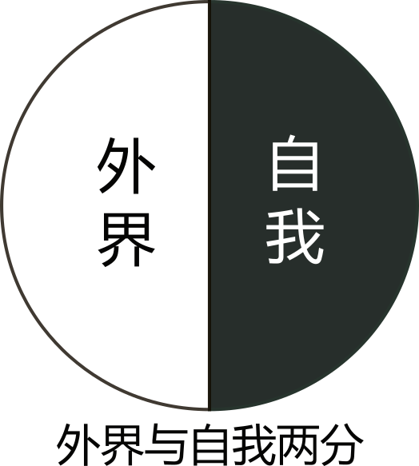
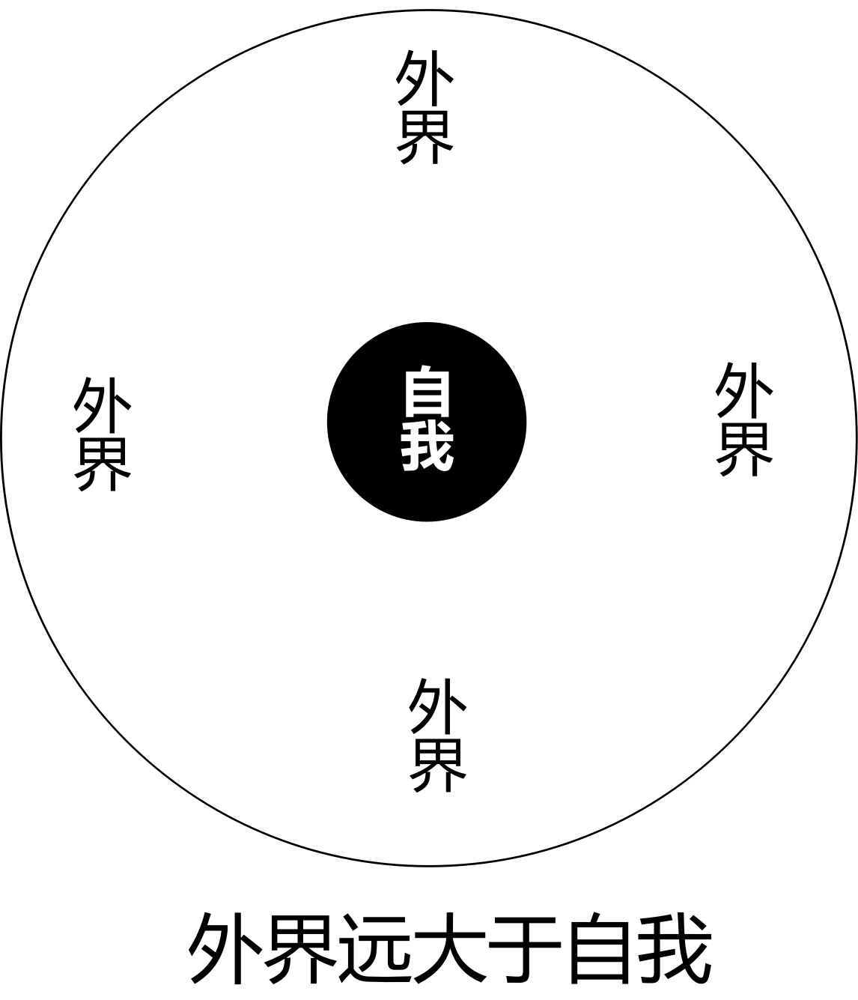
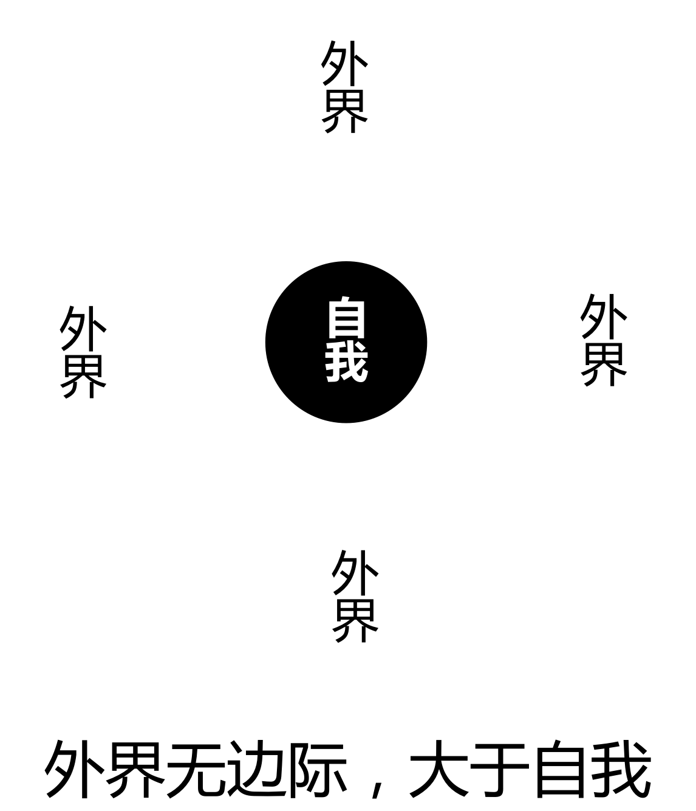
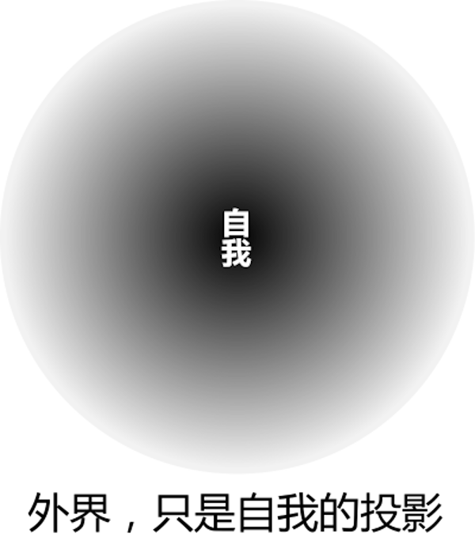
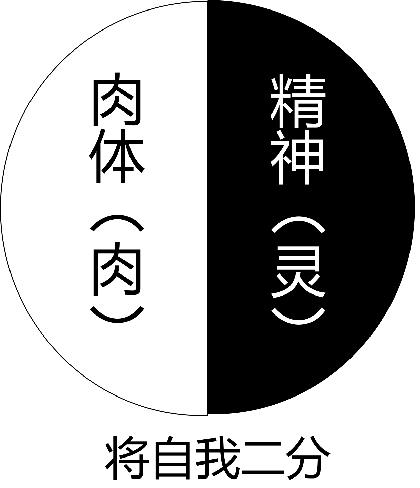
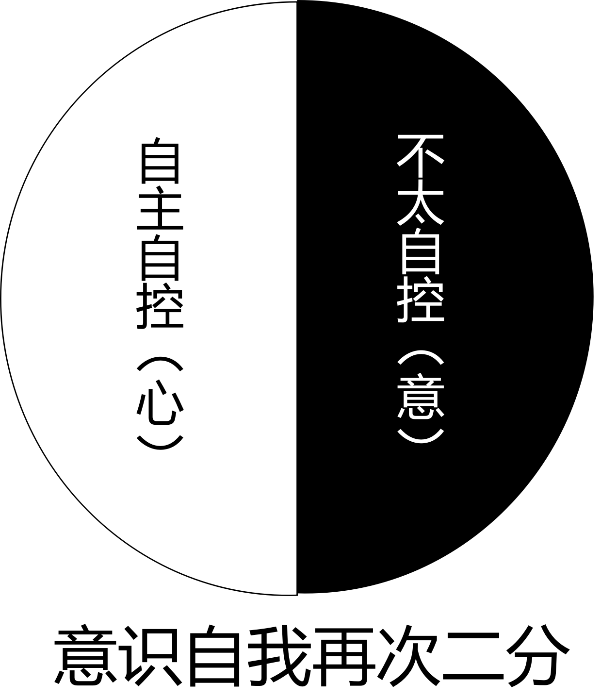
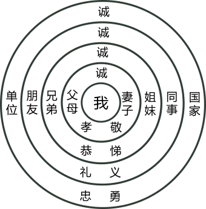

# **昧道谭丛**

## 4.  概要
### 4.1  名相

​       本章开始，我们将逐步讨论传统心性修为理论的梗概。可能理论性会比较强，为了将一些细节问题说清楚，我也不得不在叙述之时稍微啰嗦一点。光有理论肯定不够，后面我们还会涉及到具体实践，为尽量保证实践不出毛病，理论部分，我们还将讨论一些思维方式方面的内容。所以，从本章开始，以下内容会显得较为“烧脑”，如果内心未安静到一定程度，不建议阅读本章内容。
​    
​       我们首先将确定五个关键的名相。要说清一个道理，不得不借助于名词或者术语。这里将对五个术语的基本概念进行界定，这五个术语分别是：心、意、思、想与念。使用这五个词，不采用佛家唯识系统中的定义，而以传统民间的说法为准。换言之我们将按“约定俗成”的意思来讨论。若严格按唯识的语言系统来聊，则解释这五个字的意思很易落入语言文字的辨析之中，反而无助于大家的实际理解与实际操作。之所以要申明这点，是因为对名词的理解会因为人的差异而产生歧义。仅以心、意二字为例来说，某次我与友人交流，就发现朋友们所学相同，但每个人对这两个字的理解却并不相同。比如我认为是意的，我师兄认为是心，我认为是心的，他认为是意。但认识不一致，并不影响我们之间的交流，因为真正重要的，是理解这二者的运作方式，没有必要在具体的词的定义上过于纠结。所以，以下我们聊这个话题，如果你理解的心、意这两个词与我相反，那也不会影响我们对这两个东西运作方式的剖析。　

#### 4.1.1  物我

​       以下，让我们从最“外围”的、“有我相”的立场出发，开始讨论。
​       首先要讨论的第一个问题是：什么是“我相”？
​       通常而言，当我们意识到有个“我”存在的时候，就意味着我与外界，是截然两分的状态。属于阳面的，算是外界；属于阴面的，算是自我。如果用图表示，那么不妨使用下图：

​       但是，上面图中将“我”与外界视为平等的两个部分，可能有朋友会觉得不符合实情，他们心目中的“外界”远大于“自我”。那么，是否下面这个图更合理呢？

​       上图中，“自我”只是“外界”包围之下的、很小的一个范围。不过仍然有朋友感觉这个图不合理，因为他们认为，外界应该是无边无际的。那么稍加修改，去掉上图中的边界，是否会更合理？如下图：

​       上面三个图，应该代表了绝大多数人对“我”与“外界”这二者之间关系的认识。然而，如果我们说，上面三个图其实都是错的，不知道大家会怎么想？既然上三个图都是错的，那正确的图应该是怎样的呢？我们不妨看下面的第四幅图：

​       这个图如何理解呢？很简单，即，根本没有“外界”可言，只有一个东西，这个东西就是“我”。所谓的“外界”，其实全部是我“认识中的”外界。比如，我看到五米远的地方有张桌子，这桌子就在“我”的认识之中；我看到五公里外的山脉，则山脉也在“我”的认识之中……某种意义上讲，一切在我意识之中“存在”的事物，都在我的认识之中；我意识之外的事物，不存在于我的认识范围内，则这事物对当下的我而言，基本就没有意义。所以，没有外界，有的，只是个人认识范围中的外界。或者简化点儿说：没有外界，有的，只是个人的认识范围。“个人的认识范围”，其实就是“我”字的扩大与放大。从另一个层面来讲，同一种“外界事物”在不同的人眼中，感受也未必是一样的。比如太平间、停尸房、火葬场之类，有人一走进去，不管主观上是否愿意，其人的心态都会发生变化，但也有人走进去，觉得跟在公园里散步没啥两样，甚至干脆就没什么感觉。同一个外界事物，因人的不同而有不同的感受，显然，这感受，就只是个人意识在外物上的一个投影。几年前我买房时，有人说开发商的那块地几十年前是个大坟场，结果很多人一听就退了票。我当时开玩笑，说：我觉得这个地球上任何位置分分秒秒都有生物在生生灭灭，说起来整个地球甚至整个宇宙，就是个大坟场，还有不是坟场的地方吗？相同的东西，人的感受不同，可见所谓的“外界事物”，其实只是“自我”意识的投影，都是“自我”某种形式的延长，对个人而言，也就没有“绝对意义”上的“外界事物”。那么，上面这幅图也就不难理解。
​    
​       上述四幅图中，第一幅使用的是阴阳二分法，我们最容易理解；第四幅图相对有点费解。阴阳二分法，是我们传统文化中的一种认识方法，其主要的作用，就是用于我们对事物的理解与分析。为了便于我们后面的讨论，所以，以下内容，还是让我们回到第一幅图，仍然使用阴阳二分法来继续我们的讨论。但要注意，希望我们能理解第四幅图的意义，因为我们后文会回到这幅图上来，再作更深入的讨论。
​    
​       有我，就意味着我与外界是截然两分的状态。把这种两分看成是一阴一阳的话，属于阳面的，就是外界的事与物。阳面的内容我们不聊，这里单单只讨论属于阴面的“我”这个字。
​    
​       “我”这个概念，也可以分为阴阳两面。物质的，肉体的我，是外在的概念，算是阳面；思维的、意识的、精神的我，是内在的概念，算是阴面。这就是通常我们所说的“灵”与“肉”之间的区分。用图表示的话，如下图：

​       普通人所重视的往往限于肉体自我，对生老病死之类的事，有诸多挂碍，对精神自我、意识自我却缺乏足够的观察与关注。我们应该怎样来找出自己的意识、思维，又应该怎样来对自己的思维、精神进行分析、研究以及修正呢？这是一个非常大的话题，也是我们将要着重讨论的问题。

#### 4.1.2  心意

​       意识自我，又可以分为阴阳两面。首先，我们的日常生活中，能自主的、能自控的、能主宰自己言行的、具有理性的这种思维，我们将其定义为“心”。其次，我们在做梦时，同样也具有一种思维。它能见（看见）、闻（听到）、知（感知）梦中的一切境界，但它不易自控，缺乏理性与逻辑。这种思维，我们称之为“意”。同样用图来表示的话，如下图：

​       心与意究竟如何区分？在日常生活中，我们对自己的一切行为，都要用情理、道义、理智、逻辑、价值等等来衡量，我们必须对自己的行为负责。这一切都由人的“心”在起着主宰的作用。而梦境中的“意”则不会考虑理性，它只凭自己的好恶来行动。所以，梦境更能体现人的个体贪欲。比如这样一个例子：现实当中我们明明对某人不满，但在与他交往时，我们仍然可能会笑脸相迎。请注意，这里在“不满”的是我们的“意”，它潜伏在我们的思维深处；让我们“笑脸相迎”的是我们的“心”，因为只有它才可以主宰我们的言行。如果我们在是梦境中，梦到了这个人，此时，我们心力较弱，我们对这个人的好恶，很可能就会无所掩饰地表现出来。据此，我们可以得出几点结论，其一、反省梦境，往往能够让我们对自己有更深刻的认识；其二，意的运作与心的运作相比，意隐藏得更深，人在很多时候其实是被意操纵着的，但人的心却会忽视意的作用；其三，能够心、行一致的人，那他的修为应该已经非常厉害！因为心与行一致，就意味着心与意已经是一体，没有了分歧。
​    
​       不要认为“意”只能在梦中出现。有这样的例子：人们常常拿着某样东西，却又到处在找它。说他不知道东西在手里吧，他没有松手；说他知道东西在手里吧，他又在找。这里，在找东西的是能做主的“心”，“心”不知道东西在手里，所以才会去找；没有松手，说明有个“东西”是知道东西在手里的，这知道东西在手里的，就是“意”。为什么心会不知道东西在手里呢？这种“骑驴找驴”的现象叫做“心意不合”，民间的说法就是“水火不济”，心与意之间缺少了一座沟通的桥梁。前面我们说到了有些人能心行一致，在这里这个例子中，没有松手是一个行为，但这个行为与“心”显然谈不上一致。前面还说到了心会忽视意的作用，常态中的人，很多时候都处在心意不合的这种忽视状态中，但往往自己不会有警觉。　　
​    
​       人们的日常生活中经常发生一些“鬼使神差”的事，真有“鬼、神”吗？其实，这类事正是“意”在起作用“心”不知道而已。心与意之间没有建立起准确的联系，就是心意不合。比如某天，我到一个政府职能部门去办事，恰好碰到一位老同学也在那儿。当时办事的人很多，我看他慌慌张张的就劝他“别这么急呀！”刚办完事，他突然叫了一声“哎呀！一定是我的自行车丢了！我有预感！”于是他赶忙跑向停车棚。结果，他的车子好好地停在那里，但他忘了给车子上锁。我笑他：“你不是说你有预感吗？怎么不灵验？”其实，这件事的真相应该是这样的：因为他到那个部门去办的事非常重要，所以他的心就非常专注，心与意之间的联络就完全被切断了。他到了停车棚还满脑子想着要办的事，并忙着赶紧去办，结果就忘了给自行车上锁。心虽然忘了，意却知道。于是，当他办完事“心力”松弛时，心意之间的桥梁恢复了，“心”就知道车子出了什么问题。只不过心把意提供的信息，错误的解释成了“车被盗”。为什么心不能正确解释意提供的信息？这也是一个很有意思、值得细细品味的问题。　　
​    
​       归纳一下上面的内容：我们日常“清醒”的时候，主宰我们言语行为的是心，此刻，意潜藏在背后，虽然同样在起作用，但作用不明显。我们在睡梦中时，心力淡薄，我们的思维基本上就是“意”在起作用，若此刻心还残存有观照力，我们就会意识到自己在“做梦”。反省或者观察自己的梦境，会让我们对自己的欲望以及心态、心念等等，有更为深刻的理解与认识。不要以为我们自己对自己非常了解，如果深入观察梦境，我们会发现，“意”是一个大杂烩，它既包含了我们潜在的一切正确的、正常的思想意识；又贮存着我们所有的“见不得人”的思想内容，说不定有很多内容连我们自己也不清楚。真正想彻底打破欲望陷阱、想彻底认识自身，我们就应该深入自己的意识深处，去体察、分析自己的“意”。这个分析、研究的过程，就是我们平常所说的“修行”。　　
​    
​       意是一个大杂烩，这说起来简单，但要真正明白为何它是个大杂烩，却未必容易。中学时代，我偏执，钻牛角尖去学一些乱七八糟的东西。某天晚上做梦，梦见我自己从悬崖上脑袋朝下直摔下去，摔下去之时，我的第一反应，是立马用手捂住我自己白衬衫左胸口的口袋！我中学时代在住校，每周有五块钱的零用钱，我一直是放在衬衫胸口口袋中的！我第一反应捂口袋，是想着怕钱从口袋中掉出去！梦醒之后跟朋友们聊起，他们哈哈大笑，说我是典型的要钱不要命。抛开玩笑话不看，冷静反省，我“主观意识”之中，从来都自认为自己算是个不在乎钱财的、大方的人，但这个梦，让我省悟到，自己根本就不是“自以为”的那个样子。所以，意，远比心更为“真实”。意，往往才是自己真实的模样。日常之时我们处于心的监控之下，言或者行，已经“走样”，表现出来的，未必是真正的自己。　　
​    
​       我们要了解这个世界，就必须先要了解构成这个世界的最重要的元素——人类社会；我们要了解人类社会，就必须先要了解人作为群体的共性；要了解人群的共性，就必须先要了解人个体的个性；古语说“要有知人之智，必先要有自知之明”。我们只有在了解自身之后，推己及人，才谈得上了解他人，进而也才谈得上了解人类、了解整个世界。了解自身最佳的方法，是用心去观察与分析自己潜在的“意”，这个观察与分析的过程，就是“修行”的整个过程。

​       《西游记》中，唐僧首先降服了“猴”，然后又借猴手降服了“马”，再“乘马用猴”一路降魔去也。知道“心猿意马”这个成语吗？真正懂得修行的人，他必定知道修行只能从“心”和“意”的方面下手。以“心猿”服“意马”，乃是修行之正途。因为“心”能自控、自主，而“意”不能。显然，我们这里所讨论的修行，是直接针对心、意而言的，与世上之武功、内功等等肉体修炼法，有着本质上的区别——这，就是所谓“修心”。全心全意、一心一意、心意相合、水火既济，就是“心猿”收服“意马”后的境界。这样的人，会对诸如“鬼使神差”之类的事，有着完全不同于旁人的感受。　　
​    
​       以上，我们区分了心与意这两个概念。老话说：达摩西来无一字，全凭心意用功夫。还有老话说：但尽凡心，别无圣解。还有老话说：很多人是大白天睁着眼睛在做梦，自己都不晓得（`极为危险`）！这些话，都是非常到位的总结。一个一心一意、全心全意、水火既济的人，是非常厉害的。他一眼就可以看出旁人精神或者心理、心境、心态处在什么状态之下。传统民间修为的入门之法，称为“握固”，很多人以为两手握成拳头，大指头放无名指根就叫握固，这完全是笑话。真正的握固，就是全心全意，就是一心一意，就是心意相合，就是水火既济，就是情投意合，就是聚、精、会、神，就是专（抟）、心、致、志。　　

#### 4.1.3  思想

​       如果对心与意这两个概念已经有了明确无误地认识，那么我们还得再增加一对概念，这对概念就是“思”与“想”。心的运作方式，是思；意的运作方式，是想。思，有方向性，有目的性，有结论性，相对而言其运作之时需要消耗一定的精神，人会疲倦；想，则是胡乱飘荡的，是漂浮的，方向性与目的性不强，偶尔也有结论性，但不如思的结论性强。与思相反，想，通常不太消耗精神，对常人而言，反而很多时候是精神放松的一种形式。简言之，思是线性的，是矢量的，如同箭头，是有方向、速度、目标的；想是发散式的，是迁移式的，是跳跃式的，谈不上方向、速度与目标。　　
​    
​       小孩子做几何证明题，做应用题，解数学的难题，他就处在“思”的状态中，起作用的是“心”，他的注意力很专注，有消耗，时间长了人就会疲倦。从结果来看，他用心的方向性、目的性与结论性，是非常具体的。我们闲而无事时，端杯茶，斜躺沙发上，闭目或者不闭目养神，思，就会迅速转变为想，我们的意识会浮想联翩、越跑越远，想了些什么东西自己也是稀里糊涂的，弄不好就会不知不觉地睡着（`不知不觉四个字，是谁不知不觉？`）。睡着，是心已完全放松，思不起作用；浮想联翩，是意很活跃，想在起作用。具体想了些什么东西自己并不清楚，所以想的方向性、目的性与结论性，都较弱。如果我们不是在“想”，而是躺在沙发上“思”，有思的目的与目标，则我们就不太可能会睡着。失眠的人，往往就是意识运行过程中目的性与目标性太强，处于思的状态而非想的状态，所以就会失眠。　　
​    
​       仅从概念而言，常态中我们多半是思，睡梦中我们多半是想。但训练有素的一些人，却可以在睡梦中进行深入的思考，往往还会在内容或者形式上，收到常态之中没有的奇效。换言之，这些人是将心力透入到了意力之中，在睡梦中用思代替了想。训练有素的人还可以反过来，将意力透出到心力中来，可以在常态清醒的状态中，避开心力目的性与目标性的干扰，用想，替代思。这段话可能有点费解，举个例子来解释一下。比如下棋，绝大多数的人下棋时，如同小孩子解数学难题，目的性与目标性会非常强，起作用的就是心力，就是思。但在思的状态之下，我们往往算不了几步棋就会昏头昏脑，注意我们这里使用了一个字“算”。如果一个能将意力透出到心力中来的人，用想代替思，他来下棋，那么他的状态就不是“算”，而是“想象”。在想象之下，对棋局步数的推演，就远非“算”所能及。同时，他的状态也要比使用“思”、使用“算”松弛得多，不容易疲倦。我们不能把“想”彻底地透出到常态中来，原因就是我们常态中心力的目的性与目标性，过强了。当然，百无聊赖时端杯茶坐那儿意识飘荡，也算是“想”透出到了常态中来，但要让想彻底透出来并达到“想像”的程度，确实需要一定的训练。　　
​    
​       一个真正能够水火既济、一心一意的人，他不仅仅是可以用心观察分析意，将心力透入到意之中；他也可以反过来将意力渗入到心中去，意也可以返观审视自己的心。这种心与意相互观照、相互监视的状态，如果用图来描述的话，你会想到哪个图？不错，就是那个大家司空见惯的——双螺旋阴阳鱼。如果大家有兴趣，可以去看看太极图各种不同的画法形象，从中就可品味出心与意的不同调整技巧。
​    
​       以上讨论了心与意、思与想的定义，还有个重要问题要暂时先放一放，这个问题就是：睡眠，到底是心需要睡眠还是意需要睡眠？这个问题先放着，我们先讨论最后一个关键字，“念”。

#### 4.1.4  念力

​       本小节的题目是“念力”，其实这个题目要分成两半来看，即，念与力。念，可以定义得很简单，就是语言，就是我们进行思维之时所使用的语言。小孩子做几何证明题或其他什么数学难题，他的整个思维过程，其实一直是自己在对自己说话，只不过解题过程中，他自己是意识不到自己在“说话”的。他的整个思维过程，全部是建立在“语言”上的，也就是建立在“念”上的。我们躺沙发上浮想联翩，头脑中的每个念，也是以“语言”为载体在进行的，如果此时我们有反观，就会意识到自己在“说话”——无声地自己对自己说话。不知道大家对自己的梦境有多深的观照？如果有过观照就会发现，最粗浅的梦境，其实就是自己在对自己“说话”。所说的“话”，所说的内容，就是粗重的“念”。　　
​    
​       思也好，想也好，其运作，都是以念（语言）为载体来进行的。将思与想的内容表达出来，无论是口头上表达还是使用文字进行书面表达，其实就是我们内在的“念”的外化、外显。念是一种语言，外化出来就成了言语。透过一个人外化出来的言语，我们很容易看出这个人的逻辑方式、思维习惯以及其人思与想到底在关注些什么东西。　　
​    
​       说起来，这世间一切人造的东西，皆是人的心念的外化与延长。我们看到的这世间一切，都是对人心的千变万化的记录或者描述。比如楼房，为何现代的楼房又高又险又尖又硬？古代的房屋不是这样呀？楼房的形状同样是人心的延长，现代人与古人比，心性冷、硬、险、峻多了，所以连房子的形状都变了。再比如书法，字乃心画，看古人写的字，再看现代人写的字，确实有非常明显的心性上的差异。如果极端一点看，其实整个人类社会的现状，就是这世间所有人的心念外化，所形成的集合。　　
​    
​       不知道大家有没有观察自己的“念”的习惯。如果有，不妨没事儿的时候自己淡淡地品味一下自己的头脑中滑过的每一个“念”的语法：自己与自己对话，自己对自己说话的时候，我们的念（`语言`），是否有定语或者状语？定语或者状语数量多吗？人世间最可怕的事，就是自己与自己说话的时候，居然还在使用定语和状语……大家不妨细细品味一下，这种状态意味着什么？有什么后果？
​    
​       数学学得好的孩子，能解出难题的孩子，其头脑中的语言能力，是非常强的。他们头脑中的语言，往往不太有定语或者状语，往往只有简单的主、谓、宾。相反的是，如果一个孩子显得“很有语言天赋”，我们觉得某个孩子语言表达能力强，这个孩子往往会比其他孩子更善于使用定语与状语。一个语言中定语与状语多的孩子，他肯定不善于解答数学难题，因为他头脑中的兴奋点，放在了语言的修饰上面，而不是语言自身的逻辑上。聊这个话题是想说，对“语言天赋”这四个字，我们还是要辨证地来看。所以有这么种现象：理科能力强的孩子，一旦“开窍”，则转文科并非难事，而文科能力强的孩子，要转向理科，却异常艰难——为什么会难？因为他们头脑中的语言，枝节的东西偏多、冗余的东西太多，干扰了逻辑。我们经常聊“命运”这个词，大家不妨注意观察我们周围，那些语言简单、干净、修饰少的人，人生也相对要单纯一些；语言修饰多的，定语状语多的人，人生往往会出莫名其妙的波折。为什么会有这样的现象？这也真的是件可资思考、值得反省的事情。归纳而言，状语多的人，生活波折多；定语多的人，倒霉事情多。比如李白的状语比杜甫多，而杜甫的定语比李白多。　　
​    
​       念，是有力量的。有个词语叫“念力”，但很多人都将这个词语的意思搞错了，很多人心目中“念力”二字，其实是“心力”，是心的力量。念力与心力，是有区别的。　　
​    
​       我们通过思考，得出了一个结论，这个结论以语言的形式存在，这个结论就是一个“念”。比如，有人得出了一个结论，是“上帝是存在的”。基于这个念（`结论`），他就会产生种种言行（`被念驱使`）。那么，让他产生种种言行的那个力量，就是他这个“念”的力量。再比如，有人生出了一个念，内容是“万法皆空”，于是基于这个念，他同样会有种种言行，显然，驱使他产生言行的，仍然是“万法皆空”这个念的力量（`这念都已经有力量显现了，还空不空？`）。有人认为某种政治体制好，有人认为某种政治体制不好，这是两个完全不同的念，但这两个念，最终都会外化为人的言行。仅从念的角度来看，这两个看似“矛盾”的念，不过都只是人脑中的一句“语言”而已，并没有本质上的区别。人被自己的“念”所驱使，这种驱使的力量，就是念力。小孩子聚精会神做数学题，注意力非常集中，此刻，他使用的是心力，他在自主、自控，所以会有精神上的消耗。这种聚精会神地思考，就是心力的作用。所以，心力与念力，是不同的。很多人都将念力与心力的概念混淆了。请注意本段讨论了非常致命的问题：心力并不可怕，可怕的是一个人的念力！我们最好多反省一下自己心底已经存在的“念”，看看这些念，驱使我们搞了些什么或者将会让我们搞出些什么？这念的力量，对我们的“命运”产生了些什么样的影响？
​    
​       上面提到古代的房屋与现代的房屋，形状上有明显的区别。说到底这种区别就是念的力所产生的作用。不仅仅是房屋，包括服饰乃至待人接物的习惯等等，古人今人相比已有很大变化，这些变化都是“念”的力量在起作用。
​    
​       某种意义上讲，我们每时每刻其实都活在自己各种各样的“念”中。我们每时每刻的念的流淌，就承载着我们生命的过程。如果有兴趣，我们不妨可以观察一下自己每个念产生的原因，或者观察一下自己每个念，究竟是从何而来的。通过观察，我们会发现，我们的很多念，实质上是非常莫名其妙的，或者换个流行的词语来说，我们的很多念，其实是极为无厘头的。还是举那个我举过多次的例子：一块臭豆腐，有人第一眼看到它，马上口水直流；也有人第一眼看到它，马上就心里发呕。同样的一块臭豆腐，为何让人产生的心念不一样呢？书籍也是一样，同一本书，因人不同对这书的看法也会不同。例如《易经》，有人觉得是照亮自己人生的明灯，是对终极智慧的高度总结；也有人觉得是迷信、是骗人害人的毒草！对某本书的好恶如此，对某个人、对某件事的好恶，同样如此。好恶就意味着取舍，我们随时随地都在取舍当中，如同对臭豆腐的不同感受一样，这种取舍多少显得莫名其妙（不要在这里去扯什么阿赖耶识中的种子）。不过，正是这莫名其妙的取舍(对物的取舍、对人的取舍、对事的取舍等等)，在无声无息地决定着我们的所谓“命运”。归纳起来说，就是“念的力量”在决定我们的命运。所以，我们修为自身、调整自己的所谓“命运”，就一定要“观”念，要对自己潜在的念，有极高的警觉性。
​    
​       以上，我们聊了五个关键词，分别是心、意；思、想与念。心的运作方式是思；意的运作方式是想；思也罢想也罢，都是以念（语言）的方式在运行的，其中特别需要谨慎的，是念有力量性！那么，心念与意念，这两个词，到底有什么区别？
​    
​       前辈们教导我们，经常使用“意念”这个词。很多人都将意念二字理解错了，他们通常说的“意念”，其实都是“心念”，都是自主的、能自控的、有明显力量性的、较为粗重的，所以是心念。正如小孩子做数学题一样，他们做题时注意力非常集中，此时起作用的是心力，使用的是心念，正因为此刻心力强大，所以意力恰恰就隐没了。真正意义上的意念，是不太自主的，是不太自控的，力量至少从表面来看是不明显的。那么，这两者到底是怎么区别的呢？举例言之，很多人都有过这样的经验：没事儿的时候，自己在哼某首歌，啍着哼着自己就忘了，就去做什么事儿去了。等到事儿做完，突然发现，自己居然一直都在哼着这首歌，当然，也可能已经在哼其他的歌了，但自己一直在哼歌这事儿，没有中断过。在这个例子中，心念与意念的区别就是：没事儿时自己动念，想要哼歌，于是就开始哼；有事儿时自己注意力转到事上去，就开始做事儿，这两者都是心念的作用，是“自主”的、自控的。自己在做事儿的过程中，其实也一直在哼着歌，但自己并没有意识到（心与意已经分离）。这个时候，控制着自己一直在哼的，就是意，哼而不断，就是意念的作用。希望好好从这个例子中品味心念与意念的区别。前辈教我们训练自己，说“意念”要怎么怎么样。我们不知道什么是意念，使用的是心念在操作，方式都错了，当然就不会有预期的结果！例如“意守丹田”这么个操作方法，有几个人能“意”守呢？师傅不点透，则必定都是心守，不可能是意守。正因为是心守，所以才会搞出毛病。　　
​    
​       再举个比较典型的例子，练拳的朋友肯定有过经验，别人一拳打来，有时候我们还“没反应过来”，就“自动”应对并化解了别人的招数。没反应过来的是什么东西？显然是那个能自主的、能自控的心，心念还未来得及作出反应。那么，自己有招式正确应对，作出了正确的反应，显然还有个东西在操纵自己，这个在操纵自己的，就是意念。不仅仅是练拳，包括练书法也存在类似的现象，心念操纵手的时候很生硬，意念操纵手的时候就会很“活”。下棋也是这样，如果过于看重棋的胜负，我们的心力就会无形中被强化，意力透不出来，纵然我们会比平时多算几步棋，但自身精力的消耗也会非常大。反之，不太看重胜负，心态放松，意力能透出来，则我们很可能并没有消耗多少精力，恰恰还会有些奇思妙想，走出妙味无穷的好棋，简言之就是意念远比心念更自由、更灵活。再次强调，如果我们修为自己之时，分不清心念与意念，对这二者还没找到感觉，那不仅仅是练拳或书法，无论你学任何技艺性质的东西，都不可能达到较高的程度。传统技艺的教育中，如果不是入门弟子，老师根本提都不会在你面前提这个心念与意念的区别问题，所以，纵然你与其他师兄弟同时听到师傅说意念要怎么怎么样操作，你用的，肯定是心念！
​    
​       刚才说到，心念有明显的力量性，意念的力量性不明显，这个说法只是为了便于表述的权且说法，并不准确。其实真正强而有力的，力量作用持续而又巨大的，是意念。从效果论，心念根本就远远不是意念的对手。明白这句话的人，自然明白，不明白这句话的人，看了这话也不明白。前面举了个练拳的例子，可能有人会自认为自己明白这话，我可以保证，其实你根本就不明白。若你真的已经明白了，你就不会练拳了，你将会只练一个字：意。
​    
​       常态中的人需要睡眠，需要睡觉。大家想一想，到底是心需要睡觉，还是意需要睡觉？心在思的过程中，处于消耗状态，时间一长就靠不住，就必须休息。我们睡着之后，不管能不能自觉到，我们的意其实是非常活跃的，所以，意其实是不需要睡眠的。注意，如果我们确实很懒，懒到连念头都懒得动；如果我们确实很疲倦，疲倦到睡着之后连念头也动不了，但这并不表明“意”也在睡眠。　　
​    
​       以上内容，可能大家已经觉得非常复杂。然而，能正确区分心与意、思与想，可以说仅仅才刚刚摸到传统修为方法的门坎，很多具体问题，我们是不方便展开说的。比如念力如何透过心力产生作用、意念如何外化运用等等，这些问题当然只能有兴趣的朋友自参自悟自证，我们就不再深说。

### 4.2  所用

​       上一节，我们明确了五个术语的定义，如果我们对这五个术语所指代的实际状况还不能正确区分的话，则后文恐怕会很难读懂。本节内容，我们将讨论心与意对外运用与向内应用两个方面的情况。当然，客观讲内与外本是一体，并无分别，但为便于讨论，我们暂且仍然使用阴阳二分法，将其分为外用与内用，两个方面。

#### 4.2.1  外用

​       思的运作方式是念，想的运作方式同样是念，而念的表现形式是语言。语言还存在于我们头脑中的时候，这语言就称为“念”。如果这语言已经通过我们的口，表达向外，这“念”就外化成了“言语”；如果我们头脑中的念外化成了具体的行为，则这行为，也是我们思或者想的一个具体表现。所以，心与意的最终外化，主要就是两个方面，一个是我们的言语，另一个是我们的行为。注意，言语与行为，本身其实是同一个东西。我们不妨可以将言语看成是一种特殊的行为；或者将行为，看成是无声的言语。
​    
​       我们修为自身，说到底就是要训练自己的心与意，显然，这种训练只能从两个方面入手进行，一是我们的语言，二是我们的行为。其内在的逻辑是：心与意的表现形式分别是思与想，思与想的运作方式是念，念的外化，只能是语言或行为；反过来，调整我们的语言或者行为，就是在调整我们的念，念发生了变化，则思与想同样会有变化，思与想的变化，就是从根本上在调整我们的心与意。所以，真正有效的内修路子，就是从调整我们自身语言与行为入手的。除此之外，没有第二条路子可走！
​    
​       一个人在说话之时，我们未必需要听他到底在说什么内容。我们可以听他语调的高低、语速的快慢、语汇的多少、语情的真假、语音的轻重、语锋的利钝、语气的刚柔、语法的变化、逻辑的形式、呼吸的方式……透过这些方面的表现，我们可以轻易看出一个人心与意、思与想的运作特点。语调低、语速慢的人，必定有某种绝对的底气，这种人最好跟他成朋友，尽量不要成敌人；语情真、语音轻、语气柔，逻辑以因果与层层递进的方式说话的人，是大贵之人，若加上呼吸绵长，则此人必定有极深的内观功夫在身；语法变化多、语句修辞多、逻辑多转折多假设的人，一生命运波折不止，其中只有极少数，可能是大富之人，但纵大富，也必不可能长久。我这里不是要教人“看相”，而是想说，观察别人言语的方式，其真正的目的，是取彼之长，补己之短，修为我们自身的语言方式。
​    
​       真正脚踏实地的、真实有效的修为，就是从训练我们自己的“口头语言”开始的。一个人的言语发生了变化，则这个人心与意的运作无论是形式上还是内容上，也一定发生了变化。换言之，内德有变，首先变化的就是这个人的语言。观其言，就能知其心，也能知其行。有人说，言不可信。诚然，确实有不可信之言，但自己在语言方面下过功夫，自己对自己的语言有过敲打锤炼、有过修正、有过观察，则他人那些貌似可信而实不可信的言，自己也能以心印心，看出个所以然来。
​    
​       很多人喜欢动不动就聊佛家或者道家种种“修心”方式，似乎这些方式都很高明。老实说，这些貌似高明的方式，全部可以用三个字概括，这三个字就是“逗你玩”。其实真正高明的，是儒家的方式！原因很简单，儒家有个貌似稀松平常的规矩，是要求学人必须记日记。不知大家想过没有？每天写日记，不断反省，这其实就是在修心，就是在锤练自己内在思与想中的“语言系统”！记日记这个方法，不会像打坐参禅或者炼丹那样，因为用心过“紧”而导致走火入魔，这种细水长流、水滴石穿的功夫，其实是最厉害的。但能意识到记日记其实是门大功夫的人，并不多见。我只能说，能够通过记日记的方式，锤炼自己思与想中语言系统的人，厉害。
​    
​       本节题目是“外用”，讨论的重心当然就是心与意如何向外用。心与意的直接外化是言语（`口头的或者文本的`）与行为。请大家回顾我们在上一节之初画的第四幅图，以“我”为核心，我往外扩展一层，就是我们的亲人，如父母以及妻子儿女、兄弟姐妹等等，我们如何通过语言行为让自己与他们之间有感通？能成为一个整体？再扩展一层，就是我们的朋友与同事等等，我们又如何通过自己的言语行为，能将大家铸为一体？再扩展一层，就是我们的熟人、工作上的联系人等等，我们是否能通过自己的言与行，同样将大家组织在一起？再往外扩展呢？……我们调整自己的心与意，最终要达到的效果，必须体现在这个一层一层往外扩展开的体系中来。如果我们调整之后，不能将我们的心与意透出到这个一层层扩展开的体系中来，则我们就谈不上在修为自己。某种意义上讲，学习本文，也就没有意义。毕竟，我们的一切社会关系，最终会成为什么样子，完全取决于我们自己心念与意念的外化。

​       两点闲话。其一：真正想要培养一个孩子，那从小，就得把语言训练放在重中之重来培养。诸如传统的绕口令、猜谜语、儿歌、颠倒歌、覆射……之类，透过这些语言训练，才可能训练到孩子心与意的思维速度（绕口令）、归纳、演绎与推理能力（猜谜）、逆向思维与批判思维（颠倒歌）等等素质。换言之，语言训练的本质，其实是在训练孩子的心智。其二，考虑到身与心的相互影响，我们还得训练孩子的双脚。“头痛医脚，脚痛医头”，看似莫名其妙，但分属于躯体两极的这两样东西，确实有着深刻的“相应”关系，双脚灵活的孩子，头脑也要灵活一些。那么，踢踢足球，踢踢毽子，或者玩儿点其他什么锻炼双脚的游戏，对孩子大脑的发育会有积极的影响。聊到这儿，突然想起件好玩的事儿：1922年诺贝尔物理学奖颁布后，丹麦全国报刊的标题是：我国著名足球运动员，获诺贝尔物理奖！这位足球运动员，就是量子力学的奠基人：玻尔！（尼尔斯·亨利克·戴维·玻尔），他获奖时37岁，10余年前，是丹麦国足球员。
​    
​       我们刚开始训练自己之时，可以有意识地自己与自己对话。要点，是自己必须“监视”自己整个的对话过程。对话的载体，是语言，也就是“念”，当我们对自己“监视”的力量有一定的把握之后（`监视的力量，是有意识的、是主动的，所以来源于心，属于心力`），我们可以尝试中止“说话”，中止说话其实根本就不可能（`对绝大多数人来说，做不到`）！虽然不可能，但我们可以试一试，慢慢品味这种“不可能”。品味出了感觉之后，再进一步，我们可以品味一下什么叫“无话可说”。这个过程，就是传统所说的“观念游戏”，也就是传统所说的“游戏三昧”——整个过程是一种观察自己念头(`内在语言`)的游戏。
​    
​       以佛家天台宗所谓的“止观”为例。当一个人在进行观想之时，其实就是在自言自语，就是在自己对自己“说话”。例如，有一种观法叫“明月观”，我们观想面前三尺远的地方有一轮明月，这明月的边缘如何清晰光滑、亮度如何明亮柔和……如果正在观想之时打个返观，我们就会发觉，我们整个观想过程，其实一直在喃喃地自说自话。也就是说，我们的“念”一直在运作。大家不要把佛家的“止观”看得很神秘，我们其实随时随地，都处在止观的状态之中。我们读一本书，无论是某本佛经如《法华经》，还是某本小说如《红楼梦》之类，我们从头读到尾，用“止观”的理论来看，我们其实就是跟着佛经或者小说的语言，脑子里像演电影一样进行了一次“观想”。大家往往将观想二字理解得过于狭隘，我们看一些理论性的东西，比如高等数学的“数论”或者爱因斯坦的“相对论”之类，我们在边看边理解的过程中，其实也是在观想。专门的说法，叫“随文入观”，这“文”，并不一定是指小说或者经典，也包含科技类的文本。我们日常生活中，待人接物或者处理事情，同样是在观想状态中。思也好想也好，止也好观也好，都离不开语言，都离不开念头。观察或者监视自己念头的运行，确实是件既有意思，又有趣味儿的事情。
​    
​       在修念的过程中，我们特别需要注意的是“失念”。什么叫失念？比如，我们将水壶放在火上烧开水，然后自己就去做其他事情去了。等自己想起来，水壶已经被烧坏了。这种情况就称之为失念——丢失了之前的某个念头。单纯从修行的角度而言，失念，既不是好事，也不是坏事。因为，有些特别的情况之下，我们要学会主动失念。比如，恶念升起之时，我们得学会失念，丢掉这个念头，或者我们做了某件所谓的“功德”之事，也要尽快将其忘掉，那也要学会“失念”。但大多数时候，我们得防止自己出现失念的状态，因为这是极为危险的事情。例如，我们驾车在马路上，如果出现了失念的状态，那会非常危险。一般来说，失念，多半源于心力分散，或者是心力投入不够。所谓的大白天睁着眼睛作梦，很多时候就是指的这种“失念”的状态。对大多数的人而言，心力薄弱最主要的原因就是睡眠不足，所以，要避免失念带来的危险，我们就得严肃认真地调整好自己的睡眠。
​    
​       达摩西来无一字，全凭心意用功夫。学会失念，制止失念，都是在心意上面下功夫。这说起来简单，但真正能自如地主动失念或制止失念，那念头功夫已经相当厉害！主动的、有意识的“失念”，有个专门的称呼，叫“舍念”。达到舍念的程度，这个人的心眼，会异常明亮，会觉察到很多旁人没有留心的东西。这种状态，不是好事也不是坏事，但要相当的警惕，毕竟，“察见渊鱼者不祥”。此处有一个暗藏的关键问题：能舍念的，是谁？心还是意？
​    
​       主动的、有意识地失念就是舍念，这不太容易做到，而常人在常态中的失念，其原因多半是心的“散乱”或者“掉举”造成的。散乱与掉举有个明显的外在表现，就是昏沉。所谓昏沉，就是心力过于微弱，整个人处于“浮想”的状态，没有警觉性。若一个人在日常生活之中经常显示为散乱甚至昏沉，那将非常危险。很多日常之时就爱平地摔跤子、走路撞上树、坐公交坐过站的人，就是处在散乱或掉举造成的昏沉之中。要解决散乱、掉举与昏沉，就必须要反省这种状态的原因。那么，原因大体有两种，其一，是睡眠不足，心没有得到足够的休息，所以在常态之中心力就“不够用”；其二，睡眠虽然够了，心也休息够了，但在常态之中，这个人同一时间之内升起的“想法”“念头”过多，也就是说，杂念过多，则这个人也很容易陷入散乱与昏沉——过多的杂念会让心力消耗加快，并很容易将人引入“散乱”中。为什么杂念、念头或者“想法”会比别人多？显然是欲望相对较重，自己日常之中精神关注的面过宽、过散。找到了昏沉散乱的原因，解决办法也就有了——首先是调整好自己的睡眠，要睡够；然后是收缩自己精神的关注面，淡化自己过多的欲望。
​    
​       有个成语叫“如梦方醒”，那些坐公交坐过站的人，在醒悟到坐过站了的时候，就是如梦方醒的状态。换言之，他们在没有醒悟之前，就是在“梦”里，就是大白天的在作梦——“白日梦”。那些喜欢戴着耳机听音乐的人要特别注意，因为音乐有移情的作用，很容易就会让人不知不觉地陷入白日梦中而不自觉。如果用道家的术语来讲，这种状态就是“走神”，反之，回过神来，就是“回神”；心力突然增强意力隐没，就是“回心转意”。
​    
​       按佛家的说法，日间清醒时都在做梦，这还只是细微的昏沉；晚上睡着了啥也不知道，这是更为严重的昏沉。有没有办法彻底解决散乱掉举与昏沉呢？既可以说有办法，也可以说没有办法。有办法，按佛家的说法，就是修为自己，达到“寤寐恒一”、“梦醒如一”的程度。简言之就是醒着与睡着是同一个状态。用禅宗的话来说就是“日间浩浩时能作得主”、“夜晚睡梦中也能作得主”。请注意“作得主”这三个字，是心在作主还是意在作主？不要随便回答这个问题，最好自行实证答案。以上是佛家的说法与禅宗的说法，道家的讲法则是“元神用事”，勉强解释这四个字的意思，就是尽量让心（识神）休息，日常清醒时，是意在运作，夜间睡着时，也是意在运作。由于心（识神）根本就不工作或工作量极少、消耗极少，所以就不存在散乱掉举与昏沉的问题，但要让“意”(元神)彻底取代“心”（识神）在日常之时的功能，这对修行来说绝非一件简单的事情。
​    
​       以上三种说法，是“有办法”，为什么我们又说“没有办法”呢？因为，要休息的不止是心，我们的肉体本身也需要休息，而睡眠是最佳的休息方式，所以，睡眠其实是不可避免。举个好玩的典故来说明这事儿：徐皓峰先生讲李仲轩老人与自己的父亲下棋，只要他下棋时肩窝一沉，那就是睡着了。问题在于，他睡着了居然还在跟徐爸爸下棋，而且还互有胜负。那么，操纵他在下棋的，与那个睡着了的，分别是什么？显然，那个不睡觉的、可以下棋的，是没有昏沉的，但那个睡着了的，还是免不了昏沉。其实，昏沉与否，并没有表面文字上看来这么复杂，稍有个一两周的训练，我们睡着了之后自己打鼾，我们自己也能知道。能知道自己在打鼾，那我们到底睡着没有？
​    
​       关于舍念、失念与散乱、掉举，还有一个很简单的方法，可以帮助我们品味这几者的区别与它们各自的特性。这个办法，就是慢跑。如果某天，我们感到自己散乱、掉举有些严重，那我们就慢慢地跑上一两公里。跑之前自己的念头，跑的过程中自己的念头，跑完之后自己的念头，淡淡的比较，慢慢就能品味出如何舍念、如何保持念头而不失念、如何轻轻地、稍稍地止住散乱与掉举。但这个办法是否有效，还得看实施者本人的状态。与上述这个办法类似的，是那些有定课，每日都要练拳、要站桩的朋友。这些朋友如果留心，也会在自己练拳与站桩之前、过程中与之后，品味出舍念、持念与制止散乱、掉举的“心法”。
​    
​       说起来，修行，也是件奇葩事。我们面对修行，通常会有三种完全不同的心态。其一，是将修行看成火烧眉毛的事，所谓“生死事大无常迅疾”，所以修行的心态会是一种不顾一切的急迫状态，会在进行“观”念游戏之时，非常用心，心力投入过强、过大；其二，是将修行看成是件与吃饭喝水一样的、常态的事。所谓“做一天和尚撞一天钟”就是这个意思。每日有定课，每日的定课也是以一种完成任务的心态来完成；其三，是抱游戏的态度，有兴趣了，兴趣来了，就玩一玩这个观念游戏，没兴趣了，就任由自己的心思天南海北另找事情玩。这三种心态，一是急迫，二是任务，三是游戏，这三种心态本身，也是“念”，也是看法，也是认识，也是观点。急迫的心态会不知不觉中增强人的心力，心力过强，意力就隐而不显，所以就不太容易找到感觉，久而久之容易让人失去信心。“做一天和尚撞一天钟”当成任务来完成，则心力投入就会有欠缺，也不太容易找到感觉。游戏心态，三天打渔两天晒网，当然也不会有好的结果。如果将这三种心态稍作揉合，整个修行过程抱着一点点兴趣与趣味性心态，并将这个游戏变成一个每日必有的“习惯”——不算是“定课”，因为定课二字有些严肃了，容易滋生无可奈何的情绪，那么，或许我们还能很快进入状态，找到感觉。
​    
​       严格意义上说，心与意或者思与想，也仅仅只是“假名”。对于一个心意合一或说水火既济的人来说，他谈不上是在思或者是在想的，也没有心或者意的区别。他动念就是动念，不动念就是不动念。当然，不动念，并不是“定”，更不是枯定或者死定，而是一种极细微、极轻微的灵敏觉照状态。如果使用佛家的语汇来表达，则一个人没有动念而处于觉照状态之时，稍粗重点就叫做“寻”，稍细微点就叫做“伺”。寻伺状态，就是严密监视自己，一但“寻（监控到）”到有动念或“伺（等候到）”有动念，就止住。但要注意，“抽刀断水水更流”，这种“止”住，其实基本上是止不住的，真要止住，得在这个念产生的源头上去下功夫，源头没有截断或源头本身的某些问题没有解决，则这念迟早会冒出来，永无止住的可能，也永远没有消除这念的可能。
​    
​       从修心或者正心的角度来说，消除一个念或者制止一个念冒出来，其实不是件聪明事儿。每出来一个念头我们就去抹杀一个念头、每出来一个念头我们就去抹杀一个念头……事实上我们就是“被念头所转”，是“念头在玩儿我们”，我们自以为自己是念头的主人，其实反而是成了念头的奴隶而不自知。但很多人都认为所谓修心，就是要消除杂念或者制止杂念，可以说，这种观念是经常能看到的、最为严重的对修行二字的误解。本文从最初就在强调，我们是立足在“有心”的角度来讨论的，制止念头的产生或者消除已产生的念头，某种意义上讲，其实是在“杀伐”我们自己的心。说到底，打算消灭自己的念头，完全是在与自己的影子作战，永无胜望。另一个侧面来讲，我们修为自己，是为了提高自己对自己的认识，是为了让自己对自己的认识更加深刻、更加彻底。如果我们没有念头冒出来，我们谈何去认识与了解自己？所以，有念头冒出来，完全是件再正常不过的事，我们需要的，是观照、观察这些冒出来的念头，从而真正达到“了解自己”的目的。如果使用“消灭念头”这种办法，且不说这根本就与“了解自己、认识自己”这个基本目标背道而驰，更要命的，其实是这种行为背后，多少是有些“不愿意、不敢于面对真实的自我”的心态。这种心态，将会是人的致命缺陷。
​    
​       所以，更为合理的作法，不是消除某个念或者制止某个念，而是寻或者伺到“动念”之时，立即进入“观察”、“旁观”的状态，以一种站在河岸边观看水流的态度，来观察、审视这个“念”的运动与变化。禅宗临济祖师说“沿流不止问如何，真照无边说似他”，我们真正在训练的，真正需要训练的东西，不是那些生生灭灭的念头，而是这个“能观”的东西，是这个“能照”的东西。这个东西有观与照两种状态，观，有消耗，会疲倦，照，相对就要细微、轻松一些。舍掉能观与所观，达到“照而不观”的程度，再读《楞严经》，就会有完全不一样的感受。简言之，处在观的程度，力量还太强，心力投入还太大，心与物就不易相应；处在照的程度，能与所的界限已非常淡薄、非常模糊，反而会有一些奇妙的“相应”，透过这些相应，品味相应与不相应之间的原理，对“生灭”二字的感受，我们会有更为微妙的体会。观世音菩萨“照见五蕴皆空”而不是“观见五蕴皆空”，一字之差，用心方法就天远地隔。可悲的是，我们看到这世间聊《心经》或“观音法门”的典籍，一多半在讲“照见五蕴皆空”，基本都讲的是“观”，并不是“照”。显然，作者本人，并没有真正用心实践过。但凡用心之时是“观”，则五蕴必定不会是空。
​    
​       有个成语叫“心照不宣”，这个成语通常理解为两人有默契而不说透。在“观念”过程中，则这个词特指处于“照”的状态所产生的一切感受与感觉，很难用语言表达出来，或表达出来旁人也无法理解。当然，还有更隐秘的一层意思，是“不准宣”、“不能宣”，不准与不能的原因， 到了这个程度的人自然会明白。
​    
​       以上内容，可能大家会觉得太深奥，太高难。N年之前，我个人在学习之时，也觉得这太难，根本就做不到！但心法难得，既然已知道了这个心法，所以我如临大敌，以一种极为严肃认真地态度在实践这心法，搞得旁人眼中我几乎有点神经兮兮的。滑稽的是，我成天如履薄冰似的在实践，我一朋友成天嘻嘻哈哈、散漫无常，但他却率先找到了感觉！虽然内心很不服气，但自己达不到他的程度，我就还是老老实实请教他，到底奥妙何在？然后，他给出他的答案：你打麻将吗？我说，打过，怎么了？他说，你可不可以一边抽烟，一边打麻将？我说，那当然，这有什么难的？他又说，你可不可以一边抽烟、一边打麻将、一边跟人聊天儿说事儿？我说，这也不难呀？！他说，好，那你不用再学也不用再练了，你已经会了！
​    
​       我不知道大家看了上面对话会有什么感觉？反正我听了几乎是要猛吐一口鲜血！道理其实也很简单：我们的心力，可以同时透过“眼耳鼻舌身”起作用，心力确实可以同时照顾到抽烟、打麻将以及跟人聊事儿。恰恰要在这种同时做几件事儿的时候，我们淡淡观照自己心力在几者之间是如何“切换”的，我们才是真正在训练自己寻与伺的警觉力。当警觉力达到了一定的程度，自己有了把握，则我们在打麻将的过程中，淡淡地观察自己的动念、起念，观察自己的念头在流动过程中因、缘、果，究竟是如何运作的，则我们会品味出细微、微妙的很多东西。题外话：大家不必把打麻将这么件事儿视如洪水猛兽，但要小心，因为在那些通宵打麻将的人中，确实有“老鬼”。你跟他打，他其实是在训练自己的心性。甚至他一边打，一边在睡觉，你也根本看不出来！第二天你脸色铁青、精神萎靡，他却精神抖擞、活蹦乱跳！换言之你在伤身害命他在养生修性！这种老鬼，我就见识过两位。
​    
​       不过，上述终究只是理论，真正实践过，才会知道上述这样训练来训练去，背后真正的目的到底是什么。再举一则禅家的说法供大家参详：

> 仰山问中邑禅师，如何是佛性义？邑云，我与尔说个譬喻：如室有六窗，内安一猕猴，外有人唤云“狌狌”，猕猴即应，如是六窗俱唤，六处俱应。仰云，只如猕猴睡时，又作么生？邑乃下禅床把住云：狌狌，我与尔相见了也。

​       典故如上。仰山此时是刚受戒，而中邑洪恩禅师是马祖的弟子，辈份上算是仰山的师叔祖。中邑以此比喻回答仰山，应该是已经看好仰山，所以慈悲垂手，而为援引。中邑讲的“六窗俱唤，六处俱应”，与我们上面说的“打麻将心法”，没有本质区别。
​    
​       我们头脑中无论是思也好想也好，其运行，都是以“念”的方式在进行的。我们观念也罢，照念也罢，都是在训练自己的觉照力。这里藏有一个严重或者古怪的问题：觉照力本身，是什么？或者问得松弛一点：觉照力，从哪儿来？前面已经提到了《楞严经》，楞严经中有个说法叫“反闻闻自性”。都知道楞严经的核心是“观音”二字，观什么音？一是外界事物的声音，如鸡鸣狗叫之音；二是内在的声音，如血脉流动、气血鼓荡或内脏运动之时的声音；第三种，就是我们的念！我们的念头流动虽然无声也无音，但观察这流动的念头，同样是“观”音。这种观音的方式，是“闻”，也就是听。我们“听”自己念头的流动，就是观音。但楞严经给我们提了一项更深层的操作要求，就是“反闻闻自性”。翻译成白话，就是我们在“听”自己的念头流动之时，然后再打一个返观，“听一听”自己这种“能听的功能本身”。能听的功能自身，就是所谓的“闻自性”，就是具有“能闻”这种功能的那个东西本身。“反闻”，是指反过来，去闻（听）“能闻”的这种功能本身。找到这功能本身，也就找到了上面说的“觉照力本身”。这如同蛇咬自己的尾巴想吃掉自己一样，大家不妨按楞严经所说，去试一试，看看到底是怎么回事。
​    
​       不管怎样，以上内容对很多人来说，终归是过于深奥了。我们修为自身，能追到如此之深固然好，追不到，也没啥大不了，还是多多实践简单的“打麻将心法”为是。

#### 4.2.2  内用

​       上一小节我们讨论了心与意的外化、外用。本节我们讨论“内用”。要注意，我们所聊的东西在内在逻辑上，是有递进关系的。
​    
​       本小节我们将讨论心与意向内，对我们物质躯体是如何产生影响的。从传统文化传承的规矩上讲，本小节要讨论的内容纵然是在师兄弟之间，也是禁止相互交流的，因为人有个体差异，交流这类内容，会有很大弊病。但我们现代人，与传统文化隔得实在太远，对很多基本的东西根本就没感觉。我权衡再三，决定违背禁戒，跟大家聊聊这个话题。破戒的目的，一方面是期望继续加强大家对传统文化的信心；另一方面，是期望大家透过我们讨论的内容，能够更为准确地找到传统文化修为我们自身之时的门径与关窍。但还是要强调上面的规矩，大家看了就看了，不要拿出去与人交流，因为交流这些东西会有弊病。
​    
​       通过前面章节对名词术语内涵与意义的不断强化，我们对心与意、思与想以及念，这五个关键词应该已经有了比较清晰的理解。我们在文初已聊过，“我”这个字，分为肉体自我（阳）与意识自我（阴）两大块。以上五个关键词，皆属于阴面，下面，我们将讨论这属于内的、阴面的东西，是如何影响我们外在的、阳面的物质肉体。
​    
​       其实传统修为的很多术语，就存在于我们日常的口头语之中，只不过随着时间的推移，这些术语已在我们日常的语言交流中失去了它的本意。举几个典型的例子，比如：无声无息，现在无声无息四个字的意思，已完全不是这个词的本意。无声无息其实是一种用心方法，只要我们耳朵里还有声音，不管这声音是外界的声音，还是内在血脉流动或者气血鼓荡的声音，再或者是我们无声地自己与自己说话的心念流动声音，只要任何的声音存在，我们的呼吸就必定存在；反之，如果我们耳朵里不仅外界的声音“不见”了，内在的声音乃至心念流淌的声音也没有了，则此刻，我们的呼吸也必定是停止的。这，就是传统的、真正意义上的“无声无息”，也就是说，无声是因，无息是果，二者不是并列关系。再比如“回心转意”，现代语言中这个词的意思，也已经与传统的意思完全不同。类似的还能举出一大堆，比如：痴心妄想，为什么不是痴心妄思呢？心想事成，为什么不是心思事成呢？不要以为我在钻字眼，如果你能明白为什么想才能成事，思是未必能成事的，那你对自己思与想的修炼与调整已经非比寻常！早就聊过，想的力量与思的力量根本不在同一个数量级。想的力量到底有多大，你可以发挥你的想像。再比如：粗心大意、心慌意乱、心满意足、心灰意冷等等。未经训练的人，绝大多数时候，思，是胡的；想，是乱的，所以叫“胡思、乱想”。不拘泥于心与意两个字，我们也可以举一些例子，比如：推心置腹，为啥不是推心置胸，把心往胸腔里推，岂不成了提心吊胆？恶向胆边生，为啥不是向肺边生或者其他什么边生？痛彻心腑，为啥不痛彻脾肾？胆战（颤）心惊，为啥不肝战肺惊？显而易见，前人口中的这些词汇，全部是有实际状态存在的，前人感觉细致，所以将自己的感受描述出来，就形成了这样的词。但随时间推移，这类词汇的意义已经发生了变异，前辈们在传授某些操作方法之时，有时就不得不弃书面语不用，而使用更为口语化的一些词语。比如上节我们聊到了观照自己的念头流动时，使用的是观与照字，而楞严经中使用的是闻字。观与照有程度上的差别，但照与闻字，虽然用字不同，实际意义却是一样的。闻字与听字也是一个意思，道家讲“收视反听”，我与人交流，发觉很多人的实际操作是收视反观！一字之差，用心的程度与形式，就差了不止一点点，换言之，收视反照或收视反闻，就与收视反听是一个意思……再比如，练武的人要“听劲”、“听桥”，那么闻劲闻桥或者照劲照桥，意义就变化不大，但观劲观桥肯定在程度上就要差一些。显然，听字，要比闻字与照字，口语化得多。
​    
​       不要小看文字上的差异。传统那些前辈讲，这事儿你得上心呀、或者你得用心呀。过几天可能另外一件事儿他又会说，这事儿你得在意呀、或者你得留意呀！这些话貌似稀松平常，仅仅只一两个字的差别，但入室弟子与非入室弟子，听了这话之后的实际操作，会一样吗？何况，就算是入室弟子，已得心法，知道心与意的区别，也还有门坎在等着你。比如，你以为你分得清“在”意与“留”意？水壶放在火上，有些人根本就不再管它，但当水烧开时，他马上就会知道，因为他留了意；在意的人，会时不时注意一下水壶在火上的情况，水开了，他一注意也能知道，没注意就不知道。留意与在意，区别是巨大的。
​    
​       某次聊天，来了位新朋友。这位朋友就是所谓的貌似谦虚、内怀“高见”的人。他来参与聊天，其实是来当“探子”，来试探在座者的深浅。所以整个聊天过程他基本上一言不发，临近聊天结束，他问了个问题，问题的大意是，如果做梦，梦到了种种情况，这些情况到底与现实生活或者现实中的这个人，有什么联系？我当时一听他这问，就明白他是想知道诸如“灵感梦”“预见梦”“预感梦”之类，到底是怎么回事。换言之，他潜在之中认为，能明白这类梦是怎么回事的人，才是有资格继续跟他聊天儿的人。于是我马上用话止住他，说，我对这些事情的看法，是很唯物的，没有唯心的东西存在。比如，做梦时梦到有人压在自己身上，或者梦到自己被人抱住连气都喘不过来，如果是我，我不会去想什么古灵精怪在害人之类的事，更不会去想这类梦“预示”着什么。我首先的想法，是睡前吃多了，肠胃胀满，或者虽然没有吃多，但肠胃有毛病，心太浮躁不知道，但意却知道，所以就投影到了自己的梦里。换言之，是身体生理上的问题，投影到了梦中。他听了，哦地浅笑了一下，就不再发言。这类被“灵修”理论污染了的人，肚里一大堆“高见”，遇到这类人，最好要止住他，不能让他那套害人害己的东西冒出头。
​    
​       物质肉体与我们的心意，是相互影响的。物质肉体出了毛病，一定会在我们的心或者意上产生投影；反之，心或者意出了问题，也一定会对我们的肉体产生影响。上面所举的梦魇压住的例子，就是肉体出了毛病在意上有投影，所以就体现在了我们的梦中。类似的例子还有，比如梦中遇到高兴的事儿，居然把自己笑醒，醒了还在笑，那就需要提防是否自己的心脏出了什么问题。如果经常性地在梦中笑醒，那就不仅要提防心脏问题，还得担心神经系统有问题。此外，如果我们经常性地梦里，突然心里一惊，然后就醒过来，偶尔一两次没什么问题，但若是经常性这样，那最好是赶快去做一个详细的肾脏检查，若无毛病的话，则需要再做一个详细的心脏检查。本段聊的核心，是肉体出现问题，会在心或意上有投影。
​    
​       反过来，心意影响肉体的典型例子，比如我们突遇惊吓，心或意在惊吓之时产生了过度的波动，那我们的心脏马上就会剧烈收缩，心动过速或者心动过烈，会让人非常不舒服。这个例子还只是短时间内心意的变化导致的肉体变化，那种长期的、不自觉的心意状态，对我们肉体的影响就更为严重。例如，林黛玉式的长年累月悲悲切切、忧心忡忡，我们的肺怎么可能健康？再如，有些人几十年如一日，这也烦，那也烦，做什么事儿都觉得烦，这种人的肝与胆，就绝对会出大问题。当然，也可能相反，是这个人的肝胆已经有问题了，所以这个人会显示出一种莫名其妙的“烦”。还有些人，不知为什么，年纪轻轻心就非常狠，很可能从十来岁到三四十岁，经常性地恨这恨那，恨人恨事恨社会，那么恭喜你，你在四十岁左右，你全身的骨头都已被你自己损坏完，保不定哪天就会生出莫名其妙的怪病。骨头无缘由疼痛还是小事，搞不好你身上的血液还会多出“与众不同”的什么功能，比如能像酸液一样侵蚀正常生理组织。不要以为“恨之入骨”、“恨入骨髓”这八个字是轻飘飘、随便说说的。再次强调，传统之中类似这样词汇，全部是有真实状态存在的！我们这些凡夫俗子感觉粗糙，根本就体会不到这些词汇所描述的状态，就自以为是地将这些词汇理解成了另外的样子。还是用刚才举的词“推心置腹”为例来说：如果一个人与另一个人交流的时候，真的是老老实实、诚诚恳恳、全心全意地为别人着想，那么当下这个人的心，就确实会比他在与人争吵或者欺骗他人的时候，位置要低得多！换言之，当下他的心脏，会是非常松驰的。如果一个人从小到大，说话从来没有过“推心置腹”，也就是说，他从小到大心脏都处于“提心吊胆”的紧张状态，那他的心脏不出毛病谁的心脏会出毛病？恨，如利箭，确实入骨，甚至确实能深入骨髓！这是典型的心意影响肉体的例证。这里说的这些词汇，大家都可以通过自己的内观，去证实。
​    
​       总而言之，精神与肉体，一内一外，一阴一阳，二者是相互影响的。所以，将我们的精神状态调整为“平常心”，真的非常重要。再举一个精神与肉体相互影响的例子：我们突然间出现厌食的现象，甚至一见到油腻的食物就内心发翻，想要呕吐，传统中医告诉我们，这种现象多半是胆出了问题。原理，是中医说的，胆主厌烦、主厌恶，厌烦厌恶一定是胆有了问题。中医这说法如果用西式的观念来看，简直牛头不对马嘴，会认为二者之间完全没有因果联系。但是，感觉细致的人，感觉细腻的人，会知道“恶从胆边生”，绝对不是空话！举个很不该举的例子，几十年前，某天傍晚我与某人一起在街上散步，正闲聊间，他骤然停脚！我说咋啦？他回头看了一个人一眼，说，刚才那个人从我们身边走过，我突然“恶从胆边生”！真的是从胆的“边”上生出来的！不是我讨厌他，是老天讨厌他啊！奇怪，真的是一种极度的厌恶！我们一边聊一边继续走。我们散步走的是圆圈，等转了一圈快回到学校大门之时，看到路口有一起车祸，死者，就是刚才那个人。
​    
​       意与心相比，意更为核心一些，因为它潜藏得更深，心最主要的作用是我们日常生活之时与外界交互；心与意最直接的外显，是念；念是我们内在的语言，它最直接的外延是我们日常口头上的言语。我们通过一个人言语了解这个人的状态，是最为直接的。但念的外延不仅仅只有言语，它还有其他的外化方式，比如一个人的相貌。某种意义上讲，相貌是相对“固定”的“言语”。憎恨心、杀伐心较重的人，目光锋利，这“锋利”二字就是一个相，体现出这个人内在精神的状态。如果一个人脸上已长出“横肉”，则这个人的憎恨心，或许并不强烈，但一定已经持续了非常之长的时间，应该已非常严重。所以，面相，不过就是外化、固化了的“念”。当外部面相都已有变之时，大家不妨想想，这个人的内在生理、五脏六腑，会不会有变化或者变化的程度如何？从中可以给我们什么样的教训？
​    
​       内在生理的变化，其实就是内化了的“相”，也就是内化、固化了的“念”。传统修为理论中，有一种不知道算不算是过于夸大的说法：我们整个的物质躯体，就是一坨“念”。这说法是否是夸大，确实不好说，但我个人，也曾经有过那么一两次近似的感受。例如某次暑假中午，大太阳下外出到公路上散步，公路上四无遮挡，曝在阳光下走了四五个小时，几乎虚脱，自我感觉，就是一大坨乱七八糟的杂念在阳光下蠕动……
​    
​       如同翘翘板，一端，是我们阴面的心与意；另一端，是我们表现在阳面的言语、相貌乃至身体生理，两端的交汇点与支撑点，就是念。修念，是贯穿于我们整个修为体系的中心。或者翘翘板也可以是这样的：一端，是我们向外的，用言语、行为，影响亲人、友人、同事、熟人等等；另一端，是向内的，用心与意的运作，影响我们的内脏、经脉、气血、骨骼等等。而念，同样是这两端的支点。观察一个人如何对待自己的亲人朋友，就能知道他是如何在对待自己的内脏经脉，二者本质是一回事——念，就是这个人的“命”。
​    
​       只要我们对念有观照，甚至不必去强行区分到底是心念还是意念，我们自然会对“念”如何作用于我们的生理，产生感觉。有次与朋友聊天，朋友说，驾车在路上有些人老是喜欢插队超车，这样的人心脏肯定会出问题。我一听马上说，讲这话的人修为非常不错。朋友说，这话是我师傅说的。大家不妨品味一下，为何喜欢超车的人，将损伤他的心脏？只是超车这一件事会损害他的心脏吗？
​    
​       仅就修行而言，某种意义上讲，七情六欲其实也是个宝库。例如，我们日常训练有效，对自己各个方面都有观照，并已达到了较为细致的程度，那么某天，我们动了某种情或者动了某种欲，我们马上就会感觉到自己在“相”上会有什么变化。例如，喜心一动，脸上就会有微弱的阳气；嗔心或杀心一动，脸上就会有微弱的寒气；傲慢发作，脸上就会有轻浮之气；思虑过度、注意力过于集中或者肠胃不适，我们的眉头会不自觉地微微皱起……长年累月有喜心、有嗔心、有骄慢、过思虑，就会由短暂的“相”，逐步形成相应的“貌”。显然，如果我们自己没有七情六欲，我们反而就学不会“看相”，更别说还要从外在的相，看出其内在的相——内在生理上可能出现的问题。
​    
​       我自己在实践之时，对这个问题有过教训。二十多岁时，虽然知道了心法，一度如临大敌很用功，但听了我朋友讲的“打麻将心法”之后，就有些过于放松了，基本属于三天打渔两天晒网的状态。直到三十六七岁，某天突然觉得肝区不舒服，万幸还有一点点基本功，内观之下，突然警觉到自己从二十岁到三十多岁，十余年的时间里，我在常态生活中一直有潜在的、非常微弱的“厌烦”二字在！厌烦二字作用于肝胆，日积月累，肝胆就变得僵硬，肝胆再作用于筋骨，浑身都有一种僵化感！虽然谈不上是否怕死的问题，但善待“人相、我相”本身就是心法，当然得善待自己这块肉团，所以赶紧调整自己的状态，变心性上对日常生活的那一丝丝“游离”态度为融合状态，前后差不多一年，才让身体状态稍有改观。正因有此感受，所以我不太喜欢听人讲什么世间污浊，要有“出离心”之类。“出离心”就是厌烦嘛，真有出离心且持续时间过长的人，这个人一定会有生理上的问题——说到底，是心理问题导致生理问题。而世间本来就谈不上污不污浊，世间就是我们修道的道场、世间就是我们的蒲团。离世修行，根本就是一个内有自欺的人，自己骗自己的儿戏而已。
​    
​       我接触到的人中，修行找到了一定感觉的，有不止一位，存在一种其他人不能理解的心态：忌医。一位四十来岁的朋友，二三十岁时工作与生活诸多不顺，他长年处于忧虑、忧思之中，近四十岁开始学佛，人单纯，心念专一，时间不长就有了些感觉。他一直以来有咳嗽的毛病，时不时还会咳出点血丝，在旁人眼中看来，觉得他这很可能会是个大毛病（`旁人怀疑他可能是肺癌又不好明说`），不断有人劝说他去医院看看，但他往往一口就拒绝掉。我跟他聊天，他说自己这毛病，是前几十年长年累月心理压抑、忧虑过度造成的，就算要调整，也只能从调整自己的心态入手。我说，到医院看看也好呀！至少通过药物治疗，可能会好得快一点！他回答我：如果我靠医院治疗治好了，那对我来说这教训就还不够深！很可能我今后就不会下功夫从根本上去调整自己的心态，我会想，反正出了毛病有医院嘛！我觉得自己的事情还是得自己做，“解铃还须系铃人”，我不会依靠任何外界的帮助。后来我又跟他聊过几次，终于了解他还有更深层的想法，他是觉得“医院”这么个机构，某种意义上讲是在助长人去放纵自己，不是个“好”东西——有了保肝解酒的药物，某些人就更加有恃无恐地喝酒，这解酒药算是“好东西”吗？医院，就是放大版的解酒药。当然，他这想法可能有些偏激。但我觉得，他有这样的想法，源于他潜在之中其实是个非常“自律”的人——这一点，恰恰也正是他能通过学佛，迅速在修为上找到感觉的原因。严格说来，他期望通过自我调整来改善自身肉体的状况，这确实是在“治本”，医院里无论任何方法，恐怕都只是“治标”。知道他深层次的想法之后，虽然并不赞同他，但我也不再劝他。
​    
​       聊这个话题，其实又会生出另一个话题。某天，某人对我说他在讲学，给别人讲《黄帝内经》。我一听就对他说，黄帝内经中所有的东西，除非你是自己有内证或者有感受，如果没有内证或者感受，全部是字面理解，我敢打包票，恐怕大半都会讲错！说这事儿，也是想提醒大家“自天子以至庶人，壹是皆以修身为本”，我们还是老老实实在心与意、在思与想、在念头上下功夫的好。类似《黄帝内经》这样的典籍，我们可以在自己有了感觉之后，拿来“印证”一下，如果不是向内，在自身修为上面用功，而是向外，把心用在古人的典籍上，那么连事倍功半都谈不上，我们基本就是在白费力。
​    
​       以上所聊，无论是观照相貌的看相也罢、观照内在生理的自我调整也罢，都只是我们观照自身心与意的副产品，都只是一些外围的东西。只要我们修为自己到了一定的程度，这些东西不需要人教，稍一用心，我们自己也能总结出来。但很多人就是喜欢学习这些外围的东西，不把精力用在更根本的地方，实在让人遗憾。这些外围的东西我们不再过多讨论，也奉劝那些在学易占、学相术、学医术的朋友，还是多将精神用在内修上为是。
​    
​       上述所有讨论，站在内观与内修的角度来看，终究只是很肤浅的表皮，更深层面上的东西，离了内证，都是空谈。本不应该再多说，但为说明什么是“更深层面”，还是稍举一例，不过这个例子可能过于复杂，实在看不明白的话，也没啥大不了：前面我们聊到，睡梦之中如果我们心底突然一惊并且惊醒过来，那么多半是我们的肾脏或者心脏出了问题。能在惊醒之时警觉到是肾或者心出了问题，这对于很多人来说，其心与意已经训练得非常细微。但如果问，肾或心为什么会有问题？并导致这“一惊”？则这样的人未必回答得出来，答不出来，也就没办法通过自己去解决这个问题。换言之，这背后就还有“更深层面”的东西需要通过我们的内修去见证。总之，这一惊，已经是“果”，这果表面上的“因”，是肾或心出了问题，但还有更深层的“因”，就是导致肾或心出问题的“因”是什么。当然，客观上导致肾或心出问题的因有多种，比如饮食、病毒、外伤、劳损等等，但其实还有一个更为常见的、却没有几个人能觉察得到的因，就是两个字：欺心。我们日常生活中明知道某些事情应该如何处理，但却因为“种种原因”并没有按该处理的方式进行处理，这就是欺心。比如“赖账”就是典型的欺心。欺心的人有个特征，就是“决不会只欺一次”。经常性的欺心，这个人就会在外显的言行中表现出一个特点，那就是“易惊”。“平生不作亏心事，半夜敲门心不惊”，身旁随便走过一个人都会吓一跳，动不动就会惊一下，那么最好要反省自己日常的行为，欺心到了何等地步！当然，也有些人未必是经常性欺心，但他有过两三次比较严重的欺心事件，则也会显示出“易惊”的特征。传统理论认为心与肾互为表里，欺心行为直接损害的就是肾，肾被损害到了一定的程度，反过来又会影响心，心也不会正常。心与肾皆不正常，则这个人睡梦中莫名其妙突然地“一惊”，就已经是“果”。当反省或者内修到了极细微、极细致之时，则这个人会意识到这一惊，真正的根源就来自于自己的欺心行为，如果他刹间立起正念，则这“惊”就会被照破，换言之，他是在这刹间，挽救了自己心或肾受到的损伤。“立起正念”这四个字不准确，但确实找不到更合适的词语来描述。
​    
​       以上所言，可能绝大多数的朋友都看不明白到底是怎么回事，毕竟其中的因果链条过于精细，对心与意的敏感程度要求太高。但真正内证到上述程度的人，他就可以给人治病。当然，源于病毒或者外伤的心肾毛病还是得找医生，但只要是源于欺心、亏心造成的心肾毛病，这样的人通过简单言语，就可以帮人做出调整。举这个例子，只是想再次说明，“壹是皆以修身为本”，内修内证真的是非常关键，一定要将精力放到这个方面上来，而尽量不要将精力花到诸如什么占卜、相术等等外围的东西上去。
​    
​       我们向外的一切施为，诸如与亲人、友人、同事乃至熟人之间进行交互，都离不开心，都是心在起主宰的作用；而向内的意，同样在起主导作用，意在主导的，是什么呢？举个例子来说明：我们有谁能凭自己主观的思想，来控制自己的心跳？显然不能。但是，我们通过调整自己的心与意，减淡自己的念头、放慢放缓自己的念头，我们就可以控制自己的呼吸，让呼吸越来越浅淡。前面聊过的“无声无息”就是这个意思。当我们对控制自己的呼吸有了把握，我们就会发现，我们在控制呼吸之时，不知不觉间就已经控制住了自己的心跳！不仅仅是心跳，连内脏的运行，也在不知不觉间，就已经能够被我们控制。这个时候，你会发觉，能控制心跳的，其实就是意，意在向内，控制一切我们日常之中认为“不可控制”的肉体运作——诸如肠胃蠕动、血脉运动之类。换言之，意在控制我们日常的新陈代谢。注意，心与意原本是一个整体，但由于这个整体一部分主要负责向外交互，我们就将其假名为“心”；另一部分主要负责向内运作，我们就将其假名为“意”。心与意分为两个部分，其实就是同一个东西要同时在向内与向外产生作用，所不得不进行的分离。某种意义上讲，这状况就好比是计算机中的“多线程”CPU一样，可以同时处理不同的几件事情或者几个任务，但有些任务只能在后台运行，不用显示出来，有些任务是必须显示出来，并与外界进行互动。
​    
​       对本小节作个简单总结：上一节我们聊了心与意的外化。最基本的外化是语言，然后是行为。透过语言与行为，我们就一层一层往外扩展，进而逐步影响我们的亲人、朋友、同事乃至于更为广泛的社会关系。也就是说，我们的一切社会关系，最终会成为什么样子，完全取决于我们自己心念与意念的外化。所以，修身、修养我们自己的内在，是根本。现在我们聊的这一节，主要是讨论心与意向内，对我们物质肉体是如何产生影响的。说到底，也就是念对我们肉体的影响。往外、往内两方面，都是我们的念在起作用，所以，我们的一切修为，都是从“念”这个字入手的。离了念，就什么也谈不上。所以，参禅时、禅定中那种纯粹的“舍念清静地”，未必就是好事情。

### 4.3  辨见
#### 4.3.1  破见

​       前面两个小节我们聊了几个关键词。这些关键词，属于流传在民间的、传统修身养性路径的理论基础。在前文中，我们已经稍稍涉及到了部份具体修为自身之时的手段、方法与形式。按全文整体的逻辑，从本小节起，我们本应该开始详细讨论具体的手段、方法与形式。老话讲“难得之货令人行妨”，虽然我不敢说我们要讨论的这些内容就真的是“难得之货”，但我们自身见地与认识没有达到一定程度之前，如果知道了这类内容，对我们真的没有丝毫好处。这还不仅仅只是简单的“没好处”的问题，弄不好反而会成为我们身上的致命缺陷。“小人无罪，怀璧其罪”，内德没有达到一定程度之前，却突然之间怀里揣着了宝贝，那这宝贝必将招致奇祸！这话绝非危言耸听，更不是我为了抬高本文的价值而故作高深或者故弄玄虚。我本人，以及我朋友，在这方面曾犯过很多错误，有些错误直到现在依然令人后悔、心痛。在这类事情上，既有我看到过的，更有我亲身经历过的“血的教训”。“前事不忘，后事之师”，所以，在聊这些东西之前，我不得不慎之又慎。为尽量保证不搞出问题，本小节往下，我们将聊聊见地方面的一些话题，而不会直接讨论具体的形式、方法等内容。以上这几句话的意思，可以用前面几小节中已经聊过的一句话来总结，那就是：越冷僻、越隐秘、越古怪的“知”，往往也越加不吉祥！所以真正的正道，还是做减法，弃圣绝知、绝学无忧的好！
​    
​       我们修为自身，是件得花大量时间与精力的事儿。但很多人在踏上修为自身的道路之初，就陷入了种种误区。比如，很多人以为修为自己，必须有专门的时间、地点或者必须要有专门的环境。于是乎，有人专门在家里设置一个环境与气氛都很舒适的“静室”；有人专门为自己准备某种服装（如练功服等）或者道具（如蒲团、香炉等）；还有人认为，不远离人世、不与世隔绝就没法静心修为自己，于是跑到深山老林中去……在我个人打交道的人中，我发现凡是对形相或者外在的这些形式很在意的人，基本没几个人真正肯下功夫去对自己的心或者意“动刀子”、下狠手。相反，真正在对自己的心或者意进行规范、进行整理的人，或者是对自己的念（言语）在进行锤练、敲打的人，不但不怎么讲究时间、地点与外在形式，甚至还专门寻找自己心底感觉最“不爽”的时间、地点或者外在形式，用于磨炼自己。过于在意外界形式，就是在被外界形式所转，一旦外界形式发生变化，或者没有自己“理想”中的外界形式，这些人就难以继续自己的修为。
​    
​       有一句被很多人误解、被种种“大师”乱说胡解的经文，是“凡所有相，皆是虚妄”。什么是虚妄？假的，不真实的，就是虚妄。什么是相？表现在外的东西就是相。有些人要戒赌、戒毒或者戒烟、戒酒之类，为表决心，在自己手臂或者其他什么地方，刺上一个大大的“戒”字。更有甚者，是见过一个人为了戒赌，将自己左手的小指头给切掉了。切指头也好，刺戒字也罢，都只是“相”！都只是一种外在的形式！只要有这个“相”在、有这个形式在，可以说，他就是在做给别人看！是自己在骗自己！他这个戒从根本上讲，就是虚妄的！只要机缘一到，破戒将是必然。相反，有些人是真正内心有了戒，比如“不生气”、“不诃责”之类，旁人根本就感觉不到他身上有这个戒，他这种戒，就是“无相”的。正因为是“无相”的，所以才是真实的，不是虚妄的。如果还要在自家堂屋正中挂个条幅，上书“不怒”二字，那这个人必定会发怒——有相，必假，必虚妄！有相与虚妄，说到底就是四个字“注重形式”，而形式，不外乎两个作用，一是做给别人看，简言之是欺人;二是自己骗自己，简言之是自欺。结论就是：有相必假。如果我们真对“无相”的“戒”有了感觉，我们就会具备眼力，能从那些貌似庸常的人中，看出此人的非常。“凡所有相，皆是虚妄”的本意，就是“有相，必妄”。所以，真正在修为自己的人，不会为自己设立静室，更不会在意是否有专门的练功服；真正内心有戒的人，恰恰外表看不出他在持戒。
​    
​       上面这段话可能有人会感觉说得太过份了，其实并不过份。无论哪家哪派的修为方法，到了较为精深之时，都会有需要“守秘”的东西。需要守秘的东西很可能非常简单，但那些对外界形式很在意的人，就守不了秘。守不了秘有两重意思，一重，是指将需要守秘的内容告诉他，他会觉得这根本没啥大不了，既不稀奇又不古怪，有轻视心态，他就会随意泄秘；“守不了秘”的第二重意思是，就算他心底也认可这是“秘”，但由于他心性上更在意形式，而“秘”的东西往往很简单，不会有过于明显的形式，他就难以真正去践行——因为没有明显的外在形式，不能向外显示出他是个“修道之人”嘛。总之，在意外界形式的人，不可能是承法之器。哪怕内心只有极细微的、一丝丝的对外界形式的讲究，这个人都完全不行。为什么不行？说到底还是心性太浮浅，没有真正意义上的内德。
​    
​       事实上，所谓守秘，也并非真有个什么秘密或者奥秘需要我们去守住，需要我们守住的，很可能是非常简单的技术或者形式，比如不生气、不动怒、不诃责之类。这些技术或者形式本身，其实根本就毫无秘密可言。若真要说有什么秘密，则秘密必然隐藏在我们“守”这个技术或者形式的那段“时间过程”中。换言之，真正的秘密，终究仍会体现在我们心性修为的层面上，而并不是那个需要我们“守”的技术或者形式。这段话，可能大家不一定明白。本不该举例，但为帮助大家理解，我还是举一个例子。当然，例子不得不“甄士隐”，我只能编造这么个例子。目的，只是期望大家能从例子中，明白我们这里到底在说啥。
​    
​       某前辈或者某长者，通过检验或者观察，看出某后辈有“真正的信心”，于是某天对他说“你若能守得住秘不外传，我就告诉你一个秘诀”。后辈承诺。长者说“每天只要有空的时候，你就微微地做提肛这个动作。不要真的用力去提，只要微微有个‘提’的意念就行。但有三条原则你得遵守，其一、每天只要‘有空’，就保持这个动作；其二，从今往后，你只知道提肛这件事，脑袋里将不准再有这个词，更不准再在任何人面前说这个词！其三，任何时候、任何地方，任何情况之下，直到你死掉为止，都不能让旁人看出来或者知道你在做这个动作！”后辈接受教谕之后，就暗中用功，遵照执行。或一年或两年，后辈发觉自身肉体在这个过程中渐渐发生了变化，所发生的变化，可能是经脉越来越通畅、气血越来越充盈，也可能是内脏越来越坚固、身体越来越轻松，等等。后辈感叹，这果然是个厉害的秘诀。于是继续用功。再一年或两年，后辈发觉自己经脉或者内脏，有过变化之后似乎就再无动静、再无长进，后辈可能就会觉得，这秘诀的目的就是强化自己的经脉或内脏，而自己的经脉或内脏已经通过训练，达到了所能达到的最佳程度，所以，秘诀对自己而言，应该是已经没用了。于是乎，可能他就会放弃继续练习。另一种情况，是该后辈经过了几年的练习之后，虽然发觉自身经脉或者内脏不再像头两年那样有任何变化，但仍然遵守长者说的“到死为止”四字教训，不管过程中有“得”还是“无得”（甚至“有失”），始终不渝地坚持训练，则十年八年，他会发现，自己的心与意、思与想，在不知不觉中，已有了质变！最后他会认识到，提肛这么个动作，根本不是技法，而是心法！此刻，他才会懂得，长者说的“秘”，究竟是什么。有云，上士闻道、中士闻道、下士闻道各有不同的表现，上述后辈，能勤而行，已算是上士，但仍然会因为信心的深浅程度以及心性的浮浅程度，有不同的造化。各位朋友看了这个例子之后，只怕多少还是将信将疑，这也没办法，毕竟这世间“中士”居多嘛。至于“提肛”就是秘诀，恐怕确实会有人听了之后，会大笑……老实说，我举提肛为例，已经考虑到了不要让旁人感觉如同是笑话，如果我们真的举一两个技巧，恐怕连“中士”都会觉得是笑话！
​    
​       提肛这么个动作实在算不上什么秘密，但十年二十年做下去，我们或可品味出真正的秘密——在自己坚持做这个动作的过程中，自己的心与意，思与想，其实已经暗暗地起了变化，这变化了的部分，才是真正的秘密。不过，绝大多数后辈，会将在这个过程中物质身体的变化，当成是“秘密”，那么可能只需要三四年，他就会觉得自己已经洞悉这“秘密”了……人的器量有多大、信心有多大，造化就有多大，不能走到最后，这也是没有办法的事，或者说，走不到最后，只能怪自己还太轻浮、只能怪自己信心还太浅。这个例子虽然是我编造的，但我相信，一定有人能从这个例子中品味出所谓“守秘”，究竟是怎么回事。我们也不妨想一想，上述那位能坚持提肛十年二十年的后辈，如果长辈告诉他说秘诀就是“念佛”，他会有什么样的成就？那位只能坚持两三年的呢？所以，一个人的信心能有多大，这个人的造化就有多大！
​    
​       在这里，我们又得提“傲慢”二字——我们修为自身的目的，到底是什么？如果答案是为了“得智慧”或者“长见识”，那么恭喜你，作这种回答的人，必定内藏傲慢。因为，“得”智慧与“长”见识，都是与其他什么东西相“比较”之后，才谈得上“得”与“长”，所以，这类回答的背后，必有傲慢或者必有好胜。只要内心这种傲慢或者好胜未曾清除，我们就必定会去寻求种种隐僻的知识或者方法(例如去学密宗)，那么我们迟早会自招祸殃。要知道，修为就是修为，诸如智慧或者见识之类，都是修为自己的过程中得出的“副产品”，我们怎么能让自己的眼睛被这些外围的、外在的东西给糊弄住了呢？自己与他人比较，觉得自己“更”有智慧或者“更”有见识，那么，自己比他人“多”出来的这些东西，你迟早会将其“表现出来”。所以，这样的人守不了秘。或者纵然能守秘，也会在中途半端就自以为足，例如上面例子中，认为肉体变化就是“秘”的人。去除傲慢、去除好胜，不再与别的什么东西进行“比较”，这说起来简单，但真正有这样的体会，才可能会对佛家讲的什么“平等性智”、“大圆镜智”之类，产生感觉。也才可能从真正意义上去明白，为什么禅家讲，最上乘的禅，是无次第、无阶梯、无路径的。路径、阶梯、次第之类，统统都是“形式”，都是“相”，也就都虚妄。
​    
​       以上所聊，归根到底就是一句话：过于在意外在形式，终究会在修为自身的过程中陷入误区。长者有个习惯，每晚的晚餐必定是萝卜稀饭。小时候跟他呆在一起，时间长了，有朋友就认为他这晚餐一定有什么奥妙之处。后来一位朋友就也养成了这个习惯，每晚必吃萝卜稀饭。与长者聊天说起这事，长者说，哪有什么奥妙！我是肠胃不好，不吃萝卜就会肠胃泛酸烧喉咙。带话给他，年轻人肠胃好，萝卜吃多了反而伤胃气。这虽然只是件小事，但让我有了些警觉：我们盲目学习一些前辈外在的表现，诸如穿着打扮走路姿势语言习惯之类，并不知道别人为什么会有这样的表现，那很可能走上了弯路自己也不知道。
​    
​       传统的那些老先生教训子弟，大前提往往是子弟要能自食其力，能在日常的生活中表现“正常”。“淳浓香甘非真味，真味只是淡；神奇卓异非至人，至人只是常”，我们要修为自己，最基础的基础，就是要有正常的日常生活。衣食住行、养家糊口、工作学习，都必须是个正常的状态。某种意义上讲，这才是真正的根本。修为自身，已经是在为这个根本，增添多余的事情！如果我们的精力有限，倾全力也才勉强解决衣食住行、养家糊口与工作学习，那么，守住这些，就已经是最佳的修为！不必再在这些事情之外去多添事情！如果在这些最根本的事情之余，自己还有余力，那再去谈诸如观心、观意之类，才“勉强”算是有点意义。所以，修行，其实是件有些奢侈的事，甚至可以说是多余的事，不是在时间与空间上特别有闲、特别有空，就最好老老实实把日常生活搞好，这才是正事。事实上，那些真正在观心、观念上已经找到了感觉的人，他们若有时间、空间与精力上的空闲，他们绝对会在日常生活中去“找事儿做”将这时与空的空闲填满，而不会去搞诸如打坐、静观、练气之类的事。总而言之，日常生活中做某件什么事儿，与打坐、静观、练气之类，都不过就是人的“念”外化出来的行为而已，真正对念有观照，有把握，就会意识到这些事儿根本就没有区别，认为打坐、练气、参禅、静修之类比做日常中的某事儿“更有意义”甚至“更高明”，那最好是自己老老实实地去反省一下自己的贪、嗔、痴、慢、疑。所以，那些试图脱离常态生活，去搞专业修行的人，可以说迈出的第一步就已经错了，很难有好结果。
​    
​       我们绝大多数的念，都会外化为某种行为。比如，今天我想去菜市场走一圈，买点什么东西。有了这个念，那么去菜市场，只是时间早迟的问题；或者今天我想去趟超市、去河边散散步、去见某个人等等……动了念，念多半会变成具体的行为。我们觉得“修为自己比衣食住行更重要”，有了这一念，就会在修为自己与衣食住行这两件事中做出抉择，这念迟早会变成我们具体的行为。还有人的“念”是“君子谋道不谋食”，似乎“道”比“食”要高那么一点点；但另有一种“念”，是“道就在衣食住行中”；甚至还有人的“念”，是“道在屎溺”……这样的念，从根本上讲，就是我们的心或者意中的“一句话”而已，但这句话会驱动我们产生行动，这句话就有力量。仅以上面举的几个“念”为例，仔细品味这样的念，虽然念的内容似乎不同甚至可能相反，但从根本上讲，它们都是我们心或意中的“一句话”，实质上是平等的，没有本质区别。
​    
​       佛家有种说法是“众生平等”，禅家则更进一步，说我们产生的每一个念，对我们而言也是“众生”，我们能否“平等”地看待这些念？若对这种念的“平等性”有了感觉，那么，谋道与谋食哪有什么区别？所以，将心用在打坐静观练气上，与用在柴米油盐上，没有区别。真正“得法”的人，打坐静观练气对他而言是炼心，柴米油盐对他而言也是炼心，二者没有高下之别甚至根本没区别；没有得法，或者见地有问题的人，且不说柴米油盐对他而言炼不了心，打坐静观练气之类，他也炼不了心——只能讲是摆摆样子，作给别人看，或者至多是自欺而不自觉。
​    
​       我们与一些学传统文化的朋友相处，真也罢，假也罢，往往能感觉到他们的“求道”之心，这种求道之心的背后，往往有高下、有轻重，有“舍什么什么而求道”的取舍。说实话，凡是还处在这种取舍状态的朋友，你跟他说打坐静观练气之类未必是正道，他恐怕是听不进去的；你跟他说柴米油盐也能炼心，他纵然能听进去，也没有做到的可能。一位同辈份、并非前辈的朋友，当年在众朋友中说过一句话：我若再看见傻痴痴坐那儿打坐练气之类的人，就不要怪我两棒子给你甩过来！我听了没吭声，另外几位朋友听了，一下就愣了，懵了。
​    
​       在传统的修为理论中，有两条理论是特别需要我们谨慎鉴别的。其中最常见的一条，是认为修行有次第，是一个逐步积累的过程。正因为有此看法，所以就有了功夫的深浅、大小与高低之别。稍一反省就会明白，这种看法（念）其实是“差别心”或者“分别心”的产物。由这种看法产生的修为方法，就难免有层次，有阶梯。自觉自己功夫高的、深的、大的，就难免有傲慢；自觉自己功夫低的、浅的、小的，就难免怯弱，并向往、期盼着“高”。严格说来，这种怯弱的本质，依然是傲慢。低者希望自己能“高”；高者希望自己能更高。于是乎，我们的心与意就必然处于奔走、趋向之中。对这样的人来说，“歇即菩提”四个字，是难以理解的。
​    
​       无所得，无次第，无路径，无方向，这就是“无路之路”，这就是“无门之门”！不可靠近、无所谓次第、更不可得，当下就截断我们趋向、奔走的心念；当下就斩断我们心与意中潜藏的贪嗔痴（攀缘）；我们当下就“无欲”、“无求”、“无妄”；我们当下就不再奔走、当下就松开自己的心与意、当下就解开心意中的种种缠缚。若信不过这条“无路之路”、“无门之门”，则没有办法，那就还得继续处于奔走与求索之中。用道家的话说就是“其出弥远，其知弥少”，奔走与求索得越远、越久、越深，则背离得越严重，个人的命运也将越加地被扭曲。
​    
​       上一节我批评了所谓的“出离心”，以上我又说“次第”、“趋向”及其衍生的一切概念，诸如“勇猛精进”乃至“果位”等等，其实是别有用心的人用来污染我们心与意的工具（`是“套路”，有一整套完整的实施污染的方法步骤，这里不详论`）。本文这样说，多少有些绝对，实质上我也是使用“差别心”与“分别心”在评价。评价得妥也罢，不妥也罢，先自我批评，自我反省——说到底，我两次批评的对象，就是“现在”市面上的密教、灵修之类的东西。我个人并非对密教有成见，只是觉得“现在”市面上的密教，不说老实话，不讲正路子，一大堆所谓的“仁波切”，根本就不是老实人，而是别有用心，以污染并扭曲别人的心智为乐事，实在让人寒心。我使用了“现在”二字，也是为了表明，我对传统密教中，那些不欺人、不自欺的，还是深为敬佩的。对不起大家，以上言论，我也是有意气，并没有做到我口中所说的“念念平等”，请大家多包涵。不过，这伙仁波切我真的很烦他们。比如说，西式思想体系中的三核心：博爱、平等、自由，这三者全部是“形式”，全部是有具体“行为”，也全部是“相”上的，是虚妄的！但我们的仁波切们说：佛家的慈悲就是博爱，平等性智就是平等，解脱就是自由！生拉活扯用西式体系来套东方思想！问题在于，慈悲平等与解脱，全部是心性上的，与西式相比，一内一外，根本是“相反”的，怎么可能同日而语？比如，解脱是内在的，核心是“去除我执、淡化自我执着”，只有自我执着减淡了，才谈得上“解脱”；而自由是行为上的，更多表现为“不受约束的行为”，其显然是暗中在“强化我执”！这两者，一个减淡我执另一个加强我执，根本是相反的，但我们的仁波切们愣是能把这二者说成一回事……
​    
​       念念平等，一个修念的人，若在念念平等上找到了感觉，则这个人很快就会从言到行产生变化。他会变得“没有风格”。我们日常相处会感到，有些人很豪迈，有些人很旷达，有些人很细腻，有些人很小气等等……这些，都是人的风格，会体现在这个人的言与行上。一个在念念平等上找到了感觉的人，会变得没有风格，变得“平”，或者至多说，是变得“平淡”，用儒家的话说，是变得“中”或者“中平”。言与行的风格，说到底与穿汉服、带手串之类一样，是做给别人看的，如果不是做给人看的，而是内在真的有某种风格，那这个人一定有严重的、坚固的什么念，这个念与其他念相比，对这个人而言一定是非常“重”要的。不过，平淡，也是可以“装”出来的，但我们与“显得平淡”的人相处久了，也能感觉出他的真假——真正内修达到“平淡”程度的人，相处久了，我们还能感到他的另一个特点：实在，无丝毫“虚”的东西，他们不做事则已，一旦做事，一般来说不会是什么高大上的事，但必定有成；装出来的平淡，有时候是稍一接触，就能感到他内在有“虚”的东西，这样的人做起事来，多半是畏首畏尾、首鼠两端，根本是靠不住的。换言之，这平淡，也有阳刚与阴刚的区别。
​    
​       与一个内在变得平淡的人相处，既是一件幸运的事，也是一件“恐怖”的事。“重为轻根，静为躁君”，与这样的朋友相处，时间稍长一点点，我们的轻或者躁，无论自己有意隐藏克制、或者无意隐藏克制，都会表现出来。某段时间我自认自己状态很好，大冬天冷嗖嗖的，与朋友坐公园露天坝聊天，其实根本没聊几句什么，大半时间就是相顾两无言地坐着，半小时不到，我就满头油汗！朋友瞄了我一眼说，少打妄想啊！问题是我觉得我跟他坐那儿，我根本就没动什么妄不妄想呀！其实，内外根本就是一体的，若我的内在没妄念，就不会有外在“出油汗”的现象，简言之就是，我当时明明有妄念，自己也还没能力觉察到！有时候，处理某件事儿，我是思前想后，又是发散又是迁移又是逆向又是跳出去旁观，各种花招用尽，终于得出了一个办法。结果与朋友一聊，他两三句话就说到了本质，或者与我想的办法一致，或者提出了我根本没想到的，更实际、更实用的办法。每次出现这样的情况我都很吃惊，但事后转念一想，意识到对他而言，他本来就没啥“虚”的东西，出一言发一语，都立足在“实”，立足在“本”，他出的主意或者办法，往往就是本、就是本来！我之所以东想西想，还是因为自己内在之中有“虚”的东西，不知不觉，就被虚的东西干扰了眼睛。前面也聊过，智慧其实是我们修为自身之后的一个副产品，我自认为自己智力不差，但与朋友的表现相比，就感到自己与他的差距，是智慧，是修为，是自己还未真正立足在“本”——修身。
​    
​       那么，如何修为自己到“念念平等”？套用易经的话说就是，狮子搏兔与搏象都是用的全力。我们淘米煮饭，是否是“全性施为”也就是心与意完全合一地在做这事儿？我们切土豆片，是否每一刀下去，都是全性而为的？甚至我们走路每踏出的一步，是否是全性施为的？若真能做到这样，那么你打坐静观练气之时，你的每一念也将是心意合一、全性施为的。如果衣食住行、柴米油盐的时候，毛毛躁躁，不能让心与意彻底透过这些事产生作用，这个人就没有将事情“做彻底”的“因”！心性上有不能将事情做彻底的因，纵然有极高明的打坐静观练气的方法，也绝不可能做彻底！因为这个人在“因”地上的功夫，没有到位。相反，一个人在衣食住行、柴米油盐之时，就是全性而为的、能做彻底的，他去搞打坐静观练气之类的事，哪怕方法未必高明，他也一定能彻底！是否能做彻底的原因，不在于具体是什么事，而要看这个人的心性。传统老师傅教训子弟，往往会花很长时间，拿一些会让人“烦心”的事情去让子弟做，这既有磨练心性的作用，也有鉴别子弟是否有资格“入门”的作用。当然，故意用不中听的言语刺激子弟，更是常事……小时候根本不懂这些，在与长者相处的时候经常“被收拾”，每次被收拾，我都找诸多理由自我辩解。某次，一朋友向我咨询一件涉及两人矛盾如何处理的事情，我不知道哪儿来的灵感，突然想到了一个不仅仅是双赢甚至是三赢的处理办法。我当时非常得意，几位知道的朋友也都很赞叹，结果被长者来了一顿毫无理由、辱及人格的臭骂！我勃然大怒，连解释都不想解释就转身以一种极度轻蔑的样子走掉……第二天，我忍了又忍、忍了又忍，现在我也想不通当时是因为什么原因（`可能是“福至心灵”或“鬼使神差”？`），某一刻突然没有了愤怒，回去给长者陪了个笑脸，结果发现长者对这事根本就没脾气，他一看到我就哈哈大笑！他这一笑，我立即就反应过来他是故意骂我、观察我反应的。后来再遇到类似事情，我心态上就完全不同……与此同时，我学到了一样本事，一个人能“忍辱”到什么程度，基本上一眼就可以看出来。
​    
​       其实，天底下哪有“忍辱”这回事呢？不仅没有忍辱，也没有值得人傲慢的事。辱也好，慢也好，都是人被某个念所驱动之后的反应。同样是挨一巴掌，如果是某大师、某活佛给我们一巴掌，有些人欢喜得不得了，觉得是给自己“消灾”、“消业”了！换成是路人甲给我们一巴掌，我们可能就火冒三百丈！同样是一巴掌，为何我们的表现会不同？原因就在于这一巴掌出现后，我们内在升起的“念”是不同的，不同的念，就驱动我们作出了不同的反应。相反，有人大大的夸奖了我们一番，不同的念的驱动之下，我们可能会因为这夸奖而得意，也可能会因为这夸奖而反感。说起来，傲慢与屈辱，根本就是一回事，有此，就一定有彼；彼在，此就一定在。说到底，忍辱也好傲慢也好，都不过是“念”在跟我们“玩魔术”，看透念的这种荒唐性，需要我们忍辱或导致我们傲慢的“原因”，也就烟消云散。
​    
​       但是，我们仍然需要特别谨慎。因为，活在这世间，可以说绝大多数的人，都活在某种“傲慢”的心态之下。若没有了傲慢，没有了一种精神上的支柱，人反而会显得不太正常。换言之，每个人都在潜在之中有自己引以为傲的什么东西，例如自己的财富、相貌、才华、能力、技艺、阅历、见识等等……看透这傲慢是世间相中不可避免的东西，或者说，傲慢本来就是世间相中最重要的成份，那么我们与人交流，还是尽量尊重别人引以为傲的那什么东西算了。有人打击我们的自信或者我们打击别人的自信、有人特意满足我们的自信或者我们特意满足别人的自信，大家都在玩这类游戏，我们也不必“异于人”而显得清高，就跟大家一起玩儿罢。
​    
​       万法归一，一归何处？万法唯心，心是何物？说是一也罢，是说心也罢，都只是名相。心与一究竟是什么，我们不清楚，但有一样是清楚的，那就是万法皆会以“念”的方式，呈现。换言之，万法皆会以语言的方式呈现。我们不看这表面上的语言而追究其背后的“法”，我们对真与幻的体会，就会有不同的感觉。举个简单的例子，单位上领导批评了我，或者表扬了我，批评与表扬都是通过语言来体现的，其本质，是领导的一个“念”的外化。我们被批评或表扬之后的“念”，将会体现出我们修为的水平。一个有“确信”与“绝对信”的人，念念清明，清醒地知道自己在干什么、干了什么，他对自己有高度的把控，他就能“八风不动”，只要自己内心还存有一丝疑惑，则这批评或表扬就会让我们升起种种虚妄的念，换言之就是被“八风”吹动了。禅家讲“大白天打着灯笼也找不到一个不被语言惑的人”，也就是指这种情况。
​    
​       归纳一下前面的内容，念念平等，穿衣吃饭与打坐练气，都基于人的某个“念”，没有高低。见地透彻的人，衣食住行就是修行，常态生活就是修行，恰恰打坐静观禅修练气之类，是在为常态生活多增枝节，见地不透彻的情况之下，反而是在走弯路。若常态生活之余，有余力，我们不妨可以奢侈一下，去搞点打坐静观禅修练气之类的事情。但一定要认识到，这种行为不过是自己的某个“念”的外化，并没有什么了不得或者不得了，更不要因为这些事而生起傲慢。
​    
​       我们经常都需要反省自己学修传统文化的真正原因、真正目的到底是什么。很多人觉得传统文化是圣贤之道，学传统文化就是走在自我提升的道路上，提升到什么地方去？当然是成圣成贤。很少有人想过，凡圣不二，甚至压根儿就没有“圣”这么回事！实在要说有，那也只有纯种的、纯粹的“凡”。为什么这样说呢？前人有云“所谓凡人，就是不知道自己是凡人的人，就是不知自己的本份，老想着要成圣成贤的人；所谓圣贤，就是自知自己是凡夫，承认自己是凡夫，并承担自己凡夫责任（本份）的人”。有时想来，觉得前人这话说得真是不错！一个连“自己是凡夫”这个事实都承担不起、不能承认的人，他却想着“荷担如来家业”、为往圣续绝学——这得有多么的虚妄，有多么的自欺，才可能毫不脸红地说出这样的话来？！凡夫都做不好，却想着做圣贤，真是让人绝倒。凡夫都做不好却想着做圣贤，等同于油盐柴米彻不了底，却自以为打坐修静自己能彻底一样，这不仅是见地上的问题，更是心性上的问题。
​    
​       圭峰宗密说“欣上厌下是凡夫禅”，想成圣成贤的人至少有两大毛病，其一，其人奔走在“成圣成贤”的路上，努力学习，努力进取，“生有涯，知无涯”，这种奔走根本就是永无止境的，累死自己还不知道是为什么。“歇即菩提”四个字，这样的人恐怕连想都没有想过；其二，其人奔走在“成圣成贤”的路上，驱使其不断奔走的，是“凡与圣的差别之心”，有此差别心，其人决难避免“傲慢”二字，遇到他们认为是“凡”的状态或者人的时候，他们的傲慢必定会表现出来——如果不表现出来，那学所谓的“圣”有什么用处？
​    
​       看透凡与圣的区别，不过是虚妄的文字游戏，不过是我们内心一个虚妄的念头，承认并承担自己所谓的“凡”，那么，就安心于日常的衣食住行、柴米油盐，当安心于日常生活并真正有心力上的余闲了，才谈得上自己给自己“找点事做”，玩玩观心游戏、玩玩观念游戏。若没有这样的心态，而是将观心、观念等，看成是成圣成贤或者成仙成佛的路径，那么，这样的人肯定会在观心观念的过程中搞出问题，走上歧路是指日可待。佛家讲“若起精进心，是妄非精进；若能心不妄，精进无有涯”。若凡圣之情未尽，则永在“是妄非精进”的状态之中。再次强调，若不能承认并承担起我们作为“凡夫”的一切，则不要谈修行或者修为，否则必定是处于“是妄非精进”的状态之中，承认并承担自己作为“凡夫”的一切，才是根本！一切修行或者修为方法，本无所谓凡或圣，更不是通向所谓“仙佛圣贤”的道路，仅仅只是我们承认并承担起自己“凡夫”的那一面之余，为了“更了解自己”所作的思维游戏（`如观心`）或者身体游戏（`如习武`）而已。
​    
​       本小节的主题是破见，这世间种种理论、观念、看法、见地、思想、哲学……多如牛毛，可以说是破不胜破。原则不妨可总结为：一切表现在外在“相”上，凡是前景诱人的，必定是扯淡；凡是“神圣”的，诸如为民如何、为众生如何、为大道如何之类，必定是扯淡；凡是出自于“比较”，有着诸如高下深浅凡圣之类的，必定是扯淡。本小节的内容，也就扯淡到这儿吧！

#### 4.3.2  立见

​       上一节，我们讨论了一些需要警觉的误区，换言之，是在破除一些有毛病的见地，我们在破除的同时，其实也在确立一些见地，例如清除凡圣差别之心、念念平等、承担自己作为一个常人的责任……等等。前文我们聊到过一个语汇，是“承法之器”。一个人是否是承法之器，当然要看这个人是否建立起了明确的、具有决定性的、绝对意义上的见地。在这里，我没有使用“正见”这个词，为什么不使用这个词？这确实不是几句话能说清的，以下我们稍绕个圈，试着聊一聊。
​    
​       孔老夫子说过一句话，有时候想到这句话，会莫名其妙地让人心情很好。这句话就是“予岂好辩哉？予不得已也。”这话之所以会让人心情好，是因为每次想到这句话，我都会心底暗笑，觉得孔老夫子也很调皮，像干了错事怕大人骂，而脸红筋胀为自己辨解的小朋友。
​    
​       老夫子好辨也罢，不好辨也罢，总之，事实是他经常在辨。辨，意味着争斗；争斗，意味着有胜负；有胜负，意味着有得失。有曰“真理越辨越明”，这话如果是真的，那当然再好不过——我们大可以组织一大群人，辨上个十年八年，看是否真有什么“理”会在这个过程中变得明起来。然而，实情却是打从有文字以来，几千年的文明过程中各种关于“理”的辨一直就没有停歇过，但时至今日，真有什么绝对“真”的“理”已经“明”了吗？信奉某种宗教的人或许会回答是，但冷静点看、客观点看，则让人很难有勇气回答出“是”这个字来。
​    
​       古人相信天圆地方，未验证之前，这观念就是绝对真理；后来人们知道这大地是个球体，但却相信天空或者宇宙中的一切，都是围着这个球体转的，这个球，就是宇宙的中心，未验证之前，这观念也几乎就是绝对真理；再后来，人们知道这个球并非宇宙中心，而是在围着太阳打转转，那时候人们的观念中，觉得所谓宇宙就是各大星球围着中间那个太阳在转；时间继续往后，人们知道了太阳系不过是银河系中的一粒砂，银河系在宇宙中，也只是一粒砂……如果时间再向后推，会不会我们现在所谓的宇宙，又是另一个什么更大的东西中间的一粒砂呢？这谁也不知道。那如果时间再往后推、再往后推呢？……总之，知无涯。要在这件事上追究到绝对正确的真理，估计是永不可能。至少在这件事情上，要想“求真”，那绝对是一件让人望洋兴叹的事情。
​    
​       与上述类似，医学也一样：古人用麻黄治感冒，效果确实好，咳嗽与清涕马上就止住了，至于病因，古人认为是“病气”。从效果上看，似乎这麻黄确实能清除这病气。现在人们知道，流行感冒往往是病毒引起的，麻黄根本不能杀灭病毒。由于麻黄能收缩人体的毛细血管，减轻粘膜的肿胀，所以有止咳、止清涕的效果。但病毒还是病毒，并没有被麻黄杀掉。所以这传统的治感冒的灵药，其实是什么作用也没有的。现代医学能指出麻黄并不能真正治感冒，但现代医学是否又真的就“完全合理”呢？事实上，现代医学在发展的过程中，蠢事也没少干。典型的例子，是现代医学曾一度认为“放血治百病”，结果美国开国总统华盛顿明明是气管感染，但硬是给活生生地放血而死。当然，他的死是自作孽——他自己相信这放血疗法！古人相信麻黄与华盛顿相信放血是一个道理，那就是因为当时、当世“通行”的理论相信，他们身处那个时空之中，要他们不相信那当然不可能。换言之，在他们当时当世，这些观念都是“真理”——真理，有时间与空间的限制。如果从无量的时间与空间的角度来看，我们根本不可能知道真正“终极”的真理到底是什么。
​    
​       既然终极的真理不可知，那么我们现在、当下所有的观念、认识、看法、理论、哲学等等，也显然是经不起时间考验的。要说其为真理，也只能在当下、现在这个时间段里，勉强算成是“相对的真理”。那么，为了这样的“真”理，去争个输赢或者去争个胜负，除了是在表现这个在争的人本人，有什么贪欲或者见不得人的目的之外，其实是什么也不能证明的。老夫子那句“予不得已也”就真的只能是一种托辞。
​    
​       那么，人有求真的心态好不好？如果说答案是既好，又不好，那这个答案就如同废话。但真实的情况却确实是这样的。求真的人有超乎常人的探究与探寻精神，这种精神往往又与好胜心有着千丝万缕的瓜葛。先不论是否求真，单看好胜。好胜之人往往在具体的事件或者知见上，有着追根究底的探寻精神。探寻过程中，难免会有所见——客观地讲，人类历史在各个方面的发展，都离不开这样钻牛角式的探究。而这种探究要推动发展，就必定会破旧立新。“破旧立新”四个字，就包含有胜负与得失。这种胜负与得失说到底，不过就是这人好胜或好胜心的最终体现。至于胜负分明之时，这件具体的事是否真的是在“求真”，往往会变得不再重要——重要的，不管承认与否，其实就是胜负。
​    
​       所以，但凡求真的人，必定好胜；好胜的人，必定会拿“求真”做门面。而如前所述，任凭人们如何折腾，这绝对意义上的“真”，离我们总是太远。无法、也不可能，在这个时空条件下得到绝对意义上的“真”。那么，种种求真的行为、言论与探究精神，都没有太大的意义。所以，种种自认为自己掌握了绝对真理的言论与行为，都难免让人失笑。
​    
​       这世间的种种道理已经太多，在面对这多如牛毛的种种理论之时，每个人有每个人的态度。如果把这世间上的人，区分为“知者”与“不知者”两类，那么绝大多数的人，会选择让自己成为种种道理的“知者”。但不能否认，确实有极少数的人会选择——不断妄想，安于当下所知，他们深知自己所知虽非“绝对真理”，而其他人所知也必定不可能是“绝对真理”，自己与他们最多不过就是一百步与五十步的差别，没有根本意义上的区别。正因为如此，所以这类人不探寻、不忮求，于种种色、声、香、味、触、法，不取不舍、不迎不拒、不是不非；在种种观念思潮中不闻不问、不知不觉，谨守淳淳的、朴朴的甚至呆呆的……这一类人，是真正的凤毛麟角！
​    
​       一则很有意思的典故，楞严经中有句经文是“知见立知，即无明本；知见无见，斯即涅槃”，原意是：从知见中再去生出知见，一有所见立即产生知，这就是无明的根本；一切知见瓦解冰销，这就是涅槃。但宋朝遇安禅师，读到这句经文的时候断句出现错误，他读成了“知见立，知即无明本；知见无，见斯即涅槃”，结果他这样一读却豁然大悟。按他这种断句，这句经文的意思就成了：只要有知见产生，这种“能知”的功能就是无明的根本；没有了知见，也没有了能知能见的功能，找到这个状态就是涅槃。前一种解释也罢，后一种解释也罢，说到底都是要销解一切知见，甚至要销解能知能见的功能。我们上段说的不取不舍、不迎不拒、不是不非、不闻不问、不知不觉，也是这个意思。
​    
​       现在让我们回到话题之初：什么样的人才是承法之器？这样的人，会形成怎样的“决定见”？有没有绝对意义上的“正”见或究竟什么是正见？如果这几个问题真的都想明白了，那么不难理解，为什么传统文化在精细之处，会有个悖论般的现象：那些拼命想求法的人，不可能是承法之器！他们真的求真也罢，假的求真也罢，背后都会有好胜或者傲慢，简言之就是凡圣之情未断；那些真正意义上是法器的人，恰恰是对法不闻不问的人！他们对任何的法都不取不舍、不迎不拒。两类人，想学的，没资格学；有资格学的，学不学他都无所谓！某种意义上讲，这种悖论式的状态，就是传统文化精深、精细、精微之处，不容易传承的原因。我们作为传统文化的爱好者，还有朋友希望自己能成为传统文化的继承者与传承者，我想，我们大家还是应该尽量将自己的状态，调整到“法器”的程度。
​    
​       本小节的主题是“立见”，那么，我们上述的讨论，到底立了什么见？
​    
​       上一小节我们讨论“破见”，其中聊到了傲慢二字，当时的原文是：……我们修为自身的目的，到底是什么？如果答案是为了“得智慧”或者“长见识”，那么恭喜你，作这种回答的人，必定内藏傲慢。请注意，人心如钟摆，不是往左就是往右，而左或右没有本质区别。有人说，既然“得”智慧与“长”见识的本质是傲慢，那么我们干脆杀掉智慧、抹去见识不就行了吗？这种言论，正是不往左就往右的典型。换言之，这种言论的本质，依然是那两个字：傲慢。所以，遇安禅师看到“知见无，见斯即涅槃”之后，即大悟，我们同样看到这句话，只怕我们不是大悟，而是大误！也就是说，遇安禅师对这句话的感受，与我们其实是不一样的。在这里，我们要引入一个新词汇：增上慢。
​    
​       什么是增上慢？简言之，只要自己有个东西在增长，在长进，则自己必定会有增上慢。比如，我们通过学习，无论学的是什么，物理也好，化学也好，数学也好，或者佛法也好、道法也好，种种哲学理论也好……只要我们通过学习，自己所学的东西在长进，则我们的傲慢也必定随之长进，这就是“增上慢”。再比如，打坐练气或者修静习禅的朋友，功夫每长进一分，这个人的傲慢必定也会长进一分，但这类人中的绝大多数，都只看得到自己功夫在长进，意识不到自己的傲慢其实也已同步增长；值得注意的是还有相反的一面，即，傲慢每长进一分，则这个人的功夫也必定会长进一分(这一点特别需要谨慎反省，为什么傲慢增长，功夫也会跟着增长？其中的奥妙到底是什么？)。甚至可以说得更绝对一点：功夫即傲慢、学问即傲慢、技艺即傲慢，种种法术、道术、巫术乃至医术，其背后全部是傲慢。道家或民间所谓的斗法，无外乎比拼的就是谁更傲慢，根本就不是在比拼谁的“功力”更高深。因为，真正意义上的功力，根本就无所谓大小深浅。
​    
​       上文使用了一个短语，是“值得注意的是还有相反的一面”，我不知道大家是否真正“注意”了。如果真正“注意”了，那么会发现还有一个反面，这个反面就更隐秘、更不容易反省出来：功夫每长进一分，这个人的傲慢必定也会长进一分，这句话大家应该已能理解。把这句话中的词稍改动一下：功夫每长进一分，这个人的自卑、怯懦必定也会加重一分！这句，能不能理解？这更隐秘，很不容易反省出来。如果理解不了这句，那就想想前面我们说过的“人心如钟摆”，往左往右，本质上是一回事。
​    
​       有功夫在身的朋友，看了我上面这段话，恐怕心里会很不舒服。但若真正用心反省，不自欺，你必将会认识到，功夫与傲慢真的成正比，功夫越高，傲慢必定也越狠。若功夫已到某种层次，已能将心或意直接透出到物质世界中来，则更要谨慎，因为你的傲慢已经登峰造极（`自卑，也已登峰造极`），已与癫狂只有一线之隔！或者干脆说，你早已癫狂，只是自己觉察不到或不愿承认。看得懂这段话的人，希望务必要真切反省；看不懂这段话的人，也没啥大不了，不必去深究。
​    
​       密教经常使用一个术语，叫“加行”。所谓加行，就是增上的意思，就是日积月累，逐渐增长的意思。如果通过加行，自己达到了某种境界，则这个境界，必定会导致傲慢。换言之，加行的实质，就是将我们增进到增上慢的程度。哪怕这个人通过加行或者其他的修行，最终神通具足，能移山倒海偷天换日，这至多只能证明，这个人的傲慢（`自卑`）已到了无以复加的地步，其他方面是什么也证明不了的！不仅仅是密教，学习任何知识或者技能类的东西，都会有这样的毛病。再以传统文化为例，这世间绝大多数的人，学习传统文化、学习国学等等，随着时间推移，自己的知见积淀并增进，自己的傲慢也在同步增进，这本身也是一种增上慢。但很难看到有学传统文化或者学习国学的人，跳出了这个怪圈。
​    
​       归纳上述内容，可以缩减为五个字：本事即傲慢，或者见地即傲慢、学问即傲慢。用南怀瑾先生的话来说，“一个人只要放下傲慢，这个人马上就到位了”。放下傲慢，就意味着放下本事，放下见地，放下学问。这，确实不是嘴上说说那么容易的一件事。“欲练神功，挥刀自宫”，我们割舍不掉自以为傲的那点东西，那点东西就是我们心性、思想乃至生命过程中真正的障碍。
​    
​       十来岁时不懂事，缠着长辈问什么东西是可以一辈子坚持、需要坚持一辈子的？长辈说“洗心”。当时听了，觉得长辈在说套话，内心深处根本就没有重视。内心没有重视，至多，只能算是“中士闻道”的状态；二十来岁时同样问题再问长辈，长辈仍然回答“洗心”，自己居然自做聪明地反问“能洗心的那个东西，岂不是比洗心更关键？”长辈当时蹲在地上抽烟，他啪地一下拿烟管敲在我脚背上，我“嗷”了一声鼠窜而逃，边逃边洋洋得意，觉得是自己这问题把长辈给问住了……现在想来，年龄增长人却更蠢，从中士闻道降级到了下士闻道，不仅不自知，反而还自以为自己比十多岁时“更高明”了。等自己真对“洗心”二字产生感觉，已接近四十岁。如果放不下自己的本事、见地、学问、小聪明等等，则洗心二字根本就无从谈起。
​    
​       前面聊到，人心如钟摆，不是往左就是往右，而往左往右没有本质区别。也举一例：十余年前有句很流行的话“别让孩子输在起跑线上”，在这话的驱动下，有些家长为孩子报了无数的课外学习班。家长潜在的焦虑显然就是动因。五年前，由于整个社会家长焦虑过份，国家出政策开始为学生“减负”，作业时间严格控制、考试成绩不准公布、严禁补课与课外辅导、升学择校不准再看奥数等竞赛成绩……刚开始，家长们还一片欢腾，结果没过多久家长们就发现，孩子在学校的成绩到底如何，自己根本不知道！与同学相比自己的孩子处于什么水平，也不知道！推而广之，今后自己孩子进入社会到底有没有竞争力，自己心里完全没底。于是乎，家长们就又开始焦虑……如果仔细观察就会发现，孩子负担重的时候是哪伙人在焦虑，孩子负担轻的时候还是同一伙人在焦虑。孩子负担的轻与重，只是他表现出焦虑的诱因，如果孩子的负担恰好不轻也不重，这位家长的焦虑，一定会另找出口去表现！说到底，人的心态，往左会跑多远，往右同样会跑多远。像这种本身就焦虑的人，你对他好他会起疑，觉得有问题；你对他不好他同样起疑，觉得有问题。这样的人，真的很难打交道。所以，“平常心是道”“道是心常平”，这个“平”字，确实不是口头说说那么容易做到。
​    
​       本小节的最后，再次提请大家思考，什么样的人才是真正意义上的承法之器？这样的人到底应该建立起什么样的见？期望大家能将自己的状态，调整到法器的程度。最后再啰嗦一句：我们的每一个念，都有力量，会驱使我们产生某种行为。现在，名为“立见”的本小节我们聊完了，我们不妨当下反省一下，这个小节的内容让我们产生了什么样的念？这念会驱使我们有什么样的行为？

### 4.4  行相

​       从本小节开始，我们将讨论一个人在实践传统修为之法的时候，会有的外在表现。所以将本节命名为“行相”，也就是践行之时会有的“相”。前文聊过“凡所有相，皆是虚妄”。换言之，讨论这外在的相，严格说来没什么意义。但是，“内德于心，外见于行”，我们可以透过他人外在的形与行，去品味他人的内德，进而可以有所效法。那么，这个主题就还是需要聊一聊。

#### 4.4.1  归诚

​       平时我们经常聊到这个“诚”字。这个诚，不必想得太复杂，乡村里那些老太太、老奶奶们跟菩萨上香、为故去的人烧纸之时的那一念之心，就是诚。与诚相表里的，是信（`相信`），是真（`真实不伪`）。有这样的诚、信、真，那就会生出另外一个字：至。至，是极点，是终点，是终极。至诚，就是至信、至真。
​    
​       《中庸》讲“自诚明”与“自明诚”。“自诚明”是说，只要这个人是诚的，他一定能够达到极点的“明”，明白一切；“自明诚”是说，只要这个人能达到极点的“明”，则这个人一定会归于真正的“至诚”。诚明也罢，明诚也罢，背后就是个“信”字。我们一定要相信、坚信并确信，如果我们能够有像乡村里的老太太、老奶奶上香时那样的一念之诚，并能将这种诚贯穿一日十二时甚至二十四小时，那么这个诚，一定会让我们“明”，有这样的诚与明，也就一定能“通”。这个通字，有三重含义，其一，是在知见、智识、智力、智能上通达一切，或就算不是通达一切也至少是能融会贯通；其二，是能让自己的身心、性命乃至命运“亨通”；其三，是在与外事、外物、他人的交流中，有“感通”。通字的这三重含义如果展开讲，恐怕我们讲几天都讲不完，所以我们不讲，只要大家真正能够实践这个诚字，自会对这三重含义有体会。自感自悟自己实践得出的体会，远胜于听来与学来的。不能相信、坚信与确信这个“诚”，就必定会走弯路。不仅仅是内心思想、知见上会走弯路，我们的命运也会有弯路——命运的弯路根源于思想与知见上的弯路嘛。
​    
​       上面这段话，我连续使用了“相信、坚信与确信”来强调要“信”这个“诚”。这多少有些流于语言文字，变得如同口头禅。在某些“多智”之人眼中看来，这里所讲的“信”就是“迷信”。说起来，我们这代人，也是接受现代教育成长起来的一代人，小时候不懂事，也经常将“不要迷信”这四个字挂在嘴边。某种意义上说，我们根本就没有“迷信”过，连迷信到底是什么味道都没尝过，就唱高调“不迷信”，这其实有些滑稽。我不否认，从现代科学的角度看，我们所聊的信确实可能陷于迷信。但从另一个角度来看，相信科学，应该也是迷信了科学。换言之，只要是个人，他潜在之中是必有迷信的。不同的人，所信的内容不同甚至可能相反。如果不看所信的内容，单看这“信”字，那么，信现代科学与信其他什么东西，其实是没有区别的。纵然是相信现代科学，反对某些传统文化的人，其人在面对现代科学之时，潜在之中也是“诚”的。如果相信现代科学而内心不“真”，没有“诚”，则他对现代科学的这种相信，也是靠不住的。
​    
​       信科学也罢，信菩萨也罢，背后的诚都相同。很多朋友信中医，对中医有信，也有诚。与那些反对中医相信西医的人相比，将心比心，他们对西医的信与诚，应该说与我们完全相同。中医西医或许是针尖对麦芒（`其实也未必`），但去掉所信的对象，只看两类人背后的信与诚，则大家是完全一样的。所以，我们强调去掉所信的外部对象，直接相信这个更为根本的“诚”。这个诚，多少可以超越科学或者不科学之类的形式。
​    
​       记得学术界某大师（`似乎是梁漱溟先生，撰写本文时专门又查了一下，但没查到原始出处`），一生相信有地狱。有人讽刺他，说往地下挖都挖到石油了，也没见有地狱，如此愚顽称什么大师？结果，这位大师只轻轻地说了一句：你有你信的，我有我信的；你们是聪明人，你们永不上当！当年我看到这个答话，真是非常惊讶也非常佩服。说惊讶可能大家能理解，说佩服可能会有些意外。我之所以佩服是因为，就算站在所信内容各不相同的角度来看，这种不同，也只是五十步与一百步的差别，五十步，没有取笑一百步的资格。前文已经举过美国开国总统华盛顿“放血而死”的例子。十八世纪已是“科学”的时代，当时的科学认为“放血治百病”，放血疗法被广泛应用于很多疾病。当时的人，决不会认为自己这个时代的“科学”不先进。华盛顿也相信科学，结果他明明是肺炎，却活生生被放血而死。以我们现代科学来看，会觉得华盛顿时代的所谓“科学”太可笑，但再过两百年，谁敢保证两百年之后的人，会不会觉得我们现在所谓的“科学”也是极为可笑的？再过几千年呢？所以，我刚才说相信科学与相信菩萨或者相信地狱，是五十步与一百步的差别，要说被后人取笑，恐怕都逃脱不了。站在时间线上看，但凡是“活着”的人，都会相信自己所生活的那个时代，是“史上最先进的时代”，例如华盛顿相信他那个时代的放血治百病。再如我国汉、唐、宋等任何一个时代，恐怕当时的人，都会对自己所生时代的“先进性”有信心。想来，这种信心完全是时间在给我们开玩笑——后人傲慢地嘲笑前人，几乎是必然。所以，我们所信的任何内容，长远看恐怕都是“上当”，信这信那，哪里有本质区别？只要自己所信还有对象、还有内容物，则“永不上当”是不可能的。去掉对象，去掉内容物，只看这个信与诚，则从古到今直至未来，一切人都是一样的。人人都一样，傲慢与嘲笑的根子显然就是虚妄的。对自己所生时代的“先进性”有信心，是在拿现在与过去做比较，这其实就是一种傲慢心态。某种意义上讲，人的傲慢是不可避免的，傲慢就根源于“有所信的对象”。如果真正所信已无对象，或者说，信的对象就是这个信本身、诚的对象就是这个诚本身，则或许真正可以无傲慢。
​    
​       上面的例子，证明了所信的内容或者所信的对象，放到时间线上去看，都未必经得起考验。但有一样东西是没有变的，那就是不管过去、现在、未来，任何时代的任何人，他都必定会有“信”。过去的人信过去的东西，现代的人信现代的东西，未来的人信未来的什么东西。去掉所信的东西，只看这个信字，则任何的信表现在精神状态上，都是诚。上面说的大师，他不可能不知道“往地下已挖到了石油”，但他仍然不改自己所信，这说明他已看透了这个“信”的本质，有真正意义上的诚——哪怕你认为他是迷信。而认为他是迷信的人本身，恐怕也逃脱不了迷信二字，不外乎是用自己所信，去印证或批评他人的所信而已。所以，所信的对象或者内容，其实并不重要，重要的是信的程度，是否有真诚。也正因此，所以我上面说了“佩服”二字。大师之所以为大师，确有其必然性，但换个角度，可能有人就会觉得这不是大师，而是个痴人。想来，大师若听有人评价他是痴人，他将“会心”一笑吧？
​    
​       我们都是凡夫，难免有些好大喜功。学传统文化的很多人在这个方面表现得特别严重。好大，喜欢“大”智慧，鄙弃“小”智慧，于是乎眼中只有“金刚”“般若”“华严”“法华”“老子”“庄子”“周易”“内经”等等。类似“弥陀”“地藏”“感应篇”“阴鸷文”“了凡四训”“西归直指”之类，就不太看得进去，因为潜在之中会觉得这类东西比上述东西“小”一些。禅宗的圭峰宗密说“欣上厌下是凡夫禅”，好大弃小恰恰就证明自己只能是凡夫。何况，大与小，真的需要打个颠倒。眼高于顶，只看到金刚、般若之类，往往难于脚跟点地。脚跟点地，能把感应篇、阴鸷文等对人心性的要求做到，纵无金刚般若之类所谓的“大”智慧，至少不失为一个真正的老实人。如果讲根性，讲器量，真正的老实人才是“大根性、大器量”，追金刚、般若者，多内有傲慢而不自知——难成大器。什么是“大”？旁人做不到而自己能做到，这就是大。以佛家的净土宗为例，众所周知，净土宗难信，难信而能信，这就是大。相较而言，禅宗就易于让人相信，特别是所谓“知识份子”，很易对禅宗感兴趣。老实说，从信心大小的角度来看，能信净土的人，信心肯定大于能信禅宗的人，若论人的根性（`慧根`），显然也是信净土的人为大。我佩服上面那位大师，就是因为他“难信而能信”，是真正意义上的“大根性”。我们打交道，希望自己尽量与有慧根的人相处，那么听一听这个人所信的是什么，看一看这个人所行的是什么，就不难知道一个人真正的智慧与根性。眼中只有金刚、华严、法华、老庄、孔孟、周易、内经……的人，老实说，其实这类人是很可怜的。这类人往往缺少自信，生怕别人眼中自己“不高明”，所以才会去追这些高大上的东西，遇到矮小拙的，这些人的傲慢马上就会表现出来。其实，傲慢，恰恰是自信不足的表现。缺少自信本身就是信心不足，信心不足就不可能有真正意义上的“诚”。这类人往往高得上去、低不下来。《老子》说“居众人之所恶，故几于道”，众人所恶的是什么？蠢笨痴呆傻就是众人所恶，一个安于蠢笨痴呆傻且不动摇的人，就是“几于道”的。往往越聪明的人，越容易被别人的言语所改变，越容易被别人的言语牵着鼻子跑。“唯上智与下愚不移”，有定了，当然不移；有确信了，当然不移。总之，我们就是痴人，我们就是呆子，我们就是笨拙，其他人喜欢当高人、喜欢当智者，想成圣成贤、想成佛成仙，那也由别人。物以类聚，如果我们能远离“高明”，与“既低又不明”但有确信的人打交道，这就是非同小可的福气。当然，这里这样说，是“欣下厌上”了，也是凡夫禅，甚至是蠢货禅。不过，此处这样讲，是表明了我们的一种选择。为什么要这样选择呢？可不可以有相反的选择甚至不选择呢？
​    
​       “至道无难，唯嫌拣择”，很多时候我们都把“唯嫌拣择”搞成了“唯不拣择”。“嫌”是指要拣择，不过拣择时对眼力的要求很高，“不拣择”就太绝对了。试举一例：

>    禅宗大师药山惟俨，某天指山上枯荣二树，问道吾曰：“枯者是，荣者是？”吾曰：“荣者是。”师曰：“灼然一切处，光明灿烂去。”又问云岩：“枯者是，荣者是？”岩曰：“枯者是。”师曰：“灼然一切处，放教枯淡去。”高沙弥忽至，师曰：“枯者是，荣者是？”弥曰：“枯者从它枯，荣者从它荣。”师顾道吾、云岩曰：“不是，不是。”

​       以上对答，道吾与云岩一者守荣，一者守枯，是已有拣择。高沙弥回答“枯者从它枯，荣者从它荣”，仅从表面看他这个回答似乎“很高明”，其实恰恰他这个回答“不是”！因为，我们生活于世间绝不可能永无选择。真正意义上的选择，是没有高下之分的，所以择枯择荣实无区别，高沙弥这个答话，暗藏“高明”，他的心中就必有高下之别，恰恰是他这种人，会犯“选择困难症”——真正意义上的愚痴。欣上厌下是凡夫禅，真正已经无欣上厌下了，什么选择不可以？如果用“老实”二字做为评价标准的话，云岩与道吾显然很实在，而高沙弥的心，其实还是“花”的。佛经也讲要“善能分别诸法相”，不是不分别。不分别，就啥也做不成，啥也做不了。所以前面讲的那位大师，选择相信有地狱，确实是值得佩服。云岩与道吾两兄弟对禅宗的影响是巨大的，云岩下出了曹洞宗的开山祖师洞山良介，云岩本人的《宝镜三昧》是曹洞宗的宗纲；道吾之下出了石霜庆诸，并且他还帮船子德诚找到了一个好徒弟：夹山善会，对禅宗的发展可以说非常重要。高沙弥与这二位相比，在禅宗的发展上没什么建树，恐怕很大的原因，就是因为他太聪明，怕输，不敢或者说不能做出拣择。我们经常讲人要有担当气，没有选择，就不可能有担当，怕错怕输，就不可能有担当。云岩与道吾能成事，就在于他们两兄弟有选择，所以也就有担当。像高沙弥“枯荣由它”这样，自己身在境外，置身事外，不能与境与事融为一体，打成一片，这就是客气，不是主人气。客气是成不了事的，或纵然成事，也会招来批评。比如《菜根谭》就说“客气未融者，虽泽利四海，终为剩技”，有客气，纵然有能利四海的功勋，也只是伎俩而已。
​    
​       前面聊过，我们更愿意与信净土的人打交道，不太愿意与信禅宗的人打交道，信净土的人信心更大，也更质朴，信禅宗的人，心往往是花的，很难落实。心是花的，根源就在于聪明二字，聪明过余，就会成事不足败事有余。这一点，就是我个人的拣择。换言之，我拣择老实、质朴、朴实、俭朴、简单与单纯的信。只有这种老实的信，才可能有真正的诚。心思过于聪明的人，念头变来变去，天天被自己的念头牵着跑，这样的人不太可能有真正的诚。读书也一样，我们读一些老实的书，读一些质朴的书，读一些朴素的书，等自己心性中老实、质朴真正生根了，再去读一些“聪明”的书，也就没什么问题了。但我们眼中看到的，往往是越聪明、越狡狯的书，读者越是趋之若鹜，真的是让人感叹。到新华书店里去走一遭，只需要瞄一眼书名，满眼看到的就是“聪明”二字，极难看到老实与质朴的，这也从一个侧面看出，这个时代与社会，确实让人不得不生出忧虑。
​    
​       儒家通常讲的“诚”，是指至诚，是完全纯粹、完全无染的、终极的诚。换言之，是目标。而我们这些学人，走在通往诚的道路上，不断反思，不断修正自己，以期达到至诚的状态，这个过程称为“思诚”。用《孟子》的原话说，就是“诚者天之道也，诚之者人之道也”。天道是“诚”，这个诚就是无染的终极的“至诚”，“至诚”的诚字，可看成是名词；“诚之”是人道，是指人不断努力让自己逐步接近天道的这个“诚”，那么这个“诚之”的诚就可以看成是动词，也就是“思诚”。思诚，是有程度，有深浅的，至诚是没有程度深浅之分的。所以，单独讲“诚”这个字的时候，它有时是名词，有时是动词，还有时是形容词或者副词。如果没分清词性，在阅读儒家原典之时，我们的理解有时就会出现混淆。
​    
​       《通书》一开篇就讲“诚者，圣人之本”，岂止是圣人之本？任何人甚至任何事与物的本，都是诚。但诚的内容不同，就有了差别。极少数的人，其所诚的对象就是“诚”本身；绝大多数的人，其所诚的对象是千差万别。每个人都有自己与自己对话，自己说服自己的时候。不管说服自己的这个内容本身是否荒谬（`例如，信科学还是信菩萨`），至少在进行说服的那个时刻，他对自己是诚的、是老实的。所以，并非圣人所独有，任何人起心动念的根本，都是诚。《通书》对诚还有个定义，是“纯粹至善”。这里的纯粹二字，是特指没有对象也没有内容物的、无污染的状态。所谓圣贤的诚，就是这个样子。反之，凡人也有诚的状态，但往往有内容物，或者有对象，就不能称为“纯粹”。《大学》说:“所谓诚其意者，毋自欺也”。“思诚”的起点，就是不自欺。为什么会自欺？有对象就会有自欺，有内容物就会有自欺，而且这种自欺还很可能“不知不觉”。请注意“不自欺”这三个字，一个人能诚到什么程度，能不自欺到什么程度，这个人的造化，就能达到什么程度。或者换个角度说，一个人能诚到什么程度，能不自欺到什么程度，这个人的“内德”就能厚到什么程度。如果自己对自己不老实，越不老实就越会陷入深渊而不自觉。
​    
​       智能多的人可能会提出疑问：既然越诚内德越厚、越诚造化越大，那前面讲的那些乡村里的老太太、老奶奶，她们比我们诚，她们的造化比我们“大”在哪儿？她们的内德又比我们厚在哪儿？大家如何来回答这个问题？这个问题可以说是“进德”的关口，能答出大在哪儿、厚在哪儿，这个人一定已经处于进德的状态；答不出，则这个人恐怕就还没有入“内德”的门，连德是什么可能也还没找到感觉。
​    
​       《中庸》里引用孔子的话“子曰：‘愚而好自用，贱而好自专。生乎今之世，反古之道。如此者灾及其身者也’”。我们想想，为什么会有“愚而好自用，贱而好自专”的状态？我们所信有对象、有内容物，就会自用，也会自专。信科学的，遇事就会按“科学思维”去展开自己的行为，信某种宗教的会按教义开展自己的行为，这都是自用与自专。如果所信就是诚本身，没有内容物也没有对象，则就会像《中庸》所说“诚者，不勉而中，不思而得，从容中道，圣人也”一样，不必勉强自己，为人处事就能合理；不必思索，言语行动就能得当；从容不迫，就处于中道之中。
​    
​       归纳起来说，以上内容聊的是“诚”这个字的内涵，换句话说，我们上面所聊的是诚的“体”。有体，就会有相；有相，就会有用。那么，诚的相与用又是什么呢？我们今后将要聊到的所有内容，可以说都是诚的相与用。概括讲，诚的相，是我们下一讲将讨论的“敬”字。诚的用，就是《中庸》所说的“至诚如神”。其实，说“至诚如神”是很谦虚、很柔和的说法，因为真正的诚，不是“如神”，而根本就是神！诚的用，就是神。我们学过“六爻金钱课”的朋友就知道，金钱课中有个术语就叫“用神”，为什么不叫“体神”呢？总之，能诚，就必定能神。相关的例子，我们身边的不方便举，举个别人说的例子——
​    
​       徐皓峰先生在《武林琴音》中讲了一个典故。尚云祥先生某次与一位老先生动手过招，两人一搭手就蹿出去二三十步远。徒弟们看得目瞪口呆。因为通常有人与尚云祥先生过招，基本是搭手即飞。徒弟们还从来没见过能与尚师打成平手的人。尚师马上让自己的大弟子郭伯言先生，将其他弟子赶走，然后与那位老先生进了内屋并关了房门。郭伯言先生在外面偷看，只见尚师进屋之后就开始为祖师牌位上香，三柱香一上完，再回过头来，郭伯言大吃一惊，用他的话说，是看见尚师脸都变形了，完全是另外一个人。再与先前打成平手的那位老先生过招，两人一搭手，老先生就被弹向对面的墙壁，人还未到墙，尚师又已在他背后，老先生再次被弹向反面的墙壁。老先生还未到墙，尚师又已经扶住了他的双肩，将他轻轻地扶到了椅子上……事后，尚师问郭伯言看到了什么？郭先生就问尚师上香是怎么回事？尚师表面看是没有正面回答，而是说“人嘛，老实点好。”其实这已经是正面得不能再正面的回答了，如果真正明白“至诚如神”，就会明白这里“老实点好”是什么意思。不明白为何“老实”会带来如此强大的力量，也决不会明白“至诚如神”这四个字真正的深度，不能明白这四个字真正的深度，就会将儒家、将《中庸》看成是纯理论或者纯哲理。老祖宗把真货留给我们，我们却用自己的“聪明”与智力去猜测揣度，那么，珍宝变鸡蛋，黄金成石头，怪不了老祖宗，只能怪我们自己“不老实”、“太聪明”。
​    
​       “精诚所至，金石为开”的典故大家都知道。汉代将军李广某天傍晚外出，看不清楚环境，误以为草丛中卧有一只猛虎而一箭射去。等天亮再去看，原来是射中了草丛中一块貌似老虎的石头。奇妙的是，所射出的箭，居然连箭尾的羽毛也被射进了石头中！李广再射，则箭无论如何也射不进石头了。有些“聪明人”注解说，第一箭可能恰好射中了石头上极小的缝隙所以才能射进。这样的聪明人显然不懂精诚与专注的力量，更别说自身还要有这样的体验。一个真正“真”诚过的人，肯定知道李广这件几乎可称之为奇迹的事例，究竟是如何发生的，也只有这样真正“真”诚的人，才会明白这种能让竹箭没入石头的力量，是从何而来往何而去的。宋儒理学将“诚”的地位拔高到无上，并不是某些人认为的那样，仅仅只是理论逻辑或者哲学思辨上的，而在其背后，是有着类似李广射虎以及尚云祥上香这样的实际事例为依据的。若仅是逻辑理论，则“诚”作为儒家乃至理学的基础，也未免太容易被驳倒。
​    
​       习武的人往往有几个层次。最基本的，是伤人的皮肉；进一步，是伤人的筋骨或内脏；再进一步，是伤人的经脉或者气血。伤皮肉等，在“力”的层次；伤筋骨，在“劲”的层次；伤经脉气血，在“气”或说“意”的层次；但真正厉害的，是伤人的神。前几者要动手，而伤人的神，不用动手，可能只是眨下眼睛，或者说一句话，对方的神就已经被伤了。能够伤人的神，这个人本身就已经在“神”或者说“至诚”的层次，这样的人其实也不会真的伤人了。不但不会伤人，旁人身体有问题，不管旁人自己知道或者不知道，但这样的人发现了，如果你德行具足，则他眨下眼或者说句什么话，至多是陪你聊聊天，可能不知不觉中你身体的毛病就消除了。“诚可格天”，不外乎就是“感、通、交、易”四个字的应用而已，天都可以格，格一下人、医治一下人，根本就不算什么。大家不要以为我在讲神话，觉得这样的事无法证实也无法证伪。这世间是确有这样的人，他说一句话，甚至只说一个字，就能将另一个人彻底“封死”。不过实例，确实不方便举证。
​    
​       上面的几个例子，按道理是不该讲的。因为，真正意义上的诚，是不能掺杂“利”字在其中的。上几例宣扬了诚的“利”——有超越言说的力量。盗心重、贪欲重的人，纵然行于诚，也必是贪其背后的这个“利”，暗藏“贪”字的诚，就不是真正意义上的“诚”。不是真正意义上的诚，就见不到这样的利，久之，就会觉得这利根本不可能，反过来，就会认为传统文化讲的这个诚，是“愚民之术”。现代搞学术研究的很多人，就是有此看法。这其实是两难，不讲诚的利，则无法说明这“诚”背后的深度与厚度；讲了诚的利，反而又可能引发人的贪念，导致上述弊病。此处单独用这段话将这种两难状态挑明，是希望不要被学术性质的理论所影响，进而影响到大家对这个诚字的信心。当然，我还需要挑明一点：对诚的这种不计利益的信，确实是所谓的“迷信”。这个“迷信”，各位读者朋友各有心性，能信者信，不能信者，也是你本人的根性与天性所在，你就只管按你自己能信的东西去信就行，因为那东西同样可以让你获得“力量”（`例如信科学，科学也能带来力量`）。能信的人，特别需要注意，既不要也不应该，有傲慢。能信的人，一旦有傲慢，我就会对你说四个字：哈哈哈哈。
​    
​       “诚”或者说“信”，不仅是儒家所独有，如果深追，则在道家与佛家中，这两个字是同样重要的。再举一例：

>   有甲乙丙丁四人向某先生学丹法。某甲平时就头脑简单，别人说什么就信什么，结果某甲最先见效。但那位先生所说的东西，在乙丙丁三人听来，总觉得有些云山雾罩、乱七八糟。他今天讲呼吸要如此如此，明天又会变成要如彼如彼；后天又讲呼吸没意义，有意义的是内脏要如何如何调理；再隔几天，他又大讲特讲炼呼吸炼内脏都不真，真的是经脉气血如何如何运行，这如何如何运行，也是一天跟一天讲的不一样；再过段时间，又说气脉也是蒙人的，丹就是心，心就是丹……心就是丹还没弄明白，就又变成了人就是丹，再一变，又成了整个天地人本身就是丹……他这么东讲西讲，在丙与丁两人听来，就觉得是在玩智力游戏。本来讲的内容东变西变就已经让人没抓拿，没法操作，最后讲到天地为丹、宇宙为丹，更是让人觉得是玄扯的哲理。但某乙在这个过程中，也似乎渐渐有了些感受，渐渐见效；某丙则觉得这变来变去的哲理很有意思，慢慢就钻到了哲思的方向上去了，各种乱七八糟的所谓“道书”，钻得津津有味；某丁则始终信心不足，觉得这位先生纯粹是在捉弄人。如同山林之中的树，最容易砍倒的，往往不可能是大树。某甲最先见效，结果很快就出了问题，本来很瘦的一个人，半年时间就变得白白胖胖，白白胖胖之余，还动不动就汗流浃背，精神状态也越来越萎顿，一检查，说是肾脏出了问题。他是家里的独子，他有这严重的盗汗症状，父母就严厉禁止他再继续练习。某丁一看这状态就更没了信心。但随着时间推移，某乙却越来越深入，习炼过程中什么换骨质啦、换血质啦、换内脏啦，不同层次所有的印证，他都陆续出现。其后有段时间几个人没有碰头，相互之间的情况也互不知道。等到再碰头，某丁发现某乙也是精神萎顿，像是变了一个人，问原因，他只说，我已没有功夫了。再聊到那位先生，某乙则避而不谈，神情愤然似有所隐。某丁本来就不太信得过那位先生，这下子就更进一步，不仅没了信心，连尊重也大打折扣。正在那段时间，某丙精神状态出现异常，日常所为造成了非常严重的后果，后果扩大，其人单位与家人追责他周边的朋友，甲乙丙丁四人相互就不便于再联系。又过了两三年，某丁偶然与先生聊天，聊到丹道，那位先生突然说：你们都缺少真正的信心，讲真东西给你们，你们也未必信得过！药物也是它、火候也是它、丹也是它，就是一个诚字，诚心嘛。话虽这样说，但某丁仍然觉得这位先生只是顺口敷衍，内心并未真正相信。某乙与某丁再联系上，已经是十多年之后。某丁问某乙：当年丹法你程度最深，没有继续下去到底是怎么回事？某乙这才解秘，说，那是他自认为自己状态最好的一段时间。恰好那段时间他自己周边很多人患了流行感冒。他当时想，修道首先要积德，于是乎某天，他就坐那儿将周边人身上的病气全都吸到自己身上来。隔天他去见那位先生。结果先生一见到他，就吼：你在干什么？你干了什么？他说，为了修德，所以将周边人身上的病气吸到自己身上来了。结果那位先生破口大骂：你以为你是谁？你跟别人有什么不同？你明明是在修自己的傲慢！还敢说自己是在修德！有这傲慢必成天魔！现在我就把你的功收了，不准再炼！说完就在某乙身上敲了一下。某乙瘫倒在地，虚弱得想提气也提不起来。他躺在地上嚎啕大哭，却喉咙发哽只是发出了些怪声。那位先生又说，有什么好哭的？这东西本来就不是你的！你好好磨磨自己心性，功我虽然给你收了，但你只要心性磨炼到位，真正进德了，则这些功夫就是破铜烂铁！到时白送给你你都不会稀罕！某乙当初一直不能接受这件事，但十年后的现在，他说他对这事的体会与认识，已完全不同……某丁听了这件事，内心震惊到无以复加。某乙决定帮人吸病气这事其实事前跟某丁提起过。某丁当时还很赞叹，自惭自己发心不如某乙大，没有某乙那样的功德心，谁知这行为竟然是魔道！毕竟当时见面已三十多岁，有了一些人生感受，这个时候开始反省，就渐觉那位先生最后说的这个“诚”字，是真金，是真话。直到这个时候，某丁才真正对先生所说的有了信心。

​       上面所讲的几个事例，用孔子的话来说是“素隐行怪”，已经违规了！不仅该挨骂，按禅宗的规矩甚至该挨几十大板再赶出堂去！举这几个事例，我的本意是想说明，这个诚字的内涵，远远不是人们以为的，仅是行为规范或者是哲理上的理论，其背后有着超越言说的深度。我希望大家都真的去好好地实践这个“诚”，而不是将其当成哲学或者理论来“学习”。我其实非常忧虑，现在市面上讲儒家的人，往往将诚、信、仁、义等，讲成社会规范或者人文哲理，但凡这样讲的人，几乎可以肯定他没有实践，若有实践，则必定不会将其讲为理论性质或者学术性质。正因如此，所以举了这些本不该举的、怪力乱神的事例。以下直接打总结——
​    
​       前文我们强调过：要坚信、相信与确信这个“诚”字，要坚信“自明诚”与“自诚明”的路子。如果真正能够一日十二时甚至二十四时，时时都在至诚之中，一年两年不会超过三年，我们就会“明”。这个明，是“大明”，套用佛教的话说，是能明白世间一切的“实相”。我们学传统文化的很多人，都喜欢了解诸如神通之类的事情，《中庸》讲“至诚之道，可以前知”，岂止是前知？一切大机、大用皆在其中。离了这个诚字，没有可能会真正明白这神通到底是怎么回事，只要在这一点上不明白，就绝对没可能明白世间一切的“实相”，换言之，就没有真正意义上的“大悟”，至多，只能是智识上的“解悟”，甚至可能是理路上的“狂悟”、“邪悟”。这段话讲起来轻飘飘的，但背后的厉害程度与深秘程度，可以说是远超一个人的知识、智力与智能的。甚至这可以这样说：如果大家真的相信这个“至诚”，真的让自己一日十二时甚至二十四时都处于至诚之中，或者至少处在“不自欺，不自谩”中，那么，所有终极的奥义与奥秘，我们就已经全部讲完了。离此之外无顿悟，离此之外无丹道，离此之外无奥义。一切秘密皆在其中，一切之一切，皆可经由这至诚，自行见到！并证得！多说，就确实都是废话了。
​    
​       大家不要在语言文字上打转转，也不要被我这些胡言乱语所扰乱，回到本心，不要欺骗自己，自问一下：我学这传统文化，到底是为了什么？我是否对传统文化有贪念？贪这传统文化的什么“利”？我是否因为学了传统文化，就对周边的人生起一种莫名其妙的“傲慢”？我是否对传统文化过于执着？放下执着，放下贪念，放下傲慢，那我真的有什么叫“内德”的东西在增长吗？换个角度，学习“现代科学”的人也不妨可做同样的反省，是否贪利、执着、傲慢？不自欺，不自谩，所谓“洗心，革面”，心洗干净了面自然就“革”，就会有变化。旁人一望，就会知道这个人是否是真正“进德”了。

#### 4.4.2  主敬

​       敬与诚互为表里，某种意义上讲，敬是诚的“相”。老太太、老奶奶们上香，她们有诚，但我们看她们，能看到的并不是诚，我们看到的其实是“敬”。敬是诚外显出来的“相”。真正有诚的人，他就会外显出“敬”的状态。按宋儒的说法，敬与静是同一个东西。按语义学，静字与净字又是互通的。所以，我们这里聊“敬”字，其实也是在聊静字与净字，三个字是一个意思。三个字为什么会是同一个意思呢？这里先暂时放一放，后面我们会聊到这个问题。不过，本小节理论性较强，稍有点烧脑，心不静的话，不建议阅读本节内容。
​    
​       我们先看一段《大学》中的原文：

>   大学之道，在明明德，在亲民，在止于至善。知止而后有定，定而后能静，静而后能安，安而后能虑，虑而后能得。物有本末，事有终始。知所先后，则近道矣。古之欲明明德于天下者，先治其国；欲治其国者，先齐其家；欲齐其家者，先修其身；欲修其身者，先正其心；欲正其心者，先诚其意；欲诚其意者，先致其知。致知在格物。物格而后知至，知至而后意诚，意诚而后心正，心正而后身修，身修而后家齐，家齐而后国治，国治而后天下平。

​       我们讨论的重点是诚与敬。按《大学》上述的逻辑，诚来源于致知，致知源于格物。格物有两种解释，一解是认为弄清“物有本末，事有终始”，也就是明白事物的本末与始终，就是格物；另一解是认为，摒除一切外界事物的干扰，就是格物。这种认识是将“格”字当作“摒除”解。两解都说得通，但我个人还是倾向解为弄清事物的本末终始。换言之，我倾向于理解为“自明诚”——下功夫研究事物之理，就是格物，明白事物之理就是致知，致知就是“自明诚”中的“明”。这种“明”或者说“致知”，就会生出“诚”。“知至而后意诚”，就是标准的“自明诚”。
​    
​       上节我们聊过，按《通书》的说法，诚是“纯粹至善”的，《大学》讲“止于至善”，通书与大学的说法一结合，显然就是止于这个“诚”。
​    
​       如果一个人没有真正“明”的话，他必是“止”不住的。比如道吾与云岩一个止（定）于枯一个止（定）于荣。换言之，能止，也来源于格物之后的“致知”。我们在这里将“止于至善”解为止于诚，可能未必能得大家的认可，因为，这个“善”字的语义有麻烦，有好几种解读。我个人，不倾向于将“善”解为诸如美好、纯美、善美之类，我倾向于将“善”字理解为“合适”或者“恰当”，止于至善就是止于最合适、最恰当、最合理。而诚，就是最合适、最恰当、最合理的。为什么这么说呢？上次我们已经讨论过，诚，是无对象也无内容物的，所以诚是无偏颇的。信科学或者信菩萨，有内容也就会有偏颇，去掉内容物，只看这个诚，只信这个无内容物的诚，显然诚是无偏颇的。这种无偏颇，就是“中”道。既然无偏颇，是中道，当然就是最合适、最恰当、最合理的。将“善”解为纯美、美好等，其实暗藏导向，会被别有用心的人导向往麻烦的状态之中去。例如某个宣扬真、善、忍的说教，看上去很美，其实包藏祸心。《老子》讲“善复为妖”，讲求纯美、美好，必会落入“妖”道。所以，善字，我认为应解为合适，而不是美好光明之类。《大学》讲“止于至善”，《通书》讲诚是“纯粹至善”的，两种说法相结合，我们就可以说是“止于诚”。换言之，止于至善就是我们上次说的“诚的对象就是这个诚本身”。诚，源于格物之后的“明”；止，也源于格物之后的“明”。知止之后的定，同样是这个“明”的产物。由于已经明白事物的本末与终始，所以就会有正确有选择，这正确的选择，就是定——做事有定准，有定法。
​    
​       自明诚或者自诚明，到底“明”了个什么？用《大学》的说法，就是明了个“物有本末，事有终始”，或者换个词语，就是明了“因果”二字。那么，在止、定、静、安、虑、得这六个字中，谁是因？谁是果？谁是本？谁是末？显然，止定静三者是因，安虑得三者是果，止定静三者是是本，安虑得三者是末，但得本，莫求末也莫愁末。所以，我们的功夫要下在前三者上面。后三者，有也好无也好，我觉得我们不必考虑。至多，我们能得一个安字，不管是自己还是他人，能得这个安字，就已经非常了不起，非常根本了。虑与得，有，则是锦上添花；没有，我们也不必挂虑。如果一开始目的就是想安虑得，则多少有些贪妄。相应的，后半句，格物、致知、诚意、正心是本，身修家齐国治天下平之类，也是末。我们的功夫，要用在本上，至多，到家齐就已经非常了不起了。换言之，自己能安、家人能安，这就已经非常了不得！总之，我们要知止，最终目标至多止在这个“安”字上，我觉得就足够了。禅宗二祖慧可问法于达摩，也就是求个“安”嘛，不是要求国治天下平嘛。当然，这里讲求安，也是我个人的“拣择”，恐怕也算是贪心，未必适合各位朋友。
​    
​       上面这样讲，多少是将儒家理想中的目标给降低了，可能会招致批评，觉得我这样讲，境界不高，心胸不阔，愿力不大。不过，卑之无甚高论，人的能力有限，自己能安，能让家人安，我觉得就几乎已是个人能力的极限，再扩大一点点，到邻里到朋友，就已经有些力不从心。总之，不自欺也不自谩，自己的能力只有这么大，那就不要唱高调说什么国治天下平之类。这其实也是一种“拣择”。总之，上一次我们聊大“智”与小“智”，我拣择了宁信净土的所谓“低”，不信禅宗的所谓“高”；这里我们聊儒家理想中的目标，我再次拣择为守住“身修”，期望“家齐”，而舍国治天下平之类。两次拣择都不高大上，如果真要说清楚这样拣择的理由，其实就是两个字，一，是真；二，是近。
​    
​       十六七岁读高中时，我住校。全年级男生住在一层楼，寝室按不同的班区分。每个班“多”出来的几位，就编入“混合寝室”，混合寝室中是几个班的人都有。也就是说，住混合寝室的人很容易知道各班每天的情况，混合寝室中大家所聊的话题，也会很快传播到各个班去。那会儿毕竟是高中生，兴趣爱好广泛，混合寝室中各种人都有，聊天的话题也是多种多样。但不知不觉中，喜欢“指点江山、激扬文字”对现实社会比较关注的几个人，慢慢变得“高大上”起来，成了全年级“风气”的主导者。这种风气一开，如果聊的话题不那么高大上，就会被人嘲笑。我当时就在混合寝室，没多久我发现，有位同学基本不参与这类话题，我好奇心重，有意与他结交，随着时间推移，交情渐深，终于有机会我们俩独处，我询问他为何不喜欢聊这类话题？他回答，大意是：人情重远轻近，重虚轻实。对父母好不好、如何才是对父母好，都还没搞清楚也没做到，就奢谈“担当人民疾苦”之类，这实在滑稽。更甚者，例如基本的饮食起居、洗衣做饭自己都还不能，都还在依靠父母，自己都还不能解决自己的问题，如何谈得上对父母好？在“对父母好”这件事上没有具体的“行”，必定也就没有真正的“情”，这样的人谈“担当他人的疾苦”，会是“真”情吗？谈这类话题的人，往往对周边其他同学非常傲慢，周边的同学难道不正是应该被担当的“他人”？所以，真情，一定是先有近，才可能有远。父母兄弟同学之间还没看到真正的情，这样的人会真正关心他人疾苦，那不是扯淡吗？虽然那会儿才十六七岁，但朋友这番话对我而言，是非常震撼的。也正因为有这次聊天，所以我后来用心，会更多地看到近、看到低，而不太去看远与高。也正因为这次聊天，后来我读书，看书，也更倾向于亲人之间劝祈“努力加餐饭”“天凉多加衣”之类用情近而真的东西，对站高处振臂呼喊“吾民同胞”之类的情，就敬而远之。
​    
​       本小节我们主要是讨论这个“敬”字，聊到这里，我们马上就要引出一个极为重要的概念，这个概念就是两个字“敬事”。
​    
​       接着上面“真”与“近”两个字说——我们把自己的落脚点放低再放低，不要谈帮他人担当什么。“为他人担当”的实质是傲慢，是更为深密、坚固的我执（`例如，帮他人吸病气，本质是在强化我执，是变形的傲慢`）。有这种我执，自己与他人就是泾渭分明的二分的状态，也就不可能有真正意义上的“为他人担当”——必有客气。首先把自己担当起来，那么，基本的饮食起居，洗衣做饭，养活自己，让父母不为自己担忧，这应该就是最基本的底线。刚才提到了一个“近”字，没有什么事会比让自己的心“安住”于柴米油盐更“近”。让自己的心“安住”于柴米油盐，就是“敬事”，有这个“敬事”的功夫为本钱，才谈得上对父母长辈的“孝”。如果饮食起居、洗衣做饭之类的事，无法安住，那么，就谈不上“敬”，也就谈不上“诚”。
​    
​       这“敬事”二字的名堂很深，以下我们由浅入深，慢慢讨论——所谓敬事，就是指让我们的心安住于油盐柴米之类的生活琐事。请注意“安住”二字，因为一不小心“敬事”二字就会生出邪见或情见。比较典型的邪见，例如某宗教说，我们在烹调食物之时，要对每一味食物、每一味佐料充满感恩，要用“爱心”来烹调，要在烹调过程中的时时处处都充满“爱”。如此，烹调而出的食物，才是真正能让人产生“正能量”的、“爱”的产物。假定，我们在柴米油盐等生活琐事时没有敬，而是懒散傲慢、漫不经心、马马虎虎的话，我们不妨将这种懒散傲慢与漫不经心称为“左”，那么，上述所谓的用“爱心”来烹调，就太过份了，不妨称之为“右”。而敬事的“敬”，只需要“安住”，不懒散，也不过份，不妨可以称之为“中”或者“平”——“平常心即是道”，某宗教讲的“爱心”，显然是“非常”了。如果一个人真的像这样充满“爱心”地面对柴米油盐等琐事，可以预见，这样的人两三年之内，必定会因过份燃烧自己而变得干瘦，精神也必定会变得越来越偏执。
​    
​       我们前面聊过，敬、净、静三个字，其实是同一个意思，是同一种状态。我们学传统文化的人，都知道习禅或者修静，目的，是为了得到禅定或者“入静”。如果对我们上述的“安住”以及“敬事”没有感觉，那么，无论怎么习禅与修静，都不可能有真正的禅定与“入静”，或纵然有禅定与入静的感受，也必是基于坚固执念与坚固妄念之下的静与定，这种静定，与源于安住敬事所得的静定相比，它实质上是紧张的，对我们的身与心，是非常有害的。而安住敬事所得的静与定，是不求而自得的，是放松的，两种静定可以说有本质的区别，不可同日而语。所以，宋儒讲这个“敬”字，实质上的作用与目的，并非表面上看到的那么简单。
​    
​       大家都知道因果律，佛家特别强调要深信因果。因与果有时候是非常简单的，但由于过于简单，反而大家就视而不见。宋儒成天讲“主敬”，要半日读书半日静坐以品味这个敬；佛家讲坐禅，期望能深入禅定；道家讲入静，也是希望自己的心能静下来。说到底，儒释道三家都对这静定二字有期望。但为什么我们很少见到真正对这静定二字有感觉的人呢？不能静定的原因当然是多种多样，但有一样，我觉得是非常根本的，那就是因为我们不能“敬事”。我们看一个人，如果他在日常衣食住行、油盐柴米、种种杂事之时，不能做到“无余烬”，不能做得干干净净彻彻底底，则这个人纵然有福分有时间专门去修定，也肯定是修不成的。因为他本身就有不能将事情做彻底的因，所以不可能得到能把事情做彻底的果。一个能深入甚深禅定的人，他在日常端茶送水、将迎送往之时，必定也是非常彻底的，能做得干干净净，不留余烬。他有能将事做彻底的因，所以他能得将事情做彻底的果。他能深入甚深禅定，也就是自然而然的。所以，“敬事”二字，非常能体现心性修为的程度。
​    
​       一位学佛的朋友，钻得非常深，见地精细，习禅也很有感觉，而且很有愿心，大家都很喜欢跟他交流。某天到他家去玩，看到他家里洗碗池里碗堆了一大堆，恐怕是近一周的碗都在池子里。他家小孩解释，说，他爸爸天天精力都在学佛上，看书、坐禅与人交流，已经忙不过来了，所以这些“小事”就只有等他（小孩）回来做。这个小孩是在外住校，每周回家一次，据他说，回家就得把家里一周的碗都洗了。我看到这个情况多少有点惊讶，上面已聊到，因果律是很简单的，所以，我就基于这简单的因果律，断定这位朋友习禅肯定落不了底。后来聊天，果然听到的，就是他如何如何在定中见光了、气脉动了、天音妙境来了……精力总是被这些杂七杂八的东西牵引，好不容易不再被这些东西牵引了，又总感到自己潜在之中有一丝细微的烦躁。他自己也知道有这些“现象”是不太对路的，但他不知道到底要如何搞，才能慢慢清除这一丝躁气。说到底，日常常规的“小事”没做或没做彻底，自己可以自欺欺人视而不见，但自己心识中“某事没做完”的种子，是始终存在的。当你静到一定程度，大的干扰没有了，心识中的这些“小杂碎”就要跳出来干扰你了，习禅，也就没可能深入。“神通不如智慧，大愿不如细行”，佛家的这些话，也不是纯理论，同样是出自于实际境界的断语。细行不到位，谈功夫谈功德，就是空事。
​    
​       其实上面这个例子是不妥当的，会让人产生误解，需要再深入解释一下。我们一直在强调一个原则，那就是道家所说的“居下”，当存在上与下的抉择时，要选择“下”这一面。所以上一次我们舍“大”智慧而抉择了“小”智慧，刚才聊“情”字也是，舍高大上的情而抉择浅近的情。某天我与我弟聊天，聊到到底这传统文化的根本是什么？我弟说，根本就是日常的生活。我听了非常赞同。日常生活就在眼皮子面前，所以大家视而不见。学传统文化的人聚在一起，动不动就种种道理高谈阔论，动不动就以功夫特别是禅定程度的深浅来评价别人，这其实是既滑稽又荒唐的。真正的功夫不是习禅习定得来的，恰恰日常的“细行”，才是衡定一个人修养水准的标尺。换言之，日常生活中的种种杂务与坐禅、修定相比，我们抉择日常的杂务而舍貌似高大上的所谓习禅。日常的细务能落实，则这个人的静定水平是不问即知的。眼睛看不到日常的细务，空口说白话地聊种种静定，那是极为荒唐的。如果连日常的细务与静定之间究竟谁是本谁是末都分不清，或者不知道日常细务与静定之间其实有深密的因果关系，那要说这个人有多高的修为，恐怕不是自欺就是欺人。
​    
​       上一节我们聊了一则关于甲乙丙丁学丹道的故事，故事中的某乙其后用了十余年的时间去“磨心性”，十余年后，他与某丁见面时曾说：

>    这十年，从读完书毕业，到工作再到成家带小孩，真是一眨眼就过去了。最开始的头两年，我想我既然不能再炼丹了，那就试图参禅，谋求有朝一日能够“顿悟”。那段时间，我学习了大量关于禅的理论知识，并尽力实践，但一直存在两个根本性的疑问：禅或者道的至高境界到底是什么？如何才能达到那境界？对这两个根本问题，我花了很多精力去谋求答案。又过了两年，我发觉自己根本没可能解决这些问题。以禅为例，据说，要真正明白禅，必须要有极深的静定之力，内心要处于极宁静、毫无一丝挂碍、毫无一丝牵绊的状态之下，才可能由定生慧，顿然“悟”得真正意义上的“禅”。返观自己当时的情况，从读书、工作到买房、成家、带孩子，再到父母年事渐高需要照顾……各种挂碍与牵绊从未间断，内心常年处于这事未了那事又生的状态，根本就没有静定的可能性。没有静定，当然也就生不了慧，也不可能“悟”得这“禅”。返观到此，我自感此生无望。因为我不可能“放下”父母妻儿。换言之，在“继续挂碍”与“放下挂碍谋求终极的境界”这两难中，我只能选择前者。当年内心虽有些挣扎，但我最终决定不再追寻这禅或者道，转而将精力彻底用在了生活中。虽然偶尔想到这些东西，为自己没能力解决上述问题而有些遗憾，但自己毕竟已决定了自己的路，所以并无惭愧。当年共同学习这禅或者道的朋友们都觉得我突然变成了俗人，而我自己觉得我原本就是俗人，根本就没有变过。
>
>    常言道“人无远虑，必有近忧”，对我而言则是“远虑无须虑，近忧尽全力”，只着力于自己眼面前需要解决的事情。抱这种态度一转眼就过了十多年，这期间我专心将精力用于生活，用于工作。渐渐地，那些我原本认为是挂碍、是牵绊的事情竟慢慢习以为常。习以为常，习惯成自然了，居然就不再觉得是挂碍，或者说，是不是挂碍已完全没了感觉。晚上睡觉，返观一天所为，觉得该做的已做，没做完的也不心慌，一觉睡下去，有时觉得才过了几秒钟怎么天就亮了？偶尔大白天有空闲，泡杯茶坐那儿，也是心底无余事，怎么一愣神，天就黑了？再想想当年自己为了是否放下挂碍而进行的心理挣扎，自己都觉得好笑——根本就是无事生非。但当时内心挣扎确实非常厉害，有那么一段时间，晚上一个人独坐，不知不觉就泪流满面，清醒过来时自己都把自己吓了一跳。假如上述睡觉、喝茶那种时间过得很快的现象就是静或者定的话，那么最近这几年，自己的这种静定之力完全是莫名其妙地在增长，因为我既不静坐也没有习禅嘛。说教训或者经验，我会说：如果当年我选择放下种种“挂碍”去专门求静定，这静定肯定求不了，因为那些挂碍的事项自己没有完成，它们总会时不时地从心底冒出来，静定就没有可能；恰恰因为自己选择的是担负起这挂碍，该做的做了，结果现在是不求静定而静定自来。当然，这样的静定，来了我不喜，不来我也不忧，因为我本来就在这方面没有追求。可能有人会问：有此静定是否就“生慧”了呢？是否就由慧而“悟”了呢？对我而言，生不生慧或者悟不悟我不在意，我还是只在意自己该做的事情是否都做好，是否都做得能让自己“不挂碍”。毕竟已过了十多年，这禅哟道哟之类与我已隔得太远，它们不是我生活中需要关注的事情。事实上，我如果去想关于禅或者关于道的什么东西，那我就是在打妄想，因为这些东西与我无关。我就是一个俗人，所以我只是生活与工作，在此之中没有什么道理或者理论可讲。实在要说的话，我会说：在我选择担负起自己人生中的挂碍之时，我就已经“无悔”。当年老爷子说过，迟早某天我会不再稀罕那个所谓的“丹”，被老爷子说中，不仅是丹，或禅或道或慧或悟，我都不稀罕。我的能力用到极致，也才勉强够解决自己日常生活中的事情，若要去解决“慧”或者“悟”，那对我而言就是贪心。别人喜欢搞这些事情那是别人的追求，别人悟不悟、有没有道也与我无关，我只想过这样“无悔”的一辈子——正正常常地生活，完成每天该做的事。我觉得，无论是工作中还是生活中，我们经常都安于“将就”、安于“过得去”，如果不能将事做到绝顶、做到极致、彻底地做干净，则我们的内心必定还会在某个时候对这件事生出挂碍。所以，我突然就想起了一首当年看过的禅诗：“二十年来江上游，水清鱼见不吞钩；钓竿斫尽重栽竹，不计工程得便休。”无论是事情还是道理，只要还有一点点问题、还有一点点疑问，那就干脆彻底推倒重来。要让理想与现实没有一丝差异地完全统一、完全融合，才可能有心理或者精神上的统一与协调——话扯远了，简单点说，到现在为止我也不知道什么禅，什么道，也不动心思必须要去知道。我只想每天好好把自己该做的事是做清楚，做彻底。每天了结每天的事，说“日日新”也罢，说“天行健”也罢，没太大意义，因为说穿了就四个字：把事做完。

​       某乙这番话让某丁非常感慨。当世人还在为“悟道”大挠脑袋、为“修道”呕心沥血、为自认已“证道”而标榜不已、争吵不休之际，某乙却早已在他为自己选择的那条“道”上绝尘远去……虽然某乙说他的诀窍是“做事”，但我们应该能看出，他真正的诀窍其实是“不自欺”，自己不欺骗自己，说实话做实事。
​    
​       某乙那“不求而自得”的静与定，对比前一位连洗碗的时间都用在学佛上的朋友，那位朋友也有静定的状态，但他这静定的状态，是有微妙紧张的，与某乙的静定，可以说有本质上的不同。此外，这位朋友习静已经发觉自己内在有躁气而无法解决，我想，他要想解决自己内在的躁气，唯一的办法，就是将精力放到“敬事”上来，除此而外，没有第二条路可走。一位法师问马祖道一的徒弟大珠慧海：“和尚修道怎样用功？”慧海说：“饿了吃饭，困了睡觉。”法师不解：“所有的人都这样，这跟你有什么不同？”慧海说：“他们吃饭时不好好吃饭，百般思索；睡觉时不好好睡觉，千方计较。而我吃饭就是吃饭，睡觉就是睡觉，所以不同。”大珠慧海的回答，应该说，就是我们这里聊的“敬事”，就是“安住”。这种敬事与安住，就是“诚”的“相”。如果用松与紧作为评判标准，可以看出，大珠慧海与某乙，都是松弛的。把修定当成一件需要专门花时间去练习的人，纵然有定，也是紧张的。
​    
​       我弟下的断语，说传统文化的核心其实就是日常的生活。我觉得与某乙的实际情况，也是吻合的。我们经常讲“烦恼即菩提”，某乙说的“挂碍”其实就是烦恼，他担负起了种种挂碍，结果这些所谓的挂碍，就全部成了他修为自身的助缘。《法华经》讲“一切资生产业，皆与实相不相违背”，某乙的所做所为，应该说正是这句话的绝佳注脚。禅宗讲“未悟之前搬柴运水，已悟之后运水搬柴”，某乙悟不悟我们不必管也管不了，但他的的确确、彻彻底底是用心在“运水搬柴”上的，这一点无庸质疑，换言之，他是用心在“行”上的。那么，“行有余，则学文”，传统文化要求小孩子天一亮就起床，整理内务、洒扫庭院，等这些事都完成了，才开始吟诵典籍等“学文”。如果要在洒扫与学文这两事中分清本末，那么，洒扫是本，学文是末。推而广之，日常生活当中的一切“细行”，都是本，反而动不动就高大上的“学修”、养性、品质教育等等，是末，甚至可能是魔。
​    
​       某乙与某丁坐那儿聊天，基本上聊的就是粉蒸肉拌粉料时是否加生菜油，汆排骨到底是用冷水下锅还是开水下锅，白菜稀饭白菜是否需要去筋……当然，更多的时候就是单纯的喝茶抽烟晒太阳，无话可说。突然想起件趣事儿，某次几个人聚在一起胡聊，聊了一下午，某乙起身去上厕所，聚会中的另一位朋友突然对某丁说，某乙这个人很有趣呀！某丁问，啥意思？那位朋友说，大家都在抽烟，虽然有烟灰缸，但都有不小心洒在地上的烟灰，我们大家身边四周到处都洒落得有，但某乙洒下的却是一条直线，说明整整一个下午，他这抽烟的动作就没有变过啊！某丁一下笑了，对那位朋友说，你在看些啥呀！
​    
​       在学习传统文化的过程中，有件事情是非常让人感慨的，那就是我们往往误解了“智慧”这两个字的意思。我们看传统文化，非常强调守柔、居下、退步、俭省、守拙、朴素、简单、缓慢，做事强调近处、小处、细处。但现实中，我们往往心性浮躁，好大，喜功，激进，好高骛远，眼高于顶。为什么我们明明知道传统文化中的这些教训，但在现实生活中却做不到呢？这确实需要好好反省。
​    
​       衣食住行、柴米油盐，离我们越近的，我们越容易漫不经心。“居众人之所恶，故几于道”，衣食住行、柴米油盐虽谈不上是众人所恶，但确实为众人所轻忽。我们安心于此，将自己的心安住在这些事情上面，这中间有“真”智慧。如同本真的美与脂粉的美放在一起，脂粉的美会吸引人的眼球一样，真智慧平淡且不引人注意，吸引人眼球往往是伪智慧。传统文化背景之下，我们如果有心，在那些厨师、木工、铁匠、裁缝……等人中，很容易看到“有道”的人，相反，在“知识份子”中，在一心学道的人中，恰恰不太容易看到真正有道的人。原因，就在于匠人心用得近，故容易近于道；知识份子心用得远，不断求索中，所以“其出弥远，其知弥少”，不知不觉中就离道越来越远。总之，真智慧平淡，伪智慧光鲜。物以类聚，自己会与光鲜还是平淡的人“聚”，要反省自己的内德。上次也说过，我们到新华书店去逛一圈，满眼看到的，都是“光鲜”的，都是吸引眼球的。要在这种大氛围下找到并安住于真正的平淡，不容易。只要自己内心还有盗心，还有聪明，就会不知不觉中被大环境的氛围把我们的鼻子穿起来，牵跑。所以，“醇浓香甘非真味，真味只是淡；神奇卓异非至人，至人只是常”、“嚼得菜根，诸事可为”，这些老话，确实值得品味。“至人只是常”，像上面例子中那位连洗碗之功都花在习禅上的朋友，其实是非常。某乙不是道人，不是佛徒，他不练丹、不习静、不坐禅，他是真正的“常”。他的常，体现为“敬事”，由这敬事生出来的静与定，确实让人有望尘莫及之感。所以，宋儒讲敬、静、净三个字其实是一个字，从某乙的事例来看，确实如此——他的所有本事，都从“敬事”中来。古人早就告诉我们“至人只是常”，但我们眼中看到的呢？往往大家有意无意就在做一件事：“高推圣境”，总是把圣贤的境界说得玄乎其玄，结果，真正有真本事的人，恐怕别人杵我们面前我们也看不见。
​    
​       我们也经常讲，绝顶的智慧源于最基本的生活。我们发面做馒头，面发老了馒头会变酸，没发够时间则馒头是板结的。反复不断地实践，在过与不及中找平衡点，我们慢慢就会对“火候”二字产生感觉。这火候二字并非只用于炼丹，在日常生活中很多事情上，都会涉及对“火候”的把握。所以，匠人用心在具体的事上，他们一旦产生感悟，往往会非常精细，会非常精妙。大家看《庄子》中的例子，那些木匠哟、疱丁哟，他们能够对道产生感觉，全部来源于他们的精力用在具体事项中。他们对道的感觉，不是看书学来的，也不是听谁的讲座学来的，是在做事的过程中，透过具体的事项慢慢品味出来的。他们虽然不谈“敬事”二字，但他们所行，其实是非常“敬”的。比如《庄子》中的那位梓庆，他削木为鐻，鐻成，看见的人惊叹为鬼斧神工。但我们看他在造鐻之前呢？他是未尝敢耗气，必先斋以静心；斋三曰，没有了庆赏爵禄之心；斋五日，不再怀有非誉巧拙之心；斋七日，就忘掉自己还有四肢形体。这个时候，眼睛里连朝庭也没有了，心意专而外部的干扰也全部没有了，然后入山林，依木材的天性来选材，结果造出来的鐻，鬼斧神工。他要斋那么多日才开始入山选材造鐻，可见他对这件事的“敬”！这些匠人，虽然不谈“敬事”，但没人能否认，他们其实就是处于敬事的状态。也正因为他们处在敬事的状态中，所以他们才会对道产生感觉，并为庄子所推崇。
​    
​       本小节主要讲的就是“敬事”二字。在我自己内心深处，其实我是将这“敬事”二字，看成是一切修为形式之中最重要、最核心、最关键、最致命的核心。上面聊了这么多，有个问题想问问：看了我们上面所讲的，那么你自己，在坐禅与做事这二者之间，你将会选择谁？我们聊了这么多，如果打总结，我们说“生活即是道，道即是生活”，我想应该没人会反对，那么变一下，“生活即是禅，禅即是生活”，有没有人反对呢？总之，离生活而求道，就是“斩头求活”，就是犯愚痴。我之所以将这“敬事”二字视为一切修为之法的核心，说到底，是希望大家能透过这两个字，对所谓的的“悟道”，找到点感觉。希望我们上面所讲，能让你对自己今后如何“修道”，有点帮助。
​    
​       以上所聊，多少有点形而上，下面聊点形而下的：敬，与我们的物质肉体是否有关系？
​    
​       曾国藩讲“主敬则身强”，很多人将其理解为，尊重别人、敬重他人，团结周围的一切人，则这个人会越来越强大。这种理解也有道理。但我个人觉得，敬，是诚的相，主敬就是人的主观精神随时处于“诚”的状态，相随心生且心物一体，那么，身强，就是狭义的身体会越来越强壮的意思，并非是人际关系越来越强大。换言之，“主敬则身强”，就是狭义精神处于至诚或者敬的状态，身体就会强壮。这里作这种狭义的解释，而不是解释为个人社会力量越来越强大，是因为主敬，物质身体会发生变化，这是可以实践证实的。例如有些慢性病患者，医了半天医不好，结果他突然信了某种宗教，这慢性病居然就好了。原因，当然不是某宗教带来灵验，真正的原因，就是这个人，对这宗教有“敬”，他的毛病，其实就是被自己的这一念的诚敬治好的。与某宗教，没半点关系。何况，这“诚”与“敬”字还有更玄奥的一面，比如我们经常讲到的，守柔、居下、主敬、至诚的人，风吹飘瓦也落不到他头上。当然，这样讲过玄了，又是“素隐行怪”，不多说了。
​    
​       总之，身要得修，心先要正；心要得正，意先要诚。真诚敬，心就正；真诚敬，身就修。这身修，既有社会关系方面的，也有物质肉体方面的。这敬字，作为诚的“相”，贵在真切，贵在近处，贵在小处，贵在低处。所谓“强梁者不得其死”，如果要燃烧自己去追求什么高大上的东西，就绝不可能有真正的诚与敬，其损身害命、损人不利己，是可以预见的。前面已说过“神通不如智慧，大愿不如细行”，我们还是将心放在“细行”，放在小处，从小处、低处着眼，从近处着手，这才是真正明白事理。
​    
​       关于这个“敬”字，除了敬事之外，还包含敬物与敬人两个方面。
​    
​       上面主要聊的是敬事，我们是将敬事与一个人修静程度的深浅结合在一起来谈的，我们得出了一个结论，即，不必将修静当作一件“专门”要花精力去做的事，如果我们能敬事，则真正意义上的静，将是不求而自得的。观察一个人在敬事上体现出状态（`精神的投入程度、是否有将事情做彻底的“因”`），即可清楚地知道此人修静的真实水平，并能大体知道此人修静最终可达到的程度。人心重远轻近，重虚轻实，衣食住行、油盐柴米就是近，但往往被人忽视，一个真正将心用在“道”上的人，他没有凡圣差别之心，则衣食住行油盐柴米与所谓的菩提真如圣道等等，在他眼中的齐一的，是同等的，“真俗不二”嘛，所以，观察他在衣食住行油盐柴米上如何用心，即可知道他心性修为的程度。显然，将心用在近处，用在衣食住行等事情上，这既是道路，又是尺子。说是道路，指我们的修为应该在立足在这些地方上来修；说是尺子，是说以此可以作为衡量一个人修为程度的标尺，当然，也是衡量一个人真实眼力与智慧水平的标尺。
​    
​       严格说来，我们在这儿滔滔不绝地聊着传统文化，但我们在聊的，未必就是旁人心目中的传统文化。为什么这样说呢？举个例子，有人发纸条问我，既然所讲的主线是传统文化，为什么不谈谈“内圣外王”这四个字？我一看这问题，心里面就犯嘀咕，就不想回复这位朋友。不想回复的原因很简单。庄子笔下那些对道有感觉的人，比如解牛的疱丁，再比如粘知了的那位老人，再比如造鐻的梓庆等等，你说他们是内圣还是外王？他们不是圣也不是王，按通常理解，真正意义上的内圣外王的人，那肯定是水平极高的人，这样水平极高的人，他们应不应该达到甚至超过诸如疱丁、梓庆这样的精神水平？如果应该，那么，我们现在连疱丁、梓庆的水平都达不到，有什么资格去高谈阔论诸如内圣外王之类的东西？简而言之，聊内圣外王，要么是走都没学会就学跑，要么就仅仅只是为了满足一下自己潜在的好胜或者傲慢——说到底，是自欺与自谩嘛。说得再白一点，聊什么内圣外王之类的人，可以马上断定，此人日常必定是远离锅碗瓢盆的，纵然不是远离，也经常围着锅边转，那么他围着锅边转时，也不可能是心安的，不可能是安住的。不能安住的原因，说到底，就是他心目中这些细碎的杂事与那些貌似高大上的东西（`圣道之类`），不是齐一的，不是同等的，所以他的心思是“飘”在半空中的。我们不厌其烦地说居下、守柔等等，说到底，就是两个字“落地”。打个不太妥当的比喻，儒家讲《大学》，大学从哪儿来？当然是从“小学”中来。小学讲的是洒扫应对、是端茶送水等等，一个连“小学”都落不了实的人，谈大学，谈内圣外王，岂不是笑话？更何况，真俗不二，洒扫应对、端茶送水与内圣外王，从真正心性修为的角度讲根本就是一回事。如果我说，洒扫就是内圣外王，恐怕很多学传统文化的人，会觉得我在胡说。
​    
​       学传统文化最容易被大家忽视的问题，就是根本不考虑自己或者所学的对象，是否脚跟点地。所学的对象，未必就特指某个人，经典、书籍等也是所学的对象，问题是经典与书籍等，也有不脚跟点地的，甚至可以说，经典与书籍不脚跟点地的恐怕还占大多数。这点大家一定要注意。
​    
​       什么叫“脚跟点地”？奢谈一些远离基本生活的、悬在半空中的大道理，脚跟怎么点地？说这段话，不是要批评人，我是觉得，既然发心学习传统文化，那么路子首先要正。《中庸》讲“至诚之道，可以前知”，我们就把话挑明，把话撂这儿：如果我能安住于锅碗瓢盆，能安住于油盐柴米，我就是能从这些貌似细碎的杂事中，品出幽微深密的因果，越细碎的事，反而越容易找到感觉，从而匪夷所思地预见到一些事情。比如，手很轻，能将肉馅剁得非常细碎的人，能将食物切出极薄的片子而又内心无焦躁的人，他们的心脏与普通人相比，会有什么不同？看看他剁的馅与切的片，我就能前知，就能知道他心脏的健康状态。懂得得中间的妙处，那么稍稍发散一下，瞄一眼一个人写字时握笔的姿势，同样可以判断出他心脏的健康状态，再发散远一点，看一看一个人写出来的字的线条，同样能知道他心脏的状态。如果我们砍掉这段描述过程中的因果链，直接从一个人写字的线条去评价他心脏的健康状态，那是不是显得我们有点“神”呢？其实哪里有什么神？都是从极细碎的、一点也不神的具体事项中品出来的感觉而已。“人知其神之神，不知不神之所以神也”，不神的东西，就是衣食住行嘛，安住于衣食住行中，才品得出真正的“神”。如果要想通过什么修禅定之类达到前知，那你必定落入魔道甚至邪道！细事安住不了，大言炎炎，聊什么内圣外王之类，路子恰恰就走错了！走错路子，怪不了别人，只能怪自己有自欺，有自谩！物以类聚，那些脚跟不点地的人与书，也就会不知不觉地聚到自己周边来……怪谁？
​    
​       习武的朋友就知道，随着自己的习练，我们的步子会越来越轻。为什么会越来越轻？你自己心里明白。切菜剁馅也是一样，为什么手会越来越轻，越剁越细？那肯定是这个人找到感觉了。他知道，自己这样剁，对自己不但没有伤害，反而自己在这个过程中，身心越来越调和，对自己的身体有益处。找不到感觉的人，你让他去做这些细碎的事情，对他而言就是种精神折磨，他会非常焦躁。简言之，洗衣做饭洒扫切菜之类的事情如果让自己产生某种厌烦感的话，这种厌烦感，其实就是在杀伐自己。找到感觉的人，在敬事的过程中是“得养”的，找不到感觉，那就是自我损耗与自我折磨。《大学》讲要分清事物的本末，我们前面也一直在强调“本末”二字。那到底哪个“本”，是最为根本的那个“本”？《大学》为我们指出的终极的“本”，是“自天子以至于庶人，壹是皆以修身为本”。最终极的本，就是修身，而最终极的修身方式，就是安住于细事、就是敬事。身已得修的外在表现，就是在所为细事的过程中，不但不杀伐自己，反而能得养。说到底，只要看一眼你洗衣做饭，你功夫的深浅就明摆在哪儿的。
​    
​       其实《大学》中“自天子以至于庶人，壹是皆以修身为本”这句话，注解多半都不理想。假如删掉两个字，将这话改为“自天子以至于庶人，皆以修身为本”，请大家品味一下，这意思与原文比较，变没有变？如果意思没变，那“壹是”二字岂不是多余？如果意思有变，那变了什么？像《大学》这样高度精练、高度浓缩的经典，“壹是”二字难道是废字？“壹”，是一切事、一切时、一切处的意思。儒家的要领，就是在一切时，在一切处，在一切事中，都处于“修身”的状态，也就是处在“敬”的状态。衣食住行中我们若能找到这个修身的感觉，我们的修为就真正上路了。不仅上路了，我们对传统文化中的很多东西，也会豁然贯通。比如，我们川菜老一辈的宗师，特级大师“多宝道人”张怀俊老先生，他切萝卜丝，切得不快但丝很细。徒弟们看了，觉得师父太麻烦，就去买来那种金属的刮子，一刮就是一大堆丝，既快又细，但张老先生依然坚持手工切。他经常对徒弟们说，你们只学得会技，学不会艺。大家不妨品一品，他说的“艺”究竟是怎么回事？为什么他会说徒弟们学不会“艺”？他断言徒弟们学不会的根据是什么？答得出这个问题的人，肯定是已经真正明白什么叫“内德”的人。要知道，懂行的人任何一件事都是在炼心、在修身、在养生。
​    
​       从“敬”字的角度讲还有两个层面我们需要讨论，其一是敬物，其二是敬人。我上面所有文字，多多少少总是有些意气，显然就不太“敬人”，而且我的语言表达方式，始终有一种傲慢气味，说明我个人，傲慢的习气还是过于深重。以上是反省，意思是请各位朋友多包涵。因为，离开实际生活去谋求所谓的道，真的是“斩头求活”，真的是走错了路子，我上面的话有意气，其实是内心深处有些“皇帝不急太监急”，觉得有些朋友发心学传统文化而路子不正，总是让人有些遗憾。某种意义上讲，说修为是在整治的自己的贪嗔痴，这都说得太大了，其实仅仅解决“烦”字，就已经是极高的修为了。就像我们上次举的例，那位把洗碗的时间都拿去打坐的朋友，他也有境界，也有入静的感觉，但始终心底有躁气解决不了。这丝躁气，就是“烦”。要化掉这丝烦，不是打坐能解决的，只能是在日常的生活中来解决。一旦化掉这丝“烦”，化掉这丝“躁”，才可能明白道家讲的“纯阳”是怎么回事，化掉这丝躁，这躁就会变成纯阳。纯阳，恰恰是不燥的，是滋润的；躁，才是燥的。说句泄露天机的话，道家成天讲“活子时”，有几个人真正知道什么东西是活子时？这烦这躁升起的一刹间，就是活子时！“耐烦”二字是非同小可的境界，一旦能转过来，化掉这丝躁，由此产生的那一丝比蚕丝还细微的阳气，就会让你心底产生真正意义上的“喜神”——没有任何条件的、极其细微的、以至于似有似无的喜。这喜，是物质肉体得养的表现，根源，还是在心，在心的转念。
​    
​       传统文化中讲究一个东西，这个东西叫“认命”，某种意义上讲，孔子“五十而知天命”，其实就是认命。但我们往往一聊到这认命二字，就会认为这个词很消极。实质上这个词并不消极，而是真正意义上的积极。比如，传统之中，子承父业。父亲是铁匠儿子就是铁匠，父亲是石匠儿子就是石匠。通常情况下，儿子不会违背祖业。不违背，就是认命。不认命，就会折腾。作为一个家族来说，一旦儿孙辈不安份，老是折腾来折腾去，那么对这个家族而言，就意味着必然的衰落。一个认命的子孙，一定能够得“艺”并安于“艺”，而不会是一个只能掌握“技”的人。某乙不再炼丹参禅，将精神转向日常生活，他这样做的本质，就是“认命”，他十余年后在精神、心境上让人感到望尘莫及，他的“认命”，显然不消极。
​    
​       对这个敬字，我们不厌其烦地讲了这么多，实在太啰嗦了。但以下，我们还要将儒家修养的入手顺序再啰嗦一遍，然后从“行”的层面，将其深度再推进一层。先看修养顺序：儒家认为，个人修养的关键是“诚意”，诚意源于“致知”，而“致知”源于“格物”，格物说到底，就是为了能分清事物的本末与终始。真能分清事物的本末与终始，就是“致知”，也是“至明诚”中的“明”。有这致知，有这“明”，我们就能“诚意”。好啦，我们啰嗦完毕。
​    
​       事物的本末与终始，与我们经常聊到的事物之间的因果律是一回事。种瓜得瓜种豆得豆，所以因果律是铁律。注意这里的用词，我们说的是“因果律是铁律”，并没有说“因果是铁律”，这二者之间有差别。简而言之，按常人的因果“以牙还牙，以眼报眼”，A施B以恶，B必报A以恶，前恶为因后恶为果，这种因果不难理解。但如果突然变了，变成A施B以恶，B报A以善，前恶为因后果却是善，这并没有违背因果律，但却违背通常意义下的因果。这显然是种瓜得豆了。种瓜得豆明显违背了因果，但并未违背因果律，因为有种就必有收，这才是因果律。概括讲，只有致知的人、明白事物本末与终始的人、真正明白因果律的人，才可能做到“以德报怨”。以德报怨依然在因果律的链条中，但却未被因果所拘束。道家讲，真正的修行，最终一定要能“跳出三界外不在五行中”。如果一个修行人被因果捆住，那显然就还在“三界”与“五行”之中！要修炼自己跳出三界五行，那就不能被因果捆住！所以，以德报怨、无论何时何地恶因现前，统统报之以善果——只能从这些细微的地方去“打破因果”，否则，谈何“跳出三界”？注意，基于因果律，却不在因果中，并非是“不落因果”，恶因善果仍然是“不昧因果”，仍然在因果铁律中。所以，致知之后的“行”，有超出常情的时候（`如，以德报怨其实有些超出常情`）。一个人能通过格物，达到“知至”的程度、达到“明”的程度，就会有诚；有诚的人，因为他已经“知至”，其人对因果的感受会更深刻，自身在因果链条中应该如何运作，也会有更为合适的举措，用儒家的话来讲，这样的人才可能“发而皆中节”；用道家的话来讲，这样的人才可能“跳出三界外”；用佛家的话来讲，这样的人就是真正有“法眼”的人，“善能分别诸法相”，不仅能识法，而且能择法。
​    
​       凡是走在真修实证道路上的人，都希望自己能证个“大果”。果从哪儿来？当然从“因”中来。有些人动不动就怨天怨地，觉得社会对自己不公、单位对自己不公或者某人对自己不好……所以，他要“以牙还牙”，别人怎么对他，他就怎么对别人。这种思想与行为，显然在因果律中，也在因果之中。如果反过来，无论社会、单位还是旁人怎么对自己，自己统统报之以德，这也在因果律中，但却不在通常的“因果”之中。想证“大果”，如果在自己的“因”上还一身俗气，因上本身就还是庸俗见识，这“大果”能凭空掉下来？所以，因果律是铁律，但因果中的“因”，确实全在于个人的所为。
​    
​       关于敬事，我们就聊这么多。至于敬物，无外乎就是“不要方物”四个字而已。拿东西时轻拿轻放，关门开门不要乒乒乓乓，使用器物之时能够节俭就尽量节俭。说到底，敬物，就是心性调柔。一位长辈开了家餐馆，我过去玩，看见他的一个小工，干活手脚利索。我回头对我长辈说，这个小工不太吉利呀？长辈说，这小子确实有些毛手毛脚，但他做事麻利，还算勤快。结果没过多久，这个小工送外卖时骑着电瓶车撞到别人汽车屁股，摔断了左手。我长辈出钱让他去医院治，前后两三个月没让他做事。我听到后跟我长辈说，要不让他走人算了。我长辈说，多少他也算是工伤，吃一堑长一智，他今后可能会小心些。结果他手好了之后，仍然负责送外卖，半年不到，再次撞到别人车上，这次是脸摔破了相再加轻微脑震荡！我长辈还是出钱把他治好，治好后请他走人了。为什么我说这小工不吉利？原因很简单，我看他收碗盘，动作确实麻利，但整得碗盘乒乓乱响，哗啦一声将碗盘扔进洗碗池里，声音大得要吓人一跳！“方物者必被物方”，我觉得他遇到伤胳膊断腿之类的事基本是必然，所以就断定他不吉利。当然，这类事中真正的因果，其实并不是因为他方了物，物就要方他，真正“方”他，真正让他伤胳膊断腿的，其实是他自己那种“轻、快、浮、浅”的心性。我们说成是“物方他”，仅是为了便于表达，但容易让人误会为“万物有灵论”，以为外物有灵。为什么“轻、快、浮、浅”的心性会让人伤胳膊断腿？说到底就是因为其人内心没有“敬”字。不尊重外物，其实就是不尊重自己，受到伤害，势所必然。

​       有一句老话，大意是，一个人如果有所敬畏则成人；知道艰难则成人；有佩服的人则成人。对这三条，我是深以为然。其中，知敬畏与有佩服的人这两条，我个人的感受较深；知艰难这条，我个人似乎还没遇到过特别艰难的事，所以不敢说有多深感受。当然，主要原因是我胸无大志，不愿做超过自己实力的事，所以对“知艰难”这条没啥感受。

​       有时候想来，我们接受到的教育往往是矛盾的。例如，有教育不断鼓励人，不断增强人的信心，要让人无所畏惧，要有大无畏的精神。上段又说，要懂得敬畏才能成人。无畏与敬畏显然相反，那么，到底是要“无畏”还是要“敬畏”？仅以个人的感受而言，我觉得“没有极度的敬畏，则不可能有无畏”。与某人聊怪力乱神之时我提到一则故事，故事中有个人，他可以闭着眼睛在车水马龙的大马路上肆意横行，但奇怪的是他不避车而那些车就像突然有了灵魂一样，反而会“阴差阳错”似地避开他！我当时问某人：你敢不敢？某人答，不敢。我又说，为什么故事中的那个人敢？某人答不出。我代答，曰：因为故事中的那个人有敬畏，他敬畏一切事物，并敬畏到了极点，他不害物也不害人，所以物或人也害不了他。对他而言，他能无畏，其本质恰是极度的敬畏！这世间像他这样的人，就是真正意义上修为到了“百无禁忌”程度的人。某人最后总结说，你就玄扯嘛！居然把本来矛盾的两种意见给活生生吹成了一个！

​       上述，确实可能在某些人眼中看来，是玄扯，但到底是不是呢？恐怕只能问那些真正有着“极度”敬畏的人，才会有答案。小时候，一位先生对我说：你知道为什么有些人很胆小，很容易惊恐？为什么这样的人，无论做任何事，都会旁生枝节，最终总会有莫名其妙的小毛小病，导致事情失败？我回答，不知道。先生说：原因很简单，这样的人对父母没有敬畏。你若要想自己的胆子大，对父母的敬畏就必不可少！先生的教导我一直牢记在心。但我成年之后，观察自己身边那些胆小、易惊的人，发现有些人对自己的父母还是很有爱心、很有孝心的。为什么这些人仍然易惊呢？我对先生的话产生了怀疑。接近四十岁我才发现，先生的话果然不错！那些对父母有孝心、有爱心的人，其实心底未必对父母有敬畏！相反，他们的孝心与爱心，很大程度是出自于傲慢！他们潜在中是认为自己比父母更强，他们表现出的对父母的孝与爱，其实带有不自觉的“给予”性质或者“付出”性质！所以，他们依然易惊，做事依然会出莫名其妙的娄子。而真正意义上的“敬畏”，确实与胆量的大小有直接的因果关系，真有敬畏的人，才可能真的无畏！总之，无畏是果，极度的敬畏是因；无畏是“末”，极度的敬畏才是“本”。这两个段落的内容，可能未必人人都能有所体会，理不理解、赞不赞成无所谓，权当神话听听也好。

​       忘了哪儿看来的理论，大旨是，修为自身到达一定程度之后，我们可以断除自己的见惑与思惑。所谓见感，是指这世界一切的理论、见解、认识、观念、哲理之类的东西，都是迷惑人的。这些东西对人的扰乱是最严重也是最粗重的。举例言之，比如我们受了气或者受了委曲，一种“见”，是说一定要把这气发泄出来，可以跑跑步、打打墙壁或打打树木，或者大叫大嚷等等，总之是一定要发泄出来，否则我们憋了气，内在会受伤；另一种“见”，则认为一定要忍住，受气受辱受委曲，恰是我们修为自己“忍辱”功夫的好机会，所以一定要忍住，不能有丝毫往外界“迁怒”或者迁怨的行为。这两种“见”，显然相反。那么，落实到我们自己，我们在受了气或受了辱之后，到底该怎么办？不知道该怎么办的这种“迷惑”，就是见惑。断除见惑，当然一定程度上就算是有了“正见”。所谓思惑，当然就是指我们的这种能思考的功能，在面对所思考的对象之时，有迷惑。例如，金刚经的“无人相我相众生相寿者相”当然是极高的境界；“丈夫自有冲天志，不向如来行处行”也是极高的境界，那么，“丈夫自有冲天志”，算不算是“有”人相、“有”我相、“有”众生相？岂不与金刚经相违？类似对这种用“思考”解决不了的问题的迷惑，就是“思惑”。由于见惑与思惑相似，所以通常这二者统称为“见思二惑”。我们修为自身，能断除见与思这两种粗重的迷惑之后，就会面临更细微的“尘沙惑”。尘沙惑的外在表现，就是一个字，疑。这种疑很细微，但其对外在事物的影响却非常严重。例如有这样的现象：两个人共事或者相处，如果一个人对另一个人有疑虑，那么另一个人不知不觉中也会对这个人产生疑虑。要消除这种疑虑，除非两个人中的某一个，内心中是没有疑惑的，久之，另一个人受影响，则两个人都不再会有疑虑。与疑字相对的字，就是信字。两个人共事或者相处，这种共事与相处能够持续，两人之间必须有信（`无论信的真假与深浅`）。一旦信倒塌或者疑完全暴露，则两人将无法共事与相处。这世间，只要是个“聪明人”，就必定有疑，会有意无意试探别人。两个这样的聪明人打交道，就会把简单的事情搞复杂，最终就会成事不足。这种疑的本质，就是尘沙惑。能断除尘沙惑的人，是非常了不起的。这样的人，他不会去考虑另外的人“值不值得”相信、“应不应该”相信，他会对所有的疑“视，而不见”，从而单刀直入，直接了当地选择“信”。“知其雄，守其雌”，这样的人看起来很傻，其实内在的修为极高。与物相处，有害物之心，物也必定会害人；对人有疑，人也必定疑我。所以，敬人敬物与敬事，从内在的原理上讲，是一回事。

​       上面几段全是理论。还是那句话，能信者信，不信者，尽管不信。某种意义上讲，人生在世，疑根不断就是命根不断，疑根与生俱来，留着也好。总之，敬物、敬事、敬人，都要从心性修为的角度去体会。对这个敬字，聊得过于啰嗦，大家多包涵，就到这里吧。

#### 4.4.3  业习

​       敬事也罢，敬物也罢，敬人也罢，在敬的状态之中，我们其实一直在与一个东西做斗争，这个东西，就是一个字：烦。烦，来源于浮躁，来源于轻忽，来源于傲慢。而浮躁轻忽傲慢，可以用一个词来概括，就是“业习”。业习，是个中性词，并不全部是贬义，老太太们能够以诚敬的心态烧纸上香，她们的状态，也是一种业习。当然，业习也不是褒义，比如老太太们诚敬地上完香，可能几分钟之后，就舞起扫帚打鸡骂狗，这也是业习。
​    
​       很多人都有过这样的经验：某天，自己闲呆在家里，但心里老是想往外边跑。或者是想去趟菜市，或者是想去趟超市，或者是想去书店逛逛，或者想出去见见某朋友，再或者，就是单纯地想去出走走，逛逛街。如果自己一直呆在家里没往外跑，则这种“想往外跑”的念，会让自己非常浮躁，不得安宁。换言之，这个“想外出”的念，有持续而强大的力量，迟早，会让人产生相应的行为。如果这个例子还不够明确的话，那么烟瘾、网瘾可能是更容易理解一些的例子：烟瘾犯了恰好手中没有了烟，网瘾犯了恰电脑坏了或者手机上不了网，我们都难免会有一丝不明显但却持续有力的浮躁感。这种不明显，却持续有力的浮躁感，迟早，会让我们产生相应的行为。换言之，是我们潜在的念，让我们产生了具体的行为。请注意，能驱使我们产生行为，这念的力量，其实是非同小可的。
​    
​       上述这类让我们产生行为的念，大多数都有明确的前因。比如，为什么老想着要去趟超市？可能前因是发现家里没酱油了。这类有前因的念，稍稍对我们自身的念有所观照就能明白，所以我们不做深入讨论，我们讨论另一类——如果我们“观念”足够细微，我们会发现，我们会有极少量的，可能不到百分之一甚至千分之一的“念”，是莫名其妙的，是没有什么明确“原因”就产生出来了的。这时候，我们就需要特别要小心，要警惕。因为，念有力量，这个力字前面经常会出现另外一个字：业！
​    
​       业力二字非同小可。如果没有原因就产生出了某个念，我们就特别需要审视这念的力量，是否来自于“业”。例如一位五十多岁的大娘，某天下午老是莫名其妙想外出。她坐立不安，忍了又忍，最终“某一刻”没忍住，跑了出去。结果刚出门，路上一辆车突然冲过隔离带花台，将她撞了。这个例子大家可能会觉得有些神秘倾向，有点迷信味道，反正存此一说，是否是迷信，我们各人按自己的心性，选择信，或者选择不信，皆可。
​    
​       某次聊天谈到这个业力的话题，某学友听了觉得很惊讶，当时他什么也没说。事后，他私下跟我聊了一件自己的亲身经历：某天，他与朋友在家打牌，但他老是莫名其妙想骑自行车外出溜一圈。当时天已有些晚了，他家人骂他：这么晚了往外跑干什么？难道有鬼在撵你吗？！不如好好呆在家玩牌！于是他又坐下来继续打。又打了半天，已经半夜很晚了，某一刻，他突然感到非得骑车出去转一圈不可。终于没忍住，就骑车外出了。结果骑出去，莫名其妙就骑到了一条平时自己根本就不走的路上去，路上还遇到了另外一个半夜骑车的人。两人同时骑在那条路上，有时对方快一点点，有时他快一点点，距离最多不过十米。某一刻，朋友突然觉得骑得太久，离家已太远应该回去了，于是速度就慢了下来。同行的那位马上就超过了他。他想着等车停下来就掉头，于是就任由车子慢慢滑行。等车滑停准备掉头的时候，他突然看见路边有个东西，按理讲跑在他前面那位应该先看见的，但偏偏那人就没有看到，或者看到了也没当回事。这里不方便透露到底是什么东西，大家可以猜想，是一件价值不菲的东西就行。某学友把东西带回家，全家大吃一惊，都觉得这事太不可思议。他听了我们聊的“业力”的话题后，觉得他之所以遇到这事，就是“业”在其中起作用。
​    
​       业有力，业力本身，会有非常明显的“时间”性。很多时候，业力所显示的时间性，可以说能精确到秒！我们在聊“敬事”的时候强调过，如果能忍住做事时的“烦躁”，将会是极高的功夫。我们在面对业力显现之时，同样如此。如果内心“无前因”产生的某种冲动我们“忍不住”，那么就很可能会有“业”要兑现，之所以会忍不住，就是这业的“力”在起作用。当然，业力不灭，如果忍住了，就算今后这业力重新显现，由于时与空已经错开，其显现的形式与状态，也将会有所不同。不过，平时我们在敬事时就没有把“耐烦”二字修到位的话，业力显现之时想有能力忍住，那是根本不可能的。请务必注意上面这句结论性质的话。耐烦二字，既是一切修为的基础，也是真正修为的成果。
​    
​       其实，大多数的人对所谓的业与业力是没什么感受的。原因，是这些人在日常锅碗瓢盆柴米油盐之际，就有潜在的烦，但他们根本不去化解这个烦，并且对自身的这种状态习以为常。换言之，这些人本身就不去“觉照”，所以他们是意识不到这种“烦”其实是有力量的。对这种常态生活中的烦没感觉，你要让他对更深秘的业或者业力有感觉，当然就不可能。前文我们曾举过一个例子，孩子学业负担重，家长会有焦虑，觉得孩子没有时间培养兴趣爱好、没煅练好身体、睡眠不足、童年时代不快乐等等……孩子学业“减负”了，有时间“玩儿”了，家长同样会有焦虑，觉得孩子在荒废时间，该学的没学，今后进入社会会没有竞争力等等……奇妙的是，孩子负担无论是重还是轻，在焦虑的家长，是同一伙人。显然，孩子学业负担只是家长内在焦躁的一个出口！并不是孩子学业状况导致他焦躁，而是他本来内在有就焦躁，孩子的学业状况成了引发他将焦躁表现出来的“诱因”。假定这家人没有小孩，那他这种焦躁，必定会以另外的方式表现出来。我们稍分析一下就会明白：业是根源，业有力，会导致人产生某些想法进而做出某种行为，正因为业是根源，所以外缘反而不是业力兑现的决定因素，大多数情况下，外缘是业力兑现的“出口”或者干脆是“借口”——比如孩子学业负担的轻或重，其实是家长表现出焦躁的一个借口。
​    
​       以上关于业力与业行的相关内容，只能点到为止，这话题聊得太深入，会出毛病。刚才说过，我们绝大多数的念都是有前因的，但有极少量的念，是莫名其妙产生出来的。如果大家真的对这段话有感觉，那么会发现，对我们的命运，具有决定性影响力的，往往不是有前因的那些念所产生出来的“力”，恰恰就是那极少数的，似乎是有些“莫名其妙”的念，对我们命运中的关键节点，有着致命的影响。古人讲，有德的人不招横祸。如果我们内心调柔，能耐得了烦，则自会对业力有不一样的感受。在关键时刻，确实会“如有神助”，有避祸躲灾之功。当然，其实并没有什么神，真正救自己的是自己柔软居下的内德。这段话也只是结论，不便举实例来证明，大家自行品味即是。
​    
​       有些人言谈举止很柔和，但一看他在细碎的杂事上耐不了烦，就知道他这个柔，只是个“相”，此人并无真正的修为，他的柔，是自欺欺人。一个真正能耐得了烦的人，他的那种柔，未必有“柔”的相，这样的人，不仅仅只是上段所述的可以“自利”，他也可以利人：只要是他“在意”的人，一旦出了什么问题，他往往会第一时间，甚至未出问题之前就能知道，并帮助解决。某友某天下楼去买什么东西，刚走下楼突然心底闪过一个念，他立即飞奔上楼，结果他奶奶（`九十多岁，眼睛已看不见`）不小心摸到了一个坏掉的电源插头，几乎就是被电到的同时，朋友一把将奶奶抱了开，奶奶只是手上受了点轻伤。如果一个人耐不住细事，成天处在自己都感觉不到的细微的“烦”之下，他的心不净，意把消息提供给心，心也不会知道！这样的人自救尚且不可能，哪里有能力帮助得了他人？话题扯远一点：为什么要强调小孩子必须写楷书？一个人拿笔在纸上写几个字，这个人是否是个能耐得了烦的人，是一看即知的。浮躁的人，非行即草，纵然让他写楷书，他也是在“忍受”，这是绝对不行的。所以，必须从小培养孩子尽量写正楷，这好处是常人的眼睛看不到的——字乃心画，练字也是练心。
​    
​       综上所述，要对我们自身的命运有所把控，就必须要有能力控制自己那些莫名其妙的“念”，而这种能力，就来源于我们“安住”于衣食住行之时的那种“耐烦”的力量。耐不住烦，业力就必定会兑现，想要对自身命运有更强地把握能力，就只能是空话。
​    
​       以上，我们聊了“业”字，与这个字相关的另一个字，是“习”。习，可以是习惯，也可以是习气。同样道理，“习”字，是中性词，本身并无褒贬。业与习连在一起，就是业习。要了解我们自己的业习，有个最简单的办法，那就是观察自己面对事情之时的“第一念”。比如，有些人无论别人在说什么，他的“第一念”都是在疑心别人是否在针对他。这种人不仅敏感，而且言语之际的反击意识与辩解意识会非常强。这种状态非常糟糕，如果是与人共事，往往是事没办成，精力都用在扯皮上去了。说到底，这种状态就是一种不好的习气。根源，当然是“我执”太过于严重。再比如，怨气，也是一种很不好的习气。一个怨气重的人，很可能刚开始只是怨某个人，慢慢就会发展成怨单位、怨社会乃至于怨国家……怨气重的人，往外是怨外事外物，往内则经常会处于“后悔”的状态之中，也就是会怨自己，最终的结果，是自身内外皆伤，不会有好下场。题外话：现在的网文、微信文等等，有不少是暗中在挑拨人对外事外物的怨气，写这些文章的人，真不知道该如何来评价他们……被这些网文或者微信文挑拨出了怨气的人，则更需要自我反省。
​    
​       自己面对事情之时的第一念，往往包含有自己的业习在其中，如果能对这第一念有警觉，则我们很容易对自己的业习有更深入的体会。比如那个我举过无数次的例子：第一眼看到臭豆腐时，人不同，所升起的第一念未必是相同的，不同的念，背后就是不同的业习。或者说得更准确点，其第一念，是自身习气的投影与外显。所以，我们面对事情之时的第一念，面对某个人时的第一念，面对某本书时的第一念，面对某个物时的第一念，都是我们反省自己业习的最佳时机。用术语来说，就是“慎重初因”。愿大家注意这个问题。
​    
​       从本质上讲，人的一切业与一切习，都是人内在的“念”的外化，也就是说，念是一切业习的根本。《大学》归纳事物的本末，其总结的对人而言最终极的“本”，是“壹是皆以修身为本”。显然，修身的路径，要从“念”字入手。别人口中说出的话，就是他内在的“念”的外化，我们听了别人口中的话之后被驱动，随之有喜有忧有笑有泪，那显然我们是没有控制住自己的念，我们的念跟随别人的话，攀缘而去了。不仅是旁人的语言，外界一切境一切缘，皆可能是我们内心攀缘的对象，虽然对我们来说完全“止念”不可能，但若能随时存一个“止念”的念头，我们无意义攀缘、莫名其妙被业力牵引的现象，会少很多。如果止念的习惯成了自然，或许，我们某天心思非常松弛的时候，会突然返观到那个“能生出念来”的东西。若真如此，我们对业力与业习的感受，将会有质的变化。

​       念，有力；观念，是为了知道某个念会产生什么样的力；我们具备了观察自己的念的能力，也就能观察出旁人的念，进而知道他可能会有什么样的行为；念，可以影响人的外貌与内在生理；我们能观察出他人的念，我们也就能预见到旁人因心理影响而产生的生理问题，甚至，我们能通过观察他的念，感受到他的业或者业力将会如何兑现，进而，就可以透过我们的语言，不动声色之中，帮助他人。某种意义上讲，如果我们自修，还没有达到能看出他人因为业力所导致的“业力病”的程度，那就说明我们的自修，也还没有真正上路。很多慢性病，医药无效或效果很差，原因就在于其人内脏经脉等，被其人的业习影响（`如长年累月受某种念头或情绪影响`），早已有了质变。如果不从根本上解决其人的念头或者情绪，则纵然药有效，效果也不会好。身病易医，心病难调，真正厉害的人，肯定是个善于帮人“调心”的人。《道德经》讲“强梁者不得其死”，很多慢性病的本质，就是这个人的心性过于刚硬，过于刚强了，在某方面“非如何不可的念头”，伤了他自己。所以，再次强调心性修为的要点：守柔、居下、退步、知白守黑、夫唯不争……

​       早就讨论过，“观音”的本质就是观自己内在的“念”，这是一切修为的基本功，当这基本功有把握之后，我们还需要修为一样本事，那就是观“世”音。什么“世”音呢？“世音”，不是世间人整体上表现出的欲望，而是世间人整体上将会如何“动”念的那个驱动力。众所周知，“观音”二字是从印度佛教术语中翻译过来的，更为标准的翻译应该是“观自在”。为何将“观自在”翻译为“观音”与“观世音”？这其实是魏晋南北朝时代，民间修为理论对佛教的影响所致。传统民间修为理论中有一条，叫“借假修真”，“照见五蕴皆空”的本质，就是“借假修真”，因为，五蕴空也罢，不空也罢，根本没有意义也不值得讨论，值得讨论的、有意义的，是“能照见五蕴”的那个东西，本质上，是这个东西在决定五蕴到底空还是不空。本段内容是纯理论，还是那句老话：愿各位朋友中，蠢的傻的呆的笨的痴的，自行去证实。

​       总之，业也罢、习也罢，对任何一个人来说都不可避免，我们还是尽量养成“正向”的业习为好。比如，归心于柴米油盐，安心于洒扫应对，用心于亲人朋友等等……这“习惯”二字，后文将单独讨论，所以本小节就聊到这里吧。

#### 4.4.4  法忍

​       仅从诚与敬两个字而言，诚是体敬是相，二者其实是同一个东西。我们面对柴米油盐之类的琐事时，能全性而为，就是敬，不能全性而为，心底有烦躁，那就是轻忽，也是傲慢。说是轻忽容易体会到，说是傲慢可能不太容易体会到。总之，我们在这些事情上的表现，我们的“行”，直接体现的就是我们真实的见地与修为状态。我们一直在强调舍上就下、舍高就低、舍刚就柔等等。我们一直在聊的话题，也是只聊低矮拙，不聊高大上。本小节，我们同样不聊高大上，因为我们要聊一个比高大上还要高大上的话题，我们要聊的是“核高科”——修为过程中的核心高精尖话题：忍。这个话题比较精深也比较细微，如果看不懂，则当成神话、当成故事看看就好。
​    
​       前面我们聊敬事的时候说过，耐烦二字是很重要的修为。某种意义上讲，这既是最基本的基本功，也是最为关键、最为厉害的修为。要耐得住这个烦，就必须要讨论这个“忍”字。上一节我们说到，业力带动念头升起之时，我们也要忍得住，如果忍不住，念头转为行为，业力就会兑现。虽然业力不灭，兑现只是迟与早，但错开兑现的时与空，兑现时的“力度”往往也就会大为减小，为什么会减小？因为我们在“忍”住它之时，就已经消耗掉了一些业力。总之，这个忍字，是非常重要的心法。
​    
​       要把这个忍字讲清楚，要让大家真正对这个忍字产生感觉，可能有点麻烦。不过我尽量争取把它说清楚。为了说清楚，请允许我们先绕个圈子，从遥远的地方说起：德，是怎么回事？
​    
​       《老子》讲“上德不德，是以不去德，下德不失德，是以无德”，这句话大家都会念，但其意思是什么呢？从字面意思上说，这句话应该解释为：真正有德的上德之人，根本不知道自己有德，连德是什么也不知道，所以他不会离开德，德也不会离开他，他是真正有德在身；没有达到“上德”程度的人，讲求德行，随时随处都怕自己失德，随时随地都保证自己不失德，这样搞下去，其实反而是没有了德。用语言来解释《老子》中的这句话，多少还是拗口。将理论变成实践，这段话就可以简化为：假定一个人做了一件有德的事（`例如救人一命，胜造七级浮屠`），如果这个人做完这件事之后就忘了，而且是彻彻底底地忘得干干净净！那么，这个人的这个德，是一直存在的；反之，如果这个人一直记得自己曾做过这么件“有德”的事，那这人反而就没有这个“德”了。
​    
​       我们修炼自身，说到底，就是修个心念而已。无论是道家还是佛家，都认为“无心”的程度，高于“有心”的程度。我们做了一件有德的事，为什么会记得住？有心了，就会记住，如果是无心做的，或者做了也无心，则自然记不住。无心，记不住，反而有德；有心去做，是有为法，纵然做的是有德的事，反而不能称之为德。这里的问题就在于：你记住干什么？记住，有什么目的？“见了便做了，做了便放下了”，这“放下了”三字，确实是了不起。
​    
​       按道家的说法，要成道，必须积功累德，要积满三万六千件功德。如果真正有谁积满了三万六千件功德，而且每一件“都记得”，那就出大事了——此人一定有极为严重的执着，同时也一定有极为严重的傲慢。换言之，三万六千件功德非但不能让人成道，反而会让人陷入更糟糕的状态中去。所以，积功累德的背后，必须要有“虚”字，三万六千件功德投入到这个“虚”里面去，就一去不复返，无影也无踪。如此，才有真正成道的可能。显而易见，这里谈的“虚”，就是遗忘。既然遗忘，自己已经积累了多少件功德？谁还能计数出来？计数不出来，真忘掉了，那就是真功德，那就是“上德不德，是以不去德”。当然，能计数，清楚记得自己做了多少件功德，真正做满了三万六千件，哪怕这个人没有修行过任何东西，这个人也一定与常人不同，会有一些不同寻常的地方。比如，可能他说一两句话，就能为旁人解决一些医院解决不了的身或心的问题。但是，虽然他有这能力，这也仅仅只是功，不是“德”。不是德，就是因为他记得——“下德不失德，是以无德”。由于无德，所以他这个功，对他自身而言反而可能是个祸害，“余食赘形，有道者不居”嘛，这个功对他而言其实是个多余的累赘——有此累赘，此人一定会在常态生活中陷入非常麻烦的境地中去。
​    
​       大家都知道，道家讲的积德，分为阴德与阳德。什么是阴德？阴就是暗昧，就是不明白，就是不知道；阳则相反，是明明白白，清清楚楚。我们做了一件有德的事，做完就忘了，那么这德就是阴德；做了还记得，则这德就只能是阳德。所以，道家讲的积累三万六千件功德，其实指的是积阴德，而非积阳德。阳德，严格意义上讲，其实就只是“功”，不是“德”。
​    
​       传统中医记医案，是件非常微妙甚至某种意义上讲是非常危险的事。我一中学同学的阿公（爷爷），是贵州军区医院很有名的中医专家。解放前本来在国内北方很有名的一家寺庙里，后来种种奇葩因缘之下参加了革命，跟着部队南下，成了军医，解放后在贵阳又重新安了家。他退休后经历了很多曲折，才重新与成都的家人联系上，回到成都时已近八十岁，身体非常好。别人问他有什么养生之道，他的回答，总离不开衣食住行。我跟他的孙子是同学，当年是隔三差五跑他家去玩，寒暑假更是要过去住上一两周。某次我跟阿公聊天，不知怎么起的头，话题就聊到了他的医案上，结果他说，如果他记得他治好过的那些病例，他恐怕连六十岁也活不过。我当时听了也就听了，并没觉得他这句话有什么奥妙。我估计大家听了这句话，也不会觉得有什么奥妙。后来某次在他那儿玩，有人带一个约四五十岁的乡下妇女来找他看病。他跟那个女的聊了一会儿，药方没开那女的就走了。那女的出门时明显有些激动，嘴里不断在念：知道了，知道了，谢谢，谢谢。我当时在看电视，没注意他们聊了些什么，于是问阿公，怎么没开药方啊？阿公回答：她自己就在给人治病，把别人病气全背自己身上了。我当时就听傻了，问，还有这种事啊？阿公的回答是：她放不下嘛，治好一个病就忘不掉，忘掉就好了嘛。这时，我才警觉起来，联想到之前他说的“忘不掉治过的病例，就活不过六十岁”，我突然好像就醒悟到了一点什么东西——下德不失德，不仅仅只是简单的“无德”的问题，而是因为自己心里装得有什么东西了，所以身上就会背上些什么东西。
​    
​       以上其实聊的是一种心法：忘。这忘与忍有什么关系呢？不但有关系，而且有很大关系。假如你有某个很得意的医案（`或某件“功德”之事`），你“认为”自己忘掉了，如果某天你突然又“想起”了呢？甚至，你“经常”会想起这事呢？那怎么办？理论上很简单——在念“头”，也就是这念即将升起“之前”，忍住！理论上很简单，实践操作则未必容易，大家不妨试试看。如果观念“头”的功夫还没有找到感觉，要想在念升起之前就忍住，那根本就不可能。
​    
​       在“念”生起之前就忍住、就止住，这种“忍”有一个专门的名词，叫“无生法忍”。无生，就是不生出来，一个念头或者一个“法”，还没有生出来之前，就得忍住。以耐烦二字为例，那是得在烦升起之前，就已经忍住了，这烦根本就不生了，这才是无生法忍。简而言之，无生法忍没有“忍”相，我们通常讲的忍，有忍相，是事情或者念头已经升起了，再去忍它。去忍它，其实已经有了忍的对象，对象已经产生了我们再去忍，已经是“有为”的了，换言之，这种忍是一种针对对象的“对治”。由于是对象已经生起之后才忍，所以我们的这个“忍”，就会有“受”——受到了一定损害。无生法忍，是在念头或者事情发生之前就已经忍住了，就已经止住了。对象没有升起，所以“无生法忍”没有通常意义下的忍的对象，也没有一个在忍的“相”。例如耐烦，不是烦已经升起了再去有为的对治、有为地去忍，而是根本就在烦升起之前，就已经忍住了。此时的忍住，没有通常意义下的“被忍”对象——烦。题外话：我们学传统文化的人，很多都是叶公好龙，听了就听了，看了也就看了，不愿意去实践，甚至还有不少人对实践有潜在的恐惧。我们不厌其烦地说“实践”二字。前几节聊的很多话题，其实我已经把关键点说到嘴边上了，就只差一句话说破了。现在我们聊的这个“无生法忍”也是这样。要知道，一个真正能实践无生法忍，能在念动之先就忍住的人，一定是有神通的人。心机动天机就动，功夫到位，不仅仅是念生之前就能忍住，事生之前同样能忍住。我说这话，绝非妖言惑众！望各位痴的、傻的、呆的、笨的，下真功夫，真正用心，去验证。
​    
​       某乙与某丁某次喝茶，某乙说：一群人聊天，别人聊起了种种话题，你响应，还是不响应，咋个取舍呢？某丁说：你想说什么？某乙又说：自己周边，一件事或者很多事出现了，自己响应与不响应，或者哪些响应，哪些不响应，有没有什么讲究呢？某丁说：响应人人都会，但不响应则未必人人都明白。某乙说：有人是能响应也能不响应，响不响应很自在。某丁说：我明白你的意思，不仅是事，当身边“第一次”出现某个人时，也有这种情况，应与不应，确实微妙。
​    
​       上面这段话，我不知道大家能不能看明白。我只能说，对“无生忍”有感觉的人，是肯定能看明白的，对无生忍没感觉的人，可能觉得这两人聊的东西，简直是天方夜谭，搞不懂他们俩在说什么。响应不响应，就是我们所说的感通中的通。到底通还是不通，开关，就是我们的心，对无生忍没找到感觉的人，是不会明白为什么选择“不通”的。对无生忍没找到感觉的人，无论是事还是人，只要外界有“动”，他就会“被动”地、被推动着就“应”，他止不住。能止住的人，就能不应，但还要再进一层，才明白哪些要应，哪些不应。这些地方非常细微，有感觉的朋友，多多留心。没感觉的朋友，也没啥大不了，不必多想。
​    
​       传统的修为，先不去分辨它是道家还是佛家，都讲究一个词语，叫“意在念先”。意如果不在念之先，则谈不上还有个东西能在念的“头”上就止住它！练拳的也知道，意在拳先，别人一拳打来，自己念头还没有升起，俗话说叫“还没反应过来”，就已经正确地应对了别人的招数，这个能让人正确应对的，先于“念”的，就是意。练拳的人练这个意在拳先，慢慢品味，找到感觉了，反而很容易会对“意在念先”产生感觉。传统观心、观念、观想的人，反而不太容易找到感觉。虽然这些都是境界中事，还在次第之中，但确实值得我们下功夫，去好好地实践，品味。
​    
​       归纳一下，所谓忍，大体上有两个大的层次。第一个层次是“能忍所忍”，能忍住一切自己可以忍往的对象。这类忍，是事情或者念头已经升起之后了，再去忍它。这中间又分两个小的层次，一类是顺，一类是逆。忍辱、忍毁、忍衰、忍讥、忍苦、忍损等，可称为忍逆；忍利、忍誉、忍乐、忍益、忍称、忍美、忍功等等，可称为忍顺。忍顺往往比忍逆更难，但能忍顺的人，一定能忍逆，反之则未必。所以现实生活中有种现象，某些人在逆境之中，能有所作为，但他一旦进入顺境，反而会不断栽跟斗，原因，就是能忍逆的，未必能忍顺，忍顺比忍逆更难。第二个层次，是“无生法忍”。无生法忍也分两个小小层次。其一，是我们上面聊到的，在事情或念头升起之前就已经忍住；其二，是不见有“可忍（所）”与“能忍（能）”，能与所，皆“无生”。禅宗的祖师六祖慧能在《坛经》中记载了一则故事，就是永嘉玄觉禅师与六祖大师的对答。对答到最后，六祖称赞玄觉“汝甚得‘无生’之意”。要证得“无生”，确实不容易，但若真的透过这“无生法忍”，找到了无生的感觉，那就要向这个人说声“恭喜”了！总之，对我们这些凡胎肉体而言，能所皆无生的程度不容易达到，所以我们重点把功夫用在前一个小层次上面——修练自己在念头升起之前就忍住。
​    
​       “忍”是佛家六度波罗蜜之一，称为“羼提波罗蜜”。之前我们曾讨论过一个话题，是“有相必妄”，这个“羼提波罗蜜”也是这样，如果有忍的相，就一定有问题。之前我们还讨论过一个话题，是“这世间哪有忍辱这回事呢？有辱可忍就必有傲慢，因为辱与慢是同一个东西的两极”，把这句话略改一下，就可以说成是“这世间哪有忍这回事呢？有可忍，就必有轻慢，必有浮躁”。所以，无生法忍，不会有忍相，本来就连生也没有生出来，所以也无谈不上忍或者不忍。这段话，看起来有点像纯粹是逻辑辨析，但一定要确信，真正的忍，确实是无相的，也只有无相的忍，才有资格称为“无生”的忍。
​    
​        俗语曰“哪个人前不说人，哪个人后不被人说”。一个很重要的修养，就是不要在人前论说他人。这条规矩我做得非常差劲（`比如本文就有不少议论`），某次跟朋友聊天，谈到一个“如一滴水回到海中的人”，是不会被人议论的。朋友问我：如何才能不被人议论？我回答，肯定是自己先要不议论别人。朋友说，你只答对一半。我问另一半是什么？朋友说，另一半是舍念与忘记。我一下子没反应过来。朋友简单解释：道是心常平，平字难做到。你这会儿没啥情绪，算是心平，几分钟或几天之后，突然听到别人背后对你的议论，比如是些恶意中伤的议论吧，你听到之时情绪大动，“平”字就不见了。如果听到后跟没听见时一个样，那就仍然是“平”。正面议论也罢负面议论也罢，能够真舍念、真忘掉，一年两年过后，没有了此就不会有彼，背后就不会有人议论你啦。朋友这话中的要点，是“没此就没彼”，其中的“此”，是什么呢？如果对无生法忍没感觉，则“无此”，是做不到的。
​    
​       有一道家常川菜，名叫“熬锅肉”，请注意这个菜名中的“熬”字。现在能做正宗熬锅肉的人几乎见不到了，因为大家都只会做“回锅肉”。熬，是小火慢煎，慢工出细活，熬出来的肉片需要呈现出“灯盏窝”的形状。回锅肉急火快煎也能煎出灯盏窝，但香味无法与“熬”出来的相提并论。熬药与煎药也是一字之差，但其中操作方法与消耗的时间，也是完全不同的。人生，需要熬，这个熬字并不是贬义，只有“熬”过的人生，才可能有旁人没有的“香味”，才可能熬出旁人没有的某些东西。没有无生法忍的本事，我们的人生是熬不了也没法熬的——这样的人，一辈子肯定处于一种细微的“烦”中。一旦有了无生法忍的本事，这熬反而会变成“养生养性”的助缘，这“烦”也就化成了源源不断的、比丝线还细微的“纯阳”。

​       本小节刚开始时，我说：我们今天聊的主题是忍，但请允许我绕个圈子，让我们从德字聊起。我是不是真的绕了个圈子呢？其实没有。某乙有一次问某丁：到底啥东西是“德”啊？某丁说：你想说啥？某乙说：能忍世间一切，世间一切人、一切事、一切物都能忍，这就是真正的“德”，除此之外没有什么东西有资格称为“德”。我说没绕圈子，其实与某乙说的是同一个意思，忍与德，根本就是同一个东西，是一体。真正对无生法忍有体会的人，就明白“五蕴皆空”到底是怎么回事，真正对“五蕴皆空”有感觉的人，也必定明白无生法忍是怎么回事——两者是一回事的不同表达。

​       总而言之，我们这里聊的忍与德，与前面聊“敬”字说的“耐烦”、聊“业”字时说的“耐住业力”，其实是同一件事在不同角度的不同表达，本质上是一回事。为什么对人对事对物，都要保持“敬”的状态？为什么要耐住业力与日常生活中的烦躁？为什么忍的实质就是德？这些问题，都归向于那个基本问题：有敬的状态，能耐烦，能实践无生法忍，到底有什么最终的目标？所谓“俭者必健”、“大德必寿”、“仁者寿”。我想，虽然实践敬，实践耐烦，实践无生忍，有许多的效验与成果（`甚至有超常的效验`），但所有成果中最简单而又最不简单的，就是这个“寿”字。所以，反过来我们也可以得出结论“长寿者必有德”。那么，为何实践敬与忍，会有“寿”的效验？这个问题，就留待朋友们在实践中去回答吧。“人皆以神为神，不知不神之所以神也”，注意呀，本小节所聊，其实全都“不神”。

#### 4.4.5  习惯

​       习惯，从根本上讲其实就是“法”。我们这里要讨论的法，不是具体的什么修炼方法，而是法规、法则、法度、规则、守则的意思。或者也可以换一个字，说成是“戒”字也可以。长年累月坚持某种法，这法成了自身的一种习以为常的“常道”，也就成了一个习惯。所以习惯与法，是一回事。为什么要讨论这个法字呢？一个国家的治理需要使用法规，离了法规整个国家就没法运转。我们治理自身、修为自身也是一样，如果没有法规，没有法度，自身就不成样子。所以，大到国家的治理与企业的管理，小到家庭应有的常道或个人应有的规矩，都离不开这个“法”字。治国有国法，治身也应该有治身的规矩，治身的规矩，就是我们今天要讨论的法。
​    
​       每个人生活在这世间，都有自己立身处世的原则，这原则的形成，必然受每个人自己内在观念与认识的影响。每个人形成自己的观念与认识，都有其自身周边的时空因缘在起作用，他既然形成了这样的观念与认识，总有其必然性。我们认识到这种必然性，就不会轻易去否认别人。回到我们自身，我们也确实需要自己为自己立定自己一生的规范。这规范，就是我们自己的法——习惯。
​    
​       既然是自己的法，当然就只对自己起作用，不必拿来要求他人，也不必拿来与他人比较。一旦拿出来比较，就难免会有“高明”与否的区别，有区别，我们就很难守得住自己的法。所谓“得其一，万事毕”，守住自己有所为有所不为的这个法，那就足够了。至于立这个“法”的原则，我想人各有见，每个人的原则都不一定相同，我们同样应该尊重每个人自己的选择。落实到我个人，我为自己立法的原则只有一个，那就是我自己两眼一闭两腿一蹬时，是无悔的，是满足的，对我自己来说，我觉得已经足够了。
​    
​       二十多年前，某乙不能再练丹之后开始参禅，前后两三年，参得如痴似醉。某天下午他跑去找某丁。两人一同外出，喝酒喝到半夜，聊了很多胡话，几乎是将两人从十五六岁到二十三四岁大大小小所有的事情都回顾了一遍。半夜三更的，某乙大哭一场，然后对某丁说：这禅我也不参了。对我来说，悟或者不悟已经变得不再重要。不仅是参禅，包括在这世间做事，成或者败，对我来说也已经不再重要，我这辈子只剩最后一条原则，那就是“做事可以失败，但做人，绝不能失败！”某丁当时也醉得不成人形，但某乙的这句话，却如刀子一般，异常鲜明地刻在了某丁的心底。后来几十年，某丁也将这句话作为了自己的座右铭，时不时拿出来对照自己的言与行，并时时反省。前面也聊过，某乙说的“做人不能失败”并非什么大道理，也并非有什么大的追求，仅仅就是在面对父母兄弟朋友同事之时，能有这个“敬”。“得其一，万事毕”，某乙是找到并坚守住了自己的“一”。后来两人因故分开，事隔十年之后两人重新碰头，当时也就三十五六。某次相聚，不知是聊什么话题，某乙突然说：我们这些人都是半截黄泥巴埋到胸口的人了……某丁闻言一惊，说，啥意思啊？某乙说，是呀，人生七十古来稀，你我都三十好几了，不是已经半截黄泥巴埋到胸口了吗？某丁这才反应过来，某乙的意思，就是说少打妄想，刚刚聊的那什么话题，超过自身能力半径之外了。
​    
​       佛家讲“歇即菩提”，少打妄想就是歇。但这个歇并不是什么事都不做，面对父母兄弟朋友同事之际，该做的还是要做，而且要做得“无余烬”。
​    
​       总之，不管承不承认，每个人行走在这世间，都有自己立身处世的原则，这些原则就是每个人自己的“法”。至于每个人会为自己定些什么法（规矩、习惯），我们在这里不会具体去讨论，我还是希望我们在座每位朋友自己根据自己身边的环境与时空因缘，自己去确定。如果我们要在这里具体讨论的话，离了时与空的特定环境，离了每个人自身具体的因缘，那难免会有偏颇，讨论的意义也就不大。作为一个参考，我建议是大家不妨参考一下佛家的《优婆塞戒经》，来制定自己立身处世的规矩。不过要注意，再次强调一下，自己为自己制定的规矩，是用来约束自己的，不是用来约束别人的。刚刚聊的是不妨以佛家的《优婆塞戒经》为参照，其实有个更好的参考文献，那就是我们传统的《礼记》。但《礼记》距离我们当代的这个时与空实在太远，大的原理与原则可以借鉴，但在具体的细节规则上，则与现在的时代不太能契合。所以我的建议是，细节规则可以参考《戒经》。
​    
​       传统文化中讲究礼节，但到现代，我们往往看到的是讲“礼”，很少看到讲“节”。节，有两种意思，其一是节制；其二是节奏。也就是说，一方面，这礼的核心精神，有节制之意，只要尽到这礼的心意，那么从俭、从素、从朴，就是节制，而从奢、从华、从繁，就悖离了节制精神；另一方面，礼，是有节奏的，诸如逢年或者过节，才走亲访友，这就是节奏。这些地方，有东方式的智慧在其中。大家不要小看这节奏二字，任何事物的发展与变化，都会有节奏。我们修为自身，提高自身，无论是肉体上的还是精神上的修为，都得讲究节奏，一张一弛或者一松一紧、一收一放、一文火一武火等等，都是节奏。
​    
​       简而言之，习惯就是法，法的用处就是修炼。一旦开始修炼，就必须在自己的内心问自己一个问题：我们修炼的目的，到底是什么？按佛家的说法，我们进行修炼的原因是“人生是苦”，人生在世有种种的困扰与烦恼。修炼的结果，当然就是解脱这种种的困扰与苦恼。佛家这种说法本身有一定道理，但落实到具体的修行过程中，就会产生几个悖论——修行本身对很多人来说，也是一件“苦差事”，比如打坐，一坐几个小时，这对很多人来说都会是件辛苦的事情。按传统的说法，一个人要修成正果，需要经历“九九八十一难”，要吃无量无尽的苦。为了脱苦而吃苦，如果所吃的苦与想脱的苦“等量”的话，那这样的修行就未免显得有些滑稽，这应该是一个悖论；如果一个人连修行特别是所谓“苦行”这样的苦都能吃下来，那么，他又为何会怕常规生活中的“苦”呢？这显然也没有道理。这应该是第二个悖论；如果一个人在常规生活中，无论遇到任何状态，包括生老病死，他都根本不觉得是苦，都能够处之泰然，这样的人进行修行哪怕是所谓的“苦行”，自然也应该没有丝毫困难，会毫无问题。但这样的人，既然不觉得常态生活中的苦，没有苦的因，他又何必要多事为了“除苦”而去“修行”呢？这应该是第三个悖论。
​    
​       事实上，上面虽然讨论了常见修行理论体系中存在悖论，但上述悖论，不但不是为了推翻修行的理论，恰恰就是对修行中几种层次的说明。我们不提倡“苦行”，对绝大多数人来说，苦行的背后是极大的傲慢，用苦行的方式修行，所能得到的唯一成果，也就是傲慢。我们提倡的修行方式，是如同吃饭喝水一样，平平淡淡，平平常常，不辛苦也不懈怠。所以，这样的修行方式，其实使用“习惯”二字，更为准确。
​    
​       以上，聊了些观念性质的东西，以下具体聊聊这个法，或者说这个“规矩”、这个“法度”、这个“习惯”，到底要如何来操作。前面也说过了，各人按自己的时空因缘立定自己的法，我们这里不讨论具体的法，但我们需要讨论这个法在实践层面上的几个层次。简而言之，这层次肯定要由浅入深、从外向内。
​    
​       我们首先从外在的、浅近的法开始。
​    
​       我们可以先为自己立定一些简单的习惯，用来约束自己。比如早睡早起，比如每天必在厨房呆上半小时，再比如每天必洒扫半小时，每天必做体育运动半小时、练书法半小时、读半小时书等等。作为建议，我建议大家在早中晚三个时段中，任选择一个时段，就在这个时段中去培养自己的某个习惯。一开始，不必三个时段都有习惯，同时，一开始大家也不要为自己定多条习惯，仅一条习惯就足够。这习惯的目的，主要是初步地约束自己。通常而言，一个习惯的形成，大约一个月的时间就足够了（道家经过精确实践，证实一个习惯的养成，是21天）。这个月坚持住，“习惯成自然”，今后一旦有违习惯，自己都会觉得不舒服。请注意，万丈高楼平地起，这个用于约束自身的、最初步的习惯，就是最基本的基本功。一切高层次的修为，都从这些地方开始，如果一个人没有常道，没有一两条可约束自身的小习惯，这个人就不可能有什么真正的修为。养成浅近的、外在的小习惯，是一个人真正开始修为自身的起步，是基础。所以，这个基础一定要扎牢实。自己为自己立定的这些小习惯，必须坚持，必须没有丝毫折扣地实行。坚持与实行的目的，并不是真的我们就非需要这个习惯不可，而是要在这些小事上，先给我们的心与意、思与想拴上绳子、套上缰绳。所以，再次强调，最基础的地方，反而是最需要慎重，最需要下功夫守住的地方，也是整个修为中，最核心的地方。这个地方守不住，后面的一切修为，都会瞎子点灯白费焟。
​    
​       上一步，我们养成了一个每天必做的小习惯。习惯养成，成了自然，则可进入第二个层次。这第二个层次有两个要点。其一，是为自己设定一两条需要早中晚三个时段都要留心的习惯。如果对自己有把握，有信心，也可以加码，养成一两条早上、上午、中午、下午、晚上，五个时段的小习惯；其二，这第二个层次的习惯养成，有个关键点，即，你准备要养成的这条小习惯，不能让旁人觉察到！例如，每个时段花上十到二十分钟，把肩膀往下沉一沉，或者把后脑勺往天上顶一顶，再或者把肛门往内收一收，再或者收腹十分钟，再或者脚趾抓地十分钟之类。做这些习惯的时候，外在该待人接物，还是正常的待人接物，不要让旁人发觉。老实说，我们平常做功德，甚至做一些不算功德只是“常情”的事情，很多时候都是做给别人看的。就连孝养父母，不少人都是在做给别人看（`例如，有朋友对我说，他对父母很好，但他兄弟对他很有看法，认为他对父母的好，是在图谋父母百年之后，能将住房留给他。兄弟的看法让他很困扰。我当时就觉得，他对父母的所谓好，就是做给人看的。`）。我们现在要养成一个习惯，这个习惯就不能让旁人看出来，简而言之，我们在这一层次，不仅要养成一个习惯，还要学会一项重要的心性功夫：“守秘”。如果“不是做给别人看的”这一关过了，并且习惯也养成了，习惯成自然了，那么，这个人的心性修为，就已经到门边了，再进一步，就要入门了。如果把上一步看成是初步为自己的心与意拴上绳子，那么这一步，就不仅是拴上绳子，还要牵着我们的心与意走上几步，让我们的心与意产生一点点变化。
​    
​       我们上面所讲，是由浅入深、层层深入的。完成上面步骤，就已经快要入门了。入门的法，就是要为自己设定一条在时间线上连成一片的、连成一条线的规矩。例如，随时随地让自己的表情，处于很微弱、很微弱的“微笑”状态，甚至是“皮笑肉不笑”也可以；或者随时随地让自己的语言变慢一些、声调变低一些；再或者随时随地把眼神往回收，等等……如果上一层次的习惯养成没有过关，这一层次基本就是空事。因为这一层次要求这习惯必须“连成片”或者“连成线”。很多人学道修道，五年十年学不成，原因，就是基本功过不了关，好高骛远，心性浮浅。如果这里“连线”能修成，则此人已经入门。下一个层次，不需要别人跟他说，他自己也会“自觉”而入。从最前面开始到这里，基本上每个习惯都只用个把月的时间就可养成。也就是说，到现在这里入门，也就只用得了三个月左右，还是刚才说过的话，万丈高楼平地起，这三个月的习惯如果真的已经养成了，那此人就已经入门了。因为，下一步，就已经从外到内，进入到“内部”了——
​    
​       如果上面对自己的表情、声调、语速或者目光内收等等有了自觉，能随时随地有警觉，不需要别人提醒自己，我们不知不觉中，就会对自己口中说出的每一句话有“返观”，会对自己的每一个“念”有审视。甚至会对自己日常的每一个“有意无意”的小动作有返观，会觉悟到每个念、每个小动作背后的“根”。如此，我们就进入到了“修心”的范畴。由于上一步已经连成了片，所以此处观心、观念，我们就可以如鱼得水，用之则行舍之则藏，纵横自在！我们由表及里，由外而内，到了修心的程度，现在我们不妨提个问题：你通过上述四个层次到了现在能“观心”的程度，目的是什么？我们为什么要修为自己达到这个层次？大家如何回答这个问题？
​    
​       我们修为自己，从外向内一步步深入，到了能观心的程度。到了能观心的程度并非就万事大吉、无事可做了，恰恰相反，我们还要再次倒过来，再次由内，转向外———进入修心的范畴，观心观念甚至观想有了把握，我们才谈得上在面对父母兄弟朋友同事等等之时，为自己的心与行定下些什么规矩。换言之，我们必须要有了“观心”的本钱之后，才谈得上真正意义的“立行”，自己为自己确定立身处世的规矩。也就是说，通过以上四个层次“习惯”的养成，我们修完了“正心”，正因为我们已经修完了正心，我们才谈得上真正意义上的应世与处世，也就是所谓的“修身”。如此，按儒家的路子，我们就从“正心”的范畴，再次向外（`其实此时已谈不上内或者外`），进入到了“修身”的范畴。儒家讲“诚意”、“正心”、“修身”，这个顺序确实是有着极为深刻的实践为其背景的经验之谈。
​    
​       以上，我们从正心讨论到了修身，不知道大家是否已经有了些感觉？儒家与佛家，在修为自身方面其实几乎没有差别。以上顺序是按儒家的讲法在讲，有一个从身体规范到内心规范，再由内心规范外化为处世规范的渐进过程。佛家讲人有三业，分别是“身、口、意”，佛家的戒律，也是从律身开始，逐步渐进到律心（意）的，换言之，是由外向内；当已能律身之后，大乘菩萨立行，首重“发愿”，这发愿，显然又是从“心”开始，要外化到口、到身，换言之，与儒家一样，也要经历由内向外的过程。
​    
​       《楞严经》有一句话总结得非常好——“摄心为戒”。戒律用来规范我们自身“身、口、意”三业。身与口，其实是被动地为“意业”服务的，意业清净，则另外两业也必然清净。所以，一切规矩或者戒律，其实都是以心为根本的。我们聊过很多次，一个人的命运，就是这个人日常的“念”堆积而成，如果我们能够摄心，则我们对自己命运就要有把握得多。《太上感应篇》说：“夫心起于善，善虽未为，而吉神已随之；或心起于恶，恶虽未为，而凶神已随之。”这些话，我们也不需要从迷信的角度去考虑，以为真有吉神或者真有恶神。这个神字，其实就是自己心念的产生的作用。心念一动，就必有作用跟随。或纵然当前没有表现出来，但念已动，作为种子，是已在我们的八识田中储藏起来了的，一旦遇缘(`时与空合适之时`)，就会兑现。当然，我们从迷信的角度去看，相信真有吉神或者恶神，哪也就真的有。
​    
​       至于具体自己为自己定的规则，我是不希望大家动不动就为自己定一大堆规则的。只要有一两条规则，并能真正落实，那就已经相当了不起。明朝四大高僧之一的澫益大师，受了比丘戒之后，发现自己持戒不了，于是就舍比丘戒，重新持沙弥戒。现代的弘一大师也说，自己实际上只能持五戒。我觉得，这两位大师非常了不起，他们不欺心，不自欺，看似持不了戒，其实是对自己有非常严格的要求。所以，我不建议大家为自己定一大堆规矩。能落实一两条规矩，这个人就已经很了不起。
​    
​       无论是任何的规矩，最终都必须回到自己的心。只要回到自己的心，所谓心生则相生，这个人的肉体上的相，就会发生变化。甲乙丙丁四个人习道家的内修方法，某甲是最先见效也最先放弃的人。他放弃的原因，是因为身体出了问题。身体的问题必有心念的问题为其根本，简言之他就是急于求成，心念太重，伤了自己。他父母当年禁止他再练习，他当时身体很虚，看似白白胖胖，其实是有些浮肿，他自己也被吓住了，所以也就没有再练。隔了近两年，某甲与某丁碰头，某甲言语间多少还是有些遗憾，有些不甘心。某丁当时已看出他真正的问题，其实是心念太重，急于求成，于是说：很简单，你也不用再炼，也不要再引得你父母担心。你做一件事试试——你每天走路，只要脚一落地，只要脚在地上，你就微微地、用很小很弱的力，让你自己的大脚趾外侧轻轻扣地。能做到多微弱就多微弱，但只要脚在地上，就必须有意识扣地。前面也说过，某甲是个老实人，他花了一年的时间实践，结果一年之后身轻如燕，这身轻如燕四个字可不是形容词！连某乙看到他时，也赞叹，说，唉？你这下子找到感觉了嘛。某甲后来见到某丁，笑骂：你整我冤枉啊！我按你说的做，一开始，连跟人说话都不会了，脑袋里要先默一下脚趾头，才能跟人搭腔，搞得别人以为我神经出了问题！起码过了大半年，我才做到两件事互不干扰。这一年我啥也没干成，倒新增了一件本事，能一心二用，逼急了甚至能三心二意而互不干扰！
​    
​       一心二用的意思，没到这程度的人，是理解不了的。徐皓峰先生在《逝去的武林》中记过一件趣事，李仲轩老人与徐皓峰的爸爸下象棋，只要李仲轩坐在那儿突然肩窝一沉，徐爸爸就知道，他是睡着了。怪就怪在他明明睡着了，但仍然还在继续跟徐爸爸下棋，而且还能互有胜负。之前的内容中我们已经聊过，心与意，心是需要睡觉的，而意其实是不需要睡觉的，不仅不需要睡觉，还能不停地运作，甚至比日常清醒的时候，运作得更欢快、更流畅。
​    
​       某甲实践的这事，可以说是非常小的事，虽然是件小得不能再小的事，但他能坚持，心念随时随处念兹在兹，相随心转，身体的状态就明显起了变化。这样的事例，只有老实人，甚至说，只有有些傻气的人，才可能真正去实践。按道家的说法，修道要讲究“人财侣地法”。这五个字中，方法其实是最不重要的，最重要的，是人。某甲实践的这个法，简单到不能更简单，他能成功，是因为他这个人，老实，质朴，有信根。
​    
​       我们不管为自己制定什么样的规矩，都要有某甲这种能真正实践的傻气。离了这种傻气，一身聪明气，这个人绝对一事无成，或纵有所成，也必有祸害。我弟某天对我说，哥，你觉得这世间上最简单、又最难的事情是啥？我本来很想回答，任何事都简单任何事都难，但忍了一下口，说，你觉得是啥嘛？我弟说，我觉得，一个人一辈子不撒谎，不说假话，是最简单也最难的。我说，哦！你有这个感觉啊！我弟说，所以我觉得曾国藩确实厉害，他家书家训中有两条，一条是一定要早起洒扫，另一条就是不撒谎，我觉得这两条确实是太厉害了。我说，是是是，确实是！
​    
​       为什么这两条最厉害？任何规矩，没实践过，谁也不知道它有多厉害，一旦实践过，才会知道有多厉害！我弟这么对我说，显然他自己是已经有所实践，有所感觉！所以，回到我们聊的主题，这个自己为自己定的法或者说这个自己为自己定的戒，不在于要有多少条，哪怕只有一条、两条，真正能实践，这个人的状态与气象，绝对是不一样的。
​    
​       关于这个“法”或说“习惯”，我们就聊这么多。打个总结的话，我们不妨可以说：一切修为，不外乎就只是个习惯而已，不要将其看得太神秘，不要将其看得多么的高大上，但也不要小看一个习惯的养成，再高明的功夫，都从小习惯中来。有些人聊天，种种功夫境界讲得头头是道，但一看他这个人，连基本的小习惯也没有，那他的实际程度也就可想而知。所以，没有小习惯，就不要谈功夫。

#### 4.4.6  常道

​       习惯本身就是常道。但在实践常道的过程中，我们还是有一些问题需要注意，如下。
​    
​       如果真的已经彻底把我们上述所有内容全都弄清楚了，则这个人必定已学会了“调心”。这样的人，他能够极为善巧地在柴米油盐、衣食住行、工作学习中调整自己的心。他会明白，在这种常态生活状态中调心，与打坐静修参禅等等，没有区别。如果内心还有凡圣差别之情，则常态生活中调不了心，打坐静修参禅等等，同样调不了心。
​    
​       在这里两个疑问需要我们考虑：一个是，我们修为自己，你到底准备在自己这一生之中，花多长的时间来修为自己？第二个是，我们修为自己，到底要修到什么程度，才能自我满意？
​    
​       曾看到电视里播放了一个记录片，内容是老外组织的一场“真人秀”比赛。参赛成员共三位，一位四十岁左右的壮汉、一个干瘦的退休老头、一位三十多岁的女救生员。比赛的项目是沿指定的Z字形线路，独自徒步横穿美洲大陆，先到达目的者为胜。在途中，每个人尾巴后面都是好几辆摄影车外加直升飞机。不过这些尾巴后面的人虽多，但不能有任何一个人可以给参赛者任何的帮助——除非参赛者选择退出比赛。比赛开始，出发路线处于半戈壁性质地区。老头儿出师不利，头一天只走了十多公里，还扭伤了脚，中途休息了两次，目的是找吃的。壮汉疯跑，头天就走了七十多公里，中途只休息了一次找吃的。女救生员跑了六十多公里，中途也只休息了一次。整体上看，年轻人精神状态明显好于老头，而且老头还有个拖累——他居然还带了一条狗！
​    
​       时间一天天过去，女士与壮汉和差距也越拉越大，二十多天，壮汉率先跑完了半程。但他基本上处于食不裹腹的状态，已经瘦了一大圈。摄影镜头之下的他，每天边走边自言自语，神情也越来越怪异。女士跟壮汉差不了多少，也开始边走边自言自语。老头，每天不多不少，只走二十公里左右，而且，他还要花很长时间给自己和狗找吃的，并每天坚持支起小锅子烧水、煮食。
​    
​       结局很快到来——大汉跑得太快，已接近目的地，但他不知道吃了什么东西，持续腹泄了一周多。某天傍晚他踩中了一截树枝，树杈划破了他的小腿，野外无法处理，虽然他还是继续坚持比赛，但没过几天就开始发烧，终于某天早晨没爬起来，比赛主办方紧急将他送往了医院。而那位女士，只知道壮汉肯定在自己前面，究竟比自己领先多少也不清楚，所以每天仍然拼命向前，但其精神状态，却明显越来越不正常，从自言自语，过度到了狂躁、亢奋。某天，她在横渡一条烂泥塘的时候，几乎陷进去，挣扎挣扎再挣扎，虽然最后成功横跨了泥塘，但其精神已经濒于崩溃的边缘，她事实上已经不是在跟男士们比拼，而早已变成了是在跟自己的心理、身体对抗。就在渡过泥塘的第二天，她在穿过树丛时注意力不集中，一脚踏空从斜坡上滚了下去。摔下去并没什么大问题，但她沿斜坡重新往上爬的时候，一条受惊的毒蛇咬了她一口，她也只得退出比赛。
​    
​       此时比赛已经进行了差不多一个月。两位已经跑过了半程的“领先者”先后退出了比赛，老头才走了全程的五分之一。这个“真人秀”直到六个月后才结束，时间大大超过了电视台最初的预期。成功获胜的老头仍旧干瘦，但精神很好。比赛结束后，记者问他最想感谢的是谁，他说，最值得感谢的是比赛中他必须一直花精力照料的狗！老头说，如果没有那条狗，他也早已坚持不下去！
​    
​       这个结局，似乎既在人的意料之中，又在人的意料之外。刚才我们问了个问题：你准备在自己一生中，用多长时间来修为自己？恐怕很多人都会回答“终生修行”，相信转世轮回学说的，恐怕还会回答“生生世世在修行中”。总之，修行，是一件长期甚至是在时间线上没有终点的事情，那么，我们在修行之时，着什么急？上述故事中的老头，其做事时的心态与状态，确实有值得我们学习的地方。能致重达远的人，恰恰是那些不急于求成、保持一定的行动强度，但为自己留有足够余力的人。举这个事例，我们并没有正面回答“到底需要花多少时间来修为自己”，但我们回答了一个相关的问题，即，无论你准备花多少时间来修为自己，都有个原则，那就是不要着急，要为自己留够余力。每一步走稳、走牢，就是平常心；急于达到目的的心态，其实是非常状态，也就是非常心，其结局肯定不会好——途中的种种意外，看似偶然，其实全部是必然——是自己的心态，导致的必然。
​    
​       那么，第二个问题：你修为自己，要到什么程度才能满意？我们同样看一则典故。这是一则意思非常之深的典故，但这典故在很多人眼中却近乎于笑话：某师父成天教训弟子们念佛，说只有念佛才能内心安宁，才能最终解脱。结果某天师父在念佛，一个徒弟在旁边喊：师父！师父回过头，徒弟却马上若无其事干其他事去了，师父继续念，念了没多久，这个徒弟又在旁边叫：师父！师父又回过头，徒弟又若无其事干其他事去了……五次三番，三番五次，师父一下子冒火了，骂徒弟：你叫什么叫？叫了又没什么事？想干什么？徒弟回答：师父，我才叫了你几声，你就冒火了，你成天叫“阿弥陀佛”，阿弥陀佛会不会烦，会不会冒火呢？
​    
​       凡圣差别之情未尽之人，纵然打坐练气，或者修静习禅，也调整不了自己的内心，上例中的师父就是如此。但换个人，如果是个已达“法器”程度的人，他同样遇到了徒弟跟自己开这玩笑，大家不妨想想，他会怎么处理？甚至，他可不可能会遇到这样的事情？潜在的问题就是：我们到底要修为自己到什么程度？修为到什么程度我们才能满意？老话讲“人到无求品自高”。显然，若真是法器，则他将只管做即可，根本不会为自己设置程度上的目标。换言之，任何程度他都可以满意，同时，任何程度都不会成为他的限制。佛教的说法，佛陀具备三十二种异于常人的“相”，其中一个形相叫“不见顶相”。字面意思是看不见他的头顶，隐喻的意思当然就是他没有为自己设定有“到顶”或者“到头”的目标。真正的法器，也要有这种“不见顶”的心行。
​    
​       禅家讲：未悟之前搬柴运水，已悟之后运水搬柴。悟前悟后都在搬柴运水，请问悟前与悟后的用心，是同是别？同样道理，已到法器程度的人，成天衣食住行柴米油盐，未到法器程度的人不管主观上自己愿不愿意，同样离不了衣食住行与柴米油盐，两类人在柴米油盐与衣食住行上的用心，是同是别？大珠慧海禅师的一则对答也在说明这个问题。源律师问大珠慧海禅师：“和尚修道，还用功吗？”禅师回答说：“用功。”问：“如何用功？”禅师说：“饥来吃饭困来眠”。源律师又问：“一切人都是这样，跟大师您用功一样吗？”禅师回答：“不同。”问：“怎么不同？”大珠禅师答道：“他吃饭时不肯吃饭，百种需索；睡觉时不肯睡觉，千般计较，所以不同。”源律师至此无话。“饥来吃饭困来眠”，这话既朴实又直接，一两岁的小孩子就是这个样子的，为何我们这些成年人，反而做不到？小心，这里潜藏有一个极为微妙的问题——“饥来吃饭困来眠”的程度，到底是我们修为自身的起点，还是终点？不要小看这个问题，望务必不自欺地，回答出这个问题。
​    
​       我们修为自己，严格意义上讲完全是“多事”，如果没有心性与精神上的“闲”，就不要把精力用在种种修为上来，而要将精力用在日常的生活中去，要在日常生活种种事务上去磨练自己的心性。无论通过任何“形式”来修为自身，都是“多此一举”的“多事”，这绝非虚言！一定要坚定不移地确信：就在日常生活事务中磨练自己，才是真正最切实有效的修为之道！由于我们后面要聊的，基本就是些“多事”的形式，所以必须先作此强调。当年长辈对我说，“一个人学不学得成，没你们想的那么复杂。瞄一眼他日常做事，就知道这个人能不能学成功。比如切土豆丝，切萝卜丝，开始能切很细，最后那一两片，不能与前面一样粗细，这个人就学不成。不仅是学这事儿不成，他做任何事做到最后，始终会在最后那一点点时出问题，他终究会功亏于最后那‘一篑’。”长辈这句话，我想，也相当于是在旁证禅家讲的“生活禅”三个字。真正高明的禅修，绝对也是在生活之中。所以我对提出“生活禅”概念的净慧老和尚，是极为敬佩。
​    
​       常言道“见微知著”，上段文字中长辈的话，就是见微知著的典型。但未必所有人对这种“微”与“著”之间的因果关系，能够有充分的认识、理解与体会。为什么“切土豆丝在切到最后一两片时不能与前面切的一样”，就意味着“这个人做任何事情都会在最后阶段出毛病”？从常规的逻辑来看，这完全是风马牛不相及的事情，为何我们说这里其实是有细微因果关联的？再举几个例子，比如，过去长辈教训我们上厕所时不准看书。换成是现代，应该改成上厕所时不准玩手机。大家想想，在厕所里看书或手机，也是一个“微”，但这个“微”所对应的“著”，会是什么？之间的因果关系是什么样的？再如：与人聊天或者与人聚会之时，不准抖腿。抖腿是微，这个微对应的著又是什么？之间的因果关系又是怎样的？再如：开门关门尽量不要带响、走路要像“猫步”尽量不出声音、东西尽量要轻拿轻放不出声、说话要尽量低声下气等等，都是前辈教训的“微”，这些“微”所对应的“著”到底是什么？“自天子以至庶人，壹是皆以修身为本”，如果我们通过自己修身，对这类所谓的“微”有了感觉，我们自然就会对因果二字有完全不同于旁人的感觉，我们就能通过一些细小的“微”，看出旁人内在修为究竟如何。这，也就是“知人”。
​    
​       上文一直在强调“因果”二字。我们修为自身，如果用佛家的语汇来说，最终的目标不外乎是为了“解脱”，或者不说“解脱”二字，可换用另一种说法，最终目标是为了“了生死”。但我们往往没有意识到，如果我们在日常生活中所谓的细事上，耐不住烦，则我们在这些细事上就没有“解脱”可言，也谈不上“了生死”。假定我们把一个人修为自己而最终能达到的解脱看成是“果”的话，那么，日常细务、日常生活、日常念念相续之时，我们心念的透脱与彻底，就是这个果的“因”。在因地上的功夫没有到位，则果就只能是空想、空谈。这几句话，将解脱因与解脱果分成了两半，这其实是不妥当的，因为严格意义上讲，这貌似两样的东西，根本就是同一件事、是同一个东西。我们前面不断强调，要将精力用在日常生活中来，如果精力不足，就不要多打妄想去搞什么修行，这样讲，严格说来也是不妥的，也是将生活与修行分成了两半。也就是说，如果从更为根本的角度上看，生活与修为自身，其实是一回事，是不能截然分开的。我们在前文中将其分为两半来聊，也是不得已而为之。
​    
​       佛家对于静坐习禅有个说法是，静中得力十分，梦中只有一分；梦中得力十分，生死时得力只有一分。但有另外一个说法，是，动用中得力一分，静中得力十分。这里的动用中，显然就是指常态生活过程中，就是日常的行走坐卧、衣食住行、洒扫应对中，要得力。
​    
​       长辈曾教训我们“要把一天当成一辈子来过”。这话听了也就听了。我个人也是根性鲁钝，多年之后才真正警觉到这话的实际意义。我们一不小心，一辈子就会昏昏噩噩地过去，我们会自以为自己这辈子过得很清醒，实质上却完全是活在一种无意义的昏沉之中而不自觉。佛家讲的“转世轮回”是否如实，我是不知道的，但我有一种与“转世轮回”近似的感受，这感受说来有些啰嗦，如下。
​    
​       大约二十六七岁左右，夏天，某段时间我状态很不好，人整天昏昏沉沉的。有天中午，我实在昏沉得厉害，因为在上班，找不到可以休息的地方，就坐凳子上把脑袋搁办公桌上打瞌睡。睡梦中整个人迷迷胡胡，觉得经历了很多很多的事情，非常不舒服。我原以为已经过了很长很长的时间，结果醒来一看，才睡了二十分钟。醒来之时人还有些发慒，不知道身在何处。同样的情况后面几天连续重复，不知是第四天还是第五天，我清醒过来时，突然有了一种感受或曰错觉：我们每天早晨莫名其妙醒来，如同我们莫名其妙诞生到这个世间；醒来后起床、洗漱、吃饭、上班，如同幼小之时成长、学习直至工作；从上午工作到下午下班，如同我们二十岁至六十岁处于工作状态中；下班回家，就如同我们六十岁后退休；到了晚上必须要睡觉了，就如同我们最终老死；第二天醒来，就又会面对一个几乎与前一天没什么区别的“轮回”。如果前一天有什么计划或者想法需要第二天执行；则如同我们前一世有什么愿望，需要我们第二世去完成一样。我前面说，有没有轮回我不知道，但我们这样一复一日的醒来又睡去，我觉得这就是一种轮回。有此感受之后，我很快发现：如果我们每天该做的事情没有做到位，或者没有完成，则我们第二天或者后面几天，总会重新回到这件事情上来，将其补完；如果我们每天该完成的事情都保质保量完成，则我们日复一日之中，该成就的事情自然会成就。所以，我就自认为，自己是明白了长辈说的“要把一天当成一辈子来过”的意思。观察一个人在处理自己每天事务之时的状态，也就能够知道这个人，在“修为自己”这件事上，能否做到彻底。佛家讲的“随缘消旧业”，我觉得就是指，在这样日复一日的轮回之中，每日完成自己当日需要完成的事情。如果我们每天该完成的事情也完成不了，或者完成得不够彻底，要说这个人这辈子修为自己能有所成，那完全没有可能。显见，真正意义上的修为，不仅仅是必须回到日常生活中来，还必须将日常生活中自己面对的每件事（事无巨细）落实彻底，否则这个人就没有修为可言，或纵在修为自身，也不可能有成。这里跟大家聊这段话，貌似平平淡淡，无甚奇特，但这日复一日、每日“节奏”大体相同而内容稍有差别的生命过程，确实与所谓的“轮回”，有种说不清楚的相似性。所以，日复一日中我们形成的常道，其背后确实有我们未必能警觉得到的深度……
​    
​       这种深度，就体现在“因果”二字上。但我们的心念过于粗糙，所以就会对明明白白的那些因果链条，视而不见。比如上面刚聊过，切土豆丝或者萝卜丝在切到最后一两片时不能与前面切的一样，就意味着这个人做事会在最后关头出娄子。这种因果就不太容易感觉得到。但其实背后还有更厉害的——当时我听了长辈这话之后，根本莫名其妙，所以依然我故，还是切得乱七八糟，特别是最后几片，仍然是毛毛燥燥、草草切完了事。结果长辈再次看到我切的样子，又说，你小子这习惯不改，不仅今后做事有头无尾，最终要出娄子，今后你到死的时候，也会死得不利索！不会死得顺溜！我再次听到这个说法，心底是吃了一惊，暗中想的是：这都哪儿跟哪儿啊？完全风马牛不相及啊！再怎么“见微知著”，也不是这么个“知著”法吧？显然，我的想法，表明我当时的眼力，就还根本看不到那种极精微的因果链条。虚云老和尚讲，佛家三藏十二部经典，说到底就只讲了“因果”二字。确实，世间一切相，就是在因果二字中打转转。对我们来说，致命的问题，是自己能否有眼力看出这些因果的链条，并尽量让自己或言或行，运行在正向的“因地”上。
​    
​       至此，修为自身在原理上的内容与见地上的内容，我们不敢说做了全方位的探讨，但主要的关键点应该都已经涉及到了。本章的题目是“行相”，意指一个真正走在修为自身这条道路上的人，应该具备一些什么样的内在与外在表现。聊了这么多，想必大家对这个问题应该已经有了答案了吧？

老圃无蔓 
写于蓉城 
原稿定稿于2019-12-9 
公开稿改于2020-3-10

