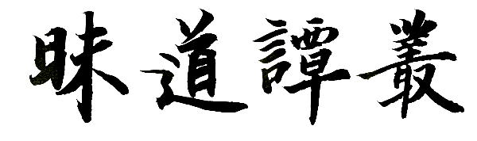

# **昧道谭丛**

### 4.5  践履

​       以下内容，我们将讨论修为自己过程中的技术性问题或者方法上的一些问题。佛家有八万四千法门之说，道家有三千六百法门之说，我们不可能面面俱到都聊到，甚至连“择其重点”也做不到。我将为大家交流的，是源自于民间的一种自修方式。交流过程中，能讲的地方我会尽量讲清楚，但有很多内容是需要有实证才能讲，这类内容我将略过；还有些内容具有个体性，未必人人都会出现相同的状态，这类内容我也将略过，或者至多是举典型例子，需要大家举一反三自行领悟。此外还有一点需要强调，那就是，不要急于想着达到某种程度、水平或者境界，万丈高楼平地起，我交流的重心，肯定是放在最基础与最基本的地方，可能很多内容大家早就耳朵听起了茧，但大家一定要相信，这些基本的东西过不了关，今后我们的修为迟早会出麻烦，迟早得倒转来，从头再来过。所以，我们聊基础的东西，希望大家能耐烦一点——“不要着急”四个字就是心法嘛。甚至换个角度看，最基础的，恰恰就是最厉害也是最顶尖的，正如前文所聊，大多数人连吃饭睡觉之时都在打妄想，而真正过关的人，恰恰心思就是用在衣食住行之类的琐细之处。很多朋友对具体修为的“技术”内容非常感兴趣。但要知道，《心经》早就说过“无无明，亦无无明尽……无智亦无得”。我们实践下文所聊的技术，并非有个目的，比如，不是为了“破除无明”，更不是为了证得一个什么“果位”。我们的实践就是“无事生非”，就是“吃饱了撑的”——这话不是贬义，而是如实陈述！千万不要以为自己学会了这些技术，自己就“高人一等”或者自己就会变得“很高明”。
​    
​       请大家再回顾一下我们第四章中聊过的“习惯”二字。其实在那个小节中，我们已经对真正修行的技巧做了精细的剖析，完全按照那条路子走，已经可以确保万无一失。那么，本章节下文中所要聊到的内容，严格说来已经是多事。不管我们下文要聊什么，都希望大家务必要深刻领会前文“习惯”那个小节背后的原理，在领会了原理的前提之下，结合我们下文所聊，那么，我们可以对修行的路子，有更加深秘的理解，从而可以确保我们修为自己在深与广两个维度，都不会错路。
​    
​       与朋友们交流的时候我经常提到，不要动不动就聊些高大上的东西，因为很多基本的、基础的东西，我们都还没有落实彻底，谈那些高大上的东西完全就是好高骛远、没有意义。私底下跟朋友聊天，我说“我们得向猪学习”。有朋友觉得我说这话是在骂人，其实不是。我的意思是说，我们应该从两个最基本的地方入手，即，吃与睡。套用前面大珠慧海禅师的话，就是我们得确保自己安处于“饥来吃饭困来眠”的状态，没有这个状态，则一切修为都是空谈。大家不要把传统修为的路子想得太复杂或者太奇怪，真正最基础的修为，就是从吃与睡这两个字入手的。前文一直在强调衣食住行、柴米油盐，换个角度来看，我们其实就是在强调“吃”这个字。关于“吃”这个方面的内容，我们不做详细讨论，仅将最基本的三点列举如下。我们讨论的重点，将放在“睡”这个字上。

#### 4.5.1  吃

​       关于“吃”的三个基本点分别是：一、降低我们日常饮食的盐摄入量。现代生活状态中的人，不管是有意还是无意，其实我们的盐摄入量都严重超标。后果，当然是大家耳熟能详的高血压、血管硬化、脏器受损等等。由于我们的盐摄入超标，所以必须得先将体内的盐份降下来。方法，就是做一些简单的运动，通过出汗，通过汗水，将体内多余的盐份排出。在每年最热的三伏天，稍一运动就会大量出汗，这个时候就是最佳的排除体内多余盐份的时候。在三伏天的那三十天时间里，确保自己饮食清淡，并通过简单的运动让自己出汗。经过两年或者三年“三伏”，就可将自身体内的盐份调整合适。这个过程中唯一要提醒的是，如果出了汗后，我们有眩晕的感觉，则是出汗太过，伤了阳气，那就需要暂停，并饮些水补充水份。有朋友问，小便也可排除体内的盐份，为什么我们这里强调必须要通过汗液来排除呢？原因很简单，我们身体某些部位的盐份，小便是排除不了的。比如，肝与脾就需要通过腋下来排汗排盐，心包则通过胸口心窝部位排汗排盐，大肠比较奇葩，是通过“满头大汗”来排汗排盐。二、主食，尽可能以蔬菜稀饭为主。在我们四川地区，特别推荐大白菜稀饭、青菜稀饭、萝卜稀饭以及红薯、芋儿、土豆之类煮饭。现代生活状态中，肉食与脂肪的摄入也远远超过了我们身体的需要。传统的规矩是“初二、十六打牙祭”，也就是说，农历每个月中只有两天是肉食，其他时间都是素食。萝卜或者青菜，对清除我们体内多余的脂肪有好处，而大白菜（`不是卷心白或者莲花白`）对清理我们的肠道有好处。三、配合上述第一、二条，若体质较弱或经常做“出汗”训练的朋友，则可以在蔬菜稀饭之余，吃一些需要发酵的食品，比如馒头、面包、发糕、豆豉、豆腐乳、酸奶、黄豆酱以及泡菜、酸菜、啤酒、黄酒之类。当然，同样要注意盐份摄入别过分。此外，如果你准备尝试辟谷或者有禁食的打算，则在实行之前的一到两周，尽量不要食用发过酵的食品。关于饮食还要申明一点，即，传统修为，除特殊情况外，是严禁吃任何有“滋补”作用的物品的。
​    
​       《菜根谭》中说“淳浓香甘非真味，真味只是淡；神奇卓异非至人，至人只是常”，大家经常都将注意力放在后半句，其实前半句是同样非常经典的总结语。按前辈们的说法：饮食不能安于甘淡，则常态生活中为人做事肯定不可能安于平淡；饮食能在甘淡中品出味儿来，这个人做任何事都没有问题——“嚼得菜根，百事可为”嘛。显然，吃这个字，依然与心性修为是一体的。那么，甘淡的标准是什么呢？很简单，随意挑棵大白菜，用刀对剖成两半，取其中一半，洗干净放碗里，把水烧开，然后将碗直接放到开水锅里蒸。大约蒸一刻钟之后取出，碗底会剩有一些蒸出来的水份。将这些水盛到另外的碗里，晾冷之后自己尝一尝，品一品这个味儿。传统的说法，这蒸出来的水，就是所谓“金浆玉液”中的“玉液”。这玩艺儿不是拿来生津止渴的（`虽然有生津止渴的功效`），而是用来衡量我们体内盐份调节是否合理的——如果我们尝了之后觉得没什么味道，则我们体内的盐份一定是过量了，我们的体质，恐怕也已经有了一些问题；如果我们感觉这玉液有盐味儿，则我们体内的盐份应该不是很高，但仍然需要降低饮食的含盐量；如果我们尝了，感觉玉液偏咸，则我们体内的盐份调节，应该是较为合适了。所谓“甘淡”，按长辈的说法，半棵大白菜煮成两人份的稀饭，这盐味儿就正合适，此刻的味儿，就是甘淡。

#### 4.5.2  睡

​       我们重点要讨论的是这个“睡”字。一切修为，都从最浅近的“习惯”二字开始。“睡觉”也只个是习惯。在开始训练之初，我们不要去为自己设定“时间”上的目标。例如道家讲的“百日筑基，十月怀胎，三年一小成，十年活神仙”之类的时间目标，那是专门说给那些“急于求成”的人听的，事实上根本就不是那么回事。虽然也有一些专门利用时间目标进行训练的特殊方法，但基本就没人能练成。比如民间流传的一种“四十九天功”，只需要训练四十九天就能达到某种程度。但二、三十万个人里面，可能才会有那么一两个性格特别偏执、身体素质极为特殊的人可能练成。何况，纵然练成，这个所谓的“成”，也不过就是坚固执着之下的一种法术（傲慢）而已，并没有什么了不起。总之，我们不要为自己设立时间目标，我们仅仅只需要养成一些“习惯”，这个习惯，你什么时候养成了，那就什么时候再去养成下一个习惯。不要像前面聊的“真人秀”中的壮汉或者女士那样，拼命向前，那绝对会搞出岔子。
​    
​       那么，我们怎么睡觉呢？别想多了，你平时怎么睡，现在还怎么睡。唯一不同之处，是一定要比平时自己睡觉，多睡一个小时。按传统的规矩大家可能做不到，因为要求是“酉时”也就是现在的下午五到七点左右就得睡下去。做不到，退而求其次，那么我们在晚上九点左右，必须得睡下去。就是老老实实地睡，别多想。初期习惯还在养成阶段，早晨一醒来我们就起身，简单煅练一下，或朗读吟诵或洒扫炊食皆可。后期有一个阶段，是我们已经能在睡梦中“起观”之后，早晨若醒得早，则尽量不要起身，让自己再多“眯”一小会儿再起身。若已能起观，则眯这一小会儿，我们自能品出妙处。如果可能，我们中午也尽量睡一小会儿，哪怕只能睡上个十多二十分钟，有条件也一定得睡这么一小会儿。实在没条件，那就算了。总之，以上要求是基础的基础，如果确实中午、晚上都没条件做到，就不用再多打妄想了，还是老老实实继续将心思用在衣食住行上的好。
​    
​       每天多睡一小时，用两个月（61天）的时间将其养成习惯。两个月后习惯已养成，根据各人的身体情况，若自我感觉“精神好”，则算是这个基础已完成。也就是说，两个月的时间，我们要达成两个目标。其一是养成多睡一个小时的习惯；其二是调整自身到“精神好”的状态。若两个月后精神无好转，则请再多养一个月。若你只用了一个月就已经自感“精神好”，对不起，也请两个月之后再继续下面步骤。总之，不要急于想着“尽快找到感觉”或者“尽快达到某境界”，这种急迫的心态，不仅是修行的大敌，更是心性上的大问题！虽然我们上面刚说过“不要为自己设定时间上的目标”，但这个地方，我们说两个月就一定是两个整月，时间只能多不能少。这两个月的时间哪怕你只差了一天，我可以保证，你今后肯定会功亏一篑，你会在修为自身的最后阶段，临门那一脚，永远也踢不进去。更大的可能，是根本到不了“最后”，因为一心想着要尽快有所收获，这个人肯定走不远，他一定会被半路上的风景，给绕进去！早就说过，心态急迫绝不可能致重达远。用这两个月的时间调整自己的睡眠，自己也可以反观一下，看看自己日常之时失念、散乱、掉举的情况，是否有所减轻，记忆力是否有所恢复。正常情况下，两个月时间，我们的记忆力应该会有所恢复。
​    
​       如果你还想着，自己忙乱了一天，晚上的时间正是内心最安静的时候，正是可以做点自己想做的事的时候，诸如看看书，学习学习，或者玩玩手机、练练书法、看看电视电影之类……觉得不干点什么事儿就直接睡觉了似乎“太不划算”。那么对不起，你不适合这套自修之法，建议尽早另觅他途，不要耽误了自己。我们终其一生，只想知道真正意义上的“真知”是什么，正如前面“立见”小节所言，真知究竟是什么，在我们的时空条件下，根本不可能知道。别人怎么想我不管，反正对我个人而言，我过了四十岁终于确定了我个人“自以为是”的真知，就是这两个字：吃与睡。用前辈的话说就是：黄老那套统御之术、阴阳变诡之术，与道有屁关系？！你一个人的本份就是吃了睡！

#### 4.5.3  息

​       通过两个月“多睡一小时”的调整，自我感觉“精神好”之后，我们再睡下去，就可以开始尝试找一找心与意的分水岭。这个时候，种种形式、方法才开始有用武之地。形式很多，最直接的，是睡下去之后，自己注意自己在对自己“说些什么”。也就是说，将精力放在“观察自己与自己对话的这件事情本身”上面。心态，就是我们前面聊过的“沿河观流”的状态。这种方法非常直接，年龄在二十五岁以下的朋友，玩这种自我观察没多大问题，年龄在二十五岁以上的朋友，往往没法注意到“自己在对自己说些什么”，他一开始注意观察，就顾不上自己与自己说话；一旦开始自己与自己说话，立即就又忘了“观察”。这也没办法，因为随着年龄增长，人的精神走下坡路，已经不知不觉之中走出了很长一段。二十五岁，就是一个人精神由盛到衰的分界线。如果我们已经不能直接进行观察，那就需要其他的方法来辅助。作为建议，我建议的辅助方法是“数息”。
​    
​       如果不能使用直接的办法去观察“自己在对自己说些什么”，那我们干脆就不观察，而是睡下去之后就开始数自己呼吸的次数，数满十或者百，就又从头开始。如果数着数着，突然发现自己数“断”了，忘了刚刚数到哪儿了，那就从头，从一开始重新数。要领，是细细品味并找出“专一”与“散乱”的分界线。这点，后面我们详谈。
​    
​       如果你不愿数息，那任何形式都可以，比如念佛、持咒、观想一潭湖水、一块小石头、一片树叶……等等。需要提醒的是，不要使用市面上流传很广的“意守丹田”这个形式。因为大家现在才刚入手，根本就不会“意”守，通常大家说的“意守”其实都是“心守”，这会对物质肉体产生不良影响。现在市面上讲“意守丹田”的很多人，是不知道心与意是有区别的，而“意守丹田”根本就不是入手的方法。所谓“得意忘形”，这是已经“得意”、能操作“意”的人，才能使用的办法。如果站在更为严苛、更为苛刻的角度看，则念佛与持咒也有弊病（`或者换个词，不是弊病而是“殊胜”——弊病或殊胜，实质是一码事`），至于是什么弊病这里我们不讨论，毕竟人有个体差异，人的因缘也各不相同，确实有人就需要这类形式。我推荐的形式是数息，万不得已，或者其人素质非常特殊(`比如身体特别虚弱，或欲望较常人淡薄`)，那么我推荐使用“观想三角形或者观想十字形”的办法。注意，我并不推荐观想佛菩萨像或者观想莲花、梵字、坛城、曼陀罗之类。如果确实对佛教感兴趣，要使用念佛、持咒或者观想佛教相关的东西作为形式，那也没问题，虽然我上面说有弊病，但只要严格按我们后面的步骤操作，则弊病也可消于无形（`无弊病也就没有殊胜——从根本上讲，本来也就无所谓殊胜，有的，只是人“自以为殊胜”的妄念。`）此外，年龄在十二岁以上、四十五岁以内，身边无人指导的话，最好不要观想月亮或者太阳，否则会有麻烦。若四十五岁以上，或者四十五岁以内但有恶疾缠身、身体特别虚弱，则可以观想月亮或者太阳，但仍然要特别谨慎，一旦自身阳气有了恢复，就必须注意饮食清淡以及自身心与意的规范、调整。这一点，希望大家务必要警惕，否则就是在自掘坟墓！
​    
​       我推荐的形式是数呼吸次数，这个形式相对要工整、平稳一些。当然，不管你最终决定采用哪种形式，只要实践，你很快就会发现，你在坚持按形式操作，但老是有个东西在干扰你继续做，你老是会“分心”。比如数息，数着数着突然发现自己数“断”了，忘了刚刚数到哪儿了，这就是散乱。出现这种现象之时，需要非常谨慎，因为应对这种状态的方法，既有岔路，更有前辈们因为某种原因，有意在这个阶段设置的陷阱或曰门坎。
​    
​       通常而言，我们的精神容易散乱，原因多多少少就是我们睡眠的时间没有够，所以心力就不够用。显然，要解决散乱，首先必须调整好我们的睡眠，这是解决这个问题的大前提。在出现散乱的情况之时，我将推荐一条应对路子，但我们这里暂先不聊，我们先聊常见的岔路，以及前人有意在这里设置的门坎。
​    
​       有一个词语叫“入静”，很多修为理论都在谈这个词语。通常的说法，一个人在修为自己之时，如果不能“入静”，则可以说是修为根本就没有入门。究竟什么是“入静”呢？按很多人的认识，就是内心没有杂念，能一心一意，能聚精会神，能摒除外界的一切干扰，专注于当下自己正在操作的某种形式（`例如数息或者观想`），这就是入静。我们在修为自己之时，老是要散乱掉，那当然是杂念过多。换句话说，就是没有“入静”。长年累月入不了静，一个修行人就会退失信心，产生自惭、自卑或者自怨。其实，“入静”这个词语，是前人为了某种目的，有意设置的陷阱与门坎。严格意义上说，根本就没有“入静”这回事。或者换种说法，是真能入静的人，脑子里完全就没有“入静”这个词，对“入静”是什么状态，也完全没有概念。或者再换种说法，如果我们脑子里没有“入静”这个词，也没有关于这个词的意义的定义，则我们反而不知不觉中就能有实质上的“入静”状态，我们脑袋里有了个这词，自以为明白这个词的意思，恰恰就是我们入不了静的真正根源。其实，静这个字，本身就是一个具有相对性的语汇。现在大家在看我这个文本，可以说，当下，大家就是“静”的，因为此刻你的脑袋没有跑野马想其他的东西；我们与人聊天，东拉西扯，但不管怎样，我们的注意力放在所聊的话题之上，我们也是“静”的；我们按某种形式操作，发现自己杂念纷飞，发现自己动不动就散乱掉了，与我们在常态之时相比，我们常态之时还发现不了自己的散乱，现在我们能发现，显然我们也比常态之时更“静”。如果我们脑子里有“入静”这个词，那么你不妨反省一下，纵然你在修为过程中有任何的境界或者状态，回到常态之后，你都会怀疑自己是否是“已经”达到了“入静”的程度，换言之，疑心，会伴随你自己整个的修为过程，从而迟早某天，你会坚持不下去。所以，没有“入静”这回事。前人将“入静”二字做为修为入门的衡量标准，其实有另外的目的。简言之，就是要用这个词，沙汰掉一部份学人，就是要让这部份学人产生自惭、自卑与自怨。原因，当然是看出了这部份学人在心性修为甚至品行修为的根基上，还有毛病、还有缺陷，所以用这个词，将这样的人挡在门外。各位有机缘看到本小节的朋友，自己心里有数即可，不要轻易坏了前人设置这个门坎背后的苦心。仅从理路上讲，所谓“途中即家舍，家舍即途中”或者“既不在途中，又不在家舍”，所以也没有“入静”这么回事。能有的，无论是任何状态，都只能是一个暂时的状态，最多，只能算是一个临时的歇脚场。
​    
​       以上所聊的是门坎，除了门坎，在我们面对散乱状态之时还有条岔路。岔路也是路，只不过与我们下文要聊的路子稍有些区别，所以首先要申明，岔路并不是错路。
​    
​       我们在按自己选定的形式（`如数息`）操作之时，一不警觉就会散乱。最常见的说法，是我们一旦警觉到自己已经散乱，就必须马上将我们的精神重新拉回来，重新专注到自己正在操作的形式上去。这种说法估计大多数人都看到过。如果从修为的路径上来说，这样做也不是错的。但请注意品味：如果我们警觉到自己已经散乱了，重新将自己拉回到正在操作的形式上去，那显然，我们的心力会有个刹间的增强，心力的增强就意味着意力的减弱，意也就会随着心力的增强，刹间隐没。走这条路子，我们长年累月处于随时在“拉回自己念头不乱跑”的状态，这实在对人的信心与耐心是个严峻的考验。我见过很多走这条路子的人，扛不过这个过程中自己内在的焦躁，从而最终放弃掉修为。能够通过这条路子修为自己，并信心不退而有所内证的人，只能说，这样的人无论是信心、福份还是根性，都远非我辈所能望其项背。
​    
​       总而言之，上面这条路较为艰难，我辈信心、根性与福份都不太充足，所以我们还是走稍微缓和一点的路子。这也是我为大家推荐的路子——首先，请回顾一下我们在前文中强调过的关键点：我们肯定了“有心”，所以不走“时时勤拂拭”那种杀伐自心的路子；我们只有在了解了自身之后，才谈得上了解他人、了解人群、了解社会乃至于最终了解世界；了解自身的最佳方法，就是用自己的心，以“沿河观流”的方式观察自己的意。那么，将上述这几个关键点落实到我们具体的操作当中来，在我们警觉到自己已经散乱之时，用心的方法也就明确了——
​    
​       显然，有散乱的现象，并不是坏事，恰恰是好事！本小节一开始我们就在强调，我们首要的目的，是要“找出心与意的分界线”，找这条分界线最直接的方式是观察“自己与自己说话这件事本身”，由于我们无法直接进行观察，所以需要借助一些形式。现在，我们警觉到自己有散乱的现象发生，其实就已经处在了心与意的分界线上，就已经通过我们操作的形式，达到了我们的目的。在警觉到我们已经散乱的刹间，我们立即进入“沿河观流”的状态，这个时候，才是我们真正“修行”的起步。请注意在此处与前面那条路子进行对比，前面是立即将自己拉回到自己选择的操作形式上去，我们这里不需要将自己拉回到前面的操作形式上去，而是转变心力为“观察”状态，以一个旁观者的姿态，开始对自己的乱跑乱想的意，进行旁观。能够旁观，已找到了旁观的感觉，我们又需要花一段时间，将其养成为一种条件反射式的习惯。习惯养成，我们的修为才真正入门。
​    
​       以上聊了这么多，此刻，请回一下神——我们现在本身是在干什么？还记得吗？我们是在“睡觉”！如果我们处于这种旁观的状态中，越睡越清醒，越睡越没有了瞌睡，甚至搞到失眠，那只能证明一点，我们的心力还太强，我们思与想的目的性、方向性都还太强；反之，如果我们处于这种旁观的状态中，没一会儿，不知不觉就睡着了，那就是我们心力太弱，意力泛过并淹没了心力，我们就陷入了睡梦之中。所以，修为入门的第一个关键点，是我们要调整自己心力与意力的比例，既不能心力太强，越来越清醒，也不能心力太弱，一不小心就睡着。心力与意力最恰当的比例，是意在不受约束地自由奔流，而心始终保持一定强度的旁观力度，既不跟着跑从而散乱掉（`也就是睡着了`），也不过于强势造成意力隐没（`也就是沿河观流之时，流，隐没不见了`）。换言之，这里调心，如同调琴弦，太松太紧，都不行。“调心如同调琴弦”这个比喻很多人都听说过，但真正知道这个比喻其实是用在这里的人，在传统之中通常是核心的得法弟子，长辈才会在此点透。若非核心得法弟子，绝大多数情况下，师辈会让你走上述那条艰难的路子。当然，能从那条路上走出来的弟子，师长定会刮目相看。
​    
​       将心调整到不松不紧的程度，因人的身、心状态不同，需要花费的时间也不同。这个不松不紧的程度，是今后一切修为的基础，这个基础必须打牢实，不要急着往后面跑！这个基础打得牢，后面的内容反而很快就会通过，这个基础欠火候，则后面还会回到这里来打补丁，反而会出一些意想不到的问题。这就好比是射箭，弓弦往后拉，多花点时间，稳住。越稳，反而越容易命中目标。
​    
​       归纳一下以上内容：我们的目的，是要以“沿河观流”的方式用心去观察意，所以借助某种形式（`如数息或念佛之类`）调整自己，让自己处于心与意的分界线上。这种调整，需要注意心力与意力的比例问题，即，心力太强，则意力就会减弱甚至隐没，我们“沿河观流”式的观察，就无从谈起；若意力太强，心力太弱，则我们就会彻底散乱掉，从而失去观照并睡着。恰当的比例，是心能保持观照，而意也可以自由流动。将心力调整到这种程度，才是真正的入门。而入门之后的要点，是要花一段时间训练我们的心，能条件反射式地随时返观自己的意。在此过程中，根本就不要去考虑什么入不入静之类的问题，这类问题想多了，反而会成为我们的障碍。
​    
​       不管你花多长时间来调整自心到不松不紧的程度，总之，你会在此阶段，逐步经历一些状态。将这些状态稍做归纳，一共六个字，分别是觉受、情境、见识。请务必深入领会这里归纳的这六个关键点，但下文，我们将只重点聊前四个关键点，最后“见识”二字，将不会“明确地”进行讨论。

#### 4.5.4  觉

​       第一关键个字是“觉”，就是“肉体感觉”的意思。
​    
​       我们每日定时进行“沿河观流”的观念游戏，很快就会在肉体上产生种种感觉。归纳而言感觉可分为“酸胀热麻痒冷滑涩”等几种。这些感觉未必全都会出现，但至少会经历一到两种。通常而言，最容易出现的感觉是“痒”，身体表面会像有虫子在爬动，有搔痒感；其次容易出现的，是肌肉或皮肤不受控制的自由蠕动或跳动；再次可能会出现酸胀感或者麻木感；酸胀麻木之后，可能会出现或冷或热的感觉。冷热，本质上讲是一回事，大多数人会先感觉冷然后突然转为热。也有人是不经过冷直接就发热。注意，热，并不是暖，暖通常要下一个阶段“受”之后，才会出现。两者的区别是，热由外部肢体发出，而暖由内部躯体发出，并且暖比热更持久、更柔和。通常而言，滑的感觉会最后出现（`未必人人都会出现`），我们会感到自己如同被奶油浸过一样，通身温润柔和、细嫩滑腻。我们会觉得自己如同婴儿一样，会有肉体已回复到婴儿状态的感觉。这种感觉当然不是坏现象，但也谈不上是好现象，仅仅就只是种“现象”，千万不要自以为自己达到了道家所讲的“能婴儿乎”的程度——傲慢发作。不过，滑的状态，客观讲，其实是肉体气血已即将恢复正常之时才会有的现象。
​    
​       简而言之，处在“觉”的程度，不管是任何的感觉，全部局限在身体“触觉”的范围内。我们虽然在玩“沿河观流”的游戏，但此刻我们还囿于物质“身体”的种种感觉之中，不管是有意还是无意，事实上我们此刻还“记得”我们在睡觉，是躺在床上的。如果用梦与醒做为标尺来进行衡量，那么此刻我们就还是醒着的。

#### 4.5.5  受

​       第二个关键字是“受”，就是“感受”。“受”与“觉”不同，觉是特指身体的“触觉”，而受是指我们的思维局限在“视觉”与“听觉”的范围中。此外，受有一粗一细，二层状态，以下分述。
​    
​       如果眼前有光感，或白或金或紫或银，或明亮或柔和，或一闪一闪地闪动，或长久的持续；再或者耳朵里听到气血鼓荡的声音，或如蝉鸣，或如雷音，或如装甲车开过一般轰隆……有光感与声音，就是“受”的程度。无论是眼还是耳的任何“感受”，都是肉体在自我调整、自我修复之时的现象。有光与音这两种情况中的任何一种出现之时，日常之中我们都需要特别谨慎自己的饮食，一定是多素、少盐、清淡，并要特别谨慎减淡自己的欲望。以上现象，还是较为粗重的“感受”，我们的心与意，在这个程度其实还很粗重，还不够细微。
​    
​       受的程度再稍稍细微一些，可能我们闭眼也能看见外界，或者耳中突然响起各种奇妙的、自己从来也没听到过的音乐声。比如，我躺在床上睡觉，明明闭着眼睛，却突然看见了卧室整个的环境。如果注意反省，会发觉其实自己根本就没有看见“真正”的外界，看见的，是自己意识中“自认为”的外界。换句话说，所看见的外界，其实是“意”中对外界的记忆，投影到了“心”上面，与真实的外界环境相比较，就会发现自己“看到的”外界，往往会多出一些东西或者缺少一些东西。比如我看到了卧室的环境，等到清醒时，发现卧室里明明多出了一张凳子，但刚才睡梦时，并没有看见这张凳子。因为，平时那个位置并没有凳子，当天是临时搬了张凳子在那儿。显然，自己所谓看到的外界，只是一个对外界的“记忆”，这个记忆投影到了我们的心上面，让我们误以为自己是闭眼看见了外界。若没有反省到这点，就会以为自己真的是“闭着眼睛看见了外界”，傲慢习气发作，就会觉得自己是否是有了所谓的“天眼”、“透视眼”，这种错误的判断，就会导致错误的结果甚至错误的命运。还有一些人，不是闭眼看见了外界，而仿佛是直接看穿了房顶，看见了天空甚至太空。说到底，这些现象都是眼根习气在心上的投影，都是虚妄不实的。耳中听到的种种音乐，同样也不是宗教暗示我们的，是什么天音妙乐、天人之乐等等，更不是什么“宇宙的弦律”之类，其实就是自己耳根习气的投影。要特别小心，“受”的这个细微程度，容易被种种宗教利用，宗教会暗示你，说什么“肉眼已尽，天眼将开”，或者什么“天门将开，已与天界相应”之类。一旦不慎，或遇人不淑，相信了种种宗教的暗示，那将非常危险，短短几天之内就会让一个原本正常的人，陷入极为麻烦的精神与思想状态中去！同样用梦与醒做为标尺来衡量，那么此刻我们就处在半睡眠状态，身体的触觉还残存，但不再明显，我们心力已放到了或声或光的范围里。日常我们睡觉时出现梦魇，想喊喊不出，想动动不了，其实就是处在这种“受”的半睡眠状态中。
​    
​       通常而言，在觉与受这两种状态之时，我们的物质躯体可能会有一些“燥火”的现象，例如口苦口干或者有口气甚至牙龈肿胀出血之类。请小心，出现这类现象之时，不要随意吃那些“清热凉血”类的药物，否则反而无助于我们自身肉体阳气的恢复。我们只需要保持饮食清淡即可。这个阶段有个典型的征候，就是某一两天，我们处于“沿河观流”之时，或左眼或右眼的眼皮正中间，会有悸动，丹道的术语，称为“降丹”。
​    
​       严格意义上讲，我们处于上述“觉”的程度之时，我们并没有“睡着”，心力还处于强势状态；处于上述“受”的粗重状态时，也没有睡着，但心力已经有所弱化；而处于上述稍细一点的“受”的状态时，心力就已经相对弱化得较明显了，但人同样还没有睡着，而是处于“半睡眠”状态，这个半睡眠状态再稍稍细微一点点，人就会彻底散乱掉，也就是真正睡着了。这种半睡眠状态，对人肉体状态的恢复，是特别有效的。观察一个人的呼吸就能知道：没睡着，处于“觉”时，有呼有吸；处于稍粗的“受”时，同样有呼有吸，但会比之前浅淡一点点；处于细微的“受”时，呼吸会浅淡到近乎于没有，说明肉体与思维，此刻的消耗是极低的；从细微的“受”进一步，直接散乱掉而睡着，人的呼吸会突然恢复到像常态时一样，不再像刚才那样浅淡，甚至可能会比常态呼吸得“更重”一些。这说明人肯定已经开始“做梦”，思维与肉体的消耗，又加重了。所以，保持心与意处于“细住”状态（`也就是半睡眠`），是恢复脑力与肉体精力的妙招。我们经常强调养成午睡的习惯，就是因为午睡多半只能处于半睡眠状态，而这状态，哪怕只有十分钟，对下午半天人的精力与脑力状态，影响极其巨大。
​    
​       我们的心，在面对上述觉与受中的任何“情况”之时，最佳的态度是四个字：不去管它！有就有，没有就没有。我们的用心之处，仍然是旁观的那个观察力。通常而言，经历了上述觉与受的过程，这个人的物质身体，气血内脏等等，会有一定程度的恢复与好转。
​    
​       在传统修为的路子中，我们在经历了上述觉受程度之后，长辈未必会告知我们下一步的用心方法。原因，是要考量我们的内德。如果内德有缺陷，将用心方法告知这个人的话，会害了这个人——轻则疯狂，重则死亡。不过，这里暗藏有不易回答的问题：没有缺陷的德行，究竟是什么样的？作为师长，通常不会主动去告知子弟，要等子弟自行参悟出自己德行上的缺陷，并修正。这么一等，几年十几年，很可能一个弟子就荒废掉了。在这里我们要继续讨论往下的用心方法，我将默认大家德行都已完备，如果你看了下面内容，感觉内心有恐惧或者有内心无法接受的地方，则请反省自己的内德！请注意，是自己反省自己的内德，而不是站在自己的立场上，来反对下面将要聊到的心法！

#### 4.5.6  情

​       第三个关键字，“情”。我们处于“观察自己与自己对话的这件事情本身”之时，对话二字，表明我们此刻在观察的对象，是“语言”式的。前文我们讨论过，这就是观音，是我们在观察自己对自己说话的“声音”，这种“声音”当然是无声的，是以“语言”为形式存在的。此刻，我们就处在语言的、耳根的、听觉的状态之中。我们长久地处于这种观察状态中，也就是说，我们长久地处于语言、耳根、听觉的“审视”与“监视”状态中，一天两天、一月两月……将会引发一个东西：情绪。最容易出现的情绪有两个，下面分述。
​    
​       第一个，是配合前面“受”中的“光感”或轰隆隆的“音感”，某天，可能我们心底轰隆一声巨响之后，仿佛“心结”彻底被震开，我们突然之间会产生一种莫名其妙的“心花怒放”的感觉！请注意这个“怒”字，真的是“怒”放！完全是控制不住的一种炸开的感觉！很多人觉得自己这一刹间是“大悟”了！是解脱了！其实是“大误”了！这是非常低级的误区。也有些人不是心脏位置被震开，而是头顶突然轰隆一下，仿佛自己的脑袋“空”了，不见了，“三花聚顶、五气朝元”，轰隆一下之后，似乎自己突然从物质肉体的捆绑中跳出来了！从而产生一种控制不住的喜悦之情。心花怒放也罢，喜不自禁也罢，归根到底就是一个“喜”字，喜极发狂的大有人在。
​    
​       第二个，是“爱”。我们长久地处于语言的、耳根的、听觉的“审视”与“监视”状态之中，经受过某种“无聊”感之余，我们突然之间内心冒出一种无法抑制的“爱”，这种爱无缘无由！无所不及！看到厕所里的蛆虫也觉得就是自己的“心头肉”！很多人认为这是自己证得了“慈悲”“博爱”“大爱”！这根本不是什么大爱，该“大挨一顿”还差不多！从这个所谓的“爱”或者所谓的“慈悲心”出发，刹间就能建立起一整套的理论体系，这样的体系往往“看上去很美、很真、很善”，对女性的蛊惑力特别巨大。可悲的是，这样的体系恰是最典型的邪教。
​    
​       上述这两种情绪最易出现，也最易被种种宗教所利用，要万分谨慎！由所谓的喜，很容易又衍生出另外的情绪，比如憎恨、厌恶或者悲哀。为什么会由喜生出另外的这几种情绪，大家需要自行参悟。由所谓的爱，也会生出另外的一堆情绪，比如所谓的慈悲、大悲，以及愤怒、枯渴、杀心、勇猛心等等。喜极也发狂、爱极也发狂，总而言之，一切情绪，终究是要令人发狂！我们要特别警惕那些宣扬所谓大爱、慈悲、喜乐之类的种种宗教或者哲学教义，更要警惕宣扬这些东西的人！爱心最易生杀心，那些自认为自己证得了“大爱”“慈悲”“博爱”的人，对其稍加引导其人就会生出杀心，再稍加引导，其人就会被别有用心的人“当成枪使”，走上“舍身殉道”的路。再次强调“平常心是道”，喜也罢乐也罢、慈悲也罢大爱也罢，统统都是“非常心”。
​    
​       情绪所构成的上述圈子，在传统修为理论中被称为“小疯关”，意指修行人若不谨慎，或内德不到位，在这个关口很容易疯掉。那么，什么样内德的人，会过不了这关？或者说，内德中有什么偏差的人，会过不了这关？类似像屈原、林黛玉、王国维式的人，过得了这关吗？围绕这个话题，想再聊几句未必合适、但感觉很有必要聊聊的话：某位以博爱的胸怀、慈善的事业世界著名，被尊为“圣人”的修女，几十年如一日在街头救济流浪汉、抢救弃婴、为穷人谋福利等等。在网上看到她的照片，让人心底暗吃一惊，因为从传统“相术”的角度讲，她这相貌，心性冷硬，是个“杀心”极为严重的人。从她的所作所为来说，她的相貌应该是显示出和善、温暖、慈悲呀？为何显示出的是凌厉的“杀伐”相貌呢？后来看到一段她说的话，话中对她所工作的那个城市有所描述，大体意思是整个城市愚昧落后、人心贪婪又残酷，整个城市充满了被社会遗弃的人，自己的工作就是为这样的人，带去福音。从她的话中，反正我读不出所谓的“爱”与“慈悲”，我读到的，是她对她所在的城市，深深的厌恶，以及她背后隐藏的，她自己也未必意识得到的，“自认高尚”的傲慢。这种傲慢与厌恶本身就是杀伐之心：若有她认为的“贪婪又残酷”的人出现在她身边，恐怕她会杀之而后快吧？！如同挂钟的钟摆，往左往右本质上是一回事。她做的救死扶伤的事，实质就是一种变相的对“坏人”的杀伐。那么，她显示那样的相貌，也就不难理解。换言之，按传统修行理论来看，这位被尊为“圣人”的修女，其实处于半疯状态。既然已经聊到了这里，干脆稍稍离题，顺着话头再聊一点相关问题——
​    
​       我们一定要清醒的认识到，宗教之所以为宗教，无可否认，其背后明明暗暗都会有一定的社会性与政治性。注意，无论哪种宗教，包括未必有宗教之名但却有宗教之实的一些哲学或思想体系，都会将真、善、美以及慈悲、忍耐、博爱等等，用做“门面”。这门面的最大作用，是心性相应的人会有很强的认同感。然而，有这样心性人，恰恰其杀伐心、厌离感、憎恶心也较常人更为深重，但通常会藏得更深秘。宗教巧妙地利用这些人，悄悄引发他们的憎恶、杀伐之心，不动声色之中，就能将这些人“当成枪使”。稍稍冷静点、客观点，我们不难看出，历史上那些著名的“殉道者”“殉教者”，其实真正殉的并非是什么教义或者理论，而是殉于他们内在的憎恶、厌离与杀伐之心。所以，我们一定要警惕那些将大爱、慈悲、喜乐、善美等等挂在嘴边的教义以及宣扬这类教义的人！这类教义与这类人，多半来自于西藏密宗、印度教、日本佛教与日本禅，以及从西方传到国内来的瑜伽大师、女权主义者、全球性的所谓“公益组织、人道组织、关爱组织”（NGO）之流，当然，还有国内的某些邪教也是一样。前面我们说到，内德有缺陷的人，师辈多半不会告知其用心方法。上面说了这么多，那到底是什么缺陷，想来大家应该已经能明白。好啦，不再跑题，聊回正题——
​    
​       喜也罢，爱也罢，由喜与爱衍生出的其他种种情绪也罢，当其出现之时，我们统统不去管它，更不能因为有这些情绪出现，就自认为自己精神上“有了提升”——那是将要发疯的前兆！当种种情绪升起之时，我们的内心已能正视而不被摇动，此刻，我们的精神就已经较之于平日更为稳固，精神的稳固必定带来肉体的变化，这个阶段，有那么十来天到一个月左右，我们会发现自己早晨醒来的时候，身体表面有一层腻腻的，如同牙膏一样的东西，丹道术语，称这种征候为“换肉质”。

​       传统修为路径中，当一个人落在“情”这个圈子时，能否平安渡过这个关口，要看其人对师长的信心。所以有种说法是，这个状态中的人，要以师长的心态为心态，即所谓“师长就是你的心态”。如果对师长无信心，或信心不足，则很可能自以为自己已经证得“慈悲”、“博爱”，境界远超师长，在自己眼中，师长还是个一身俗气的人，那么，这个人就完蛋了……所以，这世间绝大多数修行人，其实只能修为到觉与受的程度，师长若不考量其人内德与信心，则告知其人修心方法，很可能最终会害了这个人——《老子》讲“善复为妖”，只要修为状态还处于“情”的圈子中，这个人就落入了“妖”道，其人言谈必定“有光华”，必定有“正大光明”、“慈悲博爱”或“仙风道骨”的外显之相。

#### 4.5.7  境

​       第四个关键字，“境”。一旦我们经过语言的、耳根的、听觉的状态之后，立即就会进入图象的、眼根的、视觉的状态。此刻，我们的沿河观流，已经不再是在观“意”中语言的流动，会如同睁眼看到一样，变成在观“意”中的“境界”。简而言之，日常我们睡觉做梦时能梦到种种境界，但我们的心欠缺对这种种境界的观照力；此刻我们能“看”到意中的境界，其实就是处在日常睡觉做梦时的状态，只不过现在我们的心，对这境界有一定的旁观能力。也就是说，此刻我们就是处在日常作梦之时，与日常做梦不同之处，是此刻我们能在梦境中维持一定强度的心力警觉，甚至，我们还能运用心力，在一定程度上去改变意中的梦境。
​    
​       我们透过语言的、耳根的、听觉的状态，进入图象的、眼根的、视觉的状态。我们的沿河观流，不再是在观“意”中语言的流动，会如同睁眼看到一样，变成在观“意”中的“境界”。如果以梦境为衡量标准，则我们没有觉照力之时，我们会在“自我对话”、喃喃自语的过程中睡着，睡着之后做的梦，也是在“语言”的层面上的梦；如果我们做的梦，是以图象、境界、故事的方式显现的，则我们身与心的松弛程度，会比前者略深一些。如果我们保持着细微的觉照力一直在旁观，则上述两种梦中，我们都能够意识到自己是在“作梦”。事实上，当我们在眼根、视觉的层面上“沿河观流”之时，我们心力与意力的比例，是最恰当的。这眼根层面的“沿河观流”能力，是今后一切修为的基础。只有到了这个地步，我们才能理解传统之中的一些口诀到底是怎么回事。比如“眠在眼”，再比如“睡由拇指始”。所谓“眼若不睡，诸梦自除”，如果一个人的眼睛没有睡，则这个人就睡不着，所以“眠在眼”；一个人打坐的时候是否睡着了，只需瞄一眼他的大拇指，就能知道，所以“睡由拇指始”。
​    
​       在刚透过语言、耳根、听觉状态，刚进入图象、眼根、视觉状态之时，有一个修为过程中的坎需要警惕。因为语言、耳根状态中，我们的心与意其实是被潜在的逻辑、名相捆绑住的，我们此时的“沿河观流”，被观察的对象是我们自己无声地“喃喃自语”，实质上，我们就是在逻辑与名相构成的圈子里打转转。进入图象、眼根状态之时，逻辑与名相会变得淡薄（`并未消除`），此刻，我们很容易出现“表面上看”超越逻辑与名相的状态。逻辑与名相突然间变成了砖块儿，我们可随意将其“堆砌”成任何样子。这种状态的典型表现，是我们突然间就能出口成章，顺口说出来的话，就貌似极高明的“偈子”，或者开口就能滔滔不绝吟出诗来！日常之时我们与人讨论，也突然就显示出一种“无碍辩才”式的口才！当出现这种状态之时，我们要自我警惕，不要开口胡说八道。

​       我们处于语言、耳根、听觉的状态时，我们听自己的“喃喃自语”，喃喃自语的内容多半是乱七八糟，如果旁观的警觉力稳定，我们会发现，虽然内容乱七八糟，但自己对自己说的“每句话”，依然是有逻辑性的，不会出现突出的超逻辑状态；但在图象、眼根、视觉状态时，我们的梦境，往往会悖离常规逻辑，比如，我可能梦到猪飞到了空中，也可能梦到我在路上走着走着，陆地突然变成像水一样自己可以沉下去“游着走”。这些梦境显然有些荒诞，不符合常规的逻辑，这说明常规逻辑在这个状态已经变得淡薄。淡薄不等于没有，比如，猪为什么就不能飞到空中去？为什么在水里可以“游”？这其实依然包含着潜在的逻辑。
​    
​       三十多岁时跟朋友聊天，他突然问我：晚上一直在做梦，凌晨醒来去撒了泡尿，回到床上继续睡，你还能从刚才断掉的地方继续接着做上个梦吗？我听得目瞪口呆，说，我不行。他说，那你还得下功夫啊！这番对话，大家恐怕根本不知道其背后的道理与作用，到底是什么。我当时也不知道，但既然朋友问了我，我肯定要去证实一下，这到底有啥暗藏的名堂？后来是过了很长一段时间，我才明白他为何要问这个问题。正如朋友所说，只要不能毫无间断地接着做上个梦，那修为就还不行。大家不妨猜猜看，不行在哪儿？
​    
​       处于语言、耳根、听觉状态向图象、眼根、视觉状态“过渡阶段”，还有一大一小两个问题需要注意。小问题是，粗重的情绪、情感诸如爱恨喜乐等会淡薄，但略细微点的心情会变得明显又持续。比如安宁、轻安、轻快、轻松、愉悦等，会逐渐变得明显起来。日常之时，我们过去那种粗重的散乱状态会明显减少，我们的头脑也会较过去更清醒。知道有这种现象即可，不要因为有了轻安与清醒，就又暗中生出傲慢。大的问题是，可能我们会在某些事情上，出现灵感、预感甚至预知的现象。比如突然之间自己心情烦乱，一反观就意识到自己身边有什么东西将要出事；甚至突然之间，直接就意识到身边一定有什么东西将要出什么样的事，最后果然应验。有这样的现象，其实非常正常。如果理路清楚的话，我们自己也能反省出这种现象背后隐藏的原理。
​    
​       透过了语言、听觉的状态进入图象、视觉的状态，我们的精神就进一步稳固。前面“换肉质”，身体表面出现腻腻的膏粉状物，还在较为粗浅的状态中，这时候就会出现“换骨质”的征候。换骨质的征候，是我们在修为状态中，突然全身的骨头发烧，不要紧张，这是精神进一步稳固的现象，通常两三天，最多不过一周就会慢慢消失。如果这现象持续了很长时间也没有消失，那就恭喜你，因为你一定有暗藏的严重疾病（`多半是血液方面的恶疾`），这把火，已将其扼杀。发烧消退之时，就是你暗藏的毛病消除之日。千万注意的是，不要在这个阶段自寻死路，去找清热退火的药来吃！
​    
​       “修道者千千万万，成道者凤毛麟角”。当我们的“沿河观流”已经是在观“境界”而不再是在观“语言”、“情绪”之时，就到修道过程中最为关键、也最为危险的阶段。我撰写本文到此，犹豫迟疑了很长时间。因为，向后的路径，大多数情况下已不取决于后辈学人自身的情况，而取决于师长本人在当时的状况，也就是说，师长的状态会决定学人今后的路径。在无人帮助、监督与指导的情况下，想凭自身的能力、知见与眼界避开以下的魔境，可能性微乎其微。不要自以为看了几本佛经，知道“入魔”是怎么回事，就不知天高地厚，以为凭一己之力能避开魔障——这种自以为自己能避开的心态，本身就是傲慢，而这傲慢，恰恰就是最要命的魔障，是一切魔障的根子！在这里是否直接将这些内容写出来，让我难以决断。再三权衡，我最终还是决定写，但还是要强调前面说过的那句话：如果你看了下面内容，内心不能接受，甚至内心产生恐惧，则请反省自己的内德，而不是站在自己的立场上，来批驳或评价我们这里讨论的心法！

#### 4.5.8  魔

 ​      上文，“觉受情境见识”这六个字中，我们只聊了前四个字。整个“践履”这部分的内容，在撰写之初就决定不公开，写成后，也仅在知根知底的亲人、朋友间做了点交流。2019年底，刘阿姨建议我将不便公开的内容删掉，然后把能公开的内容发布出来。严格说，上面聊到的内容中已有本不该讨论的内容，本小节聊这个“魔”字，确实就不能再多说，所以这个公开稿中删掉了这部分内容。可能有朋友会对这部分内容感兴趣，这里只能对这些朋友重复那几句老话：越偏狭的知识毒性越大……知道这些东西比不知道这些东西，对绝大多数人来说，是祸不是福。
    
  ​     “情”的圈子，会导致一些人出现精神异常，这个状态被称为“小疯关”，但理性稍强的人是不太容易落入这个圈子中的；“魔”的状态，在传统中被称为“大疯关”，无论是理性还是感性，都极少有人能从中跳脱而出。甚至理性强的人，反而更难跳出来。可以说，前文大量篇幅在谈耐烦、去躁、忍、熬、敬、诚……等等内容，都是为了此刻“破魔”做好身与心的一切准备。徐皓峰先生记录李仲轩老人的言论，在谈到魔境的时候说“把魔境的好处全得了，所有甜头都吃了，也就没有了魔境”。我看到这个论断，真是万分感慨。确实，魔境是有好处也有甜头的，也正因为有甜头，所以人们才很难跳出魔境。污泥里才能长出莲花，如果没有魔境，那肯定也没有圣境。某种意义上讲，一个修行人若从未“走火入魔”，那这个修行人也不可能“超凡入圣”。虽然，魔与圣是两个相对的词，我们不厌其烦地讨论过人心如钟摆，圣在魔必在，魔在圣也在，然而，未曾经历过魔，我们也不会有眼力看出真正的“圣”，用禅宗的话来说就是“魔都不敢入的人哪里入得了佛？” 以上，都是些空话，落实到实际，具体魔境的情况，由于弊病太大，这里就不再讨论。

#### 4.5.9  结

​       在我们修为自己的过程中，悟这个字，是常伴我们左右的。我们经常会在某个状态中，觉得自己“有悟”，甚至可能会觉得自己已经“顿悟”、“大悟”！在觉与受的状态中，我们会有种种悟的感觉；在情与境的状态中，我们也会有种种悟的感觉。但这些悟，都是“相似悟”，如果我慢严重，则会被类似这样的悟，给带到坑里去。相对而言，比较危险，容易让人错认为“大悟”或者“顿悟”的悟有两个，一个，是“受”的状态末期，“得意忘形”，物质的躯体在我们的观照中突然消失，另一个似乎“无拘无束”的身体（意）出现了，我们可能会误认为自己是证得了“自在”、“逍遥”，从而自以为“已开悟”；另一个，是刚从耳根、语言、听觉状态中脱出之时，逻辑与名相变得淡薄，种种过去在自己眼中极难理解的经典之类，会突然之间一望而知，自己会有一种“于法无碍”的感觉，很容易就觉得自己是“已悟”了，或者至少是有了“解悟”，这个状态，其实也是个误区。仅就“如来禅”或者“次第禅”而言，真正的悟境，应该在解除种种魔境之后，真正意义上截断逻辑、不被名相捆绑，截断思维的攀缘，那么，会有一种悟境。不过，这个悟境，也仅限于是“如来禅”或者“次第禅”，与祖师禅所谓的那个“悟”，未必是一回事。当然，未必是一回事，也未必是两回事，谜底，不是本文所要讨论的。
​    
​       至此，关于修为自身，在实际操作之时的相关问题，我们作了个宏观的整理。在上述所有内容中，我们不断在重复几组词语：第一组，是语言、耳根、情绪（三合）；第二组，是图象、眼根、境界（三合）。这两组词语两两相对，语言与图象相对、耳根与眼根相对；情绪与境界相对（六合）。传统说法，心与意，是一阴一阳，配上前面这六合，就称为“内八卦”。内八卦也称为暗八卦或者阴八卦，是民间流传的内修秘诀。这八个字，是统领一切修行方法或者修行形式的总纲。一切修行都从这八个字中来。八个字混同为一个整体，这个整体也由一个字来表示，这个字就是“念”！所以，传统修为理论说，人其实就是一坨“念”，真正明白这句话是什么意思的人，很少见（`“我”，只是一个“念”`）。很多人不懂，以为历代相传的“秘诀”或者“法本”之类的东西，一定是一大本书，或者至少是一小本书。其实，真正的秘诀或者法本，经常只是一张纸上十来几十个字，甚至有些连字也没有，只是一幅图或者至多是图上配几个字。还有更甚的，是有个别图很可能人人都司空见惯，但却没几个人知道这图究竟啥意思。
​    
​       以上，我已公开了内修秘诀。大家都知道“心之官则思”这个成语。之前我们聊过心的功能是思，有人问我是否有出处？这话出自于《孟子-告子上》，原文是“耳目之官不思，而蔽于物，物交物，则引之而已矣。心之官则思，思则得之，不思则不得也，此天之所与我者。”请注意，这段话中不仅聊了心的功能是思，还聊到了耳与目的作用。不要小看这些内容，至少我个人，从类似这些语句以及《黄帝内经》、《楞严经》中的一些段落，看出了传统文化的这套内修体系，千年历史中从来就没有过丝毫的变动！不仅没变过，连发展都谈不上！几千年来，没有人能在这体系中，去“发现”什么新的东西，甚至创造什么新的路子……总之，任何事物，只要还有发展，只要还能在原有基础之上有新的发现，这东西迟早会变得面目全非，变到反面去也不是没有可能。有生就有死，一切还能发展、变化或者创新的东西，迟早会完蛋，纵不完蛋，也迟早会变成与其本身完全不同的另一个东西——其本身，也相当于是已经完蛋！而我们民间传统的这套修为系统，严格、缜密到了没有丝毫发展或者创新的余地！我想，这才是它能够历经千年而不消亡的根本原因。这几句话，可能有人会不以为然，因为后浪肯定推前浪，巨人也肯定有肩膀可踩。我本人曾经也一度以为自己踩在前人肩上，走到了前人未到之处，或者说，是走到了前人不可能涉足之处，结果后来弄明白整体的体系与原理之后，才知道自己根本跳不出如来佛的手掌心，自己所经历的一切，早就嵌满了万万千千前人的脚板印。传统修为体系是实证的经验总结，人不管是心还是意，其一切可能的变化与现象，都早已被无数前人，实证到了再无他路可走……
​    
​       至此，关于内修在宏观上的状态，我们已做了概要式的说明，细节的地方由于会因人而异，就没有多说。再次强调，知道了这些东西，你与常人没什么区别，并不“高”于旁人，更没有一个修行的“果位”可得！没有什么（`挂在嘴边上的`）慈悲、大爱、宏愿……之类自欺欺人的东西。实践这套修为技术，根本就是“多事”、是“无事生非”、是精力有余之后的“奢侈”行为。这套东西非道、非佛、也非儒！民间能够“透过”这套东西的人说多如牛毛可能太夸张，但确实非常多。朋友前几年跟我说，他往外跑，就遇到过不止一个通达的人，甚至国内某“股神”就是个内行的行者！我十数年来基本足不出户，所见就不如他广泛，但也在生活周边，看出一些有传承的、默默无闻的人。“相逢唯弹指，暗契无人知”……

老圃无蔓 
写于蓉城 
原稿定稿于2019-12-9 
公开稿改于2020-3-10

`如果您看完后，想请老圃吃杯茶的话，打开微信扫一扫吧。`

